# 尚观Linux视频教程RHCE：P82：RH253-ULE116-8-3-httpd虚拟主机配置 🖥️


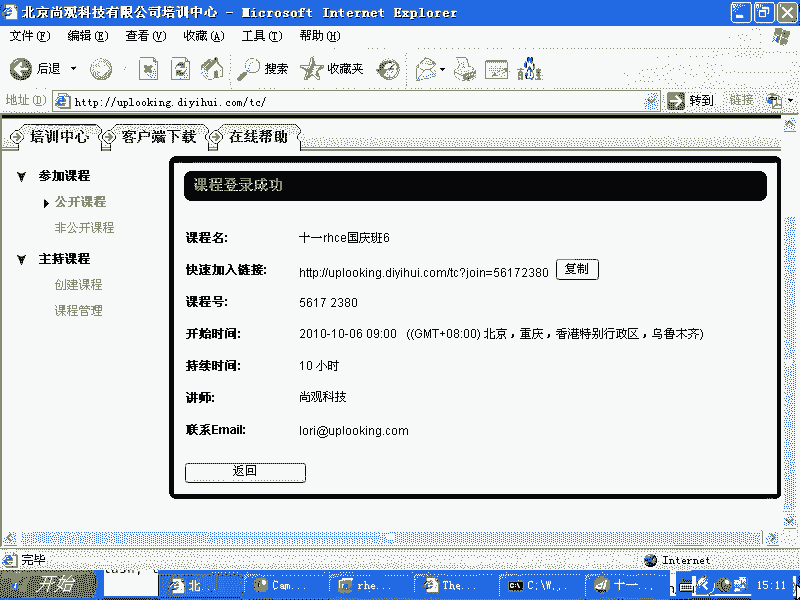

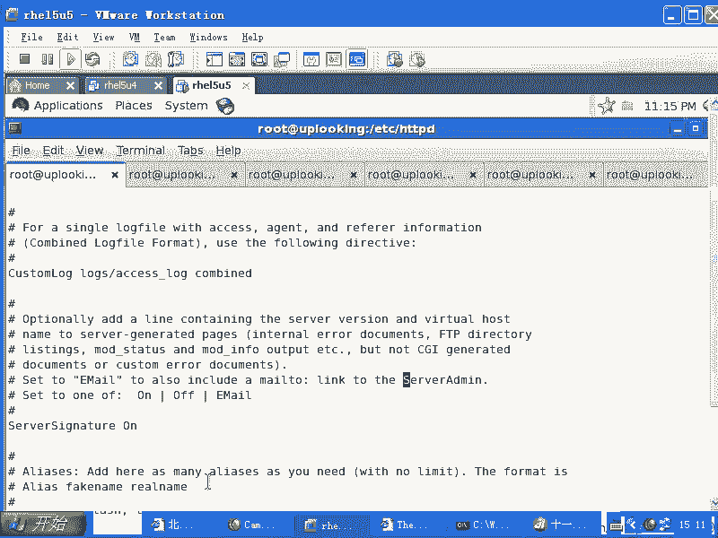

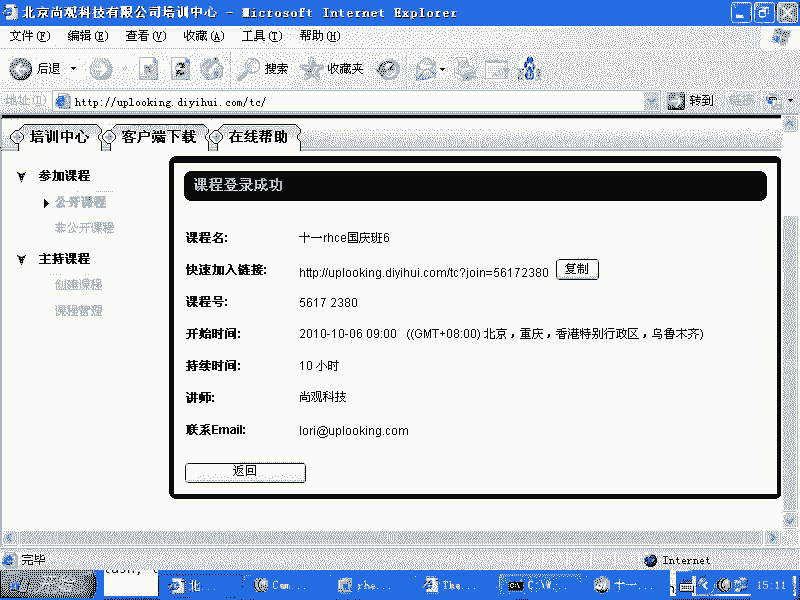

在本节课中，我们将要学习Apache HTTP服务器的虚拟主机配置。虚拟主机功能允许我们在单台物理服务器上，通过一个IP地址和端口，承载多个不同的网站。理解其配置逻辑是掌握Apache服务管理的关键一步。

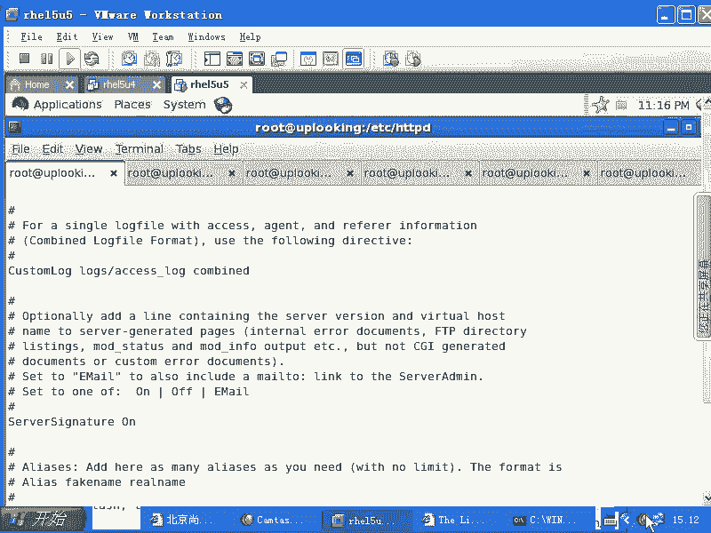

上一节我们详细介绍了Apache的主配置文件结构及其核心指令。本节中我们来看看如何利用这些知识来配置虚拟主机。

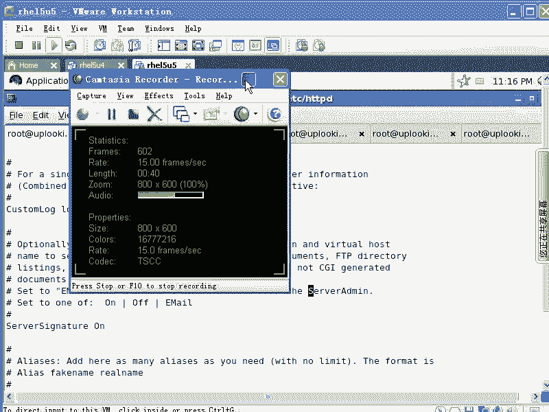

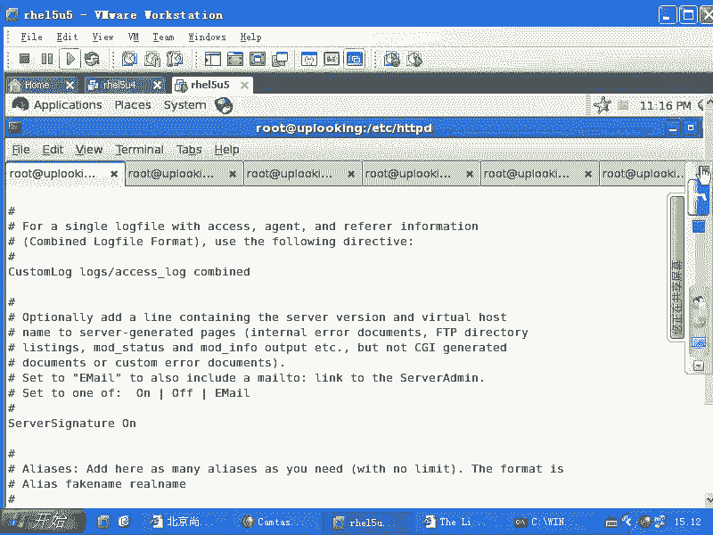

## 虚拟主机概述 🌐

虚拟主机解决了单IP服务器承载多网站的问题。其核心原理是：当客户端（如浏览器）访问服务器时，其HTTP请求头中会包含目标网站的域名（例如 `Host: www.example.com`）。Apache服务器通过识别这个 `Host` 头部，将请求分发到对应的虚拟主机配置块中，从而返回不同网站的内容。

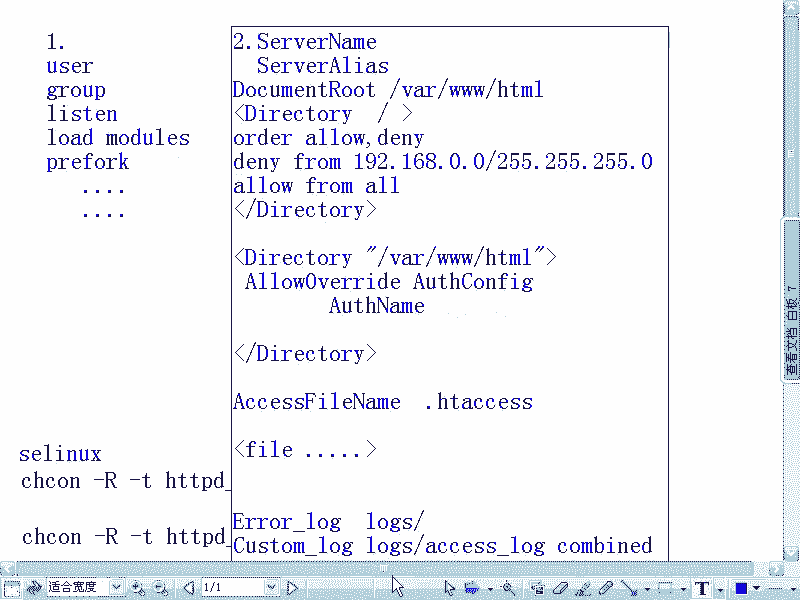

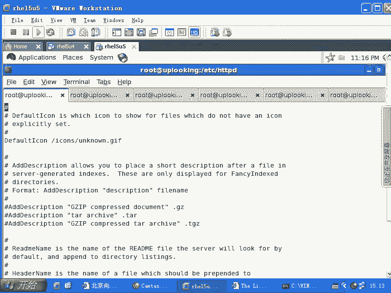

## 配置虚拟主机步骤 📝

以下是配置Apache虚拟主机的主要步骤，我们将基于系统提供的示例模板进行修改。

### 1. 启用虚拟主机并编辑配置

首先，需要启用虚拟主机功能，并在配置文件中定义具体的虚拟主机块。

```apache
# 在主配置文件 /etc/httpd/conf/httpd.conf 或额外配置文件（如 /etc/httpd/conf.d/vhost.conf）中操作
# 1. 找到并取消以下行的注释，以启用基于域名的虚拟主机
NameVirtualHost *:80

# 2. 复制系统提供的虚拟主机模板（通常位于配置文件末尾），并修改参数
<VirtualHost *:80>
    ServerAdmin webmaster@example.com  # 管理员邮箱
    DocumentRoot /var/www/example      # 网站根目录
    ServerName www.example.com         # 主域名
    ServerAlias example.com            # 域名别名（可选）
    ErrorLog logs/example-error_log    # 独立错误日志（可选）
    CustomLog logs/example-access_log common  # 独立访问日志（可选）
</VirtualHost>
```

### 2. 创建网站目录与内容

为每个虚拟主机创建对应的网站根目录，并设置适当的权限与SELinux上下文。

```bash
# 创建网站目录
mkdir -p /var/www/example1
mkdir -p /var/www/example2

# 创建简单的首页文件
echo "This is site example1" > /var/www/example1/index.html
echo "This is site example2" > /var/www/example2/index.html

# 设置目录的SELinux上下文，允许Apache访问
chcon -R -t httpd_sys_content_t /var/www/example1
chcon -R -t httpd_sys_content_t /var/www/example2
```

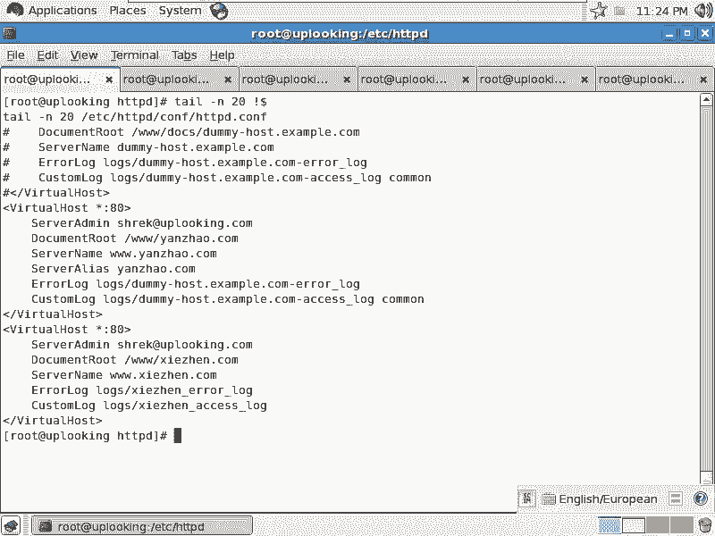

### 3. 配置本地主机解析（测试用）

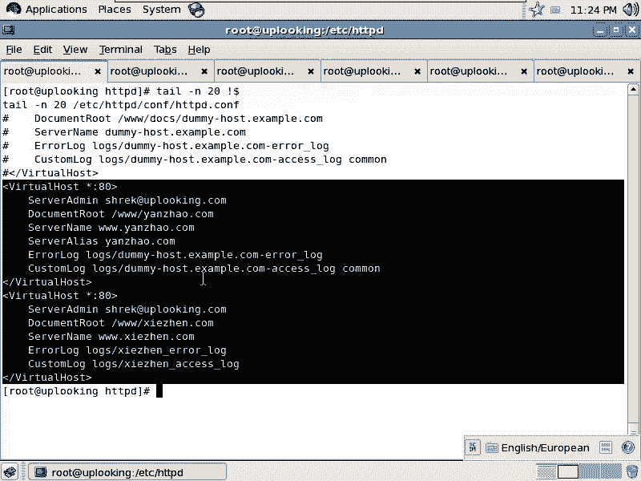

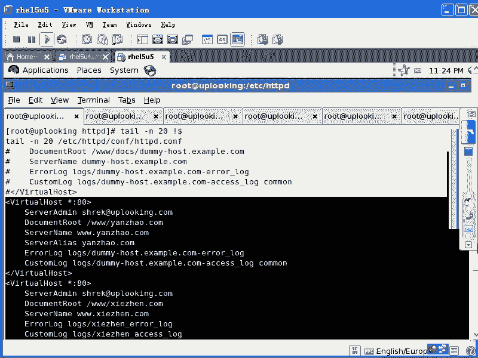

在测试环境中，需要编辑本地的 `/etc/hosts` 文件，将域名临时解析到服务器IP。

```bash
# 编辑 /etc/hosts 文件，添加如下行（假设服务器IP为192.168.0.254）
192.168.0.254   www.example1.com
192.168.0.254   www.example2.com
```

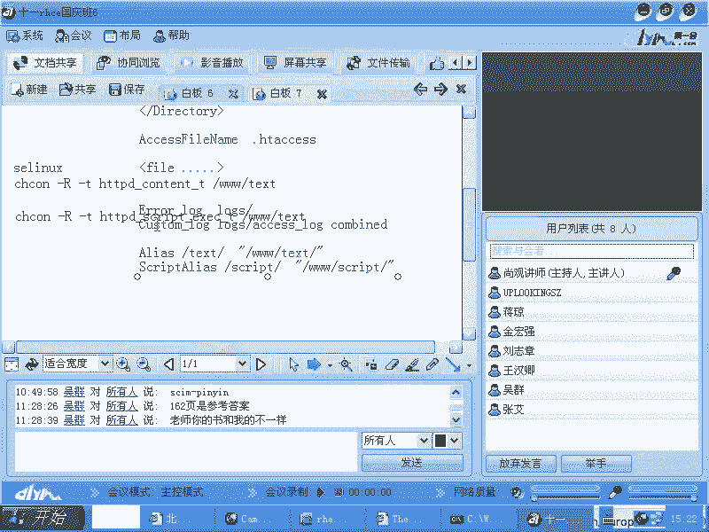

### 4. 重启Apache服务并测试

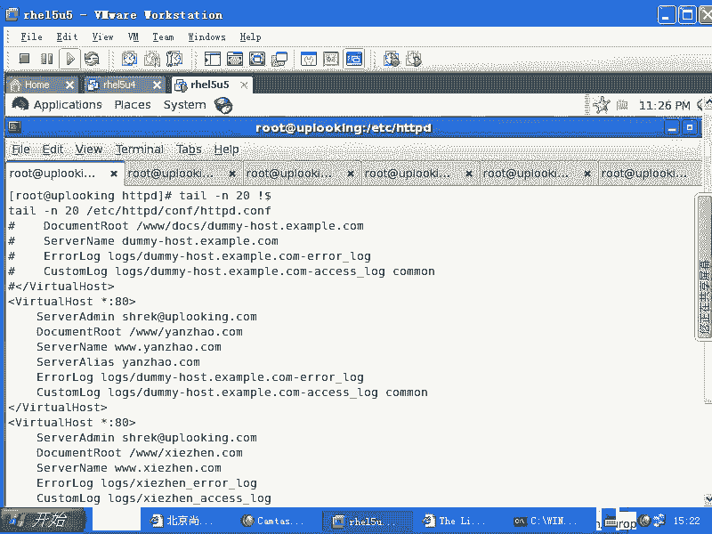

完成配置后，重启Apache服务使更改生效，并使用浏览器或命令行工具进行测试。

```bash
# 重启Apache服务
systemctl restart httpd

# 使用curl命令测试访问
curl http://www.example1.com
curl http://www.example2.com
```

## 虚拟主机内的其他配置 🔧

虚拟主机块 `<VirtualHost>` 内部可以包含几乎所有在主配置 `<Directory>` 或全局区域中使用的指令。这意味着你可以为每个网站单独设置访问控制、身份验证、重写规则等。

例如，你可以在虚拟主机块内添加目录访问控制：

```apache
<VirtualHost *:80>
    ServerName www.example.com
    DocumentRoot /var/www/example
    <Directory /var/www/example/private>
        Require all denied  # 拒绝所有访问
        # 或者使用基于用户的认证
        # AuthType Basic
        # AuthName "Restricted Area"
        # AuthUserFile /etc/httpd/conf/.htpasswd
        # Require valid-user
    </Directory>
</VirtualHost>
```

## 注意事项与常见问题 ❗

*   **默认虚拟主机**：配置了 `NameVirtualHost *:80` 后，第一个定义的 `<VirtualHost>` 块将成为默认主机。当访问服务器的IP地址或未匹配任何 `ServerName`/`ServerAlias` 的域名时，将返回此默认主机的内容。
*   **配置检查**：修改配置文件后，务必使用 `apachectl configtest` 或 `httpd -t` 命令检查语法是否正确，然后再重启服务。
*   **日志文件**：如果未在虚拟主机块内指定 `ErrorLog` 和 `CustomLog`，该虚拟主机的日志将记录到全局主日志文件中。

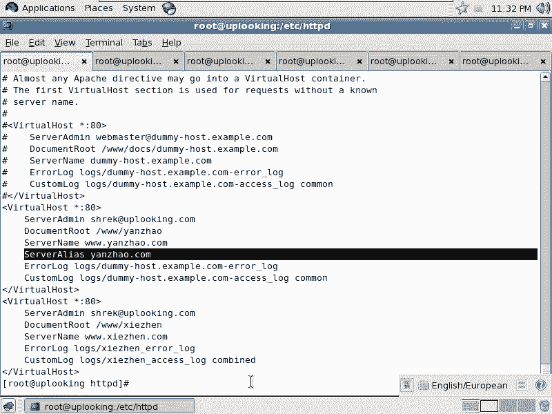

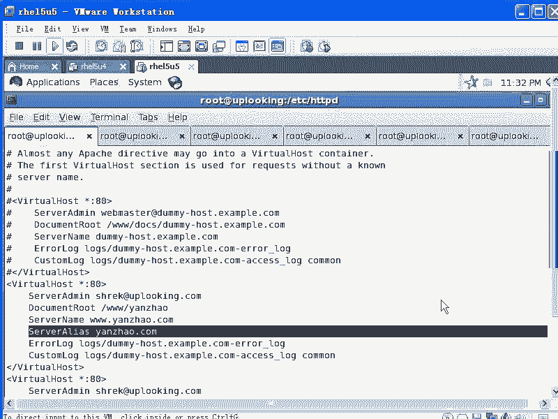

本节课中我们一起学习了Apache虚拟主机的配置方法。我们了解到，虚拟主机通过在配置文件中添加 `<VirtualHost>` 块来实现，其核心是 `ServerName` 指令。配置过程包括启用功能、定义主机块、创建目录、设置解析和重启服务。虚拟主机内部可以灵活使用各种指令，实现精细化的站点管理。掌握虚拟主机配置，是高效利用服务器资源、托管多个网站的基础技能。