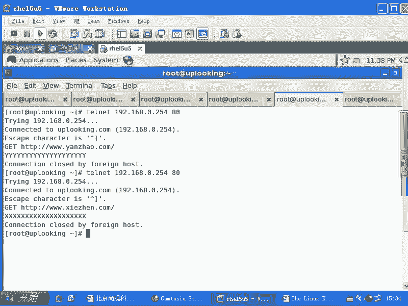
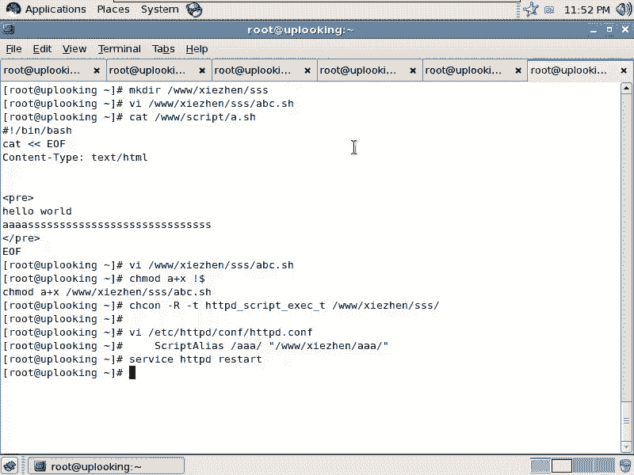
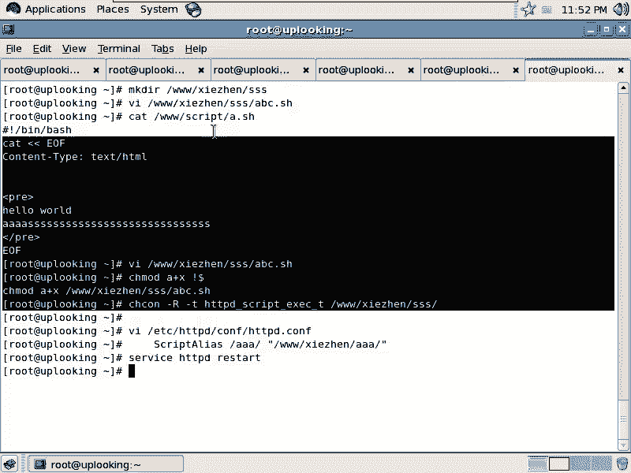
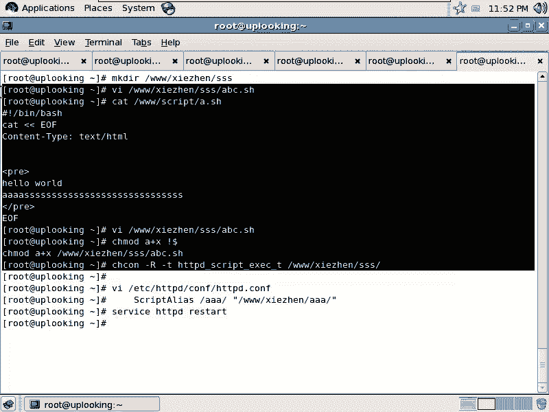
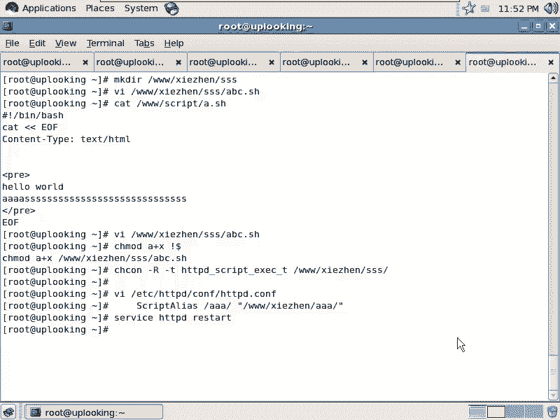

# 尚观Linux视频教程RHCE 精品课程 - P83：RH253-ULE116-8-4-httpd-cgi - 爱笑的程序狗 - BV1ax411o7VD

好，我们看一下CGI。看CGICGI的话呢，就是我们的这个相当于非常古老的一种什么命令格式。其实我们现在深入去理解这个HTTP协议，或者深入去理解这些命令，或者深入去理解我们的appart逐渐的话呢。

就会有一种这个编程人的这种感觉，是不是？那当我们去写这个程序的时候，你说啊原来我去get一个请求这个链接，对方给我发回来一个页面，是不是这个页面是怎么生成的呢？如果你是PP页面，由PP的这个模块生成。

对不对？如果你是其他的页面呢，那就由相应的程序来动态生成，对不对？那现在我们想这个程序假如说就是我们非常熟悉的el行不行？ shell行不行？你要说我在这边执行个命令，可以让它自动关机是吧？

在这个上面我点击某个按钮，让它自动关机可不可以呢？😊。

当然可以了，你平时的话采用那个无线路由器，是不是无线路由器里面，你说关机重启是吧，也有这个按钮的。😊，完全可以达到，是不是？只不过让他去调某个命令就好了。所以我们现在看他怎么去调命令啊。

现在话呢我们的appartache。😊，它默认情况下啊，帕器的默认情况下，比如VIETC项目的呃HTTPD当中的抗复当中的HTTP。D点com对吧？这里面的话呢，你去找一下。我又是用那个什么那VIM啊。

VM。那么。这里面的话你可以找一下script。Alia。scriptcr alien默认情况下就有个什么CGI bin啊，CGIB这个后面这个的话呢是我自己定义的，后面这是我自己定义的是吧？然后呢。

在这个CGIB里面的话呢，你就可以放什么可执行文件。😊，如果要是你的这个别名没有用scrip alien去定义，它就不允许执行了。它就不允许执行这个目录啊，那我定义了scriptcr alien。

现在我把一个可执行文件丢到那个目录下去，只要给它加上可执行的权限，它就可以运行了。它就可以运行了。然后我们看一眼啊。这个script alien。C加B这个地方，我可以把一个可执行的文件放到那里面去。

但是我这边的话呢，我定义另外一个，比方说我去定义了一个。我定义到我的新主机当中，新主机当中可不可以啊？完全可以啊。那我这边定义这个script在那个呃就是写真那里面啊。

定义了一个什么script alien script alien，我这边的话叫做什么呢？SSS是不是SSS这边的话呢，执行这个脚本的话呢，就在在呃写真啊，这里面的话呢。SSS这个目录的话呢。

是我们的一个写真目录。保存并退出，我定义好了scrpe aliens HTTVDrestar。然后呢，我再去创建它。我再去创建怎么样创建呢？MakeDRR。3W目录下的写真是吧？

然后呢加上1个SSS是不是创建出来以后。是吧创建一个目录。然后呢，我接下来的他话我要怎么样CHCON是不是杠大R哎，我先我先不去这样的，我去copy一个文件，呃，我去VI一个文件。

对吧然后我把这个文件的话呢，名命名叫做什么呢？呃，ABC点SH打开这个文件以后，我在这里面写的是一个标准的s格式，井感叹号开头是吧？演员谁啊？飞翔是不是BSH然后呢，我在这边用icical。

apple什么呢？apple。康。text哎，content。看一点吧。这因为又涉及到C，又涉及到那个HTMR的那个头了。如果你写的有问题的话呢，它就显示不出来内容。忘了。是不是昨天我刚刚写过这个脚本？

是吧然后今天就忘了。算了，我看一下那个文件。看。3W当中的。script当中的A点SH啊，也就是说你前面的话必须得以什么countent杠 tap啊，然后呢来来开头。那我这样的再去VI那个文件。

再去VI那个文件。那么我这边。井感叹号啊。对应下的DSH是吧？然后在这里面的话呢，是这样的。第一行必须是这样，那我这样的ecle一个这样的值，是不是？我为了避免ba shell的话呢去干扰它。

那我最好加什么单引号啊，单引号的话呢，背 shell就不管了是吧？然后呢，再去ecle一个回车是吧？ecle一个空行，然后再去ecle什么呢？内内容了说。This。Is。呃 c g i。Sep。是吧。

对。然后呢，我现在的话呢想去执行一下LS我看一下连接上去以后，它默认的目录是哪个目录，是不是我去执行一下。LSLS有输出，它就会显示出来。然后呢，还可以还去执行一下什么呢？呃，ele呃就是set。

我可以看一下环境变量吗？对不对？我看下环境变量，然后保存并退出。写完这个脚本以后的话，我再怎么样？CHMOD是吧？A加上1个X是不是我把它的话加了个X权限。

这时候你去直接执行它是不是SE量词还要从中做梗，还要从中作梗是吧？所以CHCON我们把它的这个权限改成什么杠T。HTBD是吧，下划线唉，中个唉下划线HTTBD。script是吧。EXEC是不是向面T。

然后呢。在这个3W当中的。写真。目录下是不是SS目录是不是全部都改一下。然后现在的话呢，我们再去访问。O。现在话我输入什么？3W点写真点com是不是加上一个什么呢？SS是不是加上1个ABC点SH是不是？

直接回车。而家。ABC。眼砸了。啊。😮，这时候我们还是要看一下什么我们的这个错误，是不是它的air log是不是在tail杠F是吧？然后呢，我们的。Y下的log当中的HTMTP是吧。

写真L log是不是？是吧。然后呢，回车。他是什么？哎。没加一杠吗？这个错的，是不是？没加一杠吗？加的呀。那怎么会帮我转化成这个。那个样子。他又多了一条，是不是？还是访问这个。所以我的还要差不出听吗。

我这枪去掉。哦，对，要加上是吧？这个地方没加，是不是？😮，这个地方是不是最后没加？是不啊，这儿没加啊。这个leaux的话呢，就是这样，你要是做一个实验，一下子就成了，那简直就是什么？😡，哎，不对劲呢。

是不是？是不不对劲，然后呢，没事成，那很正常，是吧？😊，让大家习惯。看啊。Yeah。看到没有？他说这是这个脚本是吧？LS的一下，什么东西都没有是吧？是不是？哎，不是LS的一下的话，就只有这一个文件。

是不是？是吧接下来的话呢是环境变量，是不是？这环境变量是呀。这是什么东西？是刚才拖了一下是吧，拖拽了一下。我们再来看一眼，你再看一眼。我再改一下吧，我再改进一下这个脚本VEI。呃。3W当中的。写真是吧。

然后呢是。SSS当中的。ABC这个文件。那么我这边知道了哦，原来。他连回车都不会给我回车的是吧，为什么不会给你回车呢？因为这个HTML的页面当中回车是应该是另外一个符号是吧？叫什么来着？😊。

叫做空格是一个，然后回回车是另外一个。提交。TRDR。DRT2。T2。是不是啊？对吧。对不对？对吧。现在这样把它另退出，然后再重新执行。没有啊。诶。DR没回车啊，他。D二。到底什么回车？地还是。BR哈。

是不是B啊。一对儿啊。这样的。BR还是TR是TR是吧？😡，啊。😮，有点事。写疗规。不吃这碗饭就不行啊。哎。成了。哎，好像还是不成。我只写了一个是吧？是BR是吧？你先不管那么多啊。

看这是不是显示的东西就很全了，是吧？他说在你这个目录下，是不是？啊，这个目录下有一个文件，是不是？是吧嗯当时的环境变量是不是都能显示出来？啊，你要再给他调一个什么砂档是吧？调用砂档的时候，那个砂档的话。

再用个SU do来做砂档，是不是？然后no password做杀档是吧？可以让它关机或者restar是不是IIT6是吧等等。你可以在VISU do的话呢，让它去执行看成不成啊。

也许系统当中已已经有什么反就是防止你执行这个这种命令的这种机制。但是大家看这个像普通的这些shall里面的命令是没有问题的，是不是？啊， ok。那这边的话呢，就是我们把这个CGI的话就执行出来了。

CGI的话呢。大家的眼界啊一定要看开一点，什么开一点呢？就是你既然你在这个脚本可以是卑 shell，是不是？那你能不能给他改成什么？能不能？en可不可以啊？可不演演员改成python是吧？

演员改成pro是不是演员改成其他的东西都行，只要这个东西它能什么输出，你能让它最开始输出一个这个东西，是不是？那你即使用C语言写了一个什么printf把它打印出来是吧？printf把它打印出来。

然后打印出这样串值来，然后再printf这个printf down，那它的速度就会很快。当然这是特别的应用，特殊的应用场合。😊，那我们一般如果要是写一个非常简单的东西，你可以这样去做啊。

这就是CGI脚本。明白吧？这样脚本，那么我们aparache怎么支持？我刚才已经跟大家说过了，太简单了是吧？做一个script alien。做一个scriptcr alien是吧？在那个VI那个文件。

咦。VIETCHTPD当中的c复当中的HTPD点com是吧？做一个。SC。SCIPT。Aです。然后再加上一个什么路径是吧，随便一个路径，什么什么路径，然后呢，再是一个什么真实的路径。

是不是你的真实的路径？刚才是不是我犯了一个错误是吧？我这边的话是3W当中的啊，比方说写真是吧？大。呃，ANA的时候，我后面少加了一个少少了一个杠，是不是就出错了。所以这个地方一定要注意加这行以后的话呢。

你加在哪个server当中，然后哪个server就会生效，另外一个server肯定就不生效，对不对？另外server肯定不生效，然后呢，再去怎么样？serviceHTVD是吧？restar。然后呢。

剩下的话呢，你在这个目录下该怎么做？那么这边我给大家做了一个例子，是不是做了个例子就这么简单。

是不是啊就这么钱的。

这边的话呢是在那个目录下，那个目录里面的文件是怎么样的啊？好。这个这这边内这些内容的话呢就到这儿。

