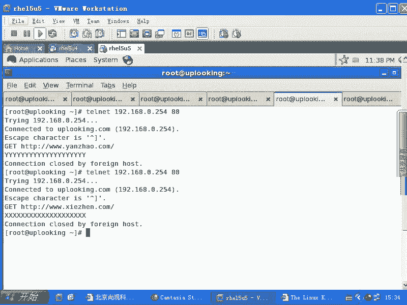
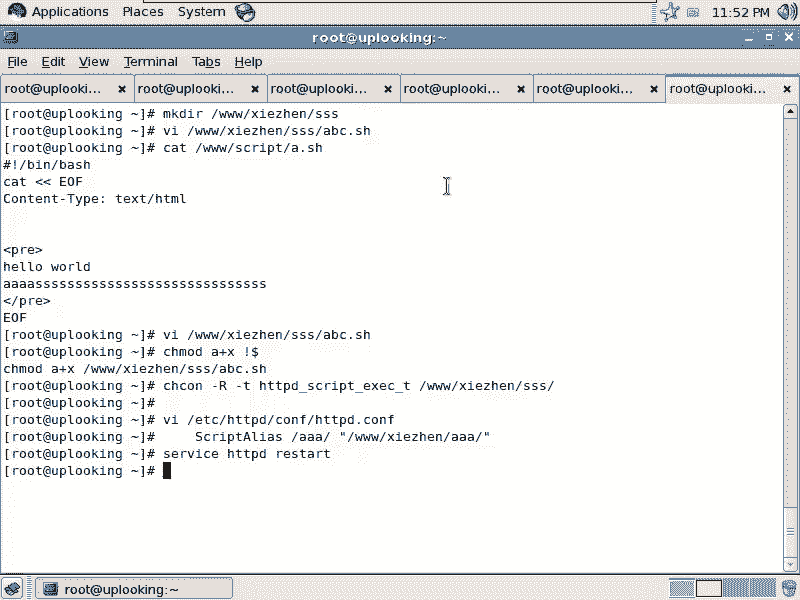
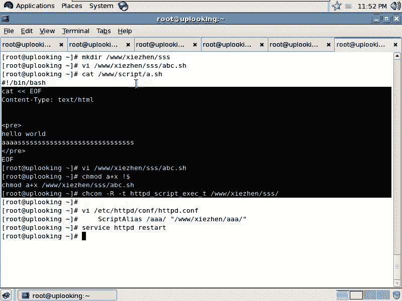
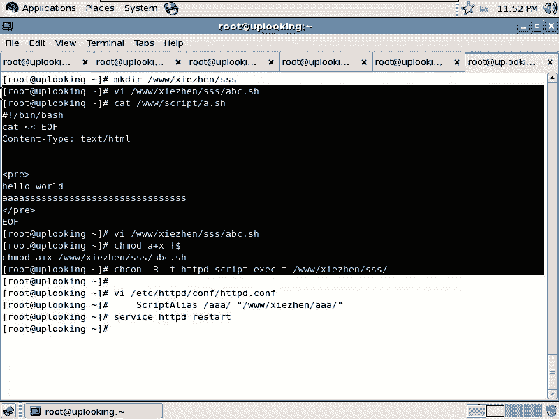
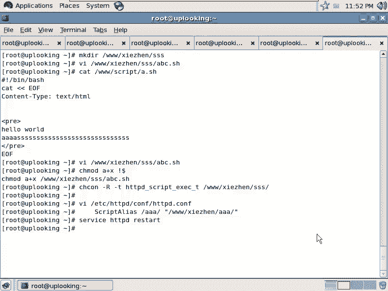

# 尚观Linux视频教程RHCE精品课程：P83：RH253-ULE116-8-4-httpd-cgi 🚀


在本节课中，我们将要学习Apache HTTP服务器如何通过CGI（通用网关接口）来执行服务器端的脚本或程序，从而实现动态网页内容。我们将从CGI的基本概念入手，逐步讲解其配置方法，并通过一个简单的Shell脚本示例来演示整个过程。



---

## 什么是CGI？🤔

上一节我们介绍了Apache的基本配置，本节中我们来看看CGI。CGI是一种非常古老的、用于在Web服务器上执行外部程序的接口标准。深入理解HTTP协议和Apache的工作原理，有助于我们理解网页内容是如何动态生成的。

例如，当我们访问一个PHP页面时，内容由PHP模块生成。那么，如果我们想让服务器执行一个Shell命令（比如关机或重启）来生成页面，是否可行呢？答案是肯定的。许多设备（如家用路由器）的管理页面就使用了类似的技术，通过点击网页按钮来触发后台命令。

---

## 配置Apache以支持CGI ⚙️

要让Apache能够执行CGI脚本，核心步骤是使用 `ScriptAlias` 指令来定义一个虚拟目录，该目录下的可执行文件将被当作CGI程序处理。

以下是配置Apache支持CGI的关键步骤：

1.  **编辑Apache主配置文件**：打开 `/etc/httpd/conf/httpd.conf` 文件。
2.  **添加ScriptAlias指令**：在相应的 `<VirtualHost>` 或主配置块中，添加如下格式的指令：
    ```apache
    ScriptAlias /虚拟路径/ "/真实服务器路径/"
    ```
    例如，为虚拟主机 `www.zhen.com` 配置：
    ```apache
    ScriptAlias /sss/ "/var/www/zhen/sss/"
    ```
    这表示，所有访问 `http://www.zhen.com/sss/` 的请求，都会映射到服务器上的 `/var/www/zhen/sss/` 目录，并尝试执行该目录下的文件。
3.  **重启Apache服务**：保存配置文件后，执行 `service httpd restart` 使配置生效。

**注意**：`ScriptAlias` 指令中，**真实服务器路径末尾的斜杠（`/`）必不可少**，否则会导致错误。

---

## 创建并运行一个CGI脚本 🛠️

配置好Apache后，我们可以在指定的真实目录下创建可执行脚本。一个有效的CGI脚本必须首先输出正确的HTTP头部信息。

以下是创建一个简单Shell CGI脚本的步骤：

1.  **创建脚本目录并设置权限**：
    ```bash
    mkdir -p /var/www/zhen/sss
    chcon -R -t httpd_sys_script_exec_t /var/www/zhen/sss
    ```
    第一条命令创建目录，第二条命令使用 `chcon` 修改SELinux上下文，允许Apache在此目录执行脚本。
2.  **编写CGI脚本**：在 `/var/www/zhen/sss/` 目录下创建文件，例如 `abc.sh`。
    ```bash
    #!/bin/bash
    echo “Content-Type: text/html”
    echo
    echo “<html>”
    echo “<body>”
    echo “<h1>This is a CGI Script</h1>”
    echo “<p>Current directory listing:</p>”
    echo “<pre>”
    ls
    echo “</pre>”
    echo “<p>Environment variables:</p>”
    echo “<pre>”
    /usr/bin/env
    echo “</pre>”
    echo “</body>”
    echo “</html>”
    ```
    **核心要点**：
    *   第一行 `#!/bin/bash` 指定脚本解释器。
    *   必须首先输出 `Content-Type: text/html` 和**一个空行**，这是HTTP响应的要求。
    *   之后的内容可以是任何有效的HTML。在HTML中，换行需使用 `<br>` 标签。
3.  **赋予脚本执行权限**：
    ```bash
    chmod a+x /var/www/zhen/sss/abc.sh
    ```
4.  **访问测试**：在浏览器中访问 `http://www.zhen.com/sss/abc.sh`。如果配置正确，你将看到脚本输出的HTML页面，其中包含目录列表和环境变量信息。

---

## CGI脚本的扩展与应用 💡

通过上面的例子，我们可以看到CGI的本质是让Web服务器能够调用外部程序。这个“外部程序”不仅限于Shell脚本。

*   **支持多种语言**：你可以使用Perl、Python、甚至C语言来编写CGI程序。只要程序能按照HTTP协议规范输出内容（先输出头部和空行，再输出HTML），Apache就可以执行它。
*   **应用场景**：对于简单的、需要调用系统命令或快速生成动态内容的任务，CGI是一种直接的方法。例如，可以编写一个CGI脚本，在网页上显示服务器状态，或通过SUDO配置（需谨慎）执行特定管理命令（如重启服务）。

**注意**：在生产环境中，出于安全考虑，应严格控制CGI脚本的权限和可执行命令的范围。

---





## 总结 📚





本节课中我们一起学习了Apache CGI的配置与使用。我们了解到CGI是Web服务器与外部程序交互的一种标准方式。关键步骤包括：在 `httpd.conf` 中使用 `ScriptAlias` 指令定义CGI目录；创建具有正确HTTP头部输出的可执行脚本；并确保文件系统和SELinux权限设置正确。CGI脚本可以用多种编程语言编写，为Web服务器提供了执行动态任务的灵活能力。