# 尚观Linux视频教程RHCE 精品课程 - P84：RH253-ULE116-8-5-squid - 爱笑的程序狗 - BV1ax411o7VD

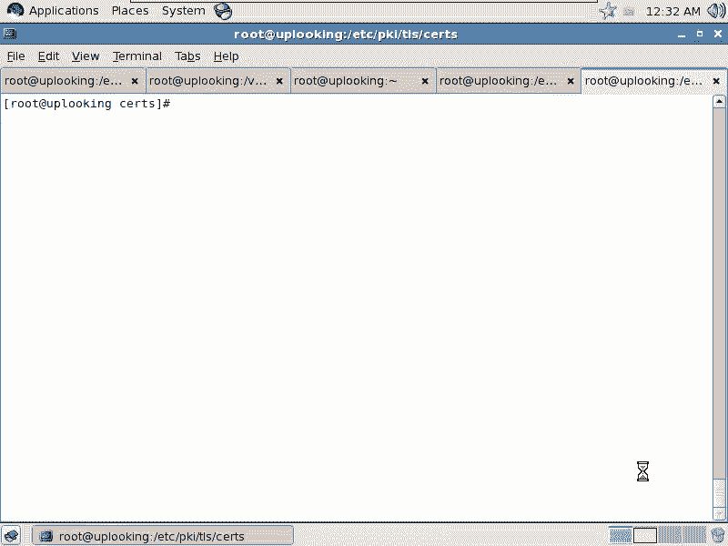

好，我们来看一下。就是我将给大家讲是讲什么东西呢？看一下我们的那个。

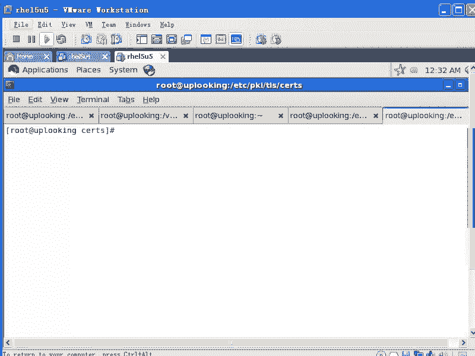

看一下我们的这个。相当于我们的aache的一个加速服务器，就是sscreend。这种类型的东西的话呢，统一啊有个名称叫做什么呢？缓存服务器啊缓存服务器这缓存服务器。

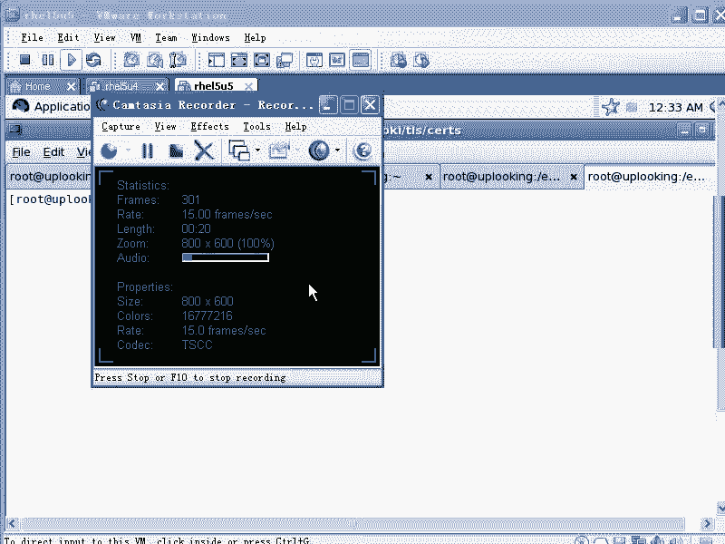

你怎么老冲着我笑啊？啊。😮，说的是么？发一就是发发短信给给给女朋友是吧？然后开心的。😊，哎，你冲我笑的话，我以为我哪个地方讲错了，我说。总是反省一下，当然刚才是出了个大仇是吧？回去的话，我看看一下。

我们先看一下sdETC下的SQID这个的话呢就是sd的目录啊。s的话呢它本身是一个。缓存服务器啊，就说我们的这个叫做什么呢ICP协议的一个服务器。

我们的appartache是不是1个HTTP协议的服务器，是不是ICP是什么呢？internet缓存协议。internet缓存协议啊，它比较怪。ICP协议的话呢，我们用的比较少。

但是呢它起的作用啊现在是越来越多了。你们听说过那个CDN吧？啊，CTN听说过吧？原来的话呢，在创业板上非常有名的一个公司，创被誉为创业板什么市值最高的公司，叫公司叫什么网速科技是吧？

因为他呢那个时候成天大街小巷的报道说这个这个公司的话呢，是以什么东西作为支柱产业，就是CDN。啊，就是内容分发网络是吧？内容分发网络。

它实际上它就在全国各地的话建了很多什么screened类似啊screen的服务器。当然还有其他软件，当是他们都提供的是ICNICP协议。就是internet缓存协议。

那么意思就是说你如果要是在上海打开新浪的网站，那你访问的实际上不是新浪的真正的服务器，是不是？而访问的是新浪的什么？在上海的一个镜像服务器。

或者说把内容已经缓存在新浪的那个就是那边的那个缓存sped的服务器上，明白吧？这就是CDN的一个基础啊，CDN的基础，所以它CDN的话呢，实际上就是智能DNS啊，它就等于什么呢？

DNS智能DNS然后再加上什么？再加上这个cash。智能DS再加上cash实际上就这样。那我们所谓的这个cash服务器的话，就是screenet。现在我们的appache。跟他的话呢是完全可以配合好。

当是他可以支持其他各种各样的HTTP协议，还有FTP协议。那么这就是我们所谓的什么呃，这就是我们所谓的这个缓存缓存服务器。所以缓存服务器的话呢，它的配置文件呃。

它的这个配置文件的路径的话就在这边ETCRscreend呃这个目录像，我们打开它配置文件SQUID啊点com这就是它的配置文件。那开华以后，你看到这边就是2。6啊，就我们的sd是2。6的版本。

大家一定要留心sd版本。因为版本不同的话，它的差异是极大的。差异太大。它的配置文件的话基本上是完全颠倒，就是说跟别人跟以前的话呢，2。4什么的就不一样啊，我们再看这边。最前面的话呢是它的一些选项啊。

最前面是它的一些这种选项。它的这个文件主要是什么？怎主要是怎么写呢？它的蛮配置的话呢是没有价值。但是它的配置文件从头到尾就是说每一个选项它都有大量的什么注释。你看它是不是是不是都是注释啊。

这个注释的话呢是注释我们第一个什么第一个配置的？就叫做什么呢？outPARAM这个是它的注释，就在下面明白吧？这它的下面话这么多，我们看到最后面啊，看到这个前面的话呢。

反正一般我我遇到这样的这个这这个配置文件的话呢，我是通常情况下我是这样做啊，GREP是吧？杠V进行反向选择，是不是？然后呢，以井号做开头的文件就怎么样那这一行的话就怎么样，把它删除掉，是不是删除掉。

就是我们的呃sreet点com，然后呢再传给谁呢？GREP杠大V。杠2杠V，然后呢再把空行删除掉，就是以井号呃，就是开头就结尾的空行再删除掉。这样的话呢，我们看到的它真正的什么配置的话没有多少啊。

它真正的配置的话呢没有多少，看到了没有？是不是用的是什么命令呢？用的就是这个命令。你可以记一下，就screend里面的话呢，它的配置，那它的这个配置或者是针对这个配置的注释实在太多了。

而且很多的配置都采用一个默认值就可以。我们的话呢在HCE里面的话呢，只需要知道什么呢？只需要这么知道这么一点就好了，只需要知道几个参数。😊，我们就对着这个来了。看到了啊。用这个命令看。

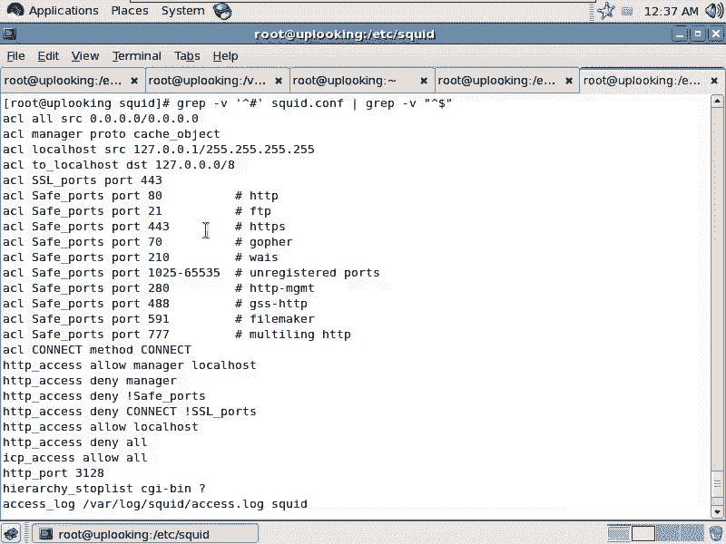

你要知道ACL是不是访问控制列表。😡，那他的这个访问控制列表当然跟我们文件系统访问控制列表没关系，是不是？没关系。它这用ACL的话，实际上是在定义一个访问控制列表要用到的一个资源啊，要用到的一个资源。

那ACL奥它定义了一个资源名叫奥这个奥的话呢是来源地址为什么？这么多，就是0。0。0，也就是所有的IP只要访问你，那它就是奥资源，明白吧？就是这个奥的话呢，我到底是允许还是拒绝呢？默认情况下。

大家看是怎么样？😊。

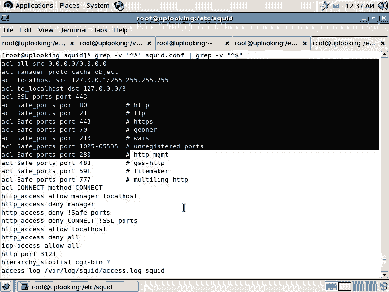

HTTP access be out。那也就是说我们的呃我们的screen默认情况是允许还是拒绝呢？拒绝所有人是不是是不是拒绝所有人？对不对？然后我们再看。😊。

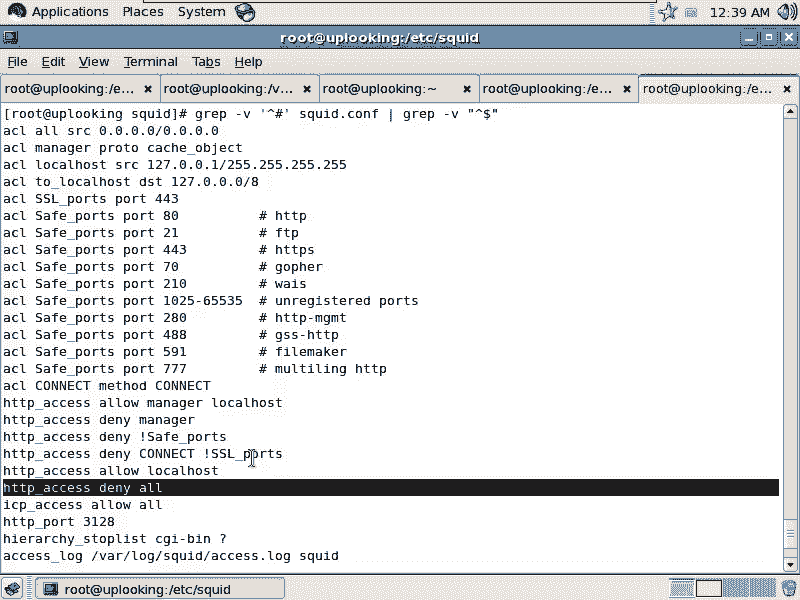

知道它的间价结构了吧，前面的话呢是用ACL命令来定义资源，是不是？😡。

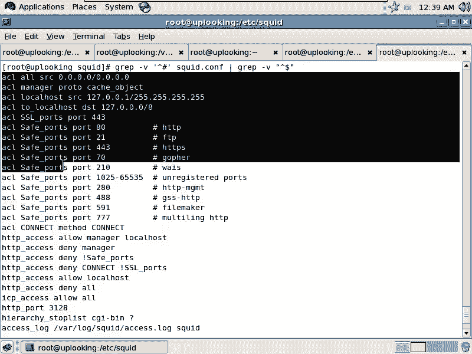

我们说这段资源叫傲。啊，这段资源叫什么呢？manager，这段资源叫什么local host啊，这段资源叫做to local host。但是这边的话呢，大家看的是SRC是不是来源了。DST是不是目标啊？

也就是说来源是127。0。1的话，那它叫做什么local host，目标是127。0。0。0的话，那它就是什么to localal host。叫两个不同的名字，对不对？这些资源我都给他起好名字以后。

我到底是允许还是拒绝。那么HTTPaccess是控制允许和拒绝的这样的一个命令。你白吧？这个选项，那默认情况下，他是不是拒绝所有人？😡，那假如说我们的系统化要求大家。允许谁呢？

允许其中的某一个网段拒绝某一个网站，大家会不会？OK现在的话我在另外一边打开这个文件啊，我现在在。😊，VIETC下的screenet当中的set。点com是不是我找到。我往下翻啊，这肯就翻的没影了。

我还是打开用VIM打开它啊，要不然一会儿记不住位置，如果要是出来。我这样的选项，你看前面全都是什么，全都是。星就是那个蓝色的注释是吧？我们看到哦这个ACL这个地方看到了，是不是？那现在话呢。

你能不能照猫画虎来看一下。假如说现在我想允许我本地的这个网段，然后呢通过我代理服务上网。但是呢我现在不希望外网的人通过我去代理上网，是不是？这时候话它就有问题，我们必须得要做这样的限制。因为啊。呃。

这个等价我再讲，就是我们有一个呃就是搜狐的一个我原来一个学生啊，他有天跟我说，他说他犯了一个错误。犯了什么错误呢？他有一次设置那个他的这个前面的加速服务器，他设置的没有控制别人。

没有控制别人的这种缓存行为。然后有一个人的话呢，就以本来是给搜狐的加速服务器作为代理服务器，然后呢，登录到某个网上去发了一个什么特别。反动的消息是吧？于是的话呢，人家调查这个IP地址，调查的是谁呢？

搜狐的，因为你是人家的代理服务器嘛。是不是那本应该限制是什么呢？他应该做好限制，说只允许我的代理服务器访问搜狐的网站，这样才是对的，是吧？那你不能通过我的代理服务器访问谁呀，访问其他网站是吧？

所以这种访问控制是必须的那现在我想实现一个什么功能呢？就是允许我内网的人通过我代理服务上网，其他人都不得允许使用我的代理服务器。如果你全都开的话，那将门户大开是吧？那你就说像马路上所有人说什么。

我可以你帮你们做任何事情是不是。那就候别人说那你帮我什么，你帮我去。😡，啊，就是说送个快递到什么杭州去好了，然后呢，你会做我吗？你不会做。但是你们公司的人说你帮我送一个快递到杭州，这可能是你的工作。

对不对？所以这个时候要做限定，我们加上一个什么。ACL，我这边加上一个什么呢？公司内网是吧？那么我叫company。啊。In night。那我这个叫做SRC，我知道它的IP地址叫192。168点。

什么呢？零是吧，到24是不是我定义好这个资源，就是公司内网的资源。当然了，如果公司内网不止这一块，我还可以再往后加。191是8点什么，1。0也是我的，是不是？那我在这边。😊，定义好这个。

我再定义好敌人的网段。是吧外网。Other night。或者我定义成什么呢crarackcker啊。Crackcker not。然后呢，这边是1921的8。0。0，是不是21。0。24。那其中的话呢。

其中的话呢，我这边的话再去定义一个好人，就是这个坏的网络当中它有一个好的机器。ACL啊，然后go。钙怎么拼啊？GURY是不是？我怎么总觉得像gay。是幼玩吧，是不是？和GUGUY。啊。没有啊儿。对。

然后呢，SRC我把其中的1个1918。0呃，1。21这台机器是不是这个IP地址的话，我认为是什么？好人是不是？对不对？这是个好人是吧？那现在的话我是想什么呢？允许我内网和这个好人来访问我。

但是呢那个坏蛋我就拒绝了。😊，可不可以做到呢？那你往下翻一下的话，你会发觉默认情况下它是HT accessces，是不是？这个的话呢是有先后顺序，跟那个IP table是一样，谁排在前面谁先生效。

是不是？那我现在这样的。alongong谁呢？along我们的呃comper。内IN night是不是？还 much HTPP啊access。好 long。歌。该是吧。那B怎么拼啊？GAY是吧？😡。

HTP啊。Access。deny是不是是什么呢？others哎是crarackcker是吧？recognize，对不对？了解了没有？啊，这个东西的作用啊还没有。

就是这个的话呢就已经达到我们2CE的要求了。你把它保存退出以后，一reard就完事儿了。还有两个选项，你要记住啊。一个是什么呢？一个是呃。一个是port。Pt。port时代啊HTport。这个port。

这个po的话呢，后面加3128，这表示默认它是启动3128端口是吧？你可不可以把它改成其他端口啊？就是你如果要是可以改的话，你就改这个参数就行了，是吧？你要改的话，改它这个参数就可以了，是不是？

这个po可以改。然后呢还有一个参数叫做cash memory。cash memory CAACHEMEM这个的话呢，你找到什么这个地方默认它是占用8兆的。也就是说你的缓存服务器的话是占用8兆的内存。

这个肯定不够。所以一般情况下我们怎么样呢？你要是占用什么呢？占用500兆啊500兆。还有一个参数叫做什么呢？Cash DR。cashDNR的话呢是说你的内存呢，如果要是被那500站被占满了以后。

那么你把这个内存就是那个缓存下来的数据是不是放在本地啊？放在本地，那么放放在哪个地方最大占多少，用的是什么文件系统，用UFS放的是这个地方。那么总共的话呢是100兆的空间，然后呢，有16个子目录。

256个孙子目录。每个也就是每个子目录下再有16个目录，明白吧？总共的话是256个村目录，明白吧？这样的话呢，你已经达到什么HCE的要求了，明白不明白？明白了吗？你搞定了，保存一退出。

你的机器是不是就允许192。168。0。0去访问，同时允许121127呃，就是1921的8。1。221访问，是不是这样？允许了两个网段，是不是1个1918。0，一个是192。18。1。21。你看都明白？

啊，我这样的保存保存一下啊，我们再看。刚才那个，然后呢我再去运行这个命令。你看我在这边的话呢，加了一个什么呢？company。and in night是不是还有一个是什么呢？good guy。

还有一个是什么？呃，crarackcker night是不是？然后呢，我让他们允许或者拒绝的话，我把它排在最前面，是不是允许或者前或者是拒绝的话，我把它排到最前面。这个的话这跟IP table一样。

谁排前面谁生效，是不是这样？OK这个搞清楚了以后，我们再看啊我们再看。😊，搞定了，然后的service。对的。一重启，那么play的话呢，它就会正常启动起来。启动起来。第一次启动的时候。

它会帮你把那个它自己的那个cashDIR，然后呢进行什么格式化啊，然后把我们的目录创起来。创建起来以后，然后你运行一个night state是吧？呃，night state。杠ANTTP。GREP。

SQID。那你发觉SQUID的话呢，监听着3128端口是不是？然后你可以这样测试一下，te night。19218。0。254下的什么3128是不是？然后呢，这样呢，我说我想去查看什么网站呢？

3呃get然后HTTP冒号2杠3W点呃。艳照是吧，点com。这边能出来吗？没出来是吧？人家被拒绝。

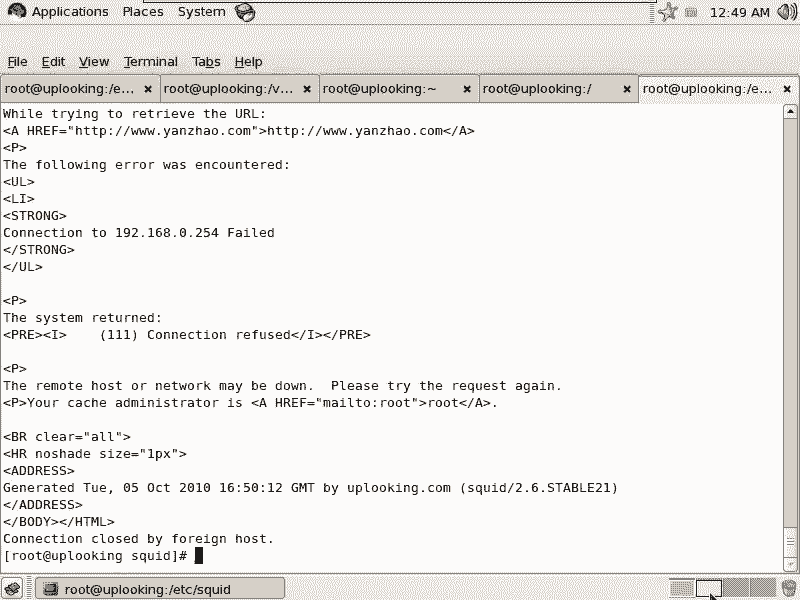

不对啊，那个怎么着，他都应该是没有问题的。看一下啊。代理服务器在哪设f。啊。😮，在哪儿？拿货。Starting。1求2168。0。254是吧。3128。Yeah。HTTP。看一眼啊。验证。

刚才话是paache没有启动是吧？看一眼是哪出错了。刚好也是个演练。那们2C考试的时候，如果出现这种问题的话，要自己去自己去查看一下啊。看一下。Long covers。是刚刚刚刚出现。时间啊。た。

现在是。SE这那是哪个地方出问题呢？嗯。您哪有问题。C是感觉以当中的。com点地下的SSL。这个我刚才那个play的应该没什么太大问题。就是我把这个地方话。骑用的是候。先这木SSL。靠。哦，这个。

把这个文件的话呢，先。目的当前的目录下。然后呢，senceHTPD restartstar。让它重启起来，一个SSL的问题是吧？那我现在这样的话呢，把它重启起来，然后我再这样访问一下。没有问题的。

对不对？你看到。其实的话呢这样看不出效果来。我先把我刚才那个做的那个操作的话呢，先给它取消掉啊，就是说代理服务器实际上大家都可以去都会去做的，是吧？是吧。

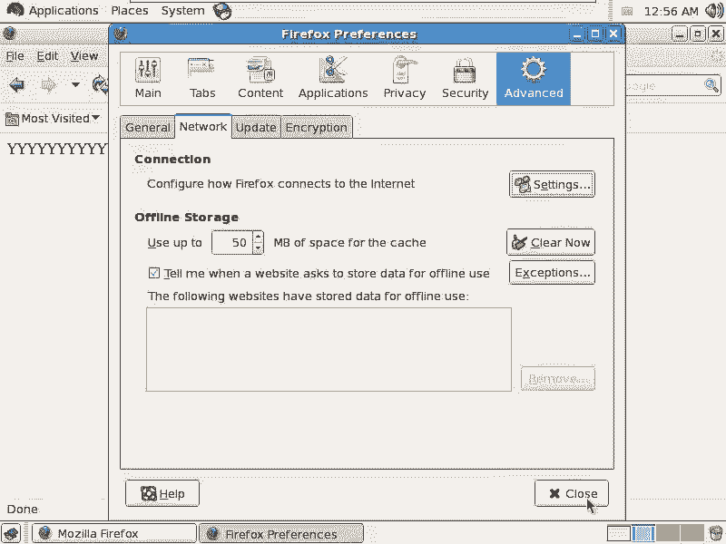

那么我用telnet方式的话，去给大家看一下tnet。然后呢，1921的8。0。254，在我tenet3128端口的时候啊，318端口的时候，我输入一个什么getHTTP冒号2杠3W点呃。艳照是吧。

点com。你会发现这个命令跟直接跟阿帕ache服务器打交道是一样的，是不是？是不是其实的话呢，它也是响应HTTP的请求。他也是想用HTV请求，你完全可以这样的话去测试一下，是不是？然后呢。

如果要是我们去tellnet到呃，就是tenet它到1。254的时候会怎么样？然后呢，我在这边。输入是吧，我说get。HTTP然后呢两杠。三 w点啊。艳罩点com。对吧。是不是就出错？说明什么呢？

大家仔细看啊，刚才我去访问。0。254的时候，我用的是自己的0。254访问自己的0。254的3128端口是吧？那这时候来源是什么？零这网段是吧？然后我换成1。这个1。254的时候，那我就相当于1。

254这个IP连接自己的1。254的这个这个端口，3128端口，它就被拒绝了，是不是？这很正常。啊，所以的话我这个刚才那个访问控制是不是已经实现了？对。每一个服务啊，大家既要什么呢？

会就是基于IP去访问控制，还要基于什么呢？基于这个主机名。他这里面的这个主机名该怎么样去写？这个里面主机名应该怎么样去写，这是个问题啊。还有一些还有一些的话呢，可能大家非常有用的东西。啊。

在前面的话那个注释当中都有。你看这个前面的这个帮助啊，就是ACL这个帮助是很多的。ACL的这个帮助是很多的。我看一下。如果要是允许某一个网段或者拒绝某一个网段，比方人家说你如果要是啊预拒绝什么呢？

拒绝点crack点ORG来访问你行不行啊？你看到这边了吗？叫做ACLACL name，然后呢SRC等慢看到了吧？现在我想让大家除了拒呃除了这个拒允许那个1。218。0。0这网段。

还要允许点example点com拒绝crackcker点ORG怎么办呢？这样的ACL是吧？然后加上一个什么呢？我们的C呃。name就说我们自己的这个公司的名字是吧，comp name。然后呢。

就要加要加上什么SRC。都慢。啊，SRC动漫RCRC动漫，然后加上个点什么点example。点comM。当然你还可以后后面还可以再往下写啊，还可以写很多。比方说还想允许谁谁谁AAA点com也允许。

对不对？你就往上去写就好了。那么我们在这边的话呢，还有一个就是什么就是一个C name啊，然后这边有一个什么呢？SRC等。😊，这边的话是点crarackcker。Yeah。ORG这边的话我要拒绝。

等一下我要拒绝。那么我在这下面的话，我就可以直直接讲ACL是不哎，那个HTTP是吧？Aess。al long什么。哎，错了，就像C那。C内。然后呢，HTP。Ss。deny是吧。

如果要是你想在允许和拒绝之间，还要允许crarackcker里面的一个好人，是不是那个好人叫什么来着？good guy是吧。没有吧，这个先后顺序调会调吧。然后呢，想允许什么呢？呃，这个前面的话呢，HT。

刚才我不是还定义了一个。叫什么呢？company是吧。INN night是不是？这样的话这个先后顺序自己写好啊，再去deny什么呢？crarackcker night是不是？这样的话呢把它写好。

然后呢再去验证一下自己tnet到06IP1这个IP试试看是吧？石汉。这就是我们的sed的基本使用。但是sd的话呢，大家仔细看下面的这些下面的这些帮助啊，可以说是太有用了。因为scrd的高级配置的话呢。

在你的大型服务器里面的话，用的是非常多的。大型服务器器里面用的非常多。你看这边是不是还可以定义DST动脉。假如说你现在的这个机器是给自己内网的一个机器做加速用的。我们现在做的是什么呢？

大家一块利用我的这个服务器代理上网出去，是不是你还可以把这个机器的话呢，做加速用为我内网的一个服务器做加速用。也就是它这里面的话有缓存缓存我内网的机器。我内网的话呢，实际上是一台服务器。

但我前面的话可以加10台什么对的缓存服务器，这10台机器的话都可以应付别人的访问，是不是？这样的话我的速度就大大提升了，那你就可以什么呢？允许什么？

只允许别人访问DST漫只允许别人访问比方搜狐或者新浪或者163是吧？也就是DST domain漫是什么？

DST domain漫目标地址为点163点com也就是别人访问3W点163点com的时候就怎么样al允许是吧？访问其他的域名是怎么样去拒绝，对不对？

那么它只允许访问DST漫为什么163W163点com是不是前面这。😊，话呢就是我们可能一般进行的这种代理上网的访问控制。那我再给大家写一个什么呢？写一个反向加速服务器的这个配置。这个反向加速服务器的话。

我们看。假如说你现在在给我们的内网啊，再给我们的内网做加速服务器。这边是DST抖漫的这个正则表达式，你后面可以加杠大I，就是忽略正大小写，然后把正则表达式写在上面啊，这是更进一步。

那么我们如果要是呃再去简单点的话，那就这样。现在的话呢我可以这样的定义。我现在想做一个什么东西呢？做一个我们公司自己的就app点com。uplooking web啊 webb服务器的加速服务器。

那么我这边的话呢，为的是为谁做加速呢？为我们的up lookinging。点com点点com做加速。这个时候它是访问目标的IP不是来源了，来源任何地方都可以来。但是呢它是必须访问我的目标。

是不是访问我们的目标。那我这边加上一个什么ACL啊，不是HTTPD啊，HTBaccess。

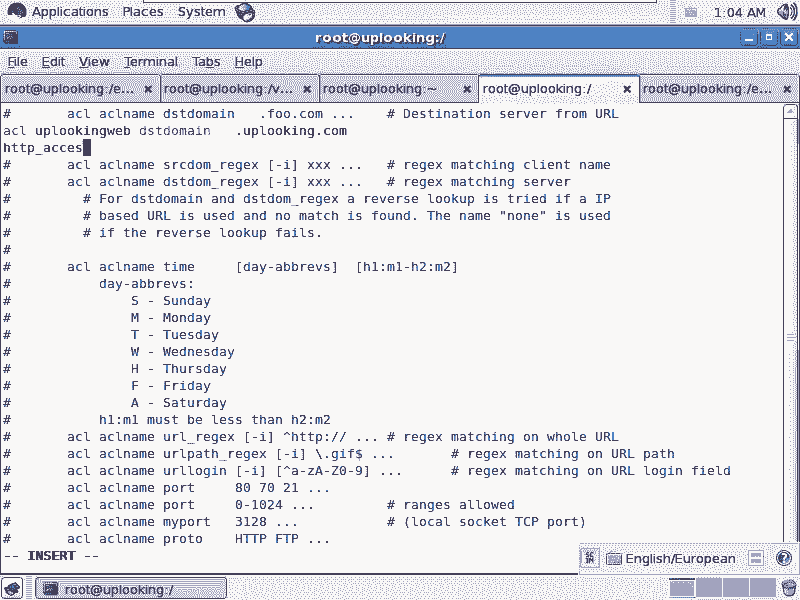

然后呢，along。谁呢？up looking。外只要你的目标地址是这个网站，我就允许你访问，对不对？现在的话我就做了一个反向加速服务器，也就是实质上的话呢就是这样。😡。

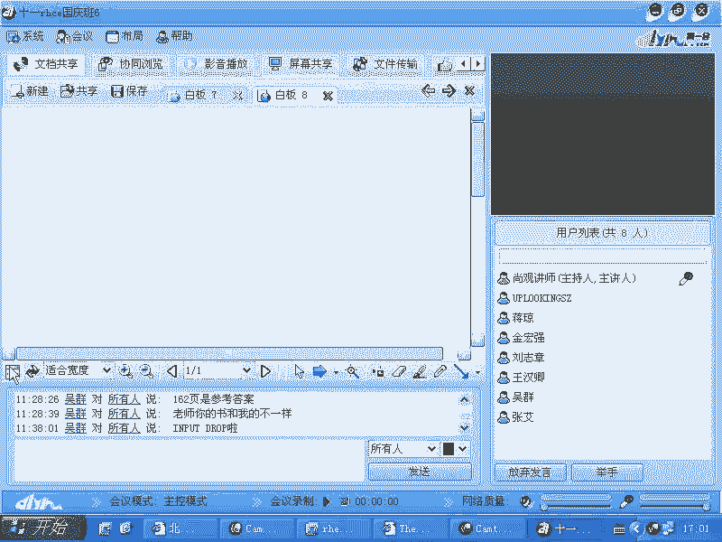

我们刚才的话呢给大家做的是一个代理服务器，就这个服务器。然后呢，我们可能有很多的主机，把把这个把把我作为他们的一个什么呢？把我做他们那个代理服务器。大家的话呢想上网的时候，他们上的是很多很多网站。

是不是？我这边的话呢有很多很多的服务器。这些服务器的话，有新浪，有搜狐等等，这是代理服务器方式上网，对吧？而现在的话呢反过来了。反过来也叫做反向加速服务器。我这边是有一个服务器。

那么这边原来是一个内网或者是一个这边一个集集合体。那么现在我是什么呢？前面有一大堆的什么sscreened，这都是screened。然后呢，只有一台机器的话，是我的外b服务器。

当我的外部服务器被别人访问的特别多的时候，那我让他们怎么样？做好了一个。这是我的那个局域网是吧？局域网。然后呢，当然我这个局域网上的话呢，还可能有什么。一个网关。这个我的路由器是吧是在我的。

外网的话呢有一大圈的什么这个internet。上面有很多的账号啊，很多的服务器要访问我的网站。比方说3W点com，对不对？他们的话呢一块去访问啊，通过这个以太呃，通过互联网的话访问访问的时候。

他们通过这个网关被分发到这些不同的机器上，或者我通过DES的话呢，解析成不同的IP地址，是吧？我这边的话呢，总共有比方说七八台机器或者十几台机器，但是真正的外部服务器只有一台。是不是？

那万一我做spd的时候，他们以我这台机器来做什么？以我这台机器的话来做代理服务器，然后访问了什么？访问了一个，比方其他的一个服务器，上面的话呢乱写东西，是不是这样的话就不好了，是不是？

所以我要限定什么呢？我可以给大家做缓存加速服务器，但是条件是什么？大家访问的域只是什么？我这台机器，明白吧？这就DST都漫。你看刚才我那两条规则是不是就控制了，大家只能访问我那个目标网段。

而其他的选择是不是全都全部都会被禁止，是不是这样的话我就给我自己的服务器做了一个反向加速服务器，明白了吧？这个反向加速服务器这样做做完了吗？😊，做完了没有？没有。那么你这样做完了以后的话呢。

你首先你的这个服务器，你要知道它的内存很大，是不是它的内存很大，你不能只让它用一点吧，你不能只让它用一点吧，那怎么办呢？你在这边再再去查找。😡。

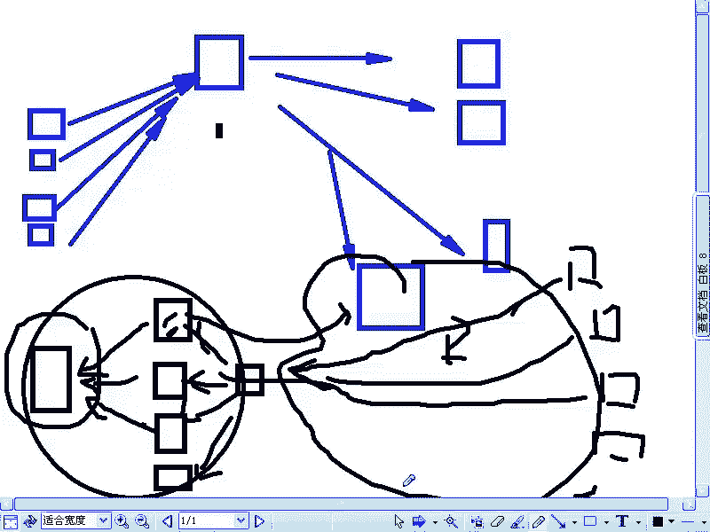

想找什么呢？Memory啊。开始是吧。memory是不是你的内存比方说是有16G，那么你就把它配置成什么？比方说。弄个10G是吧，最大16G啊，可以用什么呢？啊16G的内存。对吧内存16G。

你让它最大可以用到16G。当然了，一般实际情况下呢，实0G就差不多了，是不是？这是你要配的吧。😡，还需要配什么呢？还需要配一个最重要的地方。那个地方如果不配的话，前面怎么配都没有用。那么有个叫什么呢？

叫做HTTP。port是不是啊刚才我们已经配置过，是不是？那这个时候的话，你需要让他怎么样？😡，还去监听80端口吗？😡，啊，不是还去建定328端口吗？😡。

你现在是不是别人人家访问网站的时候都访问到80端口啊，你还让他接听328端口。😡，那那肯定不行。是啊。哎呀，咱80高考是不是？😡，但是呢你看一下上面的选项啊，这个选项可不是。

就是不是说那个添加个80端口就完了。你看这边有什么呢？we host。有微啊微port，有微 host，是不是这个表示说你以加速模式运行。以加速模式运行。你后面的话呢要跟虚拟主机的主机名。

你加速哪个网站就加哪个虚拟主机的主机名。明白了吧。啊，也就是说你后面有虚拟主机的时候，不是一个机器啊，是多个机器，那你就要加V host，要加进去啊。如果要是呢你后面的话呢，只有一个什么。

只有一个服务器，那你就加上一个Vpo就好了。微port就好了。也就是你这个微port或者we host，要么是一个加一个微port，等于后面的某某个端口是吧？要么加上一个什么we host加Vport。

这两个参数都要加，这样的话你才能做什么加速服务器，对不对？这个的话呢在网上你随便一搜啊，有很多很多的配置的文档，你就可以看得明白了，清楚了吗？还会有什么呢？这只这边的话呢有一个。这边是acelrate。

你必须加这个选项是吧？accerate呃ACCCEL表示的话它是以什么加速模式去运行的。比如在这边。在这个地方的话加上一个什么？是吧ACCCA啊是吧，然后再加上一个什么呢？啊V。😊，Hosts。

对吧也可能有个Vport。然后呢，等于哪个哪个端口，你后端的话有个什么什么端口，你也可以给自己本机的话加速，也可以给自己本机加速。你让他去坚听80端口。让阿帕去去监听一个其他端口，比方说88端口。

然后呢，自己的话呢给自己的什么88端口加速，这都可以。我们看到这边有一个熟人，这个熟人叫什么呢？transsparent是吧？这个熟人的话呢，就是我们做透明代理的时候，一定要加的参数了。

记得那个透明代理吧。就是跟IP table是连用的时候，那个透明代理的话呢，后面要加个什么就是说transparent啊，就是说这个呃透明代理。也就是说让你自己监听80呃，3128端口是吧，让。

别人的话呢，通过你的IPtables往外网访问的时候，他们统一都什么，统一都重定向到你的3128端口上去。也就是他们本来没想着去设置代理服务器是吧？但是实际上被你强制的重定向到什么？3128端口。

他最后的话呢。这个你的这个呃你的这个sd到底接受不接受这种请求是吧，接受不接受这种请求，你要是看着这个功能，它就会接受。这是你在这个做。做这种模式的时候啊，做这个呃。做那个。透明代理的时候要做的。

如果你做的是透明代理，应该这样写HTTP啊port是吧？HTPport3128。加上一个什么？加上个transparent是不是？如果要是你上面就是做最基本的spit的服务器，就是什么HTTP是吧？

port加上一个什么3128就完事儿了，就做最基本的代理呃这个代理服务器。明白吧？咱们的代理服务器sd是不是说了三种功能。第一种的话就是最简单的访问控制是吧，允许谁拒绝谁。

然后让他接听318端3128端口是不是？第二种模式是什么呢？反向加速服务器，你要让他去监听什么80端口。😊，然后呢，如果要是后面有虚拟主机的时候，你要告诉他你后面的话有虚拟主机。

是不是虚拟主机的端口是什么？你要告诉他啊。😡，如果要是你现在。是采用的是。透明代理方式上网，你的IP tables就是IP tables的那个NA呃就是那个呃就是NAT链里面是不是有个操作叫做redirect是吧？

那个redirect跟它连用，那么你就要加上这样的模式。那么IP tables那个病例该怎么用来着？I tables那个命令是不是要添加一个这个呃，我就我就写在后面了。当然你是不是不是写在这个里面了。

应该写在哪呢？应该写在sell编程里面，就是直接shall里面去输入是吧？那它是什么？I tables是吧，杠A。😊，呃，杠T。NAT是不是杠A在。Pe。ing的时候是吧，然后呢，杠来源是什么？

19168。0。0是吧，杠24，然后呢杠。呃。preoting是杠I参数，是不是preoting是跟杠I参数是连用的，是不是？从你的比方说你的某个接口来啊，ETHE来，然后呢，这边杠G怎么样？

redirect是不是redirect杠杠什么to。down port。是吧3128。是不是？也就是下面这个的话呢，就是我们的这个跟transparent这个联用的时候。

你IP tables是应该执行这个命令，是不是然后再把IP table save起来IP forward打开，这样的话你就做了一个透明大理，听楚了吗？做透明大底有什么好处呢？

你可以限定说大家不能下MP3是吧？我们3令5申跟大家说，不能下MP3是不是不能下载视频，结果他们听不听呢？他们不听，但是你完全可以通过sd来控制。也就是你默认情况下不允许任何人的话。

通过80端口访问外面的网站全部都要什么经过sd。而sd的话呢，它要必须怎么样呃，符合他的规则，它的规则里面的话可以限定什么呢？不允许下MP3，只能在指定时间上网，其他时间不能上啊，这些都可以设置。😊。

明白了没有？就在ACL里面，这是我们说的sreet的三种功能，明白了没有？HTTP下划线port都要改，是不是HTP下划线port都要改。😊，然后我们再看上面啊，再看上面的话呢，ACL这个地方啊。

大家一定要仔细去看了。这个仔这个仔细看的话，就是你会发觉有很多特别好玩的东西。😊，ACL这个地方，你看这边是刚才我自己写的几项，是不是？这边的话呢，这个下面这几项的话呢。

是跟我们的那个缓存加速服务器相配合的，是不是？然后呢，我们还可以你要说你要做透明代理的时候，你看你是不是可以去禁止别人访问这个UR，就是这个就是像什么这个呃，就是说这种某一个域某种域名是吧？

比方说不能上什么呢？不能上。开心开心老师，开心啊，就这样的。😊，这个如果要是大家用了这些招去。限定公司里面的同事的话，他们不恨死你们才怪啊。然后比方说这边是开心是吧？

那我这边的这个UR就是这个相当于我的。相当于我的这个规则怎么写呢？我忽略正我忽略大小写。然后呢，在这里面的话呢是呃。点。星是不是点心任任意都任意字符是吧？开。😊，心别管开心网还是开心001。

是不是全部都不允许访问。😊，是不是正的表达式。啊。😮，是不是？那么等一下的话，我加上HTacces是吧？deny开心了。是不是？然后还有就是说我可以限定时间，上班时间不能。听歌是吧。

不能下载MP3下班可以，那你可以限定时间。我们这边的话呢，URL的这个正则表达式，你看。URL的这个正则表达式。比方说我们什么操作呃，就是这个URL这个列表当中包含什么东西？比方说MP。3。

MP3啊的URL这边是忽略大小写啊，我不管是大写的MP3还是小写MP3都不行。那在这边的话，我加上一个。点星是不是？点星，然后呢我去匹配一个什么呢？前面是任意字符，只要是以什么MP3。结尾。

是不是以MP3结尾的。对不对？这能理解吗？正则表达式啊。是吧点是任意的一个字符，新款任意多个前面的字符，也就是前面是什么我都不管，不管是哪个网站是吧，哪个链接都没有关系。只要你点，只要是你以MP3结尾。

或者是以点啊，以点MP3结尾，我都不允许。一点MP3结尾都不允许，这一杠不是拖一幅嘛，拖一幅就是把后面那个点当成是普通的点嘛？MP3是不是都不允许。这样的话呢我可以去access啊。

就HTPacces denyy是吧？MP3是吧？再去deny什么呢？开心是不是一行一个dey一行一个deline，这样的话我就可以控制。所以很多的这个公司里面啊，它的这个上网的管理都是这样这样管。

明白吗？他甚至的话有一些公司他会给你配一个什么专门的上网器，这个上网器里面的话可以加各种规则，它甚至还加什么呢？它自动把那个买呃MSN啊还QQ的那些账号的聊天记录全部都给你做出来。

那里面就是一个小的nux系统。它自动删。访问控制全都提供外部界面给你控制。这个东西的话呢可以做的非常的就是精细啊非常精细。好，那个这就是sd的东西。我们的话呢今天就讲到这儿吧，大家有什么问题没有？😡。

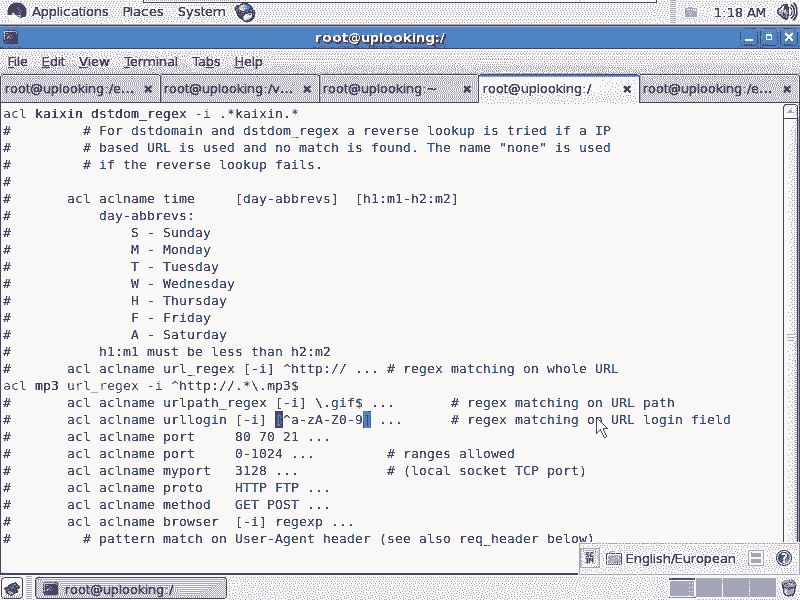