# 尚观Linux视频教程RHCE精品课程：P84：RH253-ULE116-8-5-squid 🐙


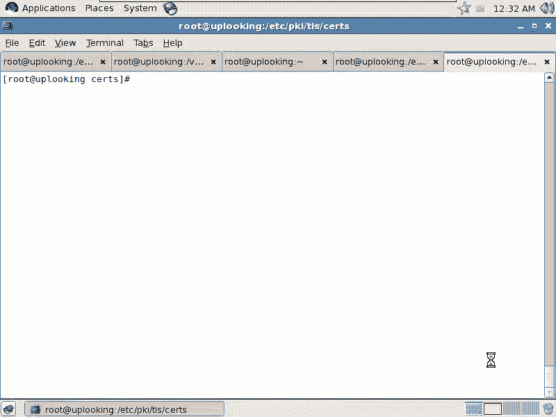

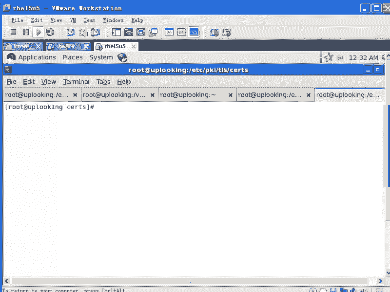

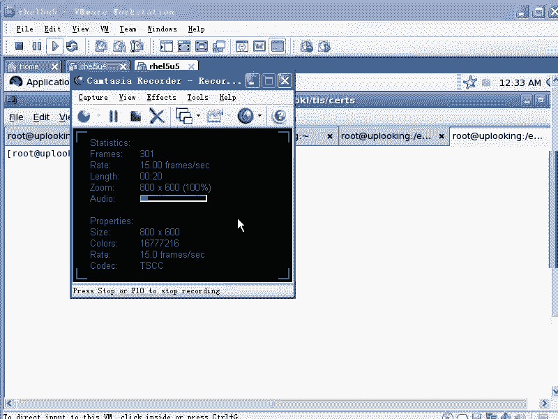

在本节课中，我们将要学习Squid缓存代理服务器的基本概念、配置方法及其三种主要应用模式。Squid是一个功能强大的代理和缓存服务器，广泛应用于内容分发网络（CDN）和企业网络管理中。

## 概述：什么是Squid？

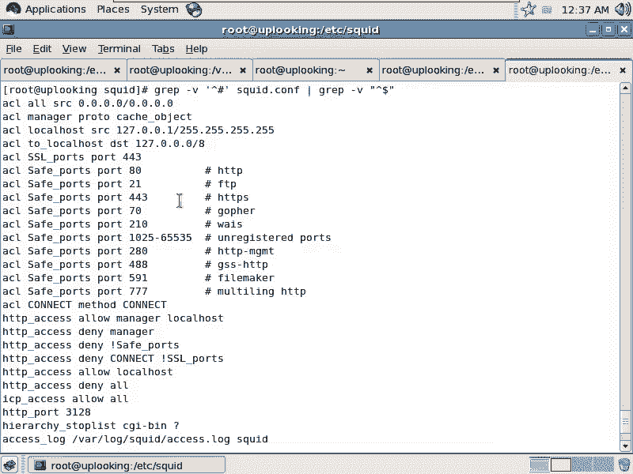

Squid是一个基于**ICP协议**的缓存服务器。与Apache的HTTP协议不同，ICP是Internet缓存协议。它的核心作用是缓存网络内容，从而加速访问并节省带宽。例如，CDN（内容分发网络）的基础就是由类似Squid的缓存服务器和智能DNS构成的。

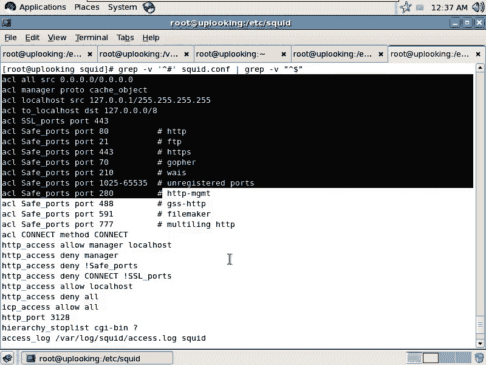

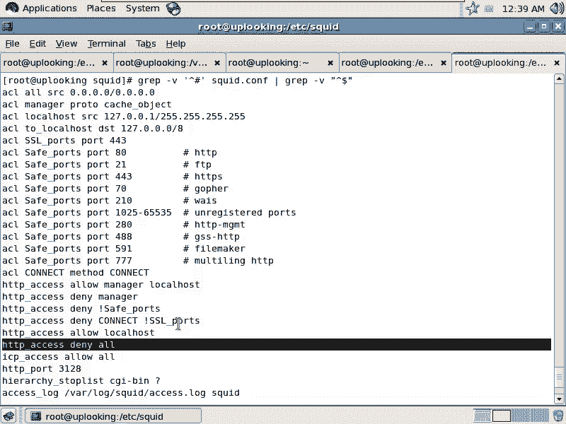

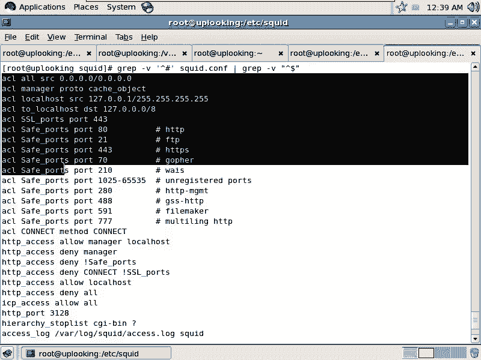

Squid的配置文件位于 `/etc/squid/squid.conf`。其配置文件包含大量注释，我们可以通过命令过滤掉注释和空行，以便查看核心配置。

```bash
grep -v '^#' /etc/squid/squid.conf | grep -v '^$'
```

## 核心配置：访问控制列表（ACL）

上一节我们介绍了Squid的基本概念，本节中我们来看看其核心配置——访问控制列表（ACL）。ACL用于定义访问控制的资源对象，例如IP地址、域名或URL模式。

以下是定义ACL资源的基本语法：
```bash
acl <资源名称> <资源类型> <参数>
```
例如，定义一个名为 `all` 的资源，代表所有来源IP：
```bash
acl all src 0.0.0.0/0
```

定义好资源后，需要使用 `http_access` 指令来控制允许（allow）或拒绝（deny）访问。规则有先后顺序，类似于防火墙规则，先匹配的规则先生效。

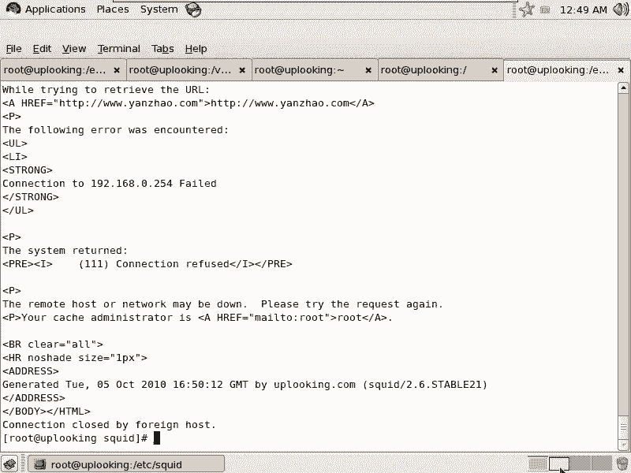

## 实战配置：实现内网代理控制

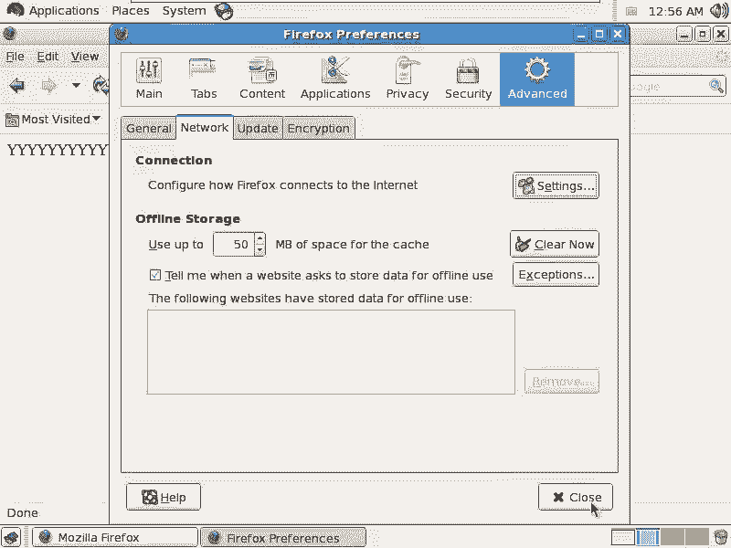

现在，我们通过一个实例来学习如何配置Squid，实现只允许公司内网通过代理上网，而拒绝外部访问。

以下是实现此功能的配置步骤：
1.  **定义ACL资源**：为公司内网和特定“好人”IP定义资源。
2.  **设置访问规则**：使用 `http_access` 允许内网和“好人”，拒绝其他所有访问。
3.  **调整关键参数**：修改监听端口和缓存大小。

具体配置示例如下：
```bash
# 定义公司内网网段资源
acl company_net src 192.168.0.0/24
# 定义“好人”特定IP资源
acl good_guy src 192.168.1.21
# 定义外部“坏蛋”网段资源（示例）
acl cracker_net src 192.168.21.0/24

# 设置访问规则，顺序很重要
http_access allow company_net
http_access allow good_guy
http_access deny cracker_net
# 注意：默认最后有一条 `http_access deny all`，因此其他访问均被拒绝

# 修改监听端口（可选，默认为3128）
http_port 3128
# 调整内存缓存大小（例如500MB）
cache_mem 500 MB
# 调整磁盘缓存目录和大小
cache_dir ufs /var/spool/squid 100 16 256
```

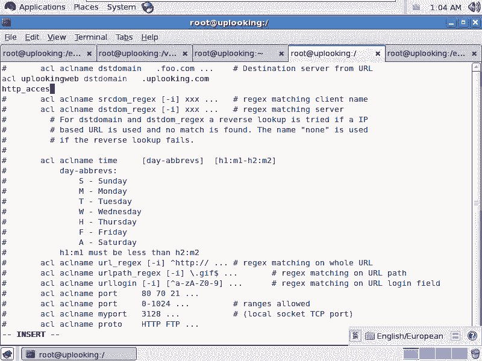

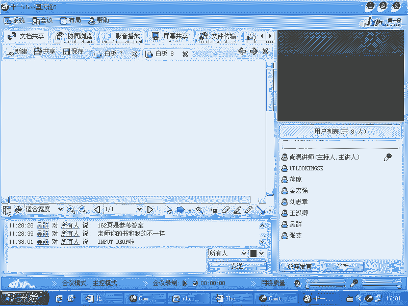

配置完成后，需要重启Squid服务以使配置生效：
```bash
service squid restart
```
可以使用 `netstat` 命令验证Squid是否在监听指定端口：
```bash
netstat -antp | grep squid
```

## Squid的三种工作模式

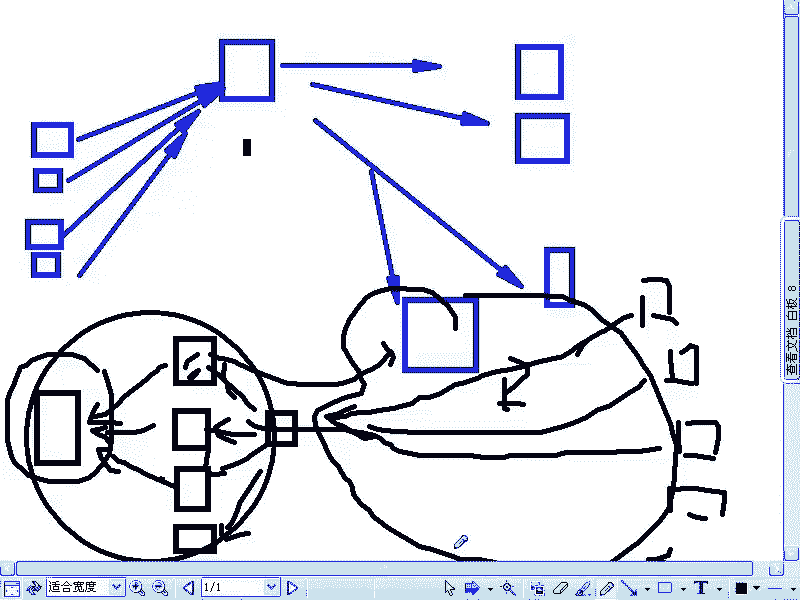

上一节我们配置了一个基本的代理服务器，本节中我们来看看Squid的三种主要工作模式及其应用场景。

以下是Squid的三种核心工作模式：
1.  **标准正向代理**：客户端配置代理服务器地址和端口（如3128）来上网。这是我们刚才配置的模式，主要用于访问控制。
2.  **反向加速代理（Web加速）**：Squid位于Web服务器前端，为后端服务器缓存内容，以提升访问速度和承载能力。此模式需要修改 `http_port` 并添加 `accel` 相关参数。
    ```bash
    http_port 80 accel defaultsite=yourwebsite.com vhost
    cache_peer 后端服务器IP parent 80 0 originserver
    ```
3.  **透明代理**：客户端无需配置代理，其流量被网关通过iptables规则重定向到Squid。此模式需要结合iptables和Squid的 `transparent` 参数。
    ```bash
    # 在Squid配置中
    http_port 3128 transparent
    # 在iptables规则中（示例）
    iptables -t nat -A PREROUTING -s 192.168.0.0/24 -p tcp --dport 80 -j REDIRECT --to-port 3128
    ```

## 高级控制：基于时间和内容的过滤

除了基于IP的控制，Squid还可以实现更精细的管控，例如限制访问时间、屏蔽特定网站或文件类型。

以下是实现高级控制的配置示例：
1.  **定义时间ACL**：限制上班时间（周一至周五，9点到18点）不能上网。
    ```bash
    acl work_time time MTWHF 09:00-18:00
    http_access deny work_time
    ```
2.  **定义URL正则ACL**：屏蔽包含特定关键词（如“开心网”）或特定文件类型（如.mp3）的访问。
    ```bash
    # 屏蔽包含“开心”的URL（忽略大小写）
    acl bad_url url_regex -i 开心
    http_access deny bad_url
    # 屏蔽下载.mp3文件
    acl mp3_file urlpath_regex -i \.mp3$
    http_access deny mp3_file
    ```

通过这些规则，可以实现复杂的企业上网行为管理。

## 总结

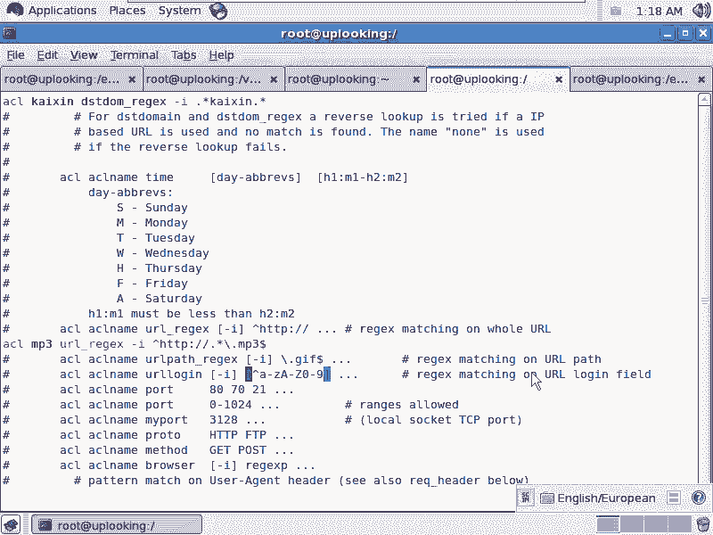

本节课中我们一起学习了Squid缓存代理服务器。我们从Squid的基本概念和配置文件结构开始，逐步深入到其核心的ACL访问控制配置。通过一个实战例子，我们学会了如何配置Squid以实现基本的网络代理和访问控制。接着，我们探讨了Squid的三种主要工作模式：标准正向代理、反向加速代理和透明代理，并了解了它们各自的应用场景。最后，我们还介绍了如何利用Squid进行基于时间和内容的高级访问控制。掌握这些知识，你就能为企业部署和管理一个功能强大的代理缓存服务器了。