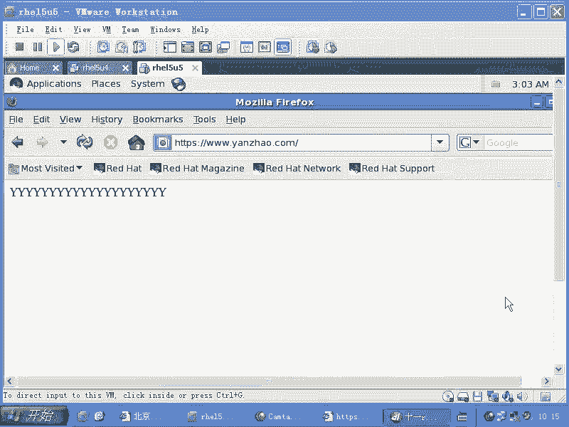

# 尚观Linux视频教程RHCE 精品课程 - P85：RH253-ULE116-8-6-mod-ssl-openssl - 爱笑的程序狗 - BV1ax411o7VD

让我们来看一下。呃，aache的SSL模块啊。哪怕这个SSL模块。ache它的SSL大家都知道RPM杠QA啊，如果要是RPM安装的话，那就GREPSSL。你看到的话呢。

它的真正起作用的组件叫做open SSL。也就密钥的生成密钥对的生成，包括证书的生成。那么由SSL的话呢来生成T。然后呢再由modode下划线SSL跟apache的话呢进行交互。来看一下啊。

那这是RPM杠QAGREPSSL。看到了啊。这样的话我们的就是appartache可以支持SSL。但是SSL的话呢，它是基于什么呢？就是公司密钥队，就是PKI啊，就是公共密钥体系这样一套东西来。

那它的这个。密钥放在哪呢？放在这个ETC下的PKI啊TLS当中。那么前几天我们去做SSL的时候，之所以不成功的原因是什么呢？就是那个证书是由自己签发的。但是我们现在。只能是这样，是不是？

因为我们如果要是想让互联网络上的另外一台什么呢？就是一台证CA机构的话来签发证书。那我们要给他付费。我们要给他付费。所以的话现在的证书的话都是由我们自己先来签，他只不过会出现一个报警啊。

那我们看一下这个模拟出来的这个证书体系，那么就是签发这个证书该怎么来？他在这个目录下会有一个什么呢呃。普。privaate是吧，在这里面的话呢会有一个key。

这个key的话呢是我们的就是自己在安装的时候，他帮你去。添加出来的。还有一个话呢就是CERT啊，我们呃CERTS。我们都应该知道啊。😡，一个就是非对称加密。因为对称加密的话呢，就有点像我们的某一种算法。

比方说我告诉你密密钥呃，就是密码是123是吧？123乘以3再除以多少，然后再加上几，我们最后得出一段值来，对不对？这串值的话呢，我们这样的加密完了以后，我们能通过这个算法的话呢，再把它反向解解密。

如果要是你是单项加密的话，就比方说你用MD5单项加密的话，一般都是什么？你再输入一遍密码，然后呢，得到的那个值是相同的，是不是？就跟我们那个MD5的呃，就是存存过以后的值。比方说这样的啊。比方说这样的。

ETC下的筛的文件是不是？筛的文件，我这样的把这个文件最后一行看一下啊。最后三行。那咱们看到这个MD5加密过以后的这串值是这样的那它不是非对称加密。我们说非对称加密的话呢，它要生成一个公司密钥队。

用公用私钥加密，然后来公钥来解密。那为了避免别人的话呢，在中间啊监听你的这个呃就是数据包，然后呢，把你数据包很容易的话呢，就可以组合在一起。然后也就是说你跟比方你跟淘宝去通讯什么？它的话呢截获什么？

你在淘宝上输入的用户名和密码。全部都不会都会被什么抓到。所以的话你看到像支付宝啊，或者说像那个呃QB啊等等这样的一些网页，它全部都会用HTTPS啊。所以的话呢那就是进行非对称加密。它就跟SSH是一样的。

我们的这个单向加密的话，这边我先岔开一点，就是你会发现前面的话有个dollar1 dollar，是不是这边这边表示的是一个什么呢？在MD5加密的时候，它的一个呃相当于加的额外的参数。

然后后面这串东西的话呢，是加密过以后的值明白了没有？明白了啊。那如果要是你用呃就是你比方说你用G呃就是grab grab杠MD5杠输入一下相同的密码。比方说还是tom的密码再输一遍tom的密码啊。

它这边的话呢，也会出现这串值，那么这个时候的话，你要看它的位数是不是相同，位数不同的话，肯定不行，是不是尽管都是MD5算法，对不对？但是呢它位数不同的话，可能也是不同的。

然后我们用MD5SU呃MD5SUMMD5SUM。用它的话呢，再去加密的时候，那他没有加这串值的时候，比方说还是tom啊给MD5SUM那他没有加这串值的时候，他看到的这个界面的话呢，可能就是不同的。呃。

呃看到的这个加密的值可能是不同的。啊，所以这边的话呢，虽然都是用MD5算法，那么这边是你你这些MD5求求出来的值是不是通用呢？不一定是不是不一定。啊，它前面的话还有个变量啊。

这个变量的话呢可以导致你后面的结果在密码相同的时候。得出值是不同的。好，好，我们看一下这个啊我们看这个。😊，我们看一下这个。当我们的话呢想用密钥进行加密的时候，那么就跟我们的这个用SSH一样啊。

SS杠K。G音是吧，然后呢，杠TRRSSA的密钥或者DSA的密钥。然后呢呃这样的几步以后的话呢，生成一个密钥对是吧？没有密码，然后看一眼。如此当中的点SSH也就是说我的密钥的话是可以不输入密码的。

对不对？然后呢，但是他默认要求你输入密码。这样的话呢，这边是一对什么呢？RSC的密钥。RCC的密钥的话呢，这边是一个私钥，这边的话呢，是一个公钥IDC点POB是个公钥，是不是？然后DSC的密钥。

这是我以前生成的。也就是这一对密钥，如果要是我们把这个公钥啊，在前面的话呢，再加上一些你比方说呃签发机构是吧？签发给谁，然后你的email地址是谁？然后呢，你的这个呃你的有效期是多长时间。

把这些信息的话呢，附加在这个公钥前面，于是的话呢，这个公钥就变成了一个什么证书。那任何人在访问你的网页的时候，你这边拿的是私钥，他那边下载到的是什么公钥，是不是？然后呢，这两个密钥对不是由我自己生成的。

而是由一个什么第三。生成的明白吧？这样来保证它的安全。数据在传输的时候，不管是谁在中间拿到了这个数据，它都不能什么呢？把这个呃数据的话呢，怎么样就是说截获掉。因为我的密钥的话，只会这一对密钥生成时候。

我只会把这个密钥给谁呢？给那个就是浏览者啊，浏览者，除非你中间的话截获这个密钥，并且把这个密钥破解掉啊，否则的话呢，那只有两个人的话呢，会知道加密以后的这个内容，一个是公钥。的拥有者。

一个是se钥的拥有者，明白吧？这就是我们的所谓的这个密钥啊密钥体系。那么我们当我们现在用S openen SSL的时候，我们就要这样做了。我们看一下。我们看一眼啊。当我们要去用工呃要去用SSL的时候。

那你要知道RPM刚才我们看了QA是吧？GREPSL我们看到SSNSSH了SSL那么我们的这个生成密钥，或者是说去签就是把它变成证书等等，是用一个程序叫做openSL是不是来做？

那么负责把密钥和啊去连接起来的这个模块的话叫做什么呢？modSSL这个模块，然后我们去VIETC下的HTTPD当中的c点D目录下的SSL点com打开这个文件以后，那么在前面是一个load模块的过程。

漏SSL的模块的过程，对吧？然后下面的话呢是一个什么是一个让它监听443端口。因为你只要用到了SSL的话，默认的端口是443端口43端口不是80了，你访问80的话呢，它就是普通页面，我们443的话呢。

就是。加密的页面。比方说你在淘宝上浏览的商品，那它是什么？它是那个普通页面。但是当你想去登录的时候，登录了以后，它就变成什么加密的页面了。所以这时候你要为这个43端口单独去做一个什么虚拟机。

我们说虚拟机的话，它可以通过三种方式创建。第一种不同的IP第二种不同的端口，第三种不同的主机名，对不对？虚拟机通过三种方式创建。我们看一下前面的话呢是SSL的一些选项啊，一些选项。

那大家要注意这个选项它它很可能的话呢，在我们的HTTP我们看一眼啊，VIETC项的HTTHTPD。呃，HTTPD当中的c复当中的HTTPD点c复。你打开它以后，你会发觉在这里面的话呢，总是有一些写法啊。

你看前面是不是加载了模块啊？对不对？然后呢，下面的话呢，你看一眼这个地方。😊，你看这个地方啊，它的写法叫做这样的，说if mode mode userDRR点C是吧？这个意思是什么呢？

就相当于说你如果加载这个模块的话，那么就有这些参数设置。也就是说这些参数是谁谁能提供这些参数，相当于这些变量是谁的呀？模块了对不对？也就是这个模块加载了以后，它才会有这些选项，是不是它才会有这些选项。

明白吗？这是在HTTP地点c里面。然后呢，他们这个避免出错？假如说我把这个地方去掉啊，假如说我把这个地方去掉，刚才我加上个井号注释。然后呢，我在这个地方的话，再加上一个井号做注释。

中间是不是留了一个选项叫做userDR disable是不是这个选项，那么我在上面的话呢，压根就没有漏的这个模块，是不是它就会出错。😊，你看上面的模块是不是有几十个是吧，你怎么知道我会加载哪一个？😡。

尤其我编译安装的时候，我压根编译都没有编译。那你想它是不是有很多的话，它就没有没有编译出来，那更不何谈什么加载起来，没有加载它针对这个模块内部的一个什么。参数它就更不可能什么去设置。

你一设置是不是就出错。所以的话呢这种标准的写法大家要记住啊，就是说如果这个模块它是什么，它是。加载的那么就有什么就有这个选项啊，你说这个跟我们刚才说的这个有什么关系呢？大家要知道你现在添加的这些东西啊。

添加的这些选项是在那个模块加载的以后才会出现的，清楚了吗？没有那个模块是没有的，但是呢这边是不是没有说if mode什么什么什么，是不是没有if mode，因为它这个文件是不是在SSL点com里面。

你如果没有加载这个moSSL。😊，点SO这个模块压根儿就不会有这个文件，是不是？所以他就没有用if mode这种方式去给你创建那些选呃，就是就是再把那些选项添加到什么if mode里面，听楚了没有？

这个我说我是在说什么呢？我们有关模块的这些选项，你有两种添加方式，对不对？一种的话是直接把它摆在这个上面。另外一个是什么？加个if mode说加载这个模块的情况下。你有什么样的选项？听楚了没有？😡，啊。

清楚楚了吗？好，那么这个就是我们的SSL的选项。比方说它的缓存呢啊它的这个比方说。cash的文件的位置啊等等啊。那么我们看到了加载我们的虚拟主机的这个地方啊，也就是说我们默认情况下。

系统listen的是80端口，它同时也监听443端口。但是你当你去访问443端口的时候，没有任何东西啊，访问不到。因为这个地方的话呢，它是被什么注释掉的。

是不是document rootot是不是被注释掉的，还有这个的话呢，也是被注释掉的。那么如果你想让它去启用，那你就把那个前面的注释取消掉，表示现在我要监听一个什么所有IP的443端口，对不对？

只要你访问43端口，那么就访问到了这个虚拟的主机，虚拟主机的话呢，它的名字叫什么？😊，3W点啊。艳照点com是吧？冒号443啊，它是这样，然后呢，document root是一样的。这两个的话呢。

它跟那个我们平时的虚拟主机的设置是一样的啊，然后接下来的话呢是两个日志啊，一个是a log，另外一个是access log，对不对？级别是怎么样的，然后下面的话呢，下面的设置的话呢，就可以不用去太管它。

但是呢我们要注意一个注意什么呢？它这边说。😊，认证的key啊，就是说我们的这个私钥文件是放在哪儿的？然后呢，我们的这个公钥文件就是CRT文件是放在哪个位置的。这边的话呢。

你指定它默认情况下就是local host点CRTlocal host点K啊。就按默认的来，然后一保存并退出，它实际上就是可以用的状态。因为的话呢昨天我们去讲这个东西的时候，它会出现错误。

是不是我们通过浏览器去访问的话，我们看一眼啊。我们通过浏览器去访问的话，它会出现错误啊。我现在访问什么呢？3W点艳照点com是不是？然后呢，如果要是我这边前面加上一个什么HTTPS冒号两杠是吧？

这样的话就访问的是它的这个呃就是443端口啊，但是这边的话呢，它就没有那个出错了，没没有那个出错了，是吧？我们在另外一边看一下。我们在windows下看一下啊。windows我看看成不成。还有份不。

应该加的应认的，他前面可能没有加HTP吧，是不是没有加HTTP。我一会试一下啊。你看。啊，实际上是有的，是不是？但是呢只不过是什么呢？就是昨昨天我们在那个fireair fox里面是吧？

fireair fox里面的话呢，去访问的时候，他出现一个错误，他说。你不应该信任他，因为这小子的证书是自己签发的，你知道吧？他提示这样一个错误，但是呢他下面有一条说什么说你可以选择去信任他。

你看今天是否就出来了，因为我已经做了选择，就是说我已经信任那个证书了。他就是说出现那个错误的时候，你只需要怎么样，你只需要在下面点一下，然后呢，再进行一下选择，你说接受这种证书，他就可以啊。

我们这边的话呢说。😊，你看你看是不是这个地方他也出现这个错误了，他说你不应该信任他，因为这个东西不是选定的信任公司颁发的，而是什么？这小子自己搞的是不是也会有这个出错啊，只要默认情况下，它就是可以的。

然后你点yes接受它，它就可以出来。这个时候你访问的就是43端口，是不是？😊，呃，我刚才是说想这样的啊，就是把这个S去掉，然后加上一个什么冒号443，应该也是可以支持的。え？不行啊。我怎么记得可以呢？

sice文件。啊，不会HTTP不找sice文件。XRID的程序的话，在启动的时候，他才会找sry。而且的话我这边访问的是什么？HTDP我是在我的windows下是吧？

我的windows怎么会跑到那个服务器的linux下去跑ETC下的service文件呢？呃，这个不会。😊，那可能这样不行。也可能是虚拟主机的问题，是不是？还是这样的啊，就是耶。这样也不行了。刚才是1。

254是吧？1。254。可能零率网段的话，我的windows访不到是吧？那当你去接受遍一遍以后的话呢，去点击就可以。其实昨天的话呢，我们做的实际上是成功的，只不过它出现那个提示了以后是吧？

我们没有点击下面的那个按钮啊，没有下点击下面的按钮，我给大家重新来做一遍密钥啊，我给大家重新来做一遍密钥。😊，咩。时不时有杂音啊？现在还有杂音吗？我我看一眼啊。对。

就是说当我现在想去就是说这个密钥怎么去签发呢？大家刚才看到了，就是说我在系统里面的话呢，是呃我在系统里面的话呢，是呃用的默认的选项，是不是？logo host点K是吧。

还有logo host点呃CRT这个文件是不是我们看一眼啊。😊，只要我这边接受完一遍以后的话，就可以访问了啊。我看一眼这这个加上一个。192168。1。254是不是这样回车啊？对，就是这个错。

就是这个错误，对不对？然后呢，我们以前看到这个错误，这个错误是默认情况下就会出现的啊，但是呢你可以通过点一下这个地方看说或者你可以添加一个什么，就把这个密钥添加进来啊。

这样添加啊这时候的话点击后面这个按钮。你后面这个按钮，然后呢，这边是获取这个密钥，是不是获取这个密钥，然后呢去确认它什么是安全的，是不是？然后呢，这样的话。就点两步是不是就出来了，这表示说什么呢？

我管他密钥是谁签发的呢？是吧？你说的倒好听是吧？然后呢，那个密钥的话要由信任的公司给我签发，结果人家一签发要多收我6600块钱啊，一年6000块钱。😊，明白吧你想让你的密钥被那个信任的公司所签发吗？

想吗？一年给人家6000块钱啊，对于一个公司来说可能倒无所谓，是不是啊，但是呢对于你的这个就是你实验的来说的话呢，就没有必要了啊，所以这个密钥是这么来的。清楚了吗？那我现在话想自己签发密钥。

或者自己去生成一对密钥是吧？我们看一下怎么怎么做啊，能怎么做。😊，其实的话昨天跟大家已经说过了啊，但是我们这边的话重新来一遍HDVDtop先把阿ache启动呃，就是关掉啊，关掉的话呢，我们可以这样。

我们可以这样CD到什么呢？ETC下的HTTPD呃呃HTPD当中的com哎，不是ETC下的PKI啊，就是我们的公共密钥体系当中去，然后呢去找到什么呢？呃TRS这里面去，对吧？

那么我们知道在这个目录下的呃CERTS这个目录下的话呢，有一个什么呢？local host点CRT这个文件，对不对？还有一个的话呢是在什么呢？prorovide是吧？😊，Arovate。

这个里面的话呢会有一个lo host点 key文件。那我们讲究生成的话，怎么生成呢？我们这样来生成啊，叫做G呃就是我们的。呃，CD到什么呢？CERTS当中去。那么你看到这里面的话呢。

有个make file看到了吧？这个make file这个make file里面的话呢，有怎么样去生成这个key文件。那么如果这个key文件，我去这样的啊，make呃 file。

比方说我这边加上一个什么呢？比方加上加上一个艳照点。key啊，这样的话直接它就可以生成这个key文件了。你看直接会耶。呃，make file去了，我我我有我我脑子的话还在耶。啊。不是我跟早晨的话呢。

我的脑子的话。总是怀疑自己是不是在真实的世界当中是吧？出错说明什么是在真实世界当中是吧？太太太愚蠢了，犯的这些错误啊，看make艳照点T是吧？你只要的话呢生成的这个文件啊。

你只要生成的这个文件是什么什么K点K啊，就是随便AA点T那这时候它就会调用调用你帮你生成私钥的那一套东西啊，你这样的一回车，它就要求你什么呢？

这个说生成了一个呃65537这样的一个这个就是变量的这样的一个密钥啊，那么RC的密钥，总共是100呃1024位1024位，然后呢，你可以输入你的密码，那你要不输入密码，它也不允许你过去，是不是？

现在的话我输入密码，比1234啊，1234，如果要是你输入了密码，就意味着什么呢？每次HTBD启动的时候，第一次启动的时候，都要求你再去输入这个密码，你才用这个密钥，听楚了吗？

那你想不想每次HTTBD第一次启动的话，都会让你输入密码，想不想？想不想？不行不想的话，我一般呃我看到这个东西啊，就是我是make艳照点K这个文件出来的，是吧？我先把这个艳照的话呢，点K这个文件删除掉。

那其实的话呢，你可以去VI什么，你之所以能用make是不是因为有个make file啊？😊，是不是打开这个文件以后，你看一下它是怎么去生成这个key文件。它生成这个key文件的话，实际上是这样来生成啊。

实际上是这样来生成。像当这样来生成，看到了吗？这样来生成，也就是说你要输入一个什么什么什么点T，它实际上是运行open SSL的这个命令产生密钥这个命令，明白吧？现在你把这段复制下来，复制下来了以后。

然后呢你运行这个命令。啊，现在的话呢把这个地方删除掉啊，就是告诉他说我要产生的是一个什么呢？是1个1024位的这样的一个密钥，是不是？然后我这个文件名的话叫什么？艳照点K，是不是艳照点K，对不对？

然后呢，我这样呢直接回车。这个密钥是不是生成了，生成他没有管你要密码吧。😡，是不是？这边话呢就是艳照点看K。那么当然了，我的艳照点K应该放在点点下面呢，就是这个就相当于放到哪去呢？

放在ETC下的PKI当中的TL当中的什么？pri私要是吧？private啊这个目录下，然后呢，你在当前的目录下，你再去生成什么呢？CRT文件啊，CRT文件CRT文件的话呢，你要去运行个命令叫做make。

叫做什么呢？RQ什么什么东西啊。啊，我还得要看下帮助啊。我看我看下那个make file不是帮助。PKI当TLS当中的。叫做CERTREQ啊CERTREQ。CERT。那这样的话呢呃要求你输入哎。

这边还是收输入什么呢？这个local host啊，还是输入local host，这个不行。那么我不想用local默认的local host，我想用什么呢？我看。

我把那个local host的这个key文件删除掉啊，然后再看一眼能不能。咦。哎，他帮我还是生成这个T文件，然后再生成那什么。好。不对。这个的话呢还是生成那个reite自己默认的那套东西。

是不是啊我现在不想生成自己默认那套东西，我就想生成1个C就是CRT文件。CRRT这文件。哦，我是这样的啊，加这个选项。我看这个行不行。我去生成一个叫做。艳照啊CRT这时候输入它的密码，是不是咦？不对啊。

我觉得我生成过。CRT的文件。啊。就是我是想分两步了，而M是把那个prorovide。下面的艳照。点T删除掉先啊，然后呢我再去生成一个make哎。我要生成追对密钥。

然后呢再去输入一个make艳照点CRT是吧？嗯。OK这样的话就好了，就是还是把那个命令找出来啊。然后呢，默认的话呢，这些什么名字啊什么的，这些都无所谓。这边的话呢随便输入你的名字。

什么用就是那个公司的名字，还有你自己的名字等等，这些都没有关系。但是一定要在最后的主机名这个地方要输入你完整的主机名。这个地方是非常重要的。

就是说你的这个主机名就是这个server的 host的这个地方一定要输入你的主机名，然后我就要做3W点艳照点com，对不对？我如果输入这个。这东西怎么弄下去？我们要控制啊，我这样的输入完艳照点com。

呃，就是3W点艳照点com输入完整的主机名，其他都没有关系，就按默认的就可以。这样生成完以后，然后呢，你再去看当前的目录下就会有一个什么呢？艳照点CRT的文件，是不是？艳照点CRT的文件，刚才是运行。

我是先运行这个命令，是不是这个命令是生成一个什么艳照点key的文件，在propro这个地方pri是吧，这个地方，然后呢，我在运行什么呢？open SSL，然后呢去生成这个密钥的一个什么呢？

这个密钥的一个证书，是不是是不是在当前目录下输入的一个这个密钥的证书。那么为什么我们要把两个文件分开在两个目录当中放放的。因为大家一定要注意啊，公钥你可以随便给别人，但是私钥怎么样？

一定是什么非常机密的。所以的话呢你看啊这个文件的话呢，一旦生成完了以后，那么你再去看这个当前呃就是这个。收。啊这个地方的话呢。这个里面的话有一个什么验照是吧，点Q文件，然后你L看一下啊。

它的默认的权限实际上的话已经是不对了啊，是什么644是不是？其实的话呢应该是600的权限啊，应该是600的权限。还是600。昨天我们看600是吧？是不是？啊。就是我们这个权限的话呢，是因为我现在的话。

我就不想再去验证了。那验证的话呢，就是因为默认的，你可以看一下local host的，它本身的权限是多少，应该是600啊，local host点P这个文件600的权限。

但是我没有仔细去看他的拥有者是谁呃，还有就是说他的那个呃就是比方拥泳组是谁，总之它的权限是非常严格的。也就是这个密钥的。密钥的话呢，要求不能让任何人去碰。那我这样呢改好了以后。

然后我再去VI什么ETC下的HTTBD当中的什么呃cf。点D目录下是不是找那个SSL是不是点com。那如果要是你本身是在什么实验阶段，那你就直接make什么make那个呃叫做CERTREQ是吧？

makeCERTRQ它是一条龙服务，帮你先创建一个什么local host的T文件，然后再去创建一个什么呢？再去创创创建一个那个就是local host点CRT文件啊，但是呢因为我不想让它输入密码。

所以我没有用那一套，我就直接的话呢用命令的方式来创建这个地方省略了一个参数。其他的这个命令的话呢，没有省略参数。这个命令本来的话呢，在这个地方是有个参数的。对吧默认情况下他之所以要你输入密码。

是因为有这样的一套参数。到D呃DES。呃，3杠DES3，那么它是要经你输入密码，是因为有这个参数，我把这个参数取消掉了，所以的话呢就没有输入密码就直接过来了。然后呢，我去VI这个文件。

这个K文件和这个K文件所配套的什么CRT文件都都成了。成了以后，我打开这个文件。白这文件的话呢，在最后的话呢，我找到默认的local host点K和local host点CRT文件。这边的话呢。

我把它改成什么？艳照是不是？验照啊点Q把它命令退出。把它这两个地方的话呢改一下。一个是什么呢？一个是一个是证书文件在哪，另外一个是私钥文件在哪啊，这两个地方改成什么呢？你那个储存。

私钥和储存证书文件的位置，然后呢，退保存并退出了以后啊，然后serv是什么HTPD是吧？restarrestar完了以后，然后这个时候你再去看。所以说你再去看他，然后呢再去访问他。诶。这时候又是一样。

是不是？因为他因为证书原来你拿到的证书已经失效了，对不对？现在的话呢又是新的证书，他又告诉你说什么？😊，你不能信任他，是不是？因为什么呢？因为是他自己签发的，看到了吧？😡。

所以的话呢还是点一下这个地方啊。因为现在我想我倒是想找别人去签发，当是要人家要钱呢，对不对？所以的话我就这样的啊获取证书样。非法证书。我看一眼啊，是不是这个。啊。下面啊。下面确定啊，这边的话又出来了。

是不是？所以我这套证书是不是可以用的。大家明白这个机理了以后的话呢，你就会发觉它比一般的这个新拟主机的话就多了两个是吧？多了一个证书多了一个什么私钥，是吧？这两个东西，如果你是自己生成的话。

那么你要经历过刚才那些步骤，这样的话，你openSSL的话，它是可以用的。明白吧？啊，但是真正的商业网站的话呢，如果你要启用SSL的话，那他肯定是怎么样？

肯定要通过公共的就是说大家都支持了几个公司来签发什么密钥。公共的几个公司，他们的话呢会有收费。比如一年的话呢，几百美金一年的话呢，一两千人币三四千人币四五千人民币，明白吧？你要给那个公司。

然后让他给你签发密钥。听楚了吗？听楚了啊，OK这边的话呢就是我们所说的这个open SSL有没有问题？有没有问题？

有问题吗？

