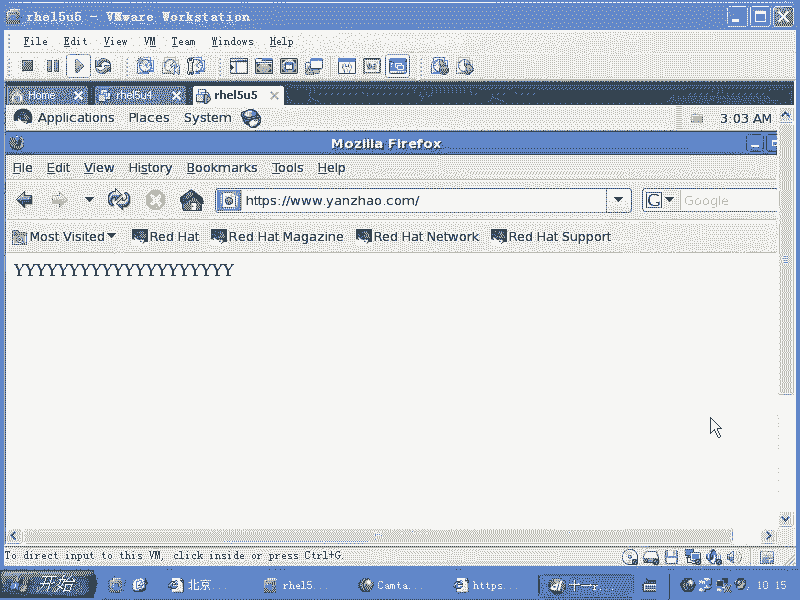

# 尚观Linux视频教程RHCE精品课程：P85：RH253-ULE116-8-6-mod-ssl-openssl 🔐

在本节课中，我们将要学习如何为Apache Web服务器配置SSL/TLS加密，以实现安全的HTTPS通信。我们将了解SSL模块的工作原理，学习如何使用OpenSSL工具生成自签名的密钥对和证书，并最终配置Apache以使用这些证书来提供加密的网页服务。

## 概述

Apache的SSL功能依赖于两个核心组件：**OpenSSL** 和 **mod_ssl** 模块。OpenSSL负责生成和管理密钥对及证书，而mod_ssl模块则负责让Apache能够处理SSL/TLS协议。配置SSL的核心是为Apache虚拟主机指定正确的私钥和证书文件路径。

## 检查SSL相关软件包

首先，我们需要确认系统中是否安装了支持SSL的Apache模块。可以通过以下命令检查：

```bash
rpm -qa | grep ssl
```

该命令会列出所有包含“ssl”字样的已安装软件包。你应该能看到类似 `mod_ssl` 和 `openssl` 的包名，这表示Apache已具备SSL支持能力。

## SSL加密的基本原理

上一节我们确认了软件环境，本节中我们来看看SSL加密背后的核心概念。SSL/TLS协议基于**非对称加密**（也称为公钥加密）体系。

*   **对称加密**：加密和解密使用同一个密钥。就像双方约定一个密码（如“123”）和一套算法（如乘以3再除以某个数），双方都必须知道这个密钥才能通信。其缺点是密钥在传输过程中可能被截获。
*   **非对称加密**：使用一对密钥：**公钥**和**私钥**。用公钥加密的数据，只能用对应的私钥解密；反之亦然。这样，服务器可以公开其公钥，任何客户端都可以用它加密信息，但只有持有私钥的服务器才能解密，从而保证了通信安全。
*   **证书**：证书本质上是附带了签发机构、所有者、有效期等信息的公钥。由受信任的第三方机构（CA）签发的证书，浏览器才会默认信任。自签名证书则是由服务器自己签发，浏览器访问时会发出安全警告。

## 配置Apache的SSL模块

了解了加密原理后，我们开始进行配置。Apache的SSL相关配置通常位于一个独立的文件中。

1.  打开SSL配置文件：
    ```bash
    vi /etc/httpd/conf.d/ssl.conf
    ```
2.  在这个文件中，你会看到加载`mod_ssl`模块的指令，以及监听`443`端口（HTTPS默认端口）的配置。
3.  关键配置项是虚拟主机部分。你需要找到并修改（或取消注释）以下两行，以指定证书和私钥文件的路径：
    ```
    SSLCertificateFile /etc/pki/tls/certs/localhost.crt
    SSLCertificateKeyFile /etc/pki/tls/private/localhost.key
    ```
    默认使用的是`localhost`的证书。如果你想使用自定义证书，需要将路径修改为你自己的`.crt`和`.key`文件位置。
4.  保存并退出编辑器后，重启Apache服务使配置生效：
    ```bash
    service httpd restart
    ```

## 生成自签名证书与密钥

上一节我们配置了Apache，但使用的是默认证书。本节中我们来看看如何自己生成一对密钥和自签名证书。我们将使用OpenSSL工具在 `/etc/pki/tls/` 目录下操作。

以下是生成不带密码的私钥和自签名证书的步骤：

1.  **生成私钥**：首先，生成一个1024位的RSA私钥文件（例如 `yankz.key`），并且不设置密码，以避免每次Apache启动时都需要输入。
    ```bash
    openssl genrsa -out /etc/pki/tls/private/yankz.key 1024
    ```
    注意：私钥文件权限应设置为`600`，确保只有所有者可读可写。
    ```bash
    chmod 600 /etc/pki/tls/private/yankz.key
    ```

2.  **生成证书签名请求（CSR）**：使用刚生成的私钥来创建一个证书签名请求。在交互过程中，最重要的一项是`Common Name`，必须输入你网站的完整域名（例如 `www.yankz.com`）。
    ```bash
    openssl req -new -key /etc/pki/tls/private/yankz.key -out /etc/pki/tls/certs/yankz.csr
    ```

3.  **生成自签名证书**：最后，使用私钥和CSR文件生成自签名的证书文件（`.crt`）。
    ```bash
    openssl x509 -req -days 365 -in /etc/pki/tls/certs/yankz.csr -signkey /etc/pki/tls/private/yankz.key -out /etc/pki/tls/certs/yankz.crt
    ```
    这个命令会生成一个有效期为365天的证书`yankz.crt`。

## 应用自定义证书并测试

证书和密钥生成完毕后，我们需要让Apache使用它们。

1.  编辑SSL配置文件，将证书和私钥的路径指向我们新生成的文件：
    ```
    SSLCertificateFile /etc/pki/tls/certs/yankz.crt
    SSLCertificateKeyFile /etc/pki/tls/private/yankz.key
    ```
2.  重启Apache服务：
    ```bash
    service httpd restart
    ```
3.  在客户端浏览器中访问 `https://www.yankz.com`（或你的服务器IP）。由于使用的是自签名证书，浏览器会显示“不受信任的连接”或类似警告。这是正常现象。
4.  在警告页面，你可以选择“高级”或“继续前往”等选项，以接受此证书并访问网站。对于生产环境，则需要购买由受信任CA签发的证书来消除此警告。

## 总结




本节课中我们一起学习了Apache SSL的配置全过程。我们首先了解了SSL依赖的`mod_ssl`模块和`OpenSSL`工具。然后，深入理解了非对称加密是HTTPS安全的基础。接着，我们逐步实践了如何配置Apache的SSL虚拟主机，如何使用OpenSSL命令生成自签名的私钥与证书，并最终将自定义证书应用到Apache服务中。记住，自签名证书适用于测试和学习，而正式的商业网站应当使用由可信证书颁发机构（CA）签发的证书。