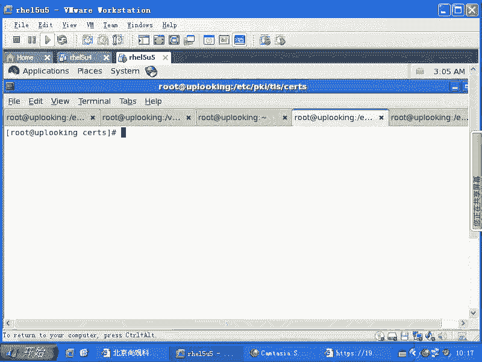
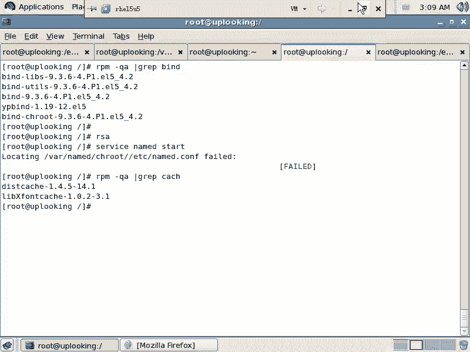
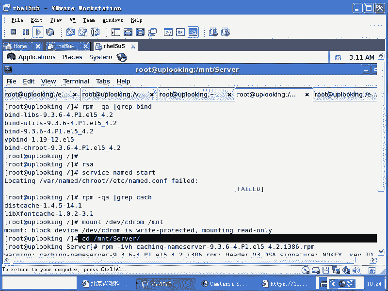
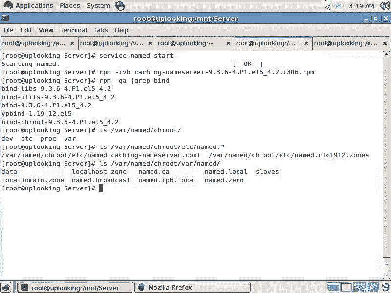

# 尚观Linux视频教程RHCE 精品课程 - P86：RH253-ULE116-9-1-bind-rpm-chroot-caching-nameserver - 爱笑的程序狗 - BV1ax411o7VD

那个。非常荣幸的，我们能一块儿啊能一块儿的话呢开始学习我们的大步头。呃，就是说我们的这个。DS体系。DNS体系的话呢，可以说是一直以来让我们痛不欲生的这样的一套东西。痛痛到什么程度呢？

就是在那边噼里啪啦讲了大半天是吧？然后我们的同学还是大眼瞪小眼的啊，偶尔有几个眼神清澈的人到做实验的时候却又出不来了。

它的环节又特别多，理论体系又特别烦，所以这就是DNS啊，但是我们说你要是不懂DNS的话，总是觉得什么比别人差很多啊。那我们看一下RP呃就是RPM。就是我们的这个。看一下我们的。

看一下我们的ban子有没有装上去，ban的话就是我们的DNS的工具包。ban的话呢，它在DNS里面的地位啊，就就相当于是什么呢？就相当于毛泽东开创了这个中华人民共和国是一样的啊。

也就是说没有他就没有什么DNS啊，那么有了他以来的话呢，一直都是他是什么？只要他还活着是吧？他就基本上是老大一级的人物，谁都没有办法撼动，明白吧？这就是banban的话呢，大家看的是9点多的版本。

以前的话，他有一些8点什么什么的版本的话，有一些漏洞，还被成功的入选成什么全球十大漏洞之一啊，那么就是这是以前我记得好像是打什么呢？就是03年的时候，打那个伊拉克战争的时候，因为那个时候不是说叫什么。

老是被伊拉克说话的那个电视台叫什么电视台？半岛电视台上？半岛电视台的那个主页不是被黑了吗？然后人家说哎一访问半岛电视台就访问到一个什么卖这个AV和卖那个就是说反正就是特别就是黄色的这个网站上啊，然后呢。

到底怎么回事呢？发现那个网站并没有被被黑，而是DNS就是负责解析这个网站的什么DS服务器啊，被黑了，黑了以后把那个记录直接转转到另外的一个机器上。很多公司都是这样的问题啊，比方说的话呢。

我们知道在生成密钥的时候，有一个叫做RSSA是不是RSA的话呢是创始者的三个人的名字，是这个公司创始者的三个人的名字的头一个字母啊，他们的话呢，这这个公司可以说在安全业内的话呢，就是老大啊，非常强。

这个公司他就是很多算法都是以RSC命名的是吧？就是他们发明的。那么他们不要的东西才扔到开元界里面。😊，大家免费去用一下是吧？他们服务的对象都是加密安全级别更高的。所以的话呢像这个公司有一次被黑。

就是什么？就是DNS服务器被截掉了啊，就是DNS服务器被什么被黑掉了。所以这个时候的话我们知道。DNS非常重要，是不是？还有的话呢，我们的那个百度啊，百度的话呢。

居然有段时间什么半天还是一天直接没有办法上去是吧？一访问百度的话，访问另外一个网站。那么就是因为他的DNSDNS域名的话解析有问题啊。当然那个那一次百度那次的话不是被黑。

是有人冒充百度的管理员给那个域名。域名机构叫什么什么goodda是吧？是goodda什么给他们的话呢，是就是说哎我是百度管理员，你帮我把那个域名解析一下啊，那个密码我忘了是吧？然后呢。

那那个管理员的话就直接那个人的话，负责DNS解析那个人就直接把它记录转到另外一台机器上了。结果百度的话，你想百度的话，比方说一年的话呢是。😊，我他的营收有没有100亿啊？

反正你一000的话就损失什么几千万人民币至少是不是？那没有上亿的话，就几千万啊，就这么回事。所以这个RSA的密钥的话呃。

不是就是说所以这个C啊或者半岛电视台啊或者百度的话都说明什么这些事件的都说明D非常重要。因为人家访问你的网站不是通过IP地址访问，是先知道一个域名是吧？

这个域名的话解析到那个IP地址上去这个工作就是由来做的话呢，基本上你想要的功能都有，而且现在基本上商业网站里面的话呢，你比方说我说ache它的地位如日中天是吧？但是很多大的网站它不用是吧？

用是但是呢我们ban的话呢，基本上没有不用没有不用的，它就是什么它就代表D那么就D就是它它就是D吧？就的话呢，它的进程或者服务的话呢叫做什么呢？namename你方namestar或者默认情况下的话呢。

😊，这个文件啊是不存在，是不是？那么是不是因为我的包没有装啊，是不是因为我们包没有装，你除了要看我们的band有没有之外，还要加上一个什么呢？CACH啊。

就是cash name servercash name server。如果这个包没有装的话，它所必备的那些配置文件是没有装的。它所必备的配置文件没有装，也就是cash name server啊。

cash name server。这个cash name server的话呢，我们可以通过光盘上的那个包把它装上去啊，我我这边是不是没有装啊，没有装的话，我得要装一下啊，我得要装一下。😊。

OK那么我这边的话呢找个光盘，然后执行了这样几行命令，mount一下，然后呢到这个目录下去是吧？就是到所有的RPM包所在的位置上去，然后呢再去怎么样把它的那个c name server的话装装上去。

上上去。你看一眼啊。招完了以后。装完了以后装完了以后的话呢，我们的这个这个文件的话，就是我们再去service啊service name。Servicice， named。star是不是？然后呢就。

能启动起来了，启动起来没有？是不是因为默认情况下的话，bu案的的配置文件是没有给你配的，要你全心手动去写。全员手动执行。但是呢有一个最小系统就相当于我们的name的它运行起来所必备的那些配置文件。

那么都给你配置好了，放在一个叫做这个包啊，就是这个包caashion name server啊，这样的一个包里面这个包装上去以后，它所必备的就是我们把你的运行的最需要的那些配置文件，它都给你弄了一份。

这样呢一启动装上去以后，它就可以启动了。它的配置文件都有了。但然这个东西的话呢，装完以后，你去把它star起来以后啊，你去把它star起来以后，那么也就是我们的name的它实际上现在只是做一个缓存服肌。

看到caashion的包。看到cation了吗？cashion name server是不是这个缓存服务器的话呢，负责给大家解析域名。当他自己本身没有这个数据的时候，他会到互联网络上去帮你递归这个数据。

回到互联网络时候帮你递归数据，这就是chion name server它的由来，听楚了没有？清楚了吧？啊，也就是它是做缓存的啊，那这样的话呢我们就要把DNS的体系结构的话呢跟大家说清楚啊。

这是我们让我们的。bu他自己做一个什么小的这个就是最小系统DS最小系统。它的话呢是这些文件在这个地方。因为我们现在啊RPM杠QAGREP呃bu。你会发现它的这个里面的内容的话呢。

是有一个叫做banCH rootot，看到了吗？这个包是起什么作用呢？就是让我们的班的运行的时候，它的入程不是真正的根，而是一个指定的目录。哪个目录呢？这个目录。哎，哪个目录。忘了啊。抗战。

是不是这个目录？哇啊。也就是说，buend在运行的时候，它以谁作为根呢？以这个作为根是吧？那假如说banend的话被入侵了以后，buend被入侵了，有个人完全控制了buend的这个守护进程。

就是name的这个进程。那么他控制了name的进程以后，name的以谁作为根？以这个波落作为根是吧？那你想到根外面之根的外面来可能不可能？😡，可能吗？就相当于你寻址的范围是什么？

根下面的什么什么什么文件，是不是？但是你现在以谁作为根呢？😊，你以这个目录作为根是吧？也就是你能访问到的所有的文件就是在什么？就是在这个目录下，其他的目录的话，你根根本就访不到什么真正的ETC目录。

你访问不到。你只能访问到什么外的 name当中的chan root下的ETC没有？就是 root这个包，也就是说在我们的HER4以后的版本当中啊，我们的大家因为re他也知道什么的这个家伙安全系数比较低。

是不是？于是的话呢，他担心这个服务被清理以后，整个系统的权限就全都没了，就全部被别人掌握了。所以的话呢，他就让ban以chan rootot的方式去运行。这样的话呢可以就是说什么呢？减低啊。

当你未知漏洞出现的时候，被别人控制的时候的损害啊，被别人控制被黑客控制的时候损害。明白了吗？因为他所有能操作的文件都是只局限在这个目录下看到了吗？😊，这就是什么呢？chan rootot。

而且不止band可以运行在ch root模式下，还有很多程序可以运行在chanroot模模式下。只要你看到RPM包里面装了band杠chan rootot，那你就知道所有的配置。

我们等一下接下来针对name的就是band的所有的配置都必须是在这个目录下进行了，明白吧？不能在真正的ETC目录下进行，明白吧？必须是什么呢？

wa的name当中chroot当中的是吧ETC目录听楚了没有？这就是基本的一个。😊，band的一个包的体系。那我们现在打开一个文件。

我们看一眼是wa的name当中的change rootot当中的ETC项目的namedcom啊。😊，这个里面啊这个里面的这个文件啊，这个里面的文件还有包含是什么呢？还有包括是我们的。waname。

还有这里面的这些文件，这些文件就是cching name server给你准备的。也就c name server这个包，它给你准备了一系列的最小运行所需要的文件，配置文件和数据文件。

这些数据文件是放在什么呢？wash的 name当中chro下的wa的 name，而它的配置文件是放在什么？wa的 name当中，chroot下的ETC项的name。😊，呃，ETC上的name的什么什么。

应该是name的点com。但是它现在的话呢叫做name的点caion name server是吧？点com对吧？这些文件都是c name server给大家准备的，清楚了没有？听楚了吗？

但是呢你那个cashion name server呃，呃就是你的这个bandd杠chan root这个包没有装，可不可以不装？你要不装的话，它所有的这个配置文件就全部都应该是在哪ETC下面的什么？

ETC项目的。name点com对不对？ETC下面的啊，就是根下面的wa下的什么name当中那个数据文件。也就是你要没有装的话，就要把前面这个目录怎么样？😊，删除掉明白吧？

就在真正的ETCMname的目录。就看你的这个包有没有装，这个包一装，所有的路径都要前面加上什么wa的name当中，确实就这么录像。😡，清楚了没有？这个你们要仔细看清楚仔细看清楚清楚了吧？😡，好。

我们现在清楚了以后，我们这个包的话呢就清楚了啊，我们这个包的话就清楚了。

