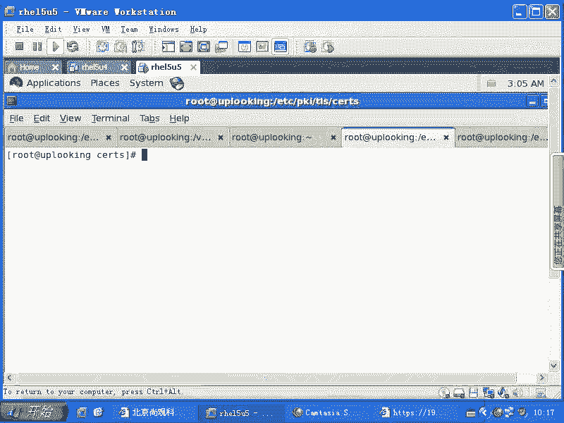
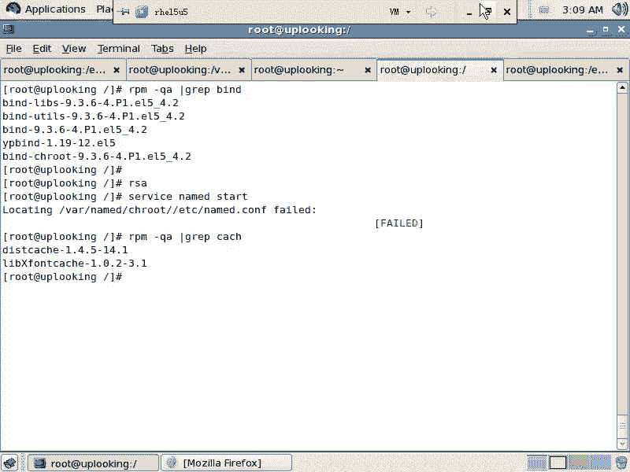
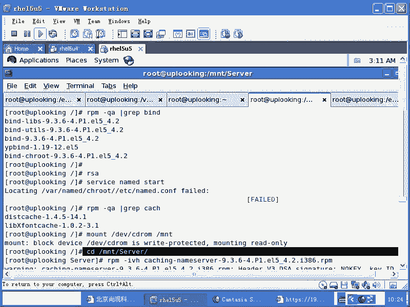
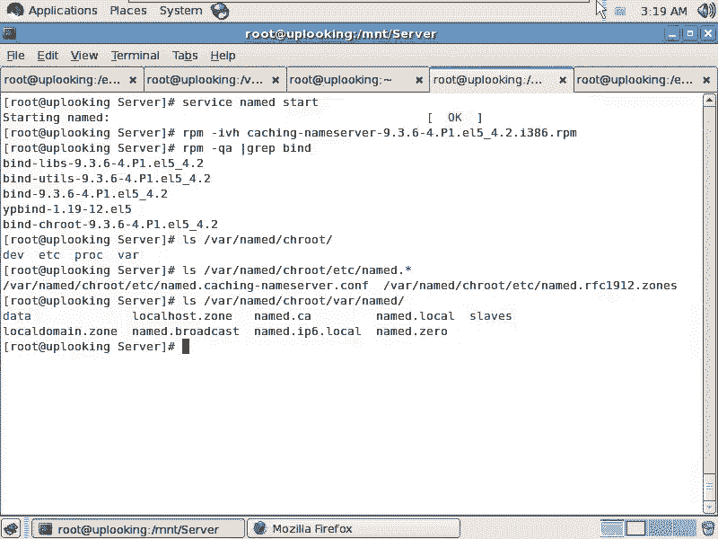

# 尚观Linux视频教程RHCE 精品课程：P86：RH253-ULE116-9-1-bind-rpm-chroot-caching-nameserver





在本节课中，我们将要学习DNS体系的核心组件——BIND。DNS（域名系统）是互联网的基础服务，负责将域名解析为IP地址。BIND是DNS服务最广泛使用的实现。本节课将重点介绍BIND的RPM包结构、chroot安全运行模式以及如何搭建一个基础的缓存域名服务器。

## BIND简介与重要性 🧱

DNS体系结构复杂，但其重要性不言而喻。许多关键的网络服务都依赖于DNS的正常工作。历史上，包括半岛电视台、RSA安全公司以及百度在内的多家知名机构都曾因DNS问题导致服务中断或被劫持，造成了巨大的经济损失和影响。这些事件都凸显了DNS安全与稳定运行的极端重要性。

BIND在DNS领域的地位如同基石。绝大多数商业和开源DNS服务都基于BIND构建。因此，理解BIND的配置和管理是系统管理员，特别是RHCE认证学习者的必备技能。

## 安装BIND及相关软件包 📦

要使用BIND提供DNS服务，首先需要安装相应的软件包。BIND的主包名为 `bind`，但仅安装它还不够。要快速启动一个可用的缓存DNS服务器，我们需要安装 `caching-nameserver` 这个包，它提供了BIND运行所需的最小配置文件集合。

以下是检查与安装的步骤：

1.  首先，检查BIND主包是否已安装。
    ```bash
    rpm -qa | grep ^bind
    ```

2.  安装 `caching-nameserver` 包。通常需要从系统安装光盘或YUM仓库获取。
    ```bash
    # 挂载光盘
    mount /dev/cdrom /mnt
    # 进入RPM包目录
    cd /mnt/Packages
    # 安装缓存服务器包
    rpm -ivh caching-nameserver-*.rpm
    ```



安装完成后，BIND服务（名为 `named`）所需的基本配置文件就已就位。此时可以尝试启动服务：
```bash
service named start
```
这个由 `caching-nameserver` 包配置好的BIND实例，默认作为一个**缓存域名服务器**运行。当它自己没有某个域名的解析记录时，会代表客户端向互联网上的其他DNS服务器递归查询，并将结果缓存起来，以供后续请求使用。



## 理解chroot安全模式 🔒

上一节我们介绍了如何安装并启动一个基础的BIND服务。本节中我们来看看RHEL/CentOS系统为BIND提供的一项重要安全特性——chroot。

在检查已安装的BIND相关包时，你会发现一个名为 `bind-chroot` 的包。这个包的作用是让BIND服务运行在一个“**改变根目录**”的环境中。这意味着BIND进程看到的文件系统根目录（`/`）并非真正的系统根目录，而是被限制在了一个特定的目录下，例如 `/var/named/chroot`。

这种机制极大地提升了安全性。假设BIND服务存在未知漏洞并被攻击者控制，攻击者所能访问和操作的文件范围也被限制在了这个虚拟的根目录之下，无法触及真实的 `/etc`、`/bin` 等关键系统目录，从而将潜在损害降到最低。

从RHEL 4以后的版本开始，系统默认会安装 `bind-chroot` 包。一旦安装此包，**所有针对BIND的配置都必须在其chroot目录下进行**，而不是在标准的系统目录下。

## BIND在chroot模式下的目录结构 📁

由于我们安装了 `bind-chroot` 包，BIND运行时的文件路径发生了根本变化。理解这个新的目录结构是正确配置BIND的关键。

`caching-nameserver` 包提供的所有配置文件和数据文件，都被放置在了chroot的虚拟根目录之下。具体对应关系如下：

*   **配置文件**：传统的 `/etc/named.conf` 现在位于 `/var/named/chroot/etc/named.conf`。
*   **区域数据文件**：传统的 `/var/named/` 目录下的文件现在位于 `/var/named/chroot/var/named/`。

以下是关键目录的说明：
*   `/var/named/chroot/`：这是BIND进程的虚拟根目录。
*   `/var/named/chroot/etc/named.conf`：BIND服务的主配置文件。
*   `/var/named/chroot/var/named/`：存放DNS区域数据文件（如 `named.ca`、`localhost.zone`）的目录。

**重要提示**：如果没有安装 `bind-chroot` 包，那么BIND将使用标准的系统路径（如 `/etc/named.conf`）。一旦安装了 `bind-chroot`，就必须使用chroot目录下的路径进行所有配置操作。



## 总结 📝


本节课中我们一起学习了BIND DNS服务器的入门知识。我们首先了解了DNS及BIND的重要性。然后，我们通过安装 `bind` 和 `caching-nameserver` 软件包，快速搭建了一个可用的缓存域名服务器。接着，我们深入探讨了 `bind-chroot` 包提供的安全运行模式，它通过改变BIND进程的根目录来限制潜在的安全威胁。最后，我们明确了在chroot模式下，BIND配置文件和区域数据文件所处的新的目录结构（`/var/named/chroot/`）。掌握这些基础概念和路径是后续深入学习BIND高级配置的基石。