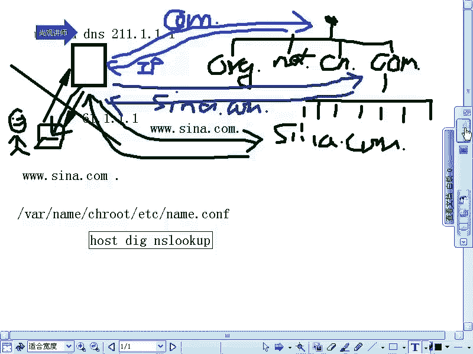
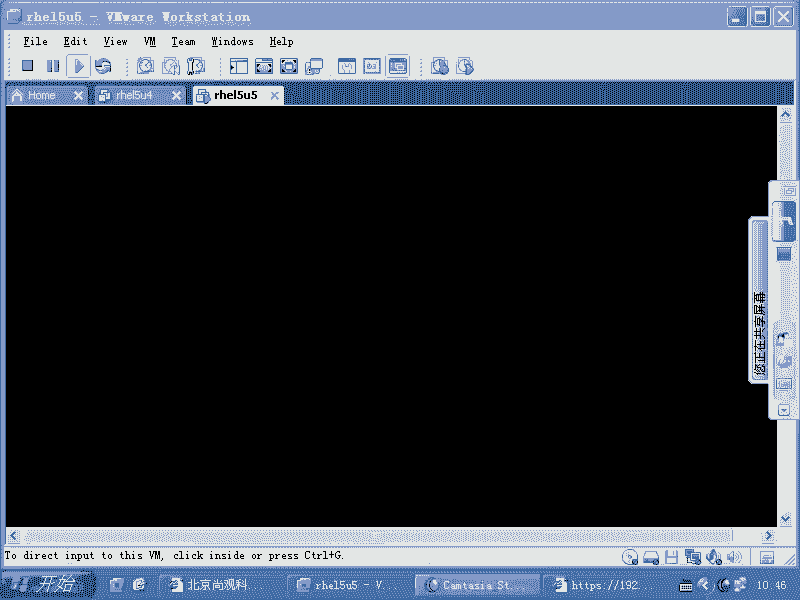
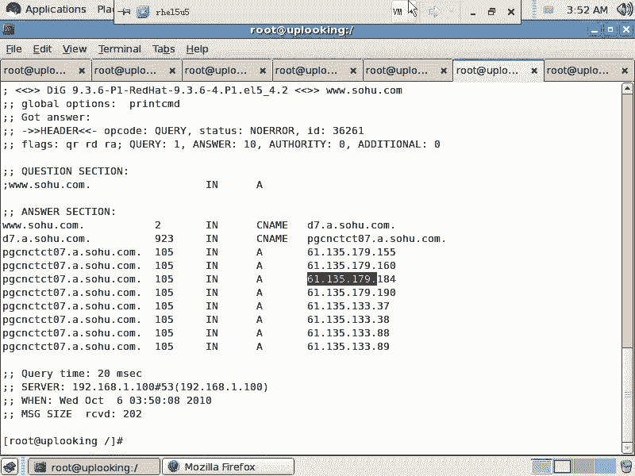

# 尚观Linux视频教程RHCE 精品课程 - P87：RH253-ULE116-9-2-bind-dns-system - 爱笑的程序狗 - BV1ax411o7VD

七。我们现在的话呢看到的name它的主配置文件应该是这个文件。它的主配置文件是这个文件。那name的话呢，我们在真正去开始着手去配置的时候，一定要非常熟悉什么呢？DS的体系啊。

name的话呢是我们的apppartache就是linux当中的话，主要的DS服务器。它基本上所有的unixlinux都可以运行啊，但是我们这边的话是RPM安装的。

那么unix这的话呢可能是呃就是其他方式运行的啊，我们看一下。现在的话我们要隆重推出啊隆重推出我们的DNS的体结构。这个的话呢可以说是我们整个的一个就是。就是说你一定要理解这是一个必须的一个技能。

必须的一个技能。不理解它的话呢，别方windowslinux还是什么unix系统，全部都会用得到啊。不理解它的话呢，你的知识体系当中就少一块啊，就跟别人打招呼的时候倍儿倍儿没面子是不是啊，开玩笑啊。😊。

你看。现在的话我有1个DS服务器啊。这么难看的颜色。好，我们的话呢拿我们平时的这个环境来说啊，我们拿平时的环境来说，看一眼。现在的话呢，我有1个DS服务器，这个DS服务器是网通的，或者说现在的联通是吧？

那么我这边的话呢有一个人。这个人的话呢，他。他的话拿一个什么拿个笔记本电脑上网。这个笔记本电脑的话，一上网的时候啊，一上网的时候，它的话呢自动获取1个DS服务器地址，是不是？假如说它是ADSL拨号的话。

那么这时候ADSL会给他一个默认的DS服务器是不是？那么如果要是他现在的话呢，想去上网，他的话呢要查询我们的什么这个DS服务器啊，这是一个什么呢？DS服务器。😊，我把字稍微小一点啊。这是什么呢？

联通的1个uniccom的什么DS服务器。这个DS服务器的地址的话呢是什么？比方说是呃211。1。1。1，对不对？这样的话，我指接给他。那么当他去查的时候，那么他想查的是谁呢？

他想查的是3W点C呢点com的域名，是不是？但是呢我们这个域名啊就直接这样去输入在浏览器当中一回车就可以上网了，对不对？那照样我们的理解是怎么样的？就DS服务器，他应该是怎么样，是应该。

我们的这个机器把这个域名往这边一发送，它的话呢就会解析出来，对不对？解出来。于是的话呢，他应该告诉我一个什么IP地址，他应该告诉我1个IP地址。这个过程的话呢是比方说比方说IT地址是61。1。1。1啊。

这个过程的话呢是我们所看到的。但是真正的这个体系如果要是这么简单，那就有问题了。有什么问题呢？全世界的DS服务器啊没有个。上千万台，我觉得百万台是应该有的。是吧那么至少是上万台或者说上10万台。

是有这么多的DS服务器。新浪的域名是吧？它有一个域名加1个IP地址的映射是吧？这条记录是不是应该什么？应该这个记录应该是3W点C娜点com的这个记录，它所对应的这个关系，就是61。1。1。1是吧？

它要它要这个对应关系是不是应该放到DS服务器里面啊，是不是啊那放到DS服务器里面，那么我们现在的话有10万台机器，或者说几十万台机器都有这条记录。当我们想更新其中的记录的时候。

比方说现在新浪的IP地址变了。😊，那我要传达到多少台机器上去？😡，几十万台是不是？那这些机器全部都要同步数据。而且同步的是不止一个新浪搜狐特变，是不是？那这样的话呢，搜狐的这个记录它也要全部都同步。哎。

我们这边只是说中国的。老美那边呢google又换服务器了，是不是？google那边的服务器一换，哎，我们这边的话也要跟着同步。那这域名的话呢，有几亿个几十亿个。

是不是我们要同步这这些东西在几十万台机像去同步呃忙的过来嘛。😊，每天就刚光干这点破事儿就干不完，你们觉得是不是这样？😡，几十万台机器要同步几亿条数据，几十亿条数据。你说这样的方式能行吗？

互联网络上有这么多台机器，没台机象，且不说它能不能保存几亿个或者几十亿个数据，是不是？且不说这一台机上能不能保存这么多，或者保存了以后它的速度怎么样，我们还说不清楚。

单说这几十万台机器同步这几几亿条记录，它就是不可能的，是不是更何谈什么呢？及时去更新了。😊，我一天同步一次，我可能都挺费劲的，是不是？所以这个时候的话呢，这个体系结构基本上是不成立的。

也就是我们虽然是看到这一点是因为什么呢？是因为我们的话呢被怎么样被隔绝开了，是吧？但实际上的话呢，这个记录绝对不是这么简单啊，绝对不是这么简单。也就是这条记录的话呢，它不是这么得出来的。

它不是这么得出来的。所以的话呢，它要通过一个叫做什么递归查询的东西查询整个的DNS的分布式的数据库。DNS的话呢，它的数据是储存在什么一个分布式的体系当中。这个分布式的体系的话呢，既可以提供集群。

又可以提供什么复载均衡，又可以提供什么容错。所以整个的这条体系的话，我们说经过几十年的发展，到现在啊我们说DNS还是非常不错的啊。那么我们。😊，重新来说一下它的体结构到底怎么样。

当我们这样的一个人啊这样的人通过这个电脑去访问这个域名的时候，这个域名绝不是这么简单。它本身的话呢有一个非常重要的东西叫做什么呢？点啊，这个点也就最后的这个点呢是非常重要的。这个点的话，我们一般不输入。

但是实际上默认是有的，这个点的话呢就叫做根。啊，这个点就是叫做根。那现在的话我把它啊这个体系给它做一个什么呢？类比，就是我们现在的文件系统。当我们想去访问一个文件的时候，比方说访问。

哇下的name当中的什么呢？亲至入制当中的。ECC目录下的。name点com啊，假如说我们去想去访问这个文件的时候，我们想去访问这个文件的时候。访访问这个文件的时候。

那么这个文件它所在的它所在的这个位置是怎么被定位的？它是不是通过一级一级访问去定位的？我们先找的是谁啊？我们先找的是根是不是根找完了以后找根下的Y，是不是根下的Y以后，找完的是Y下的什么name的。

然后再一级一级去找这个体系的话呢，就是一个竖形体系，大家都是从一个数根来，这个树根是谁啊？就是根，对不对？但是呢我们DS的话呢，也是从一个根来，这个根是什么呢？点，这个点是先去找。

然后再去找点下的什么com，然后再去找什么com下的什么C呢，再去找com下的C呢当中的什么？😊，第呃3W这项记录，所以它是反过来来的，但是都是树形结构，听明了吧？

树形结构的话呢是为了我们方便定位东西用的。以前大家可以不用知道，那是因为大家在windows下生活是不是？现在大家必须得知道，因为什么呢？因为一切都要从编程者的角度上去考虑。啊。

你凭什么说这个记录一找就找到了，对不对？它总得有一定的访问方式啊，访问方式就是树形的搜索方式，明白了吗？😊，好，现在我们看如果要是你查的是这样一个记录，那你知道你把这条记录发给谁呢？

发给我们DS服务器以后，DNS服务器上假设说是没有这条记录的那它是怎么样过程呢？他要先去找点。非常好的是，全世界总共有13台root服务器啊，有13个点负责解析点的服务器。

这13台服务器上的数据都是一样的。分散在世界各地。只有什么呢？只有中国没有啊，中国这样的一个大国没有其他大国的话呢，你像欧洲啊有就是欧盟有日本有美国有啊，其他地方的话呢就没有我们中国的话呢。

尽管啊网民数量居于世界第一位。但是怎么样？因为这是一个战略资源，真正打起仗来的时候啊。真正打起仗来的时候，老美，然后联合他的盟友把这个根服务器是吧，E5说什么呢？咱们别给中国人解析啊，于是的话就怎么样。

大家都都访问不到了，明白吧？所以它是一个战略资源，战略资源一旦被封闭了以后，如果按照传统的方式。那么中国所有的DNS解析都会限制限到什么停滞状态，也就是你连CN你说啊，你我解析CN不就完了吗？

CNNIC就是中国的域名解析机构，不是说我们自己有什么CN的这个根据服务器嘛，是不是但是那个是唬人的点并不在你中国，明白吧？他把点E5就是你访问的是什么？3W点C点com点CN是吧？它后面还是有个点。

明白吧？他那个点还是逃不掉的。所以那个点的话呢，不在咱们中国人的解析范围之内，实际上它是一个战略资源。老美是牢牢的把握住。因为整个这套体系是谁建立的。😊，美国人建立。明白吧？所以他把这个根的话呢。

这个给它弄住。当你的这个点要解析的时候，就是你发过来的时候，我们这个DS服务器它不知道这条记录在哪。这时候它首先要怎么样考虑那个点所有的DS服务器都内置了13个根域服务器的地址。

都内置了13个根预服务器地址，它会进行轮巡。也就是说我第一次解析，我解析第一个第二次解析这个点的时候，解析第二个。那么也就是说负责解析点的这个根预服务器，它在互联网络上是不是是有13个服务器。

是不是我解析任何的一个都可以，这13个根预服务器当中的话，它负责解析什么呢？它这边储存的记录是下面的什么？它下面的这种，要么是什么？😊，come要么是什么CN是不是要么是什么？要么是night。😡，啊。

那么也就是说come点CN1点n1点都是这些记录的话，呢会被储存在什么？存在我们的这个根。呃，就是这个点下面明白吧？这个点的话呢，并不储存世界上所有的域米，它只是储存它下面的什么下限，是不是下限。

它的下限是什么？抗点深一点，这是是不是跟传销很相像啊，是吧？传销害人啊，是不是？然后呢，我们在这边什么ORG。点，那么这个体系结构也是个数形结构，最上面的大头是点，然后下面的话呢是直接什么什么点。

当我们去写析C的点com点的时候啊，那这时候的话呢我们先去先去查到什么呢？它啊先去查询的是。先去查询的是什么呢？先去查询的是点问他什么呢？问这个服务器说什么呢？我这的IP地址。

因为它是不是内置了13个更新服务器地址啊，他说请告诉我什么come。😡，啊，come一点的这个服务器在哪，好不好？于是的话呢，他这边是不是有这个记录啊，于是的他告诉他1个IP地址。这个IP地址的话呢。

就是come一点的更据服务器呃，一com一点的这个DS服务器。然后接下来的话呢，它会去怎么样呢？它会去查询什么come一点。查询他这时候查询come点下的什么，他说说啊，请问C了点。

come一点的DS服务器在哪？然后呢，负责解析它的这个DS服务器的话呢。又是什么呢？一个体系。所以com一点，它的这个DNS服务器，它的负载是非常大的，明白吧？它的负载是非常大的。这个负载的话呢。

它这边有1个DNS服务器，比方说叫做什么呢？C呢？点com。一点那这边这个D压出近，然后呢，这时候的话呢，他给他一个回应。他给他一个回应。告诉你他的IP地址是多少。然后呢，这个DNS服务器再去怎么样呢？

再去。再去解析什么呢？C的点com。然后呢，这时候的话就问他什么呢？这时候问他的东西是。3W点C娜点com点，这时候你问的就是正轴主了，它这个地方专门解析s纳点com点的任何东西，知道吧？

3W是在它的解析范围之内，你要想发邮件到什么呢？什么什么艾特点com去，也是由他来解析。你想访问什么呢？mail点C点com也是在他的解析范围之内，明白了吧？这样的话都是由他来进行。

所以这个时候的话呢真正去回过来一个什么回复过来一个什么IP地址，这个IP地址给了他以后，最终什么呢？这个IP地址解析完以后再给我们的什么这个地机器。所以这就叫做递归查询。清楚了吗？清啊。

那么你想不想知道你的这个域名到底是怎么被解析的，你想看这个过程是吧？你想看这个过程，我们说你可以用NS look看，是不是我们给大家介绍过，是不是介绍过几个命令啊？介绍过几个命令，这个命令的话呢。

有什么有host的命令。是不是还有dig命令，还有什么Nlookup命令啊，NS lookup命令。那么我们说用NS lookup命令，你可以自己模拟这个过程，对不对？然后呢。

现在我们的话呢可以用dig命令来做啊，我们可以用d个命令来做。😊。

看一眼啊。

看一眼。我们的话呢在另外一边。我们看一下。我们看一眼，现在的话呢，我们能不能上网啊，拼。3W点C那点com点是不是？这样的话，它能帮你最终解析出来啊，你说的到精巧，一解析解析出来这个过程到底怎么样呢？

我们用这样的第一个。😊，杠呃。家是吧。Trick。这个家。去死啊。OK我们看一下这个过程啊。这时候他开始去d了。这个加ch的话呢，你现在访问你如果pin的话，它只是说加一个什么，就直接告诉你的结果是吧？

就相当于那个服务器里面的话已经有什么已经缓存了，是不是？那现在的话我就要让他自己去什么dig一下，就Dg一下的话，他会把整个的过程的话呢，告诉你。被封杀了吗？加ch。一样吧。一样啊。这个命令的话呢。

就是让是我能得到这个数据。我知道这个数据是什么。但是你把这个过程给我显示出来，那它就会从什么根那边去得到数据。然后呢，又从根下面的什么com点当中去得到数据，是吧？

然后又到com点当中的什么这个s纳点com点去得到数据。38。把3W去掉。不对啊，这个过程我觉得不是这个问题，好像是跟联系不到的问题。就是他没有办法缝跟。他没办法跟。一样啊。

OK那么我们就手动来模拟用NS lookN look up是不是NS lookup直接回车，它就连接到你默认的那个DS服务器的。你默认DS服务器是放在哪儿？默认的DS负机分子呢。

ETC下的RESOLV是吧是吧你查下哪个DS服务器呢？1。100是不是？其实的话呢这个时候1。100它是作为一个转发器，转发器的话就是它不去做递归，它把所有的数据全部都什么转发到它的下级。

也就是平时我们那个路由器，它路由器做DS服务器的时候，它就是做什么DS的转发器啊，它跟那个cion name server还不一样。 name server是自己可以缓存数据是吧？自己可以做递归。

而我们的那个小的路由器，它是什么？直接转发。所以的话我们根本就不想去查它。😊，尽管它能得到这个结果，但是呢它是实际上是转发所有数据包。然后我们现在这样的，我先去查啊，3，我先去查。

我去setQ等于NS这是什么意思呢？你看啊。我们想去查记录的时候，我们一般查3W是不是3W点C娜点com。但是我们发邮件的时候，是不是发一个艾特C娜点com，是不是什么什么艾点C娜点com。

你们想这都是查s娜点com。😊，我们访问域名。s点com的时候也能得到一个网站，是不是这个网站跟发邮件的时候，那个艾特s点com一样不一样，是不是同一个服务器？很可能不是大公司肯定是不是，对不对？

你把QQ点com，你访问QQ点com是一个网站，对不对？然后你发邮件的时候，什么什么艾QQ点com就是它的邮件服务器是吧？这两个服务器它的IP地址很可能不是同一个，对不对？

所以的话呢当我们的需求不同的时候，它查询出来的记录是不一样的。所以的话Q等于什么什么就是记录的类型。😊，我们发邮件的时候，他用到的是MX类型。优先使用的是MX记录。那我们想去查询邮件的话。

就是Q等于什么MX明白吧？但是我们访问网站的时候，它的记录是什么呢？A啊就是什么呢？默认的主机记录，明白吧？那么当我们想去查询的是什么DNS服务器本身的时候，我想查询的这个记录啊，不是一个A记录。

也不是一个邮件服务器的记录，而是一个什么呢？而是一个。😊，DNS服务器它本身就是一个域名服务器的时候，那叫做NS记录，明白吧？我查NS记录，传NS记录的话呢。😊，它询NS记录Q等于NS回车。

这个时候的话呢，说我要查询的是NS记录。然后现在我想去查询什么呢？我想去查询啊，我们的那个我们想去这边是我们这个uplooking的DNS服务器啊，我想就我现在想去查询什么呢？

想去查询我们的这个根是不是根的，是不是你不是说任何的DS服务器里面都内置了13个根据服务器的地址吗？是不是我现在查查询根，那么现在他查询根的时候，他说根的DNS服务器地址什么？213。229。75。

15，是不是？😊，他告诉我说这样的一个，那么。我现在的话呢查这个，那么现在我这样的。ser啊，然后呢我到这个根下去查。我现在到这个服务器上，ser就表示我查询的服务器已经不是1。1瓦了，是不是。

而是什么呢？这台机器然后我就在这台机上，我再去什么呢？再去看跟所对应的DNS服务器地址。😊，回车。这时候的话就比较慢啊就比较慢。因为咱们那个第个命令加chice以后，它为什么那么慢呢？

就是因为什么这个过程特别慢，是不是？这个过程特别慢，要等很长时间，有可能出不来。因为我们现在的话呢是要跨外网话去连接什么外网上的什么根，它要查询根，它所对应的是三个月服务器啊，也有可能是什么呢？

咱们中国政府是不是做了一些什么？优化。是不是也就是说呢它可以不依赖于什么呢？就是那13个更以服务器地址，有可能是这种DNS服务器往外去转的时候，它就直接什么模拟了一个什么DNS服务器，明白吧？

也有可能是这样啊。没有server可以被。达到你是访问不到根，是不是？我们去查一个这个吧。查我我们公司的这个DS不线，我们看他成不成啊。那看来这个过程是不成了。

就是说今天是不是跟服务器是不是不允许我们查询是吧，还是不允许我们访问啊。我也可以从一个就是我装了cion name server以后。

cion name server不是在wa的 name当中的ch rootot当中的wa的 name当中不是有数据嘛，是不是在这个文件里面啊，会有一个文件啊，我们看一下。😊，Cat。这个下面的什么呢？

name点。CA是吧。这边有13个更预服务器的地址。这边有13个更据服务器地址，来我们来看一下啊，这个三个A的记录是什么记录呢？是IPV6的记呃，4个A的记录是IPV6的记录啊。我们找这13更应服务器。

比方说找一个这个吧。然后这样的ser。我们找刚才那个其中1个DS服器，然后我们去查询什么呢？点。No answer啊。Site。Q等于NS那我我找到一个根是吧，找到一个根，我是不是开查询抗点，是不是？

come一点。他告诉我com一点所对应的DNS服务器有这么多，是不是啊总共有多少台com点DNS服务器啊？A一直到M应该是。13个吗？15个是不是？是不是15个？有15个DS服务器都解析com一点。

那么我随便找一个，你看这种记录啊，你看这种IP地址就看出来全部都是在什么北美。就是全部都在北美，然后这样的啊，再去ser。啊，我找其中的一台查其中的一台，我现在要查谁呢？比方说我查雅虎，是不是查雅虎。

我这边是雅虎。点com一点，刚才我查询的是点，然后又在点那边查询的是什么com一点，是不是现在我查询com一点下的什么雅虎点com一点。压点com点查出来没有？是不是查出来以后，我再去ser呃ser。

😊，找一台雅虎的DS服务器，我去查什么呢？我去查。3W点雅虎点com一点，可不可以啊？OK他告诉我，3W点雅虎点com点，它所对应的是一个别名记录啊。我刚刚查NS记录嘛，现在我这样的sQ等于什么A。

我现在查A记录，是不是查A记录，查A记录的话呢，我这边就是查询的是。3W点。雅虎点com一点啊，应该还是那个记录。看那记录。还是那记录，他说这个记录是一个别名记录，是他的一个别名。那我现在在查询他啊。

我再查询他，我说啊这个记录所对应的是什么？他说没有应答，没有应答的话，呢，可能还是让我们再去继续递归了，是不是再重新递归一下了，那我们再去查询什么？雅虎点com一点点B啊。B点雅虎点com一点。

没有印子啊。No answer。我这边是set。就等于NS。换一台。哎，这个能查出来是不是？那么这个记录的话呢，它所对应的是什么呢？呃。所对应的是。8个IP地址是不是？也就是说最起码的话呢。

它有8台服务器，是不是？但是实际上的话呢，肯定不止8台。也就是说实际上是有8个负载均衡器。这8个负载聚衡器的话呢，又重定向到什么呢？又又去每个负载均衡器后面的话呢又会有很多内网的IP让它去重定向。

明白吧？所以的话呢相当于有8个集群啊，8个集群，听楚了没有？最终我能得到1个IP地址，这就是我自己做递归的过程。我先连接到什么登去是吧？现在我做的操作就是什么呢？

我这个人做的操作就相当于你问我说3W点雅虎点com，它所对应的IP是多少。我说哎，我不知道呀，但是我是不是能有13个根据服务器地址啊，然后我找其中的一个根据服务器上，我去说什么呢？哎，com一点它的。

2S记录有哪些是不是？于是的话我找到com一点，然后呢，我再去查询com一点。我说什么雅虎点com一点是不是找到雅虎点com一点，然后我又去找什么呢？那个找到雅虎点com一点的这个呃DS服务器。

我说3W点雅虎1点com一点，它的A记录对应是多少，对不对？结果他给我对应出一个什么别名来，是不是我又去查那个记录的什么A记录那个A记录的话呢，所对应的是这个IP地址，明白了吗？😊，它是这么一个过程。

所以呢最终我得到这个IP地址以后，我拿其中的一个出来啊，你再去查询一遍，它的顺序会变。再去查询一遍的话，它的顺序会变啊。也就是说我去这时候我找的是第一个，我把这个第一个IP查出来以后。

然后我就告诉你说哎，你哥哥们，你刚才不是看什么3W点雅虎点com嘛？问我这个IP是不是我告诉你啊，IP这个但是对于那个对方来说，对方根本就不知道我经历了千辛万苦是吧？跑到北美那边去给你查出来的记录。

是不是所以整个的这个数据的话呢，是分散储存在整个的internet上去，有千千万万个什么DNS服务器，是一个分布式的什么。😊，分布式的一个结构是不是？所以在配置DS服务器的时候。

这个题结构是一定要非常了解的。清楚了吗？如果你不了解的话，那么就会有。哎。我这个记录怎么一会儿变一会儿变，是不是就就很很很很麻烦啊。所以这个东西的话呢，大家清楚有关这个命令的话呢，我们可以看一下。

比方说我们查一下本本机的啊，就是说本地的一些，比方说用这个3W点搜狐点com。那你看一眼搜狐的DI呃搜狐的IP地址是不是有一堆啊。😊，是不是我们查询的是三W点搜狐点com。

但是它实际上是一个这个这个东西的一个什么A记录呃，一个别名记录是吧？C name记录就是别名记录。A记录就是普通的什么对应IP地址的记录，明白吧？然后呢，我找到这个了以后。

然后我再去查询他是不是他的什么他的是什么记录呢？他又是他的一个什么别名记录。然后最终查询这个记录。这个记录的话呢，你看它是不是查询出了什么CNC是不是CNC是网通，是不是，也就是说他知道了我是谁呀？😊。

我是网通的客户，是不是？实际上如果你是电信的话呢，电信的话呢，也会有什么相应的这种呃就是一系列IP地址。那么那一系列IP地址就是电信的IP地址。所以他现在用的是什么呢？

我们可以肯定的是搜狐在用什么CDA。CDN就是说内容分发网络，它是根据来源不同匹配不同的IP地址。我是网通的客户，是不是啊？那么给我查询出来记录的话，全部都是网通的啊，如果电信的客户查询的就是电信的。

明白吧？在这个地方就是D7A点搜狐点com这个地方，这负责解析他这个域名的这个DS服务器，它就怎么样呢？他就帮我怎么样，他就帮我已经进行什么。来源匹配了，根据不同的来源匹配不同的IP地址。

我的来源是网通。那他帮我解析的是网通的IP地址，明白吧？有专门的话呢，做这种就是ban的可以做到这一点，来源不同。啊，IP不同，明白吧？啊，所以它呢这边你可以看到，首先搜狐它不只有1个IP地址，它一堆。

然后呢，这边这每1个IP地址实际上对应的是什么？screen服务器。缓存服务器明白吧？这个screen服务器真正的搜狐的主站，它可能是一个集群。但是这个集群的话呢，它是。就是有很多的缓存的节点啊。

缓存它里面的数据OK这边搞清楚了没有？

好。