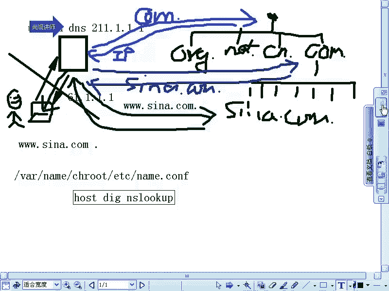
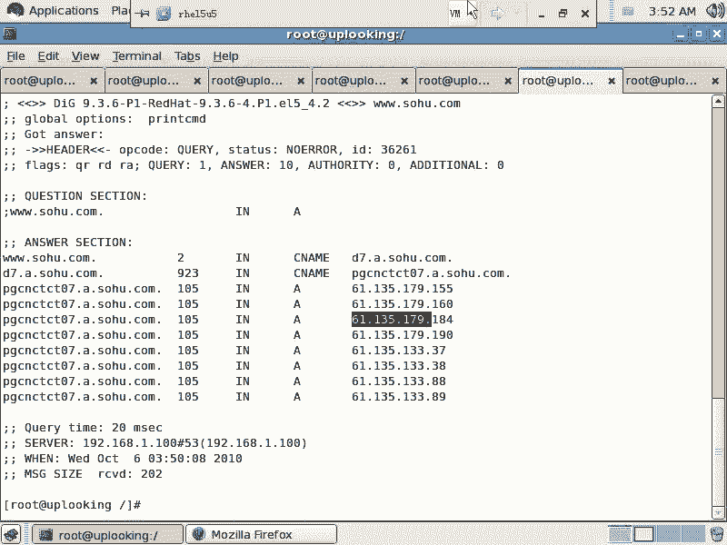

# 尚观Linux视频教程RHCE精品课程：P87：RH253-ULE116-9-2-bind-dns-system

## 概述
在本节课中，我们将要学习BIND DNS服务器的核心概念，特别是DNS的分布式体系结构和工作原理。理解DNS的递归查询过程是配置和管理DNS服务器的关键基础。

## DNS体系结构详解

上一节我们介绍了BIND的主配置文件，本节中我们来看看DNS的核心体系结构。DNS（域名系统）是互联网的一项核心服务，它将人类可读的域名转换为机器可读的IP地址。

BIND是Linux系统中主要的DNS服务器软件，它可以在几乎所有类Unix系统上运行。我们使用的是RPM安装包。

现在我们要隆重推出DNS的体系结构。理解这个结构是一项必须掌握的技能。如果不理解它，无论是Windows、Linux还是其他Unix系统，相关知识体系都会不完整。

### DNS查询的直观理解与问题

想象一个常见的上网场景。我们有一台笔记本电脑，它通过ADSL拨号上网，并自动获取了一个DNS服务器地址，例如联通的DNS服务器 `211.1.1.1`。

当用户在浏览器中输入 `www.sina.com` 并回车时，计算机会向这个DNS服务器查询该域名对应的IP地址。DNS服务器返回一个IP地址，例如 `61.1.1.1`。这个过程看起来很简单。

但如果全球的DNS体系真的如此简单，就会产生严重的问题。全球有成千上万，甚至可能数十万台DNS服务器。新浪的域名 `www.sina.com` 与其IP地址 `61.1.1.1` 的映射关系，需要存储在所有DNS服务器上。

当新浪的IP地址变更时，需要同步更新全球所有DNS服务器上的这条记录。这还只是一个域名，互联网上有数十亿个域名。每天同步数十亿条记录到数十万台服务器上，这是不可能完成的任务。且不论单台服务器能否存储如此海量的数据，单是同步的及时性就无法保证。

因此，实际的DNS体系绝非如此简单。域名到IP地址的映射不是通过一台“全能”的服务器直接给出的，而是通过一个叫做“递归查询”的过程，查询一个分布式的数据库。这个分布式体系提供了集群、负载均衡和容错能力，经过几十年的发展，已经非常成熟可靠。

### DNS的树形结构与递归查询

为了理解DNS如何工作，我们需要重新审视域名的结构。域名 `www.sina.com.` 最后有一个点，这个点通常不输入但默认存在，它叫做“根域”。




我们可以将DNS体系与文件系统进行类比。访问文件 `/var/named/chroot/etc/named.conf` 时，系统通过 `/` -> `var` -> `named` -> ... 的路径一级级定位。DNS也是类似的树形结构，只不过方向相反：从根 `.` 开始，然后是 `.` 下的 `com`，接着是 `com` 下的 `sina`，最后是 `sina` 下的 `www` 记录。这种树形结构便于定位和管理数据。

当本地DNS服务器（如 `211.1.1.1`）收到对 `www.sina.com.` 的查询请求，而自身没有缓存该记录时，它会启动一个递归查询过程：

1.  **查询根域名服务器**：全球有13组根域名服务器（root servers）。所有DNS服务器都内置了这13组服务器的地址。本地DNS服务器会向其中一台根服务器查询：“请问 `.com` 域的权威DNS服务器地址是什么？”
2.  **查询顶级域（TLD）服务器**：根服务器回复 `.com` 域权威服务器的地址。本地DNS服务器接着向 `.com` 域的服务器查询：“请问 `sina.com` 域的权威DNS服务器地址是什么？”
3.  **查询权威域名服务器**：`.com` 服务器回复 `sina.com` 域权威服务器的地址。本地DNS服务器最后向 `sina.com` 的权威服务器查询：“请问 `www.sina.com` 的IP地址是什么？”
4.  **返回结果**：`sina.com` 的权威服务器返回 `www.sina.com` 对应的IP地址。本地DNS服务器将这个IP地址返回给最初的客户端，并可能将其缓存起来以备后续查询。

这个过程就是递归查询。客户端只发起一次请求，后续的层层查询工作由本地DNS服务器代理完成。

### 根域服务器的战略意义

根域名服务器是DNS体系的战略核心。目前13组根服务器主要分布在北美、欧洲和日本，中国境内没有。这意味着，从技术上讲，我们解析任何域名（包括 `.cn` 域名），最终都需要访问这些根服务器。这是一个重要的互联网战略资源。

### 使用dig命令追踪查询过程

我们可以使用 `dig` 命令来模拟和观察整个递归查询过程。

以下是使用 `dig` 命令进行追踪查询的示例：
```bash
dig +trace www.sina.com
```
这个命令会输出从根服务器开始，逐级向下查询直到获得最终IP地址的完整过程。

我们也可以使用 `nslookup` 命令手动模拟这一过程：
1.  设置查询类型为 `NS`（域名服务器记录）。
2.  查询根域（`.`）的NS记录，获得根服务器地址。
3.  指定其中一台根服务器，查询 `.com` 域的NS记录。
4.  指定一台 `.com` 域服务器，查询目标域名（如 `yahoo.com`）的NS记录。
5.  最后，向目标域名的权威服务器查询具体的A记录（IP地址）。

以下是手动模拟的示例命令序列：
```bash
nslookup
> set q=ns
> .
> server <其中一个根服务器IP>
> com.
> server <其中一个.com服务器IP>
> yahoo.com.
> set q=a
> www.yahoo.com.
```

### 记录类型与智能解析

在DNS查询中，`q=` 参数指定查询的记录类型，常见的有：
*   **`A`记录**：将主机名映射到IPv4地址。
*   **`MX`记录**：邮件交换记录，指定负责接收邮件的服务器。
*   **`NS`记录**：指定该域的权威域名服务器。
*   **`CNAME`记录**：别名记录，将一个域名指向另一个域名。

此外，大型网站会使用CDN（内容分发网络）和智能DNS。权威DNS服务器可以根据查询者的来源（例如联通、电信网络），返回距离该用户最近、访问速度最快的服务器IP地址，从而实现负载均衡和加速访问。例如，查询 `www.sohu.com`，网通用户和电信用户得到的IP地址列表可能是不同的。



## 总结
本节课中我们一起学习了DNS的核心体系结构。我们明白了DNS是一个分布式的、树形结构的数据库系统，通过递归查询的方式将域名解析为IP地址。我们了解了从根服务器到权威服务器的查询流程，认识了根域的战略重要性，并学会了使用 `dig` 和 `nslookup` 命令来追踪解析过程。理解这些原理是后续配置和管理BIND DNS服务器的坚实基础。