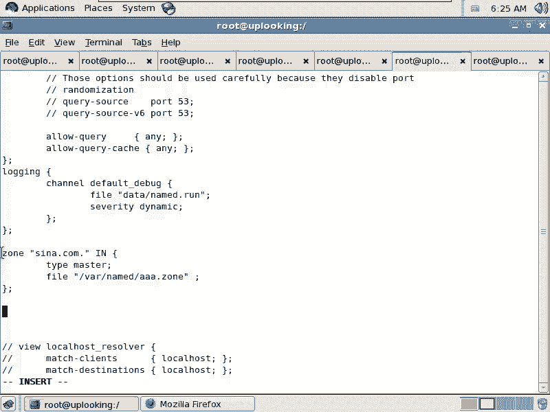
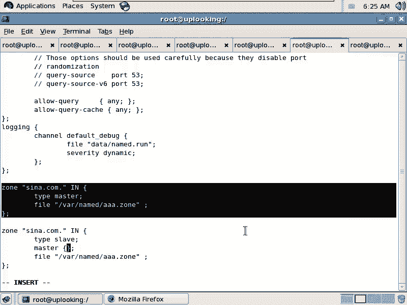
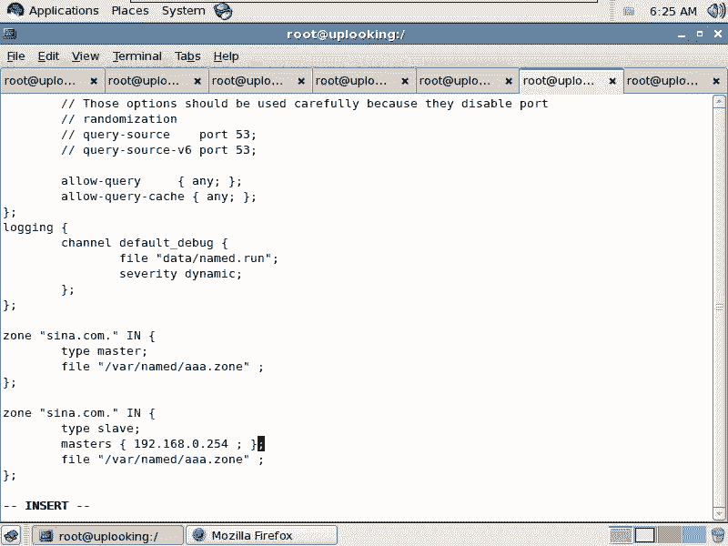
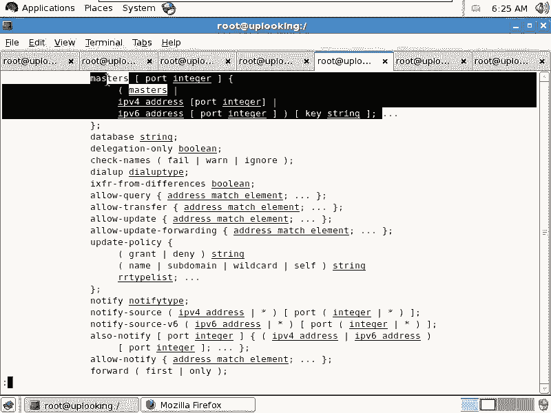
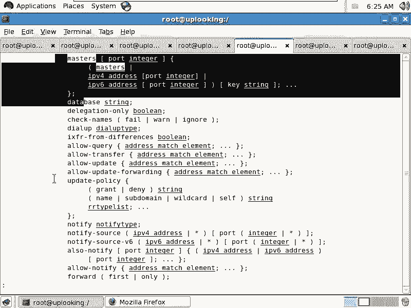
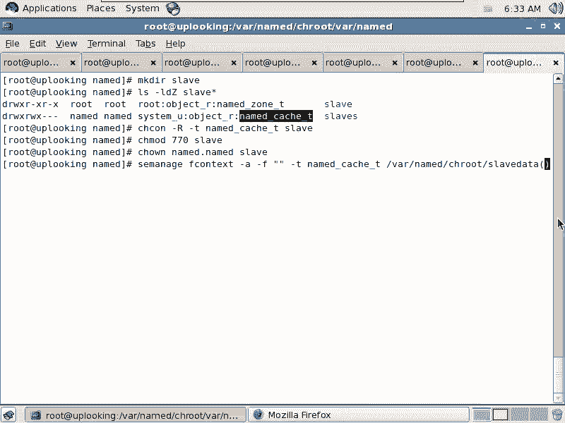

# 尚观Linux视频教程RHCE 精品课程 - P88：RH253-ULE116-9-2-bind-slave-zone - 爱笑的程序狗 - BV1ax411o7VD

好，我们开始把bu案的话呢继续来深入一下。就是说有关我们的bu案的，你会发现呃。七里咔嚓就出来了，是不是？好像是没有什么太难的东西，是不是？但是呢实际上深入去研究的话，班的里面那些参数啊。

我们再打开它的M配置给大家看一眼。再给大家打开它的门配置看一下man。呃，named点com对不对？这个文件大家看这里面的参数实在是太多了，看到了吗？这参数实在太多了，我们才用了几个呀，很少很少。

是不是？那现在的话呢，我们先给大家讲一下，就是呃我们把它先进一步继续使用的时候，那么应该有些什么样的东西。那么大家看我开始打开的是这个文件。VI这个文件就是这个count文件。在这个文件里面的话。

前面的options啊，其实的话一般我们的这个架构是怎么样的？要前面要加上一个什么alance。A啊ACL啊ACL就是访问控制列表，这边又有一个访问控制列表。

它跟那个其他的就是原来那个文件性统的访问控制列表，或者呃就是其他服务的访问控制列表没有什么太大关系啊。这个访问控制列表是一般怎么用呢？看一下它的man page。最前面的话呢就是这个ACLACL的话。

这里面是让你给一个资源啊，一段资源来起个名字。起一个名字。比方说我们现在看。ACL，然后呢加上一个比方说CNC呃。CNC night啊CNC night。然后呢，这边的话呢，加上一串字。

比方说啊211点。1。1。0是吧？杠255。255。255。0，对不对？然后加上一个分号是吧？里面的项目的话有分号隔开，是不是？是不是这样，然后最后的话呢，这边再加上一个分行啊。

看盘配置是不是里面的项目是用分号隔开，是不是？这样的话呢，我们是不是说这边的话就已经控制它允许还是拒绝了。而是我们现在已经把这段资源起了一个名字叫做CNC night。

是不是如果local host的话，那就是怎么样？比如说YYP啊，那么我现在的话想给本地的这些资源的话，起个名字叫做local。Post。night local host night。然后呢。

这边的这个本地的资源我们就是。127。0。0。0，对不对？然后呢，也就是127。0。0开头的0。10。20。30。4，全部都叫什么local host。如果要是我们的CNCn的话呢。

它本身有很多的网段组成，我们再把它加进来。比方说啊呃61。1。1。0啊。比方说然后他杠。255。255。255。0啊，其实的话整个的网络上有无数这种脚本帮你去采集网通呃，就是联通它的这个呃网段范围。

还有呢采集电信的网段范围，还有我们的这个移动的网络范围。然后他们把这些网段的话全部都改成名字，改成不同的名字，明白吧？这个时候的话呢，他们在下面整个的这个过程当中都可以用了。比方说允许查询嘛？

现在是any是吧？那我把它改成什么CNCline只允许这个网段去查询，是不是允许那个网段查询，这就是ACL啊，访问控制列表需要用到的这个资源，你下面的话呢是允许网段查询也好，允许那个递归也好。

都可以根据这些名字来进行。比方说允许谁呢？允许CNC，是不是这样的把CNCnet替换到这个地方啊，我们现在的话呢要给大家介再介绍一个功能，就是说我们的主和。从用啊主动和从用啊，sve和master。

我现在这边毫无疑问，就是一个什么master，是不是类型是master。那现在的话呢有另外的一个机器。比方说我们刚才看到了新浪或者说。雅虎它本身有四五台呃DNSO是不是？他们是一个什么关系呢？

有一个是主，其他的是从，而从的话呢，把主那边的这个数据定时的话呢，往从这边来备份。copy过来这个操作叫做什么呢？去域传递。我这边考一个大家的问题啊，考一个问题，你们。知道DNS用什么服务吗？呃。

用什么端口吗？什么53单口？应该是UDP53端口，而TCP的53端口是用来干什么的？是用来进行。去传递的。也就是说，2个DS服务器互相之间去传递数据是靠什么？靠这个TCP53端口。

而我们去查询数据的时候，都是什么UDP的53端口，明白吗？所以它的这个区域传递它到底怎么弄的？我们看一眼啊。那这时候的话呢，我如果要是是一个master，那我这边的话就这么写。

那么从server上怎么写呢？假如说我现在在写另外一个server，另外一个服务器，另外一个服务器就应该这样写啊，还是这个一样啊，它复制过来。那么从server上的话呢，应该是这样写，它的类型就是什么？

就是说它的类型应该是什么？

啊，slave是不是slave类型。然后呢，现接下来的话是什么？😊，master啊master，然后加上这个。主机名是不是把那个主机名加上去？

啊。我们看一眼啊。Masters。masters然后呢，你可以把这个IP地址的话呢加在后面啊，IP地址加在后面。比方说它是什么什么协议的啊，不是就是说IPV4的，还是IPV6的，把IP地址的话加在后面。

那么我是0。254，要求。92。168。0。254，然后呢加上一个门号隔开啊，分号隔开。这样的话呢把它加在后面了以后，那么你可以就是说呃把这个这个master的话呢。

它就允许你就呃就是你就可以去到master那边去copy区域去传递数据了。但是我们现在显我们现在的话呢，在配置的一个东西是什么东西，你们看一下。

是配置那个zo是不是这样的一个zo，也就是说我现在的话呢有一个从的zoone啊，这个zoone的名字叫什么？然后呢，它的它是internet类型还是其他类型？

我的这个就是我的这个zoone的话是一个master还是个slave，我写的是slave是吧？slave这边我就要指定masters，就是master的这个地址。然后呢，同时的话，文件的话呢，要指定对。

就是说我这边是要把这个master那边传递过来的数据写到哪个地方去，是不是写到哪个地方去呢？你要保证。name它可以去写入这个文文件夹，那要在权限上和SEinux上同时保证。明要吧？

也就是说我现在的话呢，在这边配置配置完了以后，我这个文件名的话，我叫做什么呢？比方说我叫做。sve是吧，我叫做什么呢？sve。点AIA点com啊或者AA点slave点com。这样的话呢。

我去在这个目录下，我要创建一个名叫slave的文件夹，是不是？那相应的我就要到那个目录下去创建了。我就要到CE到wa下的name当中的CH root下的wa下的name。

那么在这里面你去创建文件是不行的啊。你在这里边创建文件是不行的。但是他给你做了个例子。你看就是slay5别。这是slave的什么？这是slave的这个名字，是不是这个这个类型是吧？

然后我当前文件的这个类型看一眼。一个是zoone是一个是cash是吧？cash类型话的意味着我们的master呃，就是我们的这个name的这个T啊，就是namePS。PSAXZ啊GREP。

name的它的这种类型的话呢，是可以怎么样去写入这个slave这个slaves这个SG里面。如果你要去传全新去创建一个文件夹的话，你想去创建一个文件夹，你要用CHCON把它这个权限改掉，是不是？

你看它的权限是什么？让name的账号是可以怎么样？写入的。此lave的基理是什么？就是它的AA点Z这个文件啊，它并不是什么，并不是直接你自己去写，是不是它是从那个主那边的话呢。

去就整个这个这个去整个这些东西的话，全部都copy过来，就是这个数据copy过来，copy过来数据以后的话，我放到缓存里面。然后我开始写入什么这个目录下的这个文件，也就是由内部的去写，而不是由你去写。

明白了没有？不要了吧。我等一下，我可以克隆一个就是训集啊。那么他们两个做一个muss，一个做slave的时候，slave可以从mass那边把这个数据全部都copy过来，写入到这个文件里面去啊。

写入到这个文件里面去。所以的话呢要求name的这个进程，它可以写入这个文件夹。那么我们看到普通的权限是允许。同时的话呢，你要留心一下它的这个类型，类型的话要改成这种类型才可以写。

那也就是说系统给我准备的这个文件夹叫做slaves是吧？我自己创建那个文件夹叫叫做什么slave，是不是？那我看。Makeake DRR slaveve。啊，那么跟我们这个LS杠LDZ。

这两个文件夹它默认情况下创建出来的时候，它的类型也不一样，权限也不一样。所以我必须得把我自己不管在哪个地方创建的文件夹，全部都它的类型和那个呃SE的属性全部都改掉。CCON啊杠大R啊。

然后呢杠T我把这个类型的话，就是我们这个SE的类型的话改成这样的。这个slave的话呢是我创建的是吧？slave S的话是原本系统，是不是？然后再CHMOD啊，然后呢呃770是不是？然后呢，slave。

然后呢，还要怎么样CHOWN是吧呃。Named。然后呢，点name，然后呢s。这样的话呢，你把这个权限设置好以后才OK。对的，才okK。还有一种写法的话呢。

就是让我们在我们记不记得在SE那个次每次启动的时候，我们不是说它都有个协议集嘛，是吧？那个策略集你想更新这个策略集，这个二进制的策略集嘛，那么用什么命令啊，还记不记得SEmanager。

是不是现在我要添加我说所有的这个目录啊，以后的话呢我不用sves，我就用sve就用我自己创建这个目录了。那么或者用用用用其他目录。比方说我现在的话呢想把所有的slave放在什么wa下的。😡。

name当中的chan rootot下的wa下的词ay，或者我换一个目录是吧？那我现在的话想换另外一个目录，我就要写在它的策略集当中。那么这样的。杠A啊杠F。然后呢，加上一个。张引浩。杠T类型为什么呢？

就是这个类型就是这个类型这个类型。那么我现在的这个目录的话，我以后想去创建哪个目录下的这些呃。文件或者目录呢这样的啊。啊，比方外下的name当中的CH root下面的直接就是什么？比方说slave。

这ter。是吧data这个目录。这样的话呢，我在这里面。加正则表达式，括号的话是表示可有可无是吧？有可能是个目录也。

