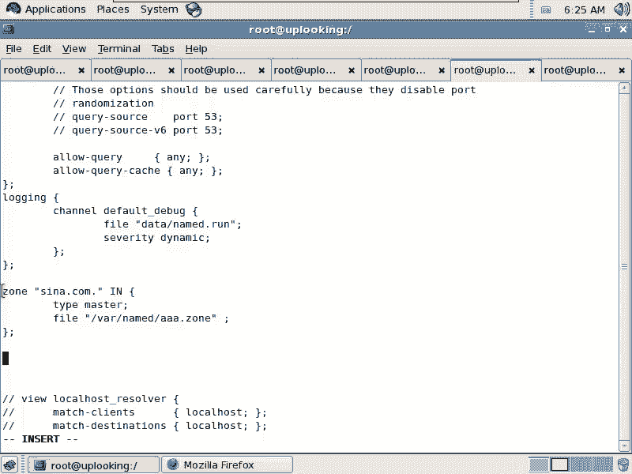
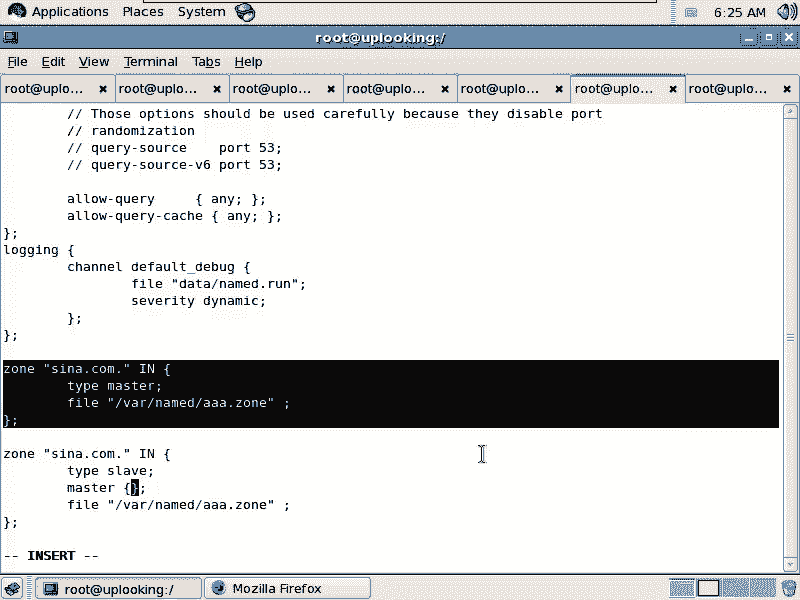
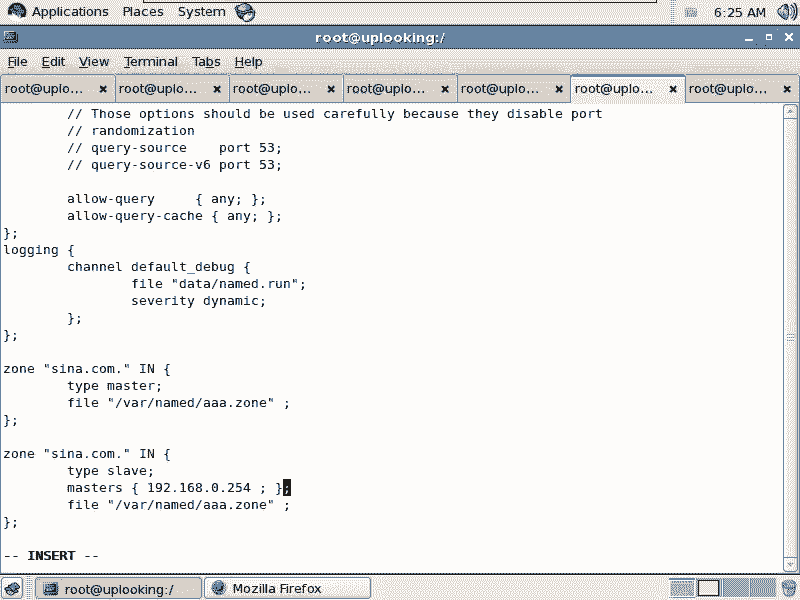
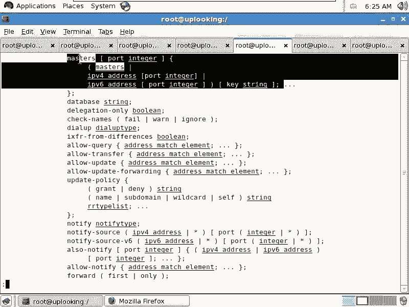
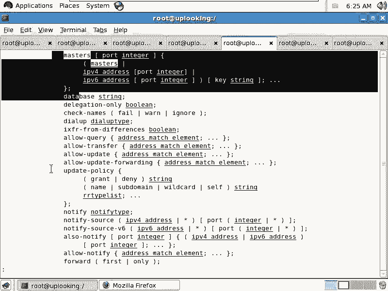
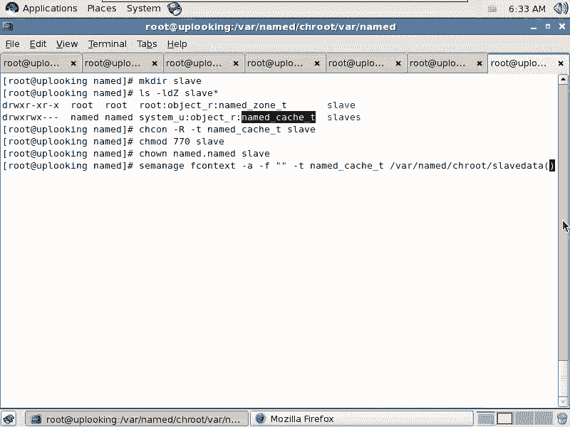

# Linux DNS服务配置：P88：从区域配置详解


在本节课中，我们将深入学习BIND DNS服务器的进阶配置，特别是如何配置一个从服务器来同步主服务器的区域数据。我们将探讨访问控制列表的用法、主从服务器的工作原理以及相关的权限和SELinux设置。

## 访问控制列表配置

上一节我们介绍了BIND的基本配置，本节中我们来看看如何通过访问控制列表来增强安全性。ACL允许我们为特定的网络资源定义一个名称，以便在后续的配置规则中引用。

在BIND的配置文件 `named.conf` 中，我们可以使用 `acl` 指令来定义访问控制列表。其基本语法如下：

```bind
acl "acl_name" {
    ip_address/netmask;
    ip_address/netmask;
    ...
};
```

例如，我们可以定义一个名为 `cnc_net` 的ACL，包含特定网段：

```bind
acl "cnc_net" {
    211.1.1.0/24;
    61.1.1.0/24;
};
```

同样，可以为本机定义一个ACL：

```bind
acl "localhost_net" {
    127.0.0.0/8;
};
```

定义好ACL后，就可以在 `options` 或其他配置块中使用这些名称来控制查询或递归权限，例如将 `allow-query` 从 `any` 改为 `cnc_net`。

## 主从服务器与区域传递



接下来，我们探讨DNS主从服务器架构。在实际生产环境中，通常会部署多台DNS服务器以实现冗余和负载均衡，其中一台为主服务器，其他为从服务器。



从服务器会定期从主服务器同步区域数据，这个过程称为**区域传递**。这里有一个关键知识点：

*   **UDP 53端口**：用于处理客户端的DNS查询请求。
*   **TCP 53端口**：用于主从服务器之间的区域数据传递。







### 配置从服务器区域

现在，我们来看如何在从服务器上配置一个从区域。

在从服务器的 `named.conf` 文件中，配置一个从区域的语法示例如下：

```bind
zone "example.com" IN {
    type slave;
    masters { 192.168.0.254; };
    file "slaves/example.com.slave";
};
```

以下是关键参数的解释：
*   `type slave;`：声明此区域类型为从区域。
*   `masters { ... };`：指定主服务器的IP地址。
*   `file "..."`：指定从主服务器同步过来的区域数据文件在本地的存储路径和文件名。

### 文件权限与SELinux配置

配置从区域时，一个常见的难点是文件写入权限。从服务器的 `named` 进程需要将同步的数据写入到指定的文件中，因此必须确保它有相应的写入权限。

系统通常预定义了一个用于此目的的目录：`/var/named/slaves/`（在chroot环境下可能是 `/var/named/chroot/var/named/slaves/`）。这个目录已经设置了允许 `named` 用户和组读写，并且拥有正确的SELinux上下文类型。

如果你希望使用自定义目录，则需要手动设置权限和SELinux上下文。以下是操作步骤：

1.  **创建目录并设置传统权限**：
    ```bash
    mkdir /custom/slave/dir
    chown named:named /custom/slave/dir
    chmod 770 /custom/slave/dir
    ```

2.  **修改SELinux上下文**：
    你需要将目录的SELinux类型设置为与系统默认 `slaves` 目录相同的类型。首先查看默认类型的值：
    ```bash
    ls -ldZ /var/named/slaves/
    ```
    假设输出的上下文类型是 `named_cache_t`，则使用 `chcon` 命令修改：
    ```bash
    chcon -R -t named_cache_t /custom/slave/dir
    ```
    注意：使用 `chcon` 修改的上下文在系统重标记或文件系统还原后可能会失效。

3.  **永久修改SELinux策略（推荐）**：
    为了使SELinux规则持久化，可以使用 `semanage fcontext` 命令添加一条永久规则，然后使用 `restorecon` 应用。
    ```bash
    semanage fcontext -a -t named_cache_t "/custom/slave/dir(/.*)?"
    restorecon -Rv /custom/slave/dir
    ```
    这条命令的含义是：将 `/custom/slave/dir` 目录及其下所有内容的默认SELinux类型设置为 `named_cache_t`。

## 总结



本节课中我们一起学习了BIND DNS服务器的两项进阶配置。首先，我们了解了如何使用访问控制列表来灵活地定义网络组并控制查询访问。其次，我们深入探讨了DNS主从架构，详细讲解了从区域的配置方法、区域传递的原理（使用TCP 53端口），并重点解决了配置从区域时至关重要的文件系统权限和SELinux上下文配置问题。掌握这些知识，将有助于你构建更安全、更可靠的DNS服务架构。