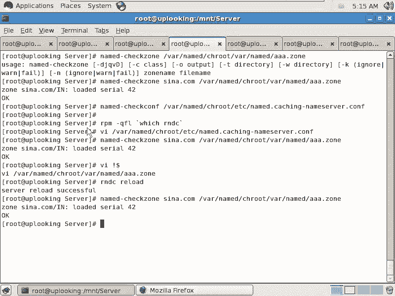

# 尚观Linux视频教程RHCE 精品课程 - P89：RH253-ULE116-9-2-bind-zone-rndc - 爱笑的程序狗 - BV1ax411o7VD

好。现在我们对于ban的体系结构，也就是DNS的体系结构，再有了解了以后，你再去配ban的话呢，才会有谱是吧？这跟appartache不一样，sice hTVD star。ele一个网页过去是吧？哎。

能访问到了是吧？我们已经配置成功了，但DNS不是那样，是不是你照着那个文档噼里啪啦改了半天文档，哎，什么意思呀？😊，哎，这个东西是什么记录啊，这时候搞的就头晕脑上，而且它那些东西的话全都是计算机的呃。

就是习惯。它不是说像配置文件一样哦，这个地方告诉你说什么什么等于什么什么，这个选项就打开了是吧？他还有一大堆数据也放在里面。所以这就个ban的话呢会比较麻烦的原因。很多人的话对于ban的来说就觉得。

配置了半天也不知道为什么，或者配置的时候，前面的选项还知道后面的选项我就不知道怎么会一个这个一会儿这个文件，一会儿那个文件，这搞得头晕。为什么呢？因为它既有数据，又有什么配置，而且还有体系。

这就是ban的它它所带来的问题。但是呢你搞清楚这个体系以后的话，就会非常清晰了。我们再来看一眼啊。

首先，打开它的配置文件VIETC下面的默认情况下啊，默认情况下，如果要是你没有装band杠chan rootot那个包，它会在这个里面的话，有个name点com。这边的话会有name的点com。

这个文件。当然了，现在我们所谓的name点com话呢，它因为我们装的叫cach name server，是不是？c name server这个的话呢，它就替代了name点com啊。

我们如果要是呃仔细再去看它的话。你再仔细去看它的话，加个软链接，你会发现它是一个什么呃，加加个杠L，你会发现它是个软链接。对不对？实际上你装了RPM呃。

就是装了一个b的杠那个chan rootot包以后就会这样结果。所以现在我们就到什么呢？洼下的。我们就直接这样的VIwa的。

change rootot当中的i watch name当中的chan root当中的ETC下面的namedcion name呃c name server啊点com打开这个文件，这个文件很简单。

前面的话是options optionstions这边的话是说有些什么样的整体的一些配置啊，就是你的我们的这个bu案的服务的话，它整个整个的一些配置。我刚才的话呢把这个服务重启一下啊。

service namerestar。

然后输一个nn state。杠ANTUP啊GREPname。那么我们的name的话呢，它是所它会监听什么呢？TCP的53端口，还有UDP的53端口啊。TCP的53端口和UDP5353端口。

但是他现在是不是监听的是127。0。1呀？是不是？127。0。1啊。我们看为什么监听127。0。1呢？是不是前面有两行？是不是？也就是说你自己的话呢，是把把就是说端口是53，但是呢监听的是127。0。

1，你把它改成0。0。0啊，改成0。0。0。它这边的话呢是IPV6啊。因为他是在做cion name server啊，并不是给外面的人的话呢提供的。IPV6的话呢，你要是不用的话，前面可以注释掉。

它这里面的话呢可以支持C语言的注释，可以支持那个就是C加加的那种注释，还可以支持什么呢？需要编程里面的注释啊，请号注释等等，多种注注释方式，加两杠的话就把它注释掉啊。我们在这边让它监听0。0。0。

然后呢保存。保存一下，然后我再去怎么样service啊name。Restar。然后我们再看一眼他是不是监听0。0。0。结果现在一个都不监听啊。那写的有问题。肯能有问题。我这个地方去掉的话，应该是可以的。

啊。😮，写的什么？安妮是吧。要加要加大括号吗？大括号。这里面还有个分号是吧？OK现在没有问题。我我是早晨的话，我头晕了，应该加我的这个IP是吧？叫IP是吧。或者2个IP加进去是吧？哎。

那个块呃可我我怎么就想到0。0。0。不太对劲。慢啊。name点com，这里面的话呢有非常好的帮助。也就是说你现在看到那个选项里面，就是我们去VI这个文件啊。VI这个文件这个文件前面的话呢。

它能设置的设置的地方，看它是不是这么多。

是不是啊能设置这么多。但是其实的话呢，你在man配置里面，你看这个地方的选项的话呢特别多。

啊，它的选项特别多man name点com。我以前的话呢就习惯使用这种方式。你看他在最开始就告诉你说，可以用C的什么进行C的方式进行注释是吧？也可以用C加加的方式进行注释是吧？

也可以用unix shell的方式进行注释，对不对？全都有。然后接下来的话呢，可以用ACL的话来设定。那么如果master啊或者什么。呃。这是server。那么Otions就是它的选项啊。

选项里面的话呢可以有这些东西，你看多不多？豆不是？非常多。这些选项的话呢，我们用到的啊，我们先看一下的话呢，它默认有的，默认有的话呢是监听某一个端口，是不是监听某一个端口，然后在哪某个IP上。

我怎么就想到0。0。0了啊。子有有问题，那么这边有个directy，洼下的named是作为它的directy，但是不要忘了它的这个根是什么根。这个根不是真正的。

根是不是而是wa的name当中的chan root目录下的这个根，是不是？所以把它当成根。那么也就是你这个目录的话，实际上就是wa的 name当中chan root当中的wa的 name。

这个是作为它的什么，这是作为它的主目录啊，作为它的这个相当于它的数据文件都放在那个里面。而它的配置文件是放在什么？wa的name当中的change root当中的ETC目录下啊，就是这样。然后呢。

这边的话呢是说你现在。你可以用它的配置工具啊，让它把数据，就是当前缓存里面的数据把它写到什么一个硬盘上来。也就是说你可以让我们的那个缓存里面那些数据写出来，然后你看一下是什么样子，就是哪个地方有问题。

写到哪去呢？默认写到这个文件里面去。啊，下面的话呢是一些比方说静态的这样的一些呃就是映射文件。然后呢，我们这个地方比较关键的就是说它只允许自己本机去查询，是不是只允许自己本机去查询。

这样的话肯定是不行的，是不是这个地方是不是我应该改成多少？Any。压力。这个下面的话也是。诶你。这个地方的话呢就是让我们的系统的话呢。

可以响应大多数人的这种查询和和就是说我这个服务器还真正的才真正的可以让别人去进行什么进行访问了，对不对？那这里面这个选项在我们的这里面的话就已经完事了。但是呢我们看这个蛮配置啊，我们看看这个蛮配置。

蛮配置里面的话有个比较重要的这样的一个呃一些一些内容。比方说我现在想拒绝谁，那么就是一个什么black hole啊，black hole就是说让一个黑洞，就别人一访问的话呢，我就不允许他访问。

这样的话你可以把网络IP它放到这里。啊，还有的话呢就是我们的那个。允许递归啊允许递归。允许递归这个东西是大家要知道的。为什么要知道呢？因为最起码你的DS服务器应该有两种应用。

你们你们刚才看刚才那个DS的查询过程，我作为大家的1个DS服务器，是不是你们的话，把DS服务器指向我是吧？我帮你们去查询是吧？这种方式的话，是不是要求我是一个什么可以做递归的，是吧？

我可以到跟可以到新浪，可以到美国那边去把这个记录到查询回来以后，告诉你，对不对？或者我去非洲哪个地方查询出来，告诉欧洲哪个地方查询出来，告诉你就要递归是吧？允许递归。那么是any是吧？

我允许所有人的话呢对我进行递归，这个的话就是我作为一个什么DNS服务器所必须的功能，是不是？但是呢有一个问题，如果你是新浪或者搜狐本身的DS服务器。你需要为其他人提供服务吗？就说我现在是在一个公司里面。

我自己做1个DST为我们公司的域名解析提供服务，对不对？那我还需要做这个DS呃，做这个递归做不做递归。你看我可以用N lookup来查询出搜狐或者新浪，他们本身DSP地址，对不对？

我把D我把我的windows的上网的这个机器，上网的时候的DNS我指向那个机器。他就帮我做地归。那他不是雷锋吗？是不是在中国雷锋啊真太少了，是不是哪个公司的话呢。

给你做呃花几几万几十万买个性能比较好的机器，然后呢扔到这个机房里面再掏一笔什么机房的这个带宽是吧？然后免费给大家做DNS解析用。只有网通，它必须的，是不是？因为你要共享，你要上网的话。

网通必须给你提供DS解析是吧？所以他必须得弄个DS服务器。那么新浪搜狐他不会这样做，是不是？因为新浪搜狐的话，他不收你的钱啊，你说我反正新浪的时候给新浪多少钱？你如果给他一个月100块钱，他也帮你做。

是不是网通的话，你是一个月的话，一两百块钱的，是不是？所以的话呢这个DS服务器在配置的时候就一定是什么？就是递归查询是被关掉，不允许递归。如果允许递归，那就惨，全世界人民的话都通过他去查询查询。

那个什么了域名了，对不对？所以这样的话呢。你就把它限定在一定范围之内，或者直接就把什么递归关掉啊，地归关掉。😡，这边是 along递归，那么你只允许谁谁做做递归，这边是一个什么呢？

递归开启或者关闭的一个一个东西，是不是开关是吧？那么把它呃开启或者关闭啊，这是递归的开关，明白吧？所以这个的话呢，是我们的一个应用。听楚了没有？你如果做的是一个公司里面的一个DNS服务器。

为这个公司本身提供服务。也就是你这个DS服务器啊，有有有两个域，一个叫新浪，一个叫什么？一个叫做呃比方说一个叫新浪，一个是新浪旗下的，比方说EUC点com是不是？那这样两个的话呢，预你提供查询。

你查询的时候，它可以给你结果，其他的域它一概一概不给你查，明白吧？先把递归关掉，听楚了吧？就这样两个选项。你要一定要你要开启的话，那你就怎么样，说只允许递归是允许谁允许谁去做递归啊。

那么如果要是你要么就怎么样呢，压根就把它关掉，是不是所以这个的话就是我们需要。需要做到的。然后还有一些选项啊还有一些选项。😊，这边的话呢有一个叫什么呢？max cash TTLTTL是什么东西呢？

就是我的这个记录啊，你们看一下这个图。

我刚才是不是给大家讲了个应用？讲了没有？

我刚才是不是给大家讲了个应用啊？

是吧。我们再看一下这个图啊，我们再看下这个图。假设说我们现在的话呢在做DN就是在做的这个DNS服务器是新浪本身的这个DNS服务器，那你完全可以怎么样？你完全可以把它的递归关掉，是不是？

也就是我们关掉递归是在做什么，是在做这种类型，就是整个这个体系里面，不管是我们的根还是我们的com点，他们这些DNS服务器一概要把什么递归查询关掉，是不是？否则的话呢。

它就提供的这个呃就是服务的话就太太好了，别人的话都把它当成免免费的DNS服务器，对不对？但是相反的话呢，你如果查询的这个DNS服务器，这是网通的DNS服务器，是不是？在你ADSL拨号上网的时候。

它自动给你分配的1个DNS服务器这个DNS服务器就应该打开什么，应该打开我们的那个递归是吧？只要打开递归。然后呢，里面有13个根据服务器的地址就OK了，是不是？我现在的话呢再说给再给大家说第二功能。

第二功能的就是说我现在的话呢有新浪。😊，有新浪的这个呃就是新浪的这个呃。DS服务器查询回来的一个什么呢？一个域名。这个域名的话呢，所配套的有一个什么东西啊，就是配套会告诉你什么呢？这个IP地址，对不对？

希望的IP地址是吧？同时还有会有个TTL时间，就TTL时间的话是说我们这个域名啊被你解析回来以后，放在这个缓存里面放多久的时间。😊，比如多长时间的话，这个域名的话就失效了。就是这个域名的这个解析的话呢。

就有问题了。所以这个时间的话呢，你可以设置。假如说我说这个域名的话呢，我为了让我的速度非常快是吧？我设置了80天。😊，啊，那你那边的话可以设置个max TTL，就是你缓存数据的时候，最多多少多少钱。

明白了没有啊，这是一这个。那我现在想给大家讲的是第二功能是什么呢？就是这个这个的话太小了，第二功能就是forward功能。forward功能。forward功能的话。

就是说我现在的话呢是一个modern。一个小的猫的。他的话呢，从我们的这个网通这边的话呢，获取就是获取一个网通的DS服务器地址是吧？但是我这个modm的话呢，它只起到一个转发作用。

也就是我们配置了一个什么只只能转发的一个DS服务器是吧？那么这边的话就是什么forward only要加个参数forward only然后再加上一个什么呢？forward到哪儿去。

就是把这个就是这个转发给谁啊，也就是你想他配置这个服务器，作为一个forward only服务器的时候，那么是怎么样。

我大家查查一下啊。power。forward first是表示什么呢？ forward first的话呢是表示我首先的话尝试转发是吧？然后不行的话，我再去给他做什么递归是吧？

那么forward only的话，就是不做递归光什么的转发，然后呢forward给谁，那么这边的话呢加上一个什么加上一个谁谁谁啊，把这个人的那个就是把那个机器的H地址放放上去，也就是他只转发给某个人啊。

这样的话，他就直接做了个DS转发服务器，也就是你是查询我UDP的53端口是吧？但是实际上我怎么样，我根本不给你解析，我直接就把把这个查询的话，传递给我后面的这个什么网通的真正的DS服务器，对吧？

这就是两个for的这个查询。这个整个的这个就是这个配置的话呢，实在太多了啊，整个的这个配置的话呢实在太多了。所以我们的话呢在前面这个地方可能先给大家就是讲了这样几个选项。现在大家讲的是这样几个选项。好。

我们再来看一眼。那这个结构的话呢，我们回到这个文件里面去，你看到这个前面这个结构的话呢，基本上是清楚了啊。然后接下来的话呢是日志，它配置的日志的话呢，是说把这些把这些东西的话呢，去呃，就是说写到哪去啊。

就是这个日志的这个这个内容啊，写到哪个文件里面，写到什么呢？data下面的什么name的点ron当中去啊。

然后呢，我们这是配置日志，然后我们再看一下的话呢，它这个默认的这个什么呢？默认的这个就是。查询啊原本啊就是默认情况下，你完全可以直接的话呢加这种就是加这种就是查询。

我现在的话呢假设说是新浪的1个DS服务器，我是新浪的1个DS服务器。我要解析新浪的域名。那于是我可以这样做，我可以加上一个什么呢？zo。啊，用。用的话是。room的话呢是这样的一个写法。

room的话呢加上一个名字啊，然后再加上一个类型。zo的名字，然后再加类型，然后再说它的类呃，就是说它的这个呃就是是主主动还是什么一个从容呃从的容啊等等。那么是不是要转发等等，它的文件是什么？

如果要是你是一个从从从的这个区域的话，那你要把这个呃就是从主的区域在哪？你要把它写出来。然后呢，这个呃这个文件的话呢，就这样，然后允不允许查询允不允许transfer，然后允不允许升级。

升级的话就是动态DS里面东西。看的这个配置的话呢是很多的。但是真正去使用的话呢，就三四行啊，我们看一眼。首先的话呢，这个room的名字叫什么呢？叫做。C呢点com一点是不是C呢点com一点，然后呢。

它是一个什么类型呢？in类型。类型，然后呢加上一个大括号，这里面写这个内容的话呢，它是有一定的就是有一定的规则。你有一个大括号开始就要一定要有个什么大括号结尾。很多人的话呢都是在写的时候就怎么样丢了。

写了一个，然后另外一个就忘了。那这样你少一个的话呢，肯定就不行。所以一般的我的习惯就是我不管写双引号也好，写单引号也好，我是先写两个，然后呢，在中间在空格或者再去回车，明白吧？这样的话呢会少犯错误。

然后呢，我觉这块呢再去写。我这个类型是什么呢？TYP。TYPE是什么呢？是master。master类型，也就是我就是主区域啊，然后呢，我在这边的话呢，有个fill。F。fi要是什么呢？fill的话呢。

这后面要加个路径，其他的话呢实际上就不需要太多的去去写去写了啊，不需要太多的去写了。然后呢，fill是我们的呃。wa的name当中的什么呢？呃。比后叫做AIA。点中。AA点Z这个文件啊。

我就随便我就随便起个文件名，这样把它并行退出。呃，当然了，要加上一个什么，要加上一个分号啊，这里面的话每输入一行是不是都要加分号是吧？每输入一行，包括那个大括号，这一行后面啊也要加个分号。

那这样的话保存并退出。然后呢我再去VI什么呢？我刚才是VI的1个ANA是吧，文件是吧？那就是我实际上是要创建一个新的是wa下的name当中的ANA点zo。是吧这个文件。那这个文件的话呢。

我如果写一个空的文件的话，那我全全从头到尾去写下来，我可能就觉得哪个地方可能会有问题，是不是？所以的话我先去怎么样，我先去写一个，就是我先把它的一个。就是一个。对，模板local domain啊。

local domain，我把它拿出来。大家的话呢看这里面的话呢会有一个已经写好的一个前面的头头部的东西。我先给它什么呢？复制下来。是啊。

我先把它复制下来。我先把它复制下来，复制下来以后的话呢，我再去写那个文件啊，AAA点。

AA点中，然后我把那些东西的话呢，先进入音色的模式啊，然后把鼠标中间一摁，把它全都复制下来。复制下来以后我们看一眼。这个记录的话呢，首先要有个SOA记录。

SOA记录咱们一直没有查询过SOA记录叫做起始授权机构。起始授权机构。也就是说我这个机器啊。我这个机器上有一个名叫新浪点com的。咱们刚才看到是不是搜狐点com啊，新浪点com他们有很多DNS服务器的。

比方雅虎点com是不是有45个DNS服务器是吧？谁是老大？5个都是老的。我们去改一个还不成，还要把其他四个都改掉，是不是？但是呢？这个的体系是怎么样的？就是我去解析。雅虎点com，我可以做master。

也就是我现在是第一个是吧？我做master，我是老大，是不是？那这样的话呢，我这边他说即使授权机构的老大是谁呀？是吧。这是我的主机名，那你要能解析这个主机名，是不是？

那如果要是你现在的话呢呃就是你本身就是你本身。那我这边的话就叫做什么呢？s娜点com一点，也就是说。😊，这个s娜点com一点这个zo。就是这个区域或者这个域，它是谁主要来负责的呢？

是一个名叫s娜点com一点的这个一个主机，也就后面跟的是个主机名，是不是？那这个主机名的话呢，在下面必须得要进行什么解析。Yeah。我在这边的话呢，必须底调做解析。C娜点com一点它的IP地址是多少？

192。168。0。254，对不对？0。254是我新浪点com的这个主机的IP地址，是不是？那么这个域这个地方的话，我实际上也应该这个艾啊也代表这个东西也代表这个东西，就是你可以把艾的话呢。

换成这个换成这个的话呢，可能就清晰一点。但是你要知道这个艾的话呢，在这个zo文件里面出现的时候，就代表着这个域的本身，明白吧？就相当于s娜点com这个点这个域的老大是谁啊？是由哪个DS器主要来负责的。

是由s娜点com一点这个主机来负责。而s娜点com一点这个主机的IP地址是多少。0。254明白吧？为什么这么麻烦呢？因为它是1个SOA记录。你看这一行，首先是这个域名。

是不是这个域名我们就原来跟大家说过，你同样是这个域名，有可能是发email时候用的，是不是？也有可能是访问网站时候用的，是不是访问网站的话，它就要求是一个什么这样记录，是不是？😊，是不是A季录啊？

仿网站，那么你访问C娜点com一点的时候，那你看到的是个网页。但是你在发email的时候是shack艾s娜点com一点。那么你去发这个email的时候，s娜点com一点这个域名。

它就变成了1个MX记录要解析的时候，就是另外一种类型。但是呢我们说有A记录，又有MS记录，难道没有别的记录吗？我们最起码刚才在查询的时候，我们看到一份NS记录是吧？NS记录表示谁是这个域的DNS服务器。

你看NS记录和SOA记录的区别在于什么呢？NS记录是表示谁是这个域的服务器呢？我们刚才看到有6个服务器，都是这个域的服务器，是不是？所以的话我们在查询MX记呃NS记录的时候，就会发现有6条记录。

但是呢如果要是你现在这6个主机要选出一个当什么呢？主控者。这个时候你的SOA记录应该填写的后面就是应该什么这个主控者的什么？这个内容。所以SO记录的话应该是一个，后面的话应该是添加一个主机的名字。

这个主机的名字就应该是什么呢？这个整个这个zoone的老大是吧？如果你说。那老师，你这么麻烦不麻烦？你直接把它写成这个说谁是这个域的老大呢？谁是这个Z解析的时候，老大呢，19218。0。254。

这样行不行？😡，行不行。你们说我哪知道是吧，你还问我行不行？你们觉得这样合理不合理？😡，其实是合理的是吧？是合理的。但是呢我们这里个文件里面大家一定要规定啊，一定要记住这个规定。除了A季录之外。

其他的记录一概要解析成什么？A记录，然后再通过A记录解析成IP地址。听楚了吧？一定要先去解析成什么，先去解析成一个名字，然后再把这个名字通过A记录解释成IP地址。所以的话呢我们直接这样写是不行的啊。

尽管你感觉好像是差不多是可以是吧？所以必须得要这样的。明白吧？这是1个A记录的名字，最终的话对应成这个IP地址啊，那么这边这边是不是有个NS记录啊？是不是19218。0。254。

也就是说这个NS记录这边又是一行啊，下面这一行的话，大家能明白吧？能明白到这儿能明白吗？到这能明白吧？也就是说C娜点com1点这个域啊，它可能有七八个DNS服务器，但是谁是这些DNS服务器的老大呢？

谁呢？😊，C了点com一点这个主机，这个主机解析成IP地址以后，就是它，对不对？所以说白了就是这个这个IP地址就是这个zoone的老大，其他的5个DNS服务器都要跟他看齐，都要怎么样呢？都要去什么？

就是不断从他那边获取数据。清楚了没有？那么怎么获取数据，就是后面这些内容。就后面这些内容，这都是时间，后面这个root什么什么的话，是属于是email地址啊，email地址你要是不愿意这样去写的话。

那你把这个email地址这样写出来。你比方说什么呢？是root啊艾 upload点com。啊，这样呢也可以写完了以后。😊，我们说这边是个序列号，是不是？我解析希腊点com。前面这四个台机器也几续希烂。

没看他们的话呢定时过来看我，定时过来看我说什么？哎，老大，你那边的这个记录更新了吗？我这边每当我更新一次记录的时候，我就会把序列号加1，我就会把序列号加1。你们现在假如说是41，是不是就要给我一笔。

我是42是吧，你们就知道哦，老大那边已经把什么数据变了是吧？我赶快把那个数据的话呢拷贝回来，我这四台机器的话全部都更新了，明白没有？明白没有？就是序列号是表示你的版本号，接下来的话呢。

3H每隔多长时间的话呢，去更新一次，每隔3小时。是不是？然后呢，如果要是到3小时的时候。一看。老大没办法访问啊，你比方说有很多小弟要看老大说什么哎，老大，你那个数据命令有没有更新啊。

结果到了3小时的时候，一看哎，老大不在是吧？因为他什么，因为。😊，找不到。那这时候15分钟之后的话呢，再过来看15分钟重试重试重试，一直重试到什么呢？一星期都没有看到老大。

这时候他们会自动把自己的数据什么呢？标记成什么无效啊，我就遇到过这种情况，我们有一个有个客户的话呢找我们做服务啊。他说你过来他帮我看一下这个服务器到底怎么我们DS域名的话，解析有问题。

他是用自己的DS服务器去解析。他有一个备份的域，还有一个什么主域，结果他的主意的服务器的已经挂了一个星期了。已经已经完蛋了是吧？已经基本上就就完全启动不起来了。然后这个时候他怎么样呢？

那个从他就不断的重试重试重试一个星期之后，他把自己所有的数据就标记成什么无效，说什么？不好意思啊，各位，你们再来查询我的时候，我告诉你们就没这个记录了，因为我们老大什么找不到了。

我怎么知道他的命令还有没有效，一个星期明白吧？😊，啊，这边的话呢是说呃最短的这个有效的历史是一天啊，最短有效历史是一天啊，那么我们看一下就是呃整个的这个记录的话呢，实际上啊前面这个地方你基本上是不。

除了有特别需求，否则的话呢，你一般不会碰是吧？所以刚才大家看听到我那个说这时间那时间，你如果没有记下来没有关系，你到时候查一下就好了，是不是或者人家后面是不是有标标记啊，但是前面这个地方一定要写对。

这个里面我们要大提醒大家的。😊，务必要提醒大家的一点是什么呢？😡，务必要提醒大家的一点是什么？就是你这个地方你去添加域名的时候，一定要加个最后加个点。这就相当于是绝对路径。如果要是你不加点的话。

就相当于相相对路径。你比方说现在我这样的啊，我在这里面我想建立一个C纳点com的什么MSU5于是我这样的C纳点com，我忘了加点。我忘了加点了，忘了加点的效果是什么呢？

这个域名的整个的名字叫做s纳点com点C纳点com。你要不明白。明白吗？也就是说你不加点的话呢，它就变成一个什么变成一个。😡，变成一个这个相对路径。如果你加了点的话，就是s了点com。如果不加点的话。

就是s了点com点C了点com明白吧？好，我们这个地方的话呢，如果要是你不加点，你刚刚我输入个3W，它就有3W点C点com。明白吧？如果要是你加上一个点的话，那就纯粹就是3W点这个域了啊。

所以的话呢你要么是这样写，要么是怎么呀？3W点C娜点com1点。明白吧？这就是相对周径绝对不行，一定提醒大家，无数的人在这边配的时候，老师我这不行。我们我们那个学linux很多人都是这样的，皱着眉头啊。

老师啊，这个东西怎么回事，这么不合理是吧？怎么又错了，是吧？你要知道这个东西它就是傻，就是这个计算机的话就是傻，就是一就是一二就2，它不会错，只有你错，是不是？然后呢，你去跟他较那个劲。

说老师这个东西怎么这么别扭，它应该是这样的嘛啊，那你去跟微软说是吧？微软会倾听你的什么声音是吧？因为微软是一个商业公司是吧？而linux的话呢，它是大家各写各的，写完以后扔到一个地方，是吧？😊。

传在一起。所以他凭什么你除非跟每一个开元的作者说一遍，说哎，你这个东西写的不合理啊，你应该这样这样写，对不对？所以的话呢不要去跟他较这个劲啊，所以这个规定就是这样的，大家一定要记清楚。

而且的话呢要怎么样注意细节啊，注意细节。然后我们在这边搞清楚了以后，我们再来看。😊，这个时候我们越到第二个记录了，第二个记录前面是空白是吧？空白的话就表示什么？就是你当前的这个zoone或者当前这个域。

当前的这个域是不是叫做什么新浪点com点，是不是？所以的话呢你当前的这个呃你当前的话加上一个空格，就是什么都没有，前面是空的，那它就是什么C浪点com是不是我可不可以写成这样的。我可不可以写成这样。

加上一个at。可不可以？一样啊一样和你空着是一样的，和你空着是一样的。你可以输入什么，s呢得 come一点。假如说你们公司要求比较严格，不想那么自由，一会儿这种写法，一会儿那种写法。

你就完全把它什么写成什么这种标准的格式，是不是这样的话就不会有问题了。这是说你的NS记录是有这么多的，对不对？假如说我现在在维护新浪，新浪还有什么三台，还有两台这个DS服务器，是不是应该复制一下。

是不是C那点com的NS记录对应的是有什么呢？😊，哎，不对啊。这个刚才就是这样吗？不对啊。我们刚才是不是说过说除了呃呃除了这个除了这个。你刚是不是说除了那个呃A记录之外。

其他的记录是不是都必须得先指定成A记录才能指定成IP地址，是不是，是不是我们看一下是不是这样的。因为他我们这边有一个。你看果然这个地方是不是写错了。

是不是人家是说这个这个local host的NS记录是不是指定成local host的这个A记录是吧？这个A记录在解释成什么H地址，对不对？所以他我们这个地方应该怎么样写？我们这个地方应该怎么写。

你直接写IP地址就是不行，要写成什么？比方说一个叫做什么呢？NSE点。😡，C那点com是不是一个是什么呢？你不能写IP地址，对不对？除了A记录之外，其他的都必须得先写成A记录。

然后再通过A记录指定成IP地址。然后这NS2点C那点com这边还有个什么NS3点C呢点com对不对？然后呢，我在这边的话再去我想去把它真正有效的话，我再去什么NS1点C那点com是不是？一点。

它是1个N类型的A记录，对应的IP是谁啊？😊，192。168。0。254，明白不明白。这过程清楚没有？也就是说我自己是我自己是master，就是我这个zoone的老大，是不是我是这个zoone的老大。

同时我是这个zoone的这个1个DS服务器，明白吧？但是我还有两个兄弟，这两个兄弟是什么？小兄弟他们都要跟我什么同步数据是吧？因为这个地方已经规定了说谁说谁是老大。就是我本人是老大，是不是？

那么现在的话我可以直接这个地方的话呢，写的更清楚一点，写成什么呢？😊，是不是这样的话就非常清晰了，是不是？所以的话呢我在写这个zo文件的时候啊，我在写这个zo文件的时候，这个zo文件一定是什么？

一定是这种开头的。也就是你必须得要有NS记录和必须得要有SOA记录。😊。

明白了？必须得要有NS记录和SOA记录。一个是表示说这个zoone的老大是谁。另外一个说解析负责解析这个zoone的DNS服务器有哪些啊，如果是一个的话，那就一个。那么一个的话。

我就把其他的我就先删掉啊，就先删掉。写完这样了以后的话呢，你的这个系你的这个Z文件就可以用了。然后我们再这样的再去3W点C那点com一点，是不是？然后它是个in类型的A记录，是不是提升19218。0。

254。😊，现在的话我保存并退出这个Z文件，我保存并退出了。保存并退出以后，如果还是我们有了SEn的经验以后，我们是不是会看一眼？是不是再看一下这个文件，它是不是一个name的相关的zo文件的这种类型。

是不是？如果是，那就OK那应该SEinux应该不会为难它了，对不对？现在我们这样呢基本上确定了，然后呢，我们再去回头再看一下啊，关注一下刚才的那个呃刚才那个情况。

先是ctching name server是不是？ctching name name server这个配置文件在这里面的话呢，添加了一个名叫s娜点com的zone，是不是s娜点com的 z。

我记得好像是不是要加双引号啊？😊，是不是招商银行？要加商引号是吧？文件要交也要加是吧？OK这样的话呢就是。加上这一条以后，这是在我的主配置文件里面，主配置文件实际上应该叫的name点com啊。

name点com。那我们在这边的话，因为装了开始 name server，它所以它就就变成那个名字。如果你把这套东西copy成什么呢？name点com它就会生效啊，那我们看这边的话呢是指定完这个zo。

Z你们觉得zo是不是就是玉呀？😡，是不是就是玉是不是？但是实际上zoom和玉的话呢稍微有点区别，等一下我告诉大家区别是在哪啊。现在我这样的写完了，保存命退出，保存命退出。

然后这样的service啊name。re star。啊，他是说你既然用了vio啊，所有的zoone的话呢，都必须得要在什么这个vio当中啊，所有的所有的这个zo的话呢，必须在vi当中。因为什么呢？

因为呃你们再打开看一下这个地方。vio的话呢，以前我先把这个地方取消掉啊，我先把这个注释掉。我先把这个will注释掉，我先给大家看最基本的功能，我一会儿我再解析will呃，我一会儿再解析解释will啊。

😊，我一会儿再解析病呃呃，解释病有。重启完了重启完了以后，我们再来看啊VIETC下的RESOLV点com对不对？然后这边的话呢，搜索的这个name server是谁呢？不是1。100，而是什么0。

254是吧？保存命退出。明白吧。是自己啊自己现在的话我去解析什么呢？我去P3W点C娜点com1点。其中谁啊？0。540万。是不是？然后呢，我再去聘。NS1点。啊，C那点com。啊，这边又解析成0。

254，是不是这边已经是解析出来。你可能会说哎，老师不对啊，这边怎么up点com嘛，因为你解析出1个IP地址来以后，他把这个IP地址进行反向解析。😊，而在我的host文件里面。

这个IP地址反向你提成谁啊？这个主机名，所以他就告诉你是uplooking是吧？其实没有关系啊，你用什么呢？host文件。3W点C呢点com你点他告诉你说他的主机名是什么？是你用hoss的命令啊。

他的主机名呃，他的IP地址是0。24。这样的话我就把DNS服务这个搭好，是不是这样？因为我现在装了c name server，所以的话我就改了这个文件啊我就改了这个文件。然后接下来的话呢。

根据这个文件里面的设置，我又添加了一个什么呢？我又添加了个zoone文件，是不是添加zo文件以后的话，我要看这个zo文件的话呢，它的SE的属性有没有对。然后呢，再我再去就是说把自己的DS解析。

这是当然是如果要是别人的话，那你就把那个DS服务器的查询地址查询到你自己这边来是吧？然后就可以。😊，这样的话呢，我这边能正常解析，而且没有什么太大问题。OK最基本的DS这个band的设置就跟大家说完了。

有没有问题这个地方。你说。在那个刚才那个问。是老的他。啊，是那个。对，就是说不是 name查出来。就是我在这个文件里面定义了1个SOA记录是吧，就是起始授权机构是吧？起始授权机构所对应的那个A记录名字。

为什么不是为什么是NSE点C那点com，而不是什么？嗯。SOSOAの后面。谁是这些店？对，谁是这个就SOA记录，后面跟的是谁是这个这这个zoone当中的老大啊，是谁呢？

NS1点C那点com1点为什么这个不是我在本地用post name这个查出来的。hose name在本地查出来的主机名是什么？你说这个地方为什么不写成什么？写成ho name在。哦。

你是说为什么这个地方不不去放成主机名，而放成一个域，是不是？是吧我的主机名本来应该是。uplooking点com是不是？uplook点com是吧？我的主机名本来是uplook点com一点是不是？呃。

uplook点com为什么不是这个，而是NSE点C点com是吧？你要注意啊。你的主机名叫什么？别人关心吗？不关心你知道吗？你的主机名叫什么？他们别人的话都不关心。那么你要知道band的话呢。

它是1个DSDS服务器独立的一套体系，是不是他凭什么去查你的主机名呢？明白我的意思吧？假如说我没有设置我的主机名，我的主机名就叫local host。

你说谁是这个谁是这个域的这个起始授权机构local host哦，我解析SO记录的时候，我发觉我是local host是吧？我把这个文件的话copy给你，你是我的什么，你是我的slave。

就是说你是我的slave服务器，就是我的小弟服务器是吧？你解析local host，你是他你你认为你自己又是什么自己这个zoone的老大是吧？那谁还把我当成老大。明白吧？因为你的主机名是你随便设的。

明白意思吧？我随便设成app点com，你可不可以叫up点com？😡，你也可以叫。是是所以主机名的话，DNS根本就不关心。那假如说你没有设主机名呢，那难道DSDS就不活了吗？是不是？

所以但是你说这个ban它可以运行在什么上unix系统上可以运行在什么BSD上，是不是它可以运行在。那万一有一个系统它不能设主机名，那难道ban就拒绝运行了。

所以它自然是自己这套体系跟其他的没有什么太大关系，明白了吗？啊O所以这个地方的话呢，你不能用主机名，而应该用一个能解析出来的什么A记录我们现在讨论的DSDS里面的话就有什么A记录NS记录MX记录。

还有什么C name记录SOA记录就是没有什么？😊，就是没有主机名。主机名化不归DNS管，是不是？所以DS在设计的时候，他就不管主机名。明白了吧。这个问题问的很好啊。

那么我们现在是不是学了1个SOA记录是吧，学了没有？然后又学了一个什么NS记录是吧是？还学了个A记录，是不是还有什么记录呢？MS记录啊，和M记录。然后C娜点com一点啊。

然后呢当然你可以把这前面删除掉了啊，然后呢in类型的M记录啊，后面要加上一个数字，表示它的优先级，假如说你的邮件服务器有10个，那其中的话呢，10个的话，你说最优先用哪个，其次用哪个等等，它是优先级。

然后呢再加上一个什么呢？A记录的名字，比方说m点C呢点com一点啊，然后我再解析什么呢？mail点C那点com1点，它是一个in类型的A记录，然后呢指向19268。0。253啊，这样的话呢。

你的这个MS记录就可以正常用了。😊，当有人给你发邮件的时候，什么什么艾C娜点com的时候，那么这个时候它就会解析成什么？那个邮件服务器就0。253。而这个时候0。

253跟你的这个C娜点com所对应的什么？A记录的话，你又是两两回事是吧？😊，你在访问sta点com在浏览器里面，访问sta点com一点的时候，就看到的是一个网页，是不是？但是你访问什么呢？

MI记录的时候应该看到的是一个什么email服务器，没有必要把两者的话放在一块儿，对不对？😊，但是呢话说回来，有些公司他不去做MX记录的时候，这个时候邮件服务器可能是先查MX记录。如果MX记录没有的话。

他查谁呀？查A季度。明白吧？当你MS记录没有的时候，email服务器可能就要用到一呃就是A记录了，清楚了吗？啊，好，这个东西搞清楚了以后，我们再来看啊再来看。就是说在系统里面的话呢，除了这个东西之外。

还有我们的那个呃C name记录。C name记录之外，就是我起个名字啊，比方说叫做什么呢？CNC啊，CNC。😊，点C纳点com一点，那么它是个硬类型的，是一个什么呢？C name。

C name记录指向什么呢？指向3W点啊，比方说指向C那。啊。😮，C内没有印啊。而且要大写哈，对这个地方是大写。没有in呢。我试试看啊。然后呢，如果你改完这个文件以后的话。

输入一个什么service name什么restar是吧？但这里面的话有个叫什么reload。啊，reload的话呢，就是把这个程序的话呢，又什么就是这个这个配这些文件的话，呢就重新load上去。

实际上你可以输入什么RD呃RNDC啊，RNDC然后输入一个什么。withload的。明白吧？RNDC也就是说service name的reload实际上调用的是什么？RNDC是不是？😡。

RNDCreload是不是RNDC是什么呢？其实啊我们输入的service什么什么命令，service什么命令都是红帽子给我们做的标准化，对不对？做的标准化。但是呢我们把apache重启的时候。

大家要知道apache实际上并没有service这个脚本，它有个叫做Aache cTL的程序，是不是apacheCTL就是说我们如果要是想去启动appartache的话，我们是怎么样。😊，呃。

APACHTR是吧是吧star或者toptop是不是，而不是用什么呢？而不是用service HDVDstar，对不对？那service HDVDstar实际上调用的上面那个脚本。

就真正生效的是上面那个听楚了没有？但是呢我们现在如果要是去用DNS的话，我们service什么什么是可以的。但是我们用的不是re系统的时候，那么系统原配的这个控制程序是什么？😊。

DS band原配的这个D这个控制程序是什么？RNDC。记住了没有？记住了吧？也就是RNDC和service命令是不是跟这个相关的？😡，那么RNDC的话呢，它的前身是什么呢？RNDC的话呢。

它的前身叫做NDC。你可以让它怎么样呢reload。也可以运行什么呢？NDC是吧？当然现在的话就是RNDC是吧？RNDC。😊，然后呢，当夫DB。

dDBdDB的话就是把缓存就是内存当中的数据全部都写在什么上写到我们的硬盘上啊，写在硬盘当中哪个文件呢？你可以看到VI啊wa的name当中的chan rootot当中的wa的 name当中的data。

是不是？然后呢d。😊，啊，cash当地B啊cash。当DB也就是他可以把内存当中，你说。见了鬼了，我这个域名死活解析不出来是吧？我的死域名怎么就老是有问题。我现在内存里面的数据到底是多少？那我想看一眼。

那你可以通过这样方式看，明白没有？然后呢，这样呢你去VI它，你就可以看到这个缓存里面的话有哪些数据，数据的内容是什么。当你查询过递归过什么东西的时候，它这里面的话呢就会有这个相应的数据，就是呃。😊。

就是什么呢？就是我们的这个RDC当DB啊，当然你可以通过什么RNDC什么呃reload。😊，然后呢来去加载所有的配置文件RNDC什么刚刚help你可以看它可以加什么，它可以去追踪，它可以去。

stop是不是它可以去stop，它可以看当前的状态，是不是它可以。看当前的状态，它可以去加载指定的。我的AAA点Zone的话呢更新了其他Z没有更新，我就加他指定的Zone，明白吧？

它的命令的话是很多的啊。把缓存的话呢清空掉flash。flash把缓存清空掉。s看那个前面的看那个情况啊。这里面啊我们要注意一点，就是RNDC的话呢，它有一个参数叫做什么呢？

杠S我们说RNDC它的前身是不是叫做NDC啊？RNDC加个R是表示什么？😡，remmoote是不是就是远程的，也就是说你能通过你自己的RNDC来控制一个远程的什么服务器上的DNS服务器。明白了吗？

你可以加杠S，但是前提条件是什么呢？前提条件是。T文件必须得对。什么叫T文件呢？你看啊它是需要加密传输的。也就是我们可以运行RNDC你刚刚下。然后看里们帮助RNDC，然后加上个杠S。

然后加上一个对方的IP地址啊，但是呢呃你可以让他去怎么样reload，是不是还可以rereload某一个Z文件，是不是某个Z文件。那么这时候你必须得要去确定就是你本机的RNDC。😊。

点key文件和对方的话是一一对应的。也就是说你这边的key和那边的key是一对密钥，明白吧？这样的话呢，你才能去访问到对方啊，这就是远征访问。所以我们由刚才的那个控制啊，延伸到MDC的这个控制啊。

有没有问题这个地方。😡，有没有问题？这是我们的ban的基本基本使用啊，ban的基本使用。有没有问题？这个文件的话呢，大家可以自己打开一下，这里面的话呢是有一串值啊，有一串值。

这串值的话呢就是我们在用RNDC的时候跟对方碰的那一串值。那个C name记录是不是也是可以加in的，是不是？C name记录是不是也是可以加硬的？我们看一眼啊，还有一个命令啊，我记得叫。

找几个妹妹来看一眼。这边的话呢有两个配置文件，一个配置文件叫做name的check CNF就是帮你检查我们的那个name的点com，或者name，就是刚才我们配的那个总的配置文件，是吧？

就ETC那个目录下的配置文件，他帮你检查什么？那个文件的什么呃语法正确与否。还有一个的话是什么name check z，他看你这个zo文件的语法是不是有问题。也就是说当你你担心这个zo文件有问题的时候。

你就是name的。杠。呃 check z，然后我看一下我的那个呃wa下的name当中的chan rootot当中的wa下的name当中的AIA点zo是不是直接回车？签要签加z的名字。C那点com是不是？

然后再添加这个文件，他帮我看说什么OK。😊，明白吧？你如果想去查看的是什么？查看的是我们的那个com文件CNF是吧？然后就是wa的 name当中的C root项目的那呃ETC项目的name的呃，比方说。

cashion name server啊，check一下，看他有没有问题。这两个测试文件清楚了没有？有没有问题？我刚才用的什么命令把他们查看出来的呢？用的是这个命令，就是我看RNDCE配套的其他的命令。

明白了吧。没有了没有。还有没有什么问题？最后一点啊就是在这个地方的最后一点，我们打开这个文件以后啊，我们打开这个文件。😊，大家可以看到这边是一个什么？这边我们是规定的是一个zoone。

是不是我们就添加了一个zoone。这个zoone的话名叫什么呢？s点com什么叫做zo？什么叫做陡脉？就是什么叫做豫？什么叫做zo呢？room的话叫区域。陡慢的话呢叫做豫是吧？那么区域和域有什么区别呢？

就是区域和域是一模一样，但是。zo是什么呢？就是区域的话是有zo文件的与。有这种文件的语。你你只要看哎给我这个域的话，它到底有没有文件是吧，有没有跟他像配套文件？没有，那它就是什么域有的话。

它就它就叫做什么zoone，明白吧？那你看这边的话呢，为什么叫zoone？因为它呢它全部都是有什么配套的文件。然后我如果打开这个AA点Z啊。😡，我要打开AA点纵，我在这里面的话呢，加上一个域啊。

比方说我加加上一个3W点C呃3W点m点C呢点comE点，它是一个A类型的A192。168。0。253。😊，啊，这样我这样的保存并退出了以后，那么你们说我现在是不是有个域叫什么？叫做mail点s点com。

是不是mail点s点com有没有配套的这种文件？有吗？我有没有给他单独指定他的字文件是谁？没有是吧，那它就是什么等man明白吧？那么3W点mail点C点com有没有单独给它指定字文件？有没有？有吗？

是哪个告诉我。我说ANA点z，它实际上是s纳点com的什么字文件是吧？所以s纳点com既是一个域，又是一个什么zoone一个区域，是不是？但是呢其他的任何当NE点C纳点com它有没有Z文件？😊，没有。

他就是个域名，他就是个斗漫，明白吧？😡，没有zo文件的没有Z文件的，它就是一个什么动脉啊，它就是个动漫，清楚了没有？😡，清楚了吗？好，保存命退出啊保存命退出。然后呢，RNDC是吧，reload。

这个一样。没问题，你想去测试一下它到底有没有问题。那么这样的看OK。都可以方便不方便？你看唉，现在的话DS已经搞定了，但是还有很多细节的话呢，等一下我们继续的话来讲啊。OK我们先去吃饭啊。

