# Linux网络服务：DNS与BIND配置详解


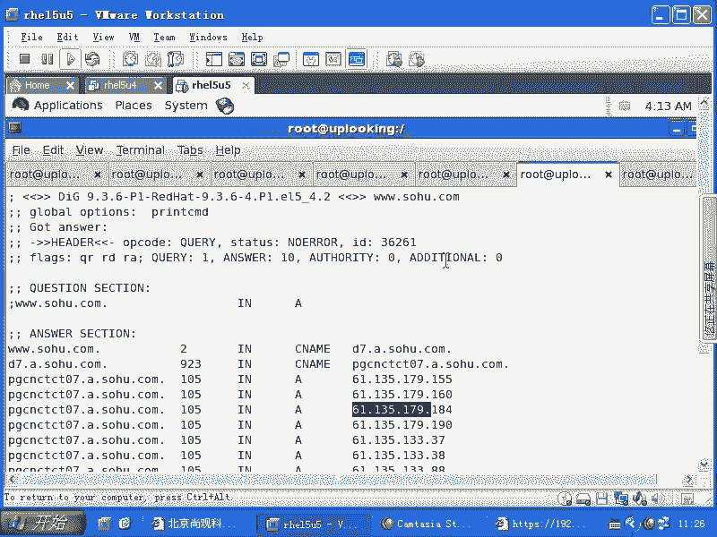

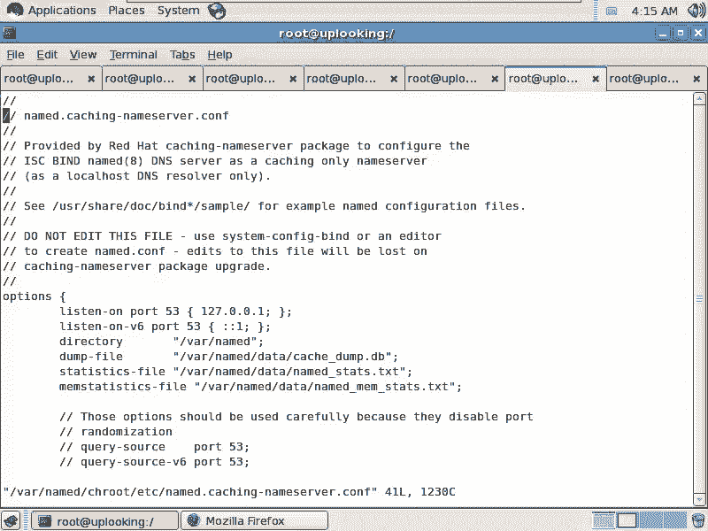

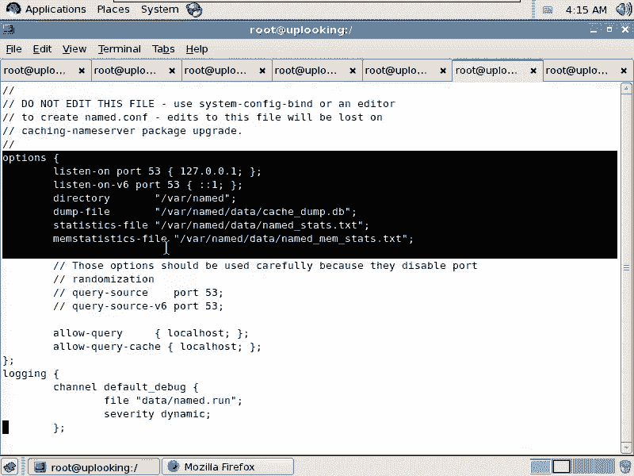

在本课程中，我们将深入学习DNS（域名系统）的工作原理，并详细讲解如何配置BIND（Berkeley Internet Name Domain）服务器。与简单的Web服务器配置不同，DNS配置涉及体系结构、数据记录和配置文件等多个层面，理解其整体架构是成功配置的关键。

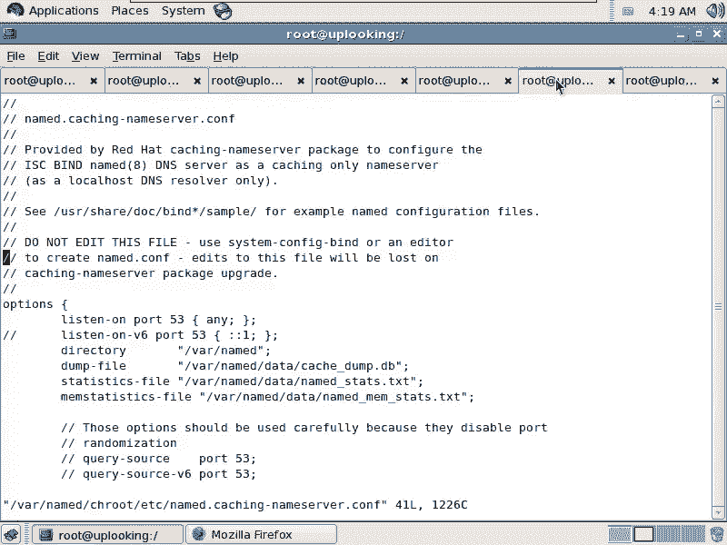

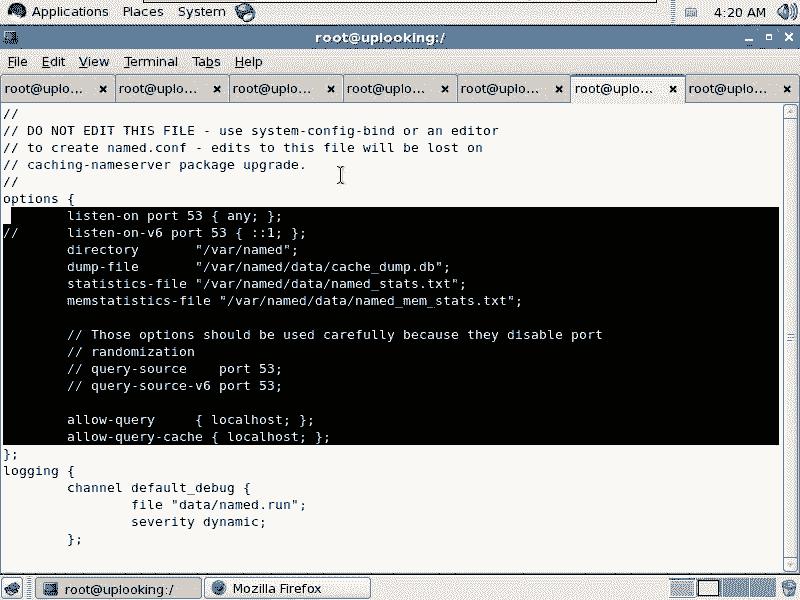

## DNS体系结构与BIND概述

上一节我们介绍了DNS的基本查询过程，本节中我们来看看BIND服务器的核心配置文件及其结构。BIND的配置之所以复杂，是因为它同时包含了服务配置参数和域名解析数据。其核心配置文件通常位于 `/etc/named.conf`，如果安装了 `bind-chroot` 包，则路径可能变为 `/var/named/chroot/etc/named.conf`。

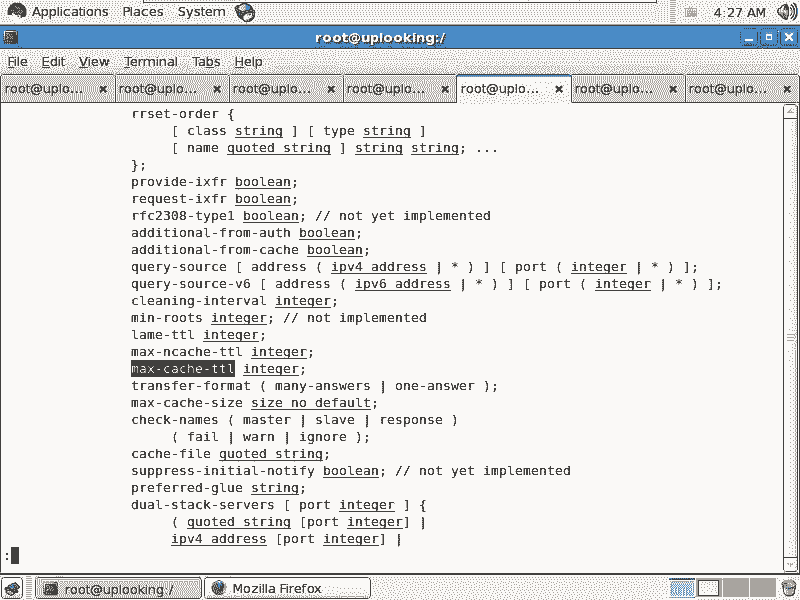

首先，我们需要启动BIND服务并检查其状态：
```bash
service named restart
netstat -antup | grep named
```
默认情况下，BIND可能只监听本地回环地址（127.0.0.1）。为了对外提供服务，我们需要修改监听地址。

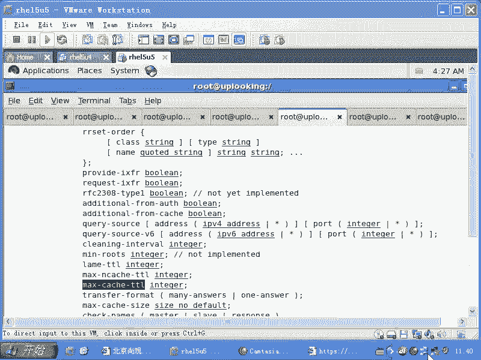

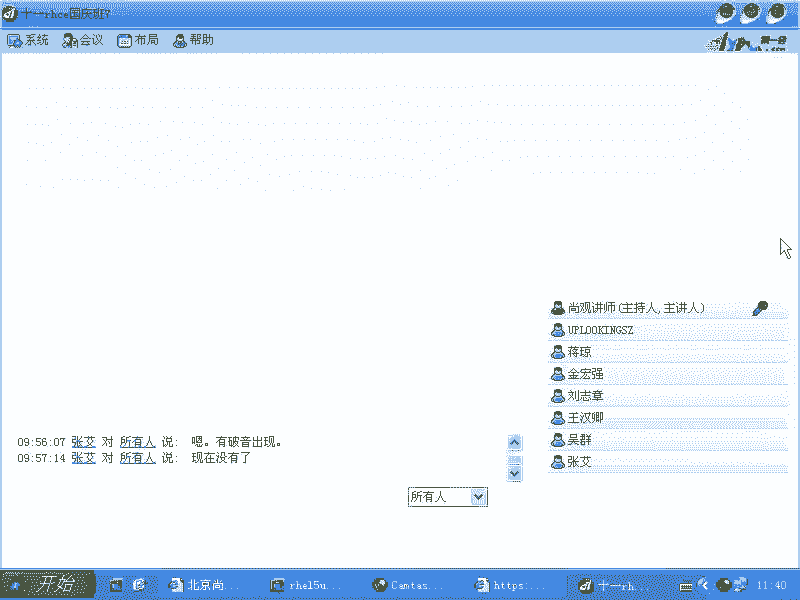

## 核心配置文件解析

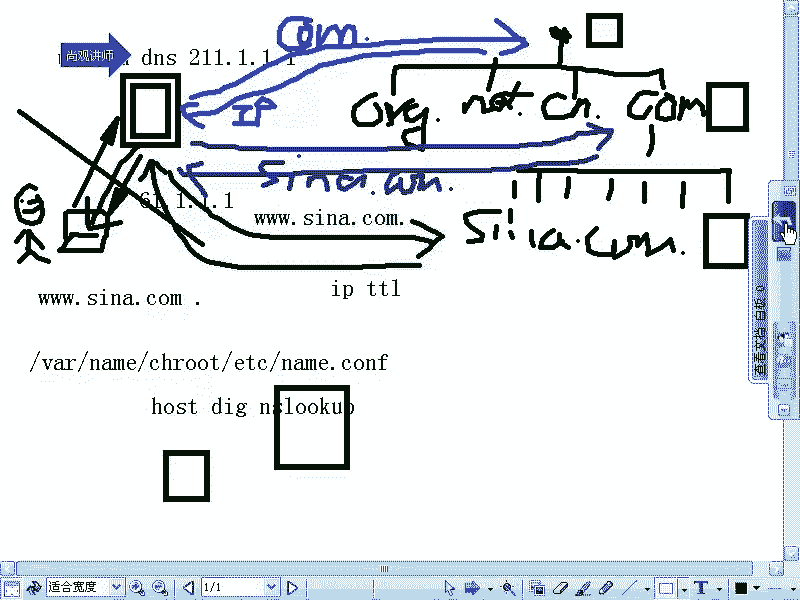

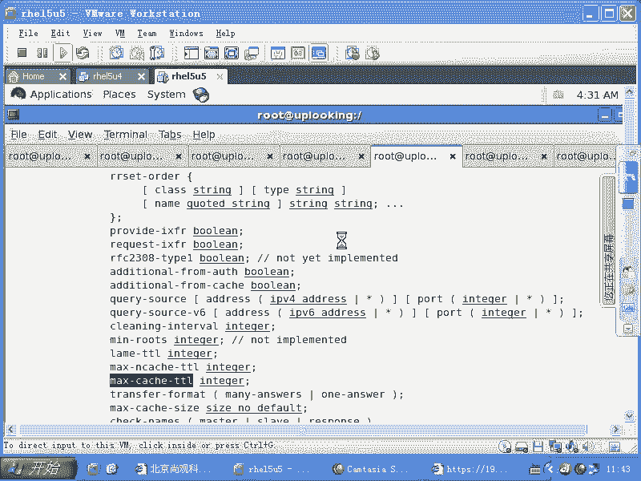

现在，让我们深入分析BIND的主配置文件。我们将重点关注 `options` 部分，它定义了服务器的全局行为。

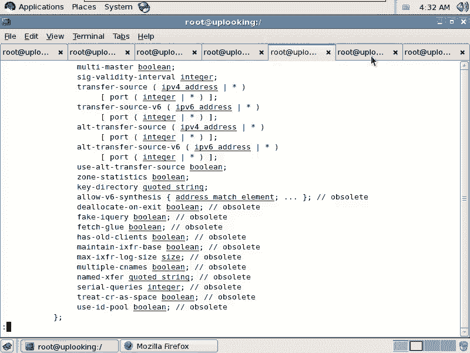

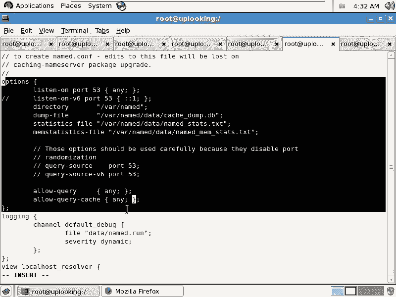

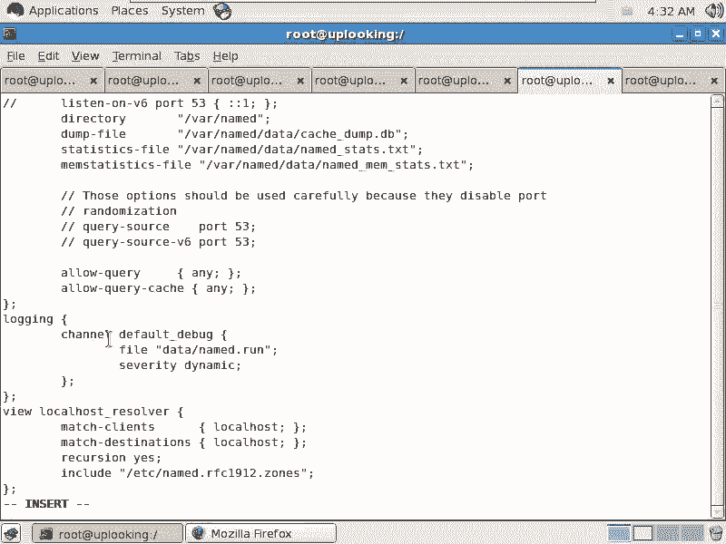

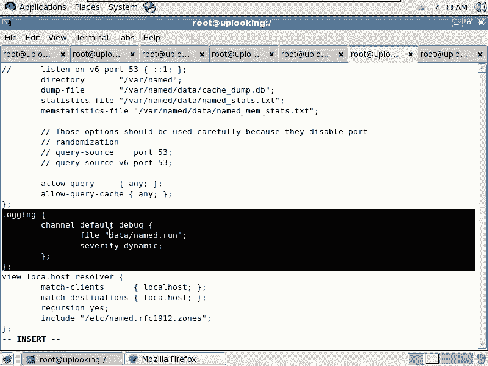

以下是 `options` 部分中几个关键的配置项及其作用：

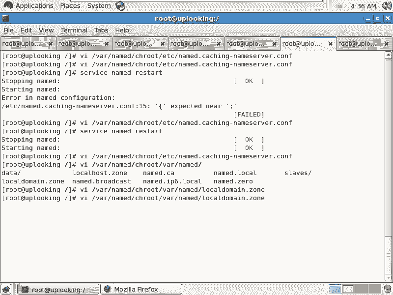

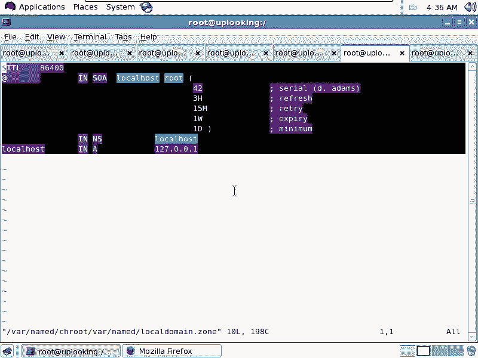

*   **listen-on**： 指定BIND服务监听的IP地址和端口。例如，`listen-on port 53 { 192.168.0.254; };` 表示监听指定IP的53端口。
*   **directory**： 定义BIND服务的工作根目录。在chroot环境下，这通常是 `/var/named/chroot` 下的路径。
*   **allow-query**： 指定允许哪些客户端向本DNS服务器发起查询。设置为 `any;` 表示允许所有客户端查询。
*   **recursion**： 控制是否允许递归查询。对于仅为自身域提供解析的内部DNS服务器，应关闭递归（`recursion no;`）以防止被滥用。而为内网用户提供上网解析的DNS服务器则需要开启递归。
*   **forwarders**： 定义转发DNS查询的上级DNS服务器地址。常与 `forward only;` 或 `forward first;` 配合使用，构建一个DNS转发服务器。

配置文件的语法要求严格，每行指令通常以分号 `;` 结尾，区块使用花括号 `{}` 包裹。修改配置后，可使用 `service named reload` 或 `rndc reload` 命令重新加载配置。

## 区域（Zone）文件配置

理解了全局配置后，下一步是为特定的域名创建区域（Zone）文件。区域文件包含了该域名的所有解析记录。

在主配置文件 `/etc/named.conf` 中，需要添加一个 `zone` 声明来指向我们的区域文件：
```
zone “sina.com” IN {
    type master;
    file “sina.com.zone”;
};
```
接下来，我们需要创建并编辑区域文件，例如 `/var/named/sina.com.zone`。一个标准的区域文件必须包含SOA记录和NS记录。

以下是区域文件中的核心记录类型：

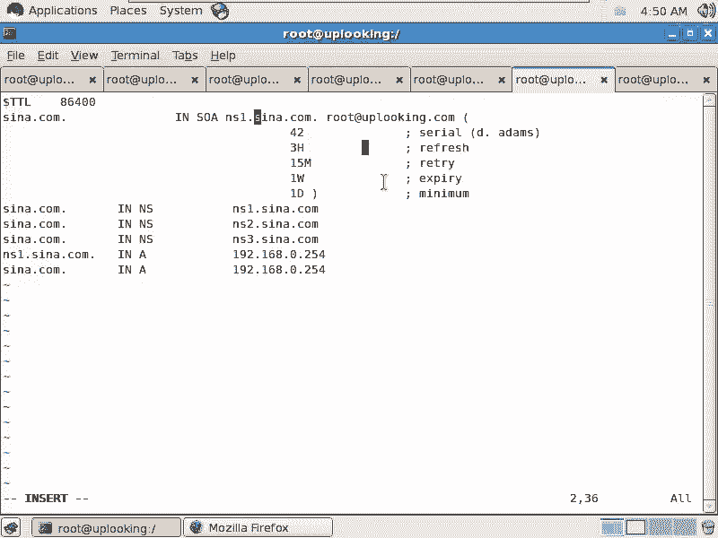

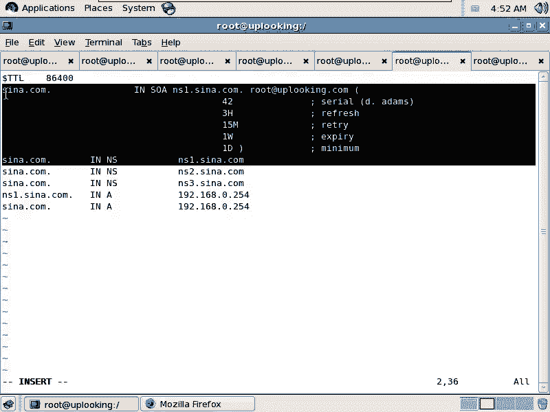

*   **SOA记录**： 起始授权机构记录，定义了该区域的权威主服务器和管理员邮箱。序列号（Serial）在每次更新文件时必须递增，以便辅助DNS服务器同步。
    *   **格式**： `@ IN SOA ns1.sina.com. root.sina.com. ( 2024010101 3H 15M 1W 1D )`
*   **NS记录**： 域名服务器记录，列出了负责该域名的所有DNS服务器。
    *   **格式**： `@ IN NS ns1.sina.com.`
*   **A记录**： 地址记录，将主机名映射到IPv4地址。
    *   **格式**： `www IN A 192.168.0.254`
*   **CNAME记录**： 规范名称记录，为主机名设置别名。
    *   **格式**： `web IN CNAME www.sina.com.`
*   **MX记录**： 邮件交换记录，指定接收该域名邮件的服务器及其优先级。
    *   **格式**： `@ IN MX 10 mail.sina.com.`

**一个至关重要的细节**：在区域文件中，完全限定域名（FQDN）末尾必须加上点 `.`，例如 `www.sina.com.`。这个点代表DNS根，省略它会导致BIND自动将当前域名附加在后面，造成解析错误。

## 工具与命令

配置完成后，我们可以使用一系列工具进行测试和管理。

以下是常用的BIND相关命令：

*   **`named-checkconf`**： 检查主配置文件 `/etc/named.conf` 的语法。
*   **`named-checkzone`**： 检查指定区域文件的语法，例如 `named-checkzone sina.com /var/named/sina.com.zone`。
*   **`rndc`**： BIND服务的远程控制工具。常用命令包括：
    *   `rndc reload`： 重新加载配置文件和区域数据。
    *   `rndc reload zonename`： 重新加载特定区域。
    *   `rndc flush`： 清空DNS缓存。
    *   `rndc status`： 查看服务器状态。
*   **`dig` 或 `nslookup`**： 用于测试DNS解析是否正常。

## 总结

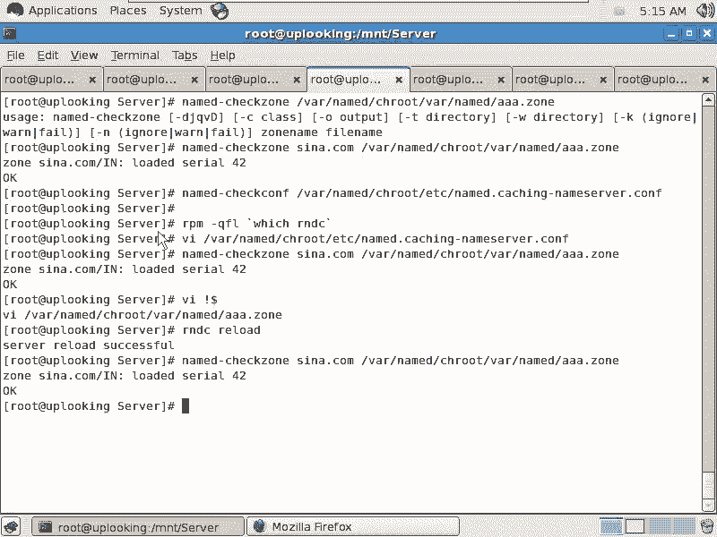

本节课中我们一起学习了DNS服务的基本架构和BIND服务器的详细配置流程。我们从修改全局选项开始，逐步完成了区域声明和区域数据文件的编写，涵盖了SOA、NS、A、CNAME、MX等关键记录类型。同时，我们强调了配置中的常见陷阱（如FQDN末尾的点）并介绍了用于验证和管理的实用工具（`named-checkzone`， `rndc`）。理解DNS的“区域”与“域”的概念，以及递归查询的应用场景，是构建一个安全、高效DNS服务器的基础。