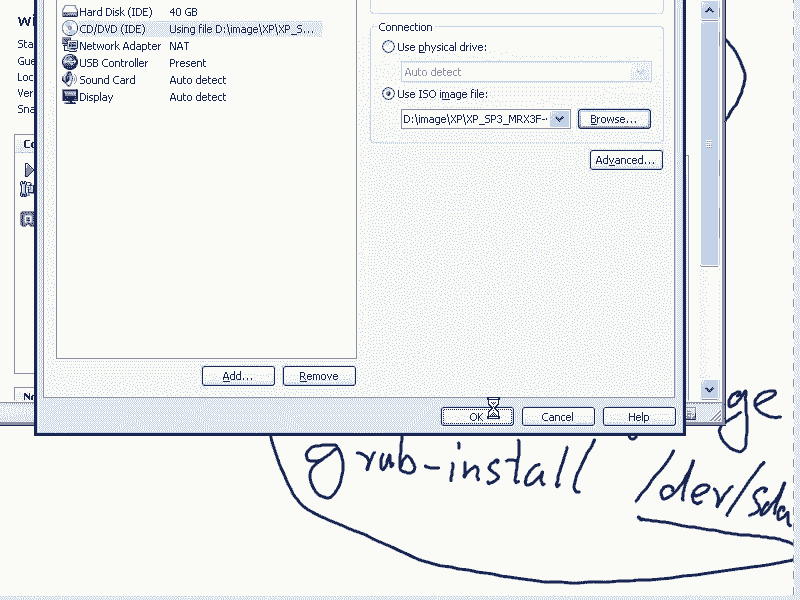

# 尚观Linux视频教程RHCE 精品课程 - P8：RH033-ULE112-02-5-安装Windows和Linux双系统 - 爱笑的程序狗 - BV1ax411o7VD

哎，小明嗯，什么事儿啊？就是公司现在已经有一台linux服务器了。那现在需要在上面再装一台linux服务器作为这个测试用啊，就是我以前从来没有做过这样的双系统嘛？啊，然我有点问题就是重升对。

那这样的就是其实这个问题的话呢，本身是比较简单的。你你先装个windows，嗯，然后呢再去有一段空余的这个磁盘。嗯，我不是说你磁盘，就是某一个比方说D盘里面有多大多大的这个剩余的空间啊，不是这么回事。

比如说你的磁盘的话，有多大是就是可以重新分个分区的。因为lininux它默认情况下是只能用什么，只能用这个自己的这个分区是吧？除非你经过其他的这种特别的设置。

但是呢你如果要是想去让它用这个默认的这个就是现在这个磁盘里面的一段空间作为它自己独有的这种分区的话，嗯，那你需要要么有剩余空间，要么它。可以直接把某个分区删掉，然后在那个分区下再去创建它自己的分区。

明白吧？就是说你比方说C盘上啊，我有很大的剩余空间没用啊，其实比较简单的解决方法就是什么windows装完以后，你再装lininux，只要有剩余的空间啊啊，剩余的空间。

并不是并不是说某个磁盘上剩余的空间，而是说有一段未分入分区的这种空间或者某个分区直接删掉，可以删掉，嗯，可以让它直接创建个自己的分区，只要有这样的满足的这样条件。

先装windows再装linux就直接就是双系统啊，明白吗？就非常简单。所以的话你这个问题的话呢基本上比较简单。但是呢我想告诉你的就是说它还有很多种这种设置方法啊，嗯那基本上是怎么样呢？

我给大家画一下啊，嗯，然后希望的话呢，你自己可以触类旁通，或者说根据自己的需要做出自己想用的各种这种方案来。嗯，那默认情况下的话，我们这边比方说这是硬盘是吧？对，这硬盘的话，我们都知道了，在安装的时候。

我们就知道了，它最小单位是512字节的什么sector。嗯，对吧？这一个sector的话，512字节，那么头446个字节是什么呢？是我们的这个MBR嗯主引导。记录嗯是吧，然后后面的话呢。

这64个字节是什么呢？DPT。标准分区表标准分区表后面有两个字节，你要说446加上64等于什么呢？510是吧？对，还有两个字节是什么呢？它要写成55AA啊，这就是二进制呃就16进制数写成55AA就K了。

那这样的话呢，我们看啊前面的这个分区啊，如果要是我分出来以后，比方先装了windows。嗯，那这边就是C的C的分区是吧？对。装windows在windows8windows999598啊。

或者windows2000或者windows XP的这段时间里面，嗯，这个这个地方都是非常简单，就是把MBR这446个字节做成一个自动跳转。嗯，自动跳转到哪呢？哪个分区是激活的状态，嗯它就跳转到哪啊。

如果在windows里面的话呢，自动啊C盘是一个什么呢？主分区是一个激活状态的分区。嗯啊，那么你的D盘的话呢，就自动啊其实这边是一个扩展分区D盘是这个扩展分区下的什么呢？第一个逻辑分区嗯是这样的。

但是哪一个分区的话呢，都有一个分区的这种引导记录，叫做什么呢？叫做分区PBR啊，分区引导记录。比方在这个D盘里面的话呢，也可能有什么PBR嗯。明白这个过程了吧？嗯，这是你单装windows的情况。嗯。

也就是说windows如果他是把C盘激活了，那这个MBR就自动找到C盘的什么PBR里面去。在这里面的话呢有windows的一部分引导记录。嗯，同时的话呢windows的一部分引导记录。

在这里同时的话在C盘的根录录下还会有一个什么呢？NTDR啊这样的一个。BR这样的一个文件。这个文件的话呢是这个分区引导记录的第二部分。嗯，明白吧？也就是说P呃MBR自动跳转到什么呢？

激活分区的什么PBR当中去，引导PBR当中的什么呢？but loader这个我们在安装的时候给大家讲过是吧？已经讲过，那么这个put loader是什么？就是引导加载器？启动装载啊啊启动装载器。

那装载什么的装载器。状态系统什么系统啊，那系统很大，系统有1万多个文件呢。应该就是启动一些文件内核嘛啊，那就是对了嘛。内核嘛，对你把操作系统认成是一个大的可执行文件。

这个大致可执行文件里面最开始要加载的什么，就是它的核心，对吧？这个大的可执行文件，它可以分成好多部分，但是它有一部分就是它的核心，知道吧？也就是说呃blus。先启动ow的话呢。

侦测到了你的这个磁盘的引导记录以后，会按照这个引导记录的。比方说MBR跳转到PBR，然后在这个PBR上的话呢，加载but loader的前一部分。

然后呢又找到这个磁盘上的后一部分 load整个引导起来 load，然后再去装载什么呢？这要装载，就是我们的什么操作系统的内核而windows也有内核，嗯，明白吧？windows也有内核。

它是lin内核设计，它有好，就是有一个基本内核，那它还有其他的这种必备的文件必备的部分啊，那这个过程的话呢，是必不可少的，对不对？对？如果要是你装了linux以后。

就是你先装windows以后再装linux是怎么做的呢？你比方说你把linux装到D盘上去啊，linux装D盘下去。

那这个时候你的linux它就会就是你的这个 loadlinux load就会改写这个跳转过程，不让它自动跳转到什么呢？window的这个PBR。面去嗯，也就是说linux的 boot load。

它就会把这个地方替换掉。把原来MBR里面这个数据的话替换掉，嗯，明白吗？替换掉了以后的话呢，它替换掉了以后，但这个自动的跳转过程就没有了。对，没有了以后的话呢，你可以选择而默认的选项是什么呢？

让它啊这边替换掉以后，可以去引导什么呢？bo分区下的什么呢？那个 kernelel就是linux的 kernel也可以去引导什么呢？windows下的这个PBR这两个是双选。明白明白了吧？嗯。

所以这个的话呢，就是我们说你双装先装完windows以后，你只要windows，就是这个这个磁盘，就是你这个分区呃，就是你的这个磁盘里面有一个有一块地方可以新建一个分区。嗯。

你别管它删除掉已经有的分分区哈，还是你就压根儿就有一段空间，没有分入分区啊，那这个时候你再装lininux，你只要在那个未分配的那块空间里面单独建立一个lininux自己的分区。

你就可以实现这个双引导过程。嗯，没有任何问题。你清楚吧清楚，所以的话呢这边画的有点乱啊。也就是说原来是自动跳转的，现在如果要是linux的 boot loader。

也就是grablinux的 boot load叫做什么呢？grab这个grab把这边替换掉了以后，把这个MBR里面的数据替换掉了以后，替换掉了以后会怎么样呢？这个跳转过程就变成了什么呢？可选择的。

既可以选择继续自动跳转，又可以选择什么呢？加载linux的某个分区里面的，对，明白吧？这就是基本的道理，好吧？嗯，那所以你现在知道你的那个装完windows以后怎么装linux了吧，知道了。

就是默认安装。然后你只要不要动windows呃windows的那个系统磁盘就OK了，不要动windows那些磁盘就OK了。就这么简单就有一个问题，就是说windows必须得装到那个主分区里面吗。呃。

windows是不是装到主分区里面嗯。呃，因为你在windows在安装的时候的话呢，就是是主分区还是不主分区的话，不是你选择的。我记得在装windows的时候，他就说你装在哪个分区下。

然后你一回车就直接下一步了嘛。那他实际上是可能是要求你这个分区一定是主分区嗯。啊，嗯我因为我我我我我记不太清楚吧，也有可能是就是说逻辑分区也可以。其实它这个自动的这个激活过程。

只要只要你的这个MBR能自动自动找到你现在这个C盘的这个分区，就是这个系统的这个分区。其实我觉得是不是主分区倒无所谓。嗯。你看啊就是我的意思是这样，嗯，就是如果要是你装windows的时候。

它不是有个选择嘛？选择的时候的话，其实你并没有看到它激活等等这个过程。对，如果要是你现在已经装了一个windows嗯啊，你再装第二个windows的时候，那你装在哪个分区，实际上都是无所谓的。嗯。

为什么呢？因为它的 loader已经建立起来了啊，明白吧？也就是说你看啊如果要是它这个自动跳转的过程，它自动能找到一个激活的这种分区嗯，那剩下的你这个你比方说第一个系统，你已经装好。

装到这个这个主分区下。那如果要是现在有个逻辑分区。你比方说在这里面的话，你又装了一个windows，这个windows是可以装到逻辑分区里。没有任何问题，只要put loader的话，在这边就OK了。

嗯，就是b load，他能引导起来就好了。不是这样的。你试过嗯，你试过没有？就说试过确实不行。对我好像win7跟叉P1块装的时候，你如果要扯到win7这边来，win7和那个就是vista。

它的but loader变了。嗯，就是它的文 boot loader的话已经不是传统的，像NTLDR这边少个L啊。嗯NTLDR。不是NTLDR这种方式了，它的这个 load都已经变了。

所以如果要是老的这个呃XP呃老的这个SP或者说以前的这个windows系统啊，我我的感觉我的感觉。因为你说的这种情况没有实现过，你可以自己试一下就是他只要有个 load已经装上了而且这个能用。

它就应该能引导另外一个能引导两个系统上的那个就是两个分区上的windows你比说有一个windows的话呢，在C盘下还有个window还有个windows的话。

在E盘下它应该这两个都能引导因为的话你第一个 load已经装到这边了。然这是我的这个意想对window的这就是和的这种因为有了虚拟机以后那么虚拟机的话呢，就是做的事情比较。所以这种导来倒去的话呢。

这种工作就做的少那我们的话呢现在来看一下的话，就是说当然了还有啊就说如你把。linux装到这个里面了以后，然后这边有个windows是吧嗯。

你还可以用windows的 boot load来引导linux啊啊，你可以用windows boot load来引导linux。嗯，比如他们的话呢互相之间都可以修复。嗯啊，那我这边的话呢给你给你看一下。

就是说。一般的我的这边原来操作的一个操作啊。嗯，如果要是你原来。Yeah。原来的话呢，如果你用的是你装了windows，嗯，那你再去装lininux的时候啊。

很容易就直接默认就双击双双引导就OK了啊啊默认双引导就OK了。那如果要是你原来装的是一个linux，然后呢你又装了一个windows，这个时候的话呢，你你要还想引导这个linux的话，那需要什么呢？

用那个lininux安装光盘，就是HEL5啊，EL6啊，HEL4啊等等什么安光盘，然后进入到什么呢？你需要在引导的时候，那个bo提示服下输入一个什么就那个bo提示服下输入linux。呃，救援模式啊。

rescue要把linux rescue进去了以后的话呢，重新把那个bo loader重新安装一下啊，也就是说重新修复那个but load，嗯，具体怎么修复呢？我把这几个命令的话呢，给你输一下啊。

那也就是说用bo提示符输入linux rescue以后啊，那么进入几步就是什么跳过啊，检查检查一下什么那个光盘呢，然后还有就是说激活不激活网络啊等等，这样几步操作。那最后的话呢，你看到一个什么呢？

提示符，在这个提示服下输入什么呢？输入一个呃。CH。如的啊chan change root啊，然后呢那个change root，然后MNT下的M啊就是MNT下的ss。Image。去入的进去。

然后呢输入一个什么呢？输入一个gb。就grarab嗯杠inst。然后呢，DV下面的SDA啊，这样的话就装上去了，这是什么意思呢？就是说呃。就是说我现在的话呢，如果要是linux装完了以后。

我比如在MBR里面的话呢，是一个grab嘛，对，是吧？这grab然后一装windows以后，我这个grab不就被覆盖掉了嘛？嗯也就是说grab它的这个初始的部分已经被弄掉了。是不是？

那所以的话呢这个时候我的win这个windows已经把我的这个东西已经弄掉了啊，就是这个grab前面这部分弄掉了，那我必须把grab重新装一遍装在哪呢？SDADA的话。

就是我们的这个整个硬盘的最前面嗯啊SDA就是我们整个的硬盘的最前面。清楚了吗？明白啊，呃，那如果要是你装你装完了这个windows以后啊，又装linux。

然后linux不是把windows呢最前面的话弄掉了吗？嗯，那这时候你想恢复成windows的单启动，就是不想启动linux。那你可以用windows的安装光盘嗯啊进入那个修复模式。

然后呢来把这个就是啊叫做什么呢？就是那个windows安装光盘，有个fiix啊MBR嗯，修复MBR啊，还有个什么呢？fiixwhat。啊，这个的话你应该是修复那个but loader之类的东西。嗯。

fix MBR的话就是把最前面那个阶段的话修复过去。所以话呢这两种系统的话都可以修复自己的那个部分，明白吗？只不过他们的方式是不同的，嗯啊不同的，明白吧？明白啊，好，我现在跨给你引导呃，就是给你啊。

就是看一下好好，然后呢。

我们假如说装完了windows以后是吧？嗯那现在的话呢我去重重呃先关机一下啊，嗯关闭计算算机。然后呢，我让那个我们的这个。就是让我们的这个呃光盘的话，镜像装上去啊嗯。

现在是windows的光盘是吧？嗯，然后呢，现在我用linux光盘在哪里啊？地方是吧嗯，你们。这个。我妈。有点一看看吧。嗯嗯。

然后引导一下啊。我看rescue模式啊怎么去修复。有。

嗯。は。

我们看啊怎么修复。好，那在这里面的话呢，按ESC是吧，输入一个什么呢？在H116是NESC如果H15的话就不用是吧？那直接出就行。你先输入一个linux啊，recu嗯，看着好像修复。

但是实际上它没有任何的修复的功能。它只是说啊它启动了一个小的系统啊，让你这个小的系统的话呢，可以用来做一个平台修复平台，就跟windowsPE是一样的。嗯啊我们看一下啊。🤧嗯。

rescuecue本地的是吧嗯。好。那还是under count是吧？看看现在的话是resk模式是否启动呢。因为我可能跟网络无关。对啊，那这边的话呢，你就continue就好了，是吧？对。旋中。

能听见就好了。ok 嗯。好，现在的话呢呃现在的话呢我在这个提示服下。对那现在我的这个root啊，你输入一个mount命令，你可以看到的话呢，在修复模式下。

你的这个root啊啊就是你的这个根分区被mount在什么呢？实际上是mount在就是它是rootS实际上你就访问的是内内存当中的一段空间。嗯，一般我们在硬盘上不是有个根分区吗？

它这个地方的根并不是那个根分区，而是内存当中的一段空间，嗯，明白吧？那现在提供的这个系统的话呢，就是特别简单的那个就是一个小的dux，这个小ux只是在内存当中给你虚拟出来的一段空间。

那这时候如果要是有硬盘上的这个root啊，它就会自动放在MNT下的ss image当中。嗯，那你可以输入一个什么chanro啊MN下的s。因为我现在这个系统并没有装，所以我这这个命令肯定是有问题的。

嗯因为我这个MN。并没有真正的根分区。对，那这时候如果要是有的话，那么这时候你就可以切换过去，切换过去以后输入一个什么呢？叫做gb。啊，杠inst然后呢DV下的SDA如果你这边是第一块硬盘的话。

那就是SDA嗯，如果第2块SDB啊，嗯，明白吧？明白了，那这样的一回车，那它就安装上去，就把把gra装上去了。嗯啊这就是非常简单的rescu模式嗯，清楚了吗？清楚了啊，那如果windows的话呢。

因为我windows的话就不是特别熟了啊。

windows就不是特别熟了，你看一下windows的镜像在哪？分到三十分。还该。就这个差P。好，我们来看一下啊嗯。

因为他需要的时间的话稍微有点长啊，整个的这个你看他这边的话是NF6啊，就是说linuxDD的话呢，是F6是那个什么的。22。

嗯，F6的话是一开始你的server，如果有特殊的驱动的话，那你就要那个按那个就是F6。然后呢把那个我们的比方说呃我们的server上，比方说有一个s卡，嗯，那你没有这个卡驱动。

你肯定访问不到这个硬件啊，防不到硬盘，你看这边的话有个R是吧？对。

啊，那摁R以后的话呢，进入恢故障恢复控制难。啊。是吧一是吧直接回车。那我要登录到C盘下的这个管理员密码是空空是吧？啊，这边的话呢是。嗯。这个。重新拿一下啊。因windows不是特别熟。

因为windows的话呢，这个修复模式的话呢，启动故障恢恢复控制台的这个修复模式的话呢，它可以有一个就是就跟hell一样，就跟跟跟刚才那个界面是一样，它不需要你的硬盘都坏了，没有关系。

它的故障恢复控制台还是能运行起来。有一个fix mBR的命令，还有个fixbut的命令啊，这两个命令的话呢，都可以去修复一开始那个启动的but loader，明白吗？

windows的 boot load都可以修复。

所以很多人的话呢就是觉得这个东西还是比较难。其实的话是比较简单的了嗯。

嗯。我看一下啊。R是吧，对，修复。要退出ro程序系统EX。要取消安回主右。还是不行啊。我看一下我。系统会。

安装不区分，就是可以装到主分区里面，也可以装到扩展分区里面吗。

linux可以主分区扩展分区都无所谓。但是你的MB，你的也就是你的put loader必须得要有，反你装了10个but特呃10个linux嗯都可以。只要你有一个bo loader是能引导的嗯。

那这个bo load的话，你比方说有一个，还有个版图还有个HEL，还有个db。那我不管你有多少个这个系统。但是只要有一个bo load是运行起来的，它就可以引导其他的呃 kernel。我看一下行不行。

不行的话，我就直接到呃windows里面的故障恢控制台去啊嗯。

嗯。Yes。算了，那个。

这个。我可能记错了。😔。

Yeah。OK看一下啊，就是说。就是说把这个。嗯，我看这个东西的话是没有出来，应该是我没有安装是吧？嗯，我们F1的话呢，在这个正常的这个系统里面，按F1的话，有帮助一可以搜故障恢复控制台的这些选项。嗯。

那搜出来选项以后的话，它是需要就是如果要是你直接在硬盘上去启动故障恢复控制台的话，是需要安装的那需要那个就是说需要拿那个光盘的话来安装的呃，我如果要是直接用光盘，我还是用光盘的话来启动。看一下啊。

阳光盘拉卡启动。因为我因为我总是。

咦。

windowsow斯的话呢就是鼓捣的少，因为我可能需求少，因为这也是现在的这个系统的一个趋势。就是说系统的话越来越强了。像我们以前重经常重装系统。但我现在如果买一台机器的话。

我可能呃从从就是买回来到最后扔掉这笔记本，可能都不再重装一次系统，啊，除非是你有很大的精力不断去折腾它。对，但是你如果不重装系统，它会不会有问题呢？那有问题的机会也比较少。嗯，而以前的话就不一样了。

看着不顺眼的时候就直接打掉，对吧嗯？

稍等一下啊。好，还是这边是吧，还那个R啊。因为可能我刚才记的是有问题。嗯，我们重新的话呢搜这个windows的帮助以后，我们可以看到，就是在这里面的话呢，还是呃我要修复它是吧？对，那就是这个系统。

我这个密码，如果没空到，直接回撤。嗯，那其实的话呢有个大写的fix。啊。叫fix。MMBR是吧，嗯，直接回车。那这边的话呢，他会重新写入主引导记录。嗯，看到了吧？对，fix andR。

因为那个就刚才我还以为是fix的话是一个独立的命令。嗯，然后呢搜了一下windows的帮助，他就我记错了。嗯，还有同样的话呢，你这边如果是呃确实要这样写的话，那么你就写上去是吧？同时的话呢。

你要其实想写写那个就是把这个引导相关的东西你再重写的话，fix嗯啊fix boot然后呢，说你目标词盘是C盘嘛？是吗？啊。啊，让他自己直接去重新写嗯啊启动善区。那这就是fix what。

还有fixMBR。啊，这windows的自己的这个修复 boot load的方式。嗯而刚才linux的修复 boot load的方式是什么呢？用rescue模式进去是吧？

对rescue然后呢是grab int等等啊，那如果你装完了这个就是re这个企业版以后啊，就是装装完了这个re企业版在windows已经装完了情况下，就是说你先要规划好是吧？

如果windows已经装完了，然后你再去装一下，然后互相之间如果要是想去删除或者想去替换的话，刚才我已经跟你讲嗯，那如果要是你现在想去配置 load的话，想去配置。

比如说呃gra就是我们的linux boot loader嗯，那它其实有一些选典型的选项，你如果要是原来有windows，那么装完了以后就是典型的是这个样子。

它的配置文件就是grab点com嗯put目录下的grab点com在这个目录下的话呢，grab点com的话是典型的是这样的啊，对，是这样子。那我们可以看一下的话呢，就实际安装的这种过程。嗯。

这边是我这个重新修复了一下。嗯，我们的话呢还是正常的话呢，把windows启动一下，然后让它自动看能不能进去。同时的话呢再把linux再重新装一下，也就是在先装windows以后再装linux。

然后我们看他们互相之间可以有一些什么样的这种呃配置，好吧呃。

然后我这边的话。他。Yeah。

这样吧我还是不去引导他呃，不去碰他。是吧。等他默熟就是默认的这个时间过了以后，正常启动windows。嗯，你看到现在这个fix mBR和fix boot，实际上是它可以正常启动。对。

这个过程的话说明MBR已经没有问题了。嗯，是吧？就windows的MBR经过我修复以后的话呢，就是至少没有把它弄坏，对？那也就是说你原本是坏的那这样经过修复以后，它就应该是好的嗯，是吧？

但这样折腾的机会越来越少，为什么呢？因为大家都喜欢用虚拟机就完事了嗯。那windows XP可能是微软最大的敌人微软自己的产品是他自己最大敌人，因为确实非常好用，嗯，啊出错的机会也少。好。

我们把它先关掉，嗯，然后呢再去把。这个linux词装下。

时间比较久啊。装个HEL几啊。2ER3 toS。安装个汕头S吧。5。6嗯，好吧？嗯，因为我想装简单点，我不想装那个就是我们的这个R7L6那么麻烦啊，就是那么复杂。

嗯，那还是这个界面是吧？那直接怎么样回车是吧？对，直接回车了以后，它会自动的去看到你windows的分区嗯啊。好，跳过检测如果你是生产系统的话，就不应该跳过。嗯，这个原来我们详详细的讲过是吧？对。

它现在还是按空的啊空的，就连reite的这个安装工具包的话，都是直接照搬过来的。嗯，那它的安re的安装工具包就是under空的啊。

开en级的。Hasen也是一种蛇，蟒蛇，啊cona也是一种蛇。嗯啊s尽管界面不同，但是基本的过程话都应该是相同。咦。😊，那鼠标还不能用。好像是慢一点。那个就快了。好，我们看一下啊。嗯。按table键吧。

如果鼠标不能用的话，按table键这边的话是。嗯，我自己的话呢。自定义自自定义是吧？嗯，然后按table键。拆我奖拆我奖拆跟我奖。然后呢，这边的话呢会显示出来说现在HDA5上有30G的空间是吧？对。

那么HDA5的话呢，现在是NTFS是不是？对，那我这边的话呢到HDA5上，然后呢输入一个alt加D是吧？就是说这边的delete，因为我现在已经装完了一个哎可以吗？咦。😊，就说因为现在我是虚拟机。

虚拟机的话原来有个windows系统，现在有个lininux系统。那这边这个鼠标就不好用了。嗯，我先把它。cancel啊outt加C啊，然后呢outt加D是吧？

我删除这个HDA5因为我已经知道这个D盘我是没有用的，在linux在windows下这个D盘我是没有用的。嗯啊，然后我就这边outt加D啊，你看到哪个哪个字母下面有个项有个杠你就按alt加什么就好了。

嗯，alt加D声音掉了，删除掉了以后，然后呢我再看。那这边啊然后加上一个alt加W是吧？new是不是new，那么我先创建一个foot进去是吧？ES3的那100兆的话就OK了吧，对，是吧？

OK我们讲过了啊，然后呢再去alt加。W是吧，然后那时候创建个根分区是吧？根分区的话呢，我先创建一个。实际的吧嗯，好不好？ok。嗯，我有一个问题就是说那个SDA2是吧。

就HDA2它不是原先是那个winow下创建那个扩展分区吗？嗯，在这可以直接应用吗？啊，可以用啊，因为它都是标准分区表里面的这种方式啊，就是标标准分区表的话呢，你是主分区也好。

还是扩展分区好还是逻辑分就是就是分区表嘛，分区表这些信息的话，都是大家兼容的啊，啊，就跟我有我有一大片田地嗯啊，那么我把这片田地的话呢，这样分出来，我种西红柿好还是种什么好。那么大家都一眼能看出来。

我分的这片区域是大家公用的一亩两亩，这都无所谓，管你种什么东西。嗯但是呢你种西红柿的人也知道这是两亩地，我种比方说菠菜的人也知道这是两亩地嗯，那这个都是统一的嗯啊加W，再新建新建一个什么呢空间是吧。

wipe空间。那要。空间内存的1到2倍是吧？对。好，现在的话呢这三个空间的话都。都创建好了是吧，一个swipe，一个but一个根，对吧？然后呢再点击一个。next然呢这时候就是那 load话呢。

这时候说的很清楚，就是你现在要不要装grab你要装grab在MBR上，你看它这边叫做HD是吧那是因为你现在的硬盘选的是IDE的硬盘你这个虚拟机里面硬盘选的是IE的硬盘。

就是H如果你选择硬盘就S如果你是S的硬盘呢也是SD吧？那现在的话呢你说你你可以不装不装，那就不会把windows的那个弄掉如果你装装HD上就把那个windows的MBR那个自动跳转的过程给它弄掉了啊。

所以的话呢你也可以选择什么呢？就是说你现在的话呢是默认去用C盘的windows系还是HD6下的供你可以自己去自己去设置都可以。呃，那我这边的话呢，next。那我就默认了。嗯啊我也自动获取IP地址是吧？

对啊，时区的话呢去选一下。哟这个鼠标还是能有用的吗？是是暖吗？不是这个鼠标的话，呢是。哎，好，嗯，有的时候有用有时候没有用啊，因为这是虚拟机的问题，虚拟机和两个系统兼容性的问题。Nextくて。啊。

我们跟大家说过，安装的时候，一定要把时区选对，对不对？这个相当于HEL5嗯U啊U6是吧？upate6。那么其他的这个安装的过程的话呢，呃我就想安装一下最简单的就好了。啊，我不想去定制了啊。

我也不想定制了，我就直接以后再去定制吧。嗯啊能选最小化安装吗？最小化安装，我不知道这边有没有啊。系嘢啊。虚拟化。😔，我存储。😔，用来ss这个应该是一个就是比较少的内容。我不着急弄。是吧对。

因为这些选项的话，我都给大家已经是说过了说过了嗯，就直接这样的安装过程。那除了就是说在呃分分区的时候要小心点之外，其他的没什么太大的区别是吧？嗯，but loader你就让它默认安装就好了。

这样的话你先装windows再装linux基本上是没有什么悬念呢就可以装了啊next那咱就可以安装了。嗯，好吧，我们等一会儿的话呢，来看一下安装好以后是什么样子。行。好，现在的话是bo是吧？嗯看。

加T。那重启一下。重启一下，然后我把这个光驱的话就底要弄开了，是吧？

现在已经是未连接的状态嗯O现在这样的话呢会有两个选项是吧？那如果要是我选的others就是启动windows嗯啊，那这个others的话呢，启动windows它到底是通过什么命令去启动的？

就是你如果装完linuxwindow以后再装linux那它就会有这样的是个双启动那默认情况下它就是5秒自自动的这个倒数如果5秒你没有动的话，它就自动启动第一个选项就是说你在安装的时候呢，那个第一个对吧？

那实际上你在这边如果要是按下E的话，你能看到它执行的是哪两行命令啊啊，那也就是说如果要是你现在是选择的是others一回车以后，那我们的gra的这个 load，它实上执行的是两行命令。

你摁下E啊按下E摁下E哪两行命令呢是是吧NVER是吧Y是吧？然后HD逗号这个表示呢就是说我要把现在的引导权。交给第一个硬盘的第一个分区啊，因为对于grab来说，我们知道对于linux来说。

第一个硬盘的话，比说SD对或者HD是吧？但是那是linux啊，linux是说grab已经自己的控制权已经交给了linux的以后那这时候lin才能认出来啊那现在的话呢我们的linux的话还没有引导。

它拿入SD和HD所以现在是grab阶段grab的话呢第一个硬盘就是什么呢？H0，这个硬盘上的第一个分区是什么呢？HD0都是0嗯，明白吧？

那chan chain load加一就是说我要把我自己的引导权交给下一个 load了。嗯，那么就是 load加一啊那这个命令的话呢。

你可以摁C啊摁C你可以看到这个grab啊你输入一个hel然后呢你看这个命令都有啊，比方说hel。help啊，比方说啊钱。Hloader。是吧嗯看这个命令。啊，全loader loader是什么意思？

说加载另外的一个 load嗯，明白吧？这个时候你都可以自己去查询的，就是说你想看哪个命令的帮助，你先摁一下C然后呢输hel什么什么东西就O了。当然这个是有点深了。

你会如果觉得无聊或者说老是你讲这破东西这么麻烦啊，这么多，你可以不要去听的没有关系，嗯，那你只需要知道刚才像你刚才说的问题，那装个winow我怎能装个linux那很简单，第一句话我就已经解答完了啊。

是吧？那下面的话就是一些稍微深一些的问题嗯啊，这个help全loader那我这样的按ES啊，退出当面这个界面，那实际上的话就是刚才如果要是你去啊就是在这里面直接回车的话，这个地方回车的话。

那就执行了两行啊，如果要是你移动到上面按下E啊，它是执行三行命令就是到第一个硬盘的4啊。四是表示什么意思？第一个硬个第一个硬盘的第五个分区区对吧？第五分区去找什么呢？找VMLRNUZ啊，杠2。6。

18什么什么这个内核。嗯，也就是加载这个作为它的下一个可执行文件，嗯，明白吧？第一个可执行文件是不曾呃bel。不要是执行完了以后的话，再执行but loader。but loader执行完了以后。

把这个引导权交给谁呢？交给VMRINUZ嗯，然后呢他在加载 kernell了以后，引导权先不给。nel，然后呢它会加载IITRD把这个东西也加载到内存当中。然后呢，最后的话再去引导什么呢？

VMLINUZ这个内核嗯，明白吧？也就是说but about会帮你做三步，你三步是为了引导一个linux啊啊，那么现在我想问你，如果我再装一个linux，我装了第二个linux。

刚才我不是有30G空间吗？嗯我再装一个linux。可不可以O，那只要什么呢？我这个地方变成HD0逗号几啊，逗号5逗号6逗号7啊，我就可以加载不同的 kernel呢嗯，明白吧？所以你想装几个克呢都可以啊。

那等一下我们可以继续再装一个，嗯，对不对？咱们现现在看一下的话呢，linux能不能引导，吧？如果能引导windows也能引导，那说明双引导已经没有问题了，对吧？我们现在这样直接回车啊。

reinux是没什么问题对。啊。稍微点慢啊嗯。这地方的话。很慢啊。那我们看看能不能引导起来。因为这虚拟机的话，我也没谱啊。虚拟机里面再装两个双系统引导。

除了我们给大家讲解这个双音系统引导到底是就是说怎么回事之外，其他的用途又在哪呢？没有什么太大用途。我大不了装两个虚拟机不就完了吗？嗯，那就是这个虚拟机，我做两个虚拟机出来分别引导就完了。啊。

你可以看到的话这个系统的话是可以引导的对对吧？我就不等了，我就不等了。你看他已经进入到这个阶段了，嗯，对吧？因为我图形界面没有装，所以等一下话大家看不到图形界面嗯啊，我就先把它怎么样呢。呃，停掉啊。

启动的差不多了以后，就直接停掉了。

系。这些就算了嗯。那是。关掉它。嗯。😊。

。那最近嗓子还是。沙哑嗯。比较难受。好嘞，关掉系统啦。然后呢，我们再重新去引导是吧？看一下windows能不能引导起来嗯。修改启动下。这个地方啊。

啊。你现在在启动啊，看一下windows能不能启动。嗯啊，这边倒手是吧，54321是吧？对，那我在这之前，然后选择others。嗯，当然我这个名字可以。可以变是吧？嗯，但是我看windows能不能导。

哎，是引导的是吧？那我这边的话就不让他继续进行了。嗯，那其实的话呢就是刚才我画的这个图啊。我看才画的这个图嗯。就是说默认windows的话是有一个啊这个MBR是吧？MBR这边是自动跳转到什么呢？

C盘C盘实际上就是激活的一个分区，激活的一个主分区是吧？嗯，它这边有个PBR是吧？刚才的话我们就说本来这是个自动跳转过程啊，这是扩展分区这是第一个什么呢？我就是D盘是吧？对E盘等等。

我们现在把windows把linux的话装到这个地方，就波分区装到这个地方嗯，这个地方也有什么呢？PBR啊，那只不过的话呢，这个地方我们被被我们换成那个什么呢？grab啊。

gra的话呢可以跳转到这个地方，就是我们就others这项通过两行命令去跳转的是吧？也可以怎么样呢？默认它是选择什么呢？这个目录里面的某一个文件，就是VMINUZ这个文件这个文件就它这两个选项的话呢。

就原来的这个自动跳转过程就怎么样废掉是吧？嗯，所以的话呢这就是给大家看到的这个样子啊，然后呢我们再去再去做一步，就是把H16啊，也如我再装一个lininux，看一下什么样子。我装了一个汕头S嘛，我把6。

1也装一下嗯啊。

好，看一眼。那现在是什么呢？安装是吧？嗯啊。

血压力明显比较猛啊嗯。

哎，汕图S就是这样的问题，我不是给你介绍过吗？s图S是做代码，都是从呃reite那边拿过来是吧？嗯，但是你怎么知道reite的这个代码，你这样编译是没有问题的？嗯，那我源代码是在那边。

那你能读得懂我所有的源代码吗？是啊，所以的话呢用汕图 S也是有风险啊。只不过是一般便宜，就是图便宜的公司，小公司可能会用。嗯，如果大公司不。不在乎那点钱，那你无所谓啊啊。是选择语言和那个键键盘啊。咦。

😊，你跑到这个模式下，内存不够是吧？它内存不够，自动跑到了文本安装模式下。嗯，啊那也无所谓了，是吧？我这边选择一下。Yeah。China。😔，上海。这是文本的安装模式啊。

新加坡和上海都都是一个市区嗯密码。咦会不会已经跳过了？他说你用了一个特别简单的特别简单的密码，嗯，这是分区是吧？对。啊。哎，他把这个认成SDA了。啊，就是在不同的系统下，它用的驱动是不同的。嗯。

你像HEL刚才那个呃三通S用的是HDA吧。对，那在这里面是SDA因为不同的系统的话呢，你像现在的linux的 kernel把所有的硬盘全部都变成SDA了。嗯就是同样是这个ID硬盘。那你在HEL6里面。

它可能是SDA。啊，我看一下这个地方的选择应该是。

不行啊，你这个还是重新来。

就是稳稳安装界界面的话，内存太小了。嗯，你看EG吧。佢哋意致。

系啦嗯。

文本安装接口的话呢，它的这个。

文本安装接口，他他要的内存小，然后他刚才侦测到你的这个内存特别小的话，自动启动了一个文本安装的这种接口。对，只不过它提供的功能就少了。

就。我直接OK了是吧嗯。太愚蠢了。我说我自己啊。😊，う。😊，你就会一会儿板凳哗呀扔到我脑袋上了，这就惨了。😊，我看一下啊嗯。跳跳拨是吧。其实你多很多人的话也不知道多装两个lininux会是什么样子。

其实非常简单嗯啊。

有。

天哪。我们的这个这个界面太大了啊。大家看一下。也是一样，点鼠标没有用。那鼠标没有用unalt加NN啊，然后呢，英语是吧？嗯NNN啊，然后呢，这边基本的是吧？基本的是吧？嗯，很。就是用基本的存储嘛。

我没有我没有这个存储的，比方置列柜之类的东西，先设置一下主机名加N是吧？其实呢就是刚才那些选项了嗯。又跑到北，这跑哪儿去了？他这个鼠标好像。哦，你看错位，你看到没有？对。要不就直接nex吧。啊。

我这边点的。台北。上海。なして。哎算了，那就加吧，明吧。因为你多装几个系统也挺好玩的。嗯。对吧嗯。我这边自自己创建是吧嗯。嗯，好，我们来看一下啊。那这样的话，我去。嗯Creat是吧。Yeah。

outt加C啊，具体的过程我就。moode加R。是吧嗯，那用EX3的还是用什么呢？我这边弄个bo分区是吧？对，然后呢哎。我弄第二个部。刚好你可以看多个部分分区或者多个根分区的时候，样子是怎么样的，嗯。

是吧？You。E3啊嗯来200兆是吧？对。喂。就创建了一个多了1个SEA8吧。对，是吧？然后呢再outt加。四。啊，又是一个标准的分区分区或再加2。啊，这边的话是根是吧？嗯。

其实你有一个swipe就够了，就多个linux的话，你只要有一个swipe就够了啊，他们可以共享对，共用那个。那这边的话呢老规矩实际是吧？实际的话呢，将将够啊嗯将将够。

你生产系统千万不要跟我一样搞个实际的啊，那就太好了，是吧嗯？你看一下啊。好，alt加N是吧，对。なくして。😔，啊，就入分区变。SDA8和SDA9嗯，然后按理说应该三个分区，一个bo分区，一个根分区。

一个swipe是吧？嗯但是我在前一个linux系统上已经创建了个swipe。嗯，那他那个swipe可以给我这个swipe来用嗯。只要你不担心泄密的问题，因为这个系统都是你自己在用嘛，对，是吧？

现在的话呢它就自动就侦测到了。说我现在的话呢大家仔细看一下啊，嗯，他说我现在的话呢想把这个波特罗装到SDA上，对他要替换掉那个汕图OS的那个了他要替换掉那个然后他说他也侦测到了SDAE上有什么呢？

有window但是他跟汕图势不两立。嗯，我觉得他没有做出一个汕图OS的这个启动选项。倒无所谓。我们之后的话呢，一会儿可以自己手动来引导啊。这边next。简，因为这个为了给大家去拍这东西。

我总不能拿个摄像机来拍屏幕啊，那样的话就是晃晃悠悠的会非常非常麻烦。嗯，那这边的话呢选择一下，那我就用基本的这个s吧，嗯，哎最小化啊对和最小化。还有最小化嗯。呃，再加N。好后再加N next。

然后我们现在就装了个最小化的系统嗯。哎呀，这这堆案件案的真是头大啊。对，但是呢你是一个搞lininux的人，这种东西就是小菜一碟。嗯，可能windows的话，你可能觉得呃就是手忙脚乱的。

但是lininux这种事情，你甚至要输入一大串的。命令啊对都不会输错啊，就是你会锻战自己。因为你是搞计算机的人。对你搞那种就是比方说一个小姑娘呢，她都能操作的东西，你想想你自己的价值在哪嗯，是不是？

就是你是如果要是一个普通消费者，那无可厚非啊，谁都可以操作这个产品是吧？你可能操作比别人还好一点，那别人的话呢可能也比较羡慕你。嗯，但是呢你是一个做IT的专业技术的人，那小小的一些问题，你突破了以后。

别人没有突破，那别人就不如你嗯，这很简单的道理，对吧？对。刚才装这个6。1好像跟原先装的6。0有点不同是吧？嗯，也没有什么大的不同，好像哪个地方有不同，也没有什么不同。就是那个最小化系统什么的这种是吧？

哎，都有吧都有都有了吗？都有，就感觉跟你一样一样啊，那总共200多个包，对，总共才200多个包。要知道这个官盘上总共有2600多包，2700多个包，它只装了什么1%。嗯，哎，不是10分之110分之1对。

那他基本上什么功能都不会有了，嗯，就是看个样子啊。哦，那我们这边的话呢，就其实应该把这个PPT改一下了是吧？嗯，然后呢我们在这边做了windows和linux的这个先装哪个系统呢？如果要是你去呃。

你想让谁先就是让他们共存的话，一般先装windows你要再整linux对对吧？那如果是呃你确定了这个but load的安装地点是吧？你知道会有什么样的后果，是不是然后呢grab的配置。

我们刚才已经给大家介绍过了，是吧？那现在的话呢就是什么呢？就是说第五点是什么呢？呃，多linux。啊，同时共存嗯啊或者说。共同。听导。是吧嗯这个的话的过程是怎么样的？主要我们讲的是刚才讲这个地方是吧？

对。啊，好，我们马上看一下啊，这个还没装好，马上装好了。嗯啊激动人心的时刻就要到了。浪费了好长时间嗯。他那个图标还显示6是吧？还是6啊，他不会说6。1的嗯，不会有6。15的话也是5嗯，对，没有那个什么。

只是说你cat一下ETC下的 release。那样的话你可以看到。这边的话呢是。安装最后一个包嗯。能最后一个包。过一会儿的话就OK啊。然后我现在的话终于是完事了是吧？其实这个安装的过程也倒是比较快了。

嗯啊那是alt加T是吧咦。

alt加T。

不。等一下卡。

あれ。我先把它变变小吧嗯。变那么大的话。

是应该这么大的嗯。啊。

嗯。😊，那个。等下。

是吧嗯运行一下，让他直接用硬盘启动吧。行。嗯。

啊，进入windows了，已经这边windows是没有问题的，是吧嗯？

然后我看一下啊。啊，OK那在这里面的话呢，我们的s没了。对，是吧？还是按刚才那个，比后在这里面的话，我们摁一下E。哎，你看到现在他找的是HD0逗号7是吧？刚才是HD0逗号454嗯。

4的话就是DHDA5HDA5嘛。嗯啊4对对对，那这边的话呢是这个HDA7，那其实少了一个是吧？对，其实少了一个没有关系，你如果想让他引导起来，那你就直接改一下这些选项就好了。嗯，你再按一下E。

你就可以改它啊，那其实的话呢如果要是你想用命令行的话，你看啊记行的这四行命令，我可以给你把它引导起来，摁一下什么呢？我们先看一下H116能不能引导啊。嗯，好的，那你可以看到others它也自动保保留的。

还是一样嗯，跟还是一样是吧？那这个版这个grab的话呢，就是H116的grab嗯，它不是那个sOS的grab嗯他把那个grab给刷掉。对，那现在的话我们这样的啊，输入一个C。输C输入一个什么呢？

HD啊root是吧，H括号。HD0逗号。是吧，然后一回车，然后输入一个什么呢科。啊。从这个根并不是真正的根分区，嗯，而是什么呢？而是HD0逗号4，就是我们那个bo分区。对那个bo分区下的根下面啊。

那个bo分区的根下面就有一个叫什么VM阿拉NUZ用table键自动补齐。对啊，那么这边补齐了以后，输入一个什么呢？root等于啊。label等于根嗯，明白吧？就够了就够了。嗯，然后呢再输入一个什么呢？

IITRD输入个IITRD啊，untable键嗯。3号命令我输入完了吧。对最后输入一个啊，你启动起来，就是sOS就启动了啊啊你可以看啊。啊，他你拿到这个地方。有。sOS没起来了，sOS启动起来了是吧？

嗯，然后没有任何的问题。那实际上这个系统里面既windows，又有lininux，又该有s，又有R716嗯嗯。三OS5的话就跟H7L5是非常非常像，对吧？嗯。那能不能再倾向一下。

把这个生透OS加上那你一会儿改grab的配置文件就OK了。嗯啊我们现在的话输入一个。root是吧嗯密码就当时我输入的密码。然后呢，在这里面我们知道啊grab的配置文件。对。

其实刚才我们那些 kernell是在哪呢？在不同录下嗯啊，因为刚才的话我们是访问根下的什么VMLINUZ对不对？对，我们访问根下的VMLNUZ但是其实的话呢。但其实的话呢，这个呃VMLNUZ的话呢。

它这个分区在真正的根被加载了以后，然后这个分区又被加载了but下所以的话呢原来跟下的VMLNUZ就变成了but下的VMLNUZ这个的话呢我给你做个实验就知道。

比方说我现在创建一个什么呢AAA这样的makeRA然后mount啊DV下的SNHDA4是吧？HDA5是吧？这是我们的那个but分区嘛。不是HD0逗号4就是5个分区是吧？HDA5是吧mount在哪呢？

AA下去果这样一mount完了以后然后你再去看。好一样的是吧？所以的话呢这个文件又变成了AAA下面的VMLNU是不是？所以你把这个分区mat在哪，它的那个前面的那个目录啊。

就自动的跑到了这个文件的这个前面去你就能通过这个路径来找到这个文件你把把这个分区在哪那它那个路径就相应的变对不对？就这样道理。那其实的话呢我们的grab啊我们的grab它在哪呢？

V你的VM啊在gra目录下的grab当中的gra点啊，这个但是你改这个配置文件是没有用的嗯为什么没有用呢？因为我们现在是不是所在的啊。

我们现在所在的这个根是HD6就是我们的什么就是我们的这个呃我们这个现在所在的这个根实际上就是那个叫什么我们的的那个根那我们现在的这个gra是哪的根呢？我们现在这个grab是不是HEL6的呀？

对HEL6是不是还有自己的一个不就是那个不动服录，对对吧？那我现在的话呢实际上要改的是HEL6的那个部分下的graub对吧？那我这样子这样啊make点啊BBB啊。我可以输入一个F disk啊杠L嗯。

看一下，那我现在这个HDA的话呢，有一个。HDA5是吧？对，HDA5那这个HDA5的话呢，就是我们的现在的这个but分区是吧？

那HDA8HDA8就是我们的那个呃你看对个啊你看啊这个这个是我们的的分区是吧？这是的什么呢根分区吧对这是下面这个swipepe，我总是移动不上去啊，这个装了那个什么以后它就错位。

就是说这个swipe就是我们的swipe空间。嗯，而下面的再下面的一个。在下面的这样的一个HDA8啊HDA8的那个我这个导致移动不上，咦能移动上去。这个HDA8的这个那就是这个分区。

就是我们的H16的那个部的分区嗯，是吧？那现在的话我这样的mountV下的HDA8在BBB下对对吧？那现在我就VIBBB项目的g up当中的g up点com是不是现在生效的是它呀？对。

那我打打开它打开它以后的话呢，大家看一下，嗯这边的话呢是。加点啊，那么你有几个选项，这边就有几个title。嗯啊，我先首先的话呢把这个呃hand menu这个行话去掉。因为我一般不喜欢用它。

就是说hand menu是干什么呢？就是它可倒数比如4321，它这样倒数，它不给你显示出来你现在有的那个title嗯啊，就是现在的那两个选项，现在不是有个叫other的选项嘛？

对我想把other这个选项的话改成什么呢？能不能改成比如说我windowsSP嗯是吧？对windows XP，然后加上一个什么SP3是吧？嗯，那我再去加上一个啊，那么我3。SP3，然后呢。

我在下面的话呢再去。看一下啊嗯。我照着写，那么叫做s，你不是呃呃你不是那个帽子瞧不起我吗，把我立竿见影的搞掉了是吧？然后呢是5。6是吧？嗯那我就在这边添加上来不就完了吗？对。

那刚才输入3号命令是root是吧？呃，HD0逗号4呃，逗号啊，对，最后4然后呢，接着是一个什么呢？Kel。是吧对，VMLINUZ呦我忘了叫什么了，忘了叫什么，没有关系，我out加F2，我可以出去看一下。

然后S不是吧？嗯，这个的话呢是。嗯，2。6。182381L52381L5。嗯。是吧如此等于。跟对吧？嗯，然后呢是。这是 kernelITRD。RTRD杠2。6点。有。😔，8-238。然。点image。

我看是不是这样的嗯。对吧。嗯。对吧对啊好。保证没再说啊，然后呢。现在我去重击RT。要充启一下嗯。然后呢，现在看一下我们这个选项它多出来没有，也就是我改的那个grab点com对不对是吧？嗯。

因为一开始生效的是我们的什么是我们的那个呃就是sOS的这个grab对，所以的话呢我当时如果要是s那生效的时候，我在sOS的那个分区线那个gra点com，我改完以后生效。

但是我又装了遍HEL6结果这时候的话呢sOS那个grab就被搞掉了，是不是？所以的话呢我现在哎你看。是不是出来了对，变成window4XP3是吧，片了3OS5。6。嗯。

那么我引导这个的话应该也是能正常启动的。我看看能不能启动。如果要是正常都正常，那okK了嗯，是吧？我这边就先关停掉啊，然后我再去看一下那个R7116能不能启动是吧？这几个的话我都看一下。嗯，看一下。

稍等一下。😔，啊，R16的话为什么会这么别扭呢？因为它的启动的这个它启动的这个就是说后面的选项比较多。它这个选项的话，有一些选项就是隐藏自己的呃初始化过程。嗯。

所以的话呢就比较呃就是你一开始看不到初始化的那些选项了。而我刚才的话呢再加载 kernelel的时候，后面就只有个root等于label的一根对啊，那现在的话H16很快的话就启动。嗯，是吧？

那有这样的cat啊。一起睡下呢，那的好呢。加是吧那这时候你输入一个你会发觉你现在加载的是SDA了是吧？对，这就是我们内核的变化，嗯，内核变了以后，他把HD的硬盘也变成SDA了这是听谁的呢？

linux就linux的创始人他说我以后要把所有的硬盘全部变成SDA的嗯，然后也就是说HDA那套的话就给它简化了。要不我们初学者的话搞不清楚，所以的话呢现在我们用最新的系统的话。

你看到的是SDA因为IDE的硬盘也变成什么这种那个SDA了，明白吧？这边的话呢这这个的话你就讲的比较多。嗯啊，那如果要是呃你看你如果要是想去把自己啊，比如说gra啊，再去装载到一个PBR里面。

就是分区到记录里面也可以gra用store啊，说这样吧。这样吧。啊，我先IIT0吧，你用汕图S啊，我想用。那个就是RRTR6的这个bo loader再去引导汕ant头的bo loader嗯，可不可以？

那照样可以，你看一下。

我先我先把那个汕头OS的话呢引导起来嗯。好，那你脑的差不多了。然后我们再看一个，就是说这些东西的话，实际上都是小把戏了嗯啊。这个之所以鼠标来回碰的话，是因为你装的那个mm tooth toolsth啊。

它总是就是我点进去的时候，它可以随时出来，你白吧？这样的话导致他像d drop。啊，你道啊那我这时候把gra装到哪呢？DV下的我这边不是HDA。5是吧？嗯，那一般HDA嘛。

那这样一台车就装到MDR里面了。对，如果加HDA5的话，就装到PBR里面了。嗯，啊，你现在看。装完了嗯啊，这样装完了。那如果要是你看他说no error report。

如果你在grab install的时候，它出现一些错误啊，那你可以试着什么呢？就grab有个叫做刚刚recheck。Re check。比方说他装的时候啊，他说过了很长时间，嗯，然后没反应。

那你可以recheck一下，重新让他去就是说那个去检测一下啊，嗯就是刚到recheck，就是可能你出现问题的时候要这样做啊，然后你要装到HDA上，那你就这样recheckHDA嗯，明白吧？

那我刚才的话你装到HDA5上是吧？到HDA5上是怎么着了呢？然后这样呢输入1个X1C啊，就是把这个正常，因为我不想让它重启了，就麻烦了。呵。那现在的话我想干什么呢？

现在我想让汕图OS的这个呃grab引导起来。那你知到现在是R716的对不对？那你说哎windows的but loader引导的时候，是不是用那两行命令了？

windows的 bootload是不是用这两行命令嗯是吧，就是到HD0逗号零下去是吧？然后呢去cheloader加一是吧？嗯，那我如果要是我也是输入这个，只不过我说HD0逗号4下去。

我刚刚是不是装到HD0逗号4下。对，那我这样呢我把它改一下，摁一下E啊，然后呢把它改成4，然后那一回车，你在这边改的话，只是当时生效我下次重新启动还是回复成那个gra点c里面的个样子啊。

除非你改那个文件，那现在我按一下什么呢？B，我摁下B，我改了这个选项了是吧？对我按下B。

看到没有嗯，出来了吧？对，就是用一个but load又引导了另外一个啊就是说用一个grabMBR里面的grab对又引导了PBR里面的grab嗯，是吧？他们互相引导是很方便的。嗯，清楚了吧。

清楚那这边的话呢就是多个 load。那我还可以用windows的 boot loader，然后再来引导linux的 boot load。嗯。

用windows的 boot loader再去引导lininux boot loader，这边的话呢可能就稍微更麻烦一点啊。嗯，那这边我先我还是去。嗯。我想下啊。嗯。这样我先我先那个这样吧。

就是先启动一个小的lininux系统，就是选其中R7LR111就是R716吧嗯啊。我现在要做的话呢是用windows的 boot loader。

刚才我用linux boot loader引导另外一个linux的对 boot loader是吧？那现在我用windows boot loader去引导linux boot loader啊啊。

你看一下这个就是挺好玩的嗯。这是rightite搞的小花招啊，其实这些东西的话都非常非常没有意思啊没有意义。你因为你是搞技术的嘛，搞艺术的话，怎么会看中它前面那个启动画面呢？当然产品的话做的非常精美。

嗯，是吧？你滴B啊从哪来呢啊。比V下的H呃SDA吧是吧？对啊，然后呢输出重新线到哪呢？TMP目录下的呃TMP目录下的，比方说。MBR吧啊MBR是吧？嗯，告。linux啊是吧？然后呢，BS你可以。

你现在可以不用记这个命令怎么回事啊，我一会儿会解释446啊，COUNT。等于一嗯，这就是说我从SDA上这个硬盘去读数据，写到哪呢？写到TMP默录写到MBR杠linux这个文件里面去嗯。

BS就是一块多大呢？46个字节啊，多少块呢？1块1块，那我这样写完了以后，这个文件是不是就446个字节啊，嗯，对吧？就46个字节。那我现在的话呢嗯看一下啊。嗯。我们把它。我把他我可能得要去。

就是说分析分区出来。ディスク？这些命令的话呢，如果大家不熟悉，我们还会有这个其他的嗯，你先不用去管那么多。也就是说我要把这个文件的话导出来，导出来给windows copypy过去啊。

我要新创建一个逻辑分区啊，这么大从这儿开始，然后呢加上一个。你记得吗？是吧嗯。然后是一个W了。切入完了以后。你可以这些命令你可以不用记啊嗯。也就是说刚才FD的话，我在分分区分完分区以后的话呢。

再把这个分区的话呢去呃就是呃创新。やっぱ。系。嗯，看看咱们最小化安装的吗？啊，没有是吧？嗯。我看一下现在能不能用嗯。あのデスク？更靓。嗯。但不能不一定能用啊。嗯。嗯。我windows来。

我通过windows来。中转一下吧嗯。啊，我用windows的一个机器，一个共享文件夹来做一下那个中转啊嗯。好的min明睡掉是吧嗯。3。24。PA。没问题吧。错了。我看一下能不能平通啊。嗯。能片通啊。

No root for host。24。哎呀，我郁闷了。😔，心我喊你。OK啊，刚才我查了一下，是网卡的话，没有做桥接啊，如果桥接方式的话呢，那么它和本身的机器的话就在同一个网段内了。对。

那就是说他们就相当于路用路由器连在一起了，不是用那个交换机连在一起。那现在应该能拼得通。嗯，是吧，然后呢我这样呢再望一下。

啊，read only。稍等一下啊，看一下。还是个技术活。啊。嗯，权限。完全。😔，安全。完全控制允许嗯。电上。你现在那个管理员有密码吗？没有。没有密码，那应该能能访问到吧。

试一下啊。😔，没有用啊。哦，错了。😔，Ministator。是吧嗯。Okay。哎呀，真不容易啊，TMTMP目录下的A。MBR这个文件是吧，copy到MNT目录下去是吧？然后看一下这个文件copy过来了。

对，那EXIT。系。校细啲。U梦的比要安问体是吧？嗯，而RT。0是吧嗯，然后呢我现在要启动到windows下面，嗯，用windows的 boot loader来引导这个就是这个当前的MBR啊。

那你看一下，那现在我在引导。引导了以后，因为这个就说咱们的这个这一块内容的话，确实比较麻烦啊。嗯，因为它是来引导来引导这要装两个系统，所以后呢这就比较麻烦，然后正常启动windows啊。

我用这个windows再把刚才我从linux下备份出去那个MBR文件再copy好windows嗯，那本应该我用个U盘就OK了。你windows我想去访问EST3文件系统下的东西，我还需要装一个工具的。

对啊，这么回事。

3。2。245。嗯。

呢想系夫。192168。3。24。

嗯。这边为什么不行呢？嗯。好。把这个文件拷背过来是吧嗯。考不到C巴下是吧？对。哎呀。真是大工正。呵系。😊，现实性导一点嗯。照着这个bo点II嗯，然后来改就OK了。你看现在不是有这样一条吗？对对吧？

我知道。粘接。这边等于什么呢？这后面是名字，嗯，然后这叫什么呢？是吧对，m782。1。那这个文件的话呢，就不能是这个windows这个目录了，而是什么呢？嗯。BR杠linux。嗯，明吧？这样。

然后我们看这个time time out时间是30秒是吧？对，也就是这样的话呢，你就相当于有两个选项，一个叫做read andpri。嗯，另外一个就是windows啊。

这个SP professional，然后保存下。

稍等一下。然后我就不愿意关机了。

那去接着重启嗯。我现在再看。你看我去用windows引导啊。对。Yeah。

没保存好。は。😊，は。

可能刚才是没有没有写入这个没有写入词盘的，我再看一下，看一下悲剧。哎，哎，有了有了是吧，刚才是回车两下，他直接那什么直接就进入转片。那你觉得我现在回车这个啊，就是我选择这个，我一回车会有什么样的现象？

进到grab里面，就相当于gra这个 loaderMBR当中这个gra引导了windows的 boot loaderwindows boot load又引导grab。对。

因为我刚才把MBR里面那46个字节给它copy出来嘛，对吧？但现在回车，就应该是还回到HEL6的那个grab的引导界面下，你直接回车。哟。啊。嗯。是的。哎，不对啊。我看一下啊。This。他重启了。

可能是我这边那个就说这个刚才导出文件的时候，导出的有问题。嗯。重启系统。

哦，刚才还是重启了还是重启了。那我觉得我再回头再看一下这个文件有没有问题啊。行，首先这个刚才我copy过来的MBR这个文件到底有多大，看一眼。这会不会没有拷py对46个字节嗯，是吧？对，这46个字节。

那实际占用的话就是4K。因为这个分区的话最小占就是它分配的空间最小的话就是4K啊，你46个字节也占用4K嗯，对吧？46个字节是没有问题的那我跟他看这个里面。啊。这个地方也应该是没有问题。

也应该是没有问题。嗯。跟他是在同一个分区下是吧？嗯，那可能就是说我们的这个就是是不是虚拟机的问题，或者说这个这种操作是不是不允许啊，嗯，那这可能是这样的问题。但是呢我具体的话呢。

就是把这个windows的 boot load去引导这个linux的 boot load怎么去引导然后就给你把这个过程的话讲一下，那因为的话我们现在并不是一个标准的环境。

所以的话呢这个bo loader引导来引导去引导来引导去，我希望的话呢你就是说绕到前面的话呢，别晕就好那的话肯定要晕了是吧？那后面这段的话呢，倒是也无所谓。好不好？那今天我们就到这儿吧嗯。

好，那就这样。