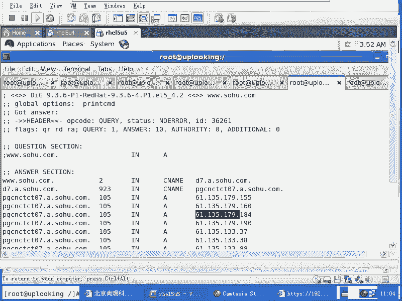
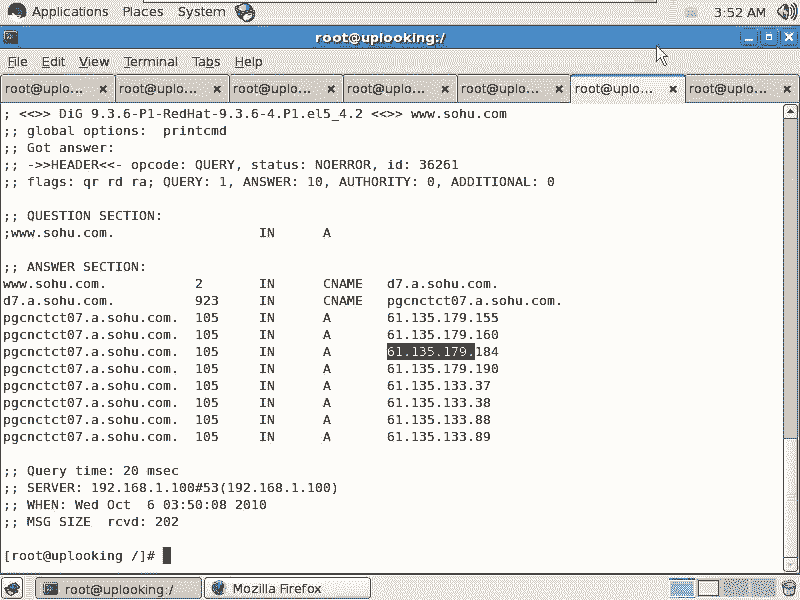
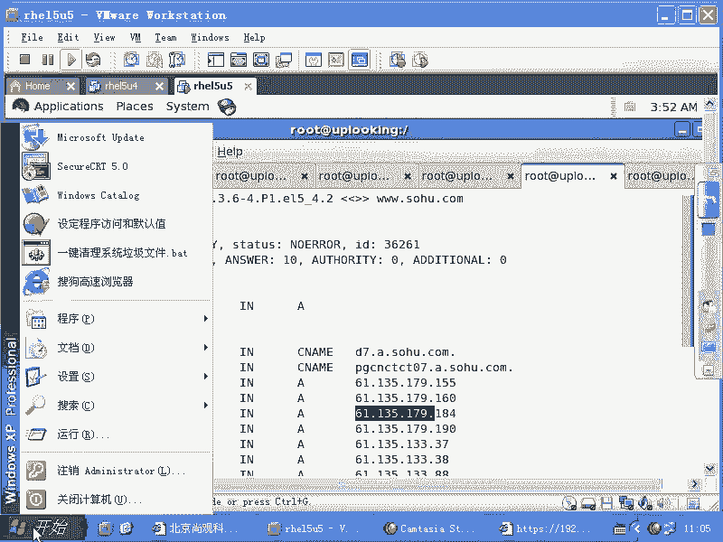
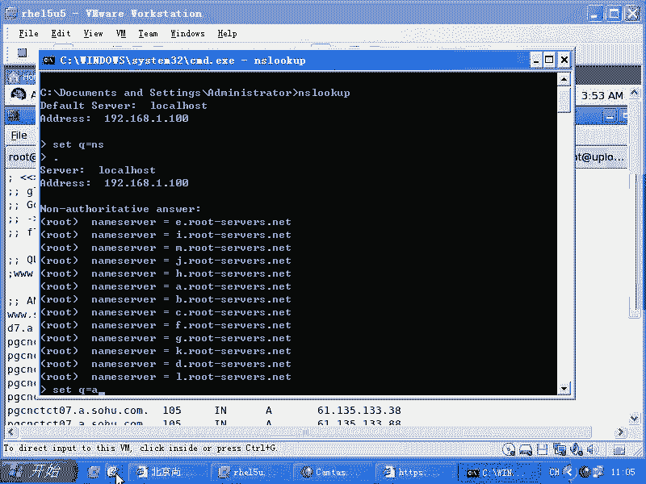
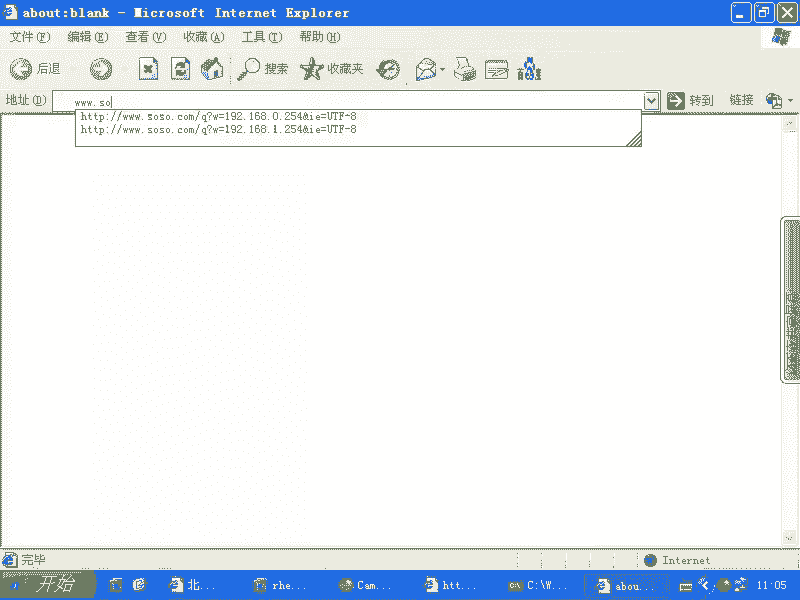
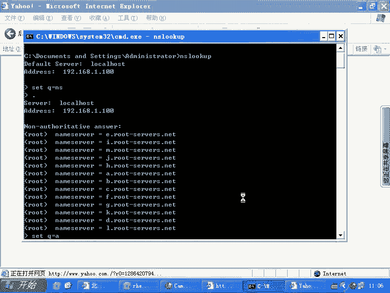
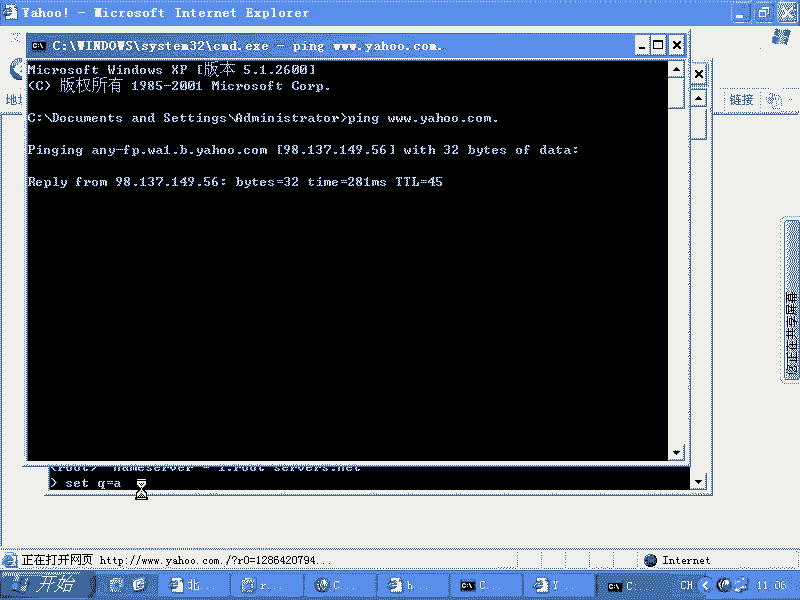
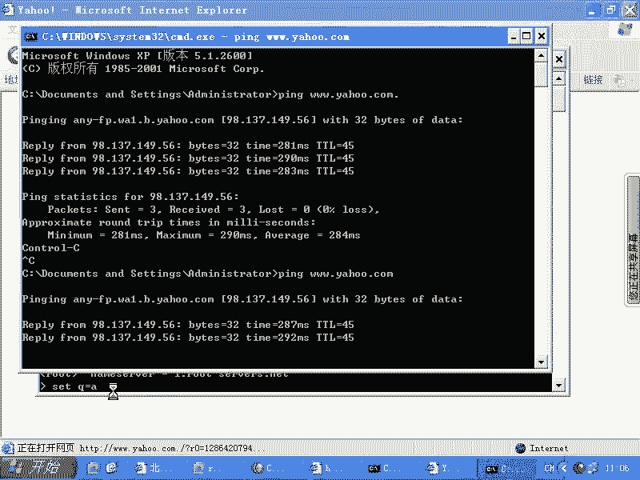
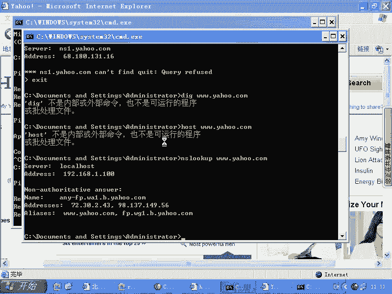

# 尚观Linux视频教程RHCE 精品课程 - P90：RH253-ULE116-9-3-windows-nslookup - 爱笑的程序狗 - BV1ax411o7VD

那我们还要跟大家说一点的话，就是说不只是linux是这样了，不只是linux会做递归了，windows是不是也会做递归啊？我们看一眼啊，一样的一样的windows。

Windows。NSlookup有没有这个命令？是吧然后这边负责解析点是吧，senceQ等于NS。然后我想解析的是点。点是吧，然后呢，我现在想去解析呃。Q啊s呃，我解析点，然后呢，我这样的s。

Q等于A啊，也就是实际上的话呢，我如果要是在我的这个windows下输入一个域名，是吧是？3W点搜狐点com，是不是它实际上是省略了一个什么？

省略的一个点是不是？能不能出来？牙虎点com一点。对吧。它实际上是省略了一个点啊，一样的。就是当我们去解析这个域名的时候，它后面的话呢就是省略了一个点。这个点的话呢呃就是我们的根啊就是我们的根。然后呢。

出不来啊，可能IE的话对他有点问题。我们习惯的话呢就是不加点啊我们习惯是不加点。其实的话呢这个点的话呢有没有的话，实际上都是你比方说我再去运行一下。

也是能解析出来，看到了吗？然后呢，你不加这个点一样的啊，都是个IP。所以的话呢我们这边你看我加这个点和不加这个点，它的这个都都是一样的记录。其实的话呢，你如果不加点操作系统会默认帮你加个点。

这就是所谓的DS的根，是不是我们输入一串域名的时候，最后都有个点。那这个点的话就是根就相当于我们索引所有的域名的时候的一个什么根本。

只不过我们去访问文文件夹的时候，我们刚在windows下访问的话，我们这样的然后S啊DRR是吧？我们去访问的是什么C冒号是么一杠是吧？C盘下的什么windows目录，对不对？这个根是谁啊？

C盘是不是C盘下windows目录当中的话呢，会有一个什么？会有一个。😊，System。是吧或者stem32，那也就是说。windows目录下有很多目录是吧？这个数形结构就是文件系统的根。

那么我们DNS的根的话是怎么样反过来的，是吧？先是什么？先是点，然后再是什么com，然后再是什么呢？然后再是雅虎，然后再是什么3W，它是反过来。😊，对不对？这个路径是反过来的啊。

那这个反过来的路径的话呢，它自动把最前面那个点隐藏了。隐藏了以后的话，我们当然也能通过什么，也能通过NS lookup来查询出反反过来查询出来。那么现在我是setQ等于NS表示我要查的是DNS记录。

我现在sQ等于什么A。然后我查询其中一个什么？😊，哎呀，我看。现在话我查询的是什么呢？其中一个是不是其中一个比方说I点root点server点mat点啊，实际上查询这个。Yeah。传出现在他告诉我说。

这台服务器，它的第呃它的这个IP地址是这个。那么现在我这样的，我输入ser，然后我切换到这个DS服务器上去。起哎。我切换到这个DS服务器上去。然后我这个时候我该问他什么，我该问他。Sight。

Q等于什么NS是不是我现在要查询什么come一点的DNS服务器的地址是吧？这样的，他告诉我，come一点是由这么多服务器组成的。那么这种AAA4个A的记录就表示的是什么？表示的是。IPV6是不是？

现在IPV6离我们越来越近了。现在我要查其中的1个DS服务器。那我这样的呃。server我要查这个地方。然后我去查查什么呢？假如说我要查他雅hoo是不是？然后呢，这边ser呃，我要查什么呢？雅hoo。

雅虎的DS服器的地址，然后会撤。那么雅虎的DS服务器地址的话是这些。然后再去serv啊。我说我想查这个哎。对吧那么。我到这个DS服务器啊，我去查什么呢？3W点雅ho点com一点，对不对？

这时候的话我查的记录就应该是A记录啊，但是NS记录里面默认没有，他就帮我把其他记录也显示出来。那么也就是说他我现在查询的是3W点雅虎点com，但是它是什么呢？这个东西的一个别名是吧？而这个东西的话呢。

它又是这个的话，一个别名。而这个记录的话呢，它的IP地址是什么呢？是这个所以最终的话我能查询出雅虎的IP地址。对吧这样的话就不是任何CDN的这种呃呃，就是不是不是那个它本身的这个相当于。

找的这个CDN的DNS器，我们可以看到它一串一串就下来，他自己本身去解析的啊，那这样的话，我找出这样的一个地址来。然后这个地址的话呢，就是真正雅虎的DNS服器的地址。

所以NNS lookup在我们的这个windows里面也是可以用的。那么QUID就退出哎。EXIT啊EXIT退出。ESIT退出了以后，你可以用什么这个。嗯。啊，这两个命令话都没有在linux上呃。

就是在那个windows下都没有，你可以用什么呢？NS look up3W点雅虎，我不知道这个支持不支它跟linux里面一样不一样，一样的啊，它是可以直接支持，是不是NS lookup。

你如果不想要交互模式，那你就可以直接NS look lookup，后面加上一个。啊，域名是不是这是windows的体结构。所以的呢我们不知道的情况下，在我们输入这样的一个域名的时候。

我们输入这样的一个任何的域名的时候，它实际上它就怎么样帮我们这做了整个的一个什么递归查询。

我们查询的是新浪呃，我们查询的是一个我们的网通DS服务器，但是那个网通DS服务器上并没有所有的数据是吧？并没有所有数据，它实际上要帮我们做递归的那常用的域名它会做缓存，他递归完一次以后。

第二个人再去找他做什么递归的时候，他就直接什么缓存在他自己的机箱，是不是？但是当第三个人访问第四个人访问第五个人访问的时候，他很快的话就可以给他做回应。他不用再去做递归的。明白了吧？

所以这个的话呢就是windows上的这个内容。O。