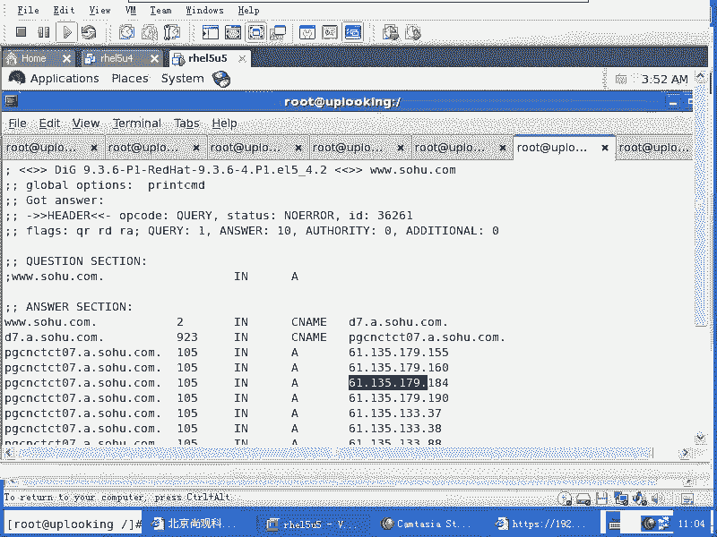
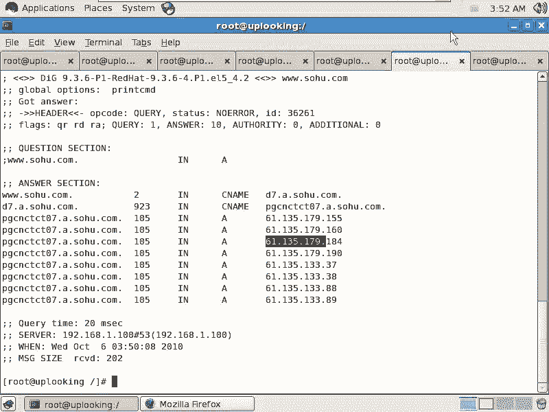
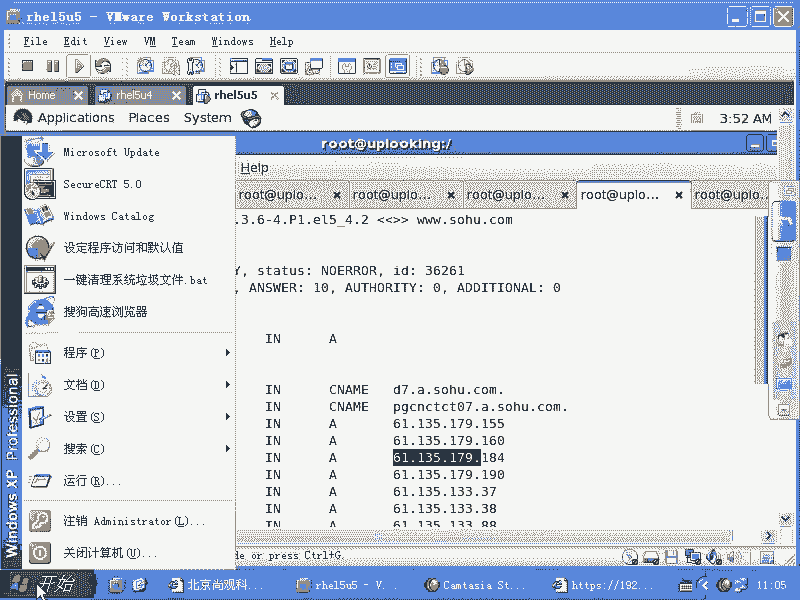
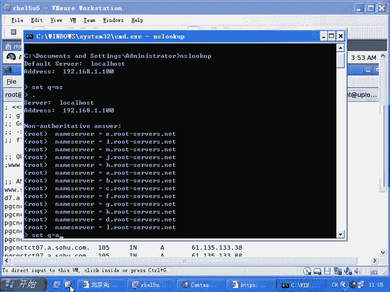
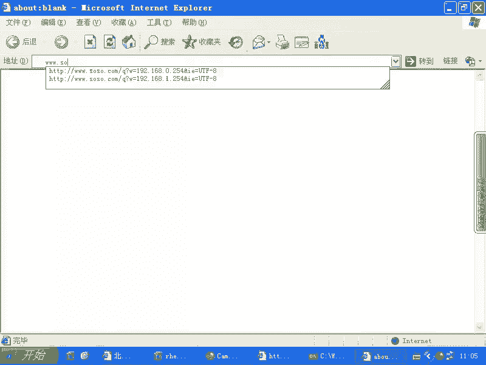
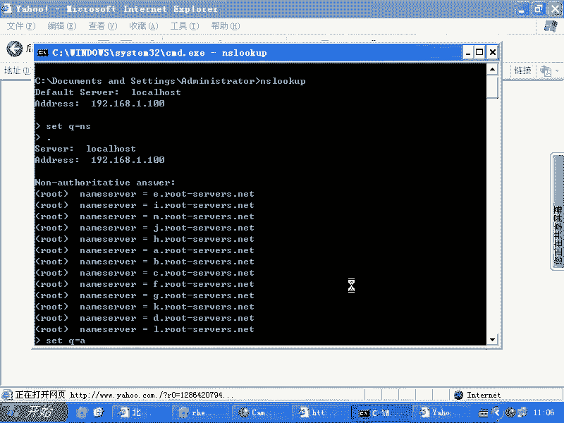
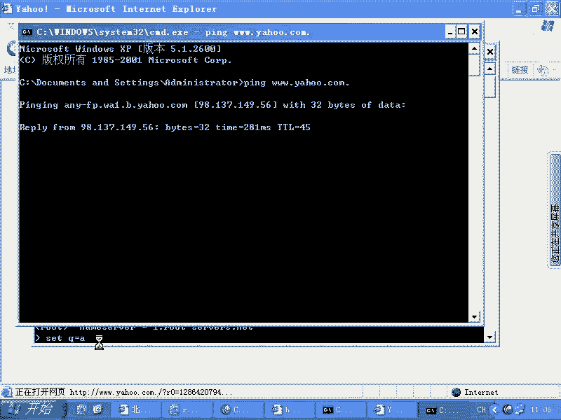
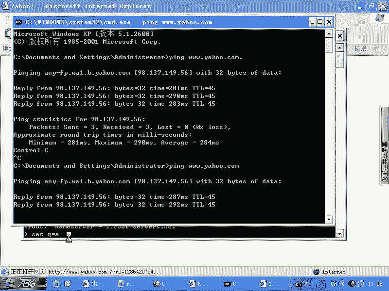
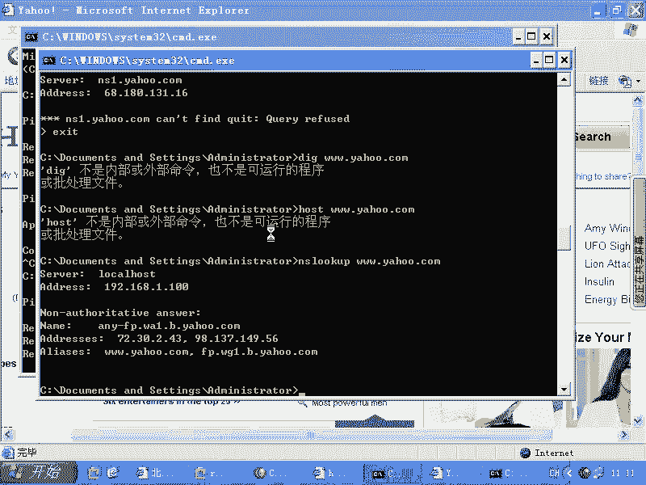

# 尚观Linux视频教程RHCE精品课程：P90：RH253-ULE116-9-3-windows-nslookup




在本节课中，我们将要学习如何在Windows操作系统上使用`nslookup`命令进行DNS查询，并理解其递归查询的工作原理。我们将通过实际操作演示，对比Linux与Windows在DNS查询上的异同，帮助初学者掌握这一网络诊断工具的核心用法。





## Windows中的nslookup命令

上一节我们介绍了Linux系统中的DNS递归查询，本节中我们来看看Windows系统是否也具备相同的功能。答案是肯定的，Windows系统同样可以进行DNS递归查询。



Windows系统中也包含`nslookup`命令。我们可以使用它来查询DNS记录。例如，我们可以设置查询类型为`NS`来查询名称服务器记录。



```
nslookup
> set q=ns
> .
```

当我们尝试解析一个域名，例如`www.sohu.com`时，实际上它省略了域名末尾的一个点（`.`）。这个点代表DNS的根。





## 理解DNS的根域

我们习惯在输入域名时不加点，但操作系统在解析时会默认为我们加上这个点。这个点就是DNS的根，它是所有域名查询的起点。



DNS的层级结构与文件系统路径相反。文件系统路径从根目录开始，例如`C:\Windows\System32`。而DNS的查询路径是从右向左的：先是根（`.`），然后是顶级域（如`com`），接着是二级域（如`sohu`），最后是主机名（如`www`）。

## 进行递归查询演示

现在，我们将使用`nslookup`在Windows上模拟一次完整的DNS递归查询过程。

以下是使用`nslookup`交互模式进行递归查询的步骤：

1.  首先，我们查询根域名服务器的记录。
    ```
    > set q=ns
    > .
    ```
    这会列出全球的根域名服务器。

2.  接着，我们选择其中一个根服务器（例如`a.root-servers.net`），并查询其IP地址。
    ```
    > set q=a
    > a.root-servers.net
    ```

3.  然后，我们切换到该根服务器，并向它查询`com.`域的权威名称服务器。
    ```
    > server a.root-servers.net
    > set q=ns
    > com.
    ```

4.  从返回的`com.`域服务器列表中，我们选择一个（例如`a.gtld-servers.net`），并切换到该服务器。
    ```
    > server a.gtld-servers.net
    ```

5.  接下来，我们向这个`com.`域服务器查询`yahoo.com.`域的权威名称服务器。
    ```
    > set q=ns
    > yahoo.com.
    ```

6.  再从返回的`yahoo.com.`域服务器中选择一个，并切换到该服务器。
    ```
    > server ns1.yahoo.com
    ```

7.  最后，我们向雅虎的权威DNS服务器查询`www.yahoo.com.`的A记录（IP地址）。
    ```
    > set q=a
    > www.yahoo.com.
    ```
    通过这一连串的查询，我们最终获得了`www.yahoo.com`的真实IP地址。这个过程展示了DNS解析器如何从根开始，一步步递归查询，最终找到目标域名的IP地址。

## 非交互模式与缓存机制

`nslookup`也支持非交互模式，可以直接在命令行中执行查询。



```
nslookup www.yahoo.com
```

当我们通过浏览器或任何应用程序访问一个域名时，操作系统或配置的DNS服务器（如ISP的服务器）就会在后台自动完成上述递归查询过程。常用的域名会被DNS服务器缓存起来。当第一个用户查询后，结果被缓存；后续其他用户再查询相同域名时，DNS服务器可以直接从缓存中快速返回结果，而无需再次进行完整的递归查询，这大大提高了查询效率。

本节课中我们一起学习了在Windows系统上使用`nslookup`命令进行DNS查询的方法。我们理解了域名末尾的根域（`.`）的含义，并通过实际操作演示了DNS递归查询的完整步骤，从根服务器一直查询到目标域名的权威服务器。同时，我们也了解了DNS缓存的机制，它如何提升日常域名解析的效率。掌握这些知识，有助于你更好地理解网络工作原理并进行基础网络故障诊断。