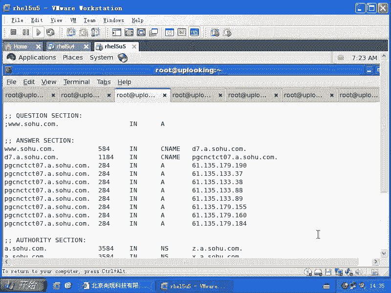
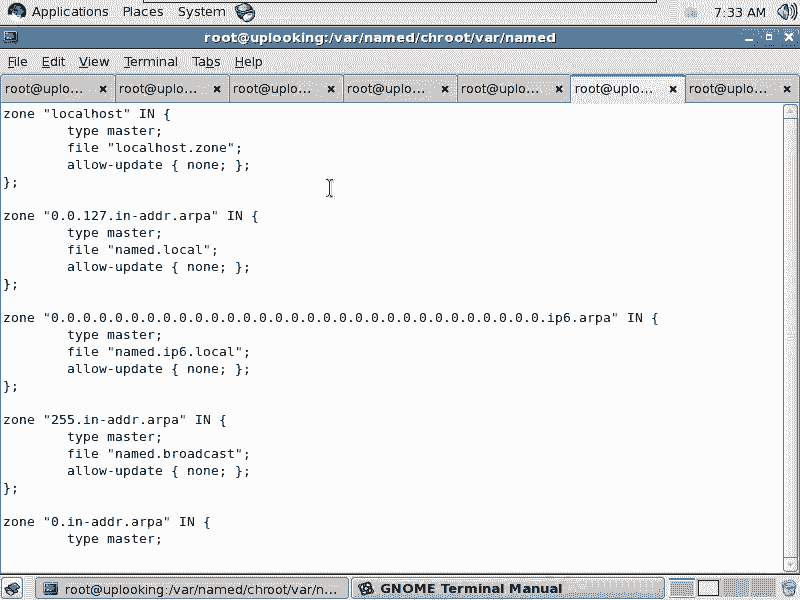
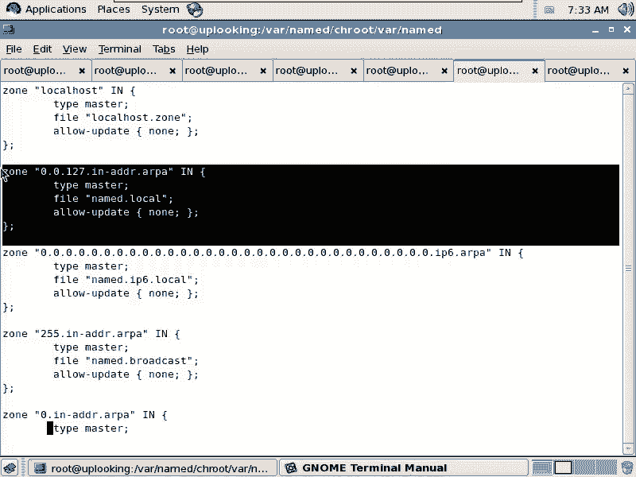
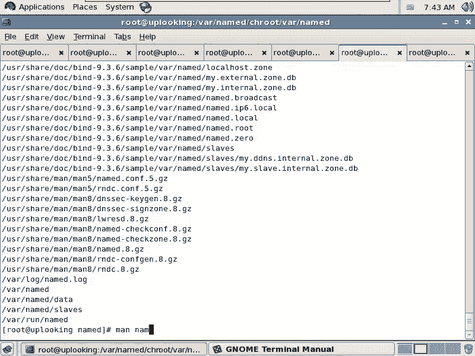
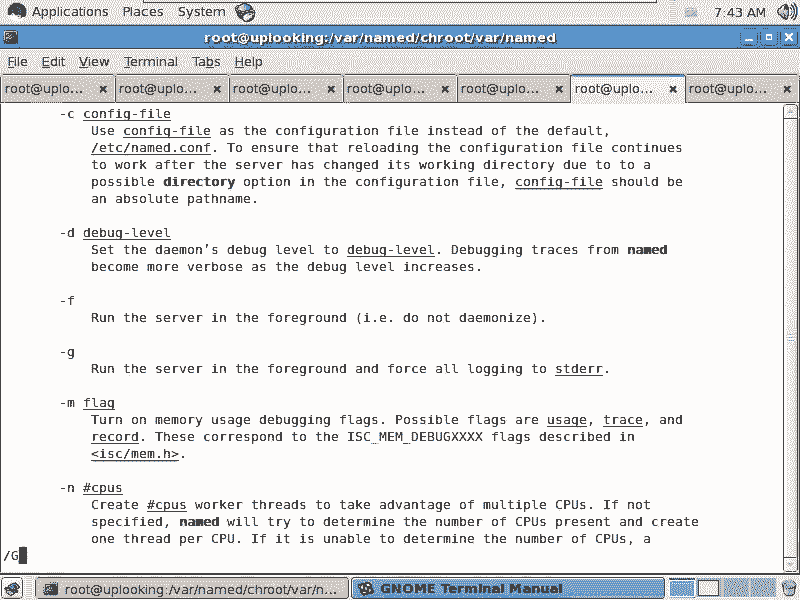
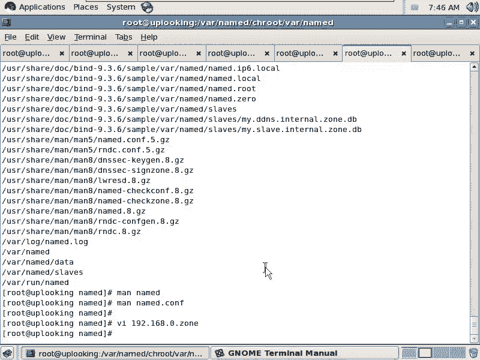

# 尚观Linux视频教程RHCE 精品课程 - P91：RH253-ULE116-9-6-bind-PTR - 爱笑的程序狗 - BV1ax411o7VD

好，我们继续的话呢给大家把呃就是把我们的这个两个东西啊，什么两个东西呢？就是把我们的两个呃name的两个应用再给大家讲一下，一个是反向解析啊，另外一个的话是把自己的玉什么呢？委托出去是吧？

相当于我下面的话有个子玉啊，它是怎么样做的？比方说我们现在看一下的话呢，就是说反向解析。我们那天的话给大家看过是吧？MTR3W点gogo点com是不是我们给大家看过哎看。

前面的这个机器的话呢，都是。都是就是国内的机器啊，你能明显看到什么呢？没有反向地址解析，是不是全都是IP是不是？也就是说这是我们在调试路由的时候，我们可能都需要什么呢？我们都需要这样的一个呃解释。

就是我们知道这个路由器是干嘛的？它需要把这个IP地址反向解析出来，是不是这样？我们总有应用是需要这样的东西，是不是？所以这个反向解析的。😊，反呃所以反向解析的话呢，它必然是什么？

必然是一些应用的时候所需要的。但是呢它不是必须的。所以我们通常很多很多公司的话就直接什么正向解析就完了。就比方说我们国内的很多公司看到了吗？对不对？他们就不解析，不解析的话也死不了是吧是？

也不想影响应用，那没有关系。所以这样的话，大家对他就不是特别的热衷，或者说不是特别的在意他啊。😊，那大家看到的这个画面的话呢，就是如果国外做的比较正规的话呢，它会出现很多，是不是那天咱们看到的更多。

是不是咱们可以看一下雅虎是不是？押虎。看一眼啊。所有的这个路由全都出来，你看后面的这些国外的路由器是不是都做了反向解析，这样的话，你也能看出它的这个路由器它到底是从哪到哪，是吧？它做了一个反向的域名。

这个域名的话呢。你比方说什么公司是sprint是吧？这个公司，它的路由器是不是它这边有个标号，所以这只是其中的一个应用。还有什么应用呢？当我们去访问一个网站的时候，那个网站说，哎。

我现在想就是想允许你访问或者想不想允许你访问，他可以通过域名来限定。比方说我是一个新浪点com的一个成员，是吧？我的服务器是新浪点com成员。然后呢，另外一个也是新浪点com。

只不过一个在北京一个在上海，他希望允许新浪点com上海的同事的服务器可以在我这边来同步数据，但是别的地方不允许，是不是我需要知道你的域名啊，因为你的IP可很可能来回变，对不对？

所以我要反向解析出你的域名来。这个时候的话呢。域名的话呢，也会做成一个呃身份认证的这样的一个方这样的一个作用。明白了吧？就是反向解析有这样的作用。但是反向解析的话呢，有一个大的问题，就是说你看这个问题。

我们3W点雅虎点com，是不是一点大家说最大的，就是我们说把它作为一个数的话，那么我说这个数的最大的地方就是容纳东西最多的地方是在后面还是在前面。😊，点肯定是根是吧？根树根所有的东西都是基于它生长的。

是不是？所以这个树根肯定是最大的，是不是？然后接下来的话分数差，那么其次大的应该是com点，是不是？然后其才是雅雅呃就是雅虎点com点啊，那么我们再输入一个域名，比方说呃211点1。2。3啊。

这样的一个域名。那我想问一下，大家这个域名的话呢，就是最大的就是我们感觉上最大的这个东西应该是在哪。😊，211是不是啊？也就是211。1。2。4是跟它在同一网段内是吧？2。5也应该在同一网段内。

是不是2。6也是在同个网段内。也就是说前面相同，后面不同是不同的个体，但是前面相同是相同的网段，对不对？所以网段当中最大的这个标号，实际上是在前面，它是不是两个刚好一个是从小往大，一个是从大往小。😊。

是不是？所以这样的话呢，我们必须得把它反过来啊，把它怎么样反过来呢？这样的。😡，我们现在的话呢不可能更改DNS的体系了。因为DNS体系它就是这么。😡，麻烦是不是？所以的话我们要怎么样呢？

我们要把它的这个域名的这个体系改过来。于是的话呢，你要想解析这个IP地址，那么你就要解改解析一个什么呢？就是说把它反过来3。2。1。211，是不是？那么你有没有见过这样的域名啊？😊。

你有没有见过这样的域名？没见过都见了什么点com点CN是不是之类的东西，对不对？哎，这个还没真见没真没见过，那是因为它是不符合什么我们一般的这个域名的这种规则是吧？那符合域名规则的话。

我们就把它放在一个什么呢？叫做一个叫做。😊，嗯。杠ADDR是吧，然后呢点下怕是吧？是吧放在这样的一个特殊的二级域当中，这个相当于C娜点com。明白吧？他把它放在一个什么呢？正常的域名空间当中去。😡。

明白了吗？把它放在一个正常的域名空间的，硬杠ADDR点uppart。😡，就是相当于sner点comc点com这个公司里面全都是什么IP地址，明白了吧？

也就相当于我们在正常的域名空间当中找出了一个什么保留的这样的一个东西。这个东西的话肯定没人用这么烂的域名谁用啊？😊，是不啊肯定没人用吧。于是的话呢，再把IP地址反过来放在这里面去。听楚了没有？

这就是我们所谓的什么呢？反向解析。所以它呢我们看一个例子啊，这个例子的话呢，系统当中就已经有了。😊，有的例子在这个地方。在哪儿呢？在这里面我们看一下有一个叫做呃嗯。VI是吧，VI。VI一提啊。点点。

てよ。ETC下面的内容的。RF1920。你看这里面的话呢，它定义了根啊，这边的话呢定义了根啊，这边的话定义了local domainlocal host还定义了127。0。1的这个解析，这是zo。

是不是？然后他这这边的话呢，是IPV6的解析。IPV6解析。这边的话呢，我们看一下127。0。1，它是怎么样去定义的。我们把这个zone的话呢给它复制过来。

对不对？不是这种复制过来。然后呢，我们在这里面的话呢去解析啊。

打开这个文件，这个文件里面的话呢，我们在view这个地方啊，我们在view这个地方，然后呢，我们看我们自己做一个zo。我们自己做一个肉。这个Zone的话呢是127。0。0这个网段，是不是？那是127。

0。1，是不是他就做反向解析了，是不是这种解析呢我现在的话想反向解析的不是127，那是什么呢？是192。😊，192点。168。0这个网段是不是这是个in杠ADD2帕唉。因为我想到的话呢。

我等一下还要我要复制一下啊，嗯先不管这么多了，这边类型master用到的文件的话呢叫做什么呢？叫做。啊。19218。0。0啊，这个网段是吧？点0。0这个网段就点0。Z吧啊，点0点Z然后不允许升级。

这个升级的话是跟DNS呃DHCP的话连用的，叫做动态DNS动态DNS的话，就是说我可以让我的DHCP服务器分配出去IP地址里以后，再把这台主机的IP地址和它的主机名再到我的DNS上什么进行动态的更新。

😊，明白吧？我们现在这个环境里面不是有很多student吗？😊，是吧你们的话呢自动获取IP地址，你们的IP地址假如说是什么呢？1。1的8。0。200，然后呢，这次0。200，下次0。100。

结果的话你的主机名是不是都是一个主机名？😊，那么我在分配给你IP地址的时候，我可以DHCP来我这边更新，明白吗？那这边的话呢就是说不允许更新，不允许更新的话。

就是任何人想去更新这个反向解析记录或者正向的时候，都是不允许的。清楚了吗？就是不允许进更新啊。我们这边的话呢先不管这个 update下面这个地方一个是文件名，一个是类型，是不是？

然后一个是zoone的名字。你看这个是不是跟s娜点com是差不多的呀。😊，这有区别吧。只不过样子怪一点，人家叫你这边叫做新浪，是不是人家叫做in杠ADDR是吧？你那边叫做come一点。

这边叫做什么怕一点，是不是？所以我这边的话呢，为了写的再好一点，那我这边要加了这个点，是不是我这个zo的名字的话，加了个点，这样的话我就认为它是个绝对路径，我符合我的规范是吧？少非错少犯错。😊。

保存命退出哎，我我这边的话只是更新了什么呃，这个网通的是不是网通的view。那么另外的vi的话呢，还必须更新，这是5YY。5YY，然后呢，我再到电信的这个地方去，然后再去怎么样粘贴。

那么这个zoone的话呢，也是同样的一个zoone啊，保存命令退出，同样的一个zo文件，这无所谓。因为的话呢，你反向解析都是可以的了，是吧？然后保存命令退出。然后这样的话呢，我我到这个目录下去啊。

刚才定义的这个目录下去，然后copycopy。我的。name点local是吧，我copy成192。168点。z是不是这个文件点0点Z是不是这个文件，然后呢，我去VI这个文件。

因为那个name的点local name的点local，它实际上就是我们的。就是那个例子啊，写的127。0。1的这个解析的例子。然后我再把这个文件打开。打开以后，你看这个前面的话呢。

是说你这个zoone谁是老大，这个zo谁是老大，跟那个原来是一模一样的。所以你这个地方的话，你也不用改谁是这个192。168。0这个网段的这个这个反向解析的这个zoone的老大呢？谁呀？😊，谁呀？啊。

谁呀？C那点com1点嘛，是不是你只要能把它解析成AA记录就完了。😡，对不对？你只要能把它解析为A记录就行了，是不是？如果你像保险一点的话，因为C到点com一点是不是解析成2个IP地址了？😊。

那么你讲保险一点，就是CNC是不是或者叫什么name么。NSE是吧，点C了点com对不对？他是这个zoone的老大，后面的话呢是跟什么呢？跟这个域的管理员的email。你说这个email的话呢。

哪有emailemail不是什么什么艾什么什么东西嘛？但是你记不记得艾是干什么用的？😊，是表示个zoone的名字，是不是？😡，那么我这边显然不能用at，所以的话我就用一个点来代替。那么假如说我是什么？

我是shark是吧，艾uplook点com的话。我如果是他这个这个域名的话，那我就怎么样把这个at at改成什么点，这就是我的email地址，明白吧？其他不变。那这边的NS记录是什么呢？这个NS记录是。

😊，NS1点。娜点com一点是不是只要你能解析出这个IP地址来，就OK这个时候啊隆重推出我们的新一代的什么反向解析记录，叫做PTRPTR就是反向解析。你看这个z的名字叫192点168点0。1。

它就变成了呃0。168。192点硬杠ADDR点怕是吧？那实际上你这个地方应该写着一的话，就是相当于什么一省略了点什么0。😊，168。192点。in呃，对ADDR点啊part。是不是？是不是这样的？

少了一个点吧，这儿是不是还少了个点？一定要注意啊，这是in记录PTR指向谁呢？如果要是这个一的话，那我指向什么呃，ser一点。C那点com是不是这样保存并退出。把它命推出，我们看成不成。Sos。

nameed。Re star。我们去re完以后看着OK是吧？但然实际上心里面还是惴惴不安的，是吧？然后我们看一下tailllwa的log当中的message，看一下最后面。

他说load这个master文件是不是commissiontion底带看到了没有？看到没有？所以我们现在怎么样检查一下这个文件LS啊，这个1求2这个文件，然后呢，杠LZ。

然后还有就是local host，是不是？哎，不是。叫什么name点local是吧？这两个文件它的权限一样不一样。有一点不同。哪不疼？对不对？你现在ad是没有权限的呀啊，不是现在ad什么权限都没有是吧？

意味着name是没有权限，是不是？所以我要把它的组改成什么？😡，这样的是不是然后呢再去什么？😊，re star。看到了，这就是典型的一应用，你看到都是OK的，是不是结果怎么样？😊，结果的话呢不OK。

我们再看当你看到什么呢？漏的序列号为什么什么的时候，你看到这边漏的序列号为什么什么说候是不是这说明什么？齐活了搞定了，是不是搞定了？于是的话我们知道哦，原来是这样啊，原来是这样原来这样。

那么这样的话呢才是正常的。然后我们这边输了一个什么host19218。0。1，是不是？😊，他的主。哦。对啊，我这边又犯了一个特别愚蠢的错误，是不是？是不是刚才那个地方少了个点。

sorry1点C那点看不最后少了个点是吧？他说自动帮我把这个域名架上去了。😊，恶心吧，然后我们看一眼啊。😊，开这文件，我果然是不是是不是果然啊？这边少一个点。是不是？这样保存命令退出。

然后呢再用RNDC什么reload。对吧reload完了以后然后再去怎么样？哎，正常了。是不是这样反向给吸收就做出来了，有没有问题啊？😊，没问题是吧？OK这就是我们的反向解析。

当我们的话呢一般啊如果要是你有规律的话，那这个地方的话，你可能还要用一些变量之类的东西啊，你可能还要用一些变量啊，这个变量的话呢，我记得在。慢。name。系。おなだないだ。记得有一个蛮配置。

算找不到就算了。就是呃。就是说我原来的话呢，因为我很久的话都没有去设置这样的一个连续的这样的1个DS服务器。它是这样的，就是当我们的话呢，对一个比方从一是吧，一直到255254是吧，要求21168。0。

1到1。2。254，我要创建254个记录的时候。那我一个一个来做。一个。一个一个，然后一个去改是吧？那么有一种方法的话，就是在zoom文件里面，在zoom文件里面的话呢，我们可以去VI这个zo文件。

啊在里面让它设法产生一个值啊。这个值的话我记得大致啊是这么写，但是可能会出错啊，可能会出错。大家那个就是自己搜一下啊，叫做GEN啊，好像就是说产生是用英文怎么说来着。😊。

什么什么jejet还是什么东西啊？什么产生啊一个值就是说这个值的话呢，比方说我是用什么and一来代替还是怎么样啊，还是用哪个编号来代替，是一至什么254啊，1至254，那么就是说把这个值的话呢。

把这个把这个数字的话呢，就是比方说产生这个数字，这个数字的话相当于一个给个变量。然后呢，我再边比方说比方说这个那么我接下来的话呢，我再怎么样，就是说百分号A是吧？然后呢是一个A类型的PTR啊。

PTR我忘了啊，然后呢是呃ser，然后呢再去加什么这个数字，明白吧？这样的方式就一条命令，它就生成200多条这个记录清楚没清楚啊。啊，他就是这样的，但是这个语法的话我记不清楚了啊，这个语法记不清楚了。

那么实在不行的话，大家就用笑编程来吧。是吧f I in什么1至254是吧，往里面去追加嘛，一条一条追加好了，写个笑条文往里面追加好是吧？但是这个东西的话就说。😊，我当时话是用过很多用过很多。

但是逐渐就忘了，就是用的少了以后就忘了。因为一旦配置好了以后，就懒得去碰它了。是这么回事儿。这个的话呢是说额外的一些这个设置啊。

