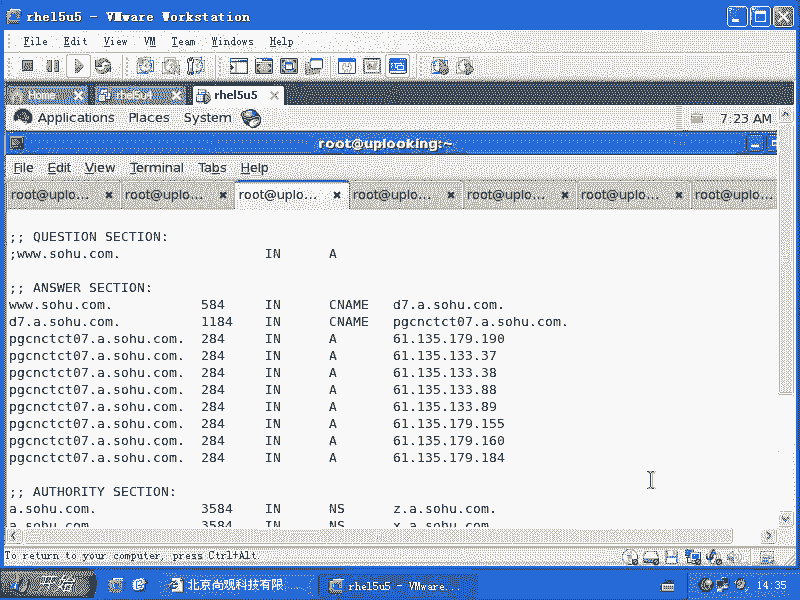
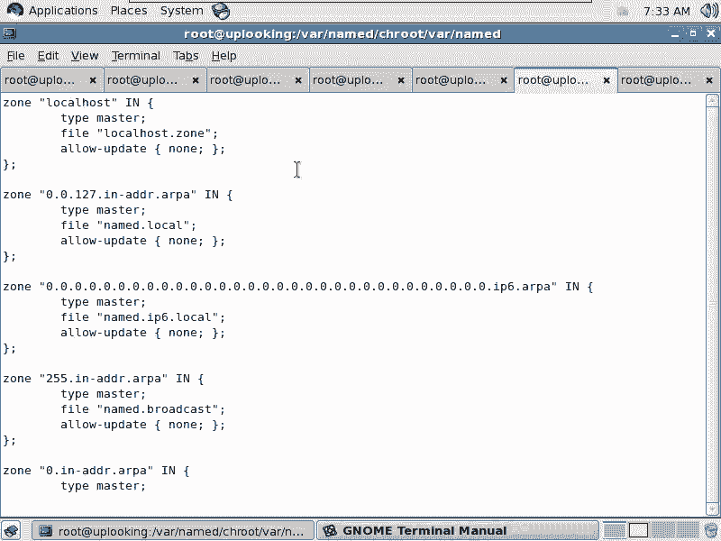
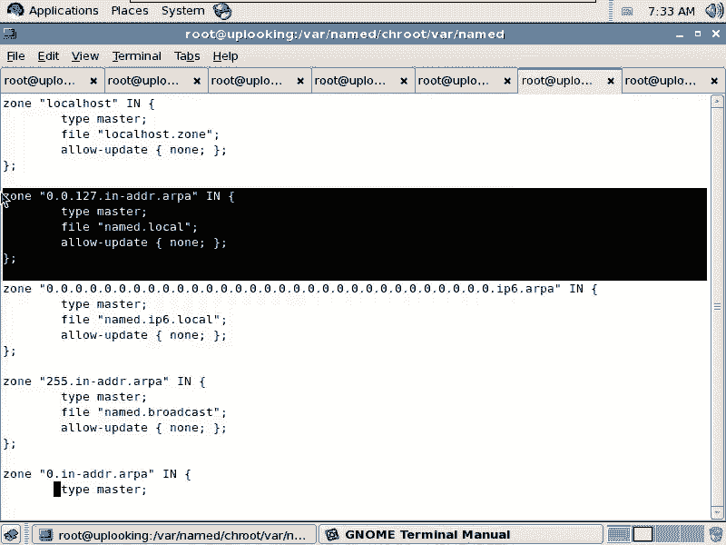
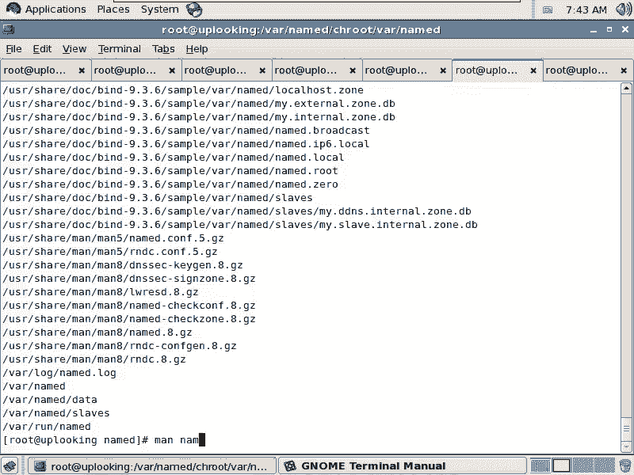
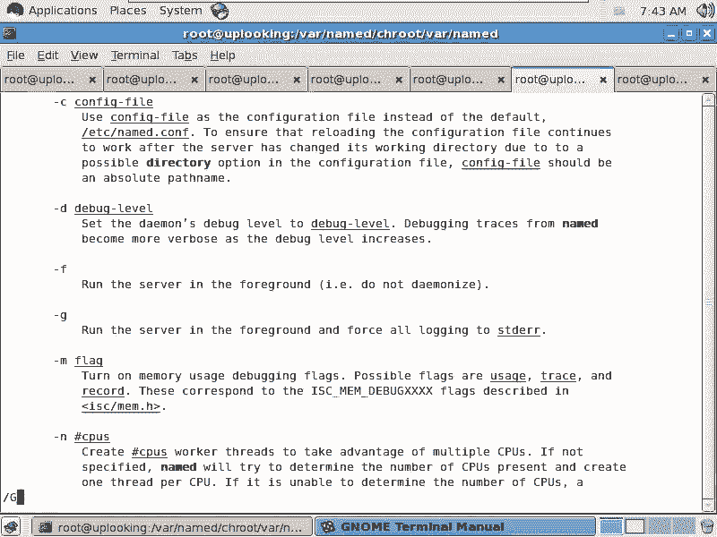
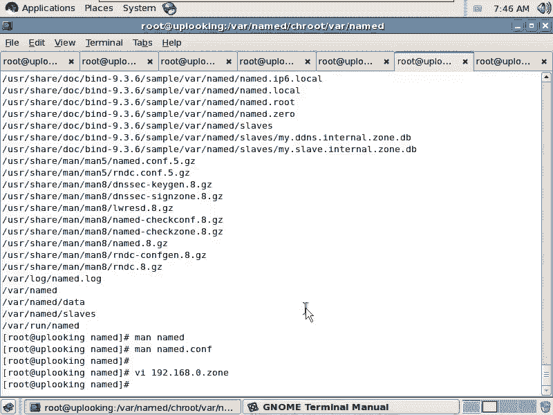

# 尚观Linux视频教程RHCE精品课程：P91：RH253-ULE116-9-6-bind-PTR





在本节课中，我们将要学习DNS服务的两个重要应用：反向解析（PTR记录）和子域委托。我们将从反向解析的原理和配置开始，了解其在实际网络中的应用场景和必要性。

上一节我们介绍了正向域名解析，本节中我们来看看反向解析。

## 反向解析的作用与原理

反向解析是将IP地址解析为域名的过程。它不是所有应用都必需的，但某些特定场景下非常重要。

以下是反向解析的两个主要应用场景：

1.  **网络诊断与路由追踪**：在进行路由追踪（如`traceroute`命令）时，如果路由器配置了反向解析，会显示其域名而非单纯的IP地址，便于网络管理员识别和诊断路径。例如，国外许多网络运营商的路由器都配置了反向解析。
2.  **基于域名的访问控制**：某些服务（如文件同步、数据库访问）可能希望只允许来自特定域名的客户端访问。由于客户端的IP地址可能动态变化，通过反向解析其IP得到域名，可以作为更稳定的身份验证依据。

然而，DNS的域名体系是**从右向左**层级递减（如 `www.yahoo.com.`），而IP地址是**从左向右**网络范围递减（如 `192.168.0.1`）。为了将IP地址纳入DNS的域名体系进行解析，必须对其进行特殊处理。

**解决方案是**：将IP地址**反向书写**，并放入一个专用的顶级域 `in-addr.arpa.` 中。例如，对于IP `192.168.0.1`：
*   先将其四段顺序反转：`1.0.168.192`
*   然后追加专用域：`1.0.168.192.in-addr.arpa.`

这个特殊的域名就对应了IP `192.168.0.1` 的反向解析记录。我们需要在DNS中为 `0.168.192.in-addr.arpa` 这个“域”（zone）配置PTR记录，来指明 `1` 这个“主机名”对应哪个域名。





## 配置反向解析区域

现在，我们开始动手配置一个反向解析区域。我们将以 `192.168.0.0/24` 网段为例。

首先，需要在主配置文件 `/etc/named.conf` 或你的视图（view）配置中，定义这个反向解析区域。

以下是定义反向区域的关键配置示例：
```bind
zone "0.168.192.in-addr.arpa." IN {
    type master;
    file "192.168.0.zone";
    allow-update { none; };
};
```
*   `zone “0.168.192.in-addr.arpa.”`：定义了要管理的反向区域名称。注意末尾的点号表示绝对域名。
*   `type master;`：表示此服务器是该区域的主服务器。
*   `file “192.168.0.zone”;`：指定区域数据文件的名称。
*   `allow-update { none; };`：禁止任何客户端动态更新此区域的记录，确保安全。

你需要根据你的网络结构（例如，是否区分“电信”、“网通”视图），在相应的 `view` 配置段中添加这个 `zone` 定义。

## 创建反向区域数据文件

定义好区域后，需要创建对应的区域数据文件。我们可以复制系统自带的本地回环地址反向解析文件作为模板。

以下是创建和编辑区域数据文件的步骤：
1.  进入区域文件目录（如 `/var/named/`）。
2.  复制模板文件：`cp named.localhost 192.168.0.zone`
3.  编辑新文件：`vi 192.168.0.zone`

区域数据文件内容如下：
```bind
$TTL 1D
@       IN SOA  ns1.sina.com. admin.sina.com. (
                                        2024032001      ; serial
                                        1H              ; refresh
                                        15M             ; retry
                                        1W              ; expire
                                        3H )            ; minimum
        IN NS   ns1.sina.com.
1       IN PTR  server1.sina.com.
```
*   `@`：代表当前区域，即 `0.168.192.in-addr.arpa.`。
*   `IN SOA ns1.sina.com. admin.sina.com. (...)`：起始授权记录。`ns1.sina.com.` 是该区域的主DNS服务器。注意管理员邮箱 `admin.sina.com.` 中的 `@` 被替换成了点 `.`。
*   `IN NS ns1.sina.com.`：指定该区域的权威DNS服务器。
*   `1 IN PTR server1.sina.com.`：这是核心的**PTR记录**。它表示IP地址 `192.168.0.1` 反向解析为域名 `server1.sina.com.`。**务必注意域名末尾的点号**。

## 设置权限并测试

BIND服务对区域数据文件的权限有严格要求，文件属组应为 `named`，并且组有读取权限。

以下是权限设置与测试命令：
```bash
# 更改文件属组和权限
chgrp named /var/named/192.168.0.zone
chmod 640 /var/named/192.168.0.zone

# 重新加载BIND配置或重启服务
systemctl reload named
# 或 rndc reload



# 使用host命令测试反向解析
host 192.168.0.1
# 预期输出：1.0.168.192.in-addr.arpa domain name pointer server1.sina.com.
```
如果测试成功，说明反向解析配置正确。



## 关于批量添加PTR记录

如果需要为整个网段（如 `192.168.0.1` 到 `192.168.0.254`）批量添加PTR记录，手动编辑非常繁琐。

以下是两种可行的批量处理方法：
1.  **使用BIND内置的生成指令**：在区域数据文件中可以使用特定的指令（如 `$GENERATE`）来生成一系列记录。但语法需要查阅官方文档。
2.  **使用Shell脚本**：编写一个简单的Shell循环脚本，向区域文件中追加多条PTR记录。这种方法更直观通用。
    ```bash
    for i in {1..254}; do
        echo "$i   IN PTR   host$i.sina.com." >> /var/named/192.168.0.zone
    done
    ```
    之后记得更新SOA记录中的序列号（Serial），并重新加载配置。



本节课中我们一起学习了DNS反向解析（PTR记录）的原理、应用场景和详细配置步骤。我们了解到反向解析通过特殊的 `in-addr.arpa.` 域将IP地址映射回域名，并掌握了如何定义反向区域、编写PTR记录以及进行测试。虽然反向解析并非必需，但在规范的网络管理和特定应用需求下，它是完善DNS服务的重要组成部分。