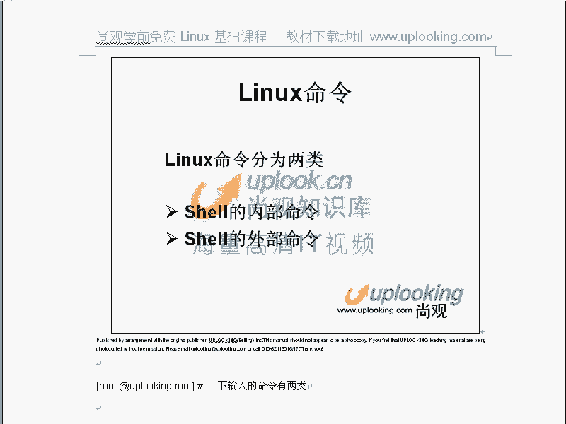
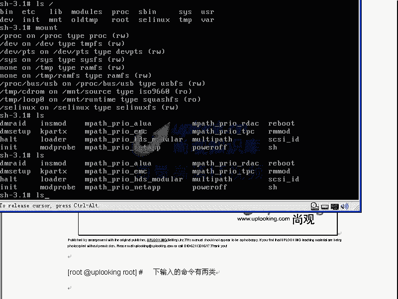
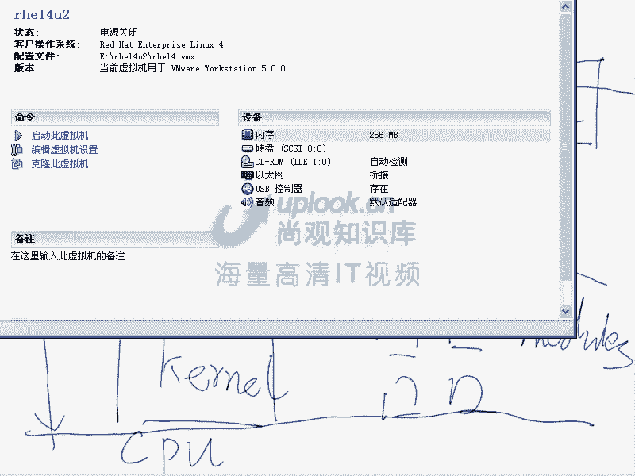
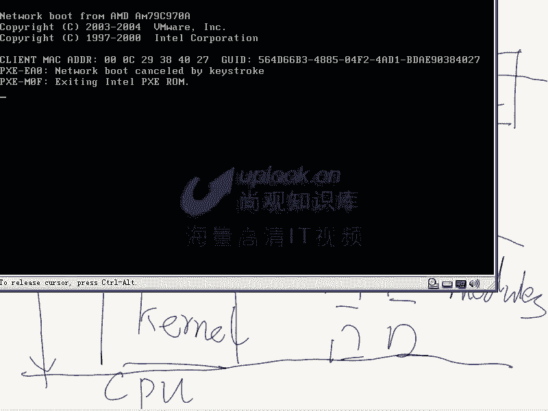
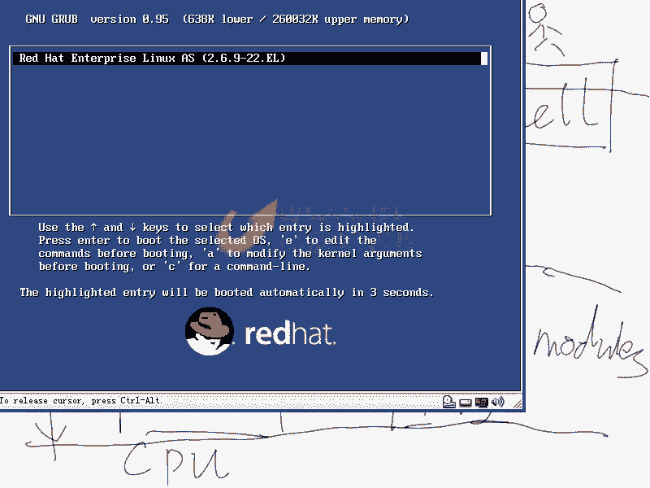
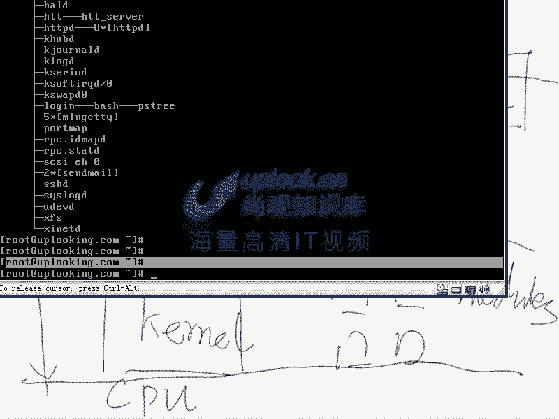
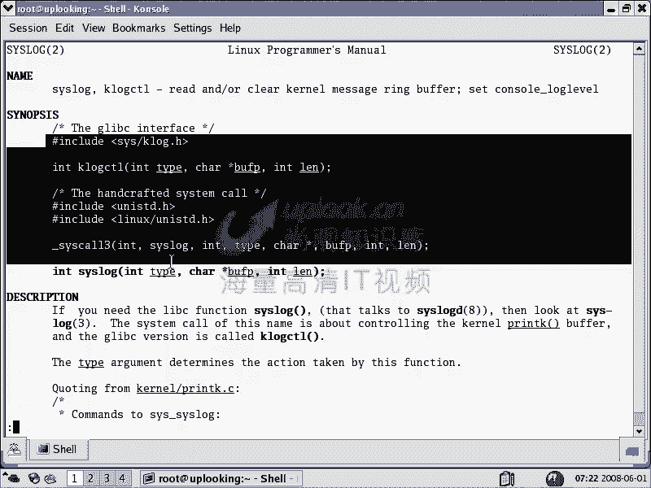
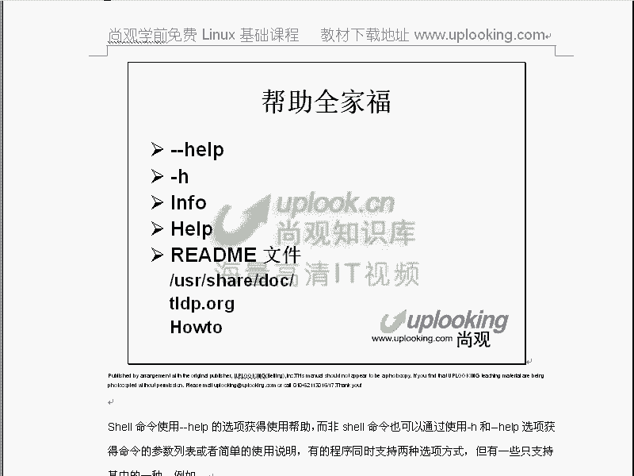

# 尚观Linux视频教程RHCE 精品课程 - P9：RH033-ULE112-03-1-Linux下寻求帮助 - 爱笑的程序狗 - BV1ax411o7VD

小芳，我们呢来看一下linux的就是步入正轨以后啊，装完了以后，然后给大家一个大框是吧？知道lininux的话，哪些层次 kernelel啊mods啊，还什么酷ol啊， shellll等等。

然后给大家讲完了一个安装过程。那现在我们该使用了是吧？对，OK小方的话是呃我们上方的同事啊，就是我们两个的话呢，一块给大家来讲解。那么你知道linux的命运的话，实质上是分成两种。

就是说在windows里面的话，大家可能都习惯了什么双击某一个地方，对，对吧？然后运行它等等。但是实质上呢这样的方式在linux里面肯定可以了。但是一般来说linux里面在呃操作的时候。

它一般都是那种文本的界面。那么命令行的界面，对，对不对？就像我们现在这样的啊，就是我们刚才这样的一个呃界面。那么在这里面的话，这就是一个典型的命令行，这是一个典型的命令行，嗯，对吧？

那么像这样这样的界面的话呢，它本身是一个呃就是说。

比较抽象，你要理解它的话，要理解很多。当然你知道的windows它是一个什么东西，它是一个非常注重呃图形界面，然后让你呢很形象的可以理解。所以你双击的一个过程，就跟你在这边执行它是一样的。明白吧？

双击一个图标的话，实际上是执行那个执行的一个东西。那么在lindows里面的话，你可能执行的命令的话，就直接这样执行就完事儿了。但是呢在windows里面可能是双通过双击来实现。

那么windows里面的这个命令啊呃主要呢是有两种类型的，一种呢是。

内部命令，一种是外部命令。我们在整个的讲授过程当中。大家呢要知道学习的实际上学习的是什么呢？是linux里面的shall的使用。也就是说我们实际上是生活在shall当中，还记不得我给大家画那个图。

你看我重新来一遍嗯。我们呢知道呃一般来说呃一般来说我们现在的话这个系统。你接触到了以后，你知道呢在这里面比方说。我原来给大家说过的，在下层的话是一个科，是不是？对。对吧然后呢，在上面的话有很多模块嘛嗯。

这边的话有很多模块，那这些科呢和模块啊，这些科蚪和模块实质上呢都不是我们直接能操作的。但是它最上面的话是不是有很多API。对API不是应用程序接口嘛，嗯，对吧？那么这样的API然后呢，在这边对上的话呢。

是有一些呃就相当于我提供给你的功能供你去调用。那它有很多程序了，比方LS是不是典型的一个程序，我们刚才执行的LS是不是典型程序。对，那么还有一些库LS的话可能会调用一些库。比如说LIBC点SO这种库啊。

那么G lab C它前面加个GG表示GU的库。那么有很多程序的话呢，它去调用这个G lab C的这种库，这种库提供给它的功能。然后这个库的话呢，又把命名下到API这个层次上，对吧？

那么还有呢直接它可以调用CPU的一些东西。那么如果要是有另外一些程序的话呢，这些程序是点com的，就windows下不是有那种点com的程序嘛。对，这种点com的程序，它是跳过这个呃就是说这个操作系统。

它直接把它自己的代码给谁啊，CPU明白吧？明白啊，所以他还有这种程序。那么在linux里面的话呢，它有一种程序是什么程序呢？叫做shall。shall这种程序的话是供人去交流的。

一个人他呢跟shall去下命令，你想去给给API下命令，很头疼呢，你要执行一个最简单的功能，都要发花费很大的精力。所以的话你给shall去下下指令。那么shall的话，帮你调用各种各样的库。

或者直接给API的话去下命令。那这样的话呢，实际上 shellll在跟人进行交流，明白吗？明白，那么这个shall的话，实际上是构筑在什么。构筑在整个计算机系统外面的一层壳啊，人的话是不和一个人类是吧？

这个人类的话想直接调到API这实际上是办不到的。明白我的意思吗？明白啊，OK那么在这样的背景下，我们知道 shell要是一种什么东西。那么系统当中的话，实际上是有很多种需要。OK我先的话呢。

先把这个系统话呢，先停掉。然后呢再运行起来，给大家呢去启动起来一个最最简单的就是说把那个正常的这个系统化呢启动起来。

那么sha的话呢是一种程序，这是H14啊这H14。实际上呢对于我们的这个普通的要学习的人来说，不管你学什么系统，关键是学的什么样，怎么样了，是吧？我们原来的几节课的话都跟大家说过。

所以他不管是什么系统都是差不多的。你只要学的比较深，触类旁通嘛，尤其学的个词话有这种好处，学过nose就不是了，学nose越越越学越。

你学的东西都是别人封装好的东西啊。都是顺传好的东西，那真的是比较傻。因为的话呢这些东西别人的话并没有呃，就说你自己并没有深入的理解，是别人给你做出来的。一个壳子，而lininux的话是个非常原始的东西。

所以的话呢学什么东西关键是学的怎么样。那是windows你要学的很深的话，那也很厉害。是吧。嗯，OK现在的话到了我们这样的一个基面下，然后我进去。然后呢，这就是一个项。

那么我现在给大家看一下PSPSTPST的话是什么呢？是一个运行，就是把所有的进程显示出来这样东西。那我当前呢是在哪呢？我想的GRAP。PS3。我看一下啊PS去吧，直接回去。那么我现在在运行PS去嘛。

我现在在运行PSTe。在这儿看到了吗？这个地方看到了吗？嗯，我是在哪儿运行的？ba shell下可以运行的，看到了吗？对，也就是我运行的这个进程，也就是这个程序，它实际上是另外一个程序的子进程。

是在卑 shell下运行的吗？Ael是不是刚才我输入完用户名密码以后打开的对对吧？这边是能看得清楚。OK现在的话我们再看，所以呢你现在看到这个界面，就是我们看到这个提示服是谁提供的呢？Ael提供的。

所以很多人呢都在说啊，我学linux呢，linux实际上不是在学linux，而是学linux里面的一个 shellll的使用。能理解不理解，明白，因为你做的做的所有操作都是都在这里面。

对，对吧？那我们再看另外一种情况，假如说我在这里面输入了一个命令，3X启动了X window啊，把X window启动起来。

OX启动起来了是吧？那么我在这里面是不是也可以打开一个试啊，可以啊。退啊。

在在X window里面，我们通过双击的命令的方式的话，去启动一个启动一个程序的是吧？然后你比方说看现在，那么在这里面的话，我这边运行什么呢run command，我可以输入一个什么呢conl。啊。

错了，看看怎么可以开头的。这是一个命令。这个命令运行完了以后呢，它是一个。是要看到了吗？嗯。PS。Tre可不可以啊？哎，PSTREE是吧。PSTe看到了吗？我现在是不是在输入PSTe？

那我们看一下PS区在哪。有。这边啊。大家看我现在是不是PSH是不是也是在非 shell当中？对，因为的话你看到这个界面。熟悉不熟悉？嗯，所以的话呢我们回到这个图上来看。回到这个图上来看。

你运行不管运行什么程序，运行一类程序的时候，就是这个程序的时候。这种程序一运行就是给人提供一个交互的接口。这个接口的话是命令行方式，嗯，对不对？对，那么如果要是你像熟喜欢windows。

你喜欢windows吧？windows里面那种界面，现在的话这样的啊看。我在这里面双击这个图标，双击这个图标，双击这个图标，这是我windows方式吧。对，这是什么方式啊？这是GUI方式。

就是图形的用户接口啊，就是图形的用户接口方式。那么这边不是有我们熟悉的类似开始菜单这种东西吗？这都是图形的接口啊，那么我们在linux里面只不过是怎么样？都是这种方式的运行。实际上他们是相通的，明白吗？

明白啊？OK那么我们在学linux词的时候，很多人都说啊这个命令是怎么样的？我都觉得不太不太容易掌握啊等等。那只不过是你不熟悉这种操作方式而已，实际上道理都是相通的。那么现在呢我们来看这里面的命令。

我们说这里面命令我们已经用过很多L命令用了吧。嗯然后呢还有我们的这个然后touch命令创建一个文件等等。那这些命令的话，实际上是分成两类，一类是什么呢？一类是内部命令另另一类是什么呢？

外部命令什么内部命令呢，什么是 shell的内部命令啊。在说那个之前的呢，我们先看这个吧，并下的新点S呃新SH我们刚才是不是说有一种程序叫做shall？对 BASH是不是其中的一种？

嗯BA是SH是其中的一种吧？对啊，那么系统当中还没有没有其他 shell要呢？你这样一回车，你可以看到有很多 shell是吧？BASH是其中的一种，看到了吗？嗯只是其中一种。

还有其他很多很是不是那么我们说 shell的话是其中一种，然后呢ba shell的使用。那么我们现在介绍的是重点其他 shell的话跟它大同小异，但是ba shell是比较好用的一种，听了？嗯。

那我们现在这个界面下的话呢，做的各种各样的操作，做的各种各样的操作实质上是在在我们的一个human是吧？一个人类是在跟一个小程序在打交道，这个程序的话叫做ba shell明白吧？

明白那么它是这种习惯是不是有其他的 shell是其他种习惯。你看我现在输入一个C项，是不是就是C项的习惯，这是C项。嗯，如果输入K项。KSH是不是这样的习惯，对它的控制它的这个字符就不一样了，是不是？

嗯它的这个提示符就不一样了。ESIT退出那个 shell在EXIT退出C shell啊，那么这个时候呢我们打开的是不同的 shell，那么提供的是不同习惯的这种操作方式。

然后呢现在我们看 shell的话，不管哪种 shell。这种 shell要的话呢，提供本身提供一些命令，这些命令的话是相当于什么呢？就是内部命令是什么？和外部命令是什么呢？比方说我们现在看啊。

你比方说我们现在的话，人类是不是在跟世要打交道？一个人。在跟笑打交道，是不是？对。这个hell呢它提供给你几个功能。比方说他提供给你一个什么呢e这样的一个命令，你是不是可以直接定定，就是调到ic啊。

但你直接去访问什么呢？访问LS命令时候，你是不是LS shellll是不是不提供给你这个功能 shellll没有LS功能的命令是吧？对啊，那么这个时候呢这个LS呢，它就绕过hell就是hell的话。

帮你去调动，调到什么地方呢？并且的。LS也就是外部命令的话，实际上就不是在sha要内部的，是shall之外的一个命令，明白吧？明白，那如果要是你执行的这个e命令，这个e命令默认情况下是什么样的？

它是需要内部的一个命令，明白吧？明白它是需要内部命令。所以这种命令的话，就是内部提供的，这就是呃一个这就是一个什么内部命令。那么如果sha要之外的这种有独立文件的，就是外部命令，明白吧？

那么现在我们看执行它的时候是这样执行，然后呢。我们执行它的时候是这样执行。然后呢，我们看那么假如说呃现在回过头来看，然后呢，你在这里面在这里面。

那么我执行一个echo hello是不是这个命令它就执行了。嗯，那么现在呢我去就是实际上echo这个命令的话呢，它是个内部命令是吧？它还有外部命令，也就是在这个地方。他还有个爱口战你。

那么我把这个命令的话删除掉，然后RM或者我们的移动啊，把并下的ele这个命令移动成什么呢？并下的呃KAK这样的一个命令是吧？ele这个命令应该没有了吧。对，那么我现在执行ele hell。

还是可以执行的。对，为什么他有个内部命令？对他有内部命令，就是说现在执行的内部，那么所有的内部命令都可以用help命令来进行查询它的的运行方法。你比方说help echo echo是内部命令吧。对。

那直接回成他告诉你echo这个命令的话，可以执行什么什么命令，执行什么什么操作，明白吧？明白，如果要是呢我这样的，就是help。LS里面可不可以啊，可以可以吗？因为LS它是外部命。明白吧？

也就是说我刚才呢是这样的，就是明明把并下的echo改名了是吧？ele这个不存在了，当然我还可以执行呢，为什么呢？因为我们平时调用的根本就不是这个内部命令，实际上是呃根本就不是这个外部命令。

而是一个内部命令是吧？现在这个命令是不是已经没有了？现在名叫KK的是吧？对我要执行他就这样执行就好了。你比方说KKhello，他也可以去执行。明白吗？明白我现在把它改成改回来啊，并且的TK。

然后改名成并写的icle，对吧？改回来了，那我可以执行什么呢？并且的icle hell。啊，这样的话可以继续打，对吧？对。好，我们现在呢给大家解释了一下内部命令和外部命令。

内部命令就是sll本身提供的功能。而外部命令的话是shall不提供，但是sha要会帮你去调用。你比方说LS命令，你直接执行LSLS这个命令是shall提供的吗？不是啊，它实际上是在这个命令地方。

并且的LS是不是有这样一个文件。那么这个时候呢我去把并且的LS这个文件给它改名叫做什么呢？并且的LLS改改了吧？对，然后我现在执行它会怎么样？你发现吗？他就出错啊。

对他是不是说no such file directory就是没有这个文件了是吧？没有这个文件了，他当然执行不了了，就这样一个情况。明白吗？明白，现在外部命令你清楚了，没有这个外部文件。

那他自然这个命令就执行不了了，这就是所谓的外部命令，对不对？那我现在不得不怎么样把它。改名改回来对吧？对你改回来。那OK现在我们看那为什么要你说老师你嘚啵嘚不嘚不太烦了啊，真的是太烦了。

我我也觉得自己烦。你说嘚不嘚这么长时间你讲这到底干什么，我就跟大家掰扯清楚什么东西啊，你到底执行的这些东西到底是个什么，在哪儿给你提供的，要不然的话，你还是稀里糊涂是吧？现在给大家说明这些东西以后。

我们首先就来一个什么呢寻求帮助的方法，内部命令寻求帮助和外部命令寻求帮助，他说不一样，内部命令寻求帮助的话，我刚才是不是知道一个命令啊，叫什么 help是吧？对。

HELP然后加上一个内部命令标ele是不是可以直接直接出来了？那么help。LS有吗？没有。出错是吧？所以的话内部命令可以通过help命令。那么外部命令的话，你可以直接执行一个什么LS。

然后加上一个什么杠杆hel能看一个简单的什么帮助。那么这种方法的话呢，就是寻求外部命令在寻求帮助的时候，最简单的一个方法，杠杆help可以出来一个简表告诉你怎么用这个命令，明白吗？明白。

那么如果要是不行的话呢，你还可以去得到的东西太少，你还可以man LSman配是。man page是寻求帮助，在linux下寻求帮助的最简单的方法。就说呢最常用的方法。

那么我们说man page是我们在讲命令，什么命令还没讲呢，就讲了一个什么man就开始讲了是吧？为什么要先讲他呢？因为老师想寿命长一点，为什么这样说呢？因为那些学员啊，他总是在问说什么？总是在问说啊。

你老师这个参数干什么？老师那个参数干什么？我们可以说啊很负责任的说，全世界没有一个人能把linux下面所有命令的所有参数记住。绝对没有一个人。所以他一般的所谓的高手是什么呢？他首先知道有这个命运。

他知道怎么用吗？不一定，他非常快的能寻求到这个帮助的方法。他用这个帮助的话，可以很快找到这个命令该怎么用。这就是这个高手。所谓的高手。所以的话呢你看很多的这种呃各位高手，你问他这个东西。

他可能也未必知道。但是他会告诉你，他说你查一下这个帮助。那么如果要是你连M page都不不能查，那么你永远都学不会linux，可以说你现在学会了一个月之后，你就忘掉啊，一个月之后又重新查了一遍又记住了。

结果呢三个月之后又忘掉了。啊，结果你一段时间没有用一年之后你你又忘掉，所以他永远不可能呢会这些东西，所以呢我们说讲一切命令之前，我们先讲的是帮助，这个帮助是最重要的，明白了吧？明白？啊。

O我们现在先翻翻PPT啊，把PPT翻一下。那么这个内部命令和命呃就说内部命令和外部命令的区别的话呢，先讲一下。然后呢，我们首先讲的是一个man配men配置这个命令的话非常重要。

他呢是在我们整个讲命令之前第一个命令，为什么呢？因为高手就是寻求帮助比较快的人，大家一定要记住，所以的话我们很多同学说什么，你让老子自己去寻求帮助的，我们有这样的同学，你让老子自己去做。

然后呢你也好意思，我来这边学习就是想问你，那么实际上老师是一番好意，他什么好意呢？他就说ok你要自己去找这个帮助，这个帮助是怎么怎么来的。那么他呢是一番好意。

但是如果要是你不你去你不不就是不认为他是好意，觉得他是在推脱，那我也没有办法，我觉得呢如果你认认识任何一个所谓的lin高手，那么你会知道你问问他，你说men配置重要不重要。那你的命令。都能记住。

那么多参数你能记住，我我可以很负责任的说，世际上没有一个人记得住le里面所有命令的所有参数。完我自己的话可能记住10分之1就不错了啊，这是这样的情况。所以它慢LS大家首先会。

那么大家仔细看一下man加上一个命令，就可以呢去把这个呃这个命令的帮助取出来，这样直接回车。对吧然后呢就可以找到他的帮帮助，仔细看这个帮助。它LS这个地方的话，它后面有个括号一是吧？

这个表示呢这个帮助的类型为一。男配置有很多种帮助的，明白吗？明白，你你你知道还有哪几种？你不知道，但是你可能以前man不就man是吧？怎么还有类型，如果类型不清楚的话，你等一下的话，你可能会晕头啊。

那么大家先知道有个一类型，一类型的帮助的话呢，它会告诉你这个这个这是一个普通命令，就谁都可以执行的命令。那么你比方说我想快速的知道杠F参数，就是LS可以加个杠大F这个参数，这个参数干什么用呢？

我看别人用了，但是我自己不知道输入杠大F，我想知道这个参数的意意义是吧？然后呢，我是这样的，我是这样先输入一杠就是问号那个斜杠问号下面那个就是问跟问号一个键就是那个斜杠斜杠。

然后呢输入一个杠这个杠的话是横杠大F就横杠大F这个参数它的注解在哪注释在哪，就是快速的搜索是吧？直接这样一回车，它就搜索到了。他说呢加大F以后的话，是给你呢把各种特征字符的话加上去。比方星是什么意思？

杠什么意思。什么意思？所以LS杠大F这个参数是做这个用的。那么你非常快速的查找到这个东西了，是不是？那么如果要是杠A的作用什么？我再加一个这边就是一个斜杠，然后呢，杠A。

那么直接回车这边这个是要杠A这个好像不是我要找的这个东西，对不对？对，那我想查找下一个怎么办呢？nex摁NN呢N键，摁一下N键，它就查找到下一个，如果下一个没有的话，它就会设什么，这个没有找到。

那你可以按shift加说大写的N，大写的N往上去查找，你看看上面有，这个也不是是吧？对，然后再摁一下shift加N，这又是一个这个也不是是吧？然后呢，再按下N，那么这个是呃这个这个大杠大A也不是。

那我再按一下N这个哦，原来这个终于出来了，也就shift加N的话是反向去查找。大N的话，按小N的话就直接按N键的话是顺序往下去查找，明白吧？刚才我做的话就顺序往下查找，没查找到，然后按shift讲。

也就是说直接去往上去查找，往回去查找，去查找到了。嗯，对不对？对，那么这样的话呢，我们查找东西或者是搜索东西是非常快速的，清楚了吧？嗯。所以的话我给大家呢说一下啊，按Q是退出Q是退出输入一个man空格。

然后再加上你想要知道的那个就是你想要查找那个命令的帮助。你比方说你想知道这个呃VI这个命令的帮助啊。那么manI然后直接回车，这个时候呢，它就调出这个帮助了。他告诉你呢VI啊。

它直接调出来一名叫VIM因为VI的话是VIM的一个什么别名啊，呃就VI的话呢是一个校原时候呢，现在我们都用的是VIM它直接调出了VIM的帮助，因为它认为两个是同一个。

确实也是同一个那么直接执行完了以后的话，你在这里面啊，在HR5里面，VI是VIIM是VIMHR4的话，I和VIM它是同一个就是它是一个软链相当于类似一个软链接这样东，实际上是个别名也就是这边题。

出来以后，那么你可以呢这样的，你比方说我要查找VI杠O参数，查找一斜杠是吧？杠O参数这边是不是能找到，直接回车是不是找到了第一个杠O，这个不是我想要的，是不是？对，再按一下N，那么这时候呢跑到这个地方。

那他告诉你哦，这个地方的话找到了。是吧对，这就是我想要的。那么如果要是你方反向查找的话，加st加N，那么这样反过来就查找啊，如果摁下空格，摁摁下Q的话，就退出这个东西，这是最基本的使用。会了吧？嗯。

这个是可以处类旁通的。在VI去使用的时候，比方说我现在去VI啊ETC下的paword这个命令我用VI这个命令去查啊，去打开当一回车打开了是吧？我想去查找是不是也是一些杠。对啊，一斜杠，然后查找什么呢？

str直接回去哎，查找到了吧，对对不对？所以的话呢这样的话呢，一斜杠就查找它也能查找到。所以呢这是一个触类旁通的。你学完以后的话是不会浪费的，是不是？那么其他的这种命令，然后list命令啊？

我现在这样呢QQ。那么我输入listLESS这个命令，那么ETC下的pasword它也是这样的，一斜杠是查找啊，摁N的话是下一个下一个shift加N的话是反过来，明白吗？明白，那么摁斜杠啊。

也就是说呢打开它们的时候，他们都是一样，一斜杠是查找，实际上摁问号的话是反过来查找，就是从下往上查，摁斜杠的话是从上往下查。那N的话呢，就顺序去查Nshift掉N的话就是反向去查NQ就是退出。明白吧？

明白？那么也就是在这个里面操作的时候呢，都是这个样子的啊，你们可以试试看啊，你们可以都试试看OK我们现在来看。再来试试看。那么在这里面的话呢，我们给大家讲了一下基本的这个man配置的使用，非常简单。

你说老师这个man配讲完了吗？还早啊还没有那么man page的话呢，我刚才让大家看了一个类型，那个时候大家心里面可能也在打鼓，那么我只是大家大致给大家说了一下说什么LS是个普通命令是吧？

这个普通命令的话呢，具有什么什么样的功能啊，然后给大家查了一个杠A还有杠F参数，对不对？对，那么普通命令普通命令它的类型为一是不是？那么还有其他类型嘛，我们现在看啊，比方说。

比方说man passwordSSWD这个命令的话是改你的密码，比方说你想改自己密码PSSWD直接回车就改自己的密码嗯对吧？然后呢我在这里面的话直接输入一个什么呢？

manSWD那么找到的应该是这个命令的帮助，对不对？对它确实也是这个命令的帮助是吧？按Q退出。那么但是呢在ETC目录下，还有个名叫什么？PAASSWD的这样的一个文件看到了吗？嗯。

那这个文件里面的话是放用户的属性的。我想看这个文件本身的帮助怎么办？观看这文件的帮助。那这时候的话你可以怎么样呢？你可以。man password错呢是不是还是看的刚才那个东西啊？对。

所以他这个时候你可以加上一个什么5pa错。那么这时候呢，你调用的是第五号类型的帮助。第五种类型帮助你看啊，直接回车，这是不是括号5啊？对，那它是跟刚才那个band配置一样不一样不一样。

它是调出来的那个配置文件的帮助。那么五为什么是配置文件呢？因为我们有个约定俗成，就是man配它是有呃很多种类型的，你可以看这个man7man啊man7man，那么。这在这里面的话。

他告诉你第一种类型的是comd，看到了吗？嗯。第一种类型是com命令。第二种是什么sstem cost就是说我们的系统调用，就是那些API嗯编程的人的话也非常重要。

所以的话呢有很多公司啊在讲这个linux，他给你讲一些皮毛，讲一些LS命令啊，touch命令这些都是什么？

没有从根本上从文化上给你讲他讲的那些基本的这种一上来之后就一个简单命令开始啊这个命令那个命令这个命令那个命令你能记得住是多少。你要编程怎么办？那么现在是不是我我这边讲完了以后。

大家就知道这个sstem call是怎么去查找的man2再加上一个系统调用，是不是？对，所以的话呢你学这东西啊，一定要从最根本的地方去学，千万不要去什么就学一些皮毛去VD star就完事了。

什么道理都不知道这是这是很皮毛的东西，所以希望大家呢一定要深入了，这样的话你才能有收获。因为它linux你学会了以后并不会怎么样，关键是会用linux来做什么。而这个时候的话就考考验的是你全套的能力。

那么我们原来给大家分析过，分析过这个google的这个呃面试或go google的这个要求，它就是要求非常熟悉linux系统是吧？那么library call就是我们的co教育，就是我们的库交育。

然后呢，特别文件特殊文件，比方说DV目录下的SDA1SDA2这些文件的意义在哪？那么你可以找第四行文档。明白吗？明白那么第五号文档是什么？文件的格式，对不对？

你要说ETC下的pasword就刚才讲那个文件的格式man5password，对不对？对啊，然后games就是说我们的游戏啊，就当然用的特别少了，七的话呢是红啊等等一些环境啊等等一些乱七八糟的东西。

那比方说man配置字己，还有呢我们的一些字符字符集等等啊，这样的一些帮助。第七号文档第八号文档是系统管理员用的命令，就是sstem manager啊com系统管理员的命令。那么第九的话是什么呢？

是l的什么相关的东西。那我这边按Q退出去了。我刚才调的是man7。对啊，那我现在问一下，如果要是我你看啊比方说在linux里面分区的命令叫做FDISK是吧？这个命令你说是管理员用的还是普通用户用的？

管理员用管理员用的OK那么现在呃F呃就是这个F disk啊F disk。那么这个FD这个命令我去卖的时候，是不是它就自动调用的第几号文档？第第八行第八刚才我们经说过系统管理员的话者第八号文档嘛。

对对不对？所以的话这个时候呢你就清楚了啊，这个类型是怎么样。那么同样我现在如果是编程人员的话，我是不是可以加上一个什么man加上一个什么东西啊，man2或者M3是吧？

比方说我要进行系统调动s log的调用man2直接回车，那他告诉你系统调动这个2这种系统调用的话该怎么样去实现，这是在C语言的程序嘛？对，对不对？对，那么你想一下。

你还用记那么清楚这个这个这个操作该怎么操作嘛？还用不用记那么清楚嗯。

对啊，你在编程的时候可以随时查各种各样的系统加用。对，是吧？然后呢，如果要是我查slog这个库的调用man三什么slog，那这样的话就是第三号的系统加用，是不是？对，第三号系统调料。

那么这样的话呢就可以查到到第三种系统调。搞清楚了吗嗯。那么这就是man pageman配非常重要。那么还有什么呢？还有就是说呃man page的话，我们说最基本的使用进去以后怎么查是吧？

然后呢呃类型给大家就要清楚了，对不对？对man一M2M3M4man5是吧？man8对不对？那么这是man还有跟man page非常相似的一个叫做info的文档info文档的话。

在linux里面的话也是有的，默认是有的。你比方说in lin文档的话跟man page的话是差不多的，也可以进行查找，但info的话比man配多一个功能，多什么功能，它可以链接。

你看到这边有带信号的部分嘛。嗯，但信号的部分你可以直接回车的话，进行链接。你比方说我要移动到这个说更多的什么更多的这个呃详细的信息啊，包包含这个SORT这个就是我们这个排序这个功能的这个详细的信息。

我直接回车，但前面是不是有信号对有信号吧我直接回车它可以链接过来。按shift加U也就是大写的U可以回来，回到到上一个文档，按Q是退出info的话跟M配置也是非常相似的。

但是info的比M配置多一个功能。你原他用过吗？没有。因为你面配置够了，所以呢很多人都不知道info，所以info的话逐渐怎么样没落。啊，原来的info文档比LS的info文档和M配文档是不一样的是吧？

对，但是现在呢基本上都一样，为什么呢？因为我何苦要再做一个info文档，不一样的info文档，我直接copy一下就完了。所以呢在近代的命令的话，info跟man page是差不多的，嗯，明白吧？明白。

OK这是我们的man page和in的些区别。那么我们说info的话呢，在系统当中也有man page也有。但是现在的话他们的区别不大了，对不对？然后我们现在先总结一下啊，首先的话一个命令的话。

可以加一个外部命令，它加杠杠 help来看它的简单的帮助是吧？如果你想找它的帮助的时候，你可以加个man加上这个命令，是不是？对，然后呢在这里面的话。

可以非常方便的用杠或者是用一个问号来进行查找N或者是shift加N的话来正向或者反向查找，对对吧？然后呢查找完了以后的话，你可以你可以细节的注意一下这个文档里面有各种各样类型。一号文档的话是什么类型。

是。普通的这种类型是吧？就是普通命令对不对？对，那么八的话是什么？忘了管理员命令对对吧？5号文档是什么？配置文件对不对？对。所以的话这就是他们的一个区别啊，这就是他们的一个区别。然后呢。

如果要是你现在的话在用我们的这个呃在用我们的这个M page找不到东西的时候，你可以试试info。是吧info也是系统当中存在的。那么这是我们针对命令的。那么现在我想跟小芳说啊，什么。

你给我用一下kiixel文件。小芳就挠头了，kiickstar到底该怎么用啊，我该找哪个命令啊？难道找VIVI的话是编辑器啊，他又不可能编辑只编辑这一个文档。那我找kickstar又找什么，找哪个版本。

是不是时候你就头晕了。对，因为你找的并不是一个命令，对不对？对，所以的话你就时找一大堆的解决方案的时候，那你要找叫叫什么呢？叫做how to。

how to或者是其他的那么每一个包啊RPM包就是这个装个包，你比方说在window下，你想装一个软件的话，那可能点set up程序是吧？那在lin里面的话。

它就打成一个包去什么RPMH每装一个包的时候，在这个目录下USR下C当中的什么呢？C当中的会有一个比方说呃比方说LVMLVM的这个这个目录，它下面的话就有LVM的这样的一个readme文件等等。

在这里面的话呢是一个全套的文件。所以的话的话呢，一般讲到那个讲帮助就完了是吧？实际上你要想去获得某一个软件的帮助，想非常快速的去琢磨某个软件，那么你可以找个助。到这个里面去找什么找帮助。

那这种帮助的话就是document叫做DOC大家看应该是不是USR下的sha下的DOC啊，对，是吧？就是document，每一个软件包都有自己的这样一个document文件。那么还有什么呢？

还有就是我们的呃how tohow to的话呢呃how to的话呢是在呃。这个地方the呃thelinux document project点ORG这个网站上这个网站的话小到一个什么？

小到一个命令该怎么去用，大到一个内核模块的话，驱动模块的话，怎么该该怎么样去写，都有how to。所以呢这种的话呢，是我们进一步的帮助。那么再多一些的帮助是哪？如果要是你这些地方都没有找到你想要的东西。

你怎么办？不知道哎呦google吧。这个也算啊这个也算google google也算。那么google确实算。那我们在找帮go的时候呢，有一个体会，我自己非非常深的体会。如果你想快速的掌握某个命令。

那肯定中文的话是获得速度最快的是吧？那你就百度去搜一下，它呢跟google是差不多的，也就是首选是百度了，它跟google差不多。但是搜英文文档的时候呢，google显然要比百度要强的，不是一倍两倍。

那么最终呢你要是完成的是一项稍微难一些的事情。比方说我们做的事儿的话，一般都是就是说一些公司的话，不屑于做，或者说它根本就它它也一般是很难做出来。你比方说有一些。有些地方的话，他培训那些东西。

比LS命啊VI这些东西简单的或者是HTP等等，没完没了没完没了去讲。那他可能也没没有什么寻求帮助的需求是吧？但是我们做给企业做一个案例的时候，或者我们在给大家讲一个更新的这样的一个解决方案的时候。

比方说新出来一个email系统。那他该怎么用。我现在呢大家的时候总是出现一个问题。那次的话我非常的非常急会非常深，搜来搜去，全中国全中国网站没有一个地方的话，能把这个真正是因为什么的话，给他讲清楚。

那么只有google搜到了一个什么me list就是我们的那个email的这样的一个寻求帮助的这样的一个呃就是这样的一个网站。那么把这个原版本的问题发现人家早已经解决完了。

那么也就是说你寻求英文的帮助是最终的一个方法。如果这个都寻求不了，那你就算了。那我觉得你搞的确实是一个非常非常高端的东西。那么全世界都没有人在搞。那我一般觉得的话。

google最终能给你找到问题解决方法。当然你搜的东西要是全都是什么，全都是啊。就是全都是那种那个英文的了，你不能加个中文字符上去。然后呢，google现在的话呢，像李开复的话面临这个百度的竞争。

他把这个前面的结果全部都变成中文的了。你需要多翻几页，翻到后面英文网站上去，然后呢，你才能找到真正的这种解决的方法，明白吧？嗯。啊所以的我们看全套的linux寻求帮助的方法就这么多。最开始的话。

我说内部命令，你可以用help什么东西来寻求他的帮助，对不对？然后呢，如果要是一个外部命令，你可以加杠刚 helpp来寻求一个简单的答案就是该怎么去用。那么不想看那么里八那么多。

直接的话想去把这个呃命令的简表寻求一下，那么你就这如果要是还想知道更多man一下是吧？man的话又有一些参数，我跟大家说一下man的这种类型啊等等，你可以进行什么编程的时候也用对吧？然后呢。

in是对man的一个补充，或者说呢他的另外一套体系的这种文档，但是呢他经常跟man是一样的。为什么呢？因为你像小方的话呢搞linux的话也搞一段时间呢，结果没有听收过，为什么因为不怎么用啊。

但是呢在这种情况下说用的人很少的情况下，那没人有心事再去做in，他做一份man，然copy一份就完事了，跟man配一模一这种情况那么在你。还是找不到一个问题答案的时候呢。

你可以在这个document当中的话去寻求一下。啊，然后呢在how to或者说呃如果要是在这个机器上呢，你得装个软件都有这个document是吧？对。

如果在这里面再没有像readme里面再没有等等地方再没有。那么你再去什么互联网上去找how to文档。how to文档的话写的不错的一些文档。那么它的官方网站它在。

LLDP这个点O上然后呢还有就是google或者百度里面的话呢，也有相应的问题。那当然你就是最后的话就是这样搜了。当然当然现在也反过来很多人反过来直接去搜了啊。

因为的话搜索已经太厉害那这就是所有的帮助的一个汇总那么我希望大家呢能就说能明白这些我讲这些东西的意义啊，在这里面的话，比方说这几种的话是是干什么的等等然后呢帮助的全家福啊。

那这边给大家列了一下是吧或者有些命令是杠H或者或者说什么read文件等等，那么是帮助全家下面的话就是一些文件操作命我先把这个地方呢给大家讲清楚为是我自己能多活一段时学员的话老师来问我但是呢学员千万不要把这个认为是什么把这个东西认为是老师来推卸责任。

我们有这样。同学，我既然要寻求帮助，我问你来干嘛，这个说的确实在理。但是我可以告诉你，如果我不告诉你说让你自己去查M配的，你最后是学不到什么东西。老师不可能成天被你背在肩上是吧？你去上班。

第一天还背这个老师过去，不可能嘛。所以的话你最终总是在去用去自己寻求帮助。所以呢自己寻求帮助，一个高手和一个出菜鸟的区别在什。菜鸟的话，他通常的话都是在问别人。那么我们的高手呢。

他就只是学就是找东西的话呃，比别人快点，你想成高手吗？小芳行。对，那你现在这个帮助的寻求寻求帮助的方法明白了吗？明白啊，OK那么。做了很多命令以后，大家也学会了很多命令是吧？我们再反过头来再看呃。

你现在这个linux命令的这个习惯是什么样的。命令和参数是区分大小写的啊，你比方说现在我们看一下啊LS命令会是吧，LS命令会是吧？我如果要是写错了LS大写的。com慢d放是不是找不到这个命令，那很正常。

因为这个大写的命令的话呢，它根本就是大小有区分的，它跟跟这个小写的LS完全两码事，是不是？对，那么我如果创建文件它uch一个A文件，然后再 touch是一个大A文件，那这时候相当于什么？

touch了两个文件，看到了吗？一个小A一个大A看到了吗？对，这完全两码事。比方说touch一个呃，就是看刚才touch两个文件，一个小A一个大A，它是完全两个文件。所以这点的话，大家要记住。

不管是命令还是参数，大小写是区分的。明白吧？明白，一般来说是区分的，你比方说我们现在看啊PS命令就是显示进程嘛，PS命令F参数，那么它是显示什么呢？它是显示父子关系，小F这显示父子关系PS大F。

他就说没有这个参数，因为这个参数区分大小写。明白吗？明白，所以的不管参数也好，文件名也好，还是命名也好，都是区分大小些。呃，你会发觉的话，你用一段时间这个词以后，跟女朋友聊天的这个速度呢明显加快。啊。

为什么？因为你刃键特别准啊？在windows里面，我记得我原来输入一串什么五六个字母的话，我都心惊胆战的，现在无所谓啊，噼里啪啦就哮喘，大小写还缺区分啊，所以的话呢你慢慢就会习惯。

一开始不习惯你在咒骂lin啊，后来你会发觉慢慢的话习惯了就好了。这一点所以总结的这一点的话呢，希望大家一定要记住程序可否执行与扩展能无关的。在windows下是不是有关的？点EXE可以执行是吧？对。

点com可以执行，那么点BAT可以执行，点什么点TXE肯定不能执行，对不对？对，但是在linux里面不是这样，这个文件可不可以执行，跟扩展名无关？只要它是可执行文件，你都可以执行它。

但是呢你一定要以合适的格式去执行。你比方说在这里面我现在呢做一个呃我现在VIA这个文件啊，在这里面的话呢去让这个东西去helloI am啊 fell。诶啊。

然后我这样的话去这是一个小的这样的一个脚本程序啊，我保存退出。把它内出，然后呢，我只要给它加上一个权限C乘MOD60呃666这样的一个权限啊，不是错了，55这样的一个权限。

那么现在的话我去执行它需要输入它的位置，就是路径点的话，代表当前路径点杠就是说当前目录下的什么A文件，那么直接执行它是不是执行了，对，是吧？那么我如果是这样直接执行什么root目录下的A文件。

是不是也可以执行，嗯，对吧？那么实际上呢这个文件，你看它是以点EX结尾的吗？不是直接可以执行的，所以它能否可以执接执行，跟它的扩展名是无关的，什么扩展名都可以执行，你给它改成一个什么。

把A文件改成A点TXT文件。这是一个文本文件吧，对，是吧？点杠A点TXT是不是还是可以执行？对，无所谓。所以它跟扩展名是无关的。这是一个大家要记住的，跟扩展名无关，跟他的权限有关。你要给他加个X权限。

你要想让某个程序的话，具有执行的这个命可以执行的话，CHMODA加上一个X给这个。给这个文件加上个X权限，A加X就是O所有的这个身份呢都加X权限。X是可执行权限嘛。然后呢，你去执行它。

那么你就如果在当前目录下的话，你就执行点杠加上一个这样的文件就可以直接执行了，明白吗？明白？这样呢就直接执行。然后呢，第三点的话就是说按table键善于用table键来补全命令，这实际上是一个快捷键。

善于用to呃table键来补全命令。比方说这样我呢现在不知道某一个目录下有一个文件啊，你比方说刚才那个LVM我不知道是哪个，不知道它的全名叫什么，就是LVM的文件夹。

你比方说我现在要看的就read我我就不然后老师说过这个帮助呢都是在USR下的是吧？share下的是吧？对share下面share我不会拼，我输入SH我按table键是不是他帮我补齐了。

对你看一下输入SHS它就不补齐，为什么呢？因为S开头都不只是一个文件，那我摁两下table键，他告诉我有并 sharere还是SRC是吧？那我输入个SH share。对吧对，补齐了。

然后呢share下面有个叫做AD什么来着？DD开头D什么？你记得住吗？记得住，哎呀，这都对了，这就是正常的学生啊。如果你能记得住一必过目不忘，那你很厉害。那么你方方说D开头的，我就记得是D。

或者说我忘了下下面有哪些文件夹，我可以摁两下table键是吧？对。是不是他说有120122个项目你都选择嘛？他就说我先选一下，我看哦有这么多文件夹，要是D开头的，我看一下D开头的是什么来着？

D开头的是吧？我再按下table键，是不是他还就没反应，我按两下table键，是不是我刚才按了两下table键，是不是可能的选项都出来了。对啊，是DOC然后再按一下table键。

那你说我刚才输入这个路径有没有问题？没有，对啊，因为它是按table键一次一次补齐出来的。对，然后呢再去输入一个什么呢？呃，老师刚才说是叫LVM是吧，逻件管理是吧？LVMLVM开头的。

我这样按table键，哎它自动帮我补齐了是吧？你说我再厉害，我能记得住LVM用的是哪个版本嘛？对啊，它自动帮我补齐的嘛？你说table键厉害不厉害厉害，那么当然了这是ba shell的功能。

那其他需有没有不知道明白吧？那我按table键，那么这里面有read me，那这个目录下哪些文件我是不是不知道我摁两下table键是不是都出来了对啊。

我输入一个大写的Rread me按table键自动帮我补齐的吧？嗯我一回车是不是能打开它？对。爽不爽？所以的话呢这样的话，你既能避免你输入过程当中的这种错误。又能什么给你很多提示。

所以的话这个table键简直太好用。那我所见过的所有 shell当中，只有base shell的话呢，有这个table键K shell好像也有哎K shell有没有我忘了。

但是呢其他 shell的话一般是不具有这个table键。所以的话baase shell被使用，不是因为它什么名字好，而是因为它确实不错，明白吧？明白啊，O这就是我们这里面的快捷键啊，那么这边的话呢呃。

我们呢再给大家讲几个快捷键。首先的话你在执行一个命令的时候，比方说执行一个命令的时候。那么你可以让它停下来，cttrol加C可以停止这个进程。就是让它停止ctrorl加Z是把它暂停。大家看它这个时候呢。

cttrol加Z是把它暂停，并且丢入后台去运行。也就是说，你现在程序到有前台还有后台，让它到后台去运行。啊，它后台的话它是暂停了嘛。那这时候你输是jos。你能看到后台被暂停的那个进程，看到了吗？嗯。

就是按cttrol加Z是暂停并丢入后台，cttrol加C就直接终止它运行了，明白吗？明白，那么cttrol加L是干什么？恢复我清屏啊。ctrol加L是清屏啊，control加S。

一旦你按下ctrol加S以后啊，错了，ctrol加S以后，那它哎。难道我晕了？ctrl加S以后，然后呢，你不管输入什么啊，它都没有反应了，直到摁你摁下crl加Q，那么它才会什么退出这种状态。

那么它会把命令缓存起来。ctrl加S缓存命令，直到你按下crl加Q。那么还有什么呢？cttrol加Rcttrol加R是追追踪你的这个追踪你的命令历史，你可以输入你的任何一个命令，比方说touch命令。

上一个输入的touch命令，你说输入TOU是吧？这个tuch命令就出来了。上一个输入的touch命令是这个，然后你按下左右键，这个命令就调出来，它是搜索你的命令历史。明白吗？明白，当然你可以按上下的话。

这样来翻你的命令历史，这样也可以。按上下来翻着00值也可以嗯，明白吗？明白啊，好，那我刚才呢给大家做了几个这种啊就是说总结tableable键是吧？按table键就是非常重要。然后呢，control。

ctrol加C是吧，cttrol加C，然后呢，ctrol加Zctrol加Sctrol加Q，然后呢，ctrol加Lcttrol加什么cttrol加R。那么这几个快捷键希望大家记住。

这个时候呢你对ba shell的使用的话就。逐渐可以什么入门了。千万不要。不要就是跟着很多书籍一页一页的翻啊LS命令VI命令什么什么东西。你现在连这个你自己干的这个事儿到底是什么事都不清楚。

这个大框还不清楚，然后呢就去记录细节了，就跟什么呢？盲人摸象一样，有个人说啊这个大象是一个什么肉乎乎的，就那种软绵绵的那种东西啊，摸的是鼻子，是吧？还有人说大象跟扇子一样，但你直接进去以后。

大框还不知道。所以呢我现在做的就是说啰嗦，虽然啰嗦一些，但是给大家呢把这个大框就要清楚，对不对？那么这就是我的这个目的，O那么现在的话呢，我们给大家就讲到这个地方啊。

cttrol加C攒就是直接终止一个程序，ctrl加Z攒停一个程序，丢入后台cttrorl加S。停止键盘响应crl加Q退出这种停止键盘响应的状态，对吧？crl加S和crl加Q是一对是吧？

ctrl加L倾屏crl加Z是什么？那ctrol加R是搜索命令历史。而且你要tableable键一定要用的非常非常好，明白吗？明白。嗯，好，那么今天的话课学到这边啊。

那么希望大家呢能把这些东西的话搞清楚啊，那把这些东西搞清楚。那么呃文配置啊后还有刚才那个命令就是那个ba shell的一个基本使用。然后呢接下来的话我们会给大家讲一些的基本的这种命令啊。

就是比方说文件处理命令啊等等文本处理命令啊等等这样的一些东西。OK那么我们先到这个地方。大家先休息一下。

