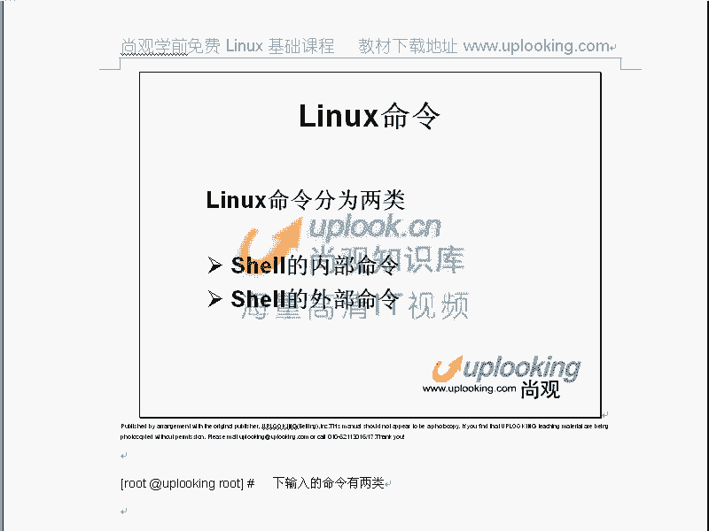
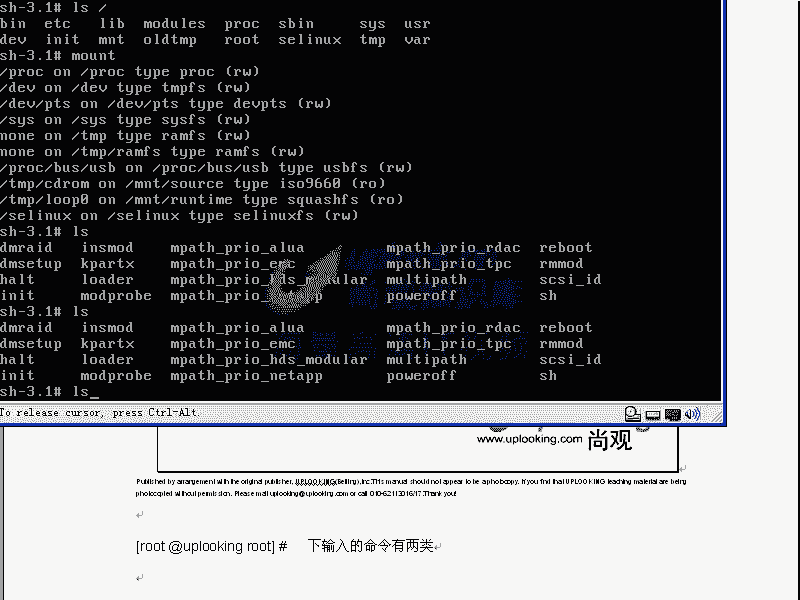
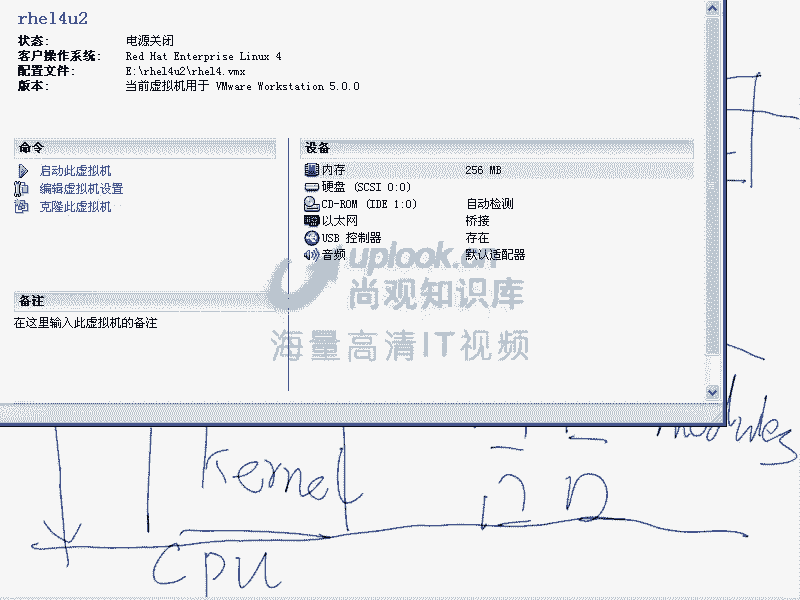
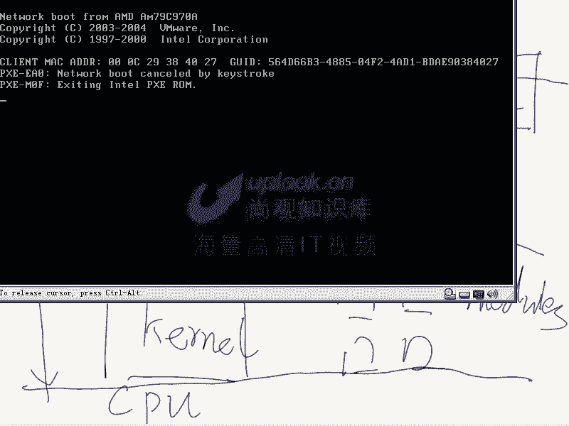
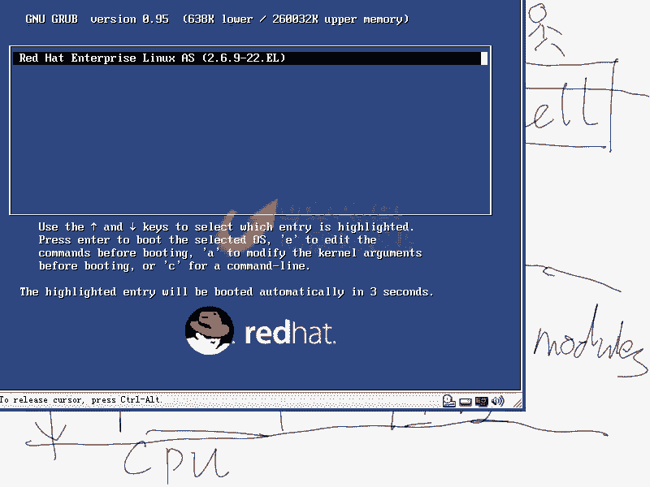
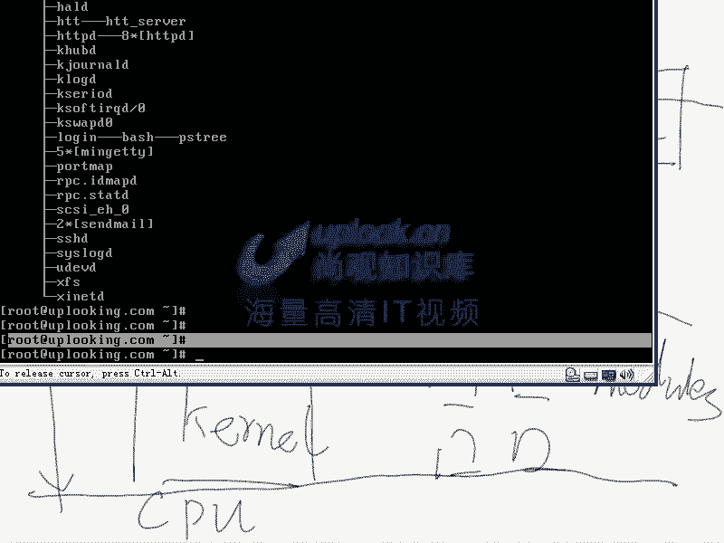
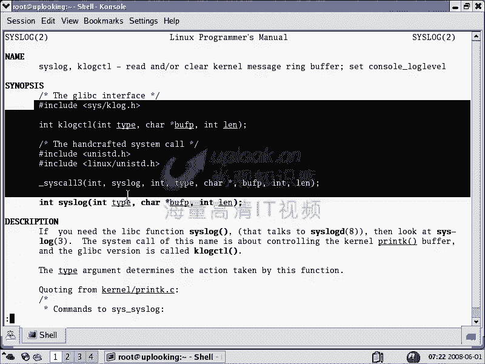
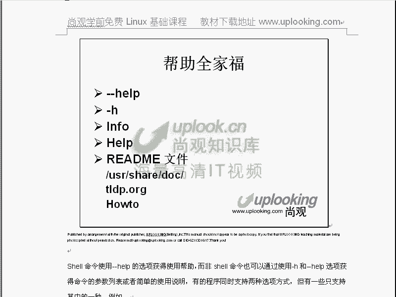

# Linux基础入门：P9：在Linux中寻求帮助 📚





在本节课中，我们将要学习Linux系统中最核心的技能之一：如何有效地寻求帮助。理解并掌握这些方法，是区分Linux初学者与熟练使用者的关键。我们将从命令的分类讲起，逐步介绍各种获取帮助的途径和高效使用Shell的技巧。

## 命令的分类：内部命令与外部命令

上一节我们介绍了Linux系统的层次结构，知道用户是通过Shell与系统交互的。本节中我们来看看用户下达的命令具体是如何被处理的。







Linux中的命令主要分为两类：**内部命令**和**外部命令**。

*   **内部命令**：由Shell程序（如Bash）自身提供的功能。这些命令是Shell的一部分，没有独立的可执行文件。
*   **外部命令**：是独立于Shell存在的可执行程序文件。当用户输入外部命令时，Shell会负责找到并执行这个独立的程序。




例如，`echo`命令通常既是内部命令（Shell提供），在`/bin`目录下也有其对应的外部命令文件。你可以通过`type`命令查看一个命令的类型：
```bash
type echo  # 查看echo命令的类型
```
如果将`/bin/echo`文件改名，再执行`echo`，你会发现命令依然有效，因为它调用的是Shell内部的`echo`功能。

而`ls`命令是一个典型的外部命令。它的可执行文件位于`/bin/ls`。如果删除或移动这个文件，`ls`命令将无法执行。

理解这个区别，有助于我们使用正确的帮助查询方法。

## 如何获取命令帮助

知道命令的分类后，我们就可以针对性地寻找帮助。以下是查询命令帮助的主要方法。

### 查询内部命令：`help`命令

对于Shell的内部命令，可以使用`help`命令来查看其用法和选项。

以下是使用`help`命令查询内部命令的示例：
```bash
help echo  # 查看内部命令echo的帮助信息
help cd    # 查看内部命令cd的帮助信息
```
如果对`ls`使用`help`命令，通常会提示找不到帮助，因为`ls`是外部命令。

### 查询外部命令：`--help`选项

大多数外部命令都支持`--help`（或`-h`）选项，可以输出该命令的简要使用说明和参数列表。

以下是使用`--help`选项查询外部命令的示例：
```bash
ls --help      # 查看ls命令的简要帮助
mkdir --help   # 查看mkdir命令的简要帮助
```
这种方式获取的信息通常比较简洁，适合快速查阅常用选项。

### 最全面的手册：`man`命令

`man`（manual的缩写）是Linux系统中查询帮助最常用、最权威的工具。它提供了非常详细的手册页。

使用`man`命令的基本格式是：
```bash
man [命令名]
```
例如，要查看`ls`命令的完整手册，只需输入：
```bash
man ls
```
手册页打开后，你可以进行以下操作：
*   **翻页**：使用`空格键`向下翻一页，`PageDown`键也可。使用`b`键向上翻一页，`PageUp`键也可。
*   **搜索**：按下`/`键，然后输入关键词（如`-a`），按回车键即可在手册页中向下搜索。按`n`键跳转到下一个匹配项，按`Shift + n`（即`N`）跳转到上一个匹配项。
*   **退出**：按下`q`键即可退出`man`页面。

`man`手册的内容非常详尽，包括命令名称、语法、选项说明、例子等，是深入学习命令的最佳途径。

### 手册页的类型（Section）

你可能会注意到`man ls`打开后，标题`LS(1)`中的数字`1`。这代表手册页的类型。`man`手册被分成了多个章节（Section），每个章节涵盖特定类型的内容。

常见的章节编号及其含义如下：

| 章节号 | 内容类型 |
| :--- | :--- |
| **1** | **用户命令**（普通用户可执行的命令） |
| **2** | 系统调用（内核提供的函数） |
| **3** | 库函数（程序库中的函数） |
| **4** | 特殊文件（如`/dev`目录下的设备文件） |
| **5** | **文件格式**（配置文件格式，如`/etc/passwd`） |
| **6** | 游戏 |
| **7** | 杂项（宏、约定等） |
| **8** | **系统管理命令**（通常需要root权限） |



有时，不同章节有同名条目。例如，`passwd`既是命令（第1章），也是一个配置文件格式（第5章）。指定章节号进行查询：
```bash
man 1 passwd  # 查看passwd命令的手册
man 5 passwd  # 查看passwd配置文件格式的手册
```
你可以通过`man man`命令查看关于`man`命令自身的详细说明，其中会列出所有章节。

### 另一种文档系统：`info`命令

除了`man`，GNU项目还提供了`info`文档系统。它的内容有时比`man`更详细，并且支持超链接跳转。

使用方式与`man`类似：
```bash
info ls
```
在`info`页面中：
*   回车键可以进入带有`*`标记的链接节点。
*   按`u`键返回上一级节点。
*   按`q`键退出。

虽然功能强大，但由于`man`足够常用，`info`的使用频率相对较低，许多命令的`info`文档内容与`man`手册相同。

## 其他寻求帮助的途径

如果以上方法都无法解决问题，我们还可以求助于更广泛的资源。

*   **软件自带的文档**：许多软件包安装后，会在`/usr/share/doc/`目录下存放详细的文档（如`README`, `INSTALL`等）。
*   **Howto和指南**：互联网上有大量优秀的Linux教程和指南，例如“The Linux Documentation Project (TLDP)”网站。
*   **搜索引擎**：对于具体的错误信息或复杂问题，使用搜索引擎（如Google、Bing或百度）是最高效的方式之一。尝试用英文关键词搜索，通常能找到更深入和更国际化的解决方案。

## Shell使用技巧与快捷键

高效地使用Shell可以极大提升工作效率。这里介绍几个Bash Shell中必备的快捷键。

熟练使用Tab键可以极大提高命令输入效率和准确性。

*   **命令/路径补全**：输入命令或路径的前几个字母，按下`Tab`键，Shell会自动补全。如果存在多个可能选项，按两次`Tab`键会列出所有候选。
*   **减少输入错误**：补全功能避免了因拼写错误导致的命令执行失败。

以下是一些常用的控制快捷键：

| 快捷键 | 功能 |
| :--- | :--- |
| **Ctrl + c** | **终止**当前正在运行的前台程序。 |
| **Ctrl + z** | **暂停**当前程序，并将其放入后台。 |
| **Ctrl + l** | **清屏**，效果等同于输入`clear`命令。 |
| **Ctrl + s** | 暂停屏幕输出（锁定终端）。 |
| **Ctrl + q** | 恢复屏幕输出（解除终端锁定）。 |
| **Ctrl + r** | **反向搜索历史命令**，输入关键词可快速查找并执行过往命令。 |
| **方向键 ↑ ↓** | 翻阅之前执行过的命令历史。 |

## Linux命令使用习惯

最后，我们总结几个与Windows不同的Linux命令使用习惯，帮助初学者快速适应。

*   **大小写敏感**：Linux中，**命令、选项、文件名、路径名都是严格区分大小写**的。`ls`和`LS`、`File.txt`和`file.txt`是完全不同的。
*   **扩展名无关执行**：在Linux中，一个文件能否被执行，取决于它是否具有**可执行权限（x）**，以及文件内容是否是有效的可执行格式，**与文件扩展名（如`.exe`, `.sh`）无关**。即使一个文本文件（`.txt`）被赋予了执行权限，系统也会尝试执行它（虽然通常会失败）。
*   **善用历史命令**：除了用方向键，`Ctrl + r`可以智能地搜索历史命令，能帮你快速找到并重复执行复杂的命令。



本节课中我们一起学习了在Linux中寻求帮助的完整体系。我们从理解内部命令与外部命令的区别开始，掌握了使用`help`、`--help`、`man`和`info`查询帮助的具体方法，并了解了`man`手册的章节分类。此外，我们还介绍了一些提升效率的Shell快捷键和必须适应的Linux基本习惯。记住，**善于寻求帮助是成为Linux高手的首要技能**。在接下来的课程中，我们将运用这些知识，开始学习具体的文件操作和文本处理命令。