# Linux用户与组管理：第六章：管理用户和组

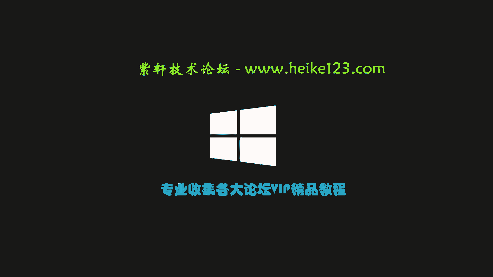

在本节课中，我们将要学习Linux系统中用户和组的管理。Linux是一个多用户、多任务的操作系统，因此理解如何创建、管理和配置用户与组是系统管理的基础。我们将从基本概念入手，逐步讲解相关的配置文件、命令和操作。

## 用户分类与UID

Linux系统中的用户主要分为三类。

*   **超级管理员 (root)**：这是系统中权限最高的用户，其**UID (User ID)** 固定为 **0**。该用户拥有对系统的完全控制权。
*   **系统用户**：这类用户通常用于运行系统服务或应用程序（例如 `apache`、`mysql`）。他们的特点是：
    *   **UID** 范围通常在 **1-999**。
    *   **Shell类型** 通常设置为 `/sbin/nologin`，意味着他们不能用于交互式登录。
*   **普通用户**：这是供日常使用的用户账户。在RHEL 7及以后版本中，他们的**UID** 从 **1000** 开始分配。

Linux系统通过**UID**来唯一识别用户，而不是用户名。每个用户都必须有一个唯一的**UID**。

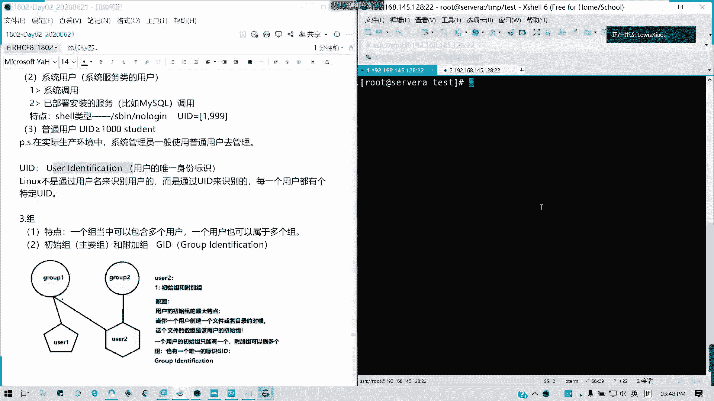

## 组的概念与GID

用户可以被组织到组中，以便进行权限管理。

*   一个用户可以属于多个组。
*   每个用户有一个**主要组 (初始组)**，创建文件时，文件的属组默认就是这个主要组。
*   用户还可以加入多个**附加组**，以获取这些组的权限。
*   组也有唯一的标识符，称为**GID (Group ID)**。

## 核心配置文件

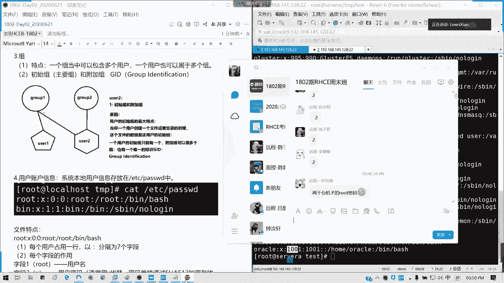

用户和组的信息存储在几个关键的系统文件中。了解这些文件的结构至关重要。

### 1. 用户账户信息：`/etc/passwd`

此文件存储用户的基本信息，每行代表一个用户，由冒号 `:` 分隔为7个字段。

**文件格式示例与字段说明：**
```bash
root:x:0:0:root:/root:/bin/bash
bin:x:1:1:bin:/bin:/sbin/nologin
```

以下是每个字段的含义：
1.  **用户名**：用户的登录名。
2.  **密码占位符**：历史上这里存放加密密码，现在通常用 `x` 表示，实际密码存储在 `/etc/shadow` 文件中。
3.  **UID**：用户的数字ID。
4.  **GID**：用户主要组的数字ID。
5.  **描述信息 (GECOS)**：用户的注释或全名。
6.  **家目录**：用户登录后的初始工作目录。
7.  **登录Shell**：用户使用的命令解释器路径（例如 `/bin/bash`）。系统用户通常设为 `/sbin/nologin`。

**注意**：通常不直接手动编辑此文件，而是使用专门的命令。

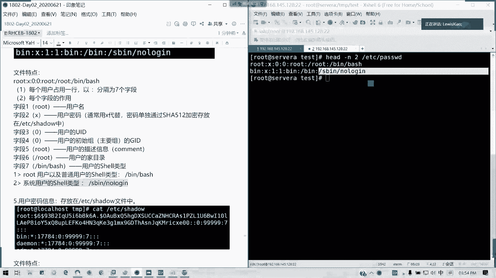

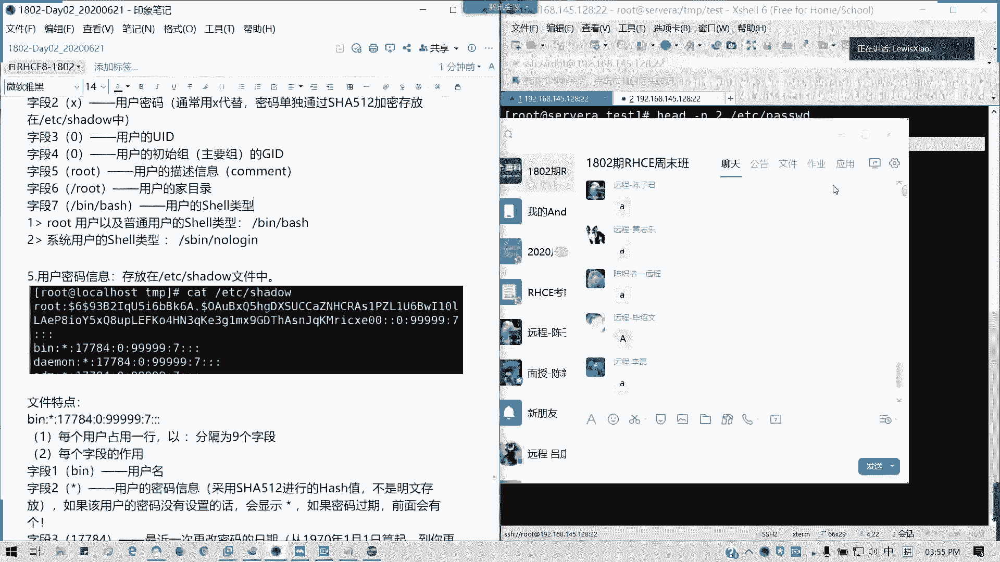

### 2. 用户密码信息：`/etc/shadow`

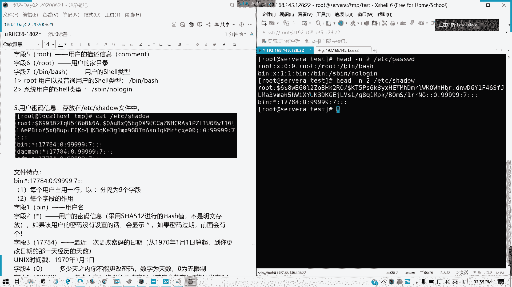

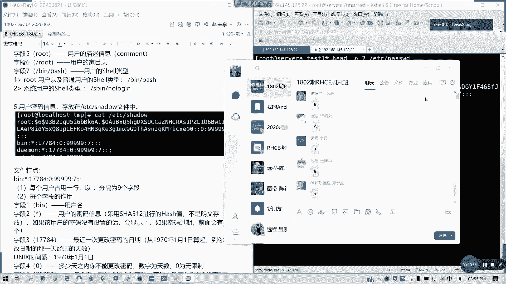

此文件存储用户的加密密码和密码策略信息，权限严格，每行代表一个用户，由冒号 `:` 分隔为9个字段。

**文件格式示例与字段说明：**
```bash
bin:*:17784:0:99999:7:::
```

以下是每个字段的含义：
1.  **用户名**。
2.  **加密密码**：使用SHA-512等算法加密的密码哈希值。`*` 或 `!` 表示账户被锁定或未设置密码。
3.  **最近更改密码的日期**：从1970年1月1日（Unix纪元）开始计算的天数。
4.  **密码不可更改的天数**：设置后，在此天数内不能修改密码。`0` 表示随时可以修改。
5.  **密码必须更改的天数**：密码多少天后到期。`99999` 通常表示密码永不过期。
6.  **密码到期前警告天数**：在密码到期前多少天开始向用户发出警告。
7.  **密码过期宽限天数**：密码到期后，账户仍可使用的宽限天数。
8.  **账户失效日期**：账户在此日期后将被禁用（同样以从1970年1月1日开始的天数表示）。
9.  **保留字段**。

### 3. 组账户信息：`/etc/group`

此文件存储组的基本信息，每行代表一个组，由冒号 `:` 分隔为4个字段。

**文件格式示例与字段说明：**
```bash
root:x:0:
student:x:1000:test1,test2
```

以下是每个字段的含义：
1.  **组名**。
2.  **组密码占位符**：通常为 `x`，实际组密码（如果设置）存储在 `/etc/gshadow`。
3.  **GID**：组的数字ID。
4.  **组成员列表**：属于该组的用户列表，用逗号 `,` 分隔。如果用户以此组为主要组，则不会列在此处。

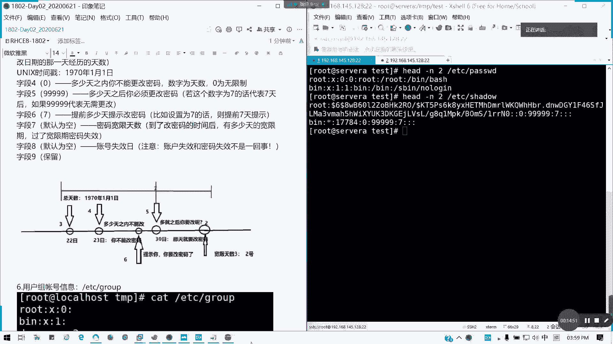

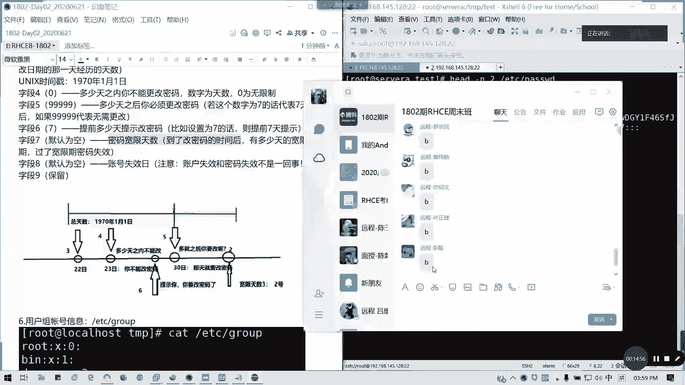

### 4. 组密码信息：`/etc/gshadow`

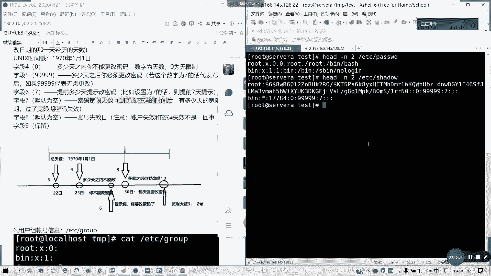

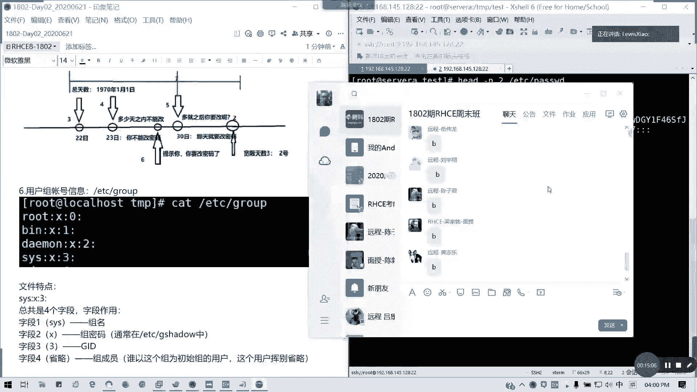

此文件存储组的管理员和加密组密码，每行代表一个组，由冒号 `:` 分隔为4个字段。

**文件格式示例与字段说明：**
```bash
root:::
student:!::
```

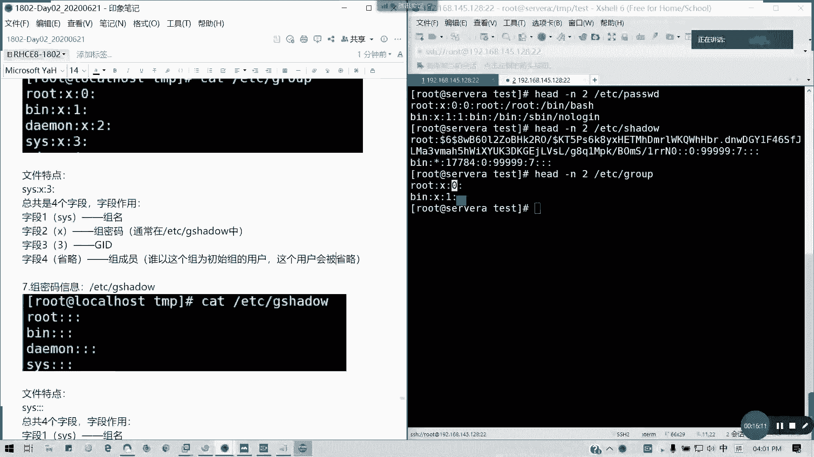

以下是每个字段的含义：
1.  **组名**。
2.  **加密的组密码**：留空或 `!` 表示未设置。
3.  **组管理员列表**：有权修改组成员和密码的用户列表。
4.  **组成员列表**：格式同 `/etc/group`。

## 用户与组管理命令

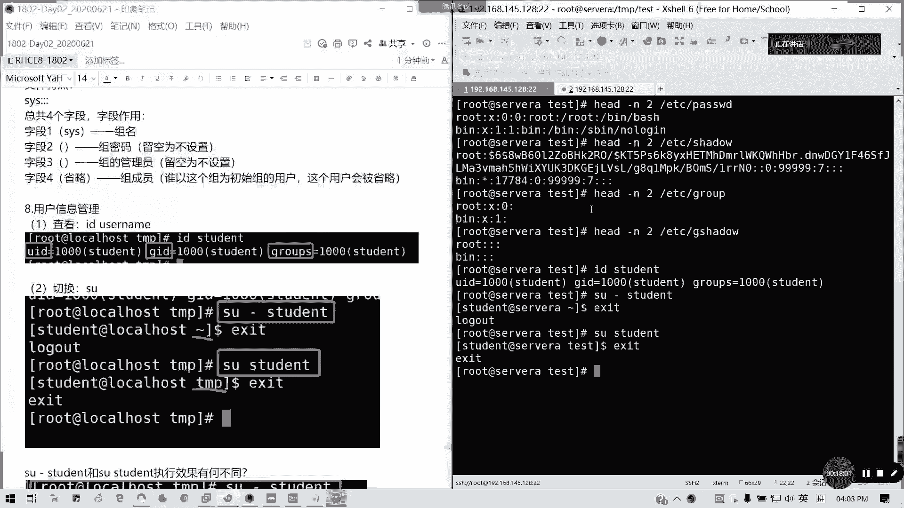

上一节我们介绍了核心的配置文件，本节中我们来看看用于管理用户和组的常用命令。

### 查看用户信息：`id` 命令

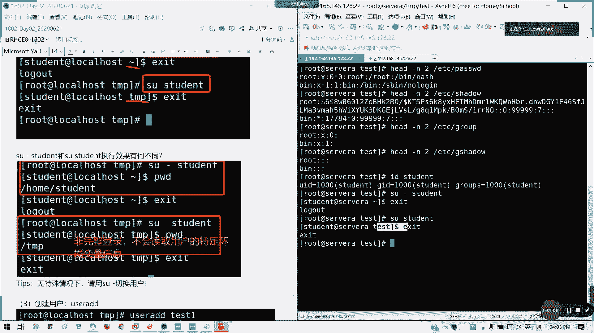

`id` 命令用于显示当前用户或指定用户的UID、GID及所属组信息。

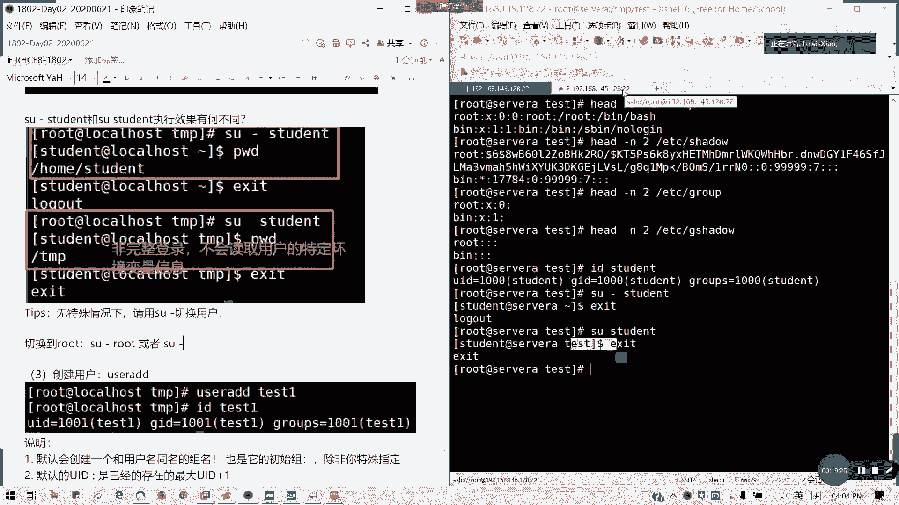

```bash
id student
```
输出示例：`uid=1000(student) gid=1000(student) groups=1000(student)`

### 切换用户：`su` 命令

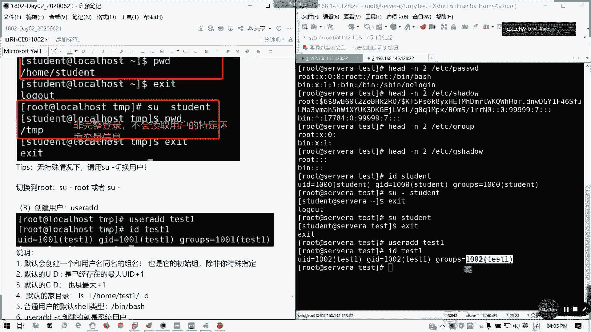

`su` (Switch User) 命令用于切换用户身份。

*   `su - username`：使用 `-` (或 `-l`/`--login`) 会启动一个登录Shell，完全加载该用户的环境变量和配置。
*   `su username`：不使用 `-` 则不会切换环境，仍在原用户的工作目录和环境设置中。

```bash
su - student    # 完全切换到student用户
su root         # 切换到root用户，但不加载root的环境（通常应使用 `su -`）
```

### 创建用户：`useradd` 命令

`useradd` 命令用于创建新用户账户。

**基本用法：**
```bash
useradd test1
```
此命令会：
*   创建用户 `test1`。
*   在 `/etc/passwd`、`/etc/shadow`、`/etc/group` 和 `/etc/gshadow` 中创建相应条目。
*   创建一个与用户名同名的组作为其主要组。
*   在 `/home` 目录下创建用户家目录（从 `/etc/skel` 模板复制内容）。
*   UID 和 GID 默认从当前系统中已使用的最大ID号加1开始分配。

**常用选项示例：**
```bash
useradd -u 2000 -g student -G wheel,developers -s /bin/bash -c "Test User" -d /home/testuser student2
```
*   `-u 2000`：指定UID为2000。
*   `-g student`：指定主要组为 `student`。
*   `-G wheel,developers`：指定附加组为 `wheel` 和 `developers`。
*   `-s /bin/bash`：指定登录Shell。
*   `-c “Test User”`：添加用户描述。
*   `-d /home/testuser`：指定家目录路径。

**创建系统用户：**
使用 `-r` 选项创建系统用户（UID在1-999之间，不创建家目录）。
```bash
useradd -r systemuser
```

### 删除用户：`userdel` 命令

`userdel` 命令用于删除用户账户。

*   `userdel username`：仅删除用户在 `/etc/passwd` 等文件中的记录，但保留其家目录和邮件池。
*   `userdel -r username`：使用 `-r` (递归) 选项，会同时删除用户的家目录和邮件池。

```bash
userdel test1      # 仅删除用户记录
userdel -r test2   # 彻底删除用户及其相关文件
```

### 修改用户属性：`usermod` 命令

`usermod` 命令用于修改现有用户的属性，其选项与 `useradd` 类似。

```bash
usermod -u 2020 test2      # 修改test2用户的UID为2020
usermod -aG wheel test2    # 将test2用户添加到wheel附加组（-a表示追加，避免覆盖原有附加组）
usermod -s /sbin/nologin test2 # 修改test2的登录Shell
```

### 管理用户密码：`passwd` 命令

`passwd` 命令用于设置或修改用户密码。

*   **root用户**：可以为任何用户修改密码，且无需提供原密码。
    ```bash
    passwd student      # root用户为student设置新密码
    echo "NewPass123" | passwd --stdin student # 非交互式修改密码（明文传输）
    ```
*   **普通用户**：只能修改自己的密码，且必须提供原密码并满足密码复杂度要求。
    ```bash
    passwd              # 普通用户修改自己的密码
    ```

**其他常用选项：**
```bash
passwd -S student       # 查看student用户的密码状态（是否锁定、过期时间等）
passwd -l student       # 锁定student用户的密码，禁止其登录
passwd -u student       # 解锁student用户的密码
```

### 管理密码策略：`chage` 命令

`chage` 命令用于查看和修改用户的密码过期策略，其参数对应 `/etc/shadow` 文件中的字段。

```bash
chage -l student        # 列出student用户的密码策略详情
chage -M 90 student     # 设置密码90天后过期
chage -W 7 student      # 密码过期前7天开始警告
chage -I 5 student      # 密码过期后，账户有5天宽限期
chage -E 2024-12-31 student # 设置账户在2024年12月31日失效
```

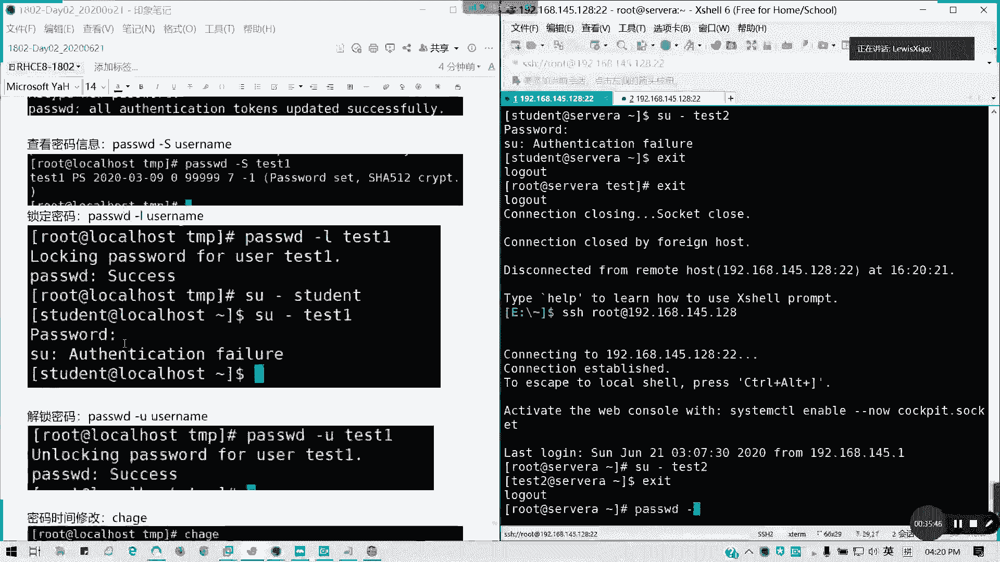

### 管理组：`groupadd` 和 `groupdel` 命令

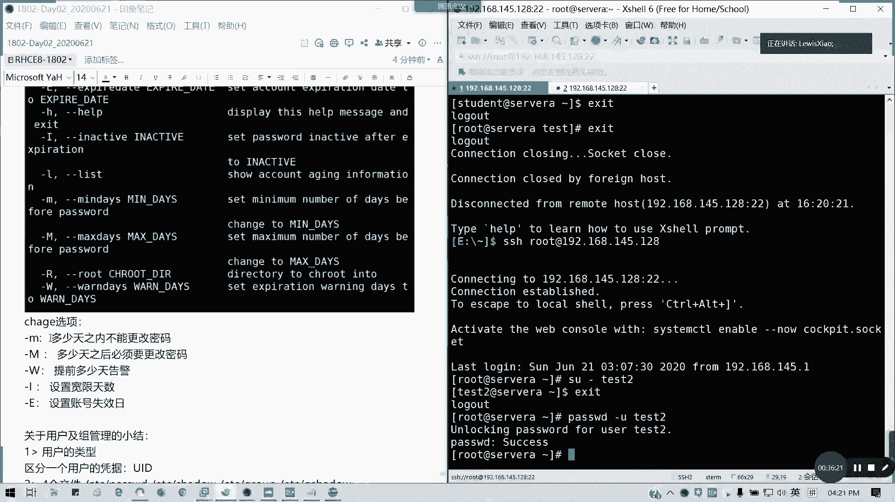

*   `groupadd`：创建新组。
    ```bash
    groupadd developers
    groupadd -g 3000 admins # 创建组并指定GID为3000
    ```
*   `groupdel`：删除组（需确保该组不是任何用户的主要组）。
    ```bash
    groupdel developers
    ```

### 管理组成员：`gpasswd` 命令

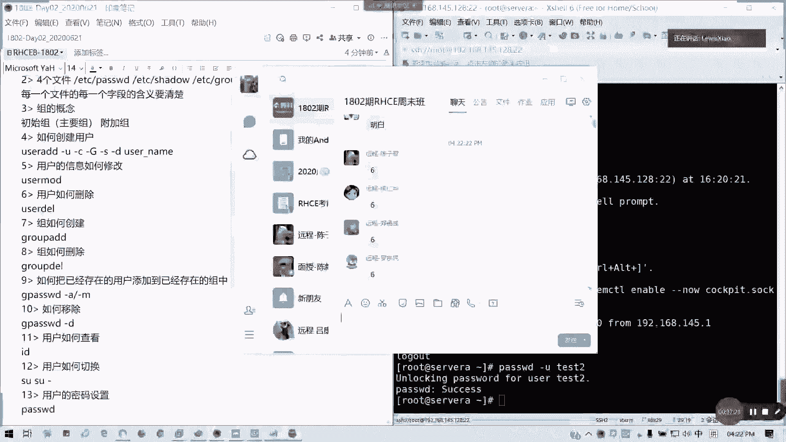

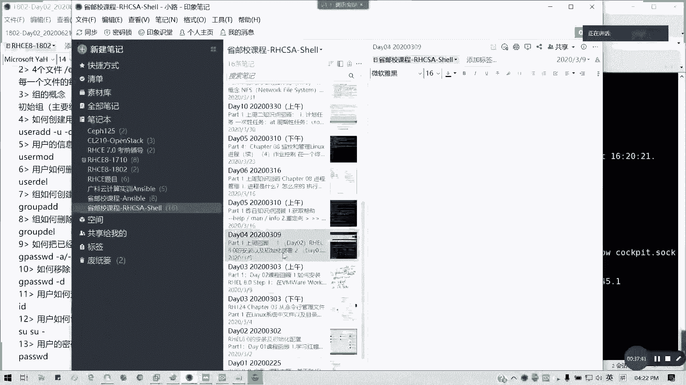

`gpasswd` 命令主要用于管理组的成员和组密码。

```bash
gpasswd -a test2 student    # 将用户test2添加到student组（作为附加组）
gpasswd -d test2 student    # 将用户test2从student组中移除
gpasswd -A test1 student    # 设置test1为student组的管理员
gpasswd student             # 为student组设置密码（较少使用）
```

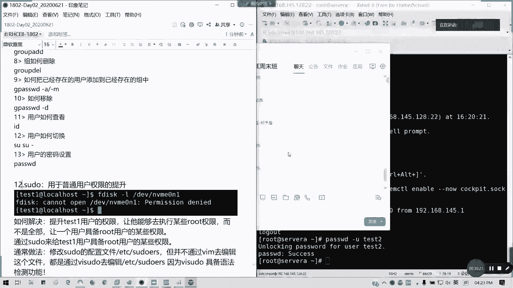

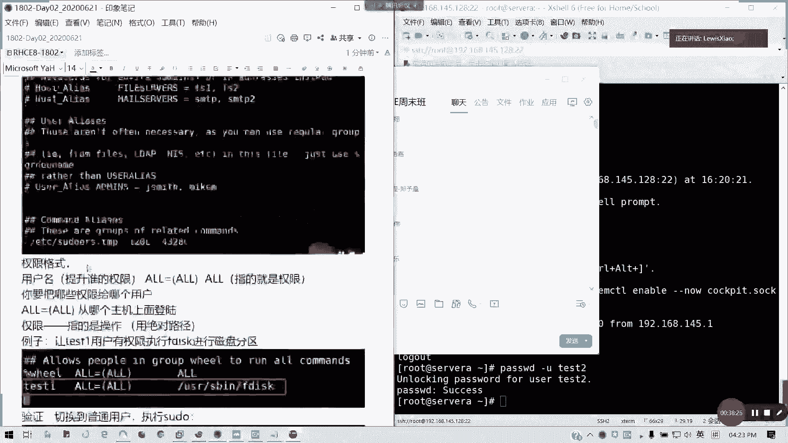

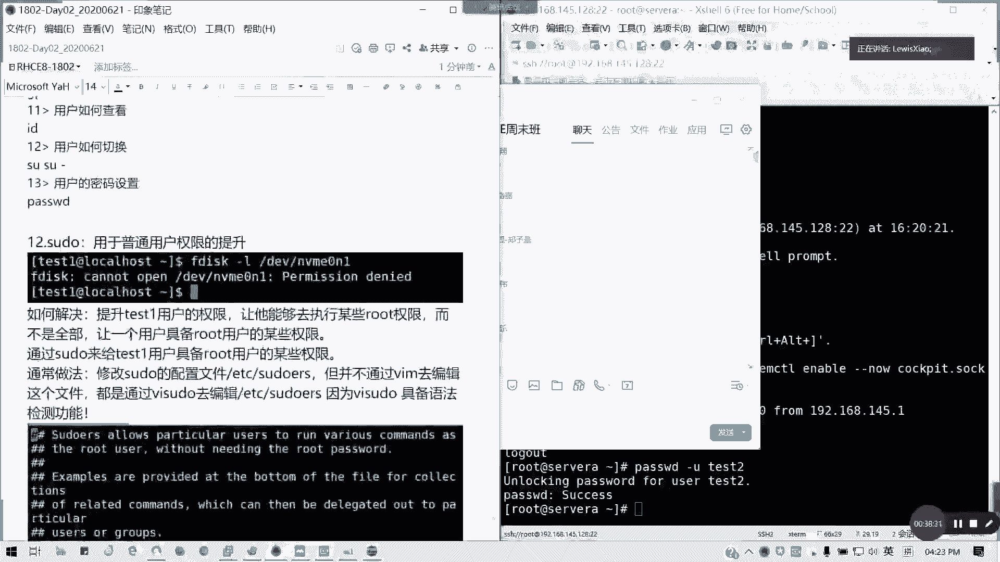

## 总结

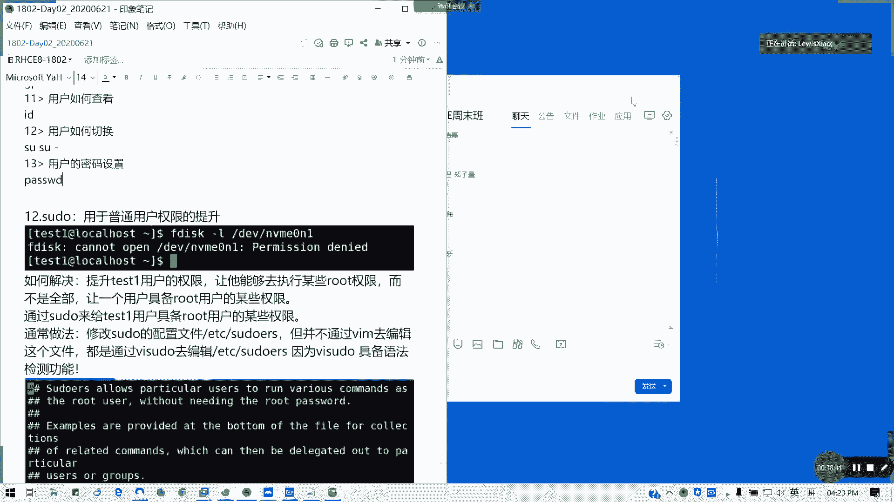

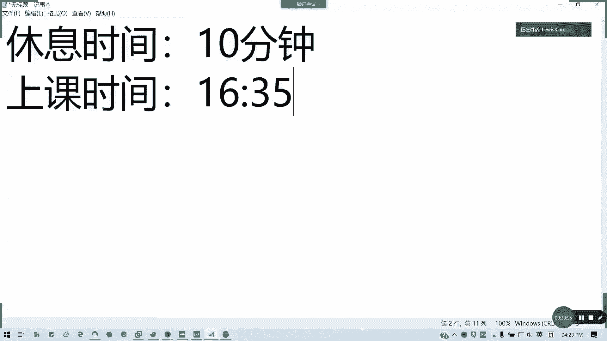

本节课中我们一起学习了Linux用户和组管理的核心知识。我们首先了解了三类用户（超级管理员、系统用户、普通用户）及其UID的区别，以及组、GID、主要组和附加组的概念。然后，我们深入分析了四个关键配置文件（`/etc/passwd`, `/etc/shadow`, `/etc/group`, `/etc/gshadow`）的结构和每个字段的含义。最后，我们掌握了一系列实用的管理命令，包括查看信息（`id`）、切换用户（`su`）、创建（`useradd`）、删除（`userdel`）、修改属性（`usermod`）、管理密码（`passwd`, `chage`）以及管理组和组成员（`groupadd`, `groupdel`, `gpasswd`）。这些是进行Linux系统用户管理的基础技能。