# Redhat红帽 RHCE8.0认证体系课程：P11：使用visudo为普通用户授权

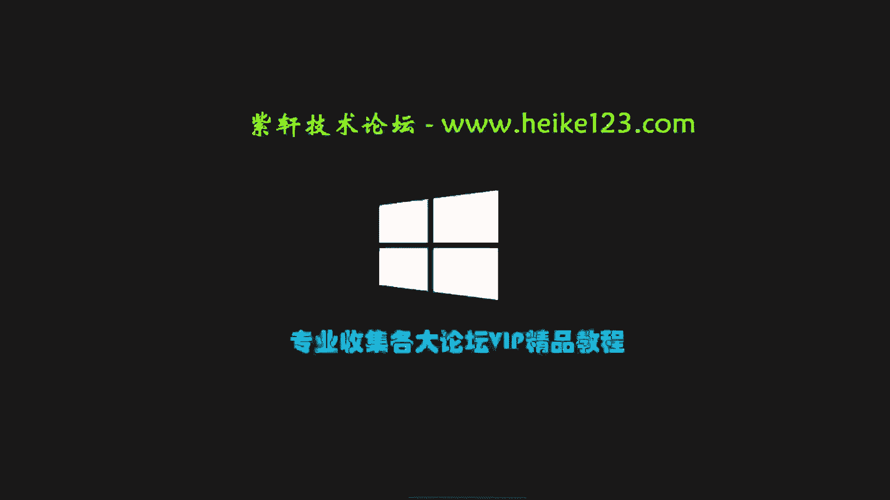

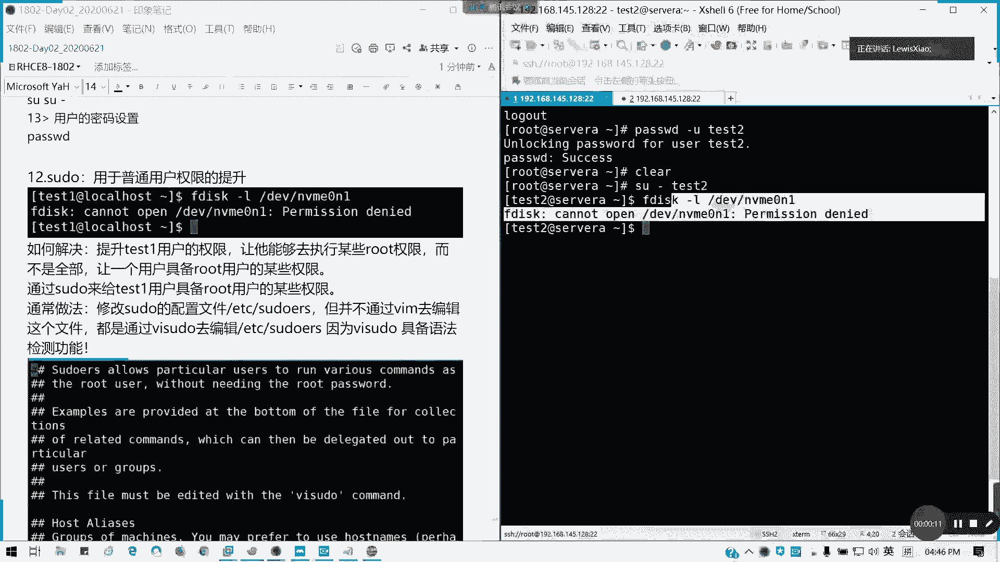

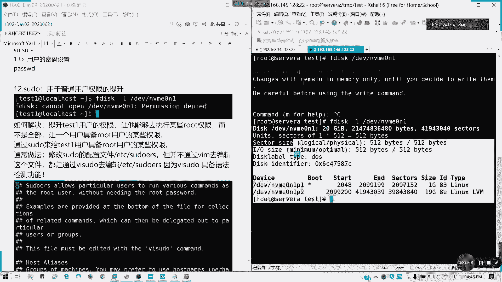

## 概述
在本节课程中，我们将学习如何使用 `visudo` 命令安全地为普通用户授予特定的管理员权限。我们将了解 `sudo` 机制的工作原理、如何编辑其配置文件，以及如何通过用户、组和命令别名来灵活地管理权限。

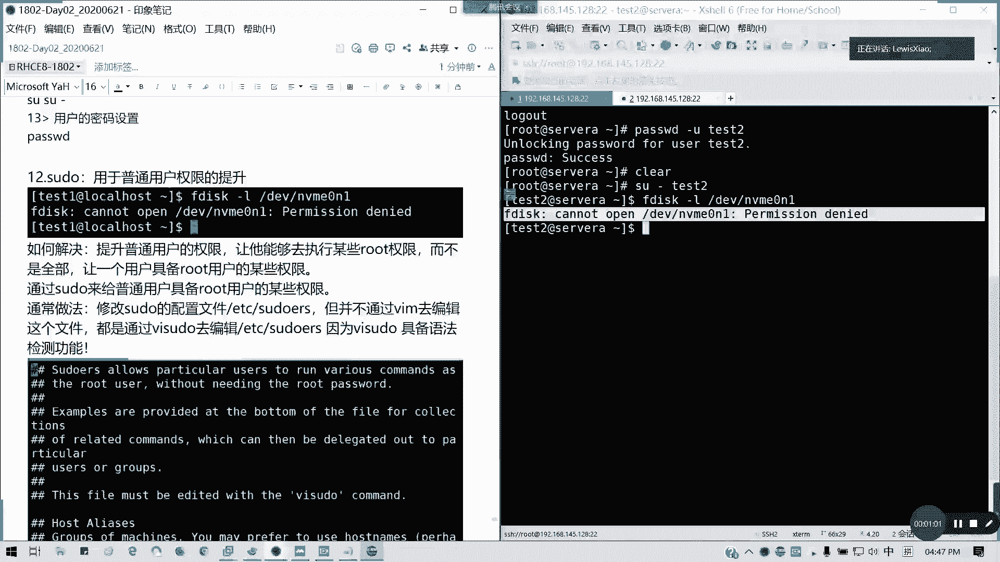

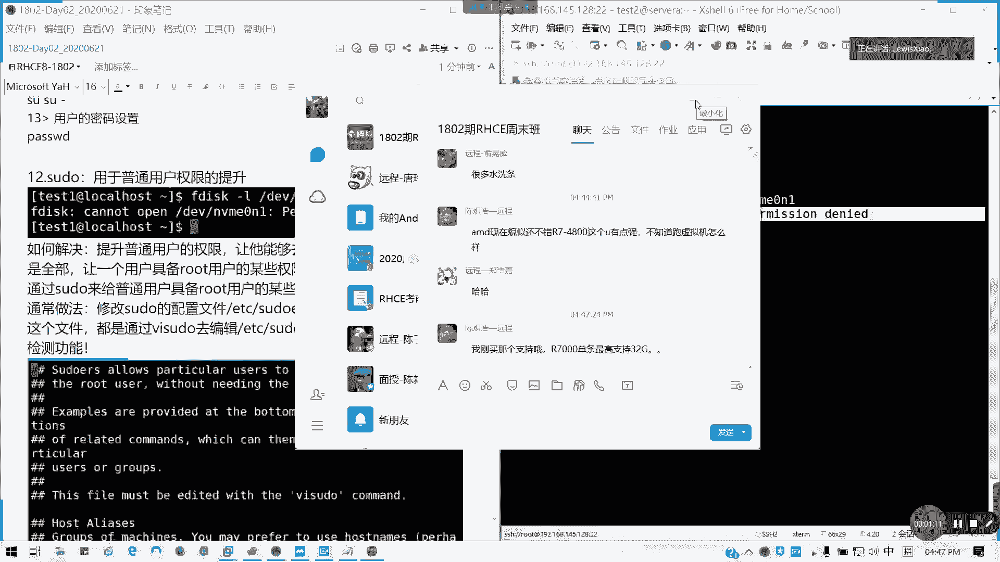

---

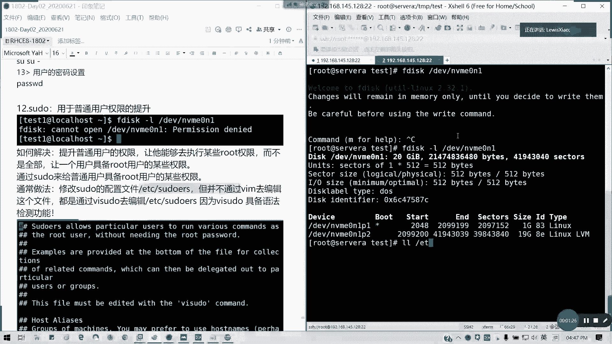

## 权限问题与sudo的引入
上一节我们介绍了用户和组的管理。本节中我们来看看如何让普通用户安全地执行部分管理员命令。

在Linux系统中，许多系统管理命令（如查看磁盘分区）需要 `root` 权限。如果直接切换到 `root` 用户执行所有操作，会带来安全风险。`sudo` 命令允许系统管理员授权给特定的普通用户，让他们能够以 `root` 身份运行**部分**命令，而不是全部。

例如，普通用户 `test2` 尝试执行 `fdisk -l` 查看磁盘分区时，会因权限不足而失败。

```bash
$ fdisk -l
fdisk: cannot open /dev/sda: Permission denied
```

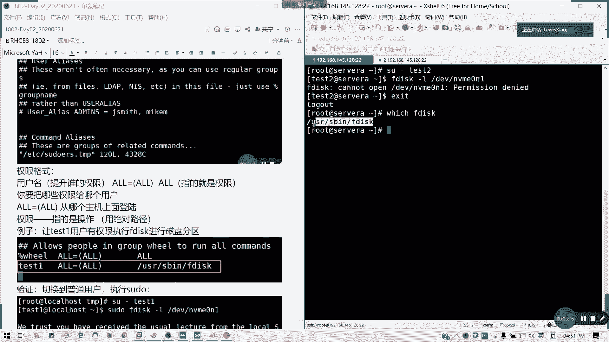

---

## 认识sudo的配置文件
`sudo` 的权限配置保存在 `/etc/sudoers` 文件中。出于安全考虑，此文件权限为 `440`（所有者`root`可读，同组用户可读，其他用户无权限），因此不能直接用普通文本编辑器（如 `vi`）修改。

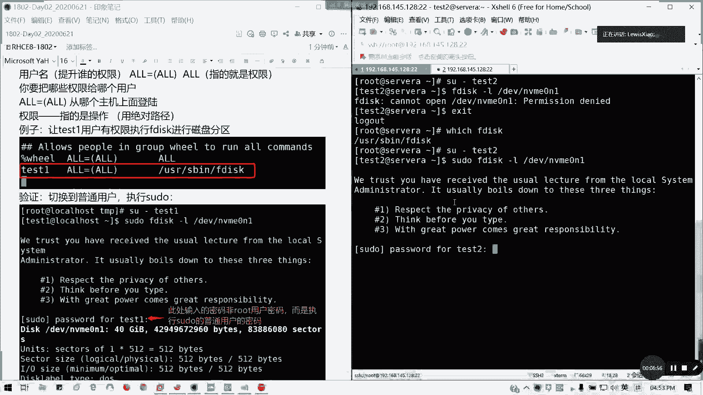

```bash
$ ls -l /etc/sudoers
-r--r----- 1 root root 4357 Jun 15 10:00 /etc/sudoers
```

我们需要使用 `visudo` 命令来编辑此文件。`visudo` 会进行语法检查，防止配置错误导致 `sudo` 功能失效。

---

## 编辑sudoers文件：基础授权
现在，我们来看看如何编辑 `/etc/sudoers` 文件，为 `test2` 用户授权。

1.  以 `root` 身份执行 `visudo` 命令。
2.  文件中的注释行以 `#` 开头。我们需要找到授权规则部分。
3.  授权的基本格式为：
    **`用户名 主机名=(可切换到的用户) 可执行的命令`**

    例如，允许 `test2` 用户在任何主机上以任何用户身份（通常是 `root`）执行 `/usr/sbin/fdisk` 命令：

    ```
    test2    ALL=(ALL)       /usr/sbin/fdisk
    ```
    *   `test2`: 被授权的用户名。
    *   `ALL`: 指所有主机。
    *   `(ALL)`: 指可以切换到任何用户身份执行命令，通常指 `root`。
    *   `/usr/sbin/fdisk`: **必须使用命令的绝对路径**。可以使用 `which fdisk` 命令查找。

4.  保存并退出 `visudo`。如果语法无误，配置将生效。

---

## 使用sudo执行命令
配置完成后，`test2` 用户就可以使用 `sudo` 来执行授权的命令了。

1.  切换到 `test2` 用户。
2.  执行命令时，在命令前加上 `sudo`。

```bash
$ sudo fdisk -l
```
系统会提示输入 `test2` 用户自己的密码（**不是root密码**）。首次使用或超过5分钟未使用后，需要输入密码。密码验证成功后，命令将以 `root` 权限执行。

**注意**：`sudo` 的授权有效期为**5分钟**。5分钟内再次使用 `sudo` 无需输入密码。

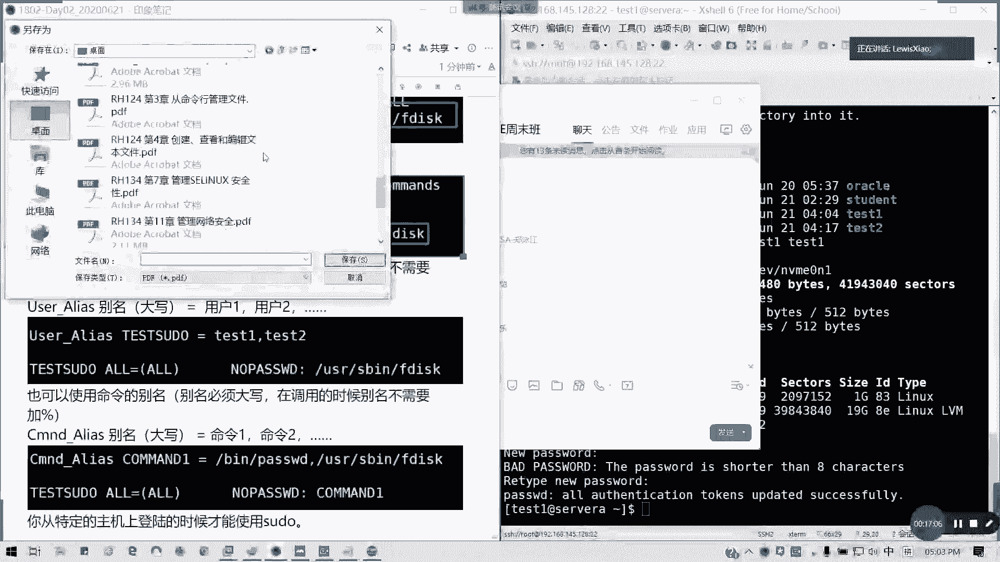

---

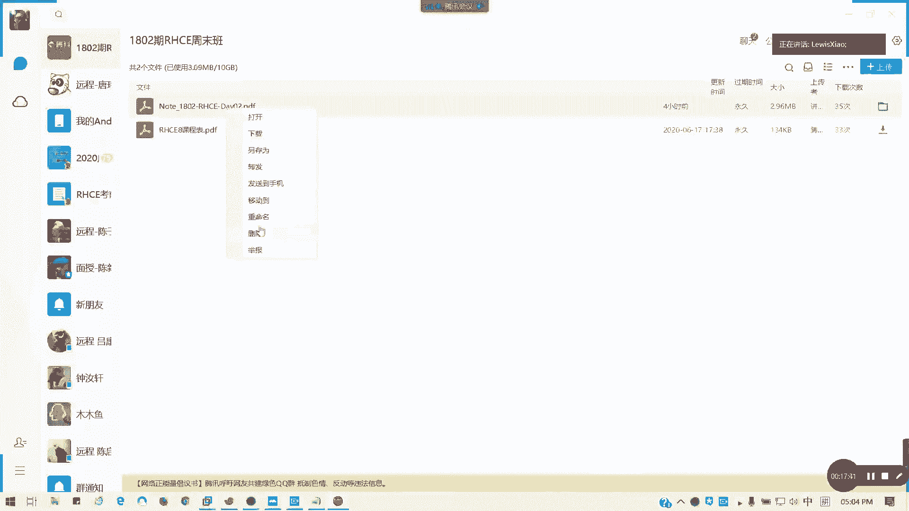

## 进阶配置：无需密码与使用别名
为了更灵活、安全地管理权限，`sudoers` 文件支持更复杂的配置。

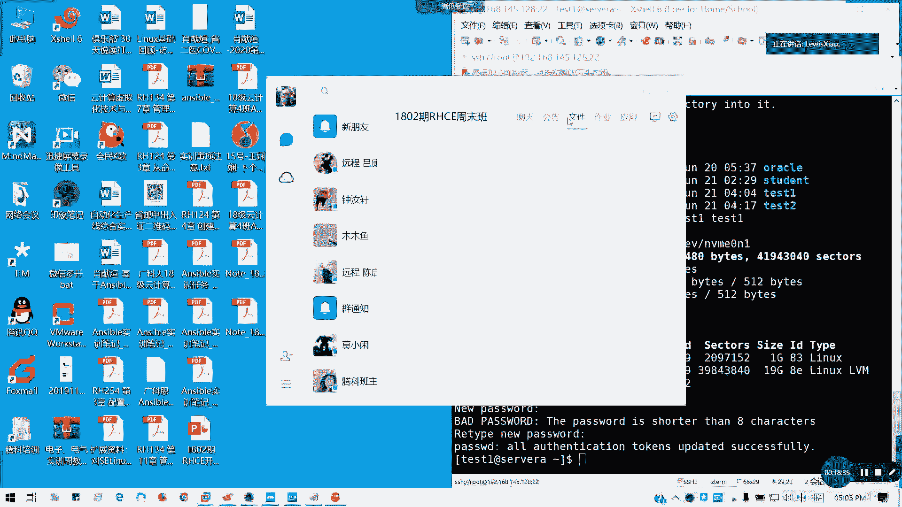

### 配置无需密码执行
在授权规则中添加 `NOPASSWD:` 选项，可以让用户执行特定命令时无需输入密码。

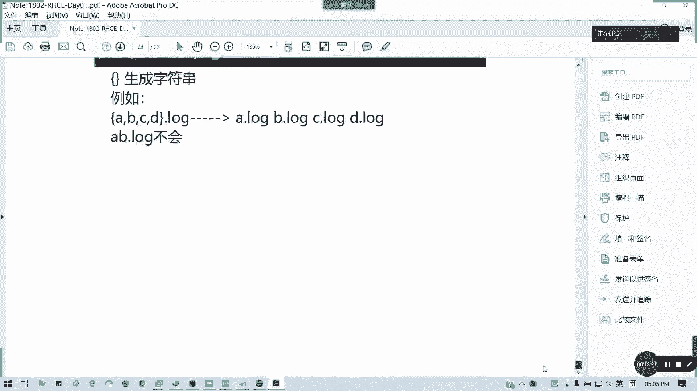

```
test2    ALL=(ALL)       NOPASSWD: /usr/sbin/fdisk
```

### 为用户组授权
可以授权给整个用户组，组名前需加 `%`。

```
%testgroup    ALL=(ALL)       /usr/sbin/fdisk
```
这样，`testgroup` 组内的所有成员都获得了此权限。

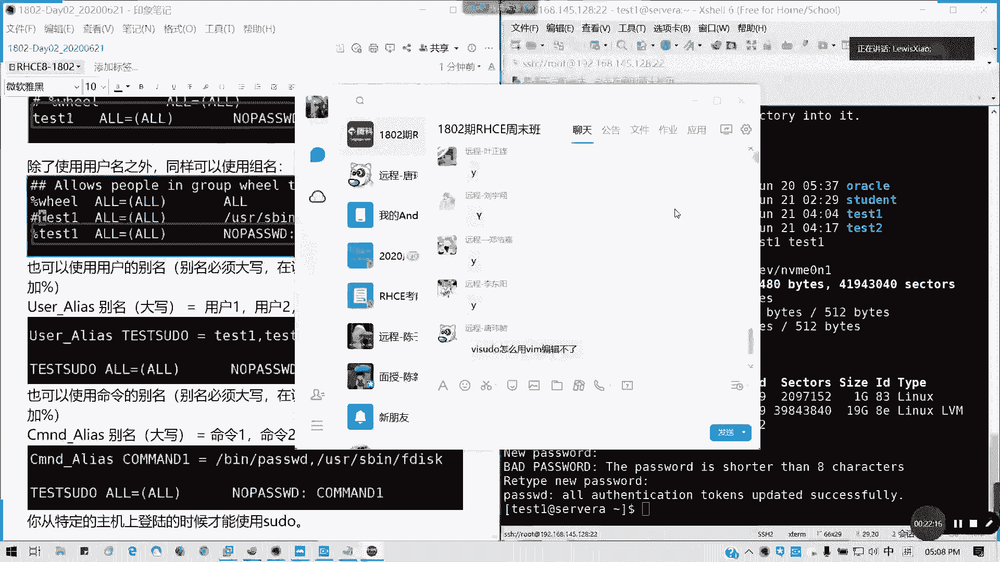

### 使用用户别名
可以将多个用户定义为一个别名，方便管理。**别名必须大写**。

```
User_Alias TESTADMINS = test1, test2
TESTADMINS    ALL=(ALL)       NOPASSWD: /usr/sbin/fdisk
```
这里，`TESTADMINS` 别名包含了 `test1` 和 `test2` 用户。

### 使用命令别名
同样，也可以将多个命令定义为一个别名。

```
Cmnd_Alias STORAGECMDS = /usr/sbin/fdisk, /usr/bin/passwd
test2    ALL=(ALL)       NOPASSWD: STORAGECMDS
```
`test2` 用户现在可以无需密码地执行 `fdisk` 和 `passwd` 命令。

---

## 总结
本节课我们一起学习了 `sudo` 权限管理机制的核心内容：
1.  **`sudo` 的作用**：安全地授予普通用户部分 `root` 权限。
2.  **配置文件**：权限规则定义在 `/etc/sudoers` 文件中，必须使用 `visudo` 命令编辑。
3.  **基础授权**：掌握了 `用户名 主机名=(身份) 命令` 的基本授权格式。
4.  **进阶技巧**：学会了如何配置无需密码执行、为用户组授权，以及使用用户别名和命令别名来简化权限管理。

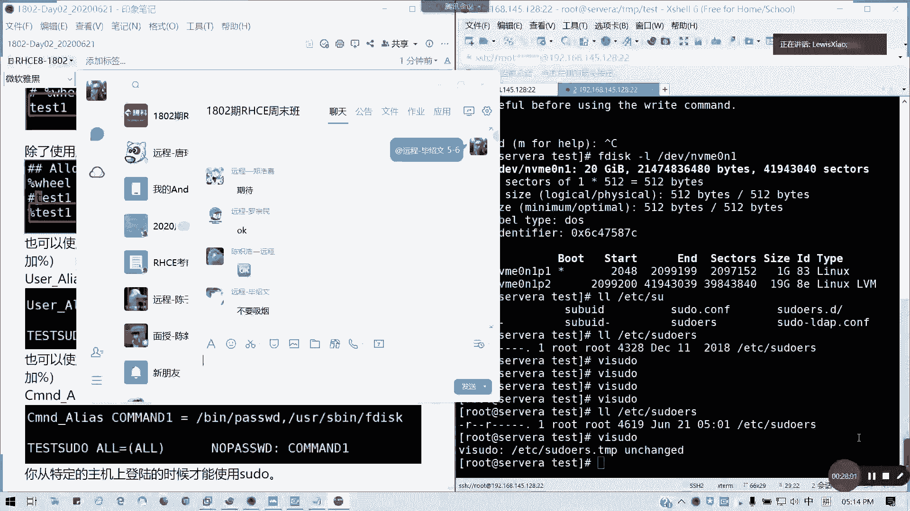

合理使用 `sudo` 可以在保证系统安全的前提下，提高运维管理的效率和灵活性。