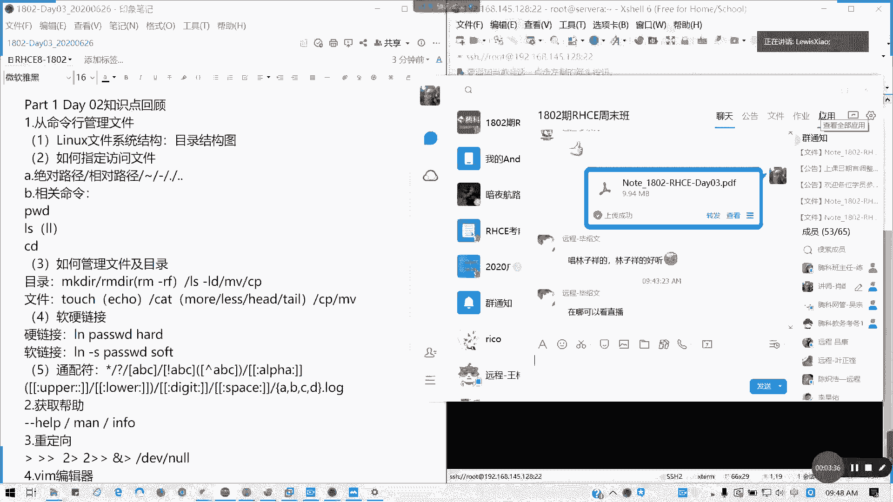
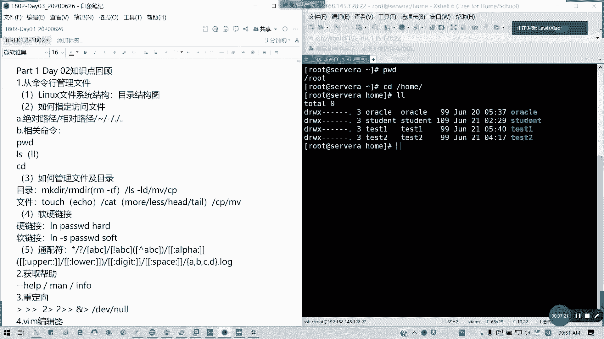
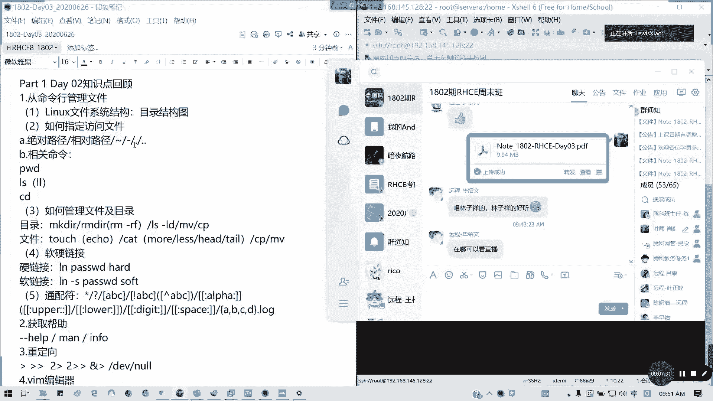
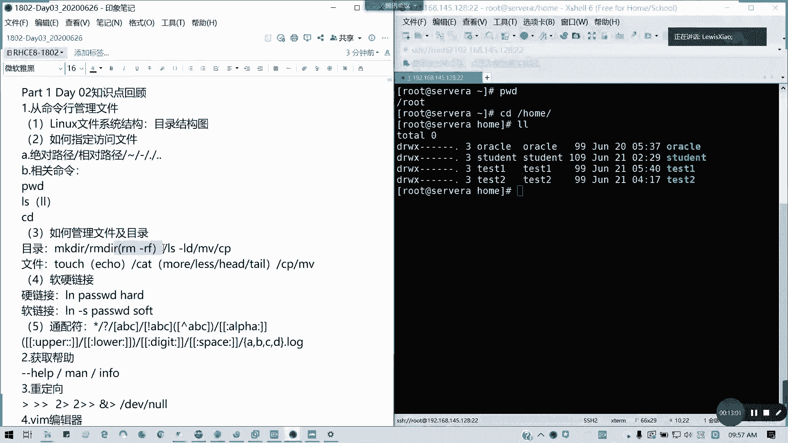
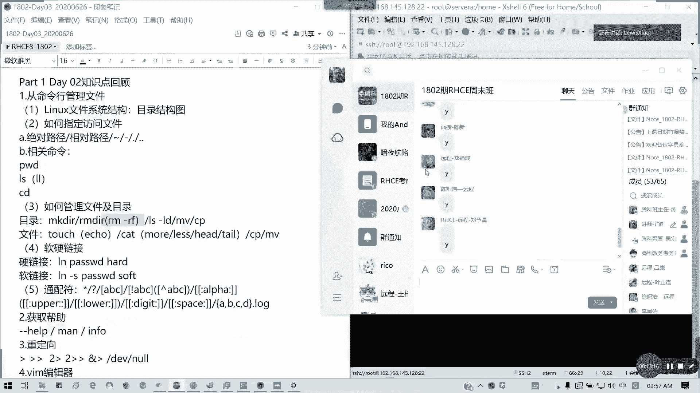
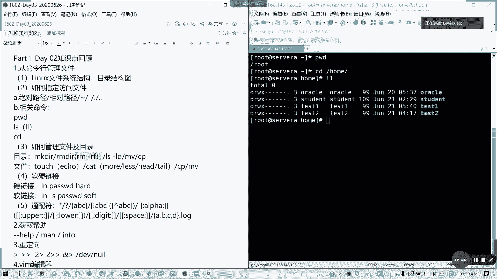
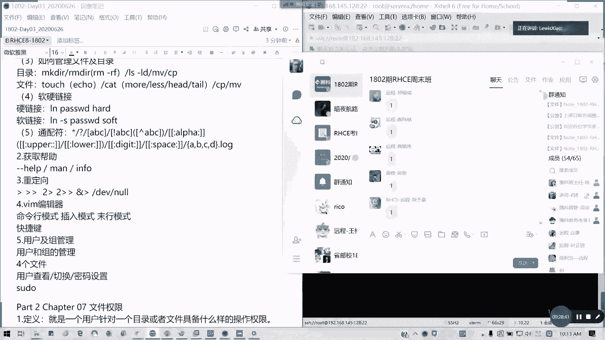

# 拿下证书！Redhat红帽 RHCE8.0认证体系课程 RH124+RH134+RH294三门认证视频教程 - P12：12_Video_Day03_Day02课程回顾 - 16688888 - BV1734y117vT

录屏啊呃欢迎大家啊到我们第三天的课程，我是小陆师兄啊。然后呢，刚才说了，如果前两天没有签课，没有就缺课刚加进来啊，就是说前两天的课没有补到，同学，麻烦看一下我的公告啊，群里面的公告，有网盘链接有视频。

对吧？视频我已经前两天已经全部传上去了，这两传上去，然后讲的比较完整啊呃。😊，就把我们先不用那个练习那官方环境，甚至我的话，我也可以不用官方境。我告诉大家，因为我现在我会我可以搭一套环境给大家都没问题。

只不过不是虚拟机里面而已，就是我们几台物理机，然后通过对吧？从一开始就是说独立的，然后做成一个受管的主机，这样子都可以。对，到时候我们第10天第九天，第十天我会告诉大家，我们课程呢现在发生了新的调整啊。

就是考前辅导原从原来一天变为两天，其他的没有变啊，下没有变课程的体系的话，按照我讲课的实际做了调整。对，还加了2块，我们在书本里面没有。但是期里面有的内容，而且非常实用，比如说你我们的链路聚合。

也就是双网卡绑定。这个的话企业是非常用非常多，但是我们现在八里面压根没讲这回这门课啊，没讲这个在7里面的HHC是有的。然后还有一个就是我们经常用到的阿帕奇，我们的web服务，对吧？虽然现在用s用的多。

对吧？用的多，但是阿帕奇还是基本的。因为我们在anible里面，我们很多的案例都会用到它啊，都会用到它最块在八里面你们书里面看不到的，对不对？考试也有一道题，在CC里面也是考的web对。C145道题。

在CSA说着一道题。但是如果不讲的话，大家我怕会生疏。所以的话我在第在第五天啊，第四就是说可能下一周日还有那个第九天的时候，我会讲增加这2块内容，增加2块内容，这个这个我觉得是有必要的。

这是我就是我这我自己啊作为讲师上课的时候，我作为一个特色的部分啊，然后然后这呢就是在下下周讲的话，我要讲一天啊，差不多4分之3到1天y的话，虽然考试好像我看到很奇怪，八的题目没考脚本。

但是我们现实中用的太多了，对吧？所以这个还是有必要讲有必要讲。然后给大家做一定的练习，练习我一大堆啊。然后呢我们说这么多废话，待会我们在课间再理一个投票的事情啊，到时大二维码我可以肯定放出来啊。

希望大家多支持啊，毕竟现在你知道在腾哥做讲师的话，真的只会讲课是不行的，还会聊还会练会聊天，还会调气氛，还会唱歌，我还演过舞台剧啊，在8000人的舞台上我都演过啊，真的对啊，这大美光灯打下来。

真的你下面时看不断，多看听到一大片的欢无生掌声，对不对？主年会主持有做过，你看现场我们也有多台多艺的人兄啊，到时希望明年真的好声音真的能够一起来，好吧？然后呢。技术呢？摆摊还是要技术，对不对？

你每两门课，你就摆一个摊，你是跟人家讲讲红帽是吧？讲讲系统的话，根本人家都不会听你，对不对？然后我们摆摊时候还要录立一个手机在这里，对不对？来来来是吧？那给我刷一个飞机火箭大炮来哈，但是你没有才艺的话。

谁去理你，对不对？好，所以的话我们言归正传啊，我们先复习一下上周内容，待会然后大家稍微休息，先复习啊，给大家15到十0分钟消话消话。然后我们今天讲7到11章啊，我们先回顾一下，我们第二天讲什么内容？

第二天我们第三章对不对？我们第二天讲3到6，大家希望跟上来哈。第三章。😊。

从命令行管理文件。首先我们是不是在开篇的时候讲了一个。文件系统结构对吧？linux的文件系统能力怎么排列的？它是一个倒倒插倒置的一个数形。然后从跟目录开始，一级级目往下分，对不对？

然后我们还讲了一些重点目录里面到底是什么用？像我们的unice软件资源USR对吧？然后我们的设备目录DEV对不对？我们的配置文件目录EDC还有我们的日志或者是一些啊像数据库等等，这些存放目录VR对不对？

还有第三方软件OPT对不对？还有我们的引导内核引导的bo特。对吧。MNT挂载对不对？SB跟并呢是指可执行文件存放的目录，就内置的啊，就我们常见的可执行文件存放的目录，对不对？还有一个是什么呢嗯。

我想想啊，还有一个是呃像root刚才讲了啊，还有哦加目录，对不对？root加目录就是杠root，对不对？root加目录就杠root，然后那个。我们现在PWD下root项目是这个啊，对吧？然后我们。

如果是普通用户加目录的话，是不是这些啊？对吧。大家把机器打开了啊，就是说我们上周装的机器打开来啊，像像我们的家木录对吧？就一些家木，然后它里面是有什么呢？环境变量，还有特殊的一些命令的别名。等等啊。

所以这个大家知道目录怎么用，我们才才知道后面后面才知道怎么放，对不对？有些人管理就乱七八糟，还有两个就是内存映射到磁板里面，它本身不占硬盘空间的两个目录，一个是pro进程process，对不对？

还有一个就ss，它是一个相当于process这个目录的一个整理，对吧？整理。所以我们平常如何我们查看我们内存跟硬盘CPU啊，不是CPU跟内存的信息，是通过通过那个pro目录去获取像CPUin啊M对不对？

你要自己得了啊，这是第一个我们就。讲到这第一第第一小点啊，明白啊。第二点，如何指定防屋文件。我们讲了好几个东西。第一个绝对路径，也就是完整的。从根目录一开始一级一级往下。

就类似于我们从我们在windows里面C盘我的电就C盘，然后是吧windows modelle等等等等下去，这些就绝对路径，相对路径呢就是你当前的路径开始一级一级往下升，对吧？波浪线两目录对吧？

一横杠上一级目录点当前目录点点上上一级，它应该是波浪线，应该上一次访问的目录才是正确的哈，上一次访问的目录才正确的。这个有没有问题？相关路径。

有问题及时在群里面提啊，及时在我们的QQ群里面提啊。然后呢，相关的查看路径命令像我们PWD刚才说的啊，PWD查看当前路径，然后LL是吧？LS杠L啊，如果我们的er里面不能打S两个L，因为它是一个别名啊。

还有CD切换目录，这个都懂啊。然后呢，如何管理文件目录，像目录的创建删除查属性移动或者改名复制文件的话，就也是如此啊，而且也是如此，同样操作，但是不要再给我犯这个错误啊，很多人还是念念不忘。

从入门到入狱啊，对吧？这个错误千万不要弄啊，因为这三个命令，上次我问的过你们区别的。了解有什么安全措施，你们自己在企业里面都有啊，包括像日质审计是吧？

运运维审计也就堡垒积这些还有包括安全系统的最小权限等等，这些都会。给你们弄的。帮你们安排的明明白白的啊。所以的话这块的话，真的如果一个新人进去把一台去搞垮，就像最近giit他ub，对不对？

就那个离职删的数据被判一年6个月，对不对？还有上次那个威盟不是直接搞垮了吗？所以这种事情的话，千万不要干，我们是一个守法合格的好公民啊，如果大家在座可能有些不像我这样我我是党员哈。

就有些人可能没有入党或这样的话，至少也是个公民，对不对？也是一个合格称职守法的一个公民，所以的话真的不要乱搞这些事情。有时候真的。一手财成千古恨啊，你倒是名名生啊、名誉啊什么你的技术全部毁誉。

但啊所以特别。包括像考试啊，我特别怕那些是其前面没学习，然后看了别人的，然后乱乱搞瞎搞。我之前有一个学员就是这样，现在我都讲我们都想劝他说你赶紧回头重造吧。他就为了什他就为了快，对吧？又快。

然后就直接报考前辅导，然后之前什么基础都没有，然后问题一堆，然后有时候要乱操作，对不对？有时所以特别啊在我讲的课程目不希望看见这种事情。因为我相信我讲我的学员里面通过率还是有保证的，没有80%。

有60%，所以的话先。看操作之前。先想想我为什么这么做，我这么做的目的是什么？有什么风险，对吧？多次审核，至少两次才把回车键按下去。对，包括企业是一样，我们企业是不是写配置变更啊，对吧？写配置变更。

写人那些对吧？一开始你要打方案，打预案，应急预案，对不对？任何的一个操不作都在写预案。然后你有你有那个目的，你的工你的操作方法，你要怎么验证，然后发现错误时候怎么回滚，对吧？还有一些相关的备注进去。

还有还还有一些。你至少不会，你旁边还有个老司机，对不对？但千万不要一个人就这样直接搞啊，特别是我很怕这种专业的天。因为我之前我也犯过错，曾经就是直接把把那个存储的链接给解了。都有。

然后做业务中到5个小时，或者是说或者是说那个。装虚拟机那个集区不稳定，结果杀毒软件发生时时，整个集群挂掉了都有，对吧？有时候真的一个一个点击的操作，真是你你影响住一大片，人家分分钟特别是那些做贸易。

做外贸的是吧？呃做金融这些分分钟挣数以万计的数以万洗十0万几百万的一个对吧？分分钟给亚马安给宝蛮蛇懂了吧？所以所以就非常的危险啊，特别是现在你们的练习环境，你们可以乱搞，但是其实麻烦你们三思，好吧。

顺明说这一点哈，就刚才刚才说的RM杠F特别要注意哈，我们增加你没问题，所以等要删的话，特别注意。对吧通常删除的话，你要。这个事你要做个东西的话，通常像我们的话是要上一级上上级的引导审批。

因为他也是要懂技术的。他要知道这个风险，如果真的有问题的话，他可以帮你背书，对不对？所谓的背书就是知道什么意思吧？帮你分担这分担责任啊，就他至少会知道怎么跟我们客户，对吧？

我们内部也有誉为我们内部也有客户的，我们内部相当是乙方，对不对？然后我们对吧？所以的话有问题他可以帮你去担分担一部分，而不是如果你真的搞错什么，而且你在做做错之前了，对吧？

如果说不不明白及时就在企业里面及时打报告，对吧？跟领导请教打及时打报告，我要说发生错误的时候来打已经晚了，发生错没马上比要说到时你自己爱缠了，自己怎么我敲错的命令是吧，把所有的事怎么办？我要就就就晚了。

因为客因为客户已经发现问题了，你已经你已经没得救了好吗？这样我已经我之前我在两年前我就被扩过绩效了，对吧？一年绩效人家拿奖金拿100，我拿50%，就是这样，对吧？每个月少拿人家几百块钱，就是这样子。

所以的话特别小心，同意的话在群里面打个Y哈。这个我特别提醒啊，特别是你们刚初学的，不要贸贸然去生产环境做任何操作，对吧？学懂再说，至少持证上岗嘛，对不对？持证上岗，这个有很有必要啊。

如果如果真的我怕很多人很危险的。

无论男生女生就是我这里班这个班好像加入的，好像昨天才加入个女女学员哈，就两三四个学员，就特别是女生的心思应该比男生会缜密一点。男生有时候真的很大条，对不对？有时候想当然就直接直接就按回去就按下去了。

真的非常危险。又不是你你你就类似于我举个例子。

你在机房，你敢直接趴总闸吗？对吧？敢直接拔网线吗？你在你你师傅要不在家试一下，绝对你很多电器的话肯定会烧的，对不对？就类似这样是吧？安全，现在叫安全生产，对不对？包括信息安全网络安全什么什么安全。

对不对？用电安全机房安全什么都有都有一都有规章制度，然后有些人就像进机房一样，直接协助踩进去，都有的，没登记，协助踩进去。然后你操作也不带那些防金电手套或者是那个套房金的手环，直接就上阵这么操作。

然后也然后如果像服务器是吧？你们应该有一个习惯，就你们进机房操作服务器的时候，应该如果服务器通了电，你要打UID灯。对不对？前后标识或贴，如果没有UID贴张纸，贴个纸条，前后贴纸条。

证明或者是把它稍微拉出来，但不要弄到歉，对吧？证明你是操作在机没有问题，而且你需要确定你的业务是停止的对吧？或者是已经迁移出去了，你才能做操作，不然的话，风险非常大，对吧？

说了这么多废话，但家希望大家都能明白，能清楚哈，真的怕出问题啊。摸到当时出去之后，哎，不小心M杠F少个点是吧？然后就就问谁家的，同科的肖老师或者小度师兄，那我不是死了吗？

对吧我们从来没有担保过教过这个的哈。这个我不知道是谁。就有有些人确实我看过是怎么操不作的对吧？然后恢复恢复对吧？我干的差不多将近9我9年多的运维经验，这些东西都不是盖的。

就我跟那些存在学校教书的老师不一样，讲是不一样，我是有企验运维经验的人，所以我也吃过很多的苦头，对不对？所以的话希望大家不要走我以前的路啊，你前路，而且而是要做每件事的话，认真思考，对不对？

这只是我在运维方面。因为你问开发他开发他不会打你的，因为开发就是他在他就是管他是要代码实验功能就行了。他不管里面有没有bug，对吧？有没有说漏洞或者怎么样，会造成什么后果，他不管的，对不对？

通常来说开发的思维是这样运维的话真的对吧？在所有里面我们叫什么叫运为运维工程师有个名字叫做背锅工程师，有什么问题，运维背锅的，对不对？从。机房设基础设施一直到你的应用层，对吧？一口黑锅在背着呢，对吧？

无论产品经理什么都怼你，对不对？但是其实对吧？背锅侠没有错啊，但你做键盘箱，你又做不了，因为你说服过别人，对吧？有项目经理产品经理在里面嚷嚷嚷嚷对吧？有问题就运维的事，对吧？

然后然后有然后最辛苦的是运为，对不对？错了问题，你在这里不用睡觉了，对吧？😊，对啊，运维啥问题都你我从技术知识做过来，我就知道了，对吧？有什么问题客户就直接怼你了。然后半夜让你重装一个云主机。

我都试过的。我在我工作早期我上夜班的时候，真的你知道那时候我这心里他的疼他妹的不爽，对不对？对吧？很正常。这你开发你不能做长久啊，开发你不能做长久，因为做了之后真的白头发了。为门可以做长久。

项目经理管理的也可以做长久。但是如果你要管理你的技术要过硬，对不对？很多人都想当老板，都要当主管，都少当经理，但是你的手心理的技术要过硬啊，你一个什么都不懂的，就像一开始这样。

一开始那个我们疫情肺炎疫情刚开始的时候，你看那个湖北那个武汉的那个卫健委主任是吧？啥都不懂，对不对？这样这种就是你的经验的缺失了，懂我意思吗？我希望我带着经验来给大家讲课，但是大家请听好好记好这些的话。

我不会在笔记里面呈现。因为也不是笔记里面我该说的内容，但这些的话，我觉得我作为一个音乐工程师，作为1个IT的人，我必须得把这个给大家说，因为很多人真的是刚毕业，还不知道外面叫天高地厚。有的学学校是吧？

你随便你这个电脑是吧？随便就一拉闸就啪了一下。我上次我我之前在学校实训，我都看到了，对吧？很乱七八糟的一些东西。所以包括你们刚毕业的人，或者是已经有工作好几年，特别是老我们这种老司机，对吧？

老师特别应该清楚，对吧？哪怕你平常老油条，但这些千万不能马虎，懂我意思吗？好，说多了哈，这文件头话还有这些操作啊。touch对吧？我们的新我们的建空文件，但touch跟 echo它有个区别。

就是touch它是完全定字节的。A口的话有一一字节对吧？一字节这个是个区别，其他没什么。然后还有如何查看文件，我们cat，然后还有包括后面4种，对不对？还有我们CPMVMV对不对？然软硬链接懂了吗？

软链接快捷方式。如果你的源头删了，你的链接就失效了。因为它它是一个新的文件，然后呢，硬链接它是一个io in指向相同的一个in。因为我们文件是存在一个in区块，I就in它是指向一个区块对吧？

指向一个文件区块。只要但是你文件不是，你文件只要在的话，它的硬链接就相当于一个多一个指向而已。所以你删除任何一个东西，它都不会删除区块的内容，所以这个是软硬链接，知道吧？通佩服懂吗？

通配符新我们通常用多的型号问号对吧？还有范围，对不对？大括号这些都用的比较多哈。好，这是。第三章的内容没有问题，请的A。一张一张给大家过。而且有些人啊跟我说，你连虚拟就重新考试的人。

连虚拟机都不会都不知道怎么导入，都有，也不知道怎么配网络。我我我昨天我心里就有一个咨询老师问我，他是97还是6过期了，然后准备考7，然后他他那个虚拟机还不会装，不会导入。那我说那我说你是不是新人呢。

全忘了。对不对？你说现在我上次第一节课是不是教了大家怎么装，对吧？怎么倒，我都说过，对不对？不要告诉我说，不要到时你你们听完之后告告诉我说不会弄。对吧这是最基本的东西啊。

viual boss尽量就是它的虚它的内线虚拟化知识不好。所以的话我们还是用VMware我们老大成熟的产品，或者是Zen都可以，对吧？都差不多，两个都是比较成熟的一个解析。

但viual boss哦一般般。好。获取方式我们简单带过是吧？有问有是男人就要man一下，是女人同样要man哈。就那manu我们的手册啊，手册里面和两个章节啊，一跟五，对不对？一跟5章节。

然后呢还有help杠杠help，简要帮助，对吧？考试包括我们实际的生产生活里面，帮助这功能绝对有的。对吧摩60不像我们的华为、斯科、opacle这些。被题库对不对？就是在那些理论考试里面。

你们根本是没办法查帮助的，对不对？但是你在linux可以那个lin全程机示，全程机逝啊。应付少用啊，像现在的话，我知道最近像就我的话，我CA认证我是其实有了的。

但是主要是我在那个就现在CA的话不止5门嘛，对不对？不要误解啊，上次有人有有有资源老师说，我在学习啊，就有可能你们有误解，对吧？就CA的话，其实不止五门课的，比如说还有其他的最最近像新的像115，是吧？

还有那些像436这些就拿了你哪怕你拿了云认证之后，你还是不够的。你其他领域你还要去学，对不对？我们数据中心，我们的安全，对吧？还有一些运维开发，像Jboss这些都有相应的红帽认证。

所以这些我也是在学习的途中，只不过我C一，我平时讲的多一点，因为我跟基础学员接触比较多，所以的话就。无论你们将来你们要往什么方向走，比如说往云是吧？往虚拟化，往数据库方向走都好。

红帽linux绝对是一个基础。因为学好lin，你基本上你外面通外面都通对不对？华为的云也是用它是吧？开源是用红的CA里面有三四门云就云方向有三四门，对吧？open open原红这407啊。

现在还有的考啊，还有那个像集群等等，这些都是跟我们传统linux命令有关。还有我们的oracle数据库更加不用说，对不对？只不过它它的系统是用acle而已，其实命令一样。对吧veware。

你的high advise，你的你的那个底层，你要做命令命行说尼员会，对不对？就除了那个文那个呃半窗口界，我们的图形界面也好，文本界面也好。但是你的命令行你还是要会，对不对？有些命令有些你真的奇怪的说。

你窗口的在哪，对不对？所以这些的linux是万能不变基础，所以希望大家真的能够学好。因为我虽然我们只有13加2的时间。好。废话有点多，我们接下来重定向重定向。记得这是什么意思啊？谁能回答我什么意思啊？

这些分别是什么意思啊？有人现场有人举手能说吗？我们是不是说的这几个东西从定向。那那想问一下什么东西？群里面啊，我们的远程的各位。如果知道的话，请在群里面告诉我，这几个是什么东西？当然还有一个啊。

第一个是覆盖啊，没有错啊，第一个是覆盖，后面是追加，然后错误信息覆盖错误信息追加，还有一个就是合并输出，对吧？合并输出你们没有没有说到，就是将错误跟正确的合并输出输出啊，什么叫黑洞路由啊。

黑洞路由就是DV那也是我们相当于垃圾桶对吧？还有一种就是标准输入输入，就是这个啊？我现成英文啊，还有这个是吧？标准说是通常干什么用呢？导入数据库的时候对吧？还有一个就是合并之后再输出也有。对吧哦，你。

应该是这样哈。应该是这样才对的啊。这这个我们少用，但是这里我也会说。懂吗？然后DEIN编辑器。大家要掌握三个模式，对吧？一开始是命令化模式，面料模式呢可以做什么操作是吧？面料模式做什么操作？

比如说DDYYP对吧？查找这些都可以，对不对？那我们切换到命令模式函模式可以切换到默寒模式，默寒模式就是一个问号麦冒号对吧？然后后面跟指令操作用的于什么呢？社高亮。保存退出不保存替换是吧？

重点写的替换替换的话，其实用SED也可以做啊，SED也可以做。后面会我们讲，就在编程我们在shall的时候SD我们SED我们讲。插入模式记住AIO。对吧AIO然后大小写分别是有区别的，懂吗？

然后还有快捷一些快捷键。对吧这个我们上上节课有讲过都明白哈。VIVIM如果你在最小化安装的时候，它是不包含这个组件的，它这1个VI的简化版。VI简化版的话是有什么区别呢？首先你没有高量，对吧？

没有高亮显示，这是最直观的，其他好像区别并不多，对吧？然后用户跟组管理，我们讲了四个文件。EDCpas war对不对？shaow。

ETC shadow纯密码的BDETC passport纯用户信息的ETC group存组信息的ETC区 shadow是存组密码的，对不对？然后呢，还有就是。如何创建修改删除用户和组。

用户如何查看切换密码设置，以及我们最后讲的一个提全。对吧属动物对不对？还记得吗？速度经常在预约里面非常多，一般我们只允许root，他root大佬吧，是吧？超级管理员啥操作都可以，包括杀人犯我删东西。

对不对？抢抢银行没有哈，这个然后那个。然后我们通常说，因为我们普通用用权限实在太小。所以的话有些我们操作我们因为需要的话，会放一些。相对安全的一些命令。然后给普通用户的话，那我们就要用到速度了，对不对？

是度编辑那个文件就可以记得是VI是度啊，而不是直接去编辑那个文件。因为编辑那个文件是没有权限的，懂吗？那这个就是我们上周。我们今天第一部分我们上周回顾内容，如果并不明白，看回上周笔记，以及看视频。

明白的话请打一，现场的请举手。都有啊。待会儿第七章讲完之后，我会有练习给大家。我们考试的模拟题。对，现场做啊。先休息10分钟，我们的稍后开始讲文件权限，好吧。大家相画一下。

