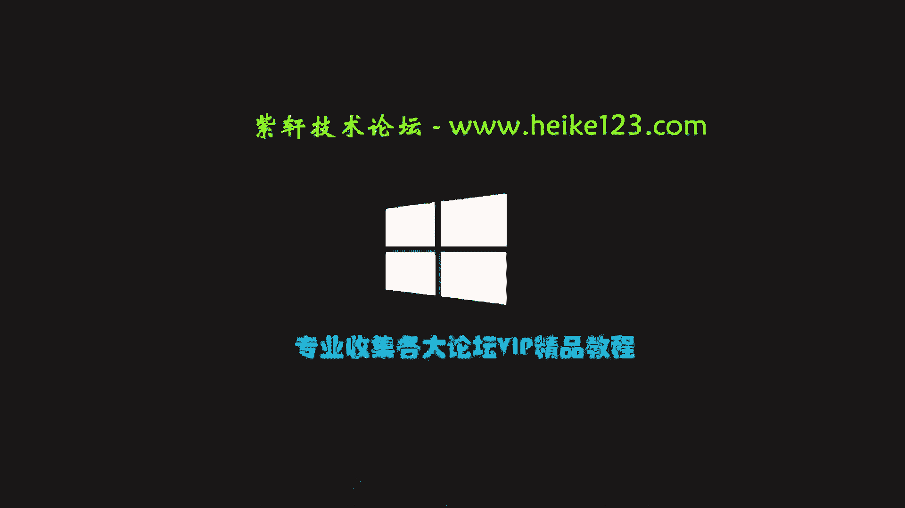
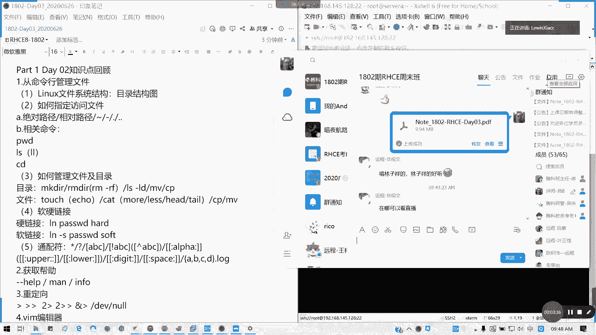
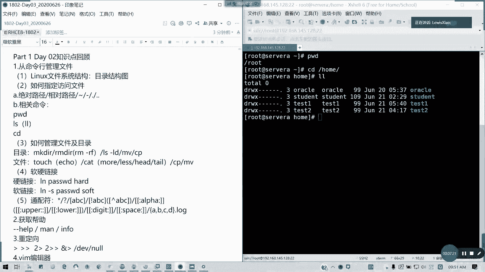
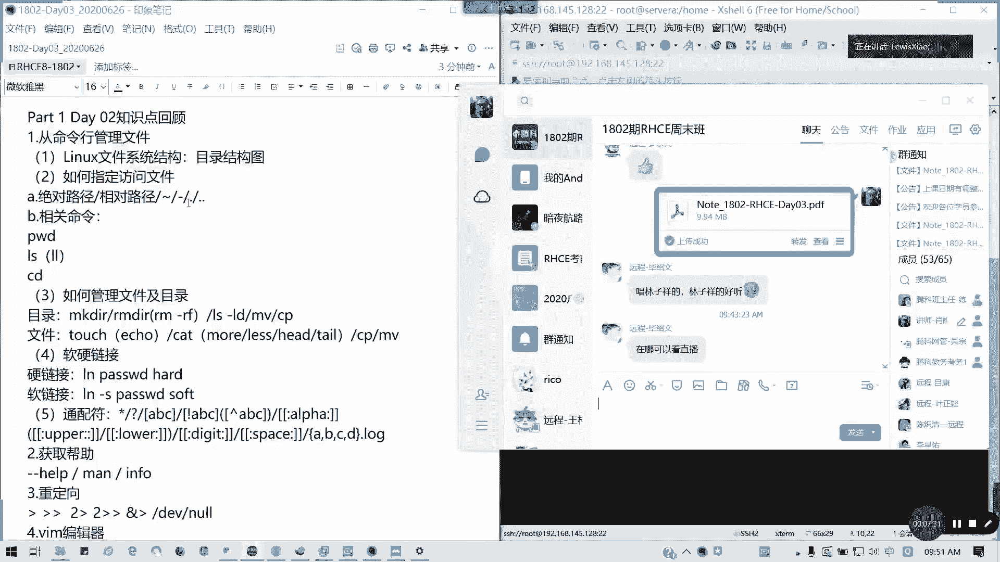
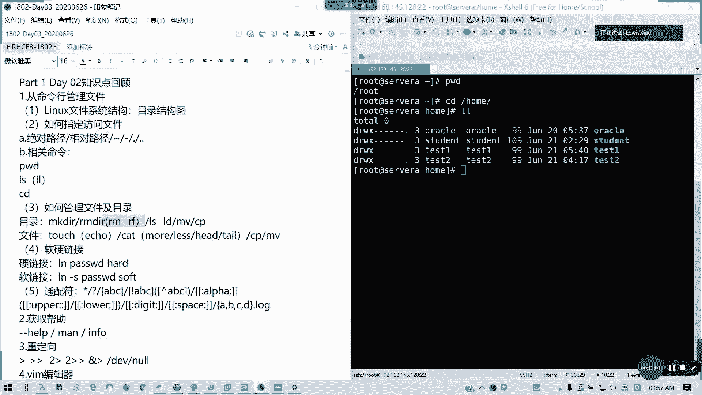
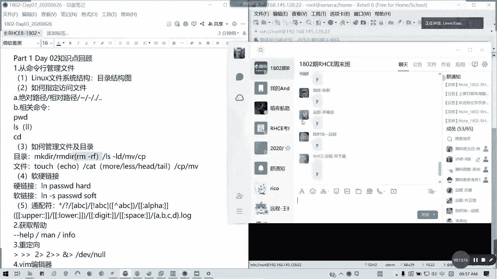
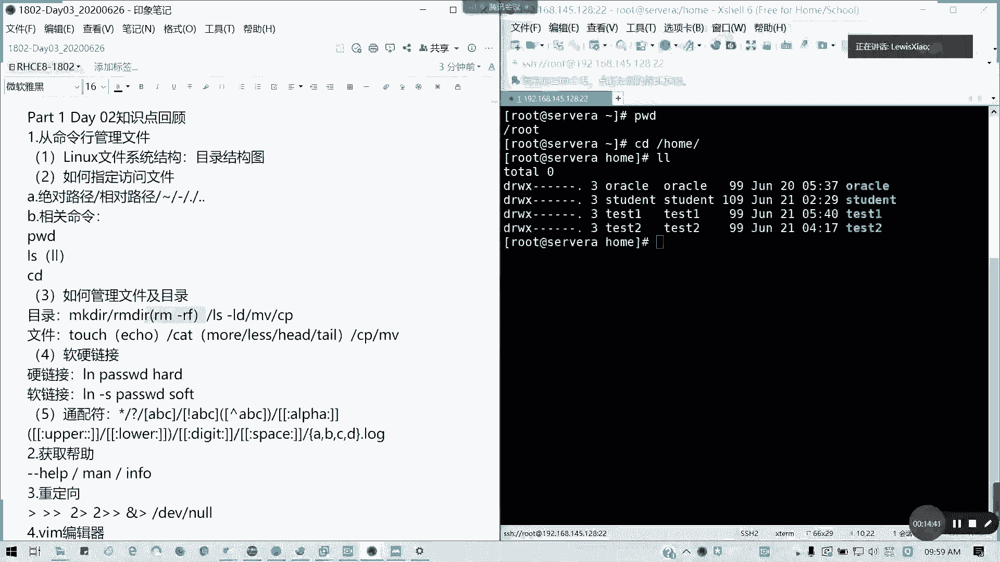
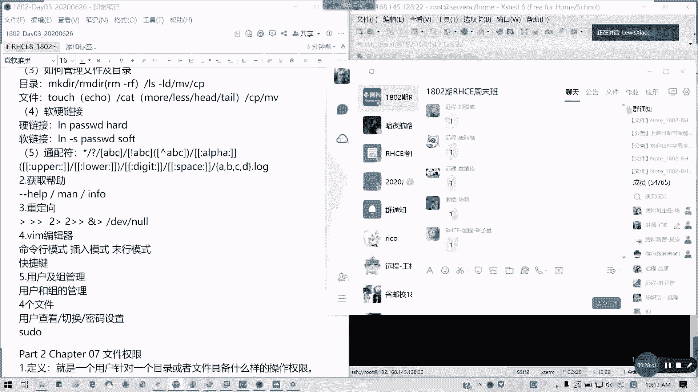

# 红帽RHCE8.0认证体系课程：P12：课程回顾与复习

在本节课中，我们将回顾第二天课程的核心内容，包括Linux文件系统、路径管理、文件操作、帮助系统、重定向、Vim编辑器以及用户和组管理。这些是后续学习的重要基础。

上一节我们介绍了课程的整体安排和新增内容，本节中我们来回顾一下第二天的关键知识点。

## 文件系统结构

Linux文件系统是一个倒置的树形结构，从根目录（`/`）开始，逐级向下分支。以下是一些重要目录及其用途：

*   **`/usr`**：存放系统软件资源。
*   **`/dev`**：存放设备文件。
*   **`/etc`**：存放系统配置文件。
*   **`/var`**：存放日志、数据库等经常变化的文件。
*   **`/opt`**：存放第三方应用程序。
*   **`/boot`**：存放系统引导和内核文件。
*   **`/mnt`**：临时挂载点目录。
*   **`/bin`** 和 **`/sbin`**：存放系统内置的可执行命令。
*   **`/root`**：root用户的家目录。
*   **`/home`**：普通用户的家目录。
*   **`/proc`** 和 **`/sys`**：内存映射目录，用于查看系统内核和进程信息，不占用硬盘空间。

## 指定文件路径

以下是管理文件路径的核心概念和命令：

*   **绝对路径**：从根目录 `/` 开始的完整路径。
*   **相对路径**：从当前目录开始的路径。
    *   `~`：用户家目录。
    *   `-`：上一次访问的目录。
    *   `.`：当前目录。
    *   `..`：上一级目录。
*   **常用命令**：
    *   `pwd`：查看当前工作目录。
    *   `ls -l`：以长格式列出目录内容。
    *   `cd`：切换目录。

## 管理文件和目录

以下是创建、查看、移动和删除文件/目录的基本命令：

*   **创建**：`mkdir` (目录)，`touch` (空文件)，`echo` (带内容的文件)。
*   **查看**：`cat`, `less`, `more`, `head`, `tail`。
*   **复制/移动/重命名**：`cp`, `mv`。
*   **删除**：`rm`。**特别注意**：`rm -rf /` 命令极其危险，会强制删除根目录下所有文件，切勿在生产环境尝试。
*   **链接**：
    *   **软链接**：类似于快捷方式，源文件删除后链接失效。命令：`ln -s`。
    *   **硬链接**：指向相同的inode（数据块），删除任一链接不会影响数据。命令：`ln`。
*   **通配符**：用于匹配文件名。
    *   `*`：匹配任意数量字符。
    *   `?`：匹配单个字符。
    *   `[a-z]`：匹配指定范围内的一个字符。

## 获取命令帮助

在Linux中，可以通过以下方式获取命令的帮助信息：

*   `man [章节] 命令`：查看完整手册。常用章节1（用户命令）和5（文件格式）。
*   `命令 --help`：查看命令的简要帮助信息。

## 输入输出重定向

重定向用于控制命令的输入和输出流向：

*   `>`：将标准输出覆盖到文件。
*   `>>`：将标准输出追加到文件。
*   `2>`：将标准错误覆盖到文件。
*   `2>>`：将标准错误追加到文件。
*   `&>`：将标准输出和标准错误合并后覆盖到文件。
*   `<`：将文件内容作为标准输入。
*   `/dev/null`：类似于“黑洞”，丢弃所有写入的数据。

## Vim文本编辑器

Vim编辑器有三种主要模式，需要熟练掌握：

*   **命令模式**：启动Vim后的默认模式，可以进行复制(`yy`)、粘贴(`p`)、删除(`dd`)、查找(`/`)等操作。
*   **插入模式**：按 `a` (光标后插入)、`i` (光标前插入)、`o` (下一行插入) 等键进入，用于输入文本。
*   **末行模式**：在命令模式下按 `:` 进入，用于保存(`:w`)、退出(`:q`)、替换(`:%s/old/new/g`)等操作。

**注意**：最小化安装的系统可能只有 `vi`，它是 `vim` 的简化版，功能较少（如无语法高亮）。

## 用户和组管理

以下是管理用户和组的核心文件和命令：

*   **关键配置文件**：
    *   `/etc/passwd`：存储用户账户信息。
    *   `/etc/shadow`：存储用户加密密码。
    *   `/etc/group`：存储组信息。
    *   `/etc/gshadow`：存储组密码。
*   **用户/组操作**：使用 `useradd`, `usermod`, `userdel`, `groupadd`, `groupmod`, `groupdel` 进行创建、修改和删除。
*   **切换用户与提权**：
    *   `su`：切换用户身份。
    *   `sudo`：以其他用户（通常是root）权限执行命令。通过编辑 `/etc/sudoers` 文件（使用 `visudo` 命令）来配置权限。

本节课中我们一起回顾了Linux系统管理的基础知识，包括文件系统、基本命令、编辑器使用和用户管理。理解这些内容是掌握更高级红帽管理技能的关键。接下来我们将进入新章节的学习。