# Redhat红帽 RHCE8.0认证体系课程：P13：文件及目录权限

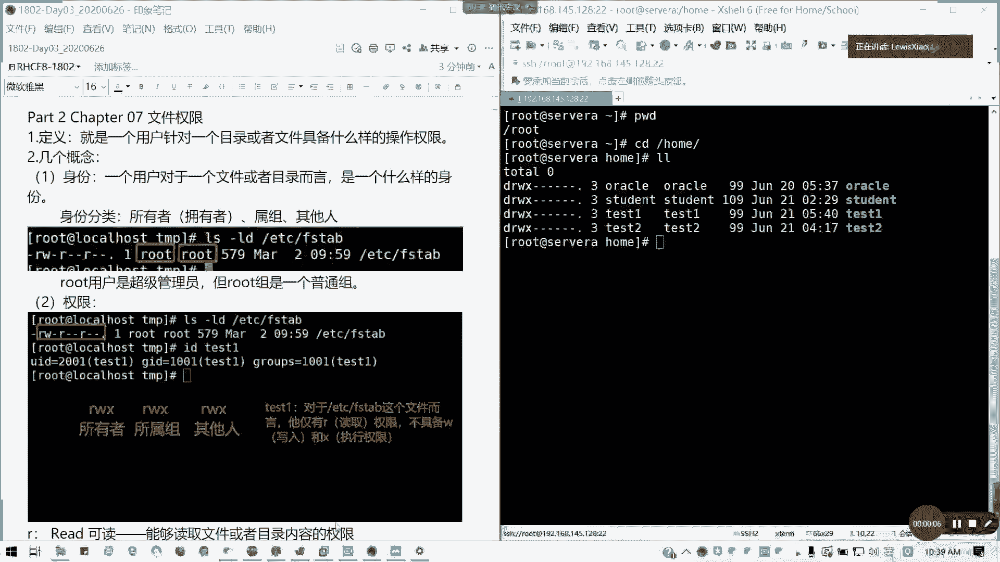

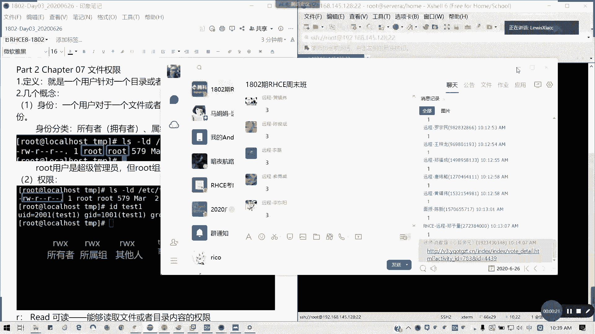

在本节课中，我们将要学习Linux系统中至关重要的文件及目录权限管理。理解权限是系统安全和管理的基础，我们将从基本概念入手，逐步深入到特殊权限和实际应用。

## 权限的基本概念

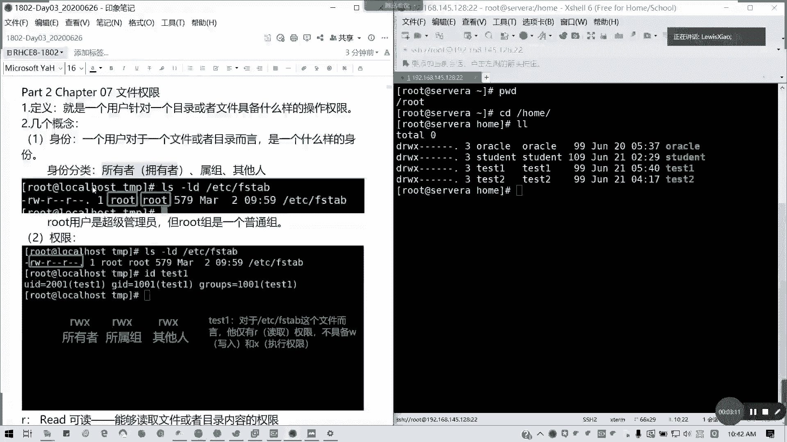

上一节我们介绍了课程概述，本节中我们来看看权限的核心概念。文件权限定义了用户对文件或目录能执行的操作，主要包括读取、写入和执行。

### 身份与操作

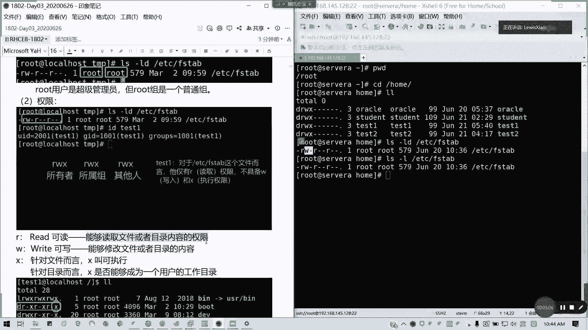

一个用户针对文件或目录有三种身份：
*   **所有者 (Owner/u)**：文件的创建者。
*   **所属组 (Group/g)**：与文件所有者同组的用户。
*   **其他人 (Others/o)**：既不是所有者也不在所属组中的用户。

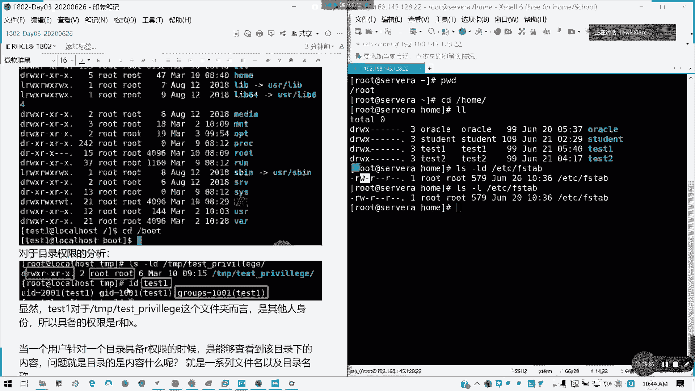

每个身份对应三种基本操作权限：
*   **读 (r)**：对于文件，意味着可以查看其内容；对于目录，意味着可以列出目录内的文件和子目录名称。
*   **写 (w)**：对于文件，意味着可以修改其内容；对于目录，意味着可以在其中创建、删除或重命名文件和子目录。
*   **执行 (x)**：对于文件，意味着可以将其作为程序来运行；对于目录，意味着可以进入（`cd`）该目录，并将其作为工作目录。

**注意**：`root`用户是超级管理员，但`root`组只是一个普通组，不具备特殊管理权限。

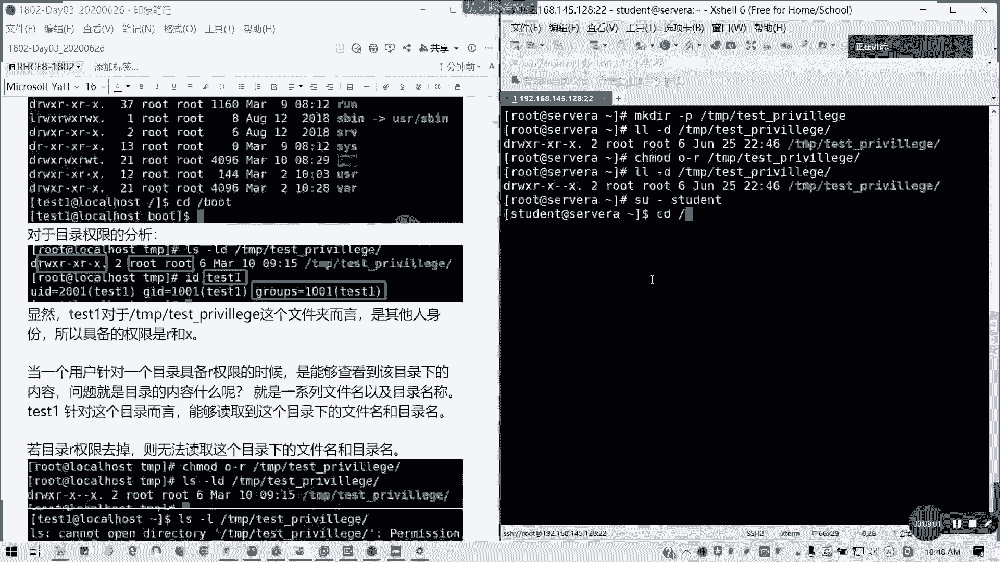

### 目录与文件权限的差异

以下是目录与文件在执行(`x`)和读取(`r`)权限上的关键区别：

*   **目录的执行权限(`x`)**：是进入(`cd`)该目录的必要条件。如果没有目录的执行权限，即使有读权限，也无法切换到该目录内部。
*   **目录的读权限(`r`)**：仅能列出目录下的文件名和子目录名，但无法查看其详细信息（如使用`ls -l`）。
*   **文件的执行权限(`x`)**：只有当文件是可执行程序（如脚本、二进制文件）时，此权限才有意义。

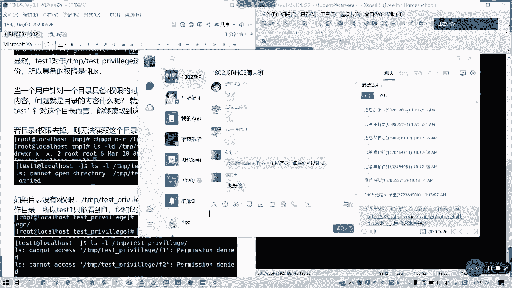

因此，对于一个目录，常见的有效权限组合是`r-x`（读和执行），单独的`r--`或`--x`通常没有实际用途。

## 查看与修改权限

了解了权限的构成后，我们来看看如何查看和修改它们。

### 查看权限

使用 `ls -l` 命令可以查看文件或目录的详细权限信息。
输出示例：`-rwxr-xr--`
*   第一个字符 `-` 表示文件类型（`-`普通文件，`d`目录，`l`链接等）。
*   后续9个字符每3个一组，分别代表**所有者(u)**、**所属组(g)**、**其他人(o)**的`r`、`w`、`x`权限。

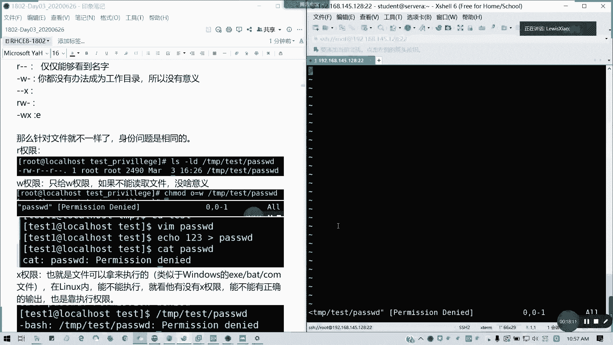

### 修改权限 (chmod)

使用 `chmod` 命令修改文件或目录的权限，主要有两种方法：

**1. 符号法**
使用 `u`（所有者）、`g`（组）、`o`（其他人）、`a`（所有人）和 `+`（增加）、`-`（移除）、`=`（设置）符号进行操作。
格式：`chmod [ugoa][+-=][rwx] 文件/目录名`

以下是常用操作示例：
*   `chmod u+x file`：给文件所有者增加执行权限。
*   `chmod g-w file`：移除文件所属组的写权限。
*   `chmod o=r file`：设置其他人权限为只读。
*   `chmod a+x file`：给所有用户增加执行权限。

**2. 数字法（八进制法）**
将 `r`、`w`、`x` 分别视为数字 4、2、1，将每组权限的数字相加，得到一个三位数。
格式：`chmod XYZ 文件/目录名` （X代表所有者权限值，Y代表组权限值，Z代表其他人权限值）

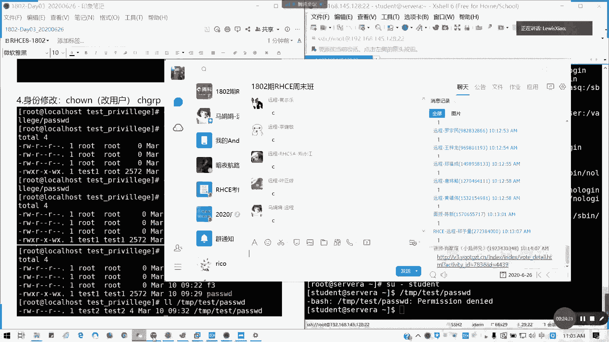

以下是权限值计算示例：
*   权限 `rwxr-xr--` 转换为数字：
    *   所有者：`rwx` = 4+2+1 = **7**
    *   所属组：`r-x` = 4+0+1 = **5**
    *   其他人：`r--` = 4+0+0 = **4**
    *   命令为：`chmod 754 filename`

## 修改文件所有者和所属组

有时我们需要改变文件的所有者或所属组，这需要使用 `chown` 和 `chgrp` 命令。

*   **`chown`**：修改文件的所有者和/或所属组。
    *   格式：`chown [所有者]:[所属组] 文件/目录名`
    *   示例：
        *   `chown user1 file`：将文件所有者改为 `user1`。
        *   `chown :group1 file`：将文件所属组改为 `group1`。
        *   `chown user1:group1 file`：同时修改所有者和所属组。
        *   `chown -R user1:group1 dir/`：递归修改目录及其内部所有内容的所有者和所属组。

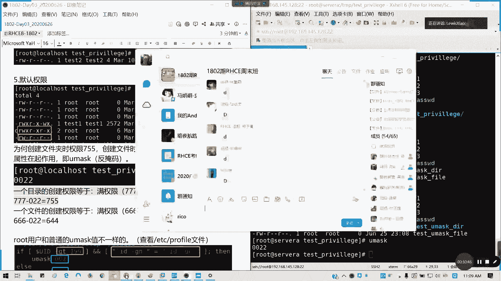

*   **`chgrp`**：专门修改文件的所属组（功能已被 `chown` 包含）。
    *   格式：`chgrp [所属组] 文件/目录名`
    *   示例：`chgrp group2 file`

## 默认权限与umask

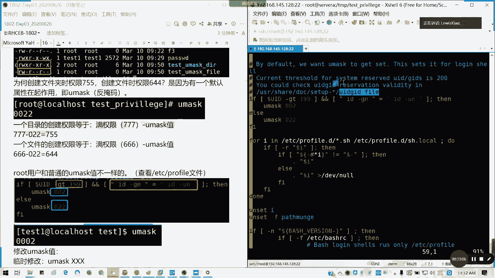

当我们创建新文件或目录时，系统会赋予一个默认权限，这由 `umask`（用户掩码）值控制。

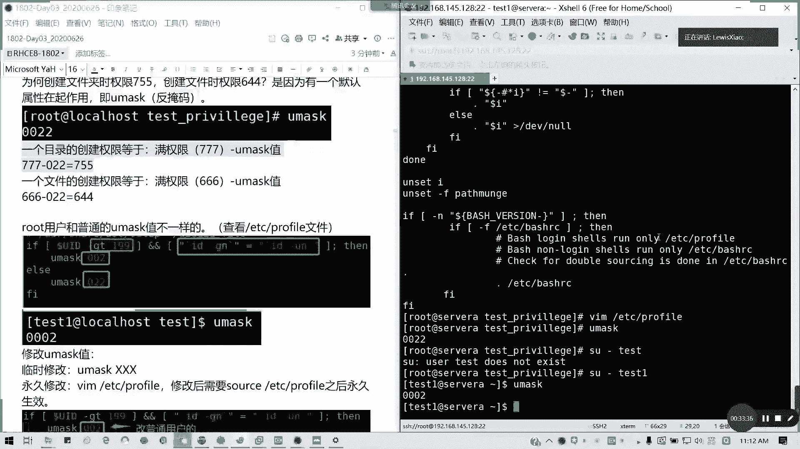

*   **目录的默认最大权限**：`777` (`rwxrwxrwx`)
*   **文件的默认最大权限**：`666` (`rw-rw-rw-`，文件默认不带执行权限)

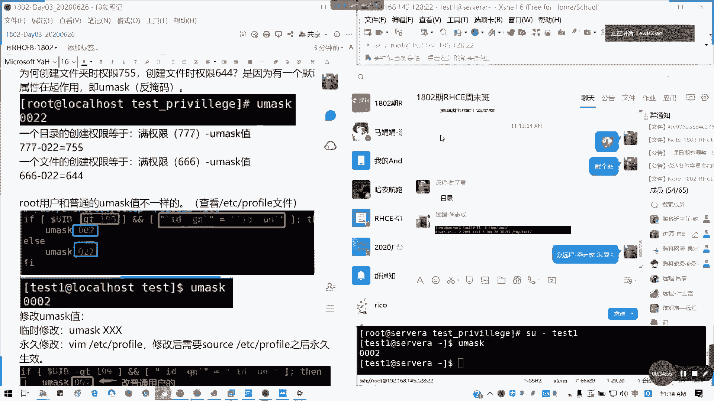

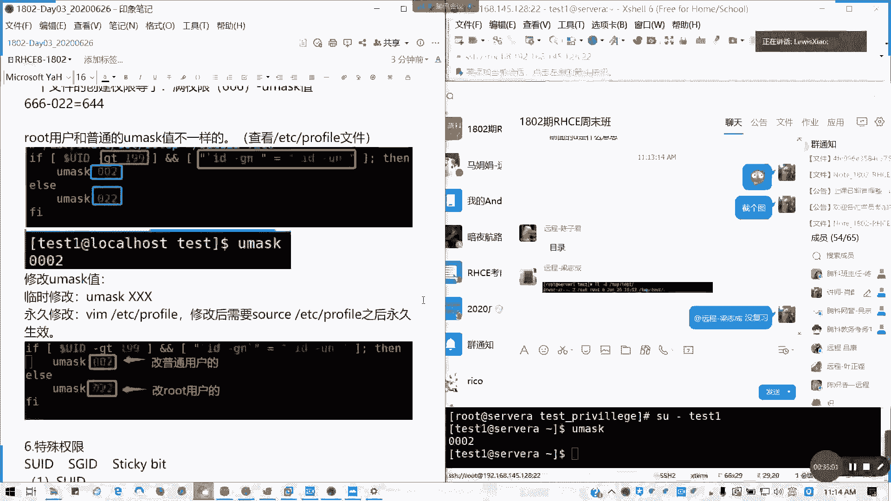

**实际默认权限 = 最大权限 - umask值**
`umask` 值通常为 `022`。

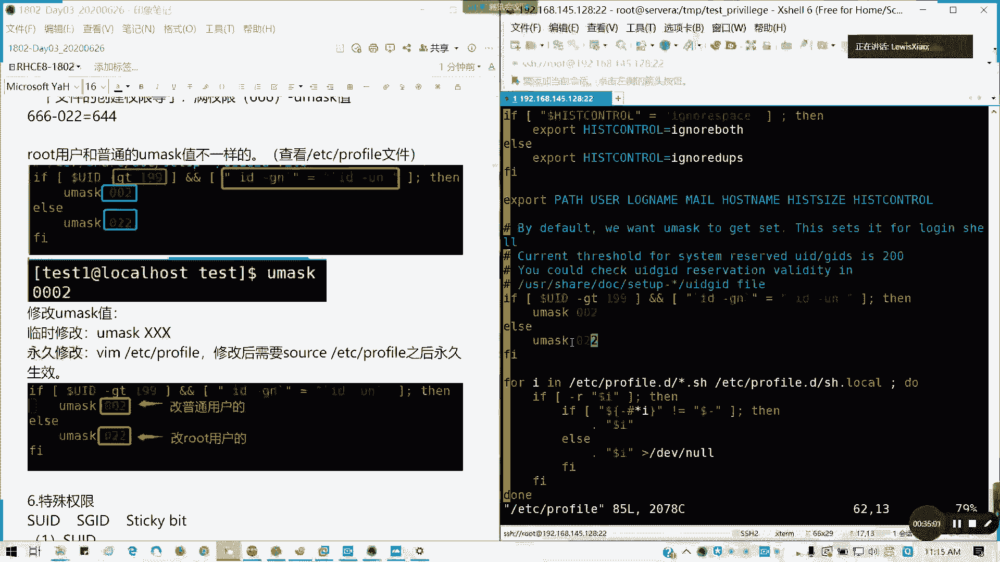

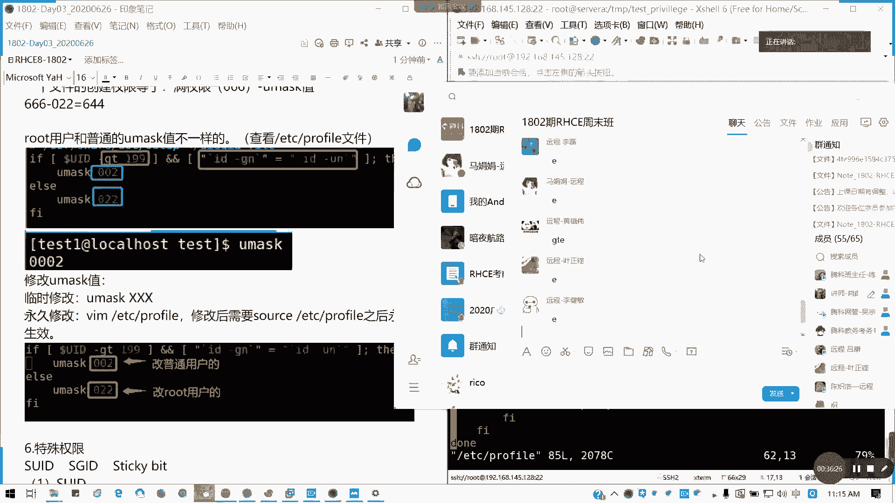

计算示例（umask=022）：
*   新建目录权限：`777 - 022 = 755` (`rwxr-xr-x`)
*   新建文件权限：`666 - 022 = 644` (`rw-r--r--`)

**查看与设置umask**：
*   `umask`：查看当前umask值。
*   `umask 027`：临时设置umask为`027`（仅当前shell生效）。
*   永久修改需编辑shell配置文件（如 `~/.bashrc` 或 `/etc/profile`）。

## 特殊权限

除了基本的rwx权限，Linux还有三个特殊的权限位，用于实现更高级的功能。

### SUID (Set User ID)

当**文件**的所有者执行位是 `s` 而非 `x` 时，表示设置了SUID。
**作用**：任何用户在执行该文件时，都将临时获得文件**所有者**的权限。
**典型应用**：`/usr/bin/passwd` 命令，普通用户可借此修改自己的密码（实质是修改 `/etc/shadow` 文件，而该文件通常只有root可写）。
**设置方法**：
*   符号法：`chmod u+s file`
*   数字法：在普通权限前加`4`，如 `chmod 4755 file` （`4755`中的`4`代表SUID）

### SGID (Set Group ID)

SGID可应用于**文件**和**目录**。
1.  **对文件**：作用类似SUID，执行时临时获得文件**所属组**的权限。
2.  **对目录（更常用）**：在该目录下创建的任何新文件或子目录，其所属组将自动继承该目录的所属组，而不是创建者的默认组。
**设置方法**：
*   符号法：`chmod g+s dir`
*   数字法：在普通权限前加`2`，如 `chmod 2755 dir`

### Sticky Bit (粘滞位)

仅对**目录**有效。当目录的其他人的执行位是 `t` 而非 `x` 时，表示设置了粘滞位。
**作用**：在该目录中，用户只能删除或重命名自己拥有的文件或目录，即使该目录对所有用户都有写权限。`root` 用户除外。
**典型应用**：系统的临时目录 `/tmp`。
**设置方法**：
*   符号法：`chmod o+t dir`
*   数字法：在普通权限前加`1`，如 `chmod 1755 dir`

## 文件扩展属性 (chattr/lsattr)

`chattr` 和 `lsattr` 命令用于管理文件的扩展属性，提供更底层的保护。

*   **`lsattr file`**：列出文件的扩展属性。
*   **`chattr +i file`**：给文件添加`i`（immutable）属性。文件将**无法被修改、删除或重命名**，即使是root用户。这是最强的写保护。
*   **`chattr +a file`**：给文件添加`a`（append only）属性。文件**只能追加内容，不能覆盖或删除**原有内容。
*   **`chattr -i file`** / **`chattr -a file`**：移除对应的属性。

**注意**：这些属性在文件系统级别生效，优先级高于普通的`rwx`权限。

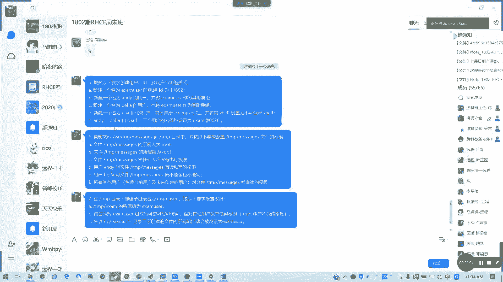

本节课中我们一起学习了Linux文件及目录权限的完整体系。我们从最基础的身份和读写执行概念讲起，学会了使用`chmod`、`chown`修改权限和归属，理解了`umask`如何影响默认权限。进而，我们探讨了SUID、SGID和粘滞位这三种特殊权限的用途与设置方法，最后了解了`chattr`提供的文件扩展属性保护。掌握这些知识，是进行系统安全配置和用户管理的必备技能。