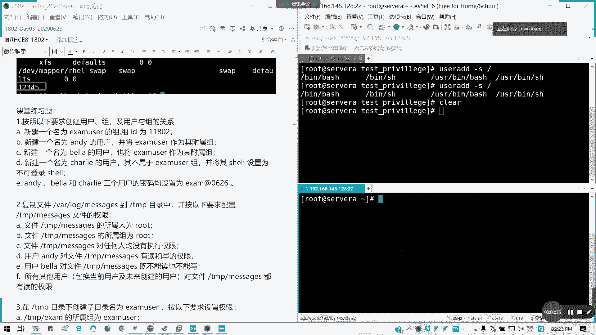
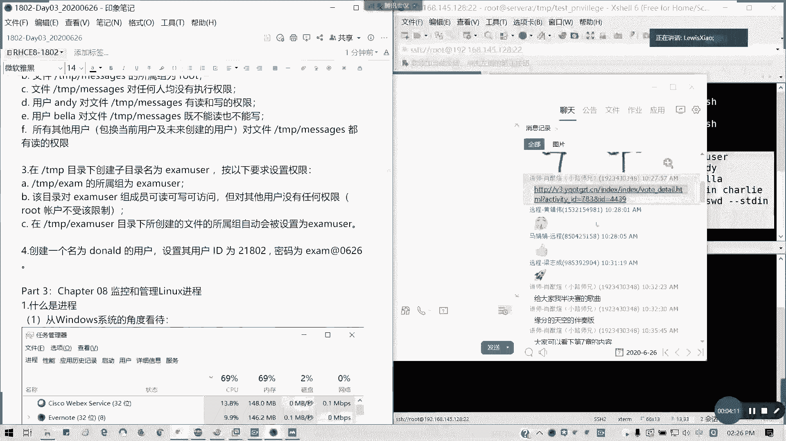
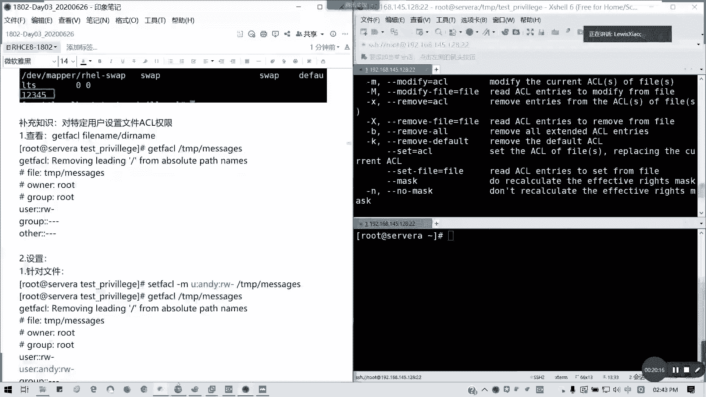
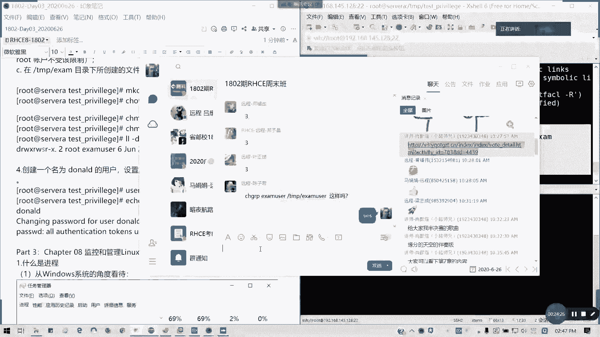
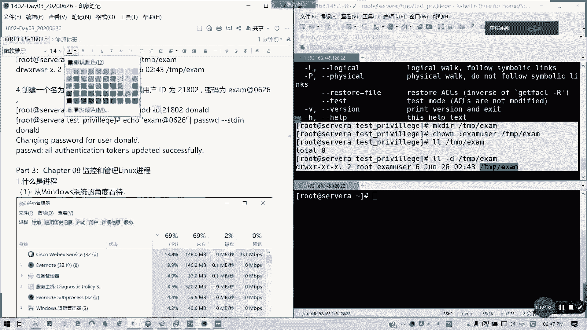

# Red Hat RHCE 8.0 认证体系课程：P14：文件及目录权限练习


## 概述
在本节课程中，我们将回顾并完成上午留下的四道关于用户、组和文件权限的练习题。通过这些练习，我们将巩固对用户组管理、文件权限设置以及访问控制列表（ACL）等核心概念的理解。



---

## 第一题：创建用户组及用户关系
上一节我们介绍了用户和组的基本管理命令，本节中我们来看看如何应用这些命令完成具体任务。

题目要求如下：
1.  创建一个名为 `user` 的组，组ID为 `11802`。
2.  用户 `andy` 和 `bailey` 的附属组为 `user`。
3.  用户 `chloe` 不属于 `user` 组，且其登录 shell 为不可登录类型。
4.  所有用户的密码均设置为 `redhat`。

以下是解题步骤：
```bash
# 1. 创建组
groupadd -g 11802 user

# 2. 创建用户并指定附属组
useradd -G user andy
useradd -G user bailey



# 3. 创建不可登录用户
useradd -s /sbin/nologin chloe

# 4. 为所有用户设置密码
echo "redhat" | passwd --stdin andy
echo "redhat" | passwd --stdin bailey
echo "redhat" | passwd --stdin chloe
```

---

## 第二题：配置文件权限与ACL
完成了基础的用户组创建后，我们进入文件权限管理的练习。本节将涉及标准权限修改和高级的访问控制列表（ACL）设置。

题目要求如下：
1.  将 `/var/log/messages` 文件复制到 `/tmp` 目录下。
2.  设置 `/tmp/messages` 文件的所有者和所属组均为 `root`。
3.  移除该文件的所有执行权限。
4.  为特定用户 `andy` 设置对该文件的读写权限。
5.  为特定用户 `bailey` 设置对该文件无任何权限。
6.  为其他所有用户（包括未来创建的用户）设置对该文件的读权限。

以下是解题步骤：
```bash
# 1. 复制文件
cp /var/log/messages /tmp/

# 2. 修改所有者和所属组
chown root:root /tmp/messages

# 3. 移除所有执行权限
chmod a-x /tmp/messages

# 4. 为andy设置读写权限（ACL）
setfacl -m u:andy:rw- /tmp/messages

# 5. 为bailey设置无任何权限（ACL）
setfacl -m u:bailey:--- /tmp/messages

# 6. 为其他用户设置读权限
chmod o+r /tmp/messages
```

### 补充知识点：文件ACL管理
在第二题中，我们使用了 `setfacl` 命令为特定用户设置权限，这涉及访问控制列表（ACL）的概念。

*   **查看文件的ACL**：使用 `getfacl [文件名]` 命令。
*   **设置/修改ACL**：使用 `setfacl -m [条目] [文件名]` 命令。条目格式为 `u:[用户名]:[权限]`（用户）或 `g:[组名]:[权限]`（组）。
*   **递归设置ACL（针对目录）**：使用 `-R` 选项，例如 `setfacl -Rm u:andy:rwX /some/directory`。注意，目录的执行权限 `X` 是大写，表示只对目录本身或已有执行权限的文件设置。
*   **删除单条ACL记录**：使用 `setfacl -x [条目] [文件名]`，例如 `setfacl -x u:andy /tmp/messages`。
*   **删除所有ACL记录**：使用 `setfacl -b [文件名]`。

---

## 第三题：配置目录的组权限
接下来，我们练习如何设置目录的权限，以实现组内成员的协作访问。

题目要求如下：
1.  在 `/tmp` 目录下创建子目录 `exam`。
2.  设置该目录的所属组为 `examuser`。
3.  设置该目录的权限，使得 `examuser` 组的成员拥有读、写和执行权限。
4.  设置该目录的权限，使得在此目录中创建的新文件，其所属组自动继承目录的所属组（`examuser`）。

以下是解题步骤：
```bash
# 1. 创建目录
mkdir /tmp/exam

# 2. 修改目录所属组
chown :examuser /tmp/exam
# 或使用 chgrp examuser /tmp/exam

# 3. 为所属组设置rwx权限
chmod g+rwx /tmp/exam
# 或 chmod g=rwx /tmp/exam

# 4. 设置SGID位，使新建文件继承目录的所属组
chmod g+s /tmp/exam
```
完成以上操作后，可以使用 `ls -ld /tmp/exam` 命令查看目录详情，权限中的 `s` 表示SGID位已设置成功。

---



## 第四题：创建指定UID的用户
最后，我们回顾如何创建具有特定用户标识符（UID）的用户。

题目要求如下：
1.  创建一个名为 `owner` 的用户。
2.  指定其UID为 `21802`。
3.  将其密码设置为 `redhat`。

以下是解题步骤：
```bash
# 创建用户并指定UID
useradd -u 21802 owner

# 设置用户密码
echo "redhat" | passwd --stdin owner
```

---



## 总结
本节课中我们一起学习了通过四道综合练习题来巩固Linux用户、组和文件权限管理的知识。我们实践了：
1.  使用 `groupadd` 和 `useradd` 创建组和用户，并管理附属组关系。
2.  使用 `chown`、`chmod` 修改文件的标准所有者和权限。
3.  使用 `setfacl` 和 `getfacl` 命令管理文件的访问控制列表（ACL），实现针对特定用户的精细权限控制。
4.  通过设置目录的SGID特殊权限，实现组内文件共享的常见需求。
5.  创建具有特定UID的用户账户。



这些技能是系统管理员进行日常资源管理和安全配置的基础，请务必熟练掌握。