# 拿下证书！Redhat红帽 RHCE8.0认证体系课程 RH124+RH134+RH294三门认证视频教程 - P15：15_Video_Day03_Ch08a_进程管理 - 16688888 - BV1734y117vT

北京时间3点03分啊，下午的3点01分啊，北京时间下午的3点01分，我们来讲那一个服务管啊，进程管理管监控和管理进程。什么是进程呢？我们从windows的系统看待，是不是我们这里啊，打开任务管理器。

对吧？任务管理器这里的话，是不是在进程的一个个，对不对？包括应用，包括我们的后台。对吧那进程呢就是相当于它是通过一个执行一个。静静态的程序，然后触发的对不对？我们我们运行一个程序是相当于启动一个进程。

对不对？对吧？可以理解成静态程序触发了一个动态的一个进程。它进程是相当于是动态的，程序是一个文件，它是一个摆在那里的，对不对？这个能理解吗？进程怎么来的？比如说像我们的我们的外 web box是吧？

我们的那个比如说我们的一个就是说我们思科的一个网络会议的一个程序。当然像我们腾讯会议也是一样的，对不对？它是有具体的一个文件来出发的，对不对？像我们的这个我们这里的一个叫做腾讯会议，对吧？

打开文件所在位置，是不是它就通过这个文件外微m点APAPP是吧？通过这个文件来触发它的一个进程，它里面是不是它下面是有运行的就3个对吧？一个进程里面三个线程文件，对不对？进程呢，它是一个动态进程。

然后它占用多少资源呢，对吧？比如说像我们程序会议是吧，3点几，然后占用200多兆内存对不对？那它网速它的它的磁盘，它网络等等，对不对？然后系统里面有多少进程呢？我们看这里啊，像我现在这台电脑。

我现在这这台机器，你看241个对吧？241个进程，3000多个县程啊，进程里面会产生现成的，懂吗？比如它的子进程。然后我们还要知道哪一个进程占用资源多跟少，对不对？我们通常从CPU对吧？

我们通常从CPU从内存，从硬盘的读写去考虑啊。从CPU内存硬盘读写的的这个情况去考虑懂吗？也就是说，比如说他这个程序占了1%几，比如说我们把它列出来。像这里的话CPU噪用比较大的这个录屏，对不对？

对吧我图图这是录屏，然后像我们内存占量比较大的是我的印象笔机跟腾讯会议，对不对？然后硬盘通常因为我这里是SSD，所以占用了免赔太多少。像我的带宽占用到大就是我们腾讯会议，对吧？

然后我们要考虑这个进程是不是运行是正常的。也就是我也就是我们的正常情况下，我这进程应该占用这么多资源吗？这也是要考虑的，对不对？然后还有一些有没有不正常的竞争存在，对不对？比如说木马病毒。

还有什么挖矿的、僵尸的，这些会不会存在，也要想想，对不对？然后还有就是我们的现在的操作系统占有多少资源，然后剩下资源有多少，就重点是CPU内存硬盘。像我这台的话。

我这台是我以前就是说我现在之前一直在用的一台二合一的平板，就I7的850内存16G，对不对？就可能内存16G呢，在我们教跑教学跟跑那个IH4就是跑虚拟机的情况下，确实占用会比较大，对不对？

但是在64G内存情况下，你看现在10%几。对吧那相信大家都基本上如果是16G内存机器，基本上跑了六七十了，有吗？有吧，至少有五六十吧。有吗？只6G32G的内存应该就是20%几，十几20应该有的，有吧。

30多可。45你跑这么大。30的话，4G四五G算很小的了，对不对？像我这台我又开开一台虚拟机开的情况下，我就占用10个G也差不多16%。然后硬盘的话，你看基本上对吧？因为是SSD的关系对吧？很小，对吧？

这网络带宽稍微占占微大一点，那后CPU呢，因为是在录屏，包括我们在好虚拟机关系所以一直在30%左右波动，啊，像其他什么显卡这些你看基本上我的读显是用不着的对不对？独显用不着极显的话用那么一点一丢丢。

对吧？所以有时候真的概域维的话，读显是用来浪费的。可以这么说。就我做纯粹的不做设计，对吧？不做设计，不做影视。就纯粹做预母的情况下，你是不是CP你这个GPU基本上用了浪费了，对吧？

因为现在的核显的性能非常强，对不对？然后像像像那个以太网，我的网卡其实还好，现在只是用到了1个USB的网卡，我没有用到它本身的。然后我的wifi也没用wifi我这里还是wifi6的网卡，对对？

英特的H叉201。所以的话其实呢像磁盘的话，现在基本上都是很低的。你如果是用那个机械盘，你才知道什么叫延时大。对吧像固态化基本上我这个两年前的PM961还是跑的很顺的哈。

然后然然然后这个是就说自带机芯配的这一个ET，对不对？所以这这个配置呢，其实我觉得这个CPU稍微弱一点，其他都还好啊都还好。就主要我们这个资源是吧？资源像我们CPU利用率在35%以前是80%的啊。

然后它的那个进程线程数，然后还有内存是吧？我实用中是吧？有点我可用这么多是吧？以前的话你看下有点是吧？有点闷水，对不对？那么硬盘。硬盘的话，这个是正常，只通了1%、2%、3%、4%差不多正常的对。

像我们的wifi或者是我们的那个有线网卡都是一样的，懂吗？然后我这是从windows上面，windows上面看这种情况，其实做同样作为操作系统。我们的linux系统啊，linux系统也是要注意啊。

也要注意这些东西。比如说我们进程的来源啊，进程来源同样的啊，同样是分析在那种的，懂吗？然后我们的进程拥有者啊，就我们之前不是提到吗？我们在提聊那个SUID的时候，就不是聊到进程拥有者的问题，对不对。

SUD还记得吗？早上我们聊的。就是说我们一个普通用户，我们加到SUID之后，他是不是用他的所有者来运行的那我们就聊到这个东西了，对吧？进程在读取或者写入文件的时候呢，是采用这个拥有者的身份。

也就是他的所有者的身份来读取跟写入的。所以呢我们针对需要读取跟写入的这个拥有者呢，必须要有权限，对吧？你这个进程你你既然你是他跑的那这个权限，你基本的权限你应该有对吧？不然你你这进程怎么处理程序。

怎么处理东西，对不对？你没读跟没写，那你进程是不是运行运行不起来，对不对？比如说我们进行的拥有者啊。不一定是你执行这个文件的用户。比如说。我们loot用户。去执行engs这个进程。

那engs进程拥用者是不是root啊，不是啊，对不对？我们安装我们装engs这个中间键的时候，通常它的用户是engs用户，懂吗？他会帮你创建一个eng用户，像阿帕奇对吧？

我们的web服务也是用阿帕奇去运行的，他不会占用root这用户的，他有一个专门的用户来跑这个进程，明白我意思吗？像mysqcle也是一样的，他有个myqcle用户，对不对？

还有就是通常啊会在服务的配置文件定义它的拥有者。比如说我们的HTPD像我们在那个HTTPD点com，它就会定义说你的拥有者是谁，对不对？就我们看到HTTPD点com这个这个配置文件啊。

你们如果有印象的话，我们到我们词点会在讲啊，词点会在那个额外内容会讲我们这个内容呢，就是说我通常它定义的话，比如说passWD是吧？谁执行就是谁的，对不对？paswD这个。这就讲到进程的一个拥有者问题。

能明白吗？能明白吗？线上的我看一下啊。能明白吗？可以吗？可以打个打个一啊。就从linux我们AB已经说了。然后第C个第C点啊，查看和验证这个进程会占多少资源。对吧这个在linux上，我们通过top。

通过PS这些命令都可以查。这我们后面会再讲，对吧？照样我们在不同的操作系统也我们也要查这些东西，这是第三点。第四点。分析这个进程是否符合于预期，什么意思呢？也就是说我这个进程我运行了。

是不是按照我这个设想去走的？就是我我实际上比如说我用1G内存，对吧？我的这存占1GB，但是它偏偏就跑到了3GB。对吧当进进城他降的能这么大。那有时候你这个预期。

你这个就说超出预期的一个它的进程的一个执行操作，有时候会往往会伴随着大量消耗你的一个系统资源。所以这时候我们要分析它为什么要占用这么大，对吧？所以这个也是一个预判我们对进程管理的一个中一个其中的一点哈。

就说运行，我明明就就我这我就一块大饼就好，你要看就就好像我们人吃饭一样。我明明吃一碗饭就行。平常你放在一碗饭，你为什么现在吃两碗三碗，对不对？同样的道理。

你要去预判你要去分析到底这个进程是否是在自己在我们理想的范围内，这我们设想范围内。如果超出哈，我要看为什么。第五点，我们要看一下整个系统里面的进程数量状态，以及它占用的一个资源排序。资源排序呢。

比如说像CPU按CPU排，哪个占样多是吧？内存，哪个占用多硬盘，哪个是最号IO的对吧？网络也是哪个是占网络比较多的。然后呢，通常我们就是这些进程啊，有单吃CPU的，就是那个计算型，对不对？计算的。

然后吃内存的对吧？比如说他一开始要占用很大的空间是吧？然后然后其实就其他的都没有，然后硬盘的经常读写，对不对？经常读写数据的那就是还有网络型，就是吃带宽的懂吗？然后还有就是。你既然你这些进程你执行过。

你要看看你剩下的资源有多少。懂吗？你这个你系统肯定是有预留的，对不对？你不可能说哎。我机器我就配一个这个8G内存，我这个进程偏偏跑到了78G。那你这个系统没预留的话，你系统是不是其他你不用跑了，对不对？

你的你的你的环境，你的程序，你的环境，你的这些对吧？你的守护进程，你后台那些东西你还要占内存呢？那你不可能说8G全部给他跑满，那跑满，我们机器是不是跑不动啊，就像人我们超负的工作一样。

你是不是就抽不开身。明白我意思吗？所以我们。系统资源啊当前是否足够，如果以及未来收候是否会增加，或者是我们爆发我们那个我们这种并发啊，不知道爆发啊，我们并发是怎么能支撑到的一个服务，对不对？有时候。

像有一些情况，我们的进程会产生并发，也就是说我们可能流量大了，对啊？或者是我们突然间多人访问，那会不会产生一个高峰。那这高峰你能不能撑得过去，所以有时候你这真的就是说我们有些配置不好的一些环境呢。

就我们进程报一爆的话，你系统马上会死掉，对不对？特别windows很明显lins的话就会产生。比如说你的CPU读取延迟大，然后IU硬盘IO出现卡顿，对不对？或者是你的内存已经开始吃你的交换分区了。

那这种种种情况呢，就证明你的资源已经不够了，明白我意思吗？就像我们的电脑配置一样是吧，你你的电脑配置，你的内存，包括你的硬盘就决定了你的资源有多少，你的运行效率可以到哪哪里去，可以理解吗？

所以为什么一开始我我说这个环境，我要强调环境啊，强不强调环境的话，你们就拿一台4G内车，然后给我跑给我给我跑这个跑一个数拟机。你是想死呢，还是想死呢，还是想指呢？对吧。现在你看笔记本电脑都8G起步了。

以前4G起步还大有大有的。在在更这早以前，因为之前的系统系统还没那么是吧？界面还那么没那么丰富，功能没那么强大之后，你像以前的windows95，你看像这一开始3。1。

你们可能现在很少人就接触那些脑系统，像我的话，我是从dos开始玩起的，我从95年开始接触电脑，然后玩到现在二十几年啊，就接触现在二十几年，然后小时候电脑课时真的是有时候太调皮的。

然后一开始就电脑啊自己电脑就染向病毒啊或这些的。我我是从3。2windows自从3。2开始玩起的。然后9598就又玩过，像以前你看有时候真的像dos64K内存那么了起来，对吧？像现 win98的话。

16兆内存都能跑，但现在你看看一个win10，你没4G你跑得起来吗？对吧这离子词现在是一样的。

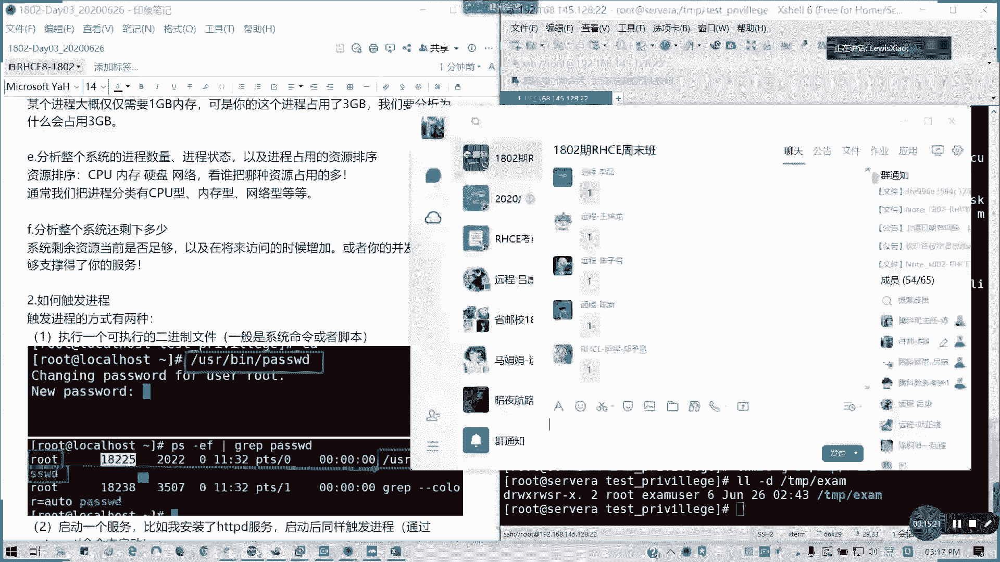

好，我们讲完我们要分析我们要看待的一些资源过后呢，我们看如何触发进程啊，如何触发进程进程的方式有两种，比如说我们可以执行一个二进制文件。比如说我们的pasWD对不对？我自己清一下屏。然后切换到加目录。

比如说我user，我们执行一个绝对路径passWD对不对？对吧直接个进程之后，我们打开一个新的窗口啊，我们打开一个新的窗口，我们来复制一遍，然后复制个绘画。那么们看一下啊。我上下对比会更明显啊。

左右的话有点小。然后我PS杠EF我们看一下PS命你可查看它对的进程的。grape grape是截取的意思，也就获取它的所需的字段，我们就获取它的passWD这个程序的字段。

是不是我们这里是不是已经在执行了，然后它的进程ID是6202，对不对？在我这里的18225，对不对？懂吗？然后以root用户来执行，看到没有？

PS是查看进程的一个叫做process state进程状态啊。还有我们启动一个服务，比如说我们这里的HTTPD，我看一下这里样源好像这里不知道装装不装的了的这个服务啊没有配的话，估计装不行啊。

这里因为我们没有配啊，没有配，没有注册，所以的话默认样面是不能用的，所以我们要自己挂来一个样源啊，比如说我们这里啊，我这里我就不演示了，就这里的话，比如说我安装了一个HHTTPD啊，我装了一个外部服务。

然后同启动后同样触发进程，对不对？

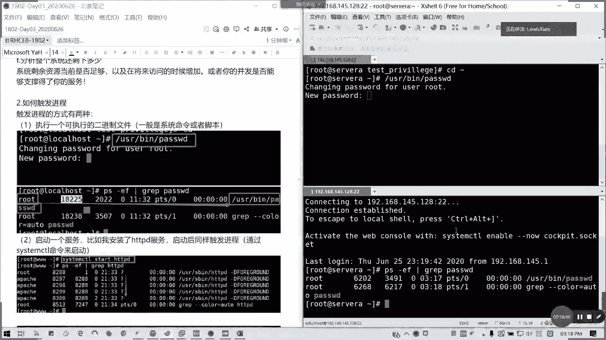

对吧我们这里题目the systemstem star之后，我们对着图，然后我们看到是不是它会产生一系列的一个进程啊？懂吧。同样在HCPD点service这个文件里面也有定义，它启动是怎么启动的？懂吧？

也有啊，这个我们大概知道一下就清楚了。好像大家没有什么问题，那我们继续讲。

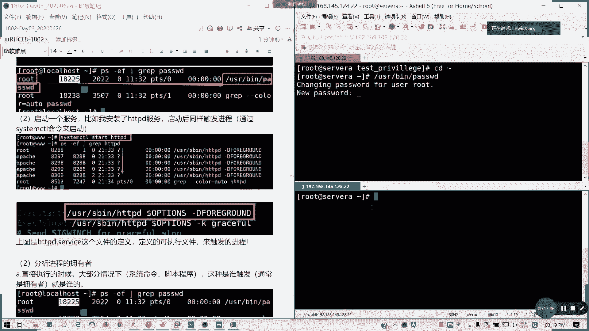

然后呢，接下来我们分析竞程的一个拥有者。我们回到这个图来啊，非竞争拥有者大部分呢直接执行的时候，大部分情况下谁处犯就谁的。懂我意思吧？然后呢，还有啊就是你这个执行文件，如果某读取某个配置去启动的情况下。

他会读取这配置文件内容，然后配置文文件内容就会定义他用的者。比如说我们刚才讲的HTPD像。

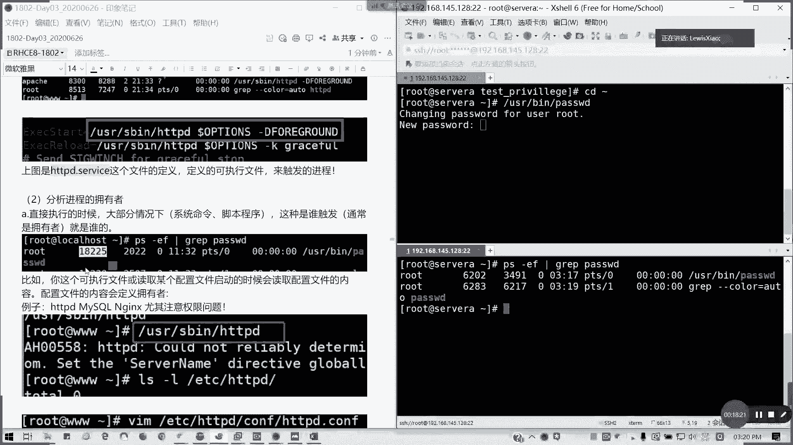

engines对不对？

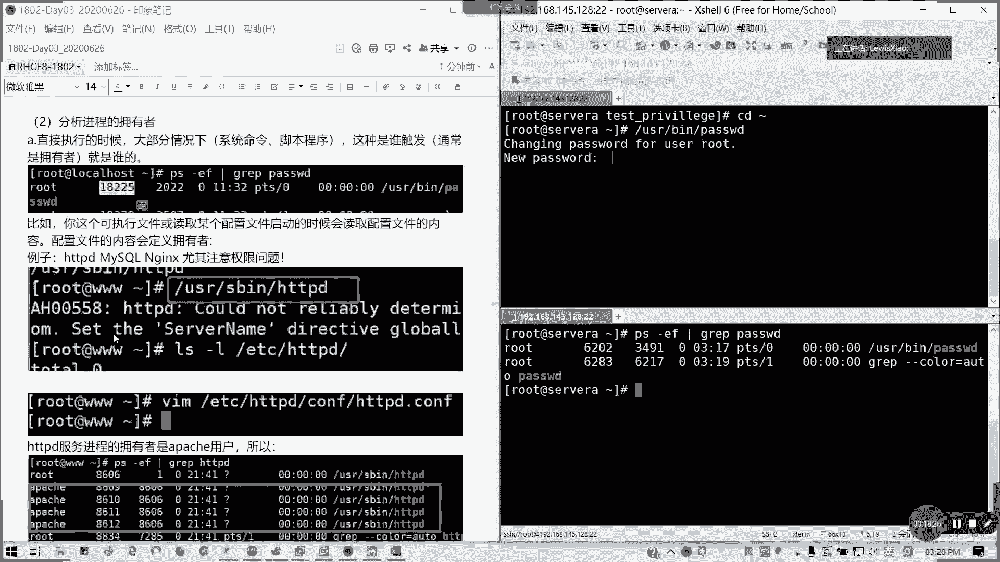

像engs，然后还有那个my circlecle，对不对？看我们这里图我们不用看了吧，它这里的话，你直接执行是执行不了的。然后我们看这个阿帕奇，我们看这个HTTBD点com这个文件，对吧？

看这个文件之后，我们可看到它的进程用户者是阿帕奇用户，但我这里没有装，哦，这里没有装，我回头我待会再下课的时候，我我挂个镜像装装起来，大家一看就知道了，好吧。

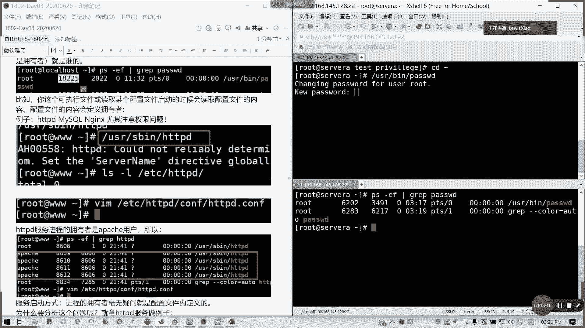

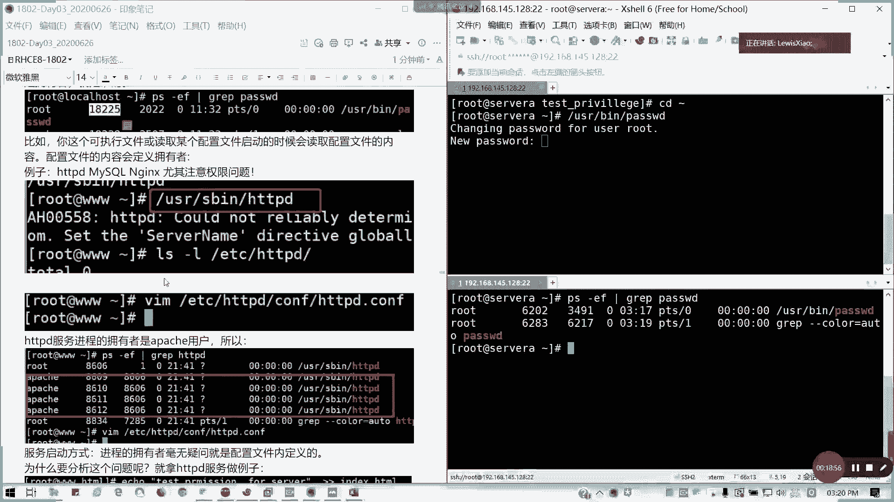

所以我们的HTPD进程是阿帕奇，对不对？然后服务启动进啊，我们所以呢我们的服务启动方式呢，进程的拥用者对于我们服务来说，它是配置文件里面定义的，而不是我们谁就谁执行就谁的这不不是啊。

为什么要分析这个问题呢？是不对？比如说我们就拿我的外部服务做例子。我们呃比如说我就检查我就检测，我就简单写一个。所谓文件，那访问呢它是这样子的，我们通常我们的网页呢。是访问他是访通过服务来访问，对不对？

通过服务来访问，不是我们通通常的访问网页。我们通常是通过服务去访问它的内容，而不是说你直接去获取它的文件，对吧？像我们的web，我们去访问一个网页这里的例子啊，就是相当于一个客户端和服务器是吧？

我们客户端，我们访问个网页，由服务器来处理它读取文件，然后通过HTTP服务去读，然后生成的结果响应给客户端，然后用客户端展示出来。我这里要不我先挂一个镜像吧，挂一个镜像，然后我把那个样源配起来。

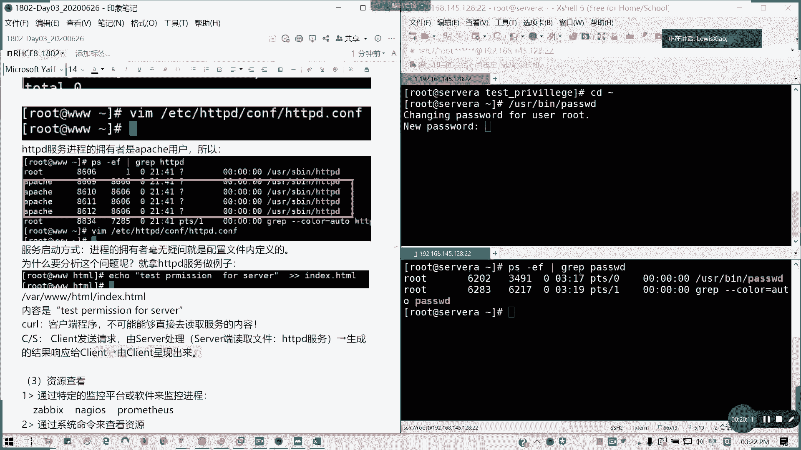

这样的话我也是会清楚一点，好不？就刚才这么说的话，好像大家也是有点误水啊。

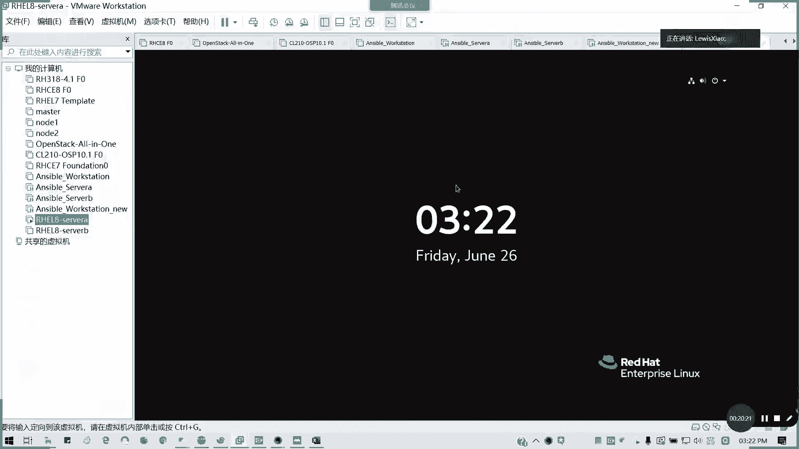

我先把镜像挂起来。

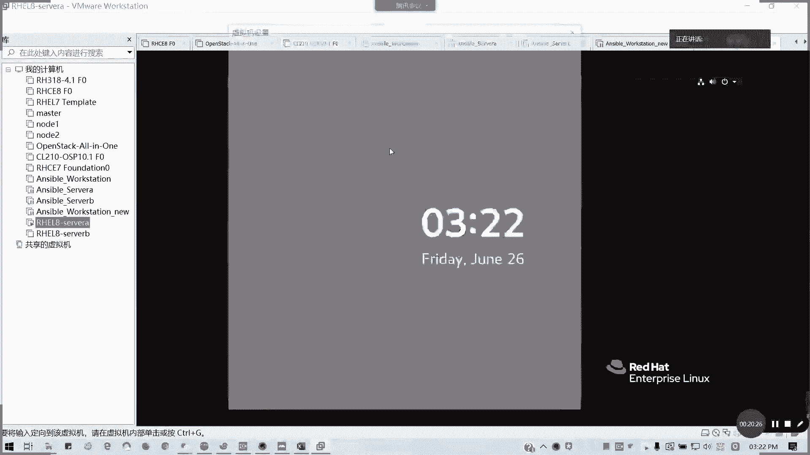

这里挂了哈挂了一个镜像，然后我们这里的话我们临时冒一下好了，我把镜头这个停掉，然后mountt我们创建个MNT创建1个SO吧。哎哎就先大教大家怎么挂载啊，我们挂载光驱是挂载SR啊。

不是MNT我们先创建挂载点，比如说MNT点那个SO是吧？然后呢。

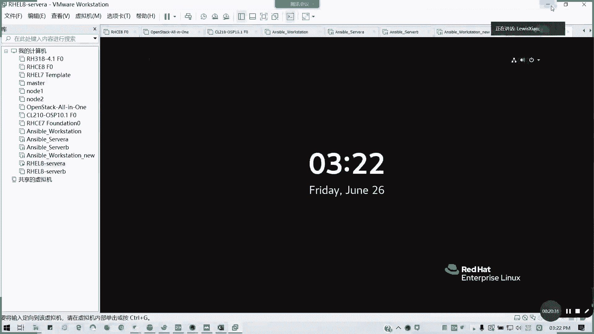

うん。帽子对吧？DVF20，这是光驱的一个设备。我们临时挂载就可以了。MTSO是吧？它是个。读就写保护，然后只是只读的，然后我们配置个样源。在那个linux8里面要配置两配置两个，一个是有baseOS。

一个是Fune，因为它是分开的对吧？它分开的两个。那我们看一下啊ETC。要点report选D，然后。我就写写成一个就可以了。教大家如何配置样源哈。HL8这个我们在后面第14章。

安装跟管理软件报的时候我们有讲到，那这里我先配啊。🎼然后呢，我们主要是一个name是吧？我们要配置两个。一个在807跟8是不一样的，8是分为两个，一个叫基本系统，一个叫应用流。

也就是baseOS跟F dream。如果7的话，就总统称就一个就够了。我们这里是配置本地样源啊，nb等于IHE8。🎼baseOS，然后我们的地址哇这这有不要高亮可以吗？noHL不要让它高亮，然后唉。

我撤我又撤回来了，等一下啊，name等于IL8baseOS。然后我我的。基本URL。就这我们这里用fire，为什么本地的那个？我们用本地文件要约fire协议两想斜杠。但是因为我们这个挂载点是吧？

我们从根开始，所以这里要三个斜杠。我们直接挂一个挂在点就行MTISO，然后里面有个叫baseOS。光盘的目录结构里面有啊ISOS然后呢。是否启用是吧？很这之前有人在群里面问的对吧？enableable。

然后说说的少最低，对不对？然后不进行完整性检查。等于0。然后同样我们把这几行，我们用5YY还记得VIM是吧？1234，我们5YY。然后在下面P一下，对吧？你有复制了吗？然后这里我们改成叫F dream。

就是我们的应用流，它是把这系统组件跟我们的应用组件是分开的。然后这里呢啊这里留个空格给他啊，然后这里的话我们就叫F dream。好，保存退出。那我们我们这边我们就。我们在8里面是用DNF的。

或者是样都可以。但是现在通常改名FDNFDNF这个在实质上会讲，当然这个也不是地下城与永生的DNF也不是毒奶粉啊，俗不是我们俗称就叫毒奶粉，好吧，然后呢那个DNF是吧？呃，我们先清掉原有的缓存。

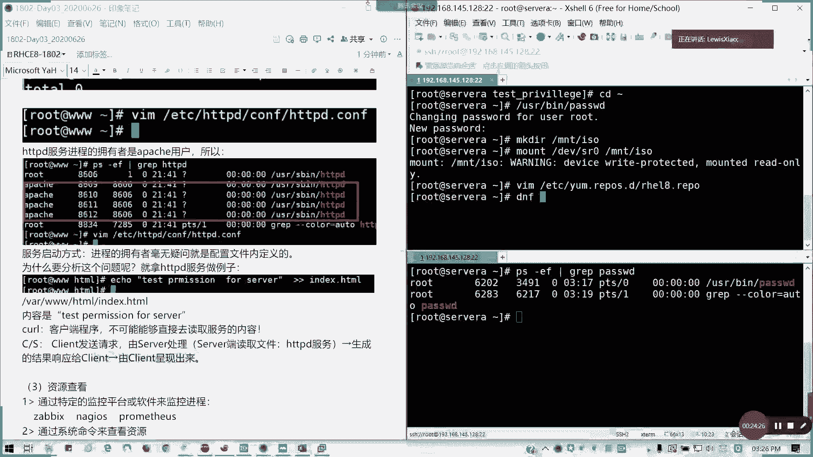

然后呢，DNFback。我们新我们我们新建一个缓新一个原数据缓存，那我们就可以我们看一下DNFre list。对吧我们获取到6000多个包baOS1658，然后就用留4672。

那我们就可以装一个我们这里例子的HTTPD服务了。好吧，只要我们让源获取得到就可以了。这个内容呢，我们在十4章会讲这里我在强调14章会讲这个详细的配置。但现在给大家有一个留一个印象哈，印象。

那我们这里怎么装服务呢？直接DNF。

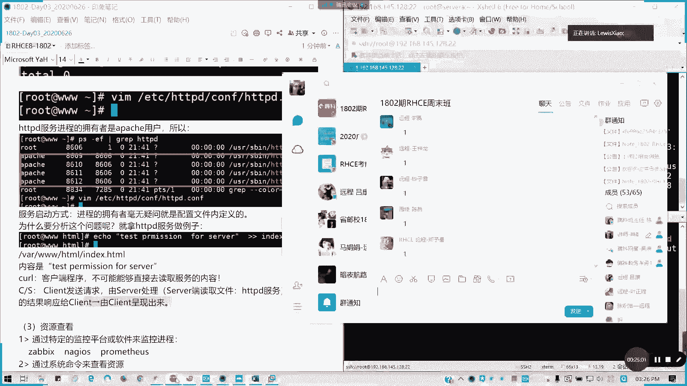

Install。杠Y就是他问询问的时候，我们直接全部都是Y过过。然后HTTPD。可以了。然后我们现在我们看一下啊，现在还我们还没有看到那个HTTPD幅，对不对？

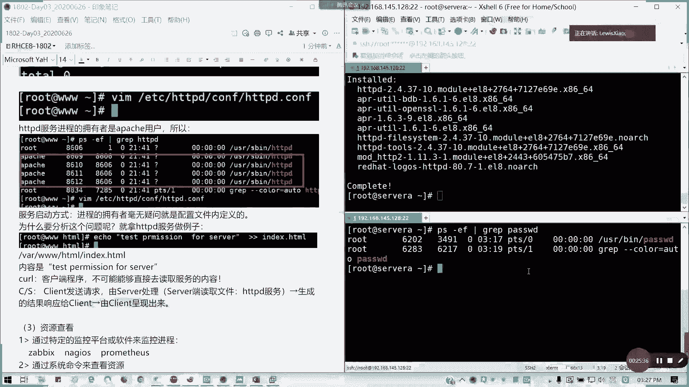

现在没有啊，那我现在把服务起来。服务怎么起？我们下章会讲的就是sstem control是吧？star hTPD如果是要en的话，你就就启动启用的话。

在8里面是可以sstem control enable，然后杠杠闹是可以这么做的。但是在7这条命令是行不通的啊。我们回车，然后我看一下进程。是不是开始来了。还没起来啊。

是不是有HTPHTTPD的竞争起来了，对吧？但这里好像还没起动，还没起完呢。来，我看一下。对吧。他产产生了一系列的一个子一系列进程，对不对？懂我意思吗？就在这里。然后如果你直接执行的话是吧。

直接执行不带参数。他会报错的。我这里要注意一下权限问题。它这里的话我们已经在执行了啊，我们不能直接说这么这么启动服务的，懂吗？这里现在已经在执行，所以的话我们我们可以stop掉，我们再看一看。

再启动的话，肯定会报错的。现在。是不是一个镜头没有了，除了他的break之外，那这样直接服启动的话肯定会有问题的。他是找不到他会找不到你这个看一下啊，这样启动其实没有问题。如果说我们我们没有指定的话。

对吧？它其实也是调坠文件，这样启动问题也不大。然后我看它进程起来没啊？同样建设起来，但是他没没带任何参数啊，通常我们还是不要这么做啊。对吧他会那个HDP点service，对？他不能。

他那个就是那他服务控制不了这个进程了，所以我们还是用stem controll来。我们此此刻就QO算了。然后我们重新启动这个进程。从请用这个服务。说记得大家不要从直接可执行文件去启动。

因为它这个参数会调动会有问题的。我看有人是不是要想睡觉了，对不对？然后呢。像我们如何去定义竞升所有者，我们直接看一下这个文件VIMETCHTTPD是吧？com。

我们看这个是我们阿哈奇我们的HTTPD服务的HTTPD的那个配置文件，对不对？在这里。他定义的端口定义了配置文件目录，然后还他还定义了我们的。看到没有？看到没？他的用户跟左是用阿帕奇来进行的。

所以我们看到这里。那就知道了吧。懂我意思吗？那呢比如说我们就写一个配置文件来，然我们怎么调用，对不对？我们那个。就ele。Test page。然后直接。追加到。

🎼VR默认目录VR3WHTML它默认这个页面是空的，就是这里的话默认主页是空的，没有文件的。我把它追加过来，然后我们看一下我们在别的机器能不能访问啊。我们在本地试一下能不能访问就行了。QQIL然后这样。

搜我A。我们搜备B没开哈。对吧如果我们写入一个默认主页之后，它是通过读用HTTPD服务来读取这个网页文件解析出来，返回结果，然后给了客户端，我们才能返回这个页面，对不对？而不是说我去直接去读取这个文件。

懂我意思吗？它是通过进程来解析这个页面的对吧？这就是一个我们的一个过程啊，就晋程用者我们的一个例子分析的一个过程。能明白吧？然后接下来资源如何查看资源查看我们查看资源，我们有特定的一个监控平台。

像大家接触过像我们单位里面用过的像javis，对吧？javis，然后是吧？普通比修斯，就这些这些监开源监控平台都很多。还有像我们购买的像比如说像北塔啊等等，对吧？都有这些监控工具。

然后还有呢就是系统命令PSPS tree，还有top，还有一个就是我们用脚本也可以来写，对吧？在这里我们先不谈脚本跟不谈监控平台，我们来谈命令。啊，我们讲三个命ingPSPS tree跟top。

PS呢我们如果不带参数，我们这里关掉哈。PS如果不带参数的话，我们是显示当前终端的所有进程，对不对？我当前终端这个。PTS杠0虚拟终端0，我们是运行了4个进程，对吧？包括我们切换用户啊，besh啊。

对吧？我们切换运行4个，因为刚才我没注销嘛，所以说就就总共4个进程。我们英语线的PS命令对不对？PPPS命令，然后有两个be在，然后有一个千万用户在它这里呢PI我们要解释一下它是什么意思。

PID就是我们进程的唯一的一个ID值，对吧？你是通过进程ID来识别每一个进程啊，而不是通过名字，因为你通过名字，一个进程，你可以运行多次的，懂吗？然后TTY呢就是一个动态终端。

也就是在哪个终端上面触发的一个进程。如果进程它是依赖某一个。虚拟终端。那如果这个虚拟终端一结束。那那我是不是所有精神精神都是结束了？对吧。然后如果。是一个问号。如果是一个问号，如果这里啊是问号。

那代表它是跟终端无关的进程。也就后台服务懂我意思吗？后台服务不依赖于任何终端，你关掉它照常执行，对不对？然后time。进城出发开始执行时间。CMD它证他证明他写明了进程的起源。

也就是说他是通过执执行哪一个文件。得到的我们可以用位置去查看，对不对？对吧。对吧。对吧我们都可以查，对不对？他的命令就是它的来源。然后如果我们要查看比较详细的信息，我们可以用列表啊PS杠LF。

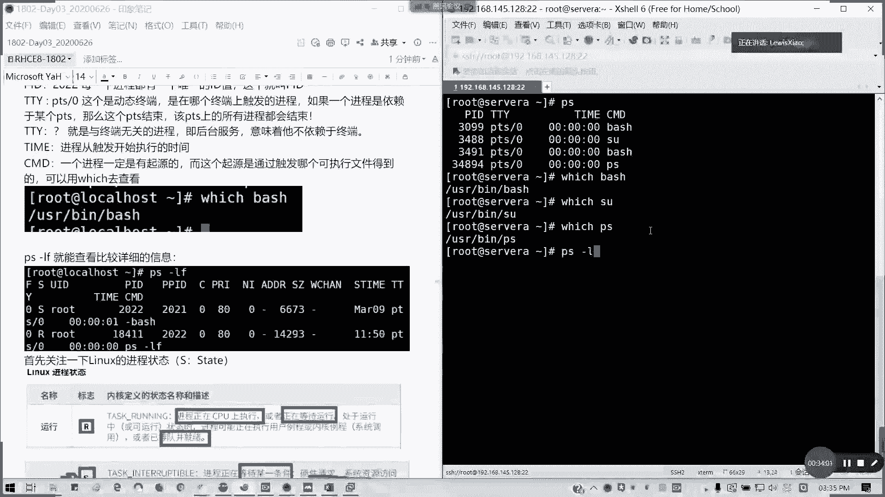

对吧。这里呢。我们要看一看什么东西呢？像这里。PID跟PPIT都知道吧，对吧？它的进程ID以及它的负进程的ID也就是它上面那一层进程的跟它有关的负进程的ID然后它UID是吧？

UID然后我们还有这这些我们的那个。我们的优先级，我们的nice值是吧？这些的话我们待会解释TTY。对吧都有。那我们先看一下我们linux进程的一个状态，这个可能比较枯燥。

但是大家要要要知道啊要知道我们进程是有哪些状态，包括我们PS要怎么看的，对不对？进程哪些状态，我们看一看，首先是运行态R态。如果像这里啊是运行状态的话，它就说进程正在CPU上执行或者是等待运行。

处运行中，对吧？进程可能正在执行用户进程历程或是内核历程，也就是我们系统的一个调用。然后呢，或者他已排队就绪了，就是一个R状态。懂吧？running。然后我们还看到这里有几个S的，就是睡眠状态。

睡眠状态就是你的任务是在inrupable的啊，inable它是intable也就是他在等待某一个条件，比如说我们的信号，我们的硬件需求或者是我们的系统资源访问，们在等就是比如说我们在进程在等我们。

那是不是等我们比如说等我们输入一个命令呢，对吧？或者是想一个请求呢都可以。然后如果当这个事件或信号满足这个条件的时候，它就回到运运行状态，回到R状态，懂我意思吗？此类不是睡眠，它是在等待，对吧？然后呢。

如果是D呢。他也在睡眠，但是他就不会响应任何信号。这种是可能就是说那个仅在进程中断，可能会导致意外设备状态情况下使用。就是它已经异常它不会响应你的东西了。那我们这种就叫做低状态。K状态就不可中断。

但它有所修改，就是说他在允许等待。要退出的信号对吧？要被中断，它这种呢可将中断的进程切换为我们的不可响应的状态啊。睡眠的话有SDK那我们还有一个T啊T的话有两个T，一个叫t stop，也就进程被停止。

通常是通过其他进程发出的信号，如果要如果他也可以通过啊进程，这个如果是我们进程处于一个t stop，也就是任务停止的状态呢，它是可以通过另外一个信号返回运行中状态，对吧？也就恢复执行，这可以的。

然后还有一个就是临时停止的，就t trace，也就是我们调试我们被中断了，对吧？这种比较少见。通常我们就是第一个为主。然后还有就是一个江亭，江亭的话就是。你。江庭的话就是那个退出的时候。

我们紫禁城退出的时候给付禁城发的信号，就除了他PID之外的所有资源都被释放掉了。就他准备这个我已经执行完了，我要释放释放了。那我这时候我要发个信号说哎说说老爸我这个执行完了。

我已经我要把资源已经放放出来，对不对？这，然后还有一个叫做已经将死状态，也就是附禁城清理获取紫禁城结构的时候，那我下面无论执不执行完，他就会被释放掉。那是不是相当一个死禁城，对不对？这死禁城的话。

他不会再认列出来啊，不会再被人列出来。懂我意思吗。江庭有分两种，一种是要释放主动的，一种是有附近城在清理的时候，我就把它清掉了，对吧？可以理解吗？然后我们来看一看啊，看一看这里这个什么意思啊。

PID为标识符这样说了PPID。负进程就是它上一级的，通常我们附进程会触发对应的子禁程。就是说他比如说我们是一个操系统，它就有多个是吧？它前最上面的是一个附进程，像我们stemD。

然后它会就会触一层层触发下来，懂我意思吧？然后PRI是进程优先级。进程的真的优先级就是调优它调控物的优先级呢是等于内核分配的优先级，加上一个手动可调的一个那叫做nice值。

我们我们后面又再讲一个叫nice值的东西，所以我们手动调进程啊。默认nice值为0啊，它是调它这个是可调的，默认是为零的。然后它的那个一开始的一个内核分配的优先级默认为8080。

然后它的nice值呢可控范围是-20到19，负数代表它的优先级越高，懂吗？数字越大，优先级越低。然后通常来说，我们仅仅仅我们要调整它竞程优先级了，只能调整nice值。对普通竞程它的那个优先级都是为80。

所以的话我们还要加一个，我们后面其实我们如果在7里面，我在七讲到进程的时候，其实我们的值是叫做40到139啊，4139这么大的一个区间，就我们调优过的进程值，通常默认都是80啊，不用去管它。

不过现在呢其实优先级对系统调度的影响已经没有以前那么大了。因为现在的硬件都是过剩的，对不对？以前我们还要说哎我为了错峰是吧？错峰执行命令，那我们把进程稍微有一些紧要的优先级高我们调低一点。

怎么把把数值调低，然后把那个进我们就没那么重要的，我们调高一下进程，但现在其实已经没那么重要了。因为现在的那个其实那个CPU已经发展很快了，对不对？

所以就我们的那个CPU我们调度能力已经是非常大的一个提高，所以的话就没必要去动这个东西。

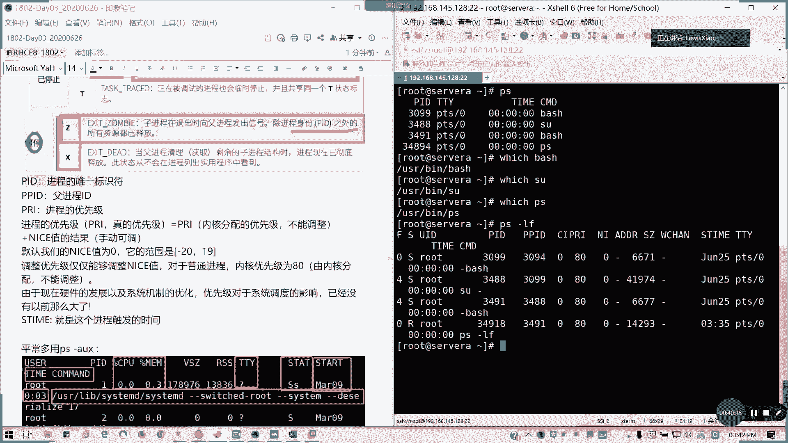

S碳就是我们触发的时间。刚才讲过啊。我们平时呢会多用我们的AUX，对吧？杠A带回会杠都没问题啊。对吧我列出所有的。AU叉啊，我们列出详细的一个信息，这里好多啊。对不对？这里好多，对不对？

我们从这里开始AU叉AU叉包括列出我们的用户啦。然后还有他的状态啦对吧？等等这些。然后他比如说我们这个进程执行用户，他的PID我们第一个进程是有有PID唯一的进程是不是stem低啊。

我们内核调用的一个系统首后台首务进程，原来是要INIT对不对？就系统初始化，我们整个大环境的一个进程，现在叫stem低，对不对？然后我们CPU占用多少，我们内存对吧？我们预分配的空间，我们资源占用的量。

我们的。终端是吧，问号是不是后台进程啊，你只要哪怕关了终端，你又没怕，你都没事，然后我们状态是吧，开始时间。

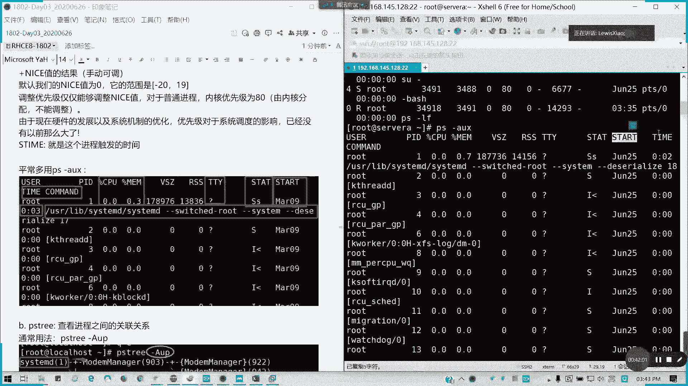

然后他运行时间还有他的命令，对不对？这个就大概讲一下，我们通常啊PS的用法。懂了？然后接下来我们讲进程数，进程数的话就是看我们的。进程之间的关联杠AUP对吧？就像一棵树一样。

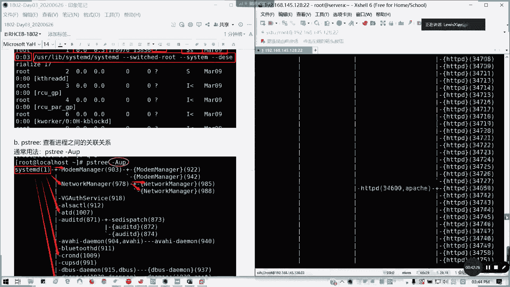

这个数图的话就看的非常清楚，对不对？懂吗？它所有的技程都是从stem。第一，我们用干杠A是吧？然后带带我们的那个用户跟进程的紫禁城的一个参数。那我其实呢就是显示出我们的进程之间的关系，就相当一个数是吧？

我们的一个思维导图，对不对？像我们一开始我们系统都是有一个sstemD进程ID为一。可以不用加杠AU叉，杠不杠AU叉都没事啊，对吧？可以加可以不加。像这里我们是一棵树是吧？system一开始。

然后它有几好好多的模块，像我们的nval managermod manager是不是？像我们接下来一个叫HTTPD也是它属下的一个紫禁城，对不对？然后紫禁城里面有多个服务，对不对？它有括号。

它会我们家的AUP之后，它会显示我们PIPPID我们PID对不对？它会显显示有PID及用户对不对？

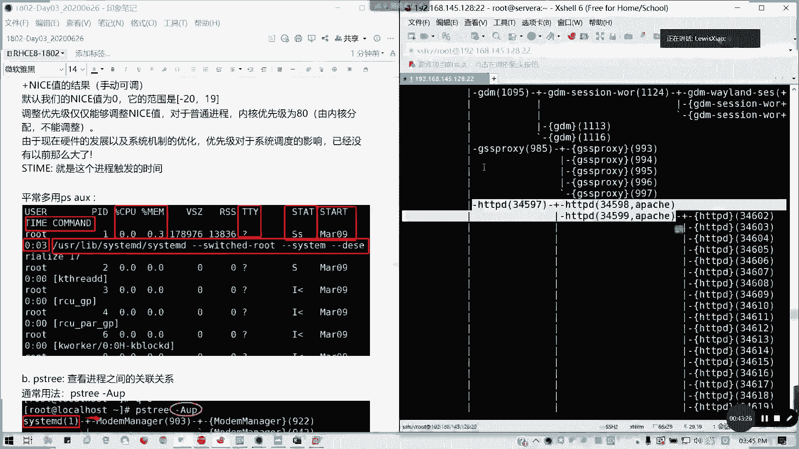

U跟P知道吗？它会显示我们的用户用用户跟我们的进程号，所以这个会列得非常清楚，懂我意思吗？

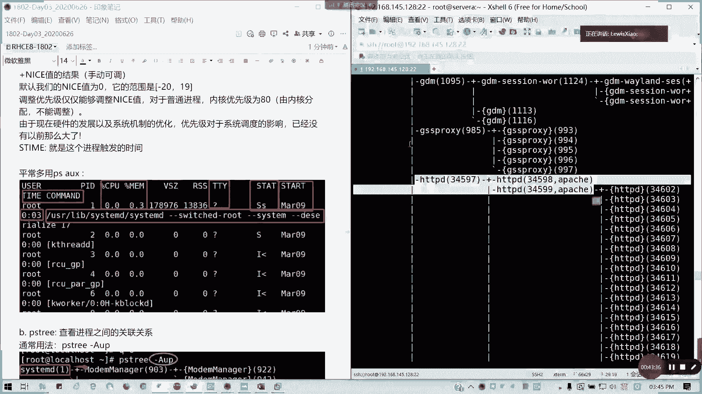

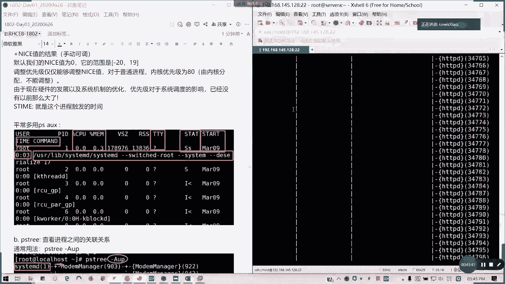

然后他下面还有哪些紫禁城，就这样画下来，懂我意思吗？

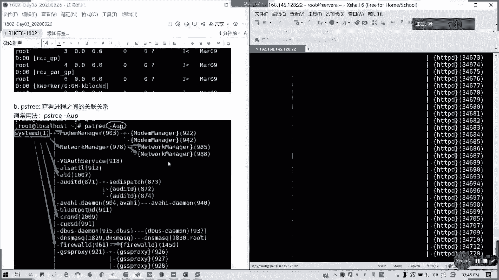

然后我们还有一个top。top是我们动态查看系统资源，怎么动态看呢？像这里。我们。当前系统时间是吧，然后预开机开了多长时间？有多登录多少个用户，他CPU的平均负载率。

这里平均负载率呢是一分钟、5分钟105分钟，它的延迟。懂吗？它一个负载率。我们现在没什么进程，所以都是零啊，就没什么就基本上没什么竞争跑。所以的话它的那个负载，它的那个单位是0。

然后还有多少个任务在运行，对不对？然后有几个在运行中，几个睡眠，几个停止，几个将停，对不对？后面解释不完了。我们CPU占用多少？是吧。就同步的有多少，然后多少个NI也就nice就优先级的啊。

然后还有就是空闲的。有多少对吧？有几个在等待的等等这些。还有有些是睡眠的。那么我们的内存是吧，我们内存。一共多少，然后呢，多少多少空闲，多少释放多少用多少在用，然后多少是一个缓存，把我们的4外分区。

对不对？然后下面呢。下面就是我们的PID我们的我们进程ID用户，然后我们的优先级是吧？优先级nice值，它的用的虚拟虚拟内存都多少，它的资占用资源数，它的一个共享空间数以及它的状态CPU内存，对不对？

我们通常还有后面还有一个time跟comd放大来看就清楚啊，放大来看就很清楚了，对不对？这才是完全的一个界面，好吧？我看这刚才那你测一边了，懂我意思吗？

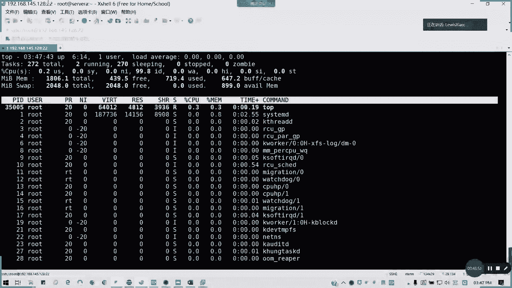

通常用法呢是top是吧？杠低指定时刷新的时间间隔。比如说我一秒钟刷新一次，然后刷新次数为一，对吧？它就自动退出了对吧？然后如果是top杠。C的话就显示详限命令，然后一直在刷新。就一秒钟刷新一次，对不对？

懂吗？我们通常是不是有这样子看动态进程的一个看看进程动态值的一个用法，对不对？无论从66。0708。0。都是一样，懂吧。那我们先我们上半部分第八章上半部分先到这儿，我们稍微休息10分钟。

4点钟我们开始讲作业控制啊，作业控制这个的话就是一个我们作业的一个优先，就是我们前后台啊等等这些，还有包括我们的那个信号控制。待会讲。

