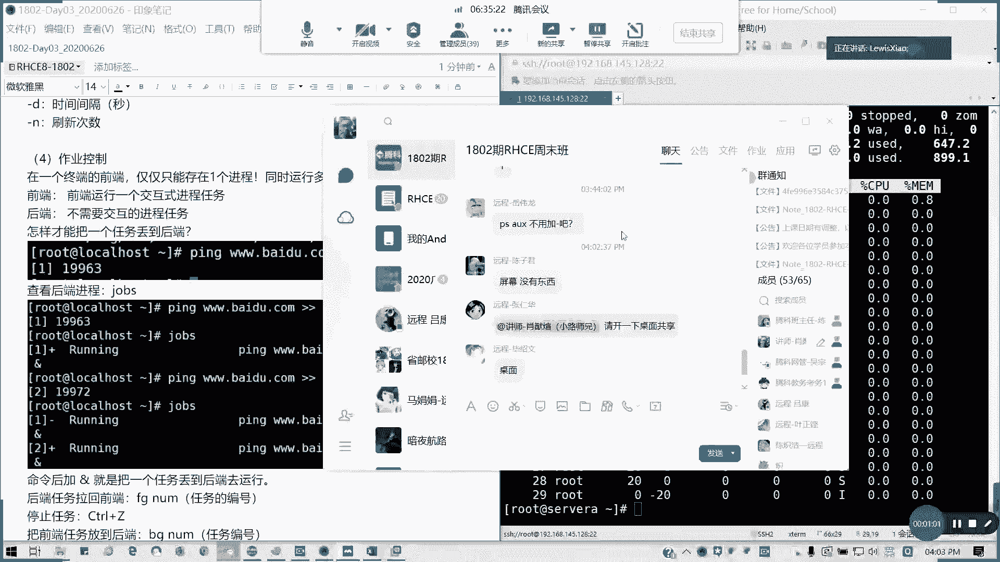

# 拿下证书！Redhat红帽 RHCE8.0认证体系课程 RH124+RH134+RH294三门认证视频教程 - P16：16_Video_Day03_Ch08b_作业控制及信号控制 - 16688888 - BV1734y117vT

北京时间04：02，下午的04：02，我们还有一个小时时间，我们看一下作业控制以及我们的信号控制内容，这个控制我们首先来看在一个最终端的前端呢，我们前端是不是通常我们只能运行一个进程了对吧。

只能跑一个命令，对不对，然后呢如果同时多个任务，我们linux呢是一个多任务的系统，那如果同时做怎么办呢，我们现在进程里面，我们在一个系统里面，我们分前后端是吧，前段呢就是一个交互式进程任务。

但是我们只能跑一个，一个窗口，只能跑一个啊，我就应该是这么理解，然后呢后端呢就是不需要交互的任务就扔到后面去对吧。

那怎么样才把一个任务丢到后端，看一下哦，等一下我专门供给暂停了，稍等一下，稍等啊，我这边看一下共享，你等一等啊，好能看到啊。

能看到桌面共享了啊，我们看一看，我们看到这里啊，我们通常啊一个终端的前端只能存在一个进程，对不对，但是多个任务怎么办对吧，那我们现在如何把这种丢到丢到后端去，比如说我们现在拼一个百度点co。

我现在就把它听的结果全丢弃掉，因为我们不需要在屏幕上显示啊，然后我们家后面加个m的话，是不是可以放到后台运行了，我们所有任务是吧，如果有基础的，应该知道我们加个n的话，就是把我们的任务放在后台运行。

然后它只会提示一个，它只会提示一个就是当前任务的一个序号，然后加上你的一个进程的i d对吧，35181电话啊，好我们现在啊我们继续讲课，然后呢刚才临时有点急，一点点提示啊，各位快就到了，我得付一下运费。

那我们那现在是这样子，我们现在丢到那后面进程之后呢，我们看一下drops是吧，我们现在一直是进城这边后台运行，我们前端是并没有任何显示，对不对对吧，并没有这样显示的，那我们比如说我在执行同一个任务。

然后我就看drops是不是接下来对吧，继续有一个新的进程号，新的进程号是35206 306，对不对，然后一直在进行左边任务。

我们命令的加一个m呢，就是把一个任务丢到后端去，懂我意思吧，比如说我有一些就是说前端我还要执行别的任务对吧，那我就把它丢到后面去，然后他如果会自动结束也好，如果不会自动结束呢，怎么办对吧，有两种办法。

一种呢就是把任务拉回前端来对吧，我们通过f g，然后后面加我们的任务进程号，不是他的id哈，不是他i d啊，懂我意思吗，比如说fg一是吧，他是把第一个任务绕进程来，然后我怎么停止任务的，ctrl加桌面。

在我们键盘的ctrl加z是吧，他就提示你这个任务已经stop掉了，那我们现在drop是吧，一第一个已经stop掉了对吧，然后我们把我们把它拉到前端来f g2 。

然后我们再ctrl z就我们就完全把它停掉，对不对，两个人我已经停掉了，然后我们还有一个就是如果要把它放到后端去，就是bj好吧，把前端入放到后端，就是b区后面加一个数数字，就我们drop前面的这段数字。

不是他的这个进程号的懂吗，这注意啊，这些我们跟终端有关的进程，无论是前端后端都好，只要终端一结束，他所有都会停止，对不对，刚才我们说了，跟终端有关的就是这样，但是如果跟终端无关的后台任务。

哪怕关闭没有关系啊，我们用no help就可以实现实现一个后端的任务啊，上次有人问我了啊，no help来，同样我们执行任务之前，我们拼一个百度cop，然后丢丢到那now是吧。

那我用no help变成一个后端任务对吧，no in grant import，就是忽略输入，然后重进项目，从定向错误到那个标准输出对吧，然后他就一直在那里进行执行的。

然后drop它是一个他这里面有没有加减的对吧，那加减它是丢到一个后端的一个东西了，那我现在把这个终端关掉，那我们重启一个终端出来。

差距在哪里啊，来我们把这个终端关掉。

然后呢，我们再重新起一个终端，我们来看一下啊，现在看不到啊，现在看不到，但是我们可以查我们的进程对吧，我们刚才这里我们不知道它的一个进程id号，对不对，我们刚才听的话，我们没有去看他的进程id号。

我们也可以通过我们截取他的一个名字，杠e f我们可以看他进程序进行grape p，有没有看到我们这个百度空，这个还在运行啊，35231对吗，就是我中端我刚才关掉之后，他是不是一直a比行。

所以它的那个tt它的那个终端所在的终端的那个编号，它是显示出来一个问号对吧，那这样的话就跟终端无关了，那我们现在我们要怎么结束它，对不对，我们这现在结束的话，我们就通过信号控制就结束了。

通常我们是q杠九，就当他立即结束，然后后面是加上我们的进程号就可以了。

这就是我们进行结束掉，这里我们会就是讲到下面的一个叫做信号控制，先要控制呢，比如说我们进程a在执行执行的时候，我们要进行对它进行一个干预，我们用q命令或q2 没得q我就上批量跟他有关的，全部结束。

q只结束一个啊，然后它然后我们有两个特殊信号，一个是九，一个实物它默认定义呢基本竞争管理下他默认定义呢就是0~20，然后通常我们有用的就那么几个啊，用这么几个，大家看一看，首先一是挂起啊，一是挂起。

然后呢就是相当于是一个暂停对吧，暂停二是键盘中段，三是键盘退出，我们这样不常用，我们常用的是九跟15，九是中断，无法能解决什么，强制对吧，强制终止q杠九对吧，q2 杠九都是一样，无法被拦截忽略的。

就直接相当于我们见着桌子，我们打个比喻，就把电脑强制关机，把电源懂吧，马上你给我停下来，对不对，然后15是正常终止，就是友好方式，它允许自我清理，对不对，如果你这15的话，他就会哎我就先做好善后是吧。

我这就把东西保存起来，什么鬼的，然后然后然后再把进程给停掉对吧，明白我意思吧，然后18就是继续，就是把进程恢复就恢复，然后呢19就停止，20是键盘停止，但这这这个通常啦，通常我们很少用。

我们用的最多就是九跟15，然后零是用于测试的，就是证明这个进程在不在对吧，一是重启，将当我们重新读取一个配置文件，懂我意思吗，可以吧，这个就简单讲讲带过啊，简单带过我们考试当然不考这些了，考试不考这些。

但是你要了解我们的进程是怎么跑的，然后如果是主要去切换我们进程，对不对，那我们这一章的，进程管理，对不对，我们刚才讲到了这些东西都有啊对吧，我这里就不再进行小结了，对不对，通过技能触发方式怎么样。

然后拥有者是谁，然后还有就是我们的权限问题。

进程如何查看，如何进行任务控制，能明白吗，这张如果明白，请打个八，现场同学明白的请举手，不明白的可以提问，12345。

ok全都ok，有疑问可以提，像我之前的考前辅导。