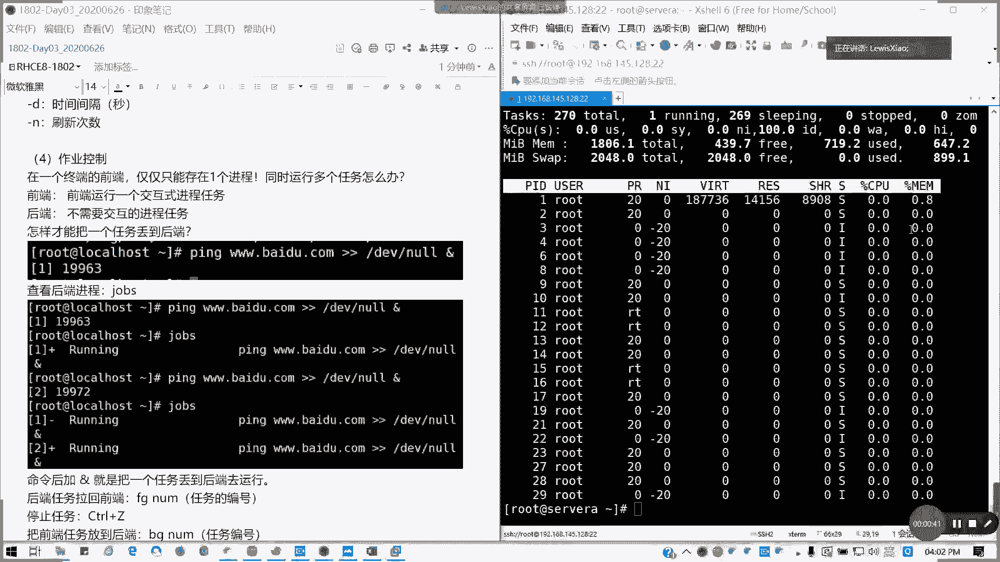
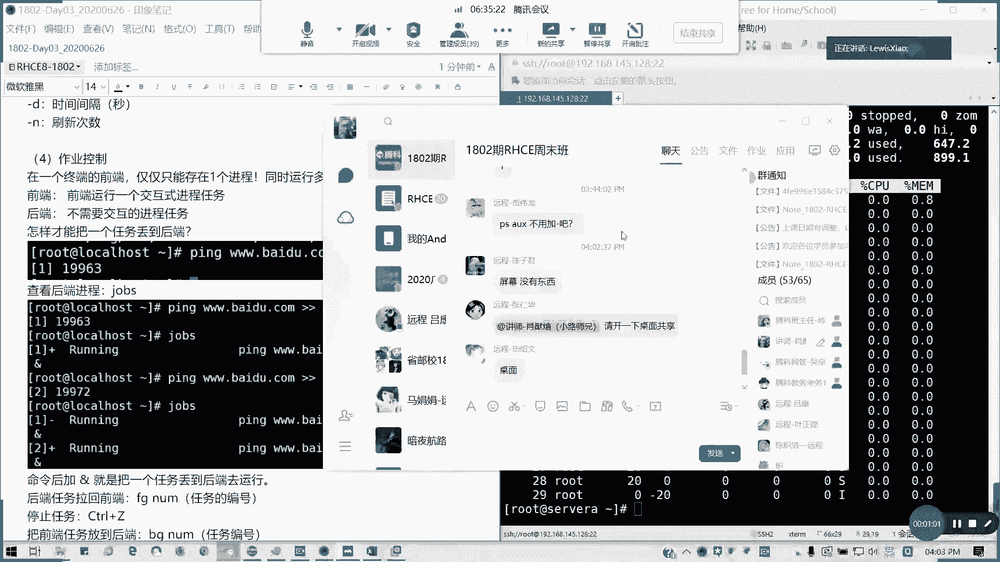
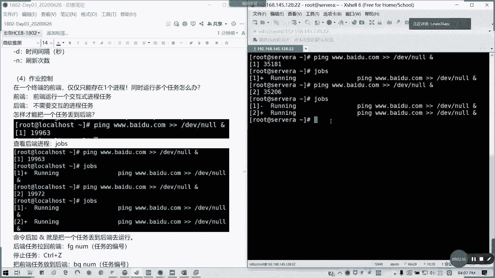
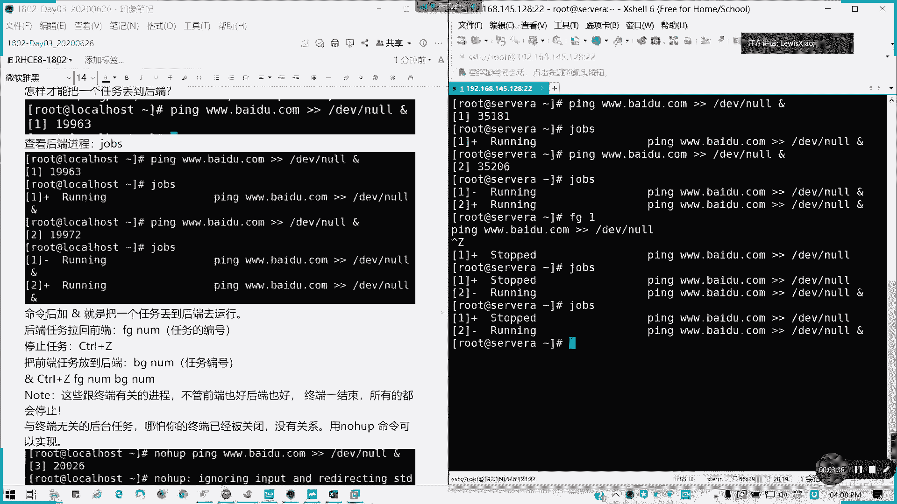
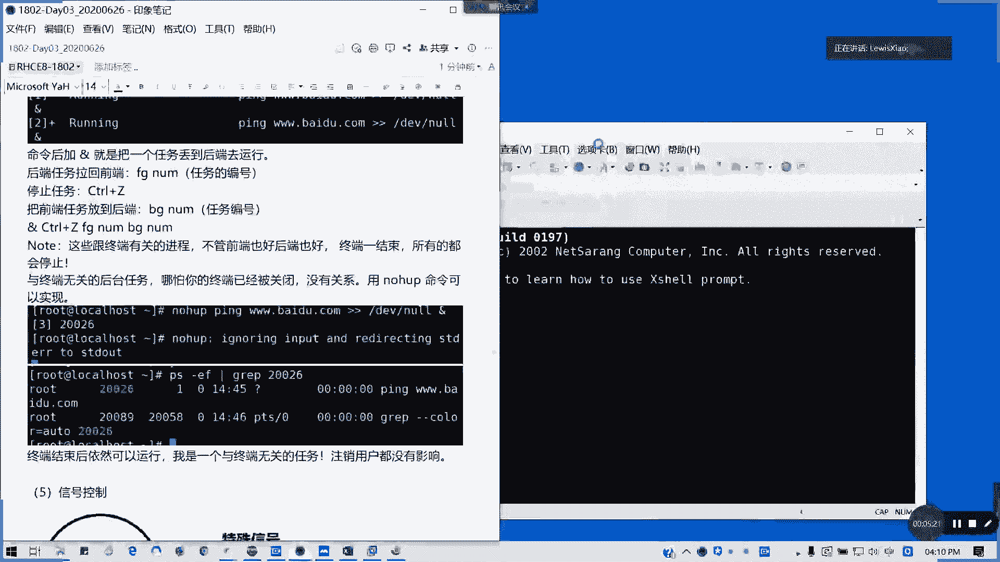
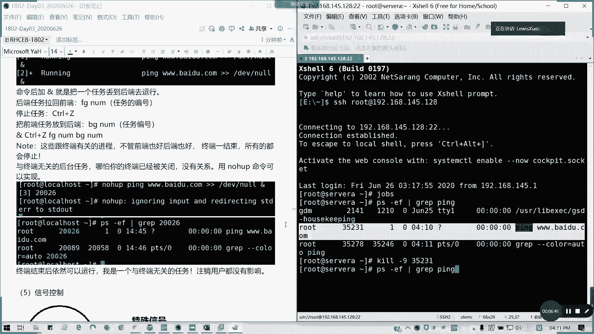
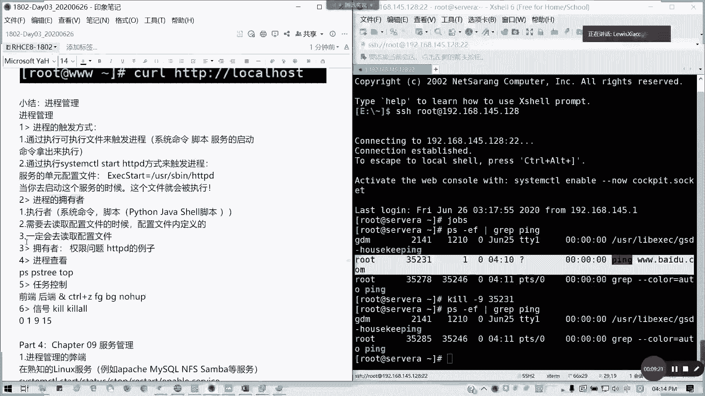
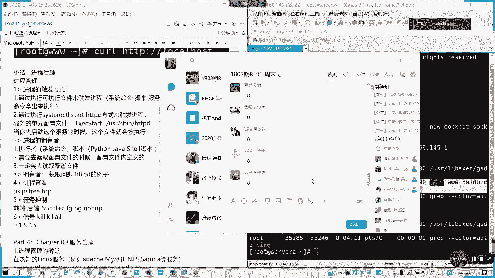

# Redhat红帽 RHCE8.0认证体系课程：P16：作业控制及信号控制 🖥️


在本节课中，我们将要学习Linux系统中的作业控制与信号控制。你将了解如何管理前后台任务，以及如何使用信号来干预进程的运行状态。

---

## 概述

一个终端的前端通常只能运行一个交互式进程。但Linux是一个多任务系统，当需要同时处理多个任务时，我们可以将任务放置到后台运行。本节将介绍如何将任务丢到后端、如何在前端与后端之间切换任务，以及如何使用信号来控制进程。



---



## 前后台任务管理

上一节我们介绍了进程的基本概念，本节中我们来看看如何具体控制任务的运行位置。

在Linux终端中，前端通常只能有一个活跃的交互式进程。如果我们需要同时执行多个任务，可以将某些任务放到后台运行。

### 将任务放到后台

以下是将一个任务放到后台运行的方法：

*   在命令的末尾添加 `&` 符号，可以使命令在后台启动。
*   例如，执行 `ping baidu.com &` 命令，ping进程将在后台运行，终端会立即返回并显示该后台作业的编号（如 `[1]`）和进程ID（PID）。



任务在后台运行时，其输出默认可能仍会显示在前端。我们可以使用输出重定向来避免干扰，例如 `ping baidu.com > /dev/null 2>&1 &`。

### 查看后台任务

使用 `jobs` 命令可以查看当前终端会话中的所有后台任务及其状态（运行中、已停止等）。

### 前后台任务切换



我们可以在前端与后台之间移动任务。

*   **`fg` 命令**：将后台任务拉回前台继续运行。用法是 `fg %作业编号`（注意是`jobs`命令显示的编号，不是进程PID）。
*   **`Ctrl+Z` 快捷键**：暂停当前在前台运行的任务，并将其置于后台，状态变为“已停止”(Stopped)。
*   **`bg` 命令**：将一个在后台已停止的任务，转变为后台运行状态。用法是 `bg %作业编号`。

**重要提示**：通过 `&`、`jobs`、`fg`、`bg` 管理的任务都与当前终端相关联。如果关闭该终端，这些任务都会被终止。

---

## 脱离终端的后台任务

上一节我们介绍了与终端关联的后台任务，本节中我们来看看如何创建即使终端关闭也不会停止的后台任务。


如果需要启动一个独立于终端的持久后台任务，可以使用 `nohup` 命令。



`nohup` 命令的格式如下：
```bash
nohup <command> &
```
例如：
```bash
nohup ping baidu.com > ping.log 2>&1 &
```
*   `nohup` 使命令忽略挂断信号（SIGHUP），这样即使启动它的终端关闭，命令也不会停止。
*   通常需要配合 `&` 将其放入后台。
*   建议使用重定向将输出保存到文件，否则默认会输出到 `nohup.out`。

启动后，该进程的终端信息会显示为 `?`，表示它已脱离终端。要终止此类进程，需要使用信号控制。

---

## 进程信号控制



我们已经学会了如何创建和查看任务，本节中我们来看看如何通过发送信号来主动控制进程的行为。

Linux通过“信号”机制与进程进行通信。我们可以使用 `kill` 命令向指定进程发送信号。

`kill` 命令的基本格式为：
```bash
kill -[信号] <进程PID>
```
或结束整个进程组：
```bash
killall -[信号] <进程名>
```

### 常用信号

以下是几个最常用的信号：

*   **`SIGHUP (1)`**：挂起。常用于让守护进程重新读取配置文件。
*   **`SIGINT (2)`**：键盘中断。由 `Ctrl+C` 触发。
*   **`SIGQUIT (3)`**：键盘退出。由 `Ctrl+\` 触发。
*   **`SIGKILL (9)`**：**强制终止**。该信号无法被进程捕获或忽略，会立即结束进程，不给进程清理现场的机会。类似于强制断电。
*   **`SIGTERM (15)`**：**正常终止**。这是 `kill` 命令默认发送的信号。它允许进程进行善后工作（如保存数据）后再结束。是一种友好的结束方式。
*   **`SIGCONT (18)`**：继续运行。恢复一个已停止的进程。
*   **`SIGSTOP (19)`**：停止运行。暂停一个进程，该信号不可被捕获或忽略。
*   **`SIGTSTP (20)`**：终端停止。由 `Ctrl+Z` 触发，将进程置于后台并暂停。

**核心概念**：
*   在管理进程时，应优先尝试使用默认的 `SIGTERM (15)` 信号。
*   只有当进程无法通过 `SIGTERM` 正常结束时，才使用 `SIGKILL (9)` 信号强制结束。

例如，终止PID为35231的进程：
```bash
kill -9 35231
```

---



## 总结

本节课中我们一起学习了Linux的作业控制与信号控制。
1.  **作业控制**：我们掌握了如何使用 `&` 将任务置于后台，以及使用 `jobs`、`fg`、`bg`、`Ctrl+Z` 来管理这些与终端关联的前后台任务。
2.  **持久后台任务**：我们学习了使用 `nohup` 命令来启动脱离终端、持久运行的后台任务。
3.  **信号控制**：我们理解了信号是控制进程的关键机制，熟悉了 `SIGTERM(15)` 和 `SIGKILL(9)` 这两个最常用信号的区别与用法，并学会了使用 `kill` 和 `killall` 命令发送信号。



通过本章学习，你应该能够有效地查看、管理系统中运行的进程，并能在不同场景下以合适的方式启动或结束任务。