# 拿下证书！Redhat红帽 RHCE8.0认证体系课程 RH124+RH134+RH294三门认证视频教程 - P17：17_Video_Day03_Ch09_服务管理 - 16688888 - BV1734y117vT

好，4点16分，我们接着讲服务管理。服务的话，其实我们这里重点讲就是一个sstem control的问题啊，stem CTL这也主要是一个概念，还有一些。一些基本的操作吧。在进程管理呢，我们通常啊。

通常呢我们在熟知的linux服务里面，我们可以通过进程来处理，是不是？进程处理像HTPD它是通过进程，通过USUSR我们的un软件系有资源里面SB目录的HTTBD去创建进程。在我们图里面都有看到。

对不对？那只有进程才能处理这处理问题，这个是大家都认可的，对不对？我们服务是通过进程来启动的，但是为什么要服务这个概念呢？

我们当我们通过这个USRSB目录HHDPD这个可循惯性是创作进程这个问题这个没大家都公认的，没问题，对不对？然后呢，如果修改配置文件时候，去重启HTP的时候，我们用Q哦没问题，对不对？刚才讲的信号共制。

对不对？没有问题。如果停止Q杠2-15也没问题，对不对？但如果要开机自动启动啊。那就没办法了，我们进程做不到啊，我们的Q2做不到这个东西。对不对？我们进程管理做不到。所以说我们的HTTBD只是一个服务。

但系统必要的，或者是说你系统很多存在进程的情况下，你不能说老是来弄弄Q来杀进程，停进程，重启进程，对不对？不可能这样的吗？人工操作啊，对吧？那这得算一个系统吗？肯定不是。那我们怎么去管理啊。

这个是一个头痛问题，怎么去管理？其实应帮我想好了，对吧？用服务啊用服务的方式，对吧？服务的方式。然后我们接下来讲一个服务管理，就system control啊，sstem怎么来的？

在我们sstem在我们I在我们的那个红帽七以前是用service这个模块服务模块来进行管理。在红帽七之后呢，它都是交给了一个叫sstem低的一个服务啊，它是系统启动第一个启动的一个进程，懂我意思吧？

全部交给它来管理，它system第做什么用呢？就是第一个你系统启动要用到它。第二个你的一般服务启动也要用到它。第三，我们一般服务的管理也要用到它，对不对？

所以它相当于是一个service这个模块的一个升级版啊，特别是用六跟7，你们特别是有很有一些企业还在用六的情况下，那麻烦你现在你们在用到7甚至现在的8麻烦转变一下关。念啊主要一些观念。

我们现在的服务全部用stem controll来管理。它stem第一本身也是一个服务，它是用来管别人的啊，像一个管家。那如何去管理呢？它有一个命令工具叫system control。它只有一个啊。

就以前我们叫IIT，是不是？对吧INIT然后服务名，然后star stop对不对？在我们这个sstem control，它是放在一个并目录里面的。对吧USUSR并没并目录里面的。7以后啊。

这以前叫service，7以后就是叫交给了他。然stem D呢只有这一个system control的一个管理工具。那它怎么用的？system control管理服务的时候。

它需要一个叫我们叫做单元配置文件，对吧？你要管理一个个服务单元，那是不是要它有配置文件的支持啊？它要去读取一个单元配置文件，然后根据单元配置文件定义去启动跟管理对应的进程。

比如说我们的stemD放在哪里？我们的单元配置文件放在库里面了，user lab里面的stem D对吧？sstem D里面的一个stem目录里面。一堆。点service点他给是吧。

目标或者是服务或者是套接字，对吧？为后缀的一些文件，这些就是我们的服务的管理文件，服务的定义文件。比如说我们打开我们刚刚装的HTTPD。点service对不对？它这里也有套接式，我们先打开服务能看一看。

对吧它的一个单元的一个描述是吧？单元描述，然后它需要哪些文件，然后他之后会跟启用哪些文件，然后它的docuation它的手册会关联到哪一个，对不对？都有写。然后呢，至于服务呢。

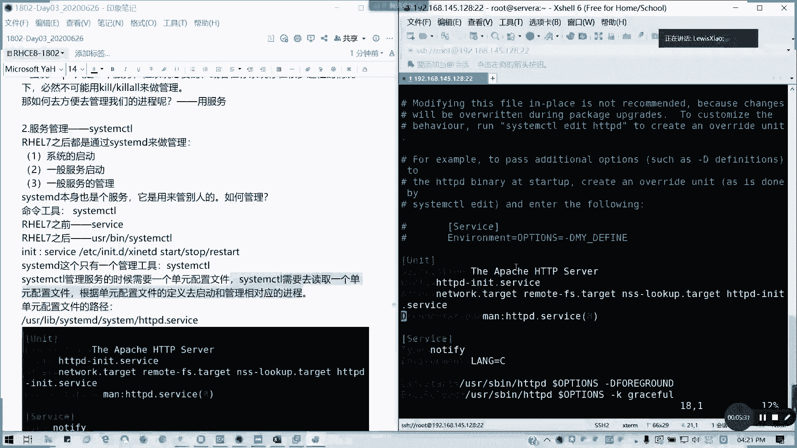

我们看到他有定义它的环境是吧？然后它的类型是通知通知，对吧？然后它的star是怎么启的，对吧？它的启动怎么起的？它重它的重新加载是什么，怎么重新加载，就干K graceful，对不对？重新加载配置文件。

🎼那他安装它是它是需要什么？就是一个多用户，对不对？他这里有定义。但这个这里我们在这一章里面，我们在CSA的阶段，包括C阶段，我们都不会要求说这个文件要怎么写。啊，不需要掌握怎么写。

我们要知道它怎么用就可以了。就我们有一个概念，就是我们在装每一个服务之后呢，它都会在这个库文件里面的只有这个目录里面这个userUSR lab systemtemD里面stem目录。

它会生成对应的一个配置单元服务配置单元。然后通过服务配置单配置单元的一个定义来进行服务的一个管理。明白吗？不要求怎么写，但是你要要求你你就我们知至少要知道怎么看，对不对？像这个。对吧。

执行开就执行启动操作，还有执行重新加载操作，他都有写的对吧？

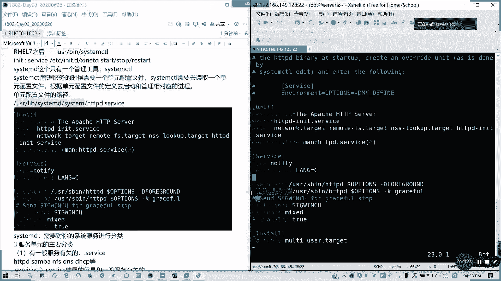

好。那我们讲一下服务单元的主要分分类，分类有主要是几种。第一种是和一般服务有关的点service结尾，对不对？

通常比如说像我们的webHDTPD和我们的共享服务s网络文件服务IFS我们的域名解析服务DNS我们的IP自动分配的叫DHCP对不对？类似的，通常点service结尾呢就是跟一般服务有关系。

然后跟开机启动有关的点ta给点目标啊，我们刚才看到几个目标。比如说我们是为什么stem control我们在第一节课第一天讲的课的时候，我们stem controlttrol为什么呢？

可以来控制它的那个切换我们的启动界面，对吧？这些点ta给我们的这些目标呢？是跟我们的。开机启动有关的，懂我意思吗？然后呢，还有套接字套接字什么意思？我可以通过套接制来启动一个网络服务，对不对？

跟套接制有关的就是点sockcket啊，socket结尾。然后我们不管是什么类型的一个单元都有配置文件。

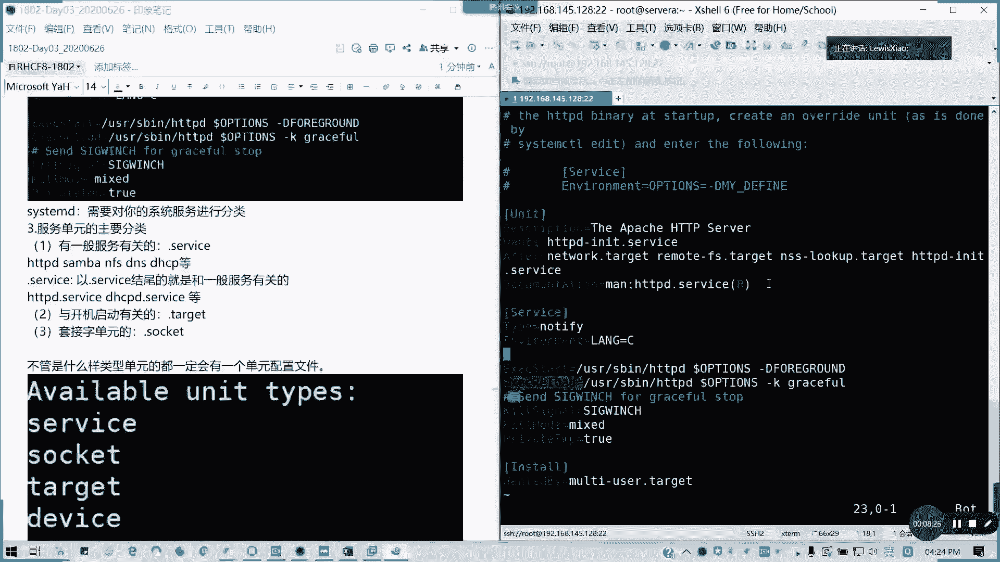

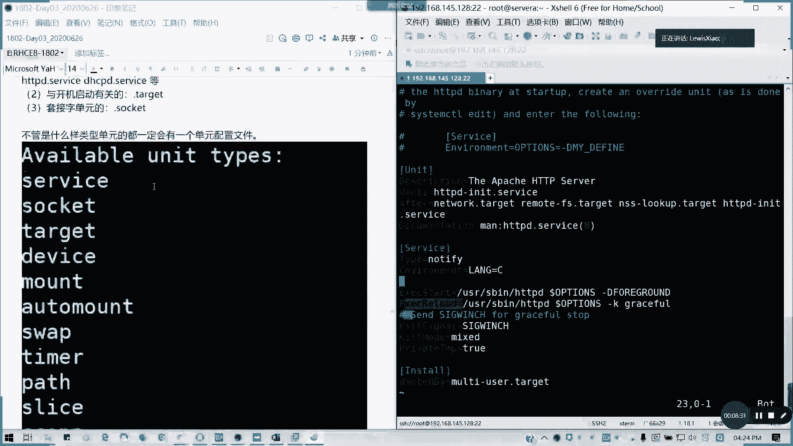

对吧在我们这里列出来的。

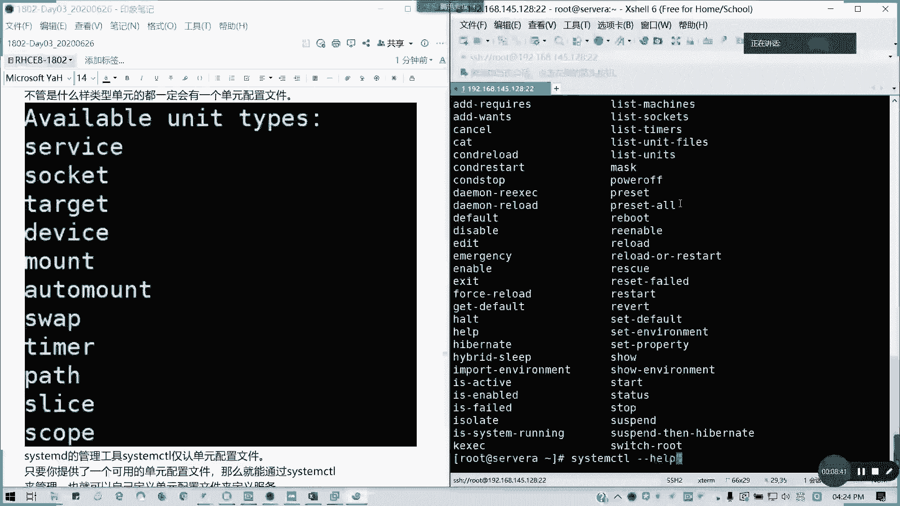

像这里的话help一一大堆哈help一大堆，它是包括我们怎么控制，然后它的那个单元是吧？它包括jobcom这里一堆哈，然后还有他的那个。

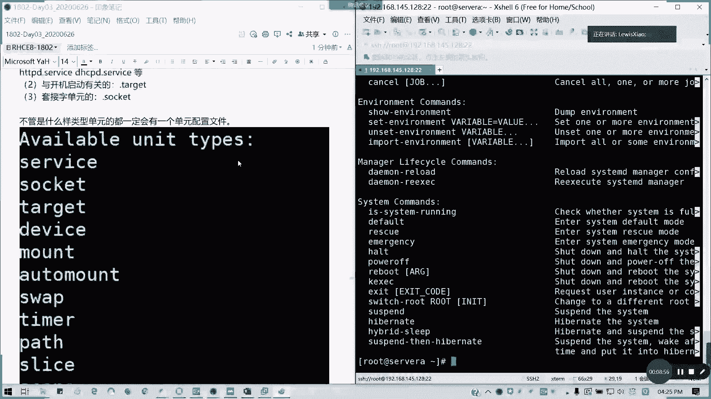

是不是历史啊？我看这里它常用命令，我看一下怎么列出来这个。比如说我们可以列出来我们的所有的一个。服务是吧。不道。🎼A，他列出来所有单元的服务对吧？详细的，然后我们可以也可以列出我们所有的单元服务。它。

我们通常说他可以用的啊，可以用的就以上至以我们右边啊。我看一下杠T。杠T我看杠杠type吧，我看一下啊，怎么列出来。这里很多啊。我们无论什么样的单元呢，我们就先不管了啊，无论怎么样单元呢。

我们都可以列出一个配置文件啊，它都有一个单元配置文件。像这里的话，我们刚才说的，它有一个比如说像服务啊，像套接式啊，像目标啊，像设备啦，对吧？常用的类型像moote啦，我们的挂载啦、自动挂载啦。

交换分区啦、定时器路径是吧？等等这些。

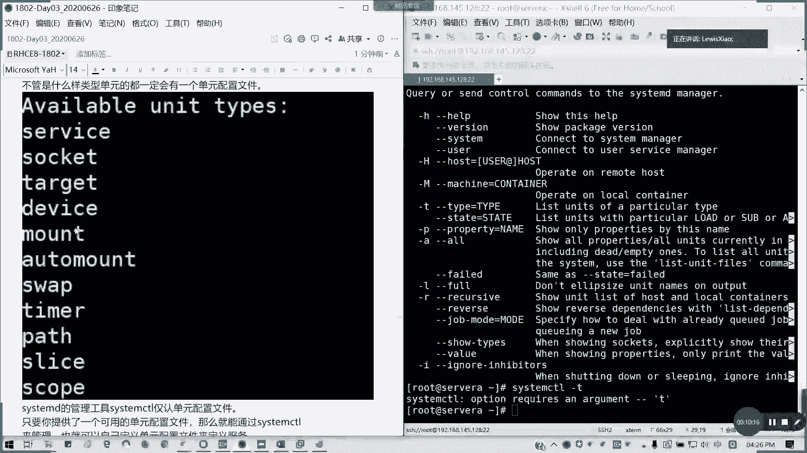

都可以啊。然后呢，我们可以啊它可以它这个stem controll呢，它是仅任我们单元配置文件。当然你也可以提供可用的单元配置文件，然后通过stem controll来管理，也就可以自定义了，对吧？

比如说engs，它是自己定义的，懂我意思吗？通常我们怎么样去管理这服务呢？system control，然后后面它的选项对吧？启停重启重载状态。起用禁用是吧？然后呢，就是永久启用永久禁用。

然后还列出它的单元，我们通过list unit就知道了。

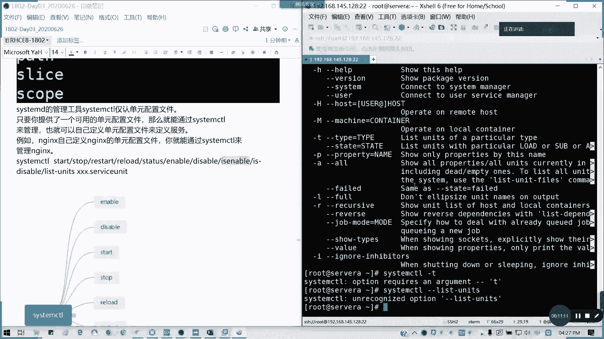

对吧列出所有的单元很多了。对吧他支持的一堆这一堆很完全很全啊很全。我们仅要知道它的一些用法就可以了，懂我意思吗？这里这么多的用法，但我们常用就是启动启用，对吧？还有停止重启重载就可以了，懂我吗？

懂我意思吗？还有一个依赖关系，list dependence啊。然后还有呢就这个mtyus点target want这个配置文件优先优于我们的lifeuser life system。

第一就是刚才我们看人件目录。然后还有呢就是这个如何启动启停服务，刚才我们讲了知道了吧，对吧？启动服务其实它后面我们不默认不跟，比如说我们的HTTPD是吧？conttrol，我说我们重启HTTPD服务。

这里HTPD其实它省略的一个点service懂吗？我们所以我们所以这样也能够重启的原因，就是它默认它是当成一个单元配置，我们的一个。就我们一个服务默认啊，懂我意思吗？你后如果要开机启动呢。

我们可以写在1个RClo里面。你们可以写在这里是吧？如果要开机启动，你要在开机启动时候运行某一项服务，你可以将你的命令写在这儿，这是我们题外的啊。有没有问题？这章我们简单过了一下服务。

因为前面我们有讲它的用法，在第一天的时候，我们有讲sstem control用法。因为我们第一就是说一些像切换目标啊，对吧？像今天讲的起重启服务啊，启服务停服务啊，这的话我们虽然书里面简介绍很多。

但是我们这里的话就简单带过。对吧但是这个启停服务我们以后经常会用到，我看大家有什么问题先。对啊，system杠T，然后help刚才讲的啊，我刚才漏了一个system杠Thelp。

我们可以列出这样一个类型。所以的话我们这里会补一下。

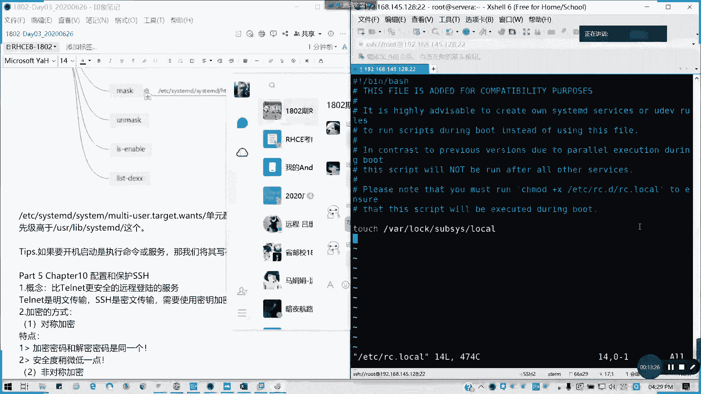

Sstop。Control。杠T，然后help对吧？可列出来可用的类型，我们试一下。control杠Thelp。对不对？

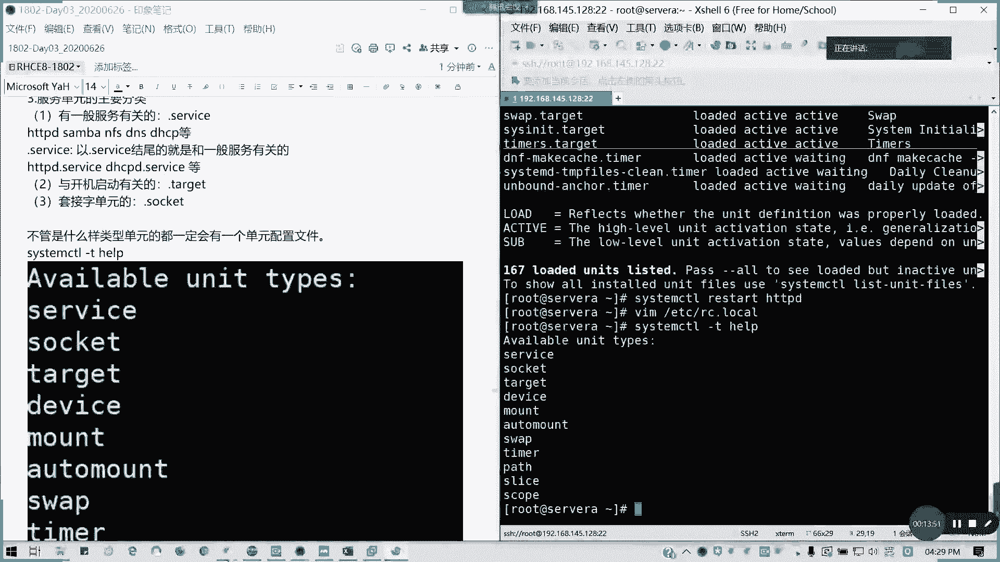

李建敏说的没错啊，就帮我想起了一个命令。所以的话我们第九章简单过了，简单过。但是你要知道你要system controll怎么用就行了。明白我意思吗？有没有问题，没有问题，请打9。现场有没有问题？

咩问题主手啊。这张123456都OK。我们就知道system control怎么用就行了，其他我们不用管。

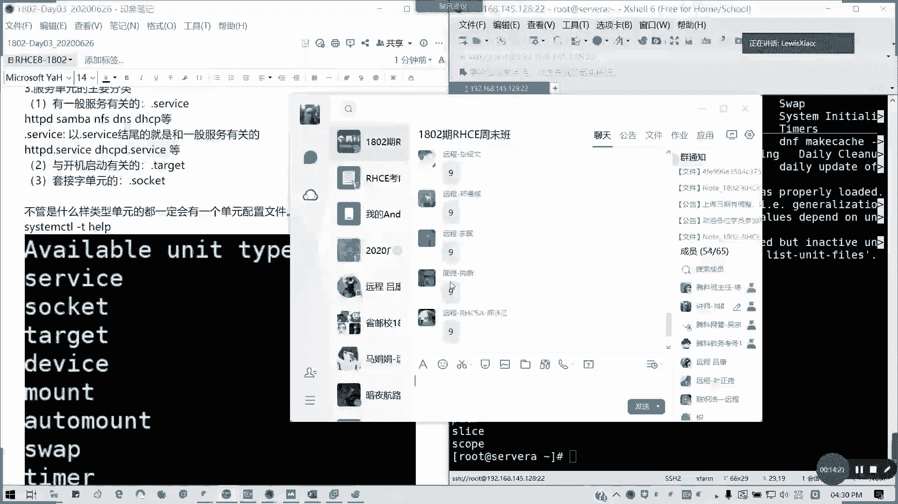