# 红帽 RHCE 8.0 认证体系课程：P17：服务管理


在本节课中，我们将要学习 Linux 系统中的服务管理，特别是 `systemctl` 命令的使用。我们将了解服务与进程的关系，以及如何通过 `systemd` 来高效地管理系统的各种服务。

## 服务与进程的关系

上一节我们介绍了进程管理，本节中我们来看看服务管理。服务通常通过进程来运行，例如 `httpd` 服务通过执行 `/usr/sbin/httpd` 程序来创建进程。我们可以使用 `kill` 命令配合信号来管理这些进程，例如重启或停止。

然而，仅通过进程管理存在局限性。例如，我们无法方便地设置服务开机自动启动，也无法系统化地管理大量服务。因此，Linux 系统引入了“服务”的概念，通过一个统一的框架来管理。

## Systemd 与 Systemctl 简介

在红帽 7 及以后的版本中，服务管理从传统的 `service` 和 `init` 脚本，转变为由 `systemd` 系统和服务管理器负责。`systemd` 是系统启动的第一个进程，它负责启动和管理其他所有服务。

管理 `systemd` 的主要工具是 `systemctl` 命令。它通过读取“单元配置文件”来定义和管理服务。

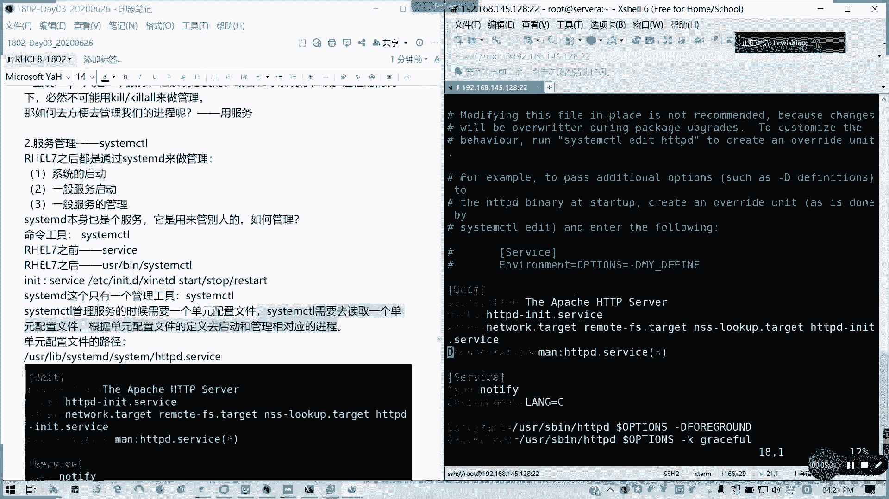

## 单元配置文件

`systemd` 根据单元配置文件来管理服务。这些文件通常位于以下目录：
*   `/usr/lib/systemd/system/`
*   `/etc/systemd/system/`

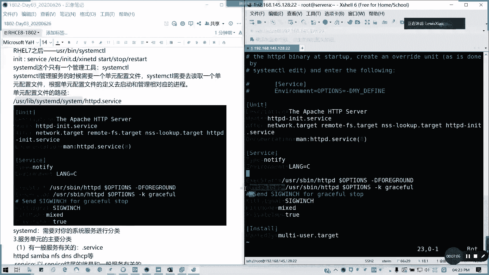

以下是单元文件的主要类型：
*   **服务单元 (`.service`)**: 定义系统服务，例如 `httpd.service`。
*   **目标单元 (`.target`)**: 定义系统启动目标（相当于运行级别），例如 `multi-user.target`。
*   **套接字单元 (`.socket`)**: 定义进程间通信或网络套接字。

我们不需要掌握如何编写这些文件，但需要知道如何查看。例如，查看 `httpd` 服务的单元文件：
```bash
cat /usr/lib/systemd/system/httpd.service
```
文件中定义了服务的描述、启动命令、重启方式等。

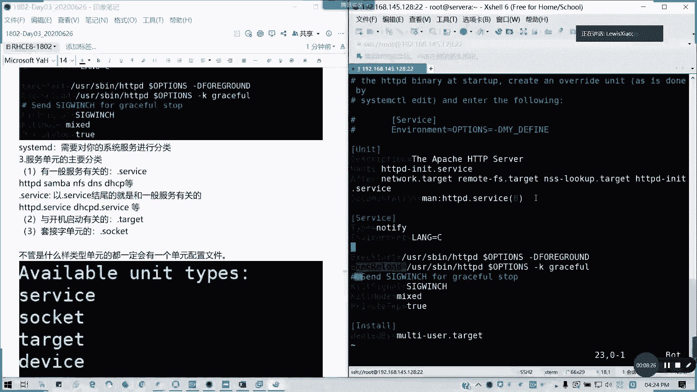

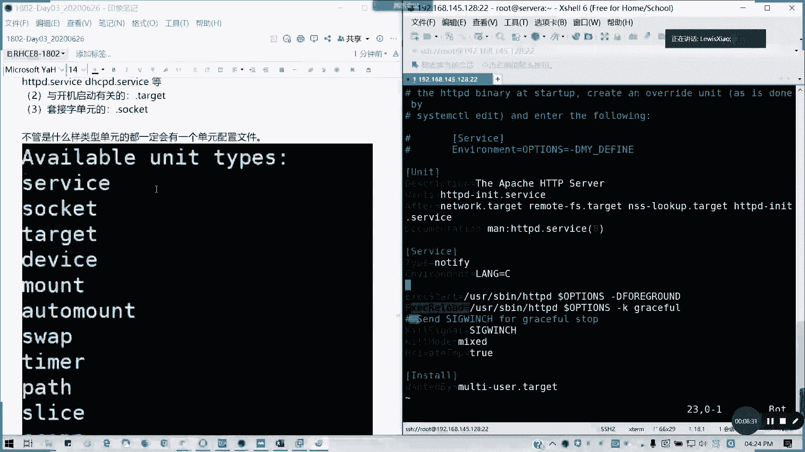

## 使用 Systemctl 管理服务

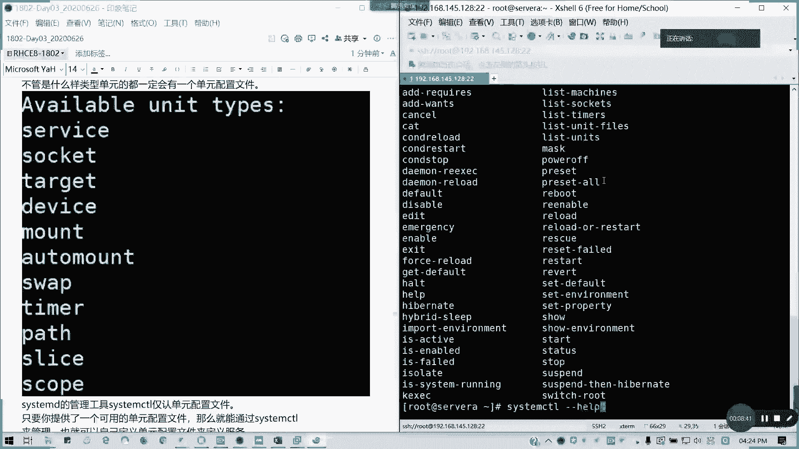

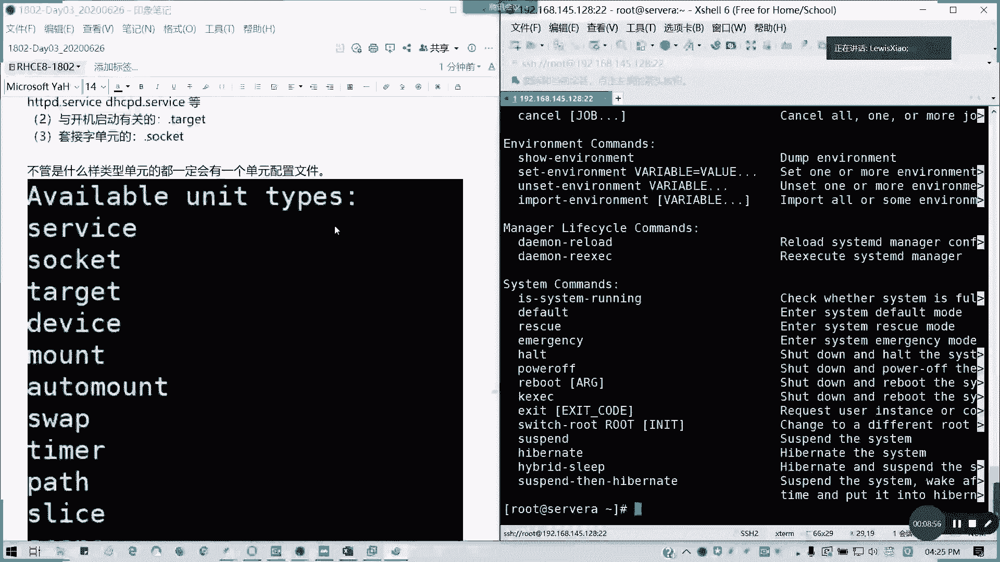

`systemctl` 命令语法为：`systemctl [选项] 命令 单元名称`。在指定服务名时，通常可以省略 `.service` 后缀。

以下是管理服务的基本操作：

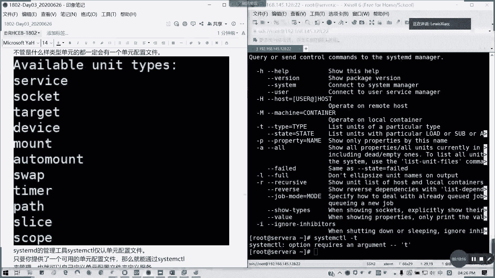

**启动、停止与重启服务**
```bash
systemctl start httpd    # 启动服务
systemctl stop httpd     # 停止服务
systemctl restart httpd  # 重启服务
systemctl reload httpd   # 重新加载配置文件（不重启进程）
```

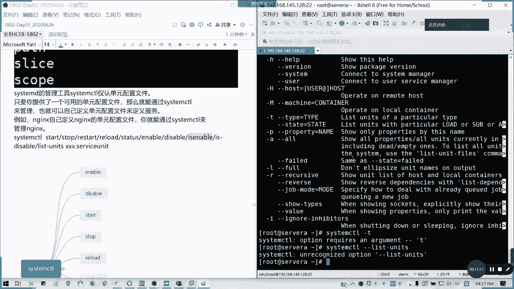

**查看服务状态**
```bash
systemctl status httpd   # 查看服务的详细状态
```

**设置开机自启**
```bash
systemctl enable httpd   # 启用服务开机自启
systemctl disable httpd  # 禁用服务开机自启
```

**列出所有单元**
```bash
systemctl list-units     # 列出所有已加载的单元
systemctl list-unit-files # 列出所有已安装的单元文件
```

**获取帮助**
```bash
systemctl -h             # 查看 systemctl 命令帮助
systemctl -T help        # 查看 systemctl 支持的所有单元类型
```

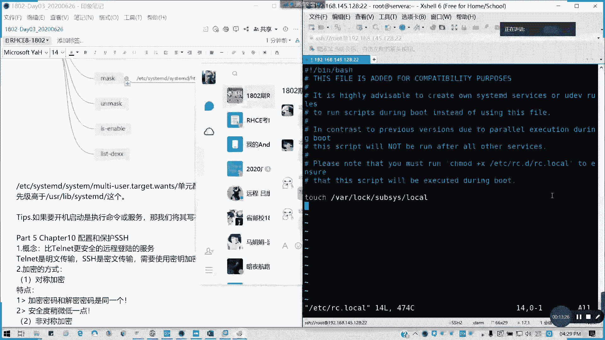

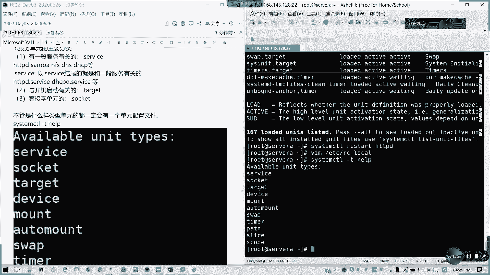

## 总结

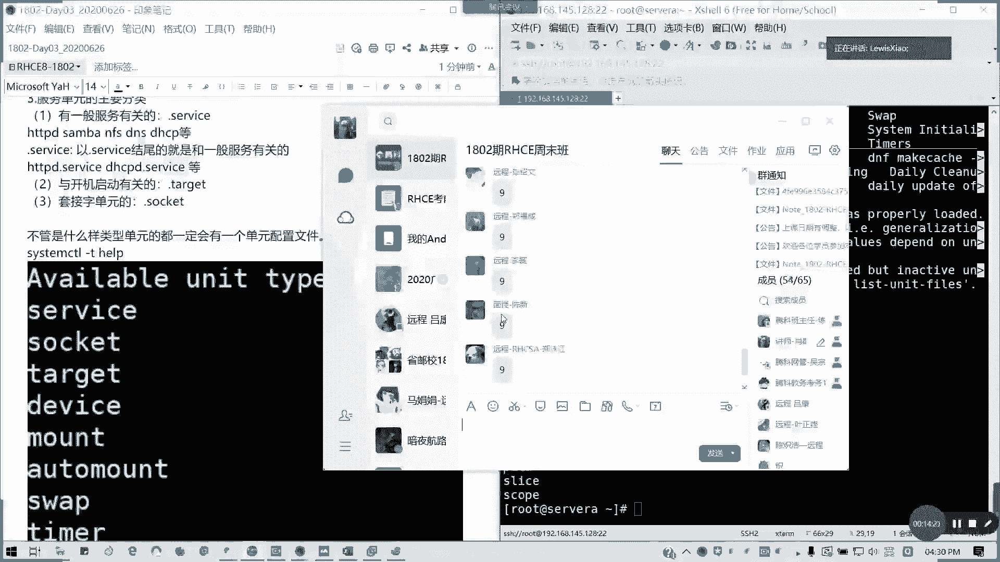

本节课中我们一起学习了 Linux 的服务管理。我们理解了服务与进程的区别，认识了 `systemd` 作为现代 Linux 系统服务管理器的重要性。我们重点掌握了使用 `systemctl` 命令来启动、停止、重启服务，查看服务状态以及设置服务开机自启等核心操作。这些是日常系统管理中最常用到的技能。