# Redhat RHCE 8.0 认证体系课程：P18：配置和管理SSH服务 🔐


在本节课中，我们将学习如何配置和管理SSH服务。SSH是远程管理Linux系统最常用且最安全的工具。我们将重点探讨SSH的加密原理、如何建立免密码认证，以及一些关键的服务器端配置。

## 概述：SSH服务基础

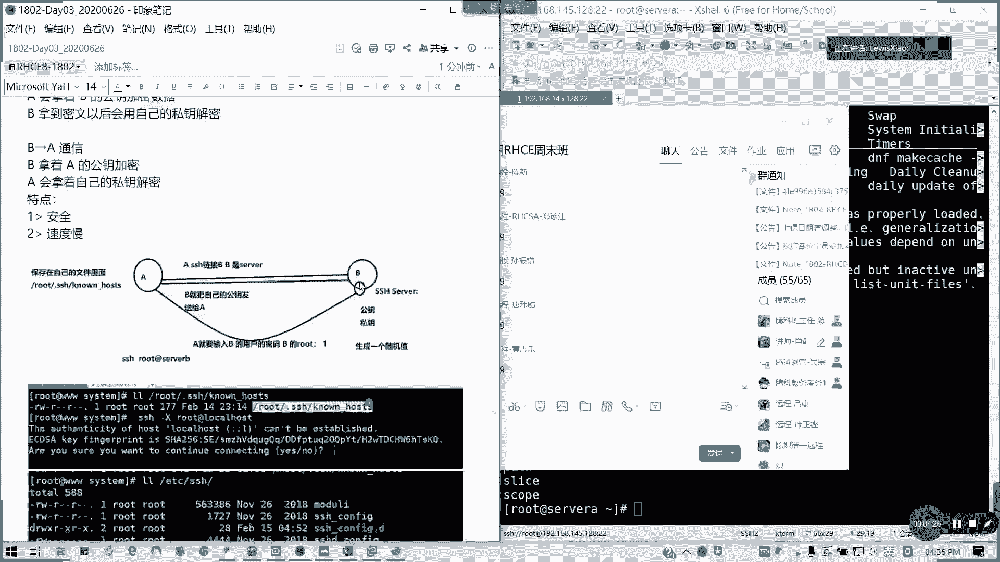

上一节我们介绍了进程和服务管理，本节中我们来看看如何安全地进行远程连接。SSH（Secure Shell）是一种加密的网络传输协议，用于在不安全的网络中提供安全的远程登录和其他安全网络服务。它比传统的Telnet等明文传输协议安全得多。

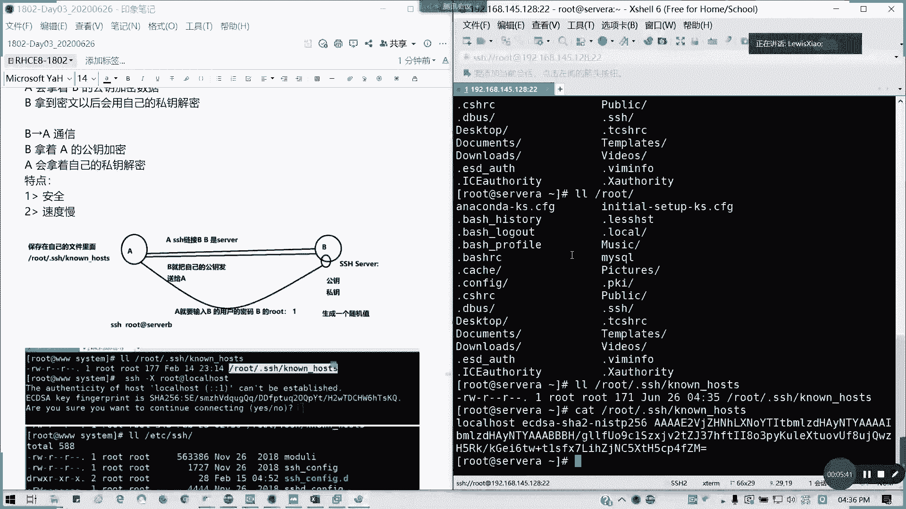

SSH的加密方式主要有两种：
*   **对称加密**：加密和解密使用**同一个密钥**。特点是速度快，但密钥分发过程存在安全风险。
*   **非对称加密**：使用一对密钥，即**公钥**和**私钥**。公钥可以公开，用于加密和验证；私钥必须严格保密，用于解密和签名。这种方式更安全，但速度相对较慢。

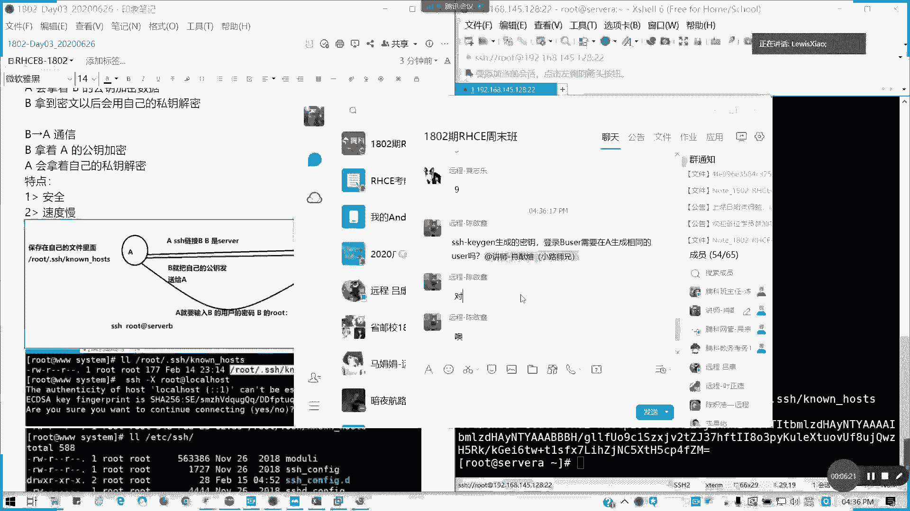

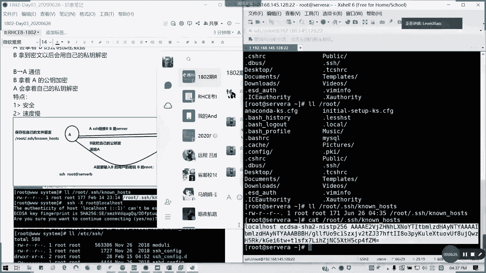

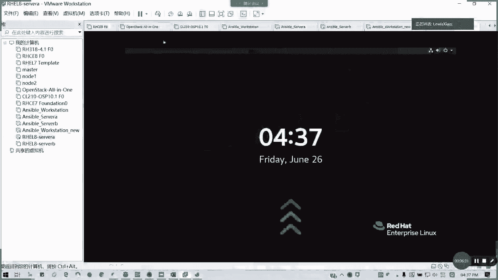

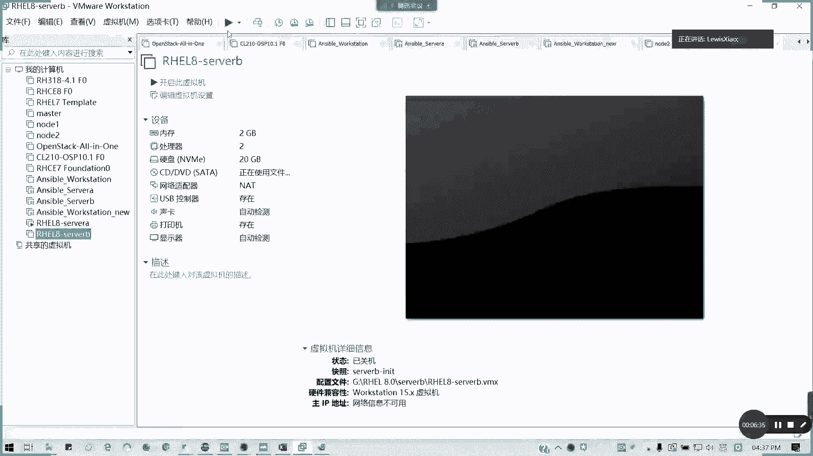

SSH连接建立的过程，就是基于非对称加密的“握手”过程。当客户端首次连接服务器时，服务器会将其公钥发送给客户端。客户端验证并接受后，该公钥会被保存在客户端的 `~/.ssh/known_hosts` 文件中。此后再次连接，即可跳过此验证步骤，直接进入身份认证阶段。

## 核心操作：配置SSH免密码认证 🗝️

建立免密码认证（又称密钥对认证）是SSH的一个重要应用，它通过密钥匹配来验证身份，比密码更安全，也是实现自动化运维（如Ansible）的基础。

以下是建立从ServerA到ServerB单向免密认证的步骤：

1.  **在ServerA上生成密钥对**
    在ServerA上执行以下命令生成SSH密钥对。过程中会询问保存位置和密码短语，直接回车使用默认值并设置空密码即可。
    ```bash
    ssh-keygen -t rsa
    ```
    此命令会在用户家目录的 `.ssh/` 文件夹下生成两个文件：`id_rsa`（私钥）和 `id_rsa.pub`（公钥）。

2.  **将公钥复制到ServerB**
    使用 `ssh-copy-id` 命令将ServerA的公钥安装到ServerB上指定用户（如root）的授权列表中。
    ```bash
    ssh-copy-id root@serverB_ip_address
    ```
    执行此命令后，需要输入ServerB上root用户的密码。成功后，ServerA的公钥会被添加到ServerB的 `~/.ssh/authorized_keys` 文件中。

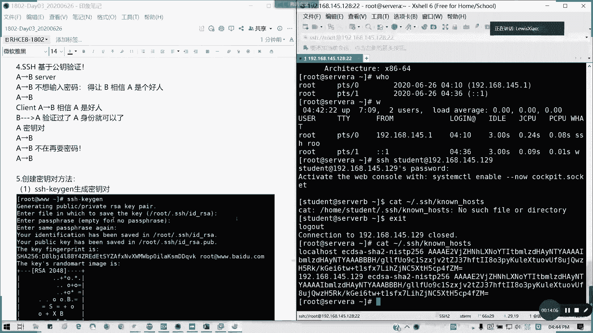

3.  **验证免密登录**
    完成以上步骤后，从ServerA再次SSH连接到ServerB，将不再需要输入密码。
    ```bash
    ssh root@serverB_ip_address
    ```
    这个过程实现了单向信任。若要实现双向免密认证，需要在ServerB上重复相同步骤，将它的公钥复制到ServerA。

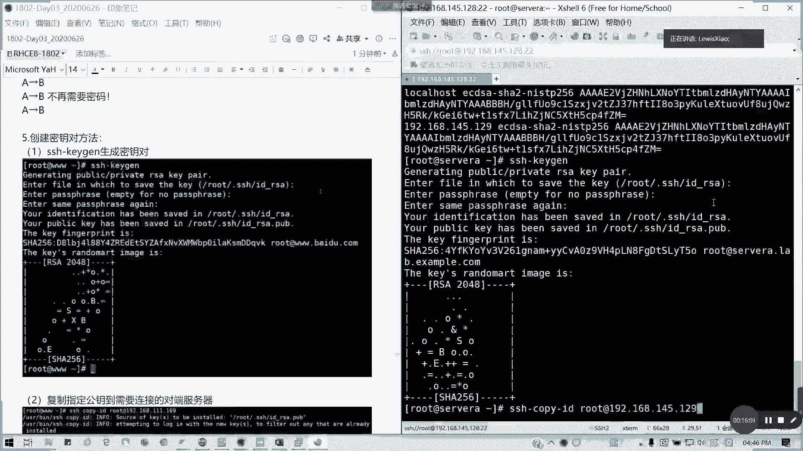

**重要提示**：免密认证是针对特定用户的。上述操作仅为ServerA的root用户到ServerB的root用户建立了信任。如果需要为其他用户建立信任，需要切换到相应用户并重复上述过程。

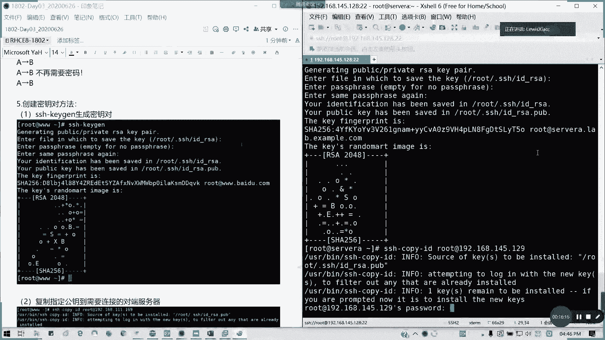

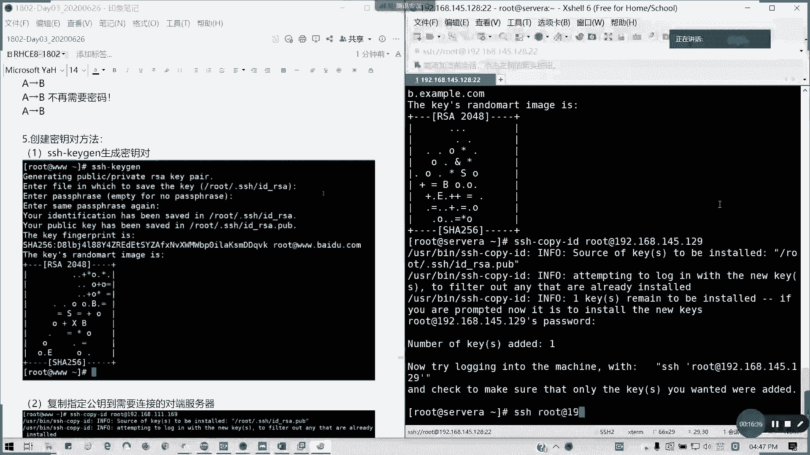

## 服务器端安全配置 ⚙️

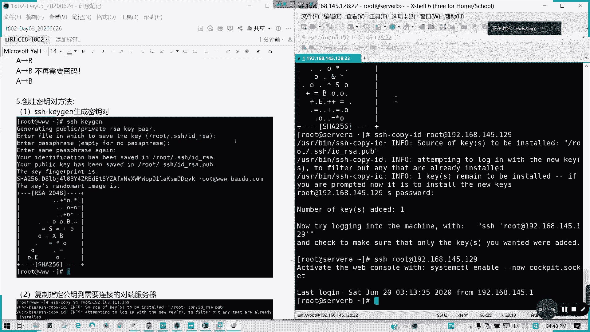

为了提高SSH服务器的安全性，我们通常需要修改其默认配置。主要的配置文件是 `/etc/ssh/sshd_config`。

以下是两个常见的安全加固配置：

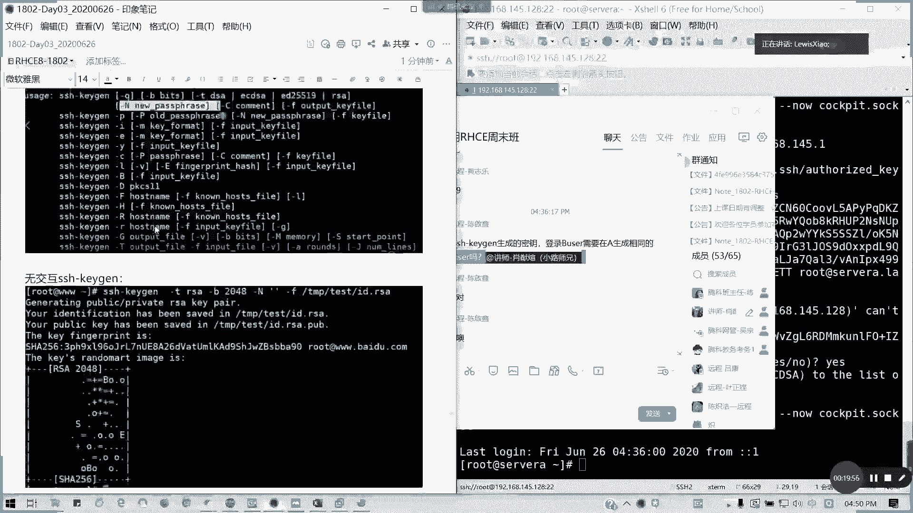

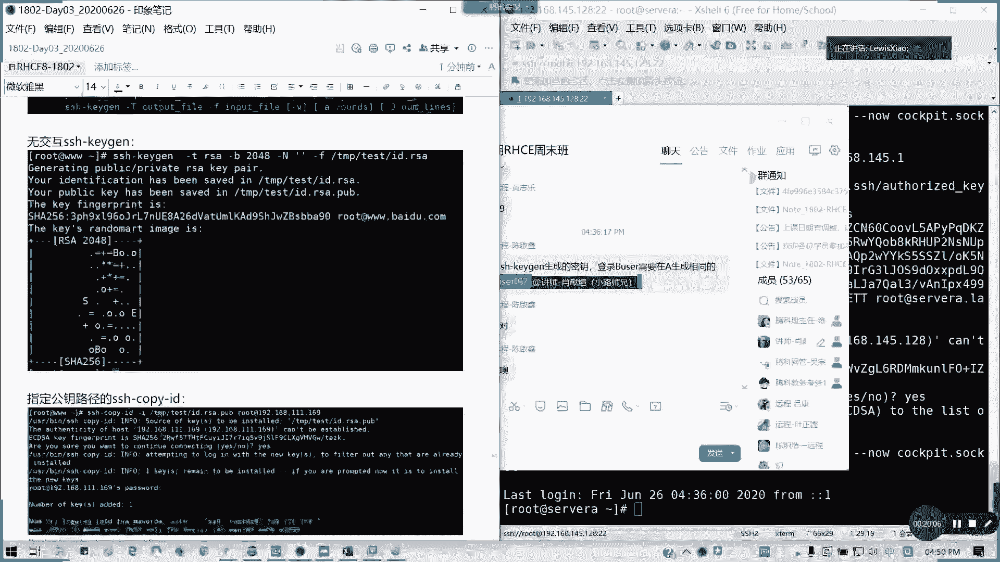

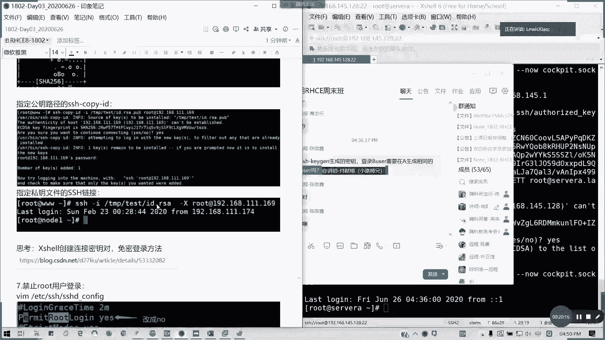

1.  **禁止root用户直接登录**
    强制管理员先使用普通用户登录，然后再通过`su`或`sudo`切换权限，增加安全审计层。
    *   编辑配置文件：`vim /etc/ssh/sshd_config`
    *   找到 `#PermitRootLogin yes` 这一行。
    *   取消注释（删除行首的`#`），并将值改为 `no`。
    *   修改后保存文件，并重启SSH服务使配置生效：`systemctl restart sshd`

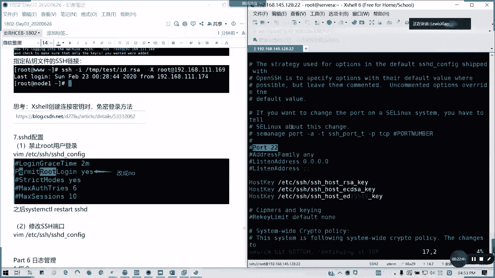

2.  **修改默认SSH端口**
    将默认的22端口改为一个非熟知端口，可以减少自动化扫描工具的攻击。
    *   编辑配置文件：`vim /etc/ssh/sshd_config`
    *   找到 `#Port 22` 这一行。
    *   取消注释，并将 `22` 更改为一个未被系统其他服务使用的端口号（例如 `2222`）。
    *   保存文件，并重启SSH服务：`systemctl restart sshd`
    *   **注意**：修改端口后，客户端连接时必须使用 `-p` 参数指定新端口，例如：`ssh -p 2222 user@hostname`

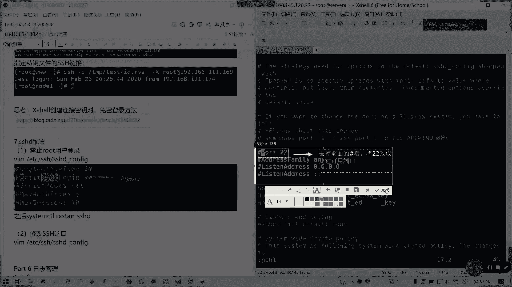

## 故障排除与常用命令

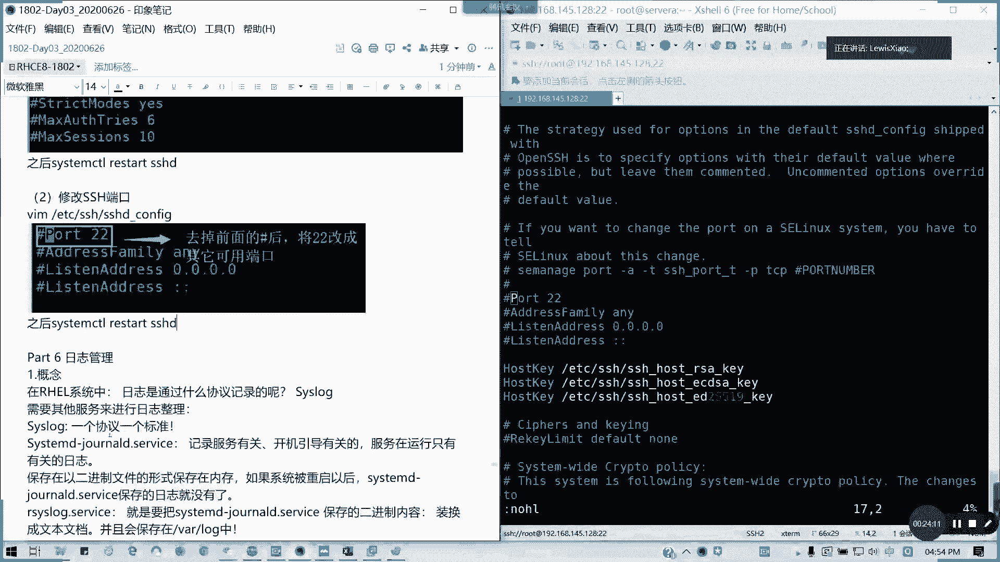

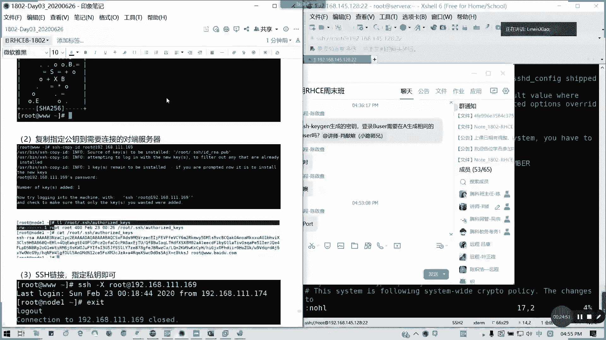

*   **远程主机密钥变更警告**：如果连接时出现“WARNING: REMOTE HOST IDENTIFICATION HAS CHANGED!”警告，通常是因为服务器重装系统或密钥被重置。此时需要删除客户端 `~/.ssh/known_hosts` 文件中对应旧服务器的条目，然后重新连接。
*   **通过SSH执行远程命令**：可以在不进入交互式Shell的情况下，直接执行单条命令。
    ```bash
    ssh user@hostname “command_to_run”
    ```
*   **指定密钥文件连接**：如果使用非默认路径的密钥，可以使用 `-i` 参数。
    ```bash
    ssh -i /path/to/private_key user@hostname
    ```

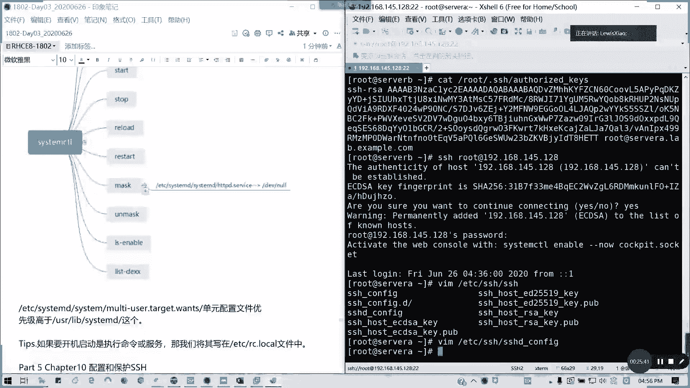

## 总结

本节课中我们一起学习了SSH服务的核心管理与配置。我们首先了解了SSH基于非对称加密的安全通信原理。然后，我们重点演练了如何配置SSH免密码认证，这是实现服务器间安全信任关系的关键步骤。最后，我们探讨了通过修改 `sshd_config` 文件来提升SSH服务器安全性的两种常用方法：禁止root直接登录和修改默认端口。

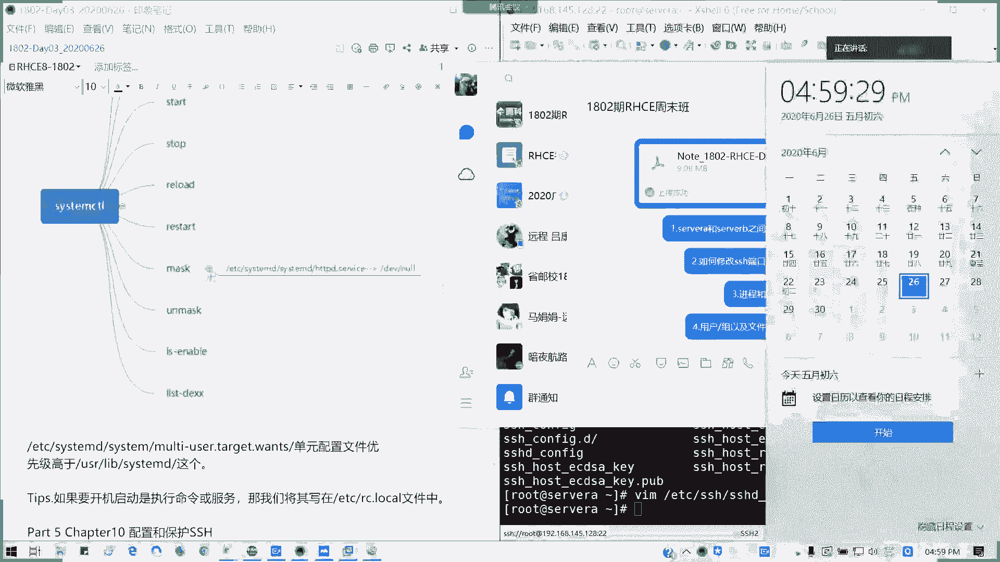

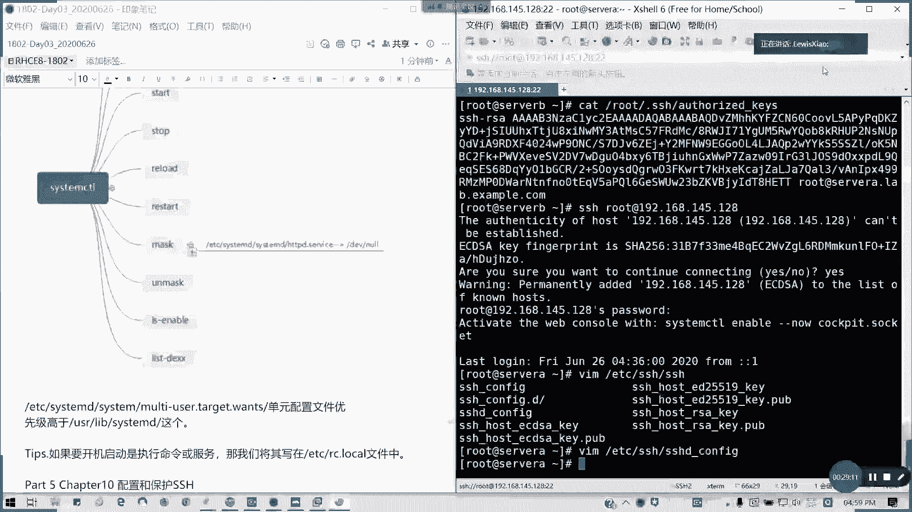

掌握这些知识，不仅能让你更安全、更高效地管理远程服务器，也为后续学习自动化运维工具（如Ansible）打下了坚实的基础。