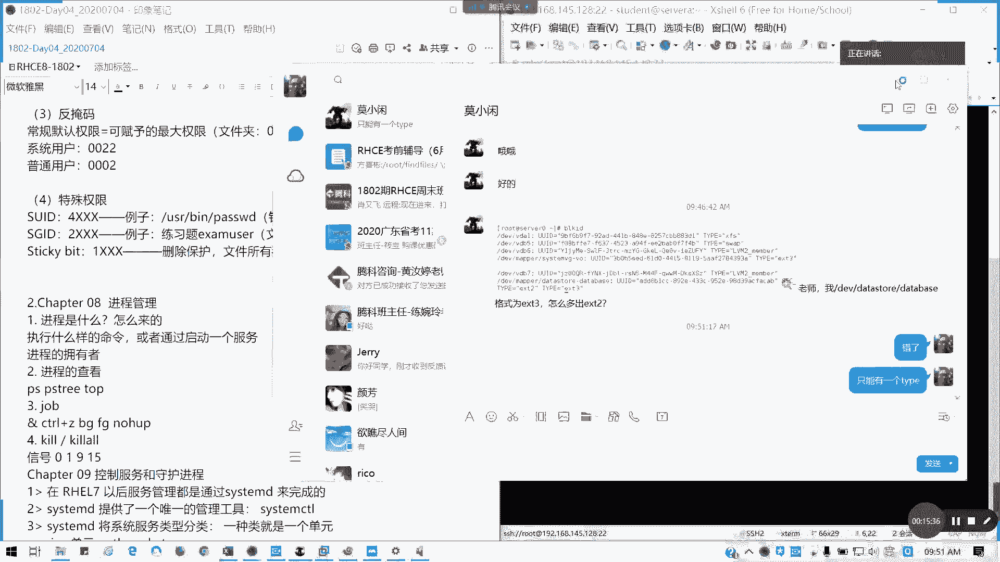
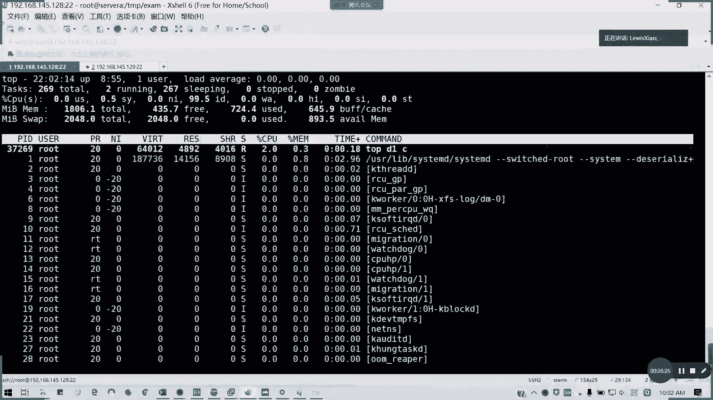
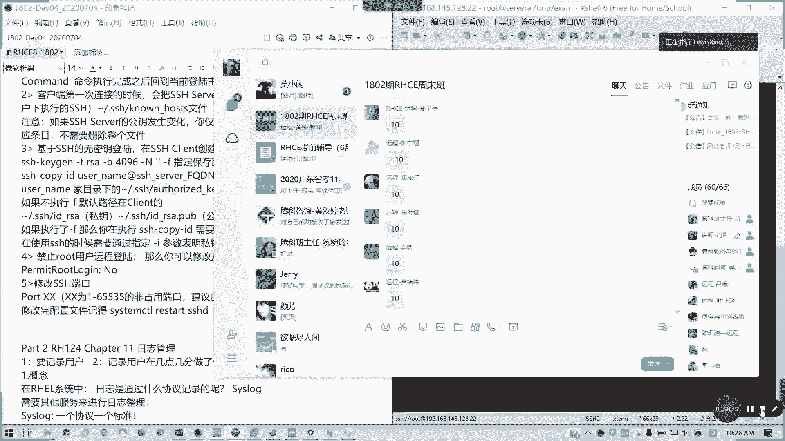

# 拿下证书！Redhat红帽 RHCE8.0认证体系课程 RH124+RH134+RH294三门认证视频教程 - P19：19_Video_Day04_Day03课程回顾 - 16688888 - BV1734y117vT

好，各位。学员们啊，各位师弟师妹们们，大家早上好啊，今天是北京时间啊，北京时间今天7月4号早上的9点35分。那我们啊我是小路师兄，我们今天开始我们鸿帽1802HC8。0第四天的内容。

首在讲第四天的内容之前呢，我们今天回回顾一下我们上周到底讲了什么东西啊，上周我们是讲了第七到第十0章的内容。今天我们会讲6章，也就讲到第一本书结束，希望大家能跟上来，好不好？我现在把语速稍微放慢一点。

因为有人跟我说，跟我提的，就说啊语速有快，就班主任那边反馈的一些。东西所以的话我就把语速稍微放慢一点，好吧。呃，我们先回顾一下。呃，我们6月26号那天啊，我们因为上周我们只上了一天课。

6月26号那天我们到底讲了什么内容？首先我们讲权限管理，我们来回顾一下权限管理。我们知道要知道几个概念，一个是。用户身份。用户的身份还记得吗？一个文件是吧，它的权限是这样子。对吧有三位权限，对不对？

三三个部分它它总共是有9位来标权限的部分，然后。大家可以在群里回答我吗？分别是什么？

分别代表什么东西啊，这三个RWX，然后前面是有个类型的对吧？我把它用空，我把我把它用空格拆开来。能代表什么东西啊代表什么。啊，陈子欣说的没错啊，别说没错，分别是U啊。

打卡待会儿我会截图啊，待会截图，放心。第一个是所有者，我们或者是叫做优色也行，或者onnor都可以。因为为什么一开始不写O呢？因为写O的话，会跟我后面的一个R的分就出现了混淆，懂吧？两者都是O开头。

那我到底是到底什么意思，对不对？一个是所有者也就是我们的user，因为这里的话，我用英文写会稍微会好一点。然后第二个是我们的。这个所有者里面所属的组别，对不对？组别group。同组的他用什么权限。

这里也是这里也会啊也会说明。然后第3个。除了这两者之外的其他。可以简单理理解为其他人跟我这个所所用用户所有者跟所属的组都无关的一类用户。那他们是什么权，什么身份，对不对？

然后他们用过什么权限这一块的话啊，这一块的话我们需要理解，因为我们接下来包括我们无论是linux运维的哪一个方面或者是我们考试哪怕我们实际应用也好，考试也好，都会涉及到一个。然后前面这种是要做类型。

对不对？我们复习过的。对吧前面那个叫类型，就是我用件类型。我们在D。我们在管理文件系统的时候，是不是有有讲过，对吧？文件类型有讲过好。这一块就是用户身份的一个问题。既然知道身份，我们就来讲权限。

权限三种。啊，对吧？Rread吧，readable宝吧。可读对吧？W writeable。和谐。X executable。可执行。可读可浅者知行。然后呢，对应数值法是吧，分别是4。2。Yi。对吧4合一。

当然对于文件或目录，有些权限，它是有像我们这三个权限。如果啊就是说像组合的话，我们是有8种可能性。但是呢有些权限对我们就是有些组合对我们我们来说没有意义。对不对？像你文件夹文件夹的话，你要能够访问。

能够打开，能够列出内容的话，你是不是你既要有执行权限，也要有读权限，对不对？懂我意思吗？对吧。对于文件夹。一般来说是要R杠X。一般来说，你要你如果没有X权限，你根本就进不了目录。如果没有R权限。

你列不了里面的内容，也就是我们上次给他演示的就是你只能读出文件名。但是你的属性等等一堆问号。懂我意思吗？然后对于文件。通常来说，要不就没有权限，要不就是R权限，对吧？默然说你要读出来嘛，对吧？

你要读出文件内容，那至少你有读权限，对不对？有读权限。然后如果你要就执行的话，你要加个X，但至于写不写这个看实际情况，有一些比如说景像只写只执行，这个没什么意义的。因为你都读不来出来内容。

比如说我们VIM都可我用SH我只读就只可以可写可执行的。那你这文件你不能执行什么意义？懂我意思吗？所以的话这个我们通常来说啊，这是常见权限啊。常见权限我要补充一下，不是说它有几种。

像我这里我可以打开上大概可以打开上周的笔记。我昨天我把第一第一章的笔记重新更新了，因为我发现我传上去的内容好像是错的啊。

对于木来说，我们就是通常就是这三种情况，我把它列出来，这样的话也就方便大家去。

去复习啊。

要不就是可要不就是读写执行全都有，要不就是读跟执行，要不全没有。对不对？这是对于文件夹，对于文件来说，对文件呢，我们对文件我们还有什么呢？看一下啊。

对文件来说就是。他不一定。要那个。他不一定需要执行权限，对吧？RWX然后还有一个三个横杠。对文件来说，三啊，我们通过对文件来说通常是三种啊。

一、还有可读可知行一种，就总共是5种。

对吧对文健来说，这5种权限都是正常情况，都是我们可以预想可以见到的。但是对于我们的那个。

好，很多人打卡啊，对于我们的文件夹只有三种情况，能理解吗？

可以吧。这权限的问题。第3个。我们讲到一个反言嘛。反言法就是。其实就是我们。最大权限。法院嘛我们的呃我们常规的。常规默认权限。本月。可赋予的最大权限减去反言码。能懂吗？懂我意思吗？

这个公式就就是我们返页码，它的作用在哪里？像我们普通用户的话是吧？像我们那个普通用户。反言码是0022。对不对？对对系统管理员啊应该是系统管理员。对我们系统用户。是0022，对于普通用户。反而是。

0002我们可以看一下。对吧我们是我们root是002，然后我切换到stuud用户。这里我我不怕说错，我可以验证的。对吧明白吧？也就是他的最大权限减去法言码。最大权限。文件夹可赋予的。

应该我前面应该加个可赋予的最大权限。文件夹。0777对吧？文件通常。0666。所以你为什么我们默认界立的权限里面，我们的文件夹是0755，然后我们的文件是0644，这样就可以理解了吧。

为什么前面加个零呢？我就加一接下来我要串到一个叫做特殊权限的问题。啊，特殊权限有3个。特殊权限。一个是SUD。对吧。SUID其通常仅对文件有用。我们讲过哪个例子呢？

例子是我们是不是我们的优色病里面的passWD啊。对吧我要修改。别人的密码。那是不是我要调用那个root的用路调调用root的权限啊？它这个是不是有SUID对不对？

然后你要修改这个ETCsha这个文件呢，它又是谁都没有的，就什么权限都没有。那是不是我们要普通用户如果就普通用户我要修改自己密码，自己的密码。

是不是我们要调用它的password rootot的这个用户获取临时获取它的权限，我才能去修改自己的密码啊？对吧所以这一个就是我们的SUID的一个作用。对于目录没有没有任何。对目录的话，这个没有影响。

主要对于。主要是。针对文件。然后还有一个超级GIDGID这个考试经常考啊，无论7或8都要考这个SGID它的千位数是2，所以我这里我就4叉叉叉，我这样的话会好一点，对不对？

就因为我们权限总共完整的mod是4位数，然后SGID我们是干嘛呢？我们就是那个我们例子。例子，我们是不是我们做练习题，对吧？练习题那个at那个exus对不对？它主要是文件呢，就是用它的组。来执行权限。

那目录呢？他有一个作用。如反我的这个文件夹它是哪一个属于哪个组的？我以我接下来创建的文件，就以后更新的创建的一些文件或目录下属文件或目录，它就遵循我这个文件夹，我设定SUID这个文件SGID这个文件夹。

它的属组就依次排下来。懂我意思吗？对目录就是遵循我们。这个文件夹的属组，然后新建之后全部我们不用再设定了，全是它。懂我意思吧？我看有有那个有声音啊，谁没闭麦，我看一看。我听到有那个听到杂音在。啊。

倒闭了哈。好，SJID能理解的话，我们还有一个叫做粘智味。我们叫做sticy bit。他的权限是最小的，叫E叉叉叉。也就是相当于。他仅对目录生效，对吧？相当于删除保护。懂吧？删除保护，仅对目录生效。

좋了。所有者。就是应该是说所有文件所有者。和root。除外。对吧能理解我意思吗？如果设了年之位，也就是我们在其他的那一个我们。我们这里啊我补上一个命令叫做这里是U加S。这也是G加S，然后后面是O加T。

啊，O加T什么意思呢？也就是它的所有者的那个执行位是变成T的话，那如果这个文件。我设我这个文件夹设置链置位，那它属下的文件夹或文件，只有文件所有者以及root用户能够删除它，否则其他用户你别想动。

你可以增删，但你可以增改，但不能删除。

能理解我意思吗？我还得去回答人家的问题啊，因为这是上星期考前辅导，期考前辅导人家题目人人家的问题啊。

好，我们还讲了一个隐藏权限。隐藏权限有一个叫。A是吧。和I对不对？以A和I。什么区别还记得吗？AI一个是完全写保护。也就是你设的隐藏权限，我们是用那个。changeATTR还有LATTR来做。

如果是设的A，是不是完全写保护，完全写保护意思就是你只能读，你不能你修改不了，对吧？也追加不了。就相当于我们以前3。5英寸软盘那个开关，或者是我们早期U盘那个开关，对吧？斜法那个开关，你打下去。

你的文件系统会被止读。然后这个呢。I是部分写法护，我们可以这么理解。可通过。呃，可通过那个重定向。追加。对吧。我我没有说有没有说对，对吧？可通过重定向去追加。

也就是你不能用VIM你这个文件你设置了部分写保护，你不能用VIM去编辑保存。但是你可以用e命令可以去追加内容，这是隐藏权限的I部分写保护，我们可以这么理解。这样我希望说通俗一点。

其实它的官方概念不能这么讲。但是我就用的通俗的概念给大家讲，一个是完全写保护，一个是部分写保护啊。然后还有讲我们在追加了一个内容叫做针对啊就特特定用户权限。特定用户以及组的权限。后面如果遇到的话。

就不我后面如果再遇到的话，我就不再讲了。呃，特定户物组织权限查看。get就也就是FACL了，我们的文件的ACL啦。get FACL后面跟我们的文件名或是目录名。对吧。我可以看一下啊。

🎼我们是不是有一个叫做tests，然后里面TMP，然后里面test，对不对？Get F，CC， L。哦，多挡说命令啊。对吧。这是这常规，如果你有那个。如果你有那我上次说的是我建了一个叫exam哦。

exam的这个文件夹，我切到exam那里去。对吧然后我们现在的话是普通权限。然后如果我们要设定特定的权限是的话。修改那就sFACL。咁 m。是吧然后如然后就是你的。是用户是所有者还是怎么样是吧。

是组还是怎么样？先到先啊，然后呢，就你的。用户名。🎼是吧你的名字，然后你的。权限，然后后面是文件名或目录名。这刚来的麻烦在前面签一下到啊。然后如果是那个。这里的话如果有递归啊，就加这个R就行了。

能懂我意思吗？这是我们第七章。就这么就就这么个回顾啊，我第七章讲的内容总共是6个小点。但这个你问我考试考不考，考试呢涉及到每个题，就是说基本上每个题，包括这些我们接下来下哪怕是下半部分smo都有涉及。

所以的话请大家这个要熟悉好。然后呢，如果明白，请打数字7，在群里面回我。

我希望无论是新手还是老手，都要明白。我现在相当于给大家做一个总复习二流速度变慢了啊，速度变慢了。然后希望大家能够理理解啊，在在现场也有打个7啊。我怕大家举手举的累哈，所以的话就在群里面回就行了。

反正大家都当一当键盘侠，没太大问题啊。只要不是只要是合合法就行。不理解的现在提问不理解不明白的，现在提问。然后为这个练习呢，我我上上周五我为的这部分，包括我们的用户跟组，我还送上了四道练习题。

上次我们在课堂做了，不知道回去有没有练啊，有没有练。这四道练习题很大概率考试会考比较多啊，所以的话这一块请大家熟知啊。请大家熟知。9四道练习题。师兄给的东西都是考试会有的一部分。如果没有。

我不会讲太多啊。当然还有一种情况就是生产环境需要。用到比较多的，我才讲。好，没没有的，现在先到啊，我给大家一两分钟消化一下。然后呢，接下来我们会讲第八章。第八章呢讲什么东西？第八章讲。进城管理进城管理。

进程管理呢。进程管理我们讲什么呢？进程管理首先我们要知道进程是怎么来的对吧？进程是怎么来的，然后它通常来说，它是一个我们去运行一的命令，它就会触发一个进程，对吧？进程里面如果还有子进程，它也有县程。

对不对？现成，然后通常我们执行个命令或者是。启动跟服务。都是会触发进程，对不对？帮我们windows，我们每我们执行一个程序，就当时我们开我们的腾讯会议啊，或者是我们开我们的QQ。

或者是我们的一个ve word，你看全部都是进程，哪怕一个开始菜单，哪怕是一个录屏，都是进程，对不对？然后呢，进城的拥有者是谁啊是谁？通常说两种情况，一种是我这个文件或命令的所有者。

第二种是我在配饰文件里面指定的用户和组，像我们的阿帕奇，我们的tomca，我们的一个engs，对不对？x对不对？这些的话都是指定的对吧？指定的像我们的HTTPD我们的we服务是是用了一个叫阿帕奇的对吧？

阿帕奇的一个。

用户在执行啊。我看一下，我这里阿帕奇还应该还装了啊。我用AU插就知道了，杠加不加横杠无所谓。对不对？我们这里是不是我们的运行的用户啊，运行用户他当前这个阿帕奇这个已经在启动的阿帕奇这个进程呢。

它是用阿帕奇这个用户，而不是用root用户去运行的，这个能理解吗？然后接下来进程如何查看在我们常用的几个命令PS是吧？

process process state啊 status还有一个列进程数的叫PS tree啊。对吧像进程数这个会列的会比较详细，就到底我这个进程是怎么来的，对不对？从我们的stem D。

然后到哪个模块再触发到哪一个进程，对不对？我们可以用AUP来列出详细的内容，包括它的一个进程号都出来了。然后呢，还有一个我们top查看实时的一个情况，昨天有人问我啊，所以有人问我到底这几项是什么意思。

我把它放大来啊，这几项来什么意思？特别是昨天问我这个CPU的啊，它这一行呢它是百分比，对不对？我们的这个状态是我们这个百分比啊，百分比呢它是所有用户空间用户进程的一个平就是所有值的一个平均而不是哪家。

懂我意思吗？就我昨天我发在群里面的是一个补充内容啊，我们这个CPU百分，他前面有个百分号证明是百分比。所以的话它这个呢是像用用态系统态，还有我们的优先级态，还有这个是IDid知道吧？空闲的对吧？空闲的。

然后还有等待的，还有那些等等啊，还有稳定稳定态这些还有一些僵尸的，对吧？它所有进程里面，它都是取一个平均值，而不是累加，所以的话你会看到下面的这个每个进程，可能会超过上面的一个数值，对不对？

也有可能它下面进程就会超过百分之百，为什么？因为我们现在不我们CPU现在不止一个核心，对吧？哪怕是以前的0405年刚刚出超线程的时候，对不对？它有两个逻辑核心，所以的话它这里表示。

的仅仅也是单个核心占用的。如果他超过单个核心，它会超出百分之百。懂我意思吗？所以不用过分的担心，我们这里都是看平均值，对吧？如果你这个大量进程，这样CPU你爆满了内存也占满的话。

你这里的那个CPU读取的一个延时时间，分别是一分钟、5分钟、15分钟的话会超过20以上，甚至是几百上千。这种情况，一般如果是像我们纯网页服务的话，一般是发生在你被Ddos攻击的时候。

或者是说进城主塞的时候就大量占用进程你被挂的木马等等的。因为我之前我在那个。

我在做那个技术支持的时候，就经常有这种情况，对吧？你你某个某个网站，然后你的进程是把把那个把整台机都塞爆了，或者是网络带宽已经挤爆了。懂我意思吧？所以这种的话。

我们通常来说安全范围像CPU安全范围都在5以内，对吧？5以内5到20你要注意一下超过20你就要小心了。因为这时候你已经内存已经吃差不多了，然后CPU也就百分之百在满负荷。

所以所以的话它就会开始调用我们的s空间，它要调用s，然后还然后然后这调度会出现一定的缓慢，对吧？你的IO读写啊各方面你会进行造成一定缓慢。有时候严重的话，你整个系统没得救啊。

所以的话我们昨天就补充了一个top的一个相关知识，也有一些热心的同学也发了我们的补充资料来自于51CTO也好啊，我们的C也好，我们的那个。

社区或者是我们的权威CSDN都好，这些资料大家可以去看一看啊。有有些因为我们课堂时间有限，不可能全部讲详细。但是现在互联网这么发达，课外资料多的是。啊，所以大家有空的话可以去看一看有些补充的东西。

希望能够学到更多。好，我把这个收回来。

然后呢，我们还讲了一个job，我们的一个作业调度。作业调度。我们就这是不是有讲一个，我们通常一个终端只能运行一个前台进程，对吧？前台就是我直接显示在屏幕上。对吧。比如说我拼一个百度点com是吧？

我这里我是不是前台进程，我除了不终止，我除了终止，我是不是什么都做不了，对不对？前台进程，那如果直接一开始抛到后台，那我就加个N的是吧？抛到后台。加个N，它加个N的话，它会显示，但是你在后台进程，你就。

对呀你终止也终止不了，对不对？你要去Q掉晋升才可以。对不对？对吧我的进程是叫做我看一下这里的话，我要看一下他进程刚才讲到的一个进程号叫做。

停不下来哈，我看一下它进程号叫做三姐啊。这条叫37312。我把它停了啊。一个任务直接到后台运行，那就是N，对不对？无论它前不在不在前端显示就N，然后conttrorl加Z可以终止啊，可以中断啊。

可以中断进程。然后呢，如何把一个作业从前台调后台，从后台调前台，方后台的命令是BG，然后面加上一个作业的ID号。记住是前面那个括方括号的作业ID，而不是它的进程号？像FG是从后台扔到前台来，对吧？

然后如果要作为一个无终端，也就无人值守，你哪怕关掉终端。你也能再运行的，就是变成一个系统态，一个叫做守护进程类的，你就前面在执行命令前面加个no how。NNOHUP那这样的话，它的一个终端。

你去查它的那个终端，它是从哪个终端发起的时候，它会变成一个问号，也就是一个无就是一个后存后台的，懂吗？你除了重启就结束掉系统，你重新启动关机，或者是你人为的结束，否则它这个进程会一直运行。懂我意思吗？

现场人可理解吗？好，还有一个我们讲到的一个作业控制，我们又讲到一个叫信号处理，对吧？信号处理。通常说我们讲的是九跟15，就强制杀进程，对吧？Q-9或Q2-9Q2的话直接带关键字Q的杠9。

然后后面带你的进程名字。所有进程当即被杀掉，没得挽留是吧？可能你没保存的一个修改啊，或者这些会丢失。然后Q-15呢正常结束，它会去保存你后台文件收集信息等等。然后再安全的结束进程。

当然我们还讲了零跟一0是用于调试这个进程是否存在一呢相当于重新加载，也就重启我们的进程。然后其他的我们不常用。能理解吗？如果这张第八章总体的内容能够理解掌握的话，请在群里面打个8，谢谢。

我希望大家都能理解哈，我已已经把速度放的这么慢了，已经好像那个录音录音带已经有点卡带的感觉啊。因为因为有些人觉得我讲的太快，我就把它把我就把进度放慢。因为今天我们时间是有。有问题及时提问。

不要说只打一个8哈。我你如果你只打8的话。现场明该没有问题啊。家庭的号。呃，进程号。对，叫进程号PID啊，Q杠9加PIDQO-9加关键字进程关键字。

比如说HTDPD它就会把相应的跟他有关的所有进程全杀掉。通对。Q-9呢通常只结束一个进程。对，通常我们用的更多的酒，就是说哎我说是不是，我就把你把你给咔嚓了。对吧。然后杠0呢就是我测试这个进程在不在。

杠一呢就就杠一呢就是相当于reload。真刷新吗？重启重启重启进程。但是通常我们不这么做，因为我们讲到了一个服务管理了。

对吧。我就瞬间的这位同学啊，他的一个提法。是。肯定是没用过，因为我们都用到服务了，用服务是更科学更合理的方法。我们不可能说天天来杀杀进城，重启进城，那多累呀，对不对？服是一个完备的系统不是这么管理的。

所以所以的话我们引用到了一个服务的概念。这样我们以前呢。是不是像service是吧？我们六以前是用service带服务名，然后后面带一个动作。然后如果是这个启动，就是我们引导进入到对应的启开机启动。

进入到对应的模式。是不是用IIT切换，对不对？但现在我们红帽七以后的服务，全部用stem第的管理，也就是调用它的一个唯一的管理工具，叫做system cTL。懂吗？它是将一系统服务类型分门别类。

通常一类就是一个单元，它包括了像服务。So。像那个单元unit，像路径。是吧。像套接字。还有一个我们接下来在十四在第二本书十4章就控制启动过程的时候，会讲到一个叫做目标。也就是我们切换。

比如说我们从图形界面临时或者永久切换到文本界面也好，呃，紧急救援模式也好，对吧？都是通过切换目标来实现，而不是以前的INITINIT这个已经没了，特别是7其它保留这个文件，它的这个文件不生效。

8的话彻头彻尾把INIT砍掉了。还记得我们以前关机是不是INIT0或是叫做power off。对吧或者是HALT hot对不对？这样重启reboot andIT6。对不对？

然后还有那个我们切换到多用户模式，是是3INI3。对吧还有一个多图形模式，是不是IIT5啊？但现在呢到他给之后呢，他把二砍掉了，也就是。不带网络的多用户模式，因为这个确实没有实际的意义。

所以的话在洪帽期以后，红贸官方把这个他给这个入口砍掉了，仅保留。救援模式。从此。关机。还有多用户模式，实时多用户模式以及图形化界面，就保证这几个，但四没有意义的啊，就是它的一个四这个值是没有意义的。

四的话没有定义吧。然后如何像我们每个单元具体都有配置文件，都在我们的。我们的unice系软件资源里面lib库sstemD。里面的シスタモード里面的。以服务开头的点service unit文件里面会定义。

服务他的启停的操作。还有参数，懂我意思吗？所有的服务我们只要是安装的，包括系统本身存在的，它都会在这里面定义我们单元的配置文件。所以我们以我们就如果有这单元配置文件的话。

我们通过system cTL systemstem control的命令，我们来执行对我们服务。对对我们单服务单元进行任意操作的时候，它都会。遵循我们这个单元配置文件的定义来进行我们所需的操作。

能明白吗？他操作很多种。通常我们经常讲的就是是吧，像那个。지도。停止。重重载，也就是重重载重启。还有呢就是开机启用，还有。不开机启动，对不对？通常就这么多，然后还有就是那完全禁用啊，这些我们少用。

对不对？比较少用。所以的话我们就记住这些，包括我们启动目标也是这么个搞法。这这部分内容就是我们简单的一个sstem controll的一个。用法的一个归纳。如果这一块知识明白的，请打数字9，谢谢。

有没有疑问？都明白了啊。有疑问现场提啊，直接群里面提。然后接下来我们还有就是我们复习最后一个内容叫做SSH我们的远程管理。

通常我们客户端连接远服务端，我们服务器的方式是通过SSH然后呢。后面是吧是用户名艾特远程主机。远程主机可以是主机名，也可以是IP地址。然后你后面我也可以直接把。命令给加了，对不对？

如果你要做我我只是需要执行一一次性的命令，那我就后面SSH后面加命令就得了，对吧？如果你要进入一个提示符的话，那就直接就前后面的那个comd不要。然后呢。

通常我们user name是远程服务器上的某个账户。remote host name呢它是一个完全合格的一个域名啊。如果我们家样的命令刚才说了，命令执行完成以后，它会返返回到我们当前的主机。

然后客户呢我们客户端在第一次连接的时候呢，会把我们的SSH我们server端的一个公钥保存在用户的啊。它的加目录里面的点SSH点noice就相当于我们我知道的这台主机，我已经知道我信任这个是吧？

我一开始信任我的指纹，我的那个妙队。公钥对吧？注意，如果我们SHH的公钥啊发生变化的时候，我们仅仅需要删除我们的客户端。保存的相对应的条目就可以了，而不是删除整个文件啊，它这个nho。

我只如果该发生改变，我的功能发生改变，我只要把它的那个条目删了，重新认证就行了。然后我密钥登录呢。我们有我们这个用法用在哪儿，用在那种我像anible，我们需要免密认证的一个场合，懂我意思吗？

这种这种会用的比较多，还有一种就是我们企业里面我们堡垒期是吧？保保垒期也用了很多，因为保垒期通常说它是让你选用户登录，然后让你是选择普通用户，然后说我直接建立一个建立一个性能关系之后，我就不用输密码。

对吧？通常密码也不会告诉。非管理员。对吧。怎么做？是不是？我们通常简单就SSS批准，然后后面什么都不用写，这里呢就是一个完整的格式。比如说我的类型得密钥类型，我的长度是吧？那我的保存路径等等这些。

然后记得生成对应用户的一个公钥之后，公司钥之后，记得把公钥复制到你要跟他建立信任关系的对应远程主机的用户上，记得是发送到对应的用户，而不是整台主机。懂吗？然后你建立链输入完对端的密码。建立完链接之后呢。

我们就下次我们再连接对应的主机的时候，因为它已经收到了你的公钥认证，也就是我们已经匹配上我们建立完关，建立好关系了。那我们就。直接对吧？我我登录我远程你，我就不需要再输入我的用密密码了。

我直接通过更加安全的公钥来认证。当然它会把公钥传在我们的远程用户的加入下面的点SSH里面的authorize key这个文件里面，它会记录记录下，你这台就是说受信的这台服务器上面对应用户的一个公钥。

它会记录在里面。还有一些公司要的啊，公司要这里有写啊，通常说私要公钥如果不指定，它就默认的保存在默认目录。如果加杠F是指定确定的一个目录自定义目录。然后我们还讲了一个就是啊就禁止用户登录，对吧？

禁止用户登录，我们可以修改一个叫做。HTTPD点com对不对？就改一个选项叫做prometer look log log in。等于no，对不对？就这样的话，你就root是不能直接远程。

但你通过其他用户是可以切过去的。然后还有一个我们讲的一个叫做叫做端口是吧？所我改SSHH端口就pos那里我们前前面把井号去掉，然后把这个数字。改一改。这里的端口呢也不是随便写的。

通常说它端口最大值是65535，对吧？6535，然后端口号呢，建议我们在制定的时候，因为我们企业通常来说不会直接把22端口暴露在外面，对吧？会修改自己端口。记得我们那个。

制定的时候采用1024打后到6535之间非占用端口，记得不要跟现有的服务冲突。啊，然后呢修改完。修改完配置文件。记得。System control。Restar。SSHD因为我们反正大家记得一个。

约定俗成的一个一个做法。只要你但凡修改了配置文件，你要重启服务才能生效。这点是在我们linkux服务里面是吧？我要告知我这个文件已经发生修改，我就我的配置我都要重新加载，我才能生效，对不对？

有些可能甚至要重启来生效，但大多数都是重启服务就可以了。对吧修改配置完的文件，记得重启服务，这个我不用再强调了啊。包括我们接下来网络服务也好，这些都好，都是一样子啊，都是都是一样。

大家遵循这个我们的约定。好，这一块没有问题，请打十啊，请打数字10。

有问题可以提问。看来大家应该都有回去都有做复习啊。那我们这样子，现在10点25分，我们休息15分钟之后呢。这样第十1章自制管理。自制管理虽然考试不会专门考，不会专门考，但是我们在通常我们在。

应用排错的时候。或者是我们要监控状运维情况，运维状态收集报告的时候，经常会跟他打交道啊，经常跟他打交道。所以呢这块希望大家待会能够认真听，这然考试真的不好啊。好，那我们10点40分啊，我们回来。

那大家可以上厕所或者是那个休稍微休息一下，把刚才的内容消化一下，没签到的啊。待会儿我在10点10点40分之前呢，我会截再截一遍数据，好吧。

