# Red Hat RHCE 8.0 认证体系课程：P19：Day04_Day03课程回顾


## 概述
在本节课中，我们将回顾上一讲（Day03）所涵盖的核心知识点，包括Linux系统中的权限管理、进程控制、服务管理以及SSH远程连接。这些内容是RHCE认证考试和日常运维工作的基础。

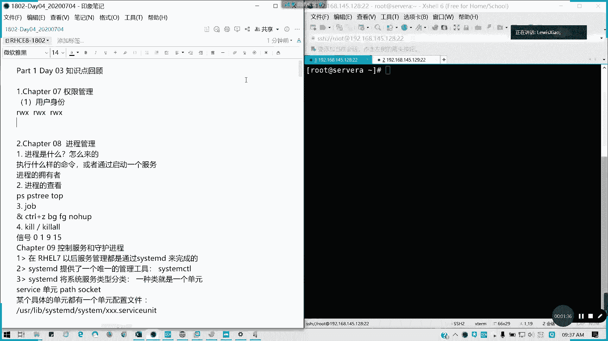

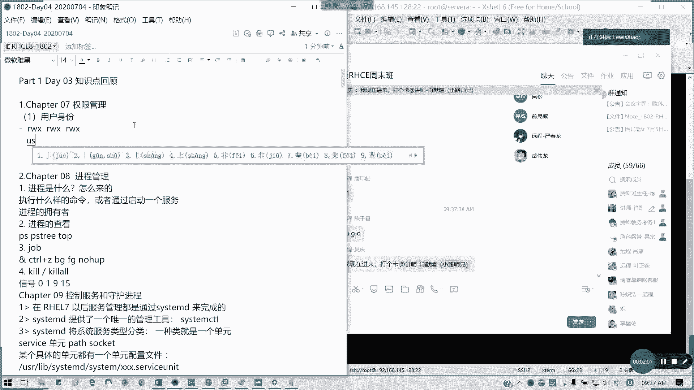

---

## 第七章回顾：权限管理

上一节我们介绍了文件系统的基本操作，本节中我们来回顾Linux系统中至关重要的权限管理机制。

### 用户身份与基本权限
一个文件或目录的权限由9位字符表示，分为三个部分，分别对应三种用户身份：
*   **所有者 (User / Owner)**: 文件或目录的创建者。
*   **所属组 (Group)**: 文件或目录所属的用户组。
*   **其他用户 (Others)**: 既不是所有者，也不在所属组中的其他所有用户。

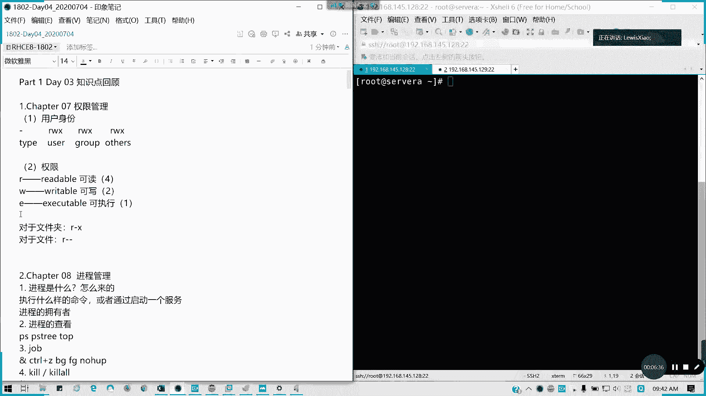

每种身份对应三种基本权限：
*   **读 (r)**: 对于文件，表示可以读取内容；对于目录，表示可以列出目录内的文件列表。
*   **写 (w)**: 对于文件，表示可以修改内容；对于目录，表示可以在目录内创建、删除、重命名文件或子目录。
*   **执行 (x)**: 对于文件，表示可以将其作为程序执行；对于目录，表示可以进入该目录。

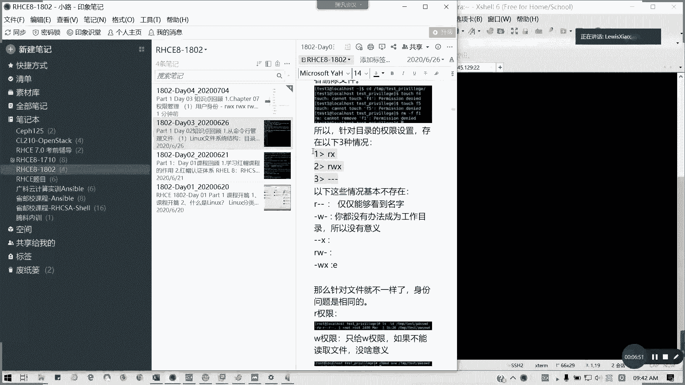

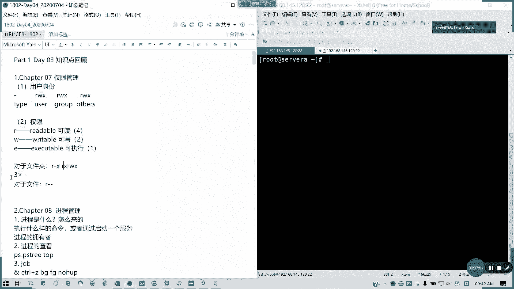

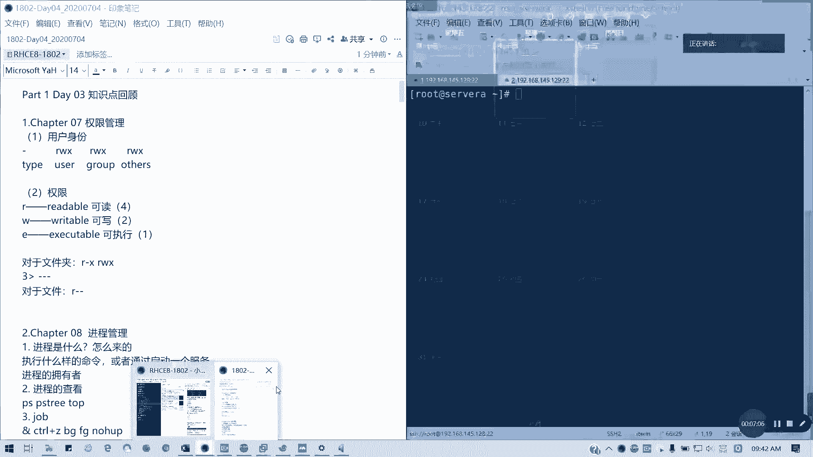

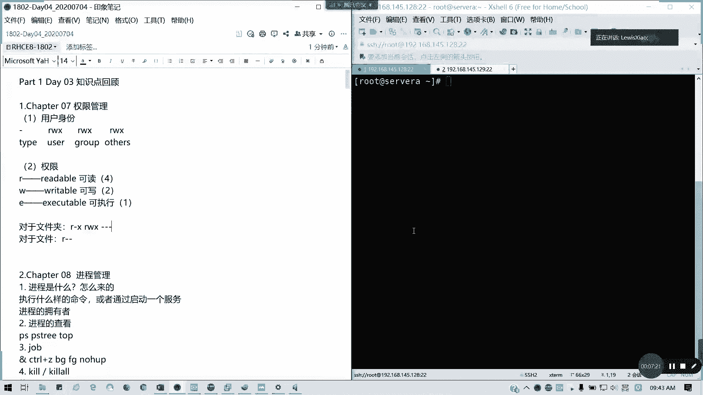

权限也可以用数字表示：`r=4`, `w=2`, `x=1`。因此，`rwxr-xr--` 可以表示为 `754`。

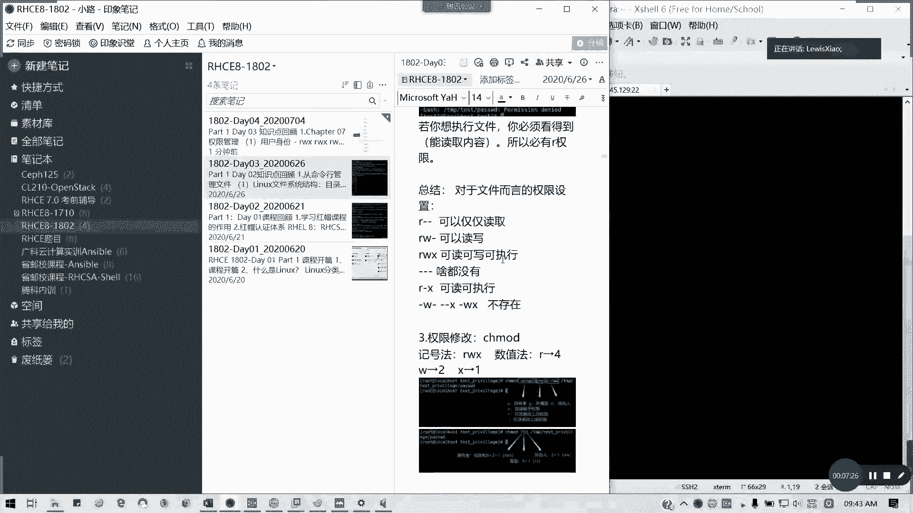

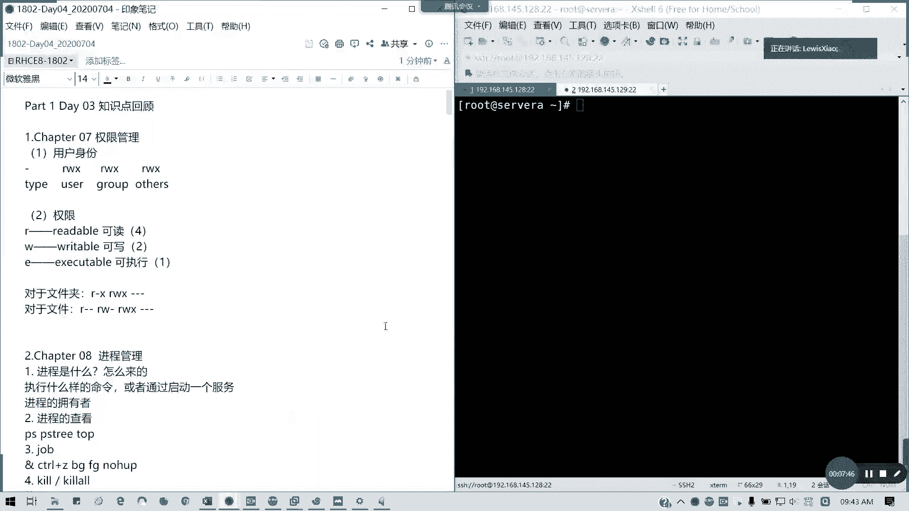

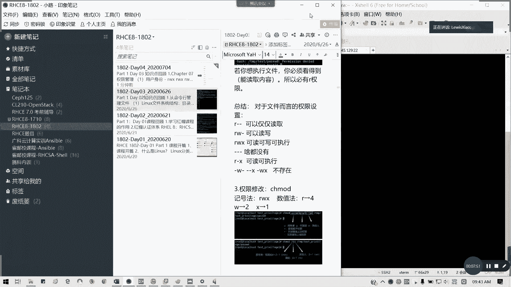

### 目录与文件的常见权限组合
以下是实践中常见的权限设置：

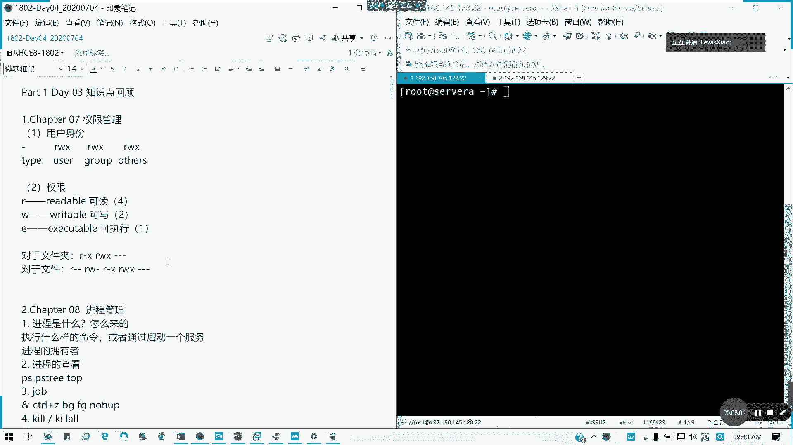

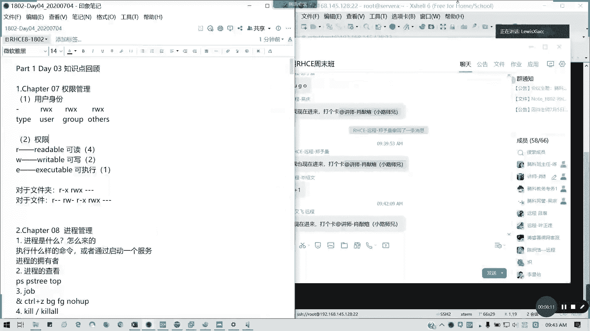

对于目录，通常只有三种有意义的组合：
*   `rwx`: 拥有全部权限（读、写、执行）。
*   `r-x`: 可以进入目录并列出内容，但不能修改。
*   `---`: 没有任何权限。

对于文件，常见的组合有五种：
*   `rwx`: 可读、可写、可执行（如脚本程序）。
*   `rw-`: 可读、可写（如普通文本文件）。
*   `r-x`: 可读、可执行（如二进制程序）。
*   `r--`: 只读。
*   `---`: 无任何权限。

### 特殊权限
除了基本的rwx权限，还有三个特殊的权限位，它们位于完整权限数字表示的第一位（千位）。

*   **SUID (Set User ID)**: 千位为 `4` (例如 `4755`)。
    *   仅对文件有效。
    *   作用：当用户执行具有SUID权限的文件时，进程将临时获得文件所有者的权限，而不是执行者的权限。
    *   典型例子：`/usr/bin/passwd` 命令，普通用户执行时可以临时获得root权限来修改密码。

*   **SGID (Set Group ID)**: 千位为 `2` (例如 `2755`)。
    *   对文件和目录均有效。
    *   对文件的作用：执行时，进程将获得文件所属组的权限。
    *   对目录的作用：在该目录下创建的新文件或子目录，将自动继承该目录的所属组，而不是创建者的主组。

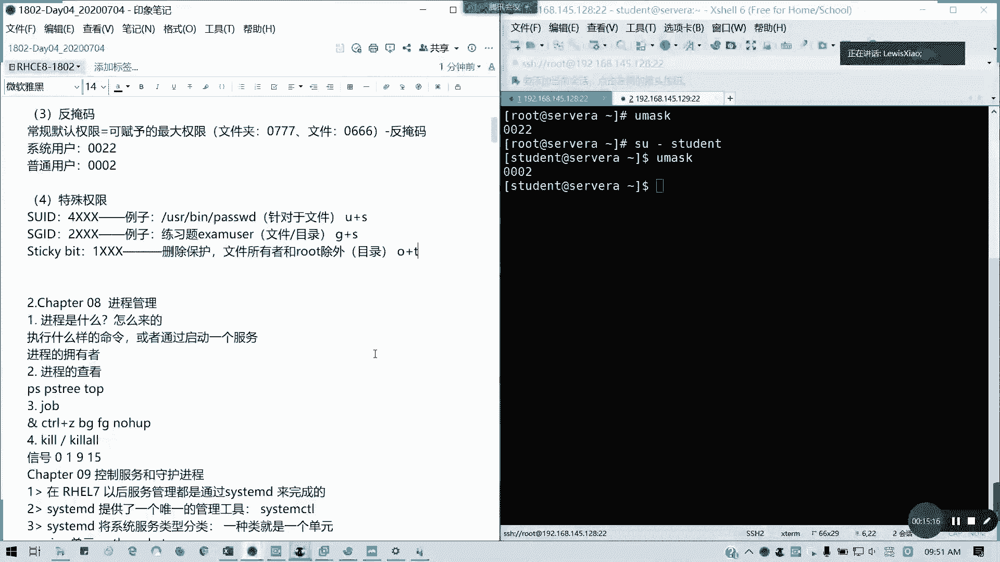

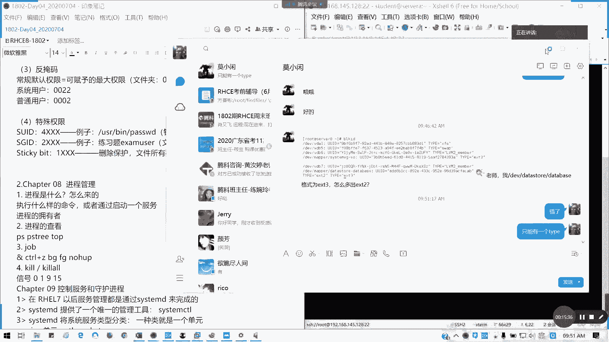

*   **粘滞位 (Sticky Bit)**: 千位为 `1` (例如 `1777`)。
    *   仅对目录有效。
    *   作用：设置了粘滞位的目录（如 `/tmp`），其下的文件或子目录只能由**文件的所有者**或**root用户**删除，其他用户即使有写权限也无法删除。这提供了“删除保护”。

设置命令示例：
```bash
# 设置SUID
chmod u+s filename
# 设置SGID
chmod g+s directoryname
# 设置粘滞位
chmod o+t directoryname
```

### 隐藏权限 (chattr/lsattr)
隐藏权限通过 `chattr` 命令设置，`lsattr` 命令查看。两个重要的属性：
*   **`a` (append only)**: 文件只能以追加方式写入，不能修改或删除已有内容。可理解为“完全写保护”。
*   **`i` (immutable)**: 文件不能被修改、删除、重命名或创建链接。可理解为“部分写保护”（允许通过重定向追加内容，但禁止用编辑器直接保存）。

### 文件访问控制列表 (FACL)
FACL允许为特定的用户或组设置超出常规UGO模型的精细权限。

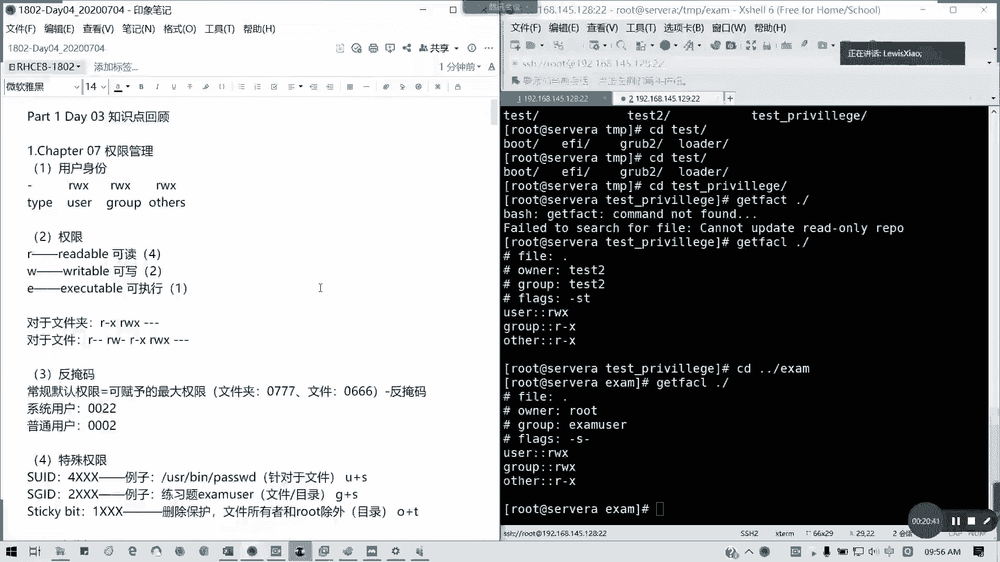

以下是相关操作命令：
*   查看FACL：`getfacl filename`
*   设置FACL：
    ```bash
    # 为用户alice添加读写权限
    setfacl -m u:alice:rw filename
    # 为组developers添加读和执行权限
    setfacl -m g:developers:rx directoryname
    # 递归设置（对目录及其内容生效）
    setfacl -R -m u:alice:rwx directoryname
    ```

---

## 第八章回顾：进程管理

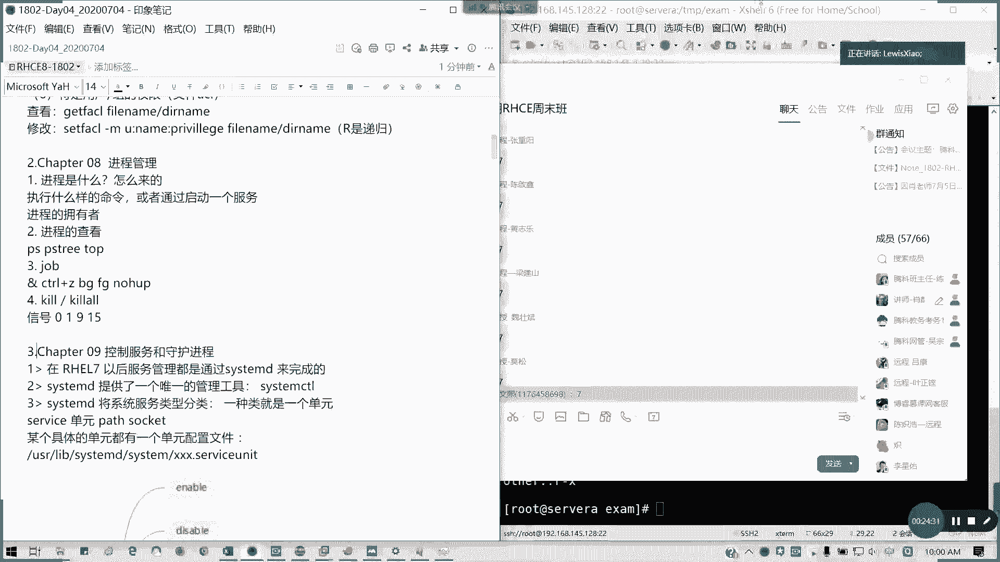

理解了如何控制文件访问后，我们来看看如何管理系统中的运行实体——进程。

### 进程基础
进程是正在执行的程序的实例。每个进程都有所有者（通常是启动它的用户或服务配置中指定的用户）和一个唯一的进程ID (PID)。

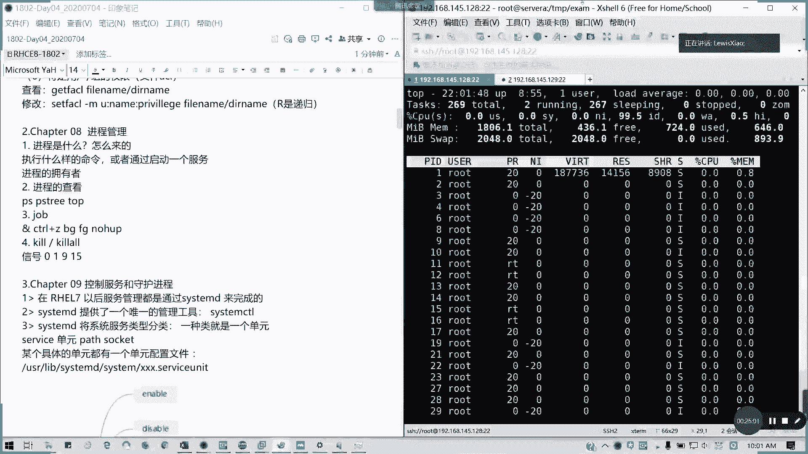

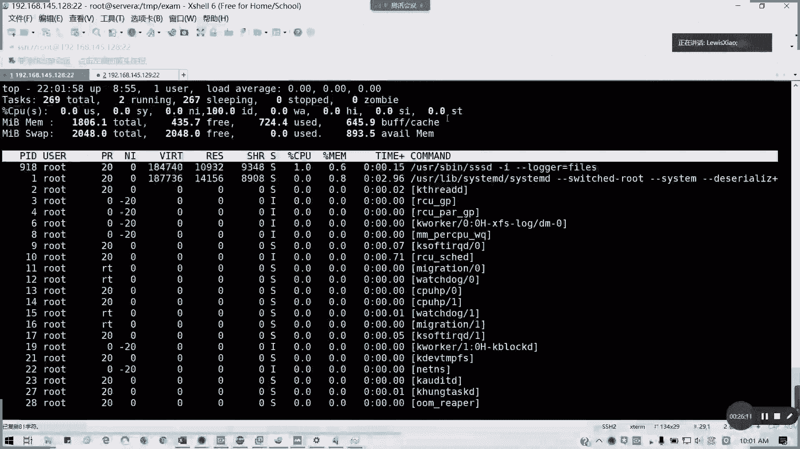

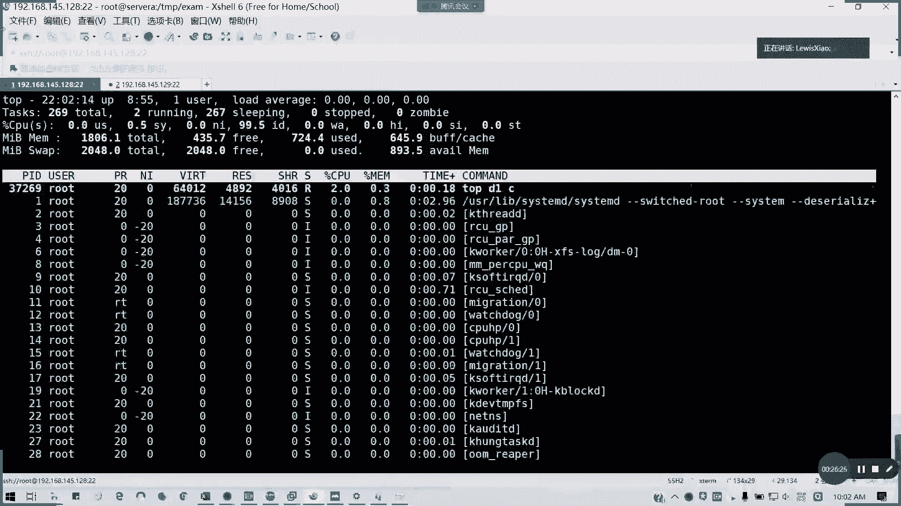

### 进程查看命令
以下是管理进程时常用的命令：

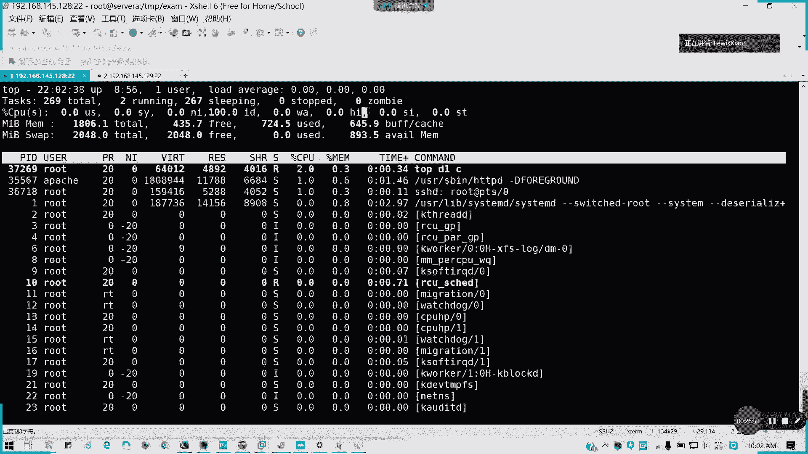

*   `ps`: 查看当前进程快照。常用组合 `ps aux` 或 `ps -ef`。
*   `pstree`: 以树状图形式显示进程及其父子关系。
*   `top` / `htop`: 动态、实时地查看系统进程状态和资源占用情况（如CPU、内存）。
    *   `top` 命令顶部的CPU行显示的是**所有CPU核心的平均使用率**。由于现代CPU是多核心的，单个进程的CPU使用率可能超过100%，这表示它占用了超过一个核心的资源。

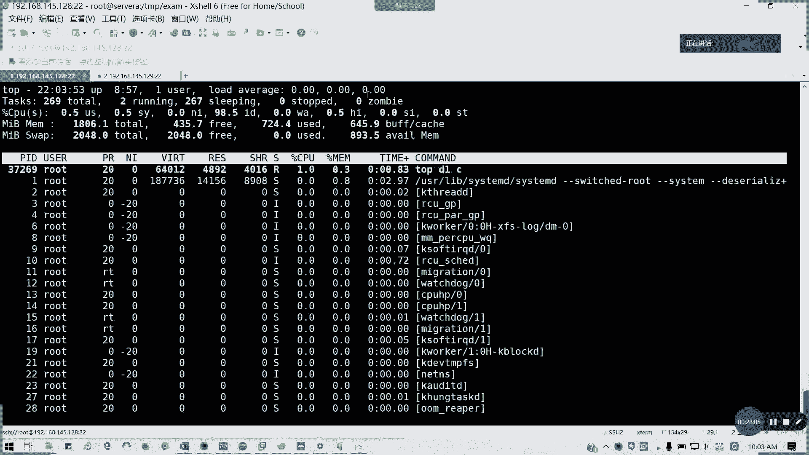

### 作业控制 (Job Control)
在单个终端会话中管理多个任务。

*   在命令后加 `&` 符号使其在后台运行：`command &`
*   使用 `Ctrl+Z` 将前台运行的任务暂停并放入后台。
*   `jobs`: 列出当前会话中的后台作业。
*   `bg [job_id]`: 将暂停的作业在后台继续运行。
*   `fg [job_id]`: 将后台作业调至前台运行。
*   `nohup command &`: 运行命令，使其在用户退出登录后仍能继续运行（忽略挂断信号）。

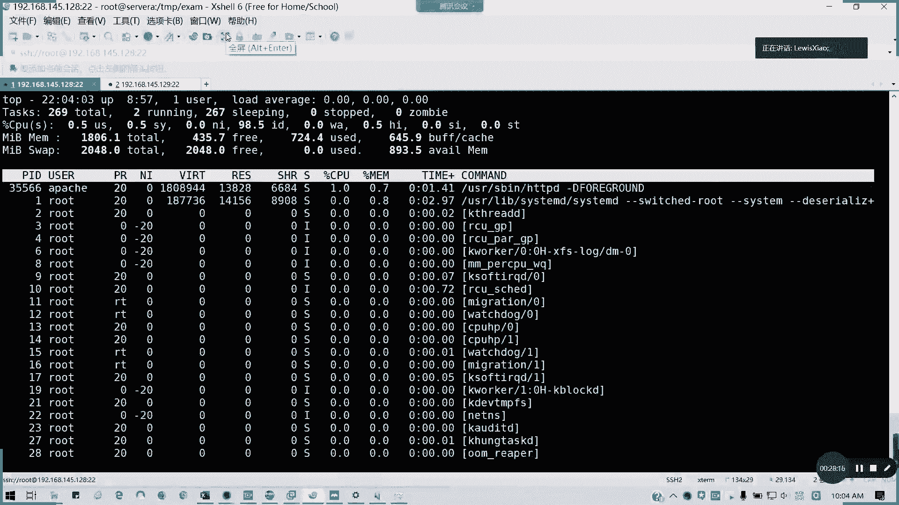

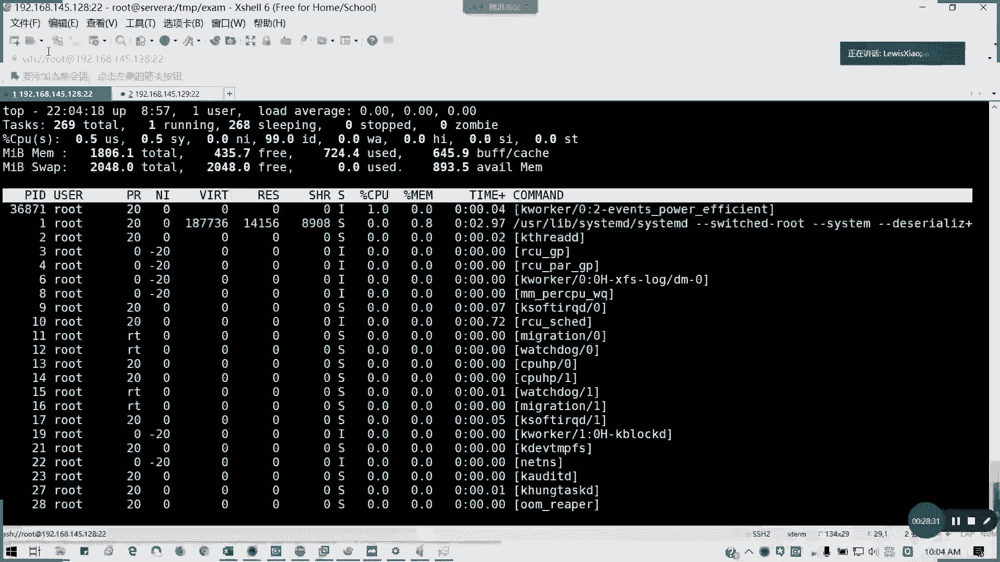

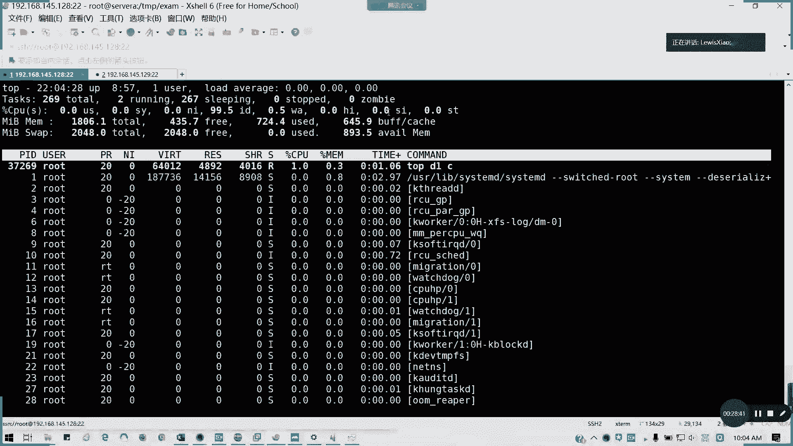

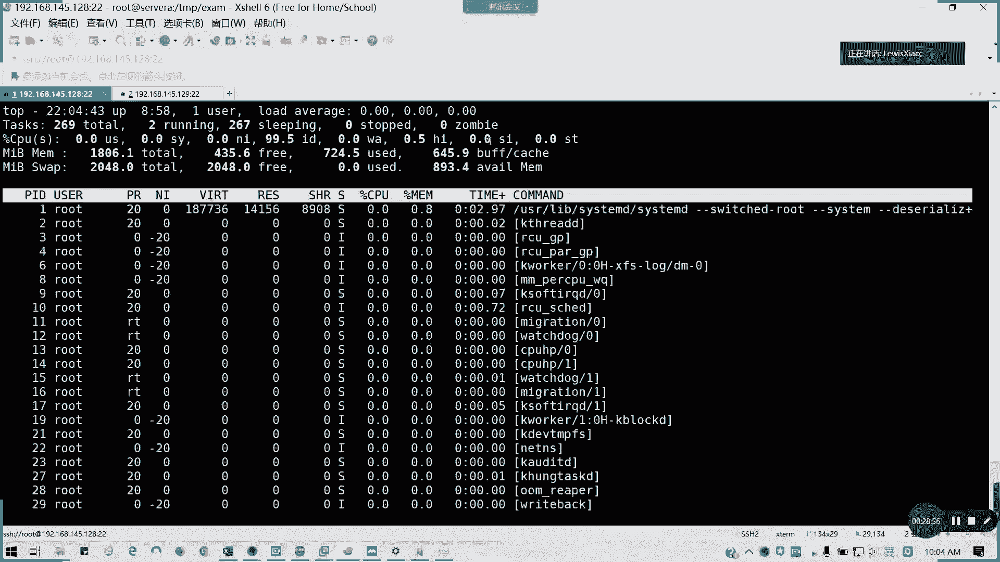

### 信号处理
使用 `kill` 命令向进程发送信号以控制其行为。

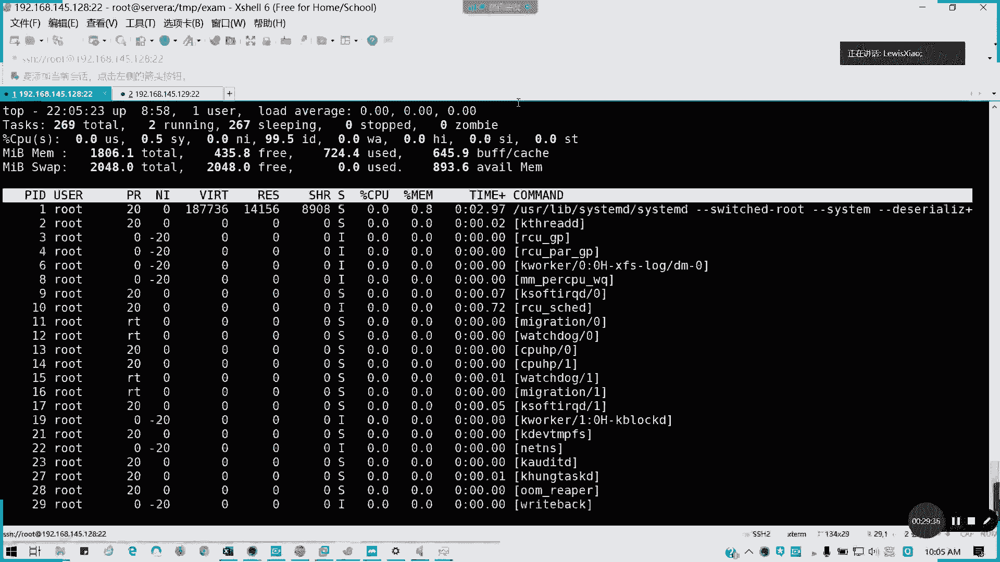

*   `kill -9 PID`: 发送 `SIGKILL` 信号，强制立即终止进程，不可被捕获或忽略。
*   `kill -15 PID`: 发送 `SIGTERM` 信号，请求进程正常终止，允许其进行清理工作。
*   `kill -0 PID`: 检查进程是否存在。
*   `kill -1 PID`: 发送 `SIGHUP` 信号，通常用于让进程重新加载其配置文件。

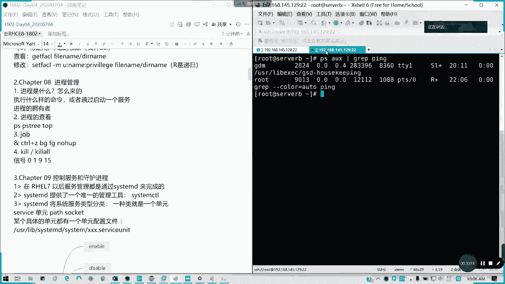

---

## 第九章回顾：服务管理 (systemd)

进程管理通常用于临时任务，而系统服务则需要更规范的管理方式。在RHEL 8中，这由 `systemd` 完成。

### systemd 基础
`systemd` 是系统的初始化和管理系统。它管理的对象称为“单元”(unit)，服务(`.service`)是其中一种单元类型。

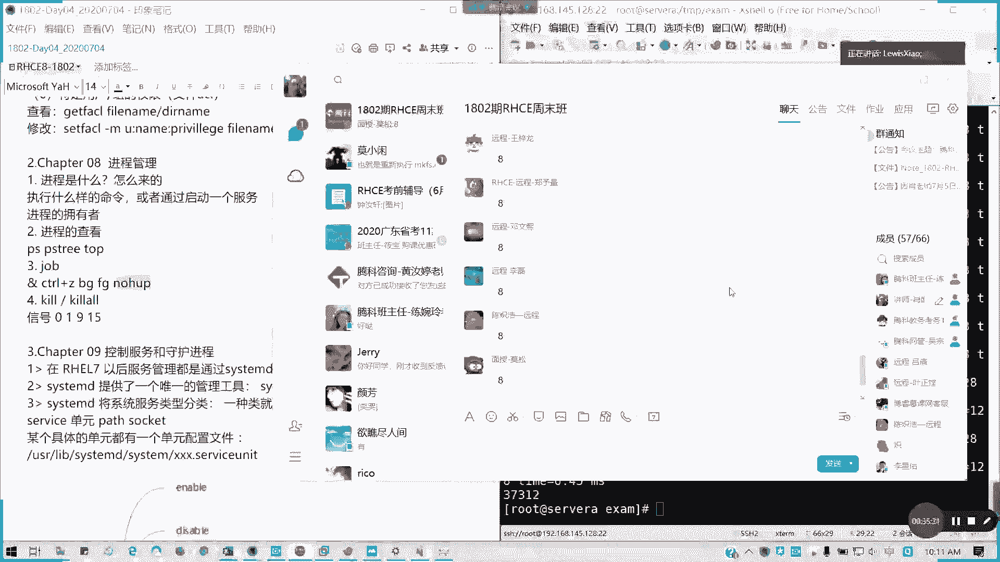

### 管理服务
使用 `systemctl` 命令管理服务。

以下是常用操作：
```bash
# 启动服务
systemctl start service_name
# 停止服务
systemctl stop service_name
# 重启服务
systemctl restart service_name
# 重新加载配置文件（不重启服务）
systemctl reload service_name
# 查看服务状态
systemctl status service_name
# 设置服务开机自启
systemctl enable service_name
# 禁止服务开机自启
systemctl disable service_name
# 查看服务是否启用
systemctl is-enabled service_name
```

**重要原则**：修改任何服务的配置文件后，通常需要重启或重载该服务才能使新配置生效。

---

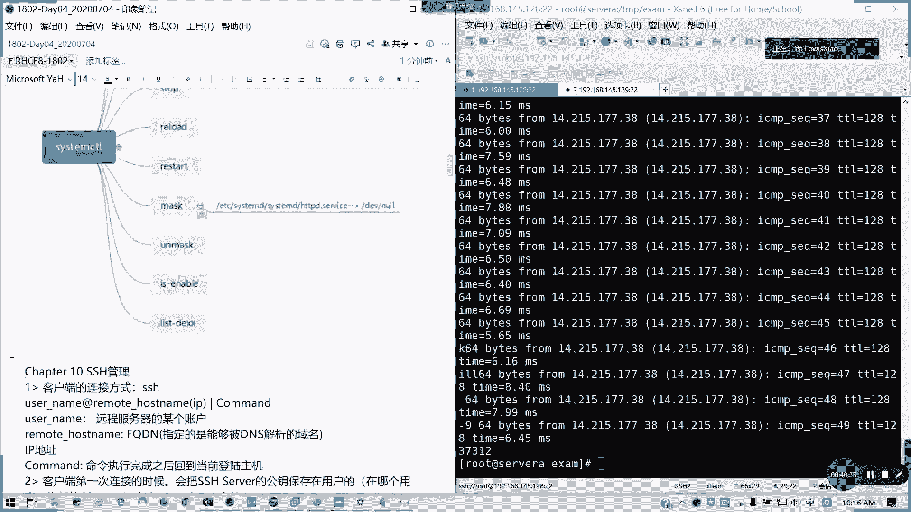

## 第十章回顾：SSH远程管理

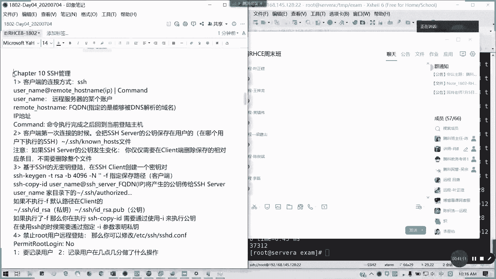

最后，我们回顾如何安全地远程连接和管理Linux服务器。

### 基本连接
使用 `ssh` 命令连接远程主机。
```bash
ssh username@remote_host
# 或直接执行一条命令
ssh username@remote_host 'command'
```
首次连接时，客户端会保存服务器的公钥指纹到 `~/.ssh/known_hosts` 文件中。

### 密钥认证
为了实现免密码登录（更安全），可以使用公钥/私钥对。

操作步骤如下：
1.  在客户端生成密钥对：`ssh-keygen -t rsa`
2.  将公钥上传到服务器对应用户的 `~/.ssh/authorized_keys` 文件中：
    ```bash
    ssh-copy-id username@remote_host
    ```
3.  之后再次连接，即可无需输入密码。

### 安全配置
通过修改 `/etc/ssh/sshd_config` 文件增强SSH安全性，修改后需重启 `sshd` 服务 (`systemctl restart sshd`)。
*   **禁止root直接登录**:
    ```
    PermitRootLogin no
    ```
*   **修改默认端口**:
    ```
    Port 2222  # 改为1024-65535之间未被占用的端口
    ```
*   **仅允许密钥登录**:
    ```
    PasswordAuthentication no
    ```

---

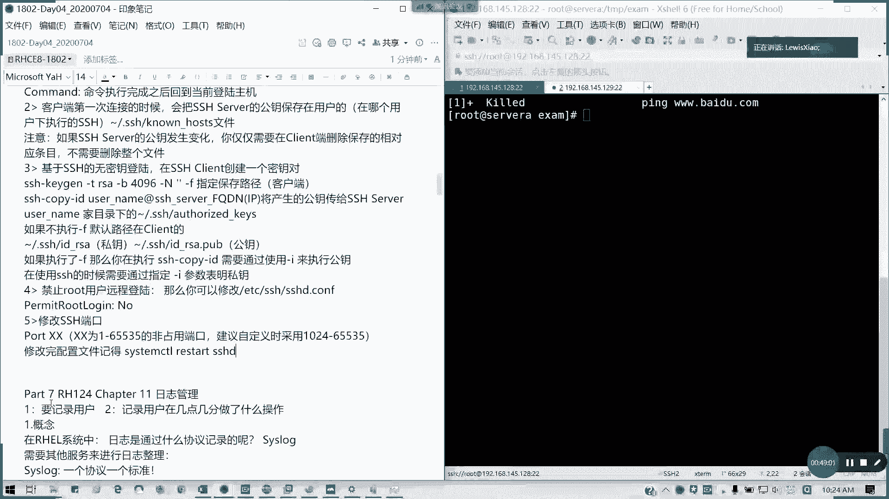

## 总结
本节课中我们一起回顾了RHCE课程第三天的核心内容。我们系统梳理了：
1.  **Linux权限体系**：包括基本UGO权限、特殊权限(SUID/SGID/Sticky Bit)、隐藏属性以及更精细的FACL。
2.  **进程管理**：学习了如何查看(`ps`, `top`)、控制(`jobs`, `bg`, `fg`)和终止(`kill`)进程。
3.  **服务管理**：掌握了使用 `systemctl` 命令对 `systemd` 服务进行启动、停止、启用等操作。
4.  **SSH远程管理**：理解了基于密码和密钥的认证方式，以及如何通过修改配置提升SSH服务的安全性。

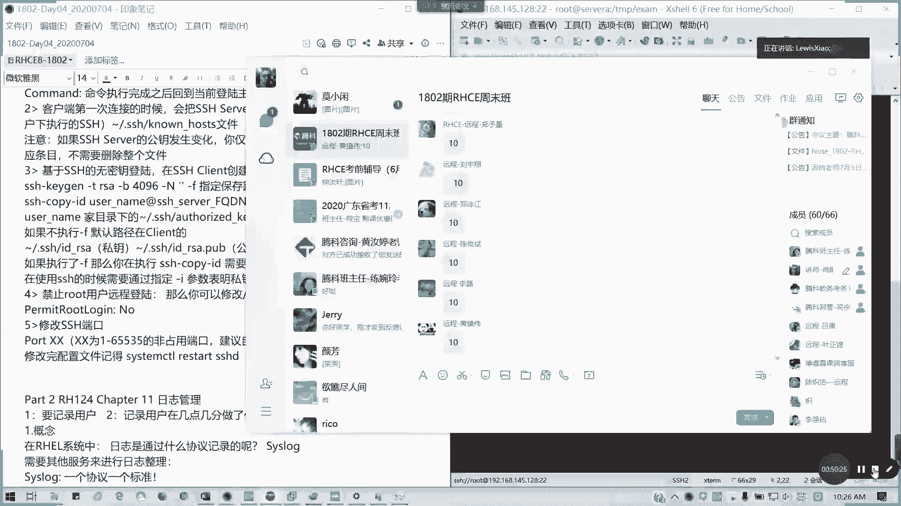

这些知识是进行系统管理、故障排查和自动化运维的基石，请务必牢固掌握。