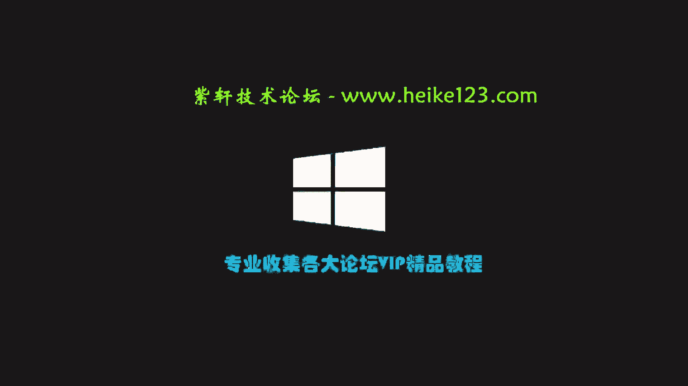
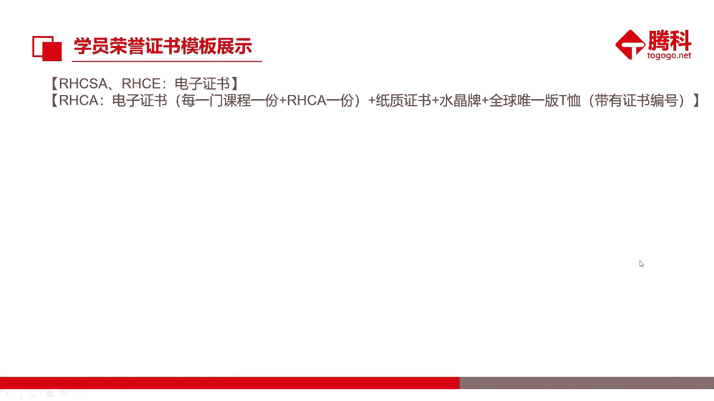
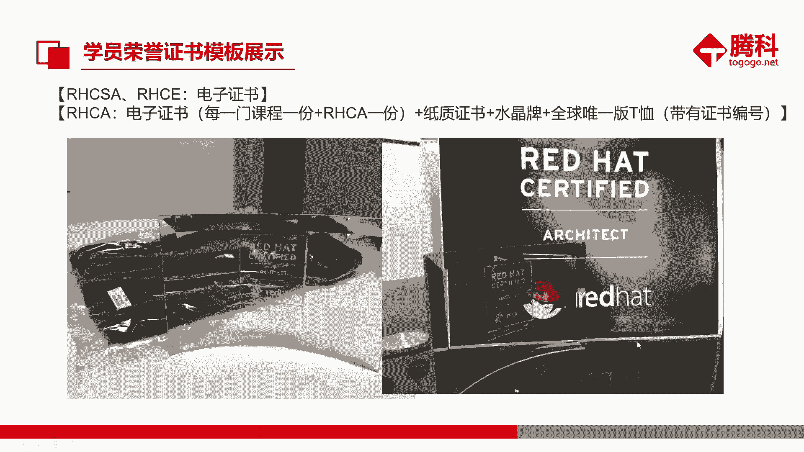
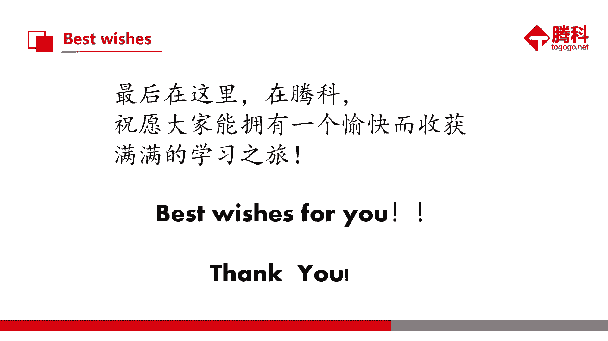

# 红帽RHCE认证课程：第1章：开班典礼与课程介绍

在本节课中，我们将进行开班典礼，介绍课程结构、讲师团队、学习服务以及相关注意事项，为后续的正式学习做好准备。

## 课程讲师与班主任介绍

上一节我们概述了课程，本节中我们来认识一下教学团队。

我是你们的班主任廖婉玲老师。我的联系方式如下，如有需要可以记录：
*   手机号与邮箱已提供。
*   日常事务建议通过QQ联系，我使用QQ更为频繁。

接下来介绍主讲肖老师。肖老师已获得RHCA认证，将负责本次RHCE 8.0课程的教学。他的背景如下：
*   毕业于中山大学，工程硕士。
*   拥有丰富的IT行业工作经验。
*   曾参与香港机房基础设施搬迁、支付业务机房运维等项目。

## 学员互动与课程体系

认识了教学团队后，我们进行一个简单的破冰环节。

请各位同学在班群中进行自我介绍，可以包括来自哪里、兴趣爱好、目前职业或就读学校以及学习初衷等信息。

接下来，我们了解一下红帽认证的体系架构。红帽认证主要分为三个级别：
*   **RHCSA**：红帽认证系统管理员，属于初级认证。
*   **RHCE**：红帽认证工程师，属于中级认证，也是本课程的目标。
*   **RHCA**：红帽认证架构师，属于高级认证，包含五个专业方向。

## 考试服务流程与证书

了解了认证体系，我们来看看如何获得RHCE证书。

红帽考试服务流程需要遵循以下步骤：
1.  学员首先需要完成考试费用的缴纳。
2.  班主任凭缴费凭证为大家统一预约考试。
3.  红帽考试为集体考试，需提前约两个月向厂商申请考位。
4.  考试时间由红帽官方最终确定。
5.  学员在约定时间参加考试即可。

关于红帽证书，有以下几点需要注意：
*   证书有效期为**3年**。
*   在证书到期前，通过任何一门RHCA方向的考试即可续期。
*   首次通过RHCE认证，会获得一件印有全球唯一证书编号的纪念T恤。

## 课程服务与学习规范

明确了目标，我们来看看学习期间的服务与规范。

我们的班级服务团队构成如下：
*   **讲课老师（肖老师）**：负责课程授课、技术解答、实验辅导与成绩考核。
*   **班主任/教务（廖老师）**：负责课程安排、考勤、考试预约及日常事务管理。

课程的上课时间为周六日：上午9:30-12:30，下午14:00-17:00。请大家务必遵守以下学员守则：
*   上课时请将手机调至静音或震动模式，如需接听电话请到教室外。
*   做到课前预习、课后复习，并按时完成作业。
*   避免无故旷课，如需请假请及时沟通，以保证后续重听申请的资格。

我们会在课程中期及结束后发放问卷调查，请大家积极参与，为课程改进提供宝贵意见。

## 学习资源与后勤支持

为了保障大家的学习体验，以下是相关的资源与支持信息。

请大家关注腾科IT教育集团的公众号，以便进行开班查询、证书查询、获取就业咨询及技术文章。

面授学员请注意：
*   教室提供Wi-Fi，密码已公布。
*   关于餐饮：28-29号教室中间设有餐厅，内含冰箱和微波炉，可自带午餐。餐厅内设有饮水机和自助货柜。
*   关于停车：楼下停车场每日收费封顶为20元。

请所有学员确保已加入班群，并将群昵称修改为“**面授/远程 + 姓名**”的格式，方便交流与管理。日常学习问题请在班群中提出，以便保留记录并及时得到解答。

## 总结

本节课中，我们一起完成了开班典礼。我们认识了讲师与班主任，了解了红帽RHCE认证体系与考试流程，明确了课程的服务内容、学习规范以及可利用的后勤资源。希望大家在接下来的学习中，能够积极投入，顺利完成课程并成功通过认证。