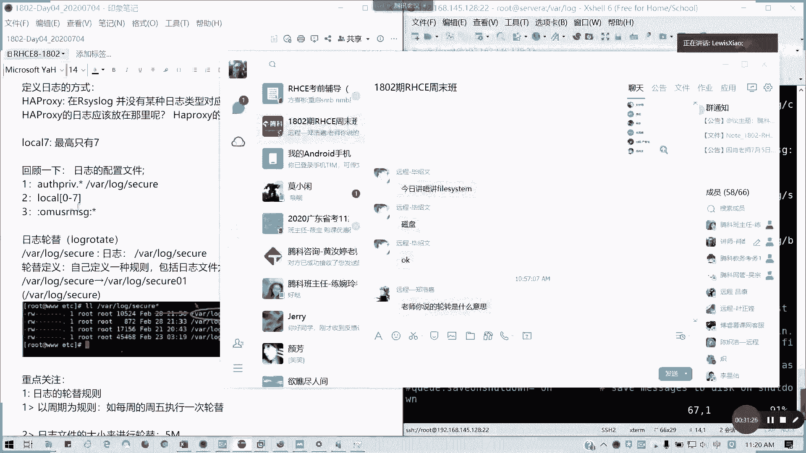
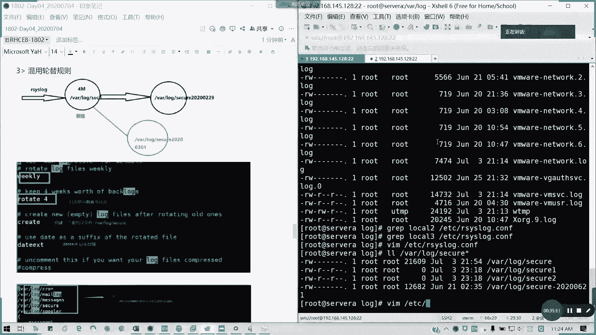
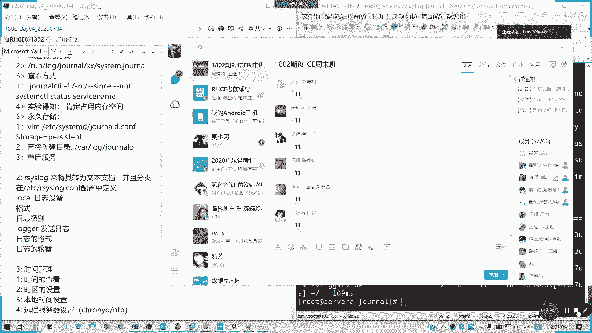

# 拿下证书！Redhat红帽 RHCE8.0认证体系课程 RH124+RH134+RH294三门认证视频教程 - P20：20_Video_Day04_Ch11_日志管理 - 16688888 - BV1734y117vT

好，10点49分，我们来开始日制管理。日志整理。我们简单来说就是两句话，一个是要记录啊。我要记录一用哪个用户在几点几分做什么操作是吧？通常我们做一件事啊，人在做天在看。那所谓的日志系统就是那个天的作用。

对不对？你做什么事情就像摄像头一样。这以非常清楚啊，你做的事情大家都知道的，懂吗？所以的话我们就有一个日志系统啊，所每一个完备的操作系统都有一个日志系统记录。当然我们现在还有日志审计功能。

因为信息系统等保的一个要求都会有这一条。那我们来看一下概念啊，在我们的我们的那个红帽系统里面，我们的HLre系统里面日志是通过一个叫sslog的协议来记录的，叫系统日志协议。sslog。

那其实呢它只能记录，但是我整理出来，它记录的是相当于一个原始的信息。那我怎么去。将日式变为我们可读的内容，那就需要我们的其他服务来做日式整理啊。像这里的话，我们来看一下一个叫sstsslog。

还一个叫ss systemstemD杠jonalD两者的一个关系。像sslog呢，它是一个日志记录的一个协议，相当于是一个标准。但我们的systemD杠geneD呢，它是。

记录跟服务有关开机引导有关的日志服务啊。只有在运行的时候才有相关的日志啊。在运行时。才有相关日志啊，就是服务如果不运行的话，他不会帮你记录的啊，没人帮这么好心的，对不对？所以的话我们一般来说。

我们在系统在默认的情况下，它这个服务已经在运行了。所以大家放心啊，就是说所有的操作啊，我们的linux我们的stemD杠中等定位帮你看着的啊。呃，他呢。如何保存呢？如何保存它是以二进制的形式啊。

保存在内存啊，保存我们内存里面，就我们的运行内存里面。如果被重启以后，你会发现这个stemD杠中5D的字是会被清空。没有了，对不对？那如何那我们平常如何读呢？我们有靠一个叫做阿ylog。

点service这个服务。RRC这个服务呢就是把我们的stem第杠jonalD点service它所。保存的一个二进制内容转换成文本文档。也就是刚刚可见的。一些知识文件对吧？

而且会保存在我们的VR里面的log文件夹里面，对吧？就像我刚才在课厅跟大家交流的各式各样的log知识，它是通过ylog这个服务获取我们的stemD像journal d点service这个服务的信息。

把就是他通过异地同步方式实施。也就是说那个。退在加载内存之后呢，隔段就隔段时间或者是实时啊，看这是怎么设定。保存到我们的。文件里边能理解我意思吗？

所以我们看到日志呢都是acis lock点service这个服务帮我们去整理出来了。那我们知道这个概念之后呢。我们要我们要看。日志的分类。通常来说，在VR log里面。一堆啊。一堆一堆日式内容。

通常我们看这几个。第一个。最全最杂的message。对吧messages。记住有个S的。大多数的系统知识消息都会记录到这地方。例外啊。它是例外包，就他有一个例外，就是比如说我的身份验证。

身份验证不是保存在这里，电子邮件处理也不是保存在这儿，还有调度作业，它也不是保存在这儿啊。还有跟调试相关的也不会保存在这儿，这是大多数的一个情况。我们接下来就说这几个例外。

第一个安全与身份验证相关的一个slog，它会保存为一个叫做。我message你看一下啊。是吧这些都是我们服务啊，或括进程我们调我们的一些大多数我们可以看到的一些信息，对不对？但身份验证不会在这里。

我们身份验证在哪里呢？there log里面的seec。对吧比如说在这里我已经接受了路ot的命令，然后从哪里啊，哪个端口通过哪个协议是吧？远程进来的。对不对？所以像这些的话，就是一个身份验证服务。

可以理解吗？VR log secure它是保存的信息，就像于我们的一个。windows我们的日志管理里面是不是有个审核啊？登录成功失败，对不对？这个相当于。

windows这个功能就是我们的seecure相当于我们windows里面个用户认证的一个功能。然后meil log是跟邮件服务器相关。🎼当前因为我们没有啊没有针对用户的一些邮件。

也没有对应的post fix服务。所以的话我们当前这个大家的系统里面m rock是空的。但是我看看它有没有，它应该也有之前的一些文件也没有。因为它进行轮转过了，也不存在。所以说这个呢主要是跟邮件服务器。

相关的他都会保存在这里。然后还有调度作业。对吧。我们系统原本啊这个在我们第二本书会讲到，就关于调度作业的这一块。它其实不是说我们一装个新的系统里面是没有任何。调度作业的其实系统本身有内置的一些调度作业。

然后所有的一些调度作业的运行的结果，它都会。存在这个日式里面。Call。知道吗？我们接下来会在第二第二本书讲到一个叫Cown tap。然后还有一个faces控制它的消息，就刚才你讲的什么OK呀，对吧？

就系统相关的非。s控制台效就是直接显示中端上的。就这些。对吧。然后就科努这里开始就一旦就什么启动啊，领启完啦等等这些就这些服务的话，它会。他会列出来给你。通常来说呢，像我们的那个。对吧。

刚才说的seecure，它那个sstem低杠gene低，它的力是没有分类的，所以所有分类都是阿s洛干的事情。懂我意思吧。像这只格式我们有看到就类似于这样子。刚才我们通过seecure我们看一看。对吧。

他通常日志日志的格式会是什么样呢？我们来看类似于我们的这一条。或者是我们的。这一条也可以。看一下为什么。那。这里吗？这里是我们源端口，源端口，也就是我们那个发起这个链接的我们的客户端。

然后你要你端口是不是你不可能说这边没有端口去连接它，对不对？我要指定端口去通信的。但是我们这里的话默认的话是用随机的端口。对，随机你要去连对方的22。懂我意思吧？所以我可以固定吗。一般来说也没有。

你可以限定范围。一般不固定，你固定的话，你一个端口被占了，是不是我不能打开第二个绘画？对吧？能理解吧？所以他这个的话为置它端口，你一个端口只能打开一个绘画啊。所以通常我们按照默认来说，他他他的那个叉c。

它会按照它的排的是5万端口以后，因为这些端口都逼准判，你没什么服务在用，对不对？然后连对方的22嘛，懂吧？通过SSH取得那个通道。我们等的。这个。在上面。呃3366。36698。

这个进程编号这进程就是我们的那个SSHD这个守握进程的一个编号。对啊，我们每个进程是不是有一个独立的PID？我这我可以拿到这。对啊，PID啊。哦，对问题还。对啊，这里不要搞错啊。

这PID然后你可以一一台机器，是不是可以多个SSHD。对。能明白吗？这我们以这条知识来看。前面。是时间对不对？记录日志的时间，或者是我们叫做日志产生的时间。什么时候？像这里是7月3号晚上的9点13分啊。

然后呢。这个是缩短的简写的主机名是谁？产生的日式。当然我们阿islog除了进入本地的机械日之外，我还可以进入远程机器的。懂吗？所以有才有这个主机名，比如说你连别人或者是怎么样。

或是我们两台服务器做做负载均衡，它是不会把记录日志都记录下来啊，对吧？所以这个它就有一个主机名，就谁产生了这条日志，对吧？然后呢，具体是哪个服务，哪个进程号产生的。懂我意思吗？后面就是具体的日志事件啊。

具体它产生什么事件，我当然这些都是人类可读的。然后还有就是我们的哎我们的那个。服务类型日志，比如说像我们的HTTPD啊，我们类似这个类型日志呢，它对对应的特定的一个服服务日志格式呢。

它会在服务的配置文件里面定义好保存日志。我们看一下。像我们HDDPD它不是记录在系统日志里面，它是通过配置软件定义了这个。叫做asses assess下划线log，对不对？我们HTPD我们的外部服务。

他的日志是这样子的。对吧。第一个。第一个它是一个我这个这这是最端的一个地址，对不对？然后面就是。状态码等等这些就后面就是一个日期，对吧？它的动作状态码，然后哪个客户端出来。其实呢我们这些的话。

我们在那个HTTP地点com是有定义的。你们看一下。我们搜索一个叫做log format mar。诶。对吧。我们搜索HDPD里面lock format这里的话。就是我们的具体的定义跟我们这里的图相对应。

这是软件自己定义的一个格式啊，不是跟系跟系统没有关系的啊。能懂我意思吗？像log format，它有一个combine，就是。然后他有他有一个加载这个他有一个comment，就是一个通常的一个格式。

然后还有的是一个详细的格式。对吧它加载一个叫做logIO三角线mod这个模块，然后这么长。这是软件定义的啊，跟系统无关。比如说像我们的eng啊，我们的angng x像我们也是要定义的，对不对？

它就定义自己的文件目录跟格式。当然我们也可以参用它的默认的设置。但通常来说。我们。它的知识格式因为它可读性比较好，所以的话我们就通常不改它的格式了。我们只改哪里呢？只改它的存储的一个路径就可以了。

因为存储路径呢涉及到一个我们如何去运维的问题。对吧。然后有日志会报的嘛，对不对？这会报的，所以的话通常我们会专门安排一个空间来进录日的那种。好，我们看一看。在我们日日后使用linux的时候。

如果要查看知识，我们需要知道一些什么东西呢？第一个。我们查看的。是什么样的日志，对吧？查看那怎么样，就是第二个就查看日志的话，我们要知道一个问题，就是第一个我们的服务到底是哪一个？

具体是哪个服务的日日志，我们需要去。回顾去排查。像我们的HTTPD是吧？像我们要去DTPD。的配置文件里面啊，它是关于日志定义以及以及日志格式都有了。对吧刚才我们给大家QQ看过它的格式跟它的保存位置了。

好，第二个，如果是跟系统有关的日志或服务的简验日志呢，我们通常就是看。两个地方。一个。是VNRlog下面的一些。对吧VIlog下面一大堆资质文件，你可以去够你看的了，这是第一个。

第二个我们可以是不是我们可以采用。

System control。tatus对不对？查状态。然后面再服务名。

对吧他会列出1234，我们列出后1条。他的那个日志出来，懂我意思吗？比如说我查一下这个系统服务，我知道他的它的那个有没有被加载，有没有被激活，从哪啥时候开始的。然后它的那个对应的一个文档，对吧？然后呢。

它的主要的一个进程号的ID。他使用它有多少个任务，它的内存多少，然后它的一个group，它的一个。他的一个服他的一个他的一个控制一个组啊，各组，还有下面就是。最新的10条日志内容。也是可以看到。啊。

也可以，但是他的这个定义呢就不像系统那么定义了。他定义了他自己有个配置文件的eng点com，对不对？然后呢，里面定义的知识格式，还有它存放的地方。通常也。那我这里面我没装安全啊，我就看HDPD有没有啊。

在这里。期的话。有啊，都有6就不是这样子。6是不是用stem control的。7开始有这个。嗯。然后还有呢就是。如果更多的场景啊更多的场景。比如说我们要记录像各种设备的访问啊等等这些。

那我们就通过专门的记录日志方式。比如说我们的EOK，我们开源的。认识系统对吧？像扎像扎贝斯啊、na啊等等的这些像普罗米修斯，对不对？是各式各样的监控平台，无论是开源或是收费的。都可以。能明白吗？

我们这里不讲EOK我们只讲系统日志啊。好，我们看一下。接下来问题。我们刚才讲了sstemD杠generalD，它是直接保存的内存，而且没有分明别类。那阿ic洛就负责干这个活整理啊。它是分门别的存放。

然后它是通过那个IRClog去配配置定义的。来，我们看一下这样一个定义配置文件。叫做asy stock点com。🎼ETC下目录下面的rs log点CNF。哎，我还是用那个。用用VIM，因为有颜色。

这样我看的比较清楚一点。像这里的话。前面我们不需要看我们看一看看后面的ros。ros这一块呢就是它的一个日志整理的一个规则啊，日程整理规则。哎，我按了粘字练字键了啊。来看到这里的话。

我们有一个落实一个规则啊，落实规则它就是说所有内核的日志啊，它按照指定的一个级别存放到哪里，对吧？我要筛选哪些日志？对吧筛选哪些日志，然后达到什么样的一个。级别我存放到哪一个文件夹。

所以我们所看到的这些日式里面的内容，它都是经过IRC log筛选之后才存放到这里的。比如说。你们看到这个author brief是吧？au brief brief是不是跟登录验证有关的？对吧。

所有就是点心啊，然后全全部放到这个文件里面。像这里的话有一些是通知级别啊，然后像那个mail，然后是那个飞机丙紧要的，还有认证的非警要级别，像任务的非紧要级别全部放在这里。懂我意思吧？这样提到一个级别。

那我们就要。看一下到底有几个8个级别。代号从0到7。零代表系统已经崩了，不可以用了。所以通常你这个日志，你这个看不到了。因为你看到的时候你你看你来不及了，系统已经崩掉了，对不对？

产生零号就是一号是必须allot警告报警必须立即采取措施，然后还有零界情况对吧？critical致命的er非严重错误情况，然后通常是三以上级别才做严重的，我们要特别注意的。

4以下的都是一个轻微的一些告警。比如说像 warningning只是个警告，对吧？像警告的话，比如说我们使用一个软件，然后这个功能呢，我在我这个功能已经过时了，但是我现在这个版本还保留。

我现在这个版本呢，我这个功能即将会被删掉，会被剔除了，所以这个版本就会给你一个警告了。就是说我这个用法已经不用啊，我建议你用另外的用法就。像我的s里面就有。这类。然后我们就要注意。

然后notice只是正常，但重要事情就是给你一个通知对吧？info呢就是一般的信息性事件，还有一个debug就是调试。懂吧，所以我们通常我们在运维，我们在做运维的工作里面。

我们注意的是ever以上的级别。我们不可能把所有日权输出，那这个你的知识得多大呀？对不对？无关紧要的很多，所以的话我们就要定义好我们的级别。像我们这里的话，主要是那个像通常im显你是看不到了。

你系统已经崩掉了对吧？通常我们注意的像aler alert critical CIT嘛，致命的那个那个简写前面的部分L error，我们要注意我们这里也可以自定我们日志。比如说我把那个安全这一块。

我来做一个定义。然后像我这里的话，杠新是scu，那我可以生成另外两个文文件可以吗？叫做allpri。就跟认证有关的debug级别。调试级别日志。然后呢来生成到我们的。是我们的我们生成到哪里呢？

V are log。里面的seecure一这个文件里面，然后al brief里面就它的跟登录有关的air级别的日志。我们当前是不是全部都输出了VRlook secure里面，那我分别别类再弄一遍。

这里其实就定义它的日志整理的一个规则，懂我意思吗？就自己要定义的那定自己可以定义的话，那我可以更明细一点，对不对？懂我意思吗？像我这样的话，我像比如说像那个所有终端级别的日志。

就是在这个OMUSRMSG里面可以定义啊，就everybody get emergency message这里。对吧像这一行。像这一行呢，就是所就紧急级别，无论是哪个日式消息的。

只要是emergency的，就是你系统已经快不可用的情况下，它所有终端都会报警，这是系统默认设置。懂我意思吗？然后他这个后面的OMUSIG什么意思呢？就会在屏幕上面。直接显示所有终端都生效。明白吗？

然后下面还有一个logo啊，1234567的这logo7这也叫日志设备啊。就这个设备它原他将原有的服务日志呢借入特定的一个logo的本地的一个设备，然后通过asy去转储啊。

比如说像我们bo点logo就这样是吧？我特定终端，我启我启引导启动的信息，是不是通过它转储过来的？

不过这一个的话不常见哈。多常见啊。🎼就我们保存这里的话，我们需要保存之后呢，我们那个重启一下阿ylog服务。阿log没有D哈没有D啊。然后因为现在还没有日志出来。

所以的话他还不会有一我会touch一个scurer。一还有。诶。🎼我自己贴自己贴错了，它是探取一个SQ一个SQ2。然后待会如果有一些调试级别或这样的话，它会写在这里面。但我们当前没有啊。

通常我们也不需要去做这份操作，就是我们定义了文件之后，它会自动帮你写的啊。所以我们这个logo的话，它是有7个级，它是有lologo1234567，就就也就相当于我们可以理解为纯日制的一个容器。

我有8个临时容器，本地的临时容器。然后只要从那个特定的是吧？特定容器输出出来消息，我们可以保存到我们的特定的文件里面。像我们这里的话，我可以有logo一lo口2lo口3，对不对？lo口二没有哈。

novaote3好像貌似也没有啊。像比如说我看一下一些例子啊。像这里的话主要是locgo7啊。路7。🎼那这个用法我们通常会比较少啊比较少接触。这我们主要是一个logo器，就bo点logg这个。

像比如说我们要定义的一个日志的话，它会把那个箱应日志存到一个容器里面，就是这样的一个我们本地容器里面，然后再通过容器再转储到这个，然后最高的话是0最高只有7哈，最高只有70到7。

所以的话这个我就不详细讲这个如果大家需要用到的话，比如说我们的HTTPD你可以尝试一下在logo容器什么意思啊。它是可以理解成一个日志设备，只是一个暂存的设备。然后呢，我们定义我们接下来回回顾一下。

就是我们这几个东西，对不对？我们定义的这个日志的话就是。像我们的日志级别怎么定？然后还有就存存到哪些文件，然后还有的就是logo容器设备，还有一个就是那个所有终端显示的。

就叫做OMUSSIMSG点万浩清啊，这个就是我们前面第一节。

给大讲的内容。轮转日志轮转啊，刚才有提到日轮转，我们接下来来讲，其实也就是我们的日志轮T。正好这讲的这个问题，我接下来刚好讲日志轮体。

日志人T，我想让大家知道，如果你的日志只存放在一个文件，那这个文件是不是会被异常的肿大？不断的往上涨，对吧？涨到什么报为止。对吧所以我为了系统为也为了方减轻自己压力，也为了说我们可以按阶段。

在每一个时间内，我们可以查看到对应的日志。所以他会触发一个任务，然后。定一种规则对啊，定一种规则来实现日志的一个不断的一个更新，对吧？比如就比如说我每到哪一个时间点，我就把日志重新叫旧日志命名。

然后把现有的这个文件清空。因为它针对的只写一个目标。那是不是我可以把旧日志我copy出来改名，然后把新的清空啊，对吧？把现有清空，然后再保再写新的，对不对？像我们默认的话，我们那个。

🎼VR secure啊log secure它是有这样一个规则的啊，我们也可以自己定义，也可以采用系统默认定义的一个方式。像系统默认定义的话是是一周啊一周轮一次。像我的message像我的。

这我secure也是一样是吧？对吧我们是不是以前就后面加上杠日期的，就是一个旧的一个文件，懂我意思吗？它这种的话就是有两种定义方式，就是两种轮替规则，一种是你到日期了，我就给你更新。我我我就把旧的。

我我就改名保存。然后新的话，我继续写旧新的话，轻空继续写下去。

懂吧，然后还有一种就是你到达一定的大小。比如说我一个日志，我就设定我1兆是我日志的最大值。那我一个日志文件，我到了10兆之后，是不是我要写新的了，我就写不下去了，对吧？我就把这个十0兆满的日志。

我换一下名字，对吧？我改一下名字，然后我借生成新的，对吧？然后还有一个就是我积累了多久，我的日志我要删掉。因为有些太久的话，你不可能一直保留在磁盘的。一直保留磁盘也是遇到一个问题，你磁盘空间不足怎么办？

对吧所以的话会产生这种轮替的一个规则啊。到这里啊重点关注第一个日志人气格则。我们刚才讲了第一个周期，比如说我们每周周五。换一次，它通系统通常是按周21号按照周日来轮啊，每周日生成一个新的啊。

然后还有就是日志大小，对吧？还有一种就是混用。多种组合。对不对？这个图能看得懂吧？比如说像我的seecure，我可以就是说我当前达到4兆的时候是吧？然4兆之后，我就改名这个文件。

改改成后面我加个日日期后缀。然后这个文件我就删上清空，我继续写，或者是说我到一天了，我改了，对吧？就这里我到四兆，我改了，我到一天都行，对不对？

怎们在哪里找呢？

我们在一个配置文件叫做。这里有讲义原来没写，但我这里补上去啊，配置文件。叫ETC log rotate。旋转对不对？轮转这个单英文单词rotate对吧？lock rot点com。

当然我可以在lock rotate点D里面去定义我们自定义规则。在我们这里我们先看一下我们的默认规则。对吧。这里我们可以看看我们的默认规则是怎么样的。

互问规则。他是会第一个。我每周轮转一次，它是你定义的对吧？rotate lock fast weekly对吧？它是用week参数，所以的话每周轮转一次，而且是在周日。第二个。

我我后面的备份日志我要保留多长时间，他默认是。四周。对吧we we rotate for，然后呢，它就说我轮转完旧的文件之后，我是怎么操作新的新件？他就直接把旧的改名。然后新建一个新的。

所以这个规则呢是在这里定义的，懂我意思吧？然后呢，它如何进定一个后缀，就已经轮转过文件，怎么去定义名字呢？就是采用一个延展日期，叫做date eXT这个格式，也就是相当于我们文件名后面加一个横杠。

然后写一个YYYYMMDD。啊。然后它还包含了我们在log rotate点D里面。像有些程序或者用户自定义的一些轮转文件，它会包含在里面。然后就没了，对吧？这是主配置文件。你看。柔态减低啊。

写写的什么东西？写什么东西，对不对？我们每个服务是不是都有轮转轮转的一个配置啊？对吧就具体的服务他都有写的。比如说我们看一下我们的外部，我们Clog。对吧他的具体的一个。那规则。他会写到这5个上面。

就对吧？🎼他会写这5个上面，然后呢。就它你一个轮替规则，它里面有定义了啊，轮替规则写在这5个上面。在locate点com里面，然后。这些是规则来的missingO啊，然后共享脚本。后面。

轮赚钱我要执行的什么命令？就是把把这个进程杀掉，是吧？轮赚钱是不是把他会把RClo这个服务删到进程，然后重启啊。对吧。他这用的。然后他丢到那个空设备里面，然后或者是处嘛，就两者如要只要那个起异的话。

他会会执行命令的，对不对？然后后面把脚本结束，它这是一个编写的一个轮替的规则。然后这个haub什么意思呢？他给一个信号，对不对？就就那个Q的一个信号，对不对？可以给一个相关的一个信号。

那这里如果针对啊某个具体的一个知识文件呢，也可以自定义。🎼轮上人替规则。那么这个日志呢，它的轮替规则就采用自己的一个定义轮替分式，而不是系统默认的，懂我意思吗？像我们的sslog。

像我们HGPD我们可以看一看。对吧。他这里像HTPD，它是会定义他他的日志轮替在这里的。对不对？新log嘛。叫Sro log对不对？然后他的那个。轮替规则全部写在上面，然后有什么延迟压缩啊。

然后还有在在轮转之前是不是会重启这个服务啊？对不对？重启我们的HTP服务。所以这些呢都是特定服务的，而不是财务默认的。所以这个懂吗？如果懂的话，我们。

日志轮体就讲到这，我看一下毕少文啊，我看一下郑浩佳。明白吗？你不能转的话，你这字是爆的。勉强哈，也就是你可以理解说我达到一定的大小，或者是我空我的。时间到之后，我就将他把旧文件。对吧把这文件改名。

他这里用了延迟压缩delay。例子啊。我想想啊。嗯。家说。这个其实我没有去细究啊，你们可以看一下那个罗推子里面的写法，我我这也没去细究啊，那常常我们通常采用的默认符。

示范例子嘛，其实你们可以就定义嘛，你们可以把我这里可能没时间示范了。但是示范我可以告诉大家一个方法，比如说我把日志给我改成每天用每小时能赚，然后你就不断的去生成，对吧？你说你不断登录。

你就secre是吧？不断的登录用户对吧？然后等到他过一个小时看他会不会刷新一个。这也是一个方法。但我这里因为时间关系，我没有办法帮他示让家示范，不是说我不会，但是这个号的时间有点长。

所以我们课后可以去大家试一试。把轮量规则改了，然后是不是看看他每小时会不会生成一个就行了。

好，我们接下来讲我们运行的内存里面的一个journal低啊，stem d journalD这个服务。

我看一下这个文件在哪哈。😊，我看一下啊，它这个是应该是一个组来的。这system journal文件呢它是可以啊system Djo点帧sstem点journal啊。

对吧它在run里面，也就是它是一个加载在内存里面的，懂我意思吗？加载在内存里面的日志，就刚才说的stem第杠中D，它生成的所有日志，它是没有经过任何排序，然后直接在内存里面的对吧？

阿 system它才是会归纳到里面去，那好，我们看一看。我这文件怎么来的啊，我就我就看一下，列一下这个文件属性给大家看。很长啊。对吧。它这个文件它已经到了8兆了。

然后它而且它只能够那个只要这owner是只读跟写。然后呢，对于其对重组是只读，然后对其他任务没有权限。然后呢，它是一个什么样的文件类型呢？我切换到这个目录下给大家看一看。

然后我用fire fire是可以显示文件的相关的一个属本身的一个。属性的。它是一个jonal fire，它是一个在线的日志文件，不是存储在磁盘的，在线的。对吧。内存的。run里面的信息。

我上次讲了文件系统，是不是它是存放在内存里面的？包括我们的pro跟s都是一样。那我们怎么样去查它日次呢？我们可以通过一条命叫jonal control啊，jonal cTL。查看内存日志啊。后面好。

再线。他这个服务是在线的，而且它这个文件也是在线的，也就是它不是存在一盘里面的一个文件。它就是相当于存在内存里面。然后我们怎么去读，我们不可能直接去cat是吧？什么鬼？对吧。第二个。

所以我们要专住controrl，把它转化为止可读的。我说我我我把这说主要说到旁边去啊。大大大家看得到啊。我们不能直接cat，我们可以比如说我们查看一下。我们指定时间是吧，可以加参数是吧？就从哪里开始。

从那里结束，对不对？可是不是可以查？🎼在这里我们看不到日志啊。他这里说话就会logs begin，然后end多少？然后他默认会列出一周的日志，或者是当天的。我看一下啊，看能不能显示些内容出来，有了。

🎼是吧它显示出固定条目的，在这里的话，它显示出那个216月25号到7月几号，我看一下啊，这因为我们显示了一半到7月3号，对不对？因为这里实间是减8，这是是那个不是标准时间，它是后面减8的。

所以的话它的时时间不太对，所所以淘宝们用jonal是不是可以看出这些啊。对吧。我们筛选一个时间范围。since嘛out到 until就从哪个时间段，哪个时间段，他帮你筛选出条目。对吧。

他的日志他会跟你说，从记录从哪里开始，从哪里结束，就是你开他这记录的范围呢是什么什么定义的？是从你开机啊，开机开始记录，然后一直到你当前的情况。

然后再从里面筛选你要你需要获取日志的那个内存日这一个时间点。懂我意思吗？他这好像只是告诉你说我这个日是从哪里开，从什么时候开始记录，然后到现在的时间，对不对？

然后下面就是我们筛选的一个指定时间段的日志啦。懂我意思吧？然后我们也可以加杠N是吧？我们如果串全体，我们可以这样子要可以杠P啊，debug我们可以唱这调试级别日志杠P。DBUG是吧？

我们可以看出所有的内核的调试自制权在这里，对不对？它会显示更加全面的，就是调试级别开始的日志都会在这里面会非常多。这里也许就是可以解答你现场一个问题。我在boot我引导的时候，我怎么根据时间的排列？

就时间排列下来日志到底我从一机器我一按开机键开始，我整个系统里面到底发生什么事情？可以通过专CTU来看。因为你还没关机嘛。对吧他日志已经从那就开机时间点开始记录，就系统开始引导接手G的时候开始记录。

然后一直到你到现在的这个时候。所以的话我觉得你是这个方法就查看这个日志可以解决你这个问题。然后还有呢，我要查后面多长的这杠N吗？对吧这是最后一行的。你可以重定向啊。重庆这样教过吧。

我可以重庆这为一个文件吗？是不是可以啊？也就呢我们人工去做为一个asis。懂吧？然后还有个叉一。X一就是显示那些。服务里面有错误的。有错，就是通常来说就是他会比如说你服务报错的话。

他会让你用这种杠XECTL杠X1嘛。对吧。给前是执行里面有错误的一些日志，可以直这显示出来。能懂我意思吧？像我们的话，比如说。这里的话我们还讲到一个就是修改方式。就是那个我们创建的话，这个专CTL的话。

我们通常它有一个叫做VIL。等一下V arelog。jonal啊，它不足果我们要保存的话，它是通常来说就是我们可以创建这个目录，然后把那个journal啊，我们把这个jonal写过去。

但这里的话我就不再说啊。你可以永久存储啊，这里我要补充一下。你可以永久存储这个日志，通过我们创建之后来编辑那个journalCTL。降低。对吧如果永久存储这尊le日是怎么办呢？

MKDR我先创我先创建一个叫做七跟八是有点区别的。这是我讲话的方法。我们创建一个叫做journal目录。jo1URNAL是吧？然后呢，我们编辑一下ETC。System B。journalD点com。

🎼它这是一些默认配置，像我们这里把storage是吧？我们改成它是自动的啊，我们这里改成一个persistant。🎼持续存存储，稍等啊。好，我们回来继续讲我们回马上回来继续讲。这里呢我要存储日志呢。

我们将那个ETC里面的啊sstemD里面journalD点CTF我们把那个jonal这里我们把storage改为持续存储啊，永久持永久的持续存储。

那么这样的话我们就可以把那个日志存储到我们的本地里面了啊，就持续存储在本地里面。

现在我们没看到效果哈。把服务重启一下，你看。我重启一下是不是有啊？记得我们把服务重启一下啊。改完还是那句话。对吧他就会把那个日志我就。存储在这里面了，他有一个随机文件名是吧？27B7。

🎼n system的jonal对不对？对吧它就存存一盘上，但但是我依然不能用cat去去看，还是用jonalCTL。懂我意思吗？可以理解吗？就我可以把内存里面我实时存储到这里。但这里会占有很多空间。

这懂了吗？可以理解啊。可以理解的话啊，我我这己截个图啊，刚才我这个。我这里有截个图，大家都应该就明白了哈。可以理解吗？是吧内核里面的日志我保存到这里。然后接下来跟日志有关的。

我们要讲一下一个叫时间跟时区的问题。这里会涉及到一个叫做Crony的热服务，也就是我们以前叫的NTP。时间同步网络时间同步。啊，我们通常怎么去设定时间呢？time date CTL是吧。

通过这个所当前时间是吧？我EDT时间UDT时间，还有我们的时真实时钟时间。然后现在的时句是america，new yo，对不对？然后如何去修改我们的时区。哦，录屏我现下继续了，然后再set3dCTL。

🎼set time zone。然后我是这里比如说我要设置我们东八区的对吧？Aure。A选有伤害，对不对？广州是没有的，它只有几个，一个是乌鲁木齐嘛，一个是上海，一个是北京，一个是。就台北、香港对不对？

所以说我们默认我们用上海的这个就行了。然后呢，我们再看一下。它时区是不是改过来了，logo time就改了，对不对？就不是3号晚上了，对吧？就变成我们现在的真实时间，北京时间，对不对？

这里所谓的CST是叫做中国的标准时间，而不是中时区哈。它这里的CST中时区也是叫CST。但这里我们下loc time的CST代表的是中国的标准时间，它总共是有跨4个时区的啊，下4个时区的。

所以的话这里的话啊我们把T。我们现在把图替换一下。我们这里的CSD不一定是中国的标准时间，它是可视为像美国是吧？像美国啊、古巴这样的标准时间。所以CSD啊。我看一下，哎，这个图怎么不见了，我重新贴一下。

这样就应该就明白了啊。像我们这里为什么说是上海呢？就就那个我们是中国的标准时间呢？对吧。这里的话这里的CST中国的标准时间啊，美国是中部时间哈，澳大利亚是中部时间啊，所以这里我们是中国的一个标准时间啊。

这里的CSD我要表我要写下备注。这里的CST。China， standard。Timeai。然后呢，如何去我们这里现在要配置我们的NTP服务，对吧？我们如果我们手动设置时间呢。Sa time up。

肯定会报错的啊。我们按照它的格式来输入。2020070412。00。00。对吧。他会报告告诉我说NTP单元已经被激活。也就是我现在是采用自动同步的时间。我不能修改。对不对？

所以的话如果我们要修改这个时间的话，我们需要把NTP。如我们手动修改时间啊。Satter。NTP。forourth对不对？我们把NTP设为for之后呢，我们才可以设定我们的时间。那这样我们才能才能成功。

对不对？明白我意思吗？NTP关了，这现在我就把NTPNTP临时关了嘛。但是通常我们NDP还是要开的啊，NDP开的话。就做什么呢？我们有通常我们在我们在世界各地是不是有10钟同步俯务器。

那这样的话我们就不用去调时间了。懂我意思吧？就自动校正嘛。如果你NTP关的话，你如果说你的。你的机器开货关对吧？你的机器开过关或者是你系统，特别是你的那个我们的PC机，是不是有时候电池啊，没电啊。

会老化啊，或者这样的问西时间会越走越快越走越慢，对不对？像这种的话，你对业务会有一定影响的。所以的话通常的话我们是用统一的一个。像如果在内网的话，它是有一个统一的一个时间校准服务器。

就对外网去叫北京时间的，然后全部都同同步它就可以了。对吧我们企业是不是这样？不可能你全部放外网是同步的那这样很危险。那我们还是设为处吧。我们再看一下什么时间。我们把那个时区再设回来。立马同步对不对？

立马同步。那我们如何去配置我们的NTP同步呢？主培资源TP同步，那我们就看一看我们的那个一个文件叫做ETC。conny，我们有一个叫conny服务啊，在红帽区里面开始都叫这个服务。

像以前的红帽6以叫NTP点com。对，以前啊。以前是那个NTP点com啊，现在叫做conronny，他交给Cony服务去做了。然后这服务默认是启动的。他也有一叫conrony低的一个包。

但是通常我们都都有啊，我们看一下这个文件。看到这个词没有？他这个是同贸的NTP的服务器。红贸MVP的一个同步实时。懂我意思吗？如果我这里。比如说我到我们的考试环境。

比如说我们的练习我们练习环境里面有一个叫classroom点 example点com我要设置它为1个NTP的一个同步的主服务器，那我们就直接就在这里加。破开头就是一个实验池，然后classroom。

The example等于 call。然后后面加Ibu什么意思呢？就是一个他会每8秒钟去发发发一次指令时钟脉冲，让他去同步你的时间。每8秒钟懂吗？这里的话我就加一个注释啊，我打一个注释。

因为我们 classroomroom这台机器，因为我们现在用的是裸机的环境，我们这个这个并不存在的，所以的话我就打一个注释啊。考试如果需要你去同步时间服务器的话，你就打对应的它那台。

提供资要的一个讲示器的服务器的名字。就可以了。然后弄完之后。是不是要重启服务啊，对不对？我们配置完每个文件之后，记得都要重启服务。reload也可以，我这里直接restar问题也不大，很快的。然后呢。

我如何查看我的时间同步源，就同步是否成功，就是chrony C。South。sources杠V是吧，它这里的话它获取了几个。对吧几一个同步时间源，然后。你的那个。你的那个跟它的一个延时有多大，对吧？

它的拼它的连接时间，还有你的跟它的标准时的时间多大。它这里的话它它就有一个同步模式，它有个来模式是吧？比如说我的 server是serv啊，还是对等的，还是我们的本地时钟，对不对？

然后还有它的类型是混合的呢，还是说直接同步呢？或是不或或是不比较是吧？就比较过来是没比较的。然后还有一些问号就是。不可达或是有错误。或者是时间可用，对不对？我这里用默认的红帽那个词。

它同步到了4个实验实验资源，然后以此来校正我们的时间。懂吧？结合他本地的时间加上我们实序来换算。说这个明白我意思吧？时间同步NDP。考试在NFS里面大大家建议做。因为NFS如果你不做NTP的话。

会可能导致你的服务器挂载硬盘挂不上的问题。就你时间异步了吧。会。特别是有时间出的一个情况下，会可能会这样。在之这个在之前红帽期的话是会出现的。就是说你两台服务器时间不一致，你挂不了牌。

所以这个NTP的话，你就考试在考试正式考试里面，你就配一下就行了。很简单的一句话。在HCSA7个版本，它是有一道题目，就是配置你的时钟服务，你的本地时间跟某某台服务器同步，我们就做这么多的步骤。

就可以了。直接编辑完重启服务，加一个词码，重启服务，然后调正看看就可以了。所以我们本章讲这么多是吧？主要是一个stem低 journal低啊，就是说它是保存内存内的。

我刚才也得说明了为什么会会保存内存里面，然后怎么把它存储是吧？然后呢，它是二进制的方式，然后可以保存在runlog，它是保存runlog journal，然后里面一个ID里面啊，一生很常串的ID。

然后也是一个叫做system。我这里补充完整叫stem点journal。查看方式呢，joleCTL不能用cat啊。不能直接用cat用journal cTL它才能翻译成我们人类可读的一个格式。对不对？

然后还有一种就是system status也是查它的。对吧。它是肯定这内存可空间的，我们在不论增大化，我们我们刚才也也有做过，所以的话就它是肯定占内存空间的。然后永久存储就刚才我们这一步。

然后直接创建目录，然后重启服务。对吧。No。我们的SRClog做什么用是吧？我们的那个。将我们将我们内存日志分门别类，转储转转文文本文档。然后呢，我们可以在RC slow里面ETCRC里面定义。

比如说它的日志设备，locgo日志设备，那个格式，它的日志级别，然lock发动日志对吧？它的格式，我们讲的格式还有轮替。日志轮转啊都讲到了，然后就是一个最后讲了一个时间管理。

是吧时间时区绑定时间、远程服务器，也就是我们的。Crony低。也就是或者是叫做NTP更更容易理解叫NTP。啊。好，本章第十一章的内容，我看一下讲了多久啊，讲了一个小时，078分钟啊，有问题请提问啊。

有问题请提问，我看这什么东西啊。

看起明白了是吧？修改对，修改时间，你要配置好这这质文件没有错啊。然后呢，这张内容如果明白，请打11，请扣11哈。这章内容明白，请扣11，重点是我们要掌握好日志的一个运作运行方式。

它是怎么样去记录怎么轮T，然后NTP的一个时间。有问题可以直接提问。现在12点，我们待会儿把网络开一个头啊，待会儿在12点15分，我们网络开个头。然后12点半我们准时下课，我现在可以休息10到15分钟。

如果大家现场的叫号麦可以可以笑了啊。你先休息一下，待会儿我们开始讲网络管理。

