# 拿下证书！Redhat红帽 RHCE8.0认证体系课程：P20：日志管理


## 概述
在本节课中，我们将要学习Linux系统中的日志管理。日志系统如同操作系统的“摄像头”，负责记录系统中发生的各种事件。我们将了解日志是如何被记录、分类、存储和轮转的，并学习如何查看日志以及配置时间同步服务。

## 日志系统的基本概念
在红帽RHEL系统中，日志通过一个名为`syslog`的系统日志协议来记录。它负责记录原始信息。为了使日志变得可读，需要其他服务进行整理。

这里有两个关键服务：`syslog`协议和`systemd-journald`服务。`syslog`是一个日志记录标准。而`systemd-journald`是记录与系统服务、开机引导相关日志的服务，它只在相关服务运行时才会记录日志。

默认情况下，`systemd-journald`服务已在运行。它将以二进制形式将日志保存在内存中。系统重启后，这些内存中的日志会被清空。

为了读取这些日志，我们依靠`rsyslog.service`服务。该服务负责将`systemd-journald.service`保存的二进制内容转换为文本文档，即我们常见的日志文件，并保存在`/var/log/`目录下。`rsyslog`服务通过实时同步的方式，定期或实时地将日志从内存保存到文件中。

因此，我们看到的日志文件都是由`rsyslog.service`服务整理输出的。

## 日志的分类与存放
在`/var/log/`目录下存放着大量日志文件。通常我们需要关注以下几类：

以下是主要的日志文件及其作用：
*   **`/var/log/messages`**：记录大多数系统日志消息，内容最全也最杂。但身份验证、电子邮件处理、调度作业和调试相关的日志不在此文件中。
*   **`/var/log/secure`**：记录与安全和身份验证相关的日志，例如用户登录成功或失败的信息。这类似于Windows系统中的“审核”日志功能。
*   **`/var/log/maillog`**：记录与邮件服务器相关的日志。如果系统未安装邮件服务，此文件可能为空。
*   **`/var/log/cron`**：记录系统调度作业（如`cron`任务）的运行结果。
*   **`/var/log/boot.log`**：记录系统启动过程中的消息。

`systemd-journald`服务本身不分类日志，所有日志的分类工作都是由`rsyslog`完成的。

## 日志的格式
日志通常具有可读的格式。以`/var/log/secure`中的一条日志为例：
```
Jul  3 21:13:56 localhost sshd[33698]: Accepted password for root from 192.168.1.100 port 36698 ssh2
```

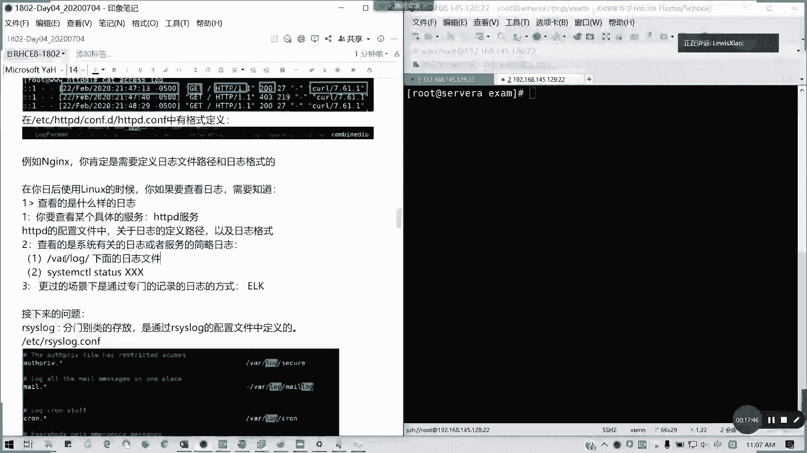

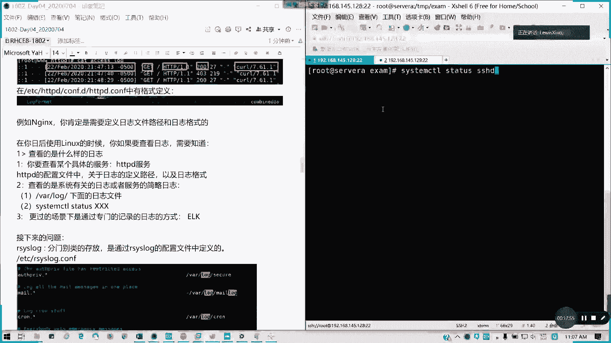

以下是日志格式的解析：
*   **时间戳**：日志产生的时间，例如 `Jul 3 21:13:56`。
*   **主机名**：产生日志的主机名，例如 `localhost`。`rsyslog`也可以记录远程主机的日志。
*   **服务/进程名**：产生日志的服务或进程名称及其进程号（PID），例如 `sshd[33698]`。
*   **事件详情**：具体的日志事件描述，例如 `Accepted password for root...`。

对于特定的应用程序（如Web服务器），它们会定义自己的日志格式。例如，Apache HTTPD (`httpd`) 服务的日志格式在其配置文件 `/etc/httpd/conf/httpd.conf` 中通过 `LogFormat` 指令定义，并通常保存在 `/var/log/httpd/` 目录下。这些格式与系统日志服务无关。

## 如何查看日志
查看日志时，首先需要确定要查看哪个服务的日志。

以下是查看日志的几种方法：
*   **应用程序日志**：查看对应服务的配置文件，确定其日志存放位置和格式。例如，Apache日志在 `/etc/httpd/conf/httpd.conf` 中定义。
*   **系统日志**：直接查看 `/var/log/` 目录下相应的日志文件，如 `messages`、`secure` 等。
*   **使用 systemctl 命令**：可以查看某个系统服务的状态和最近日志。命令格式为 `systemctl status <服务名>`，输出结果底部会显示该服务最新的几条日志。
*   **集中式日志系统**：在生产环境中，常使用如ELK Stack、Graylog、Prometheus等开源或商业的日志监控平台进行集中管理和分析。

## 配置 rsyslog 日志规则
`rsyslog` 通过配置文件 `/etc/rsyslog.conf` 来定义日志的整理规则。规则决定了哪些日志、在什么级别下、被保存到哪个文件。

我们来看一下配置文件中的规则部分：
```
*.info;mail.none;authpriv.none;cron.none                /var/log/messages
authpriv.*                                              /var/log/secure
mail.*                                                  -/var/log/maillog
cron.*                                                  /var/log/cron
*.emerg                                                 :omusrmsg:*
uucp,news.crit                                          /var/log/spooler
local7.*                                                /var/log/boot.log
```

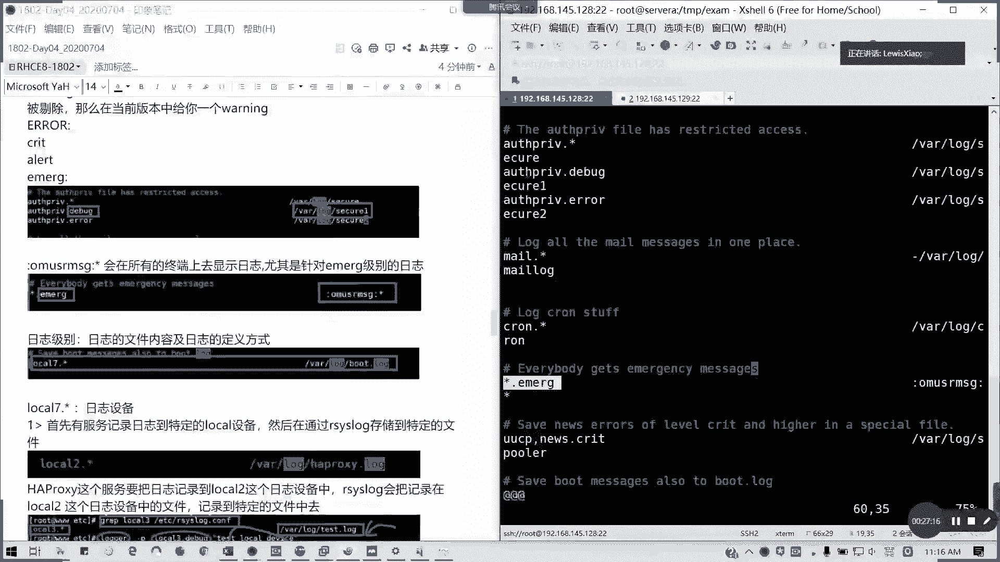

每条规则由两部分组成：
*   **选择器**：指定哪些设施（facility）和优先级（priority）的日志。例如 `authpriv.*` 表示所有认证权限相关的日志，无论什么级别。
*   **动作**：指定日志的去向。例如 `/var/log/secure` 表示写入该文件，`:omusrmsg:*` 表示将消息发送给所有已登录用户。

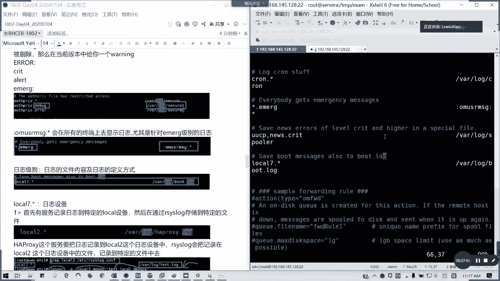

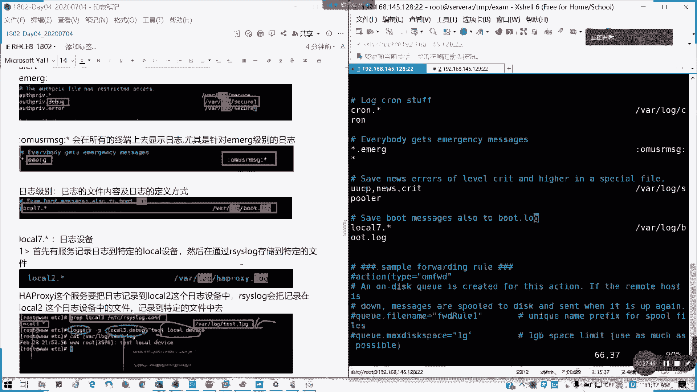

### 日志级别
`rsyslog` 定义了8个日志级别，从0（最高）到7（最低）：

以下是详细的日志级别说明：
*   **0 - emerg**：系统不可用。
*   **1 - alert**：必须立即采取措施。
*   **2 - crit**：临界情况。
*   **3 - err**：错误情况。
*   **4 - warning**：警告情况。
*   **5 - notice**：正常但重要的事件。
*   **6 - info**：一般信息性事件。
*   **7 - debug**：调试级别信息。

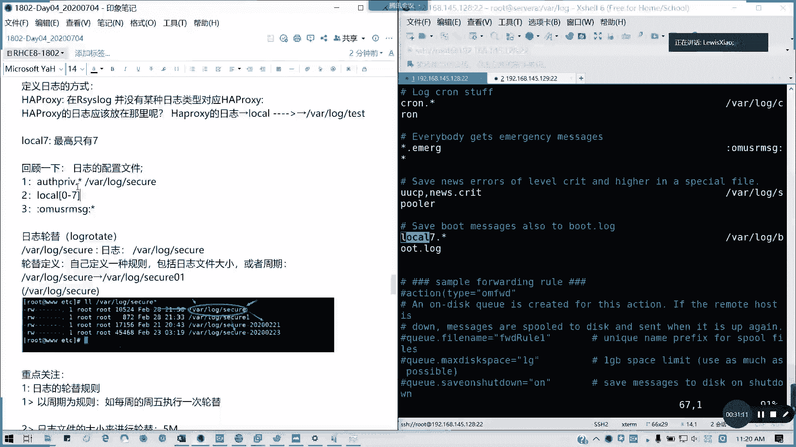

在运维中，通常需要关注 `err` 及以上级别的日志。

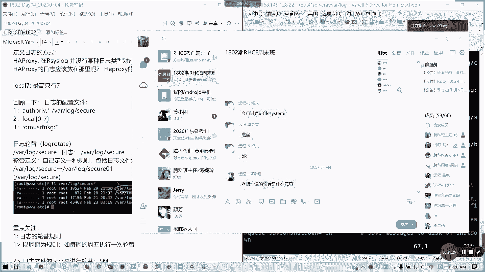

### 自定义日志规则
我们可以自定义规则，将特定日志保存到单独的文件。例如，在 `/etc/rsyslog.conf` 中添加：
```
# 将认证相关的调试日志单独保存
authpriv.=debug                                         /var/log/secure-debug.log
# 将认证相关的错误日志单独保存
authpriv.=error                                         /var/log/secure-error.log
```

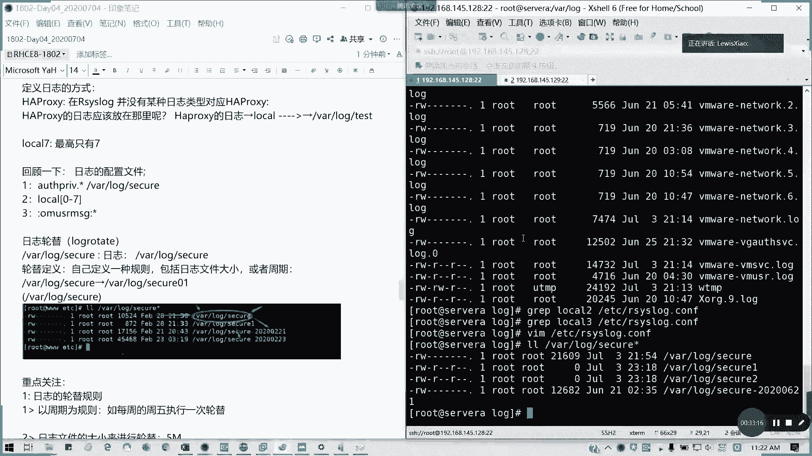

修改配置后，需要重启 `rsyslog` 服务使其生效：
```bash
systemctl restart rsyslog
```

## 日志轮转 (Log Rotation)
如果日志只写入一个文件，该文件会无限增大。为了管理方便和节省空间，系统会对日志进行轮转。

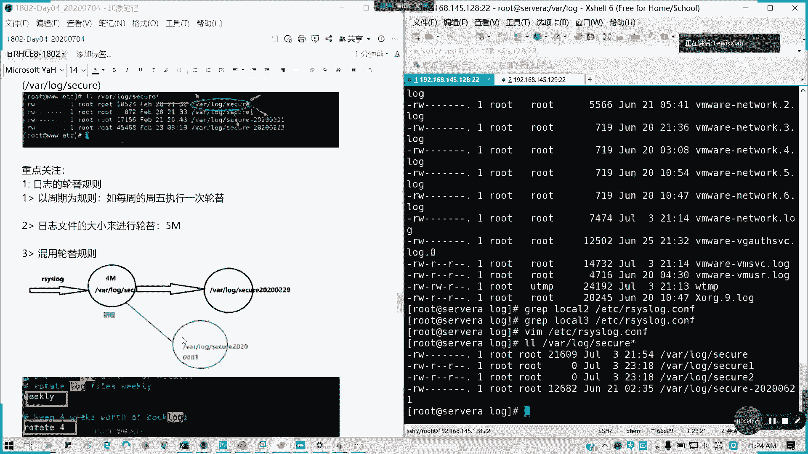

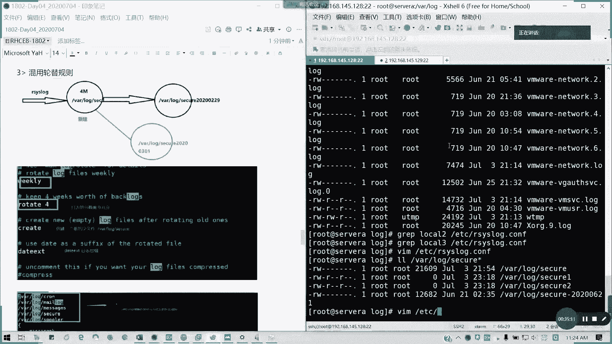

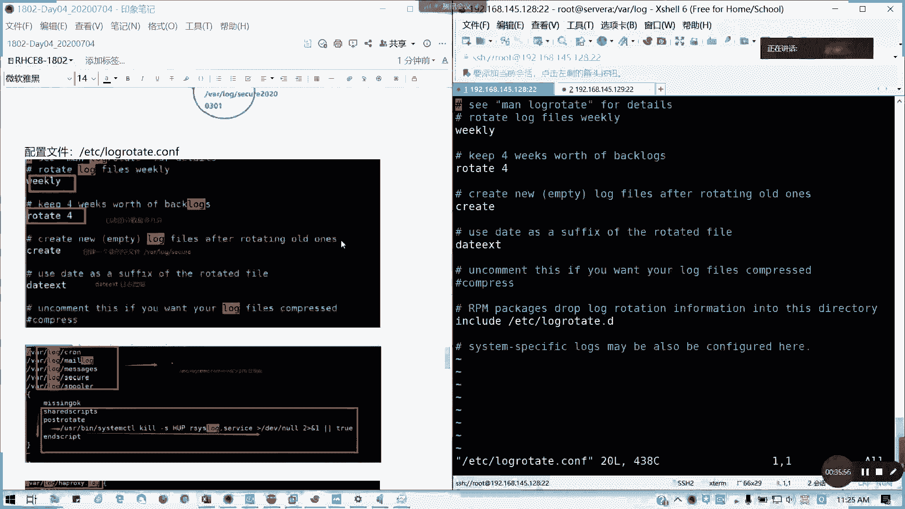

日志轮转是指按照一定规则（如时间或文件大小）将旧日志重命名归档，并创建新的空日志文件继续记录。系统默认使用 `logrotate` 工具管理日志轮转。

### 日志轮转规则
轮转规则主要基于以下条件：
*   **时间周期**：例如每天、每周轮转一次。
*   **文件大小**：当日志文件达到指定大小时进行轮转。
*   **组合条件**：可以混合使用时间和大小条件。

轮转后，旧日志文件通常会加上日期后缀（如 `secure-20230704`），并可以配置保留一定数量的归档文件，超出的旧文件会被删除。

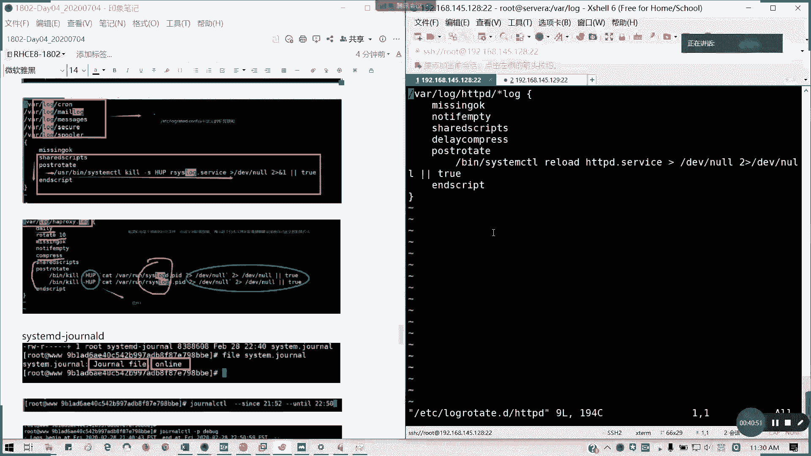

### 配置 logrotate
主配置文件是 `/etc/logrotate.conf`，其中定义了全局默认规则（如每周轮转、保留4周归档等）。

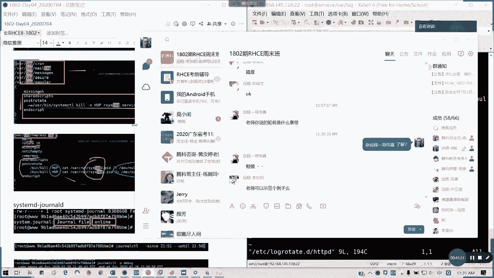

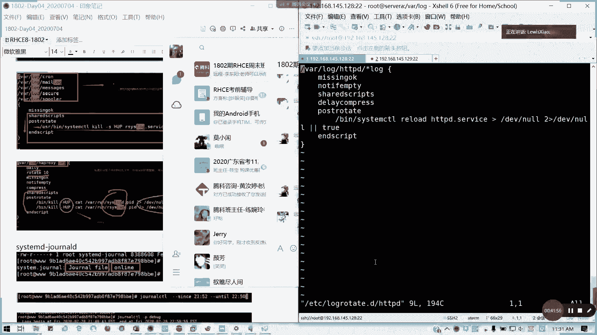

以下是 `/etc/logrotate.conf` 的示例片段：
```
weekly
rotate 4
create
dateext
include /etc/logrotate.d
```

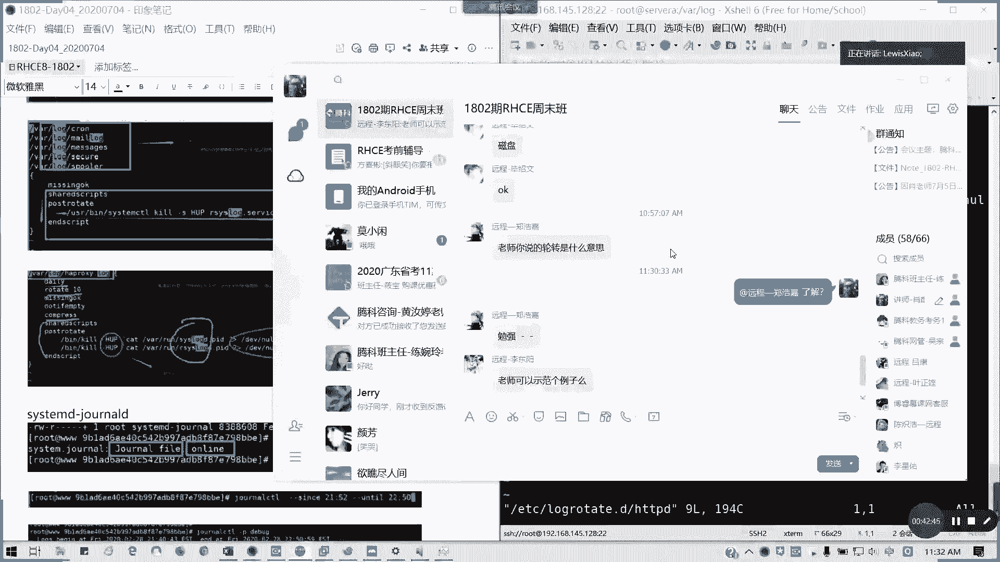

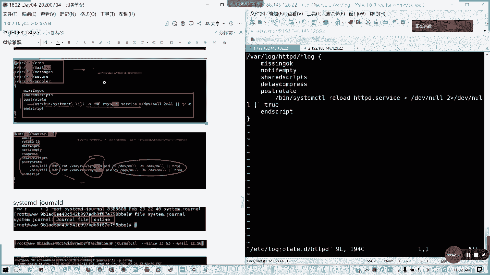

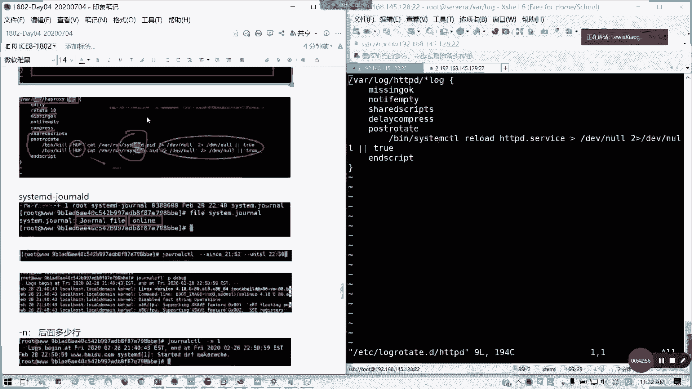

针对特定服务的轮转规则，则放在 `/etc/logrotate.d/` 目录下。例如，Apache HTTPD 的轮转配置可能在 `/etc/logrotate.d/httpd` 文件中。

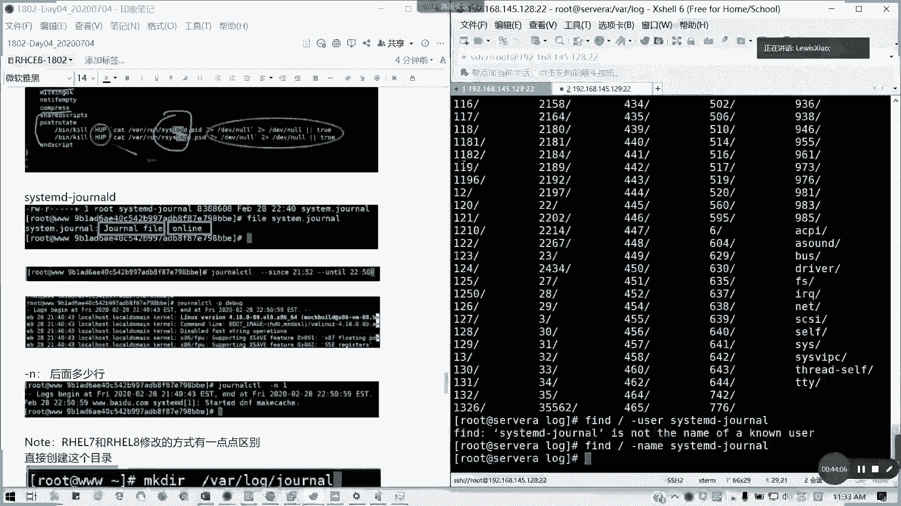

我们可以自定义轮转规则。例如，创建一个规则让 `/var/log/secure` 每小时轮转一次并保留24个归档：
1.  创建配置文件 `/etc/logrotate.d/my-secure`。
2.  写入以下内容：
    ```
    /var/log/secure {
        hourly
        rotate 24
        missingok
        notifempty
        compress
        delaycompress
        postrotate
            /bin/kill -HUP `cat /var/run/syslogd.pid 2> /dev/null` 2> /dev/null || true
        endscript
    }
    ```
3.  `logrotate` 通常由 `cron` 定时任务驱动，可以手动运行 `logrotate -f /etc/logrotate.conf` 测试配置。

## 管理 systemd-journald 日志
`systemd-journald` 的日志以二进制形式存储，默认在 `/run/log/journal/` 目录下（内存中），重启后丢失。可以配置为持久化存储到磁盘。

### 查看 journal 日志
不能直接用 `cat` 查看二进制日志，必须使用 `journalctl` 命令。

以下是常用的 `journalctl` 命令示例：
*   **查看所有日志**：`journalctl`
*   **查看指定时间段的日志**：`journalctl --since "2023-07-03 09:00:00" --until "2023-07-03 10:00:00"`
*   **查看最新N行日志**：`journalctl -n 50`
*   **查看特定优先级（如错误）的日志**：`journalctl -p err`
*   **查看特定服务（如sshd）的日志**：`journalctl -u sshd`
*   **实时跟踪日志**：`journalctl -f`

### 启用持久化存储
要将 `journal` 日志永久保存到磁盘，请执行以下步骤：
1.  创建存储目录：`sudo mkdir -p /var/log/journal`
2.  编辑配置文件 `/etc/systemd/journald.conf`，将 `#Storage=auto` 改为 `Storage=persistent`。
3.  重启服务：`sudo systemctl restart systemd-journald`

之后，日志将持久化保存在 `/var/log/journal/` 目录下，但仍需使用 `journalctl` 命令查看。

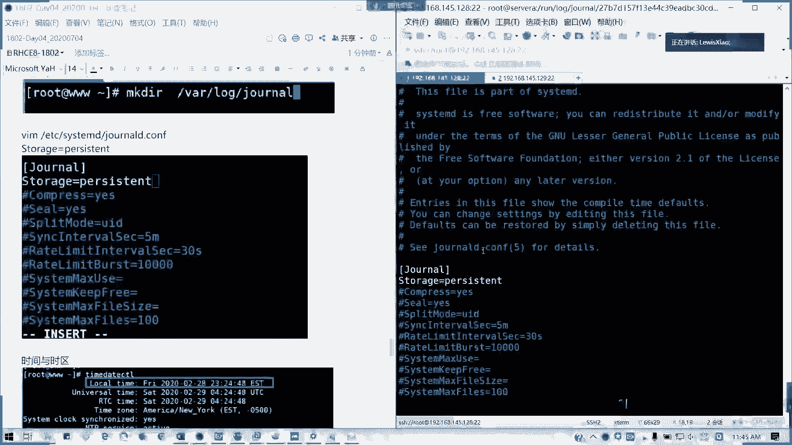

## 系统时间与时钟同步 (NTP)
系统时间准确性对于日志记录和许多服务（如NFS）至关重要。RHEL 8 使用 `chronyd` 服务进行网络时间协议（NTP）同步。

### 查看和设置时区
使用 `timedatectl` 命令管理时间和时区。

以下是相关操作命令：
*   **查看当前时间和时区**：`timedatectl status`
*   **列出所有可用时区**：`timedatectl list-timezones`
*   **设置时区（如上海）**：`timedatectl set-timezone Asia/Shanghai`

### 手动设置时间
如果关闭了NTP同步，可以手动设置时间：
```bash
timedatectl set-ntp false
timedatectl set-time “2023-07-04 12:00:00”
```

### 配置 NTP 时钟同步
通常建议启用NTP同步以保持时间准确。

1.  编辑配置文件 `/etc/chrony.conf`。
2.  在 `pool` 或 `server` 部分添加或修改NTP服务器地址。例如，指向内部时间服务器：
    ```
    server classroom.example.com iburst
    ```
    `iburst` 选项可以在初始同步时加快速度。
3.  重启 `chronyd` 服务：`sudo systemctl restart chronyd`
4.  检查同步状态：`chronyc sources -v`

此命令会显示当前使用的时间源及其状态、偏移量等信息。

## 总结
本节课中我们一起学习了Linux系统的日志管理。我们首先了解了`systemd-journald`和`rsyslog`两个核心服务如何协作记录和整理日志。接着，我们学习了系统日志的分类、存放位置和标准格式，并掌握了查看日志的多种方法。

然后，我们深入探讨了如何通过`/etc/rsyslog.conf`配置文件自定义日志规则，包括根据设施、优先级将日志定向到不同文件。针对日志文件不断增大的问题，我们学习了使用`logrotate`工具进行日志轮转的配置和管理。

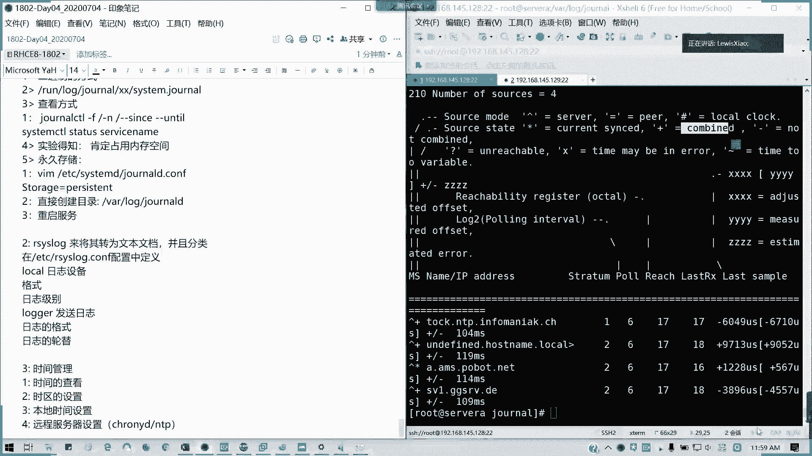

对于存储在内存中的`journal`日志，我们学会了使用`journalctl`命令进行查询和筛选，并了解了如何配置持久化存储。最后，我们确保了日志时间戳的准确性，通过`timedatectl`管理时区，并使用`chronyd`服务配置NTP网络时间同步。

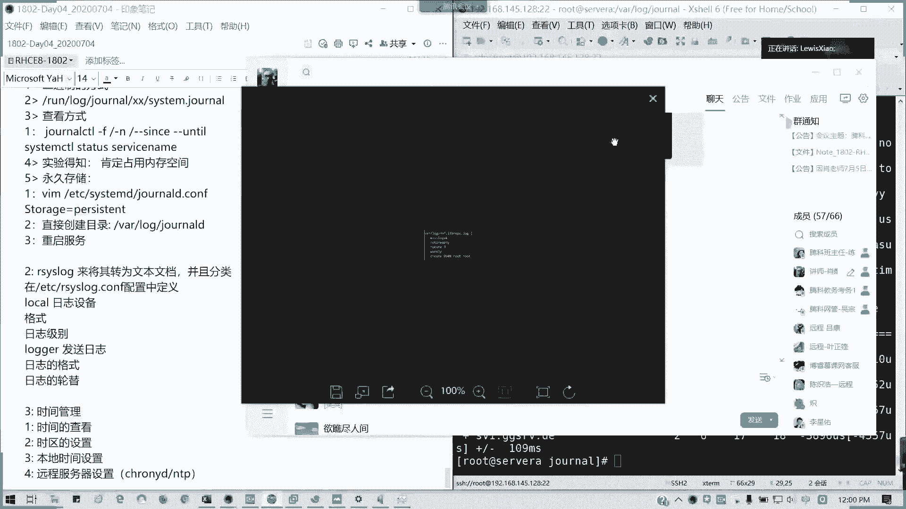

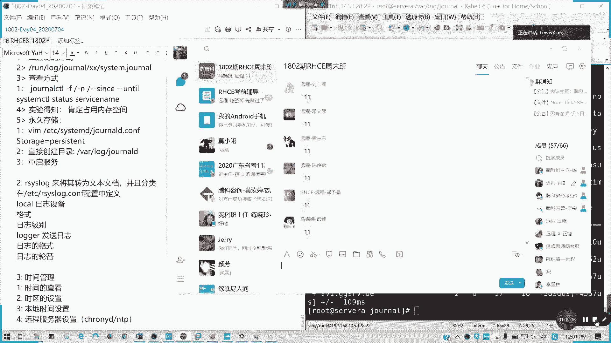

掌握这些日志管理技能，是进行系统监控、故障排查和安全审计的基础，对于RHCE认证和日常运维工作都至关重要。