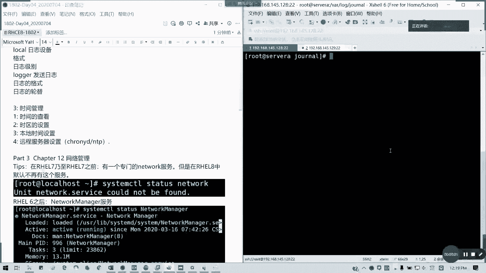
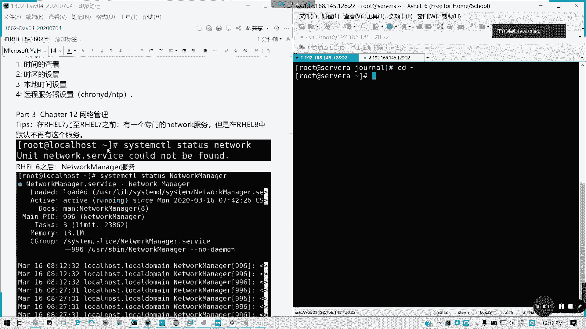
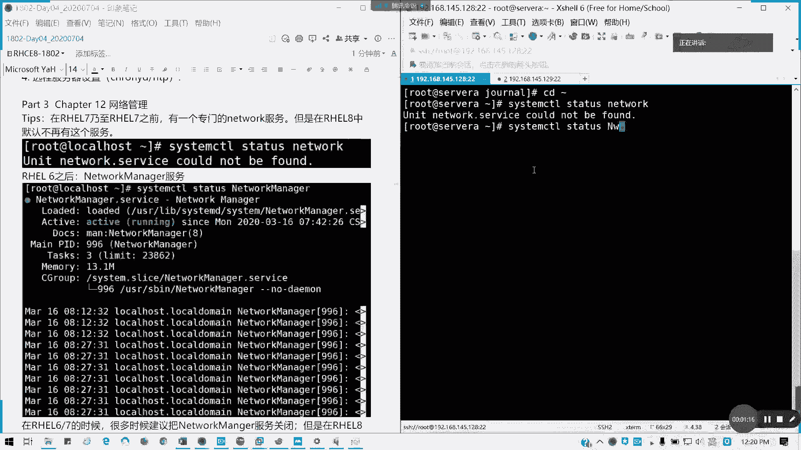
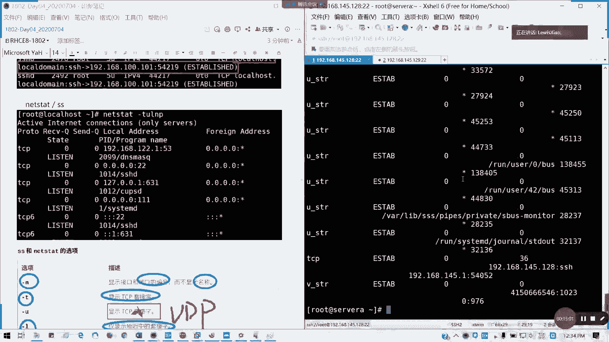
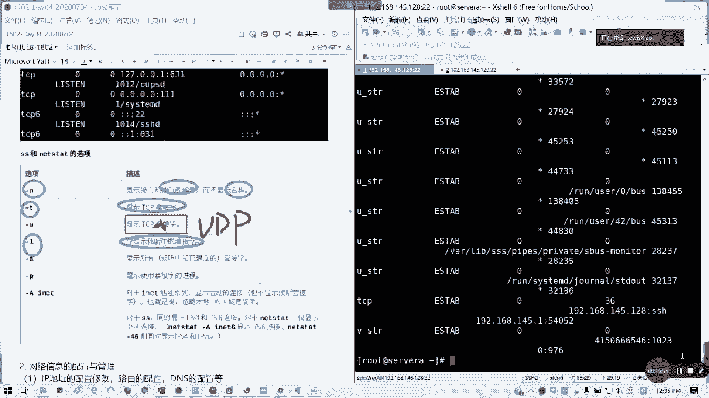

# 红帽 RHCE 8.0 认证体系课程：P21：网络管理基础






## 概述
在本节课中，我们将学习红帽企业 Linux 8 中网络管理的基础知识。我们将了解网络设备命名规则、查看网络信息的常用命令，以及进行基本的网络连通性测试。这些是后续进行网络配置和管理的重要基础。

## 网络管理服务的变化
上一节我们介绍了课程的整体结构，本节中我们来看看网络管理在红帽 8 中的关键变化。



在红帽 7 及更早版本中，存在一个专门的 `network` 服务。但在红帽 8 中，该服务默认不再存在。这个组件已被淘汰。网络管理的职责完全交给了 **NetworkManager** 服务。这个服务在红帽 8 中不能被关闭。这是红帽 8 与 6、7 版本最大的区别之一。在以前，如果用户想自行配置网卡而不受其管理，可以关闭该服务。但在红帽 8.0 及以后的版本中，不再允许关闭此服务。重启网卡的方法将在后续说明。虽然红帽 8 中仍可安装旧的 `network` 服务包，但不建议继续使用，因为在下一个大版本（如红帽 9）中将会完全剔除对该服务的支持。

## 网络设备命名规则
了解了服务变化后，我们来看看系统是如何识别和命名网络设备的。

红帽 6 以前，网卡名称类似 `lo`、`eth0`、`eth1`。从红帽 7 开始，采用了基于固件信息的设备命名规则。例如，常见的 `ens160`、`virbr0` 等名称都属于 **biosdevname** 规则。网卡名称与网卡类型相关。

以 `ens160` 为例：
*   `en` 代表 **Ethernet**，即有线以太网卡。
*   `s` 代表 **PCIe** 总线的插槽。
*   `160` 是端口编号。

网卡设备名称可以被更改，例如根据功能自定义。但刚安装系统时，会按照系统默认的 **biosdevname** 规则来命名。

网络接口名称以类型缩写开头：
*   以太网：`en`
*   无线网：`wl`
*   广域网：`ww`

类型后的部分基于服务器固件信息或 PCI 总线拓扑中的设备位置确定。

其他命名示例：
*   `eno1`：代表板载（内置）以太网设备，编号为 1。
*   `ens3`：代表位于 PCI 热插拔插槽 3 中的以太网卡。
*   `enp4s0`：代表位于 PCI 总线 4、插槽 0 的以太网设备。
*   对于多功能设备（如多端口网卡），会添加 `f0`、`f1` 等后缀表示不同功能。

## 查看网络信息
掌握了命名规则，接下来我们学习如何查看系统的网络状态和信息。

以下是常用的网络信息查看命令：

**1. 查看IP地址与接口信息**
使用 `ip addr show` 命令可以显示网卡的 IP 信息、MAC 地址和状态。
```bash
ip addr show
```
或查看特定网卡：
```bash
ip addr show ens160
```
输出信息包括：
*   `link/ether` 后面的一串由冒号分隔的地址是网卡的 **MAC 地址**，相当于网卡的物理身份证。
*   `inet` 后面显示的是 **IPv4 地址** 和子网掩码。
*   `inet6` 后面显示的是 **IPv6 地址**。

**2. 查看路由信息**
使用 `ip route` 命令查看路由信息，通常关注默认路由即可。
```bash
ip route
```
默认路由（显示为 `default via ...`）指明了数据包在没有更具体路由匹配时的出口。使用 `route -n` 可以打印更详细的路由表。

**3. 查看DNS信息**
系统的 DNS 服务器地址通常配置在网卡文件中，或者由 **NetworkManager** 生成在 `/etc/resolv.conf` 文件里。该文件最多允许配置三个 DNS 服务器，但只有前两个会生效。

**4. 查看主机名**
使用 `hostname` 或 `hostnamectl` 命令查看系统主机名。
```bash
hostname
```

**5. 查看网口统计信息**
使用传统的 `ifconfig` 命令或更现代的 `ip -s link` 命令可以查看网络接口的流量统计。
```bash
ifconfig ens160
```
或
```bash
ip -s link show ens160
```
这些命令会显示接口接收和发送的数据包、字节数以及错误计数等信息。

## 网络连通性测试
配置好网络后，我们需要测试其连通性，以下是基本测试方法。

**1. 使用 `ping` 测试连通性**
`ping` 命令用于测试与目标主机（域名或IP地址）的网络连通性。
```bash
ping www.baidu.com
```
在 Linux 下，`ping` 会持续发送数据包直到手动停止。可以指定参数控制行为：
*   `-c`：指定发送数据包的次数。例如 `ping -c 3 www.baidu.com` 只发送 3 个包。
*   `-s`：指定发送数据包的大小（字节）。默认是 56 字节，加上 28 字节的 ICMP 包头，总共 84 字节。数据包过大可能导致丢包。

**2. 使用 `ping6` 测试 IPv6 连通性**
对于 IPv6 地址，使用 `ping6` 命令。
```bash
ping6 ::1
```

**3. 使用 `traceroute` 跟踪路由路径**
`traceroute` 命令用于跟踪数据包从本机到目标主机所经过的每一跳路由。
```bash
traceroute 192.168.1.1
```
`* * *` 表示该路由节点没有应答。

## 查看端口与连接信息
最后，我们学习如何查看系统上的网络连接和端口监听状态。

**1. 使用 `lsof` 查看端口信息**
`lsof` 命令可以列出打开的文件，结合 `-i` 选项可以查看端口信息。
```bash
lsof -i :80
```

**2. 使用 `netstat` 或 `ss` 查看网络连接状态**
`netstat` 是一个传统的网络统计工具。
```bash
netstat -tunlp
```
常用选项：
*   `-t`：TCP 连接
*   `-u`：UDP 连接
*   `-n`：以数字形式显示地址和端口
*   `-l`：仅显示监听状态的套接字
*   `-p`：显示进程标识符和程序名



`ss` 命令是现代替代工具，功能与 `netstat` 类似，但更高效。
```bash
ss -tunlp
```
现在更推荐使用 `ss` 命令。



## 总结
本节课中，我们一起学习了红帽 8 网络管理的基础。我们首先了解了 **NetworkManager** 成为核心网络服务的变化。接着，我们学习了基于固件的网络设备命名规则（如 `ens160`）。然后，我们掌握了一系列查看网络信息的命令，包括 `ip addr`、`ip route`、`hostname` 等。最后，我们学会了使用 `ping`、`traceroute` 测试网络连通性，以及使用 `ss`、`lsof` 查看端口和连接状态。这些基础知识是后续进行实际网络配置的必备前提。