# 红帽 RHCE 8.0 认证课程：P22：网络管理（二）


## 概述
在本节课中，我们将学习如何在 Red Hat Enterprise Linux 8 系统中配置和管理网络。主要内容包括使用 `nmcli` 命令行工具修改 IP 地址、路由和 DNS，理解网络设备与连接的关系，以及通过直接编辑配置文件来管理网络。

---

## 网络配置管理简介
上一节我们介绍了查看网络信息的基本命令。本节中，我们来看看如何进行网络信息的配置管理。

在红帽 8 之前，修改网卡配置文件后重启 `network` 服务即可。在红帽 8 中，不再提供 `network` 服务，所有网络管理都通过 **NetworkManager** 来完成。

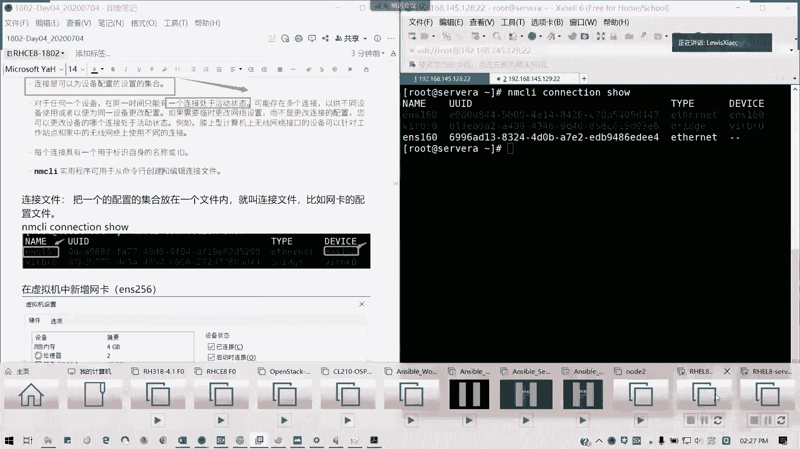

NetworkManager 提供了图形化和命令行两种工具。由于服务器环境通常不安装图形界面以节省资源，我们将重点讲解命令行配置工具 `nmcli`。

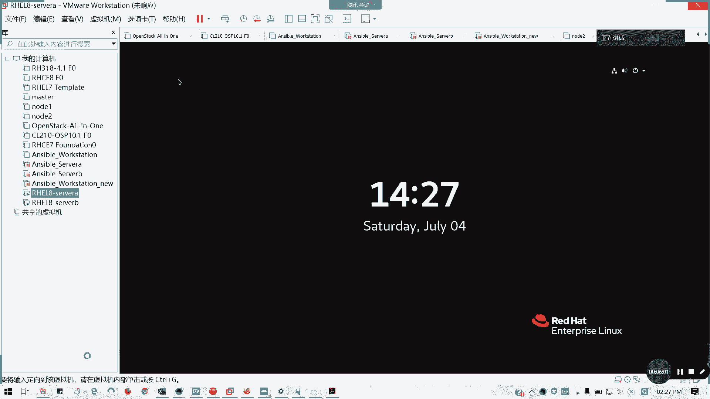

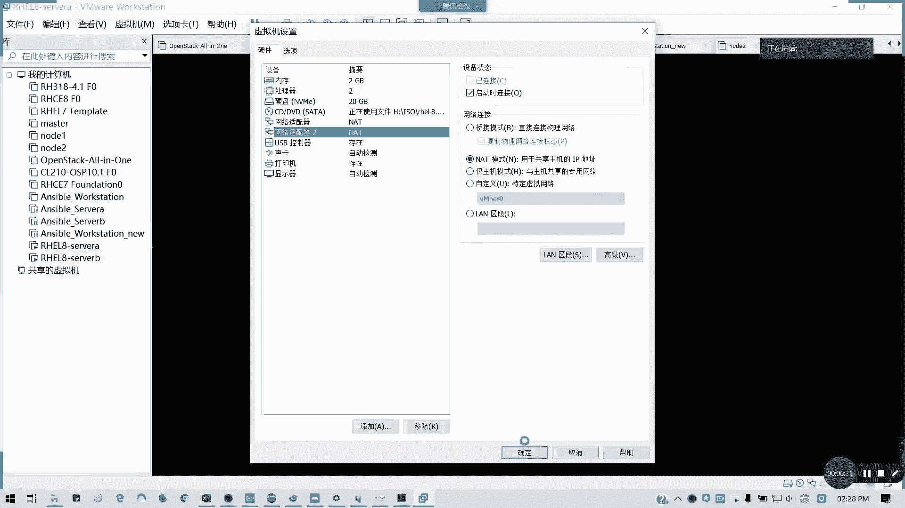

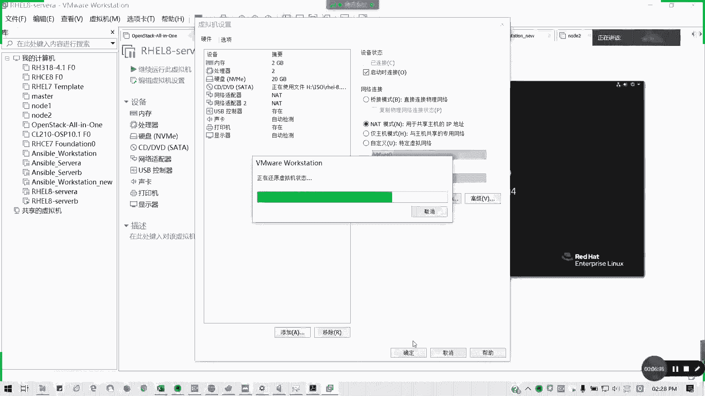

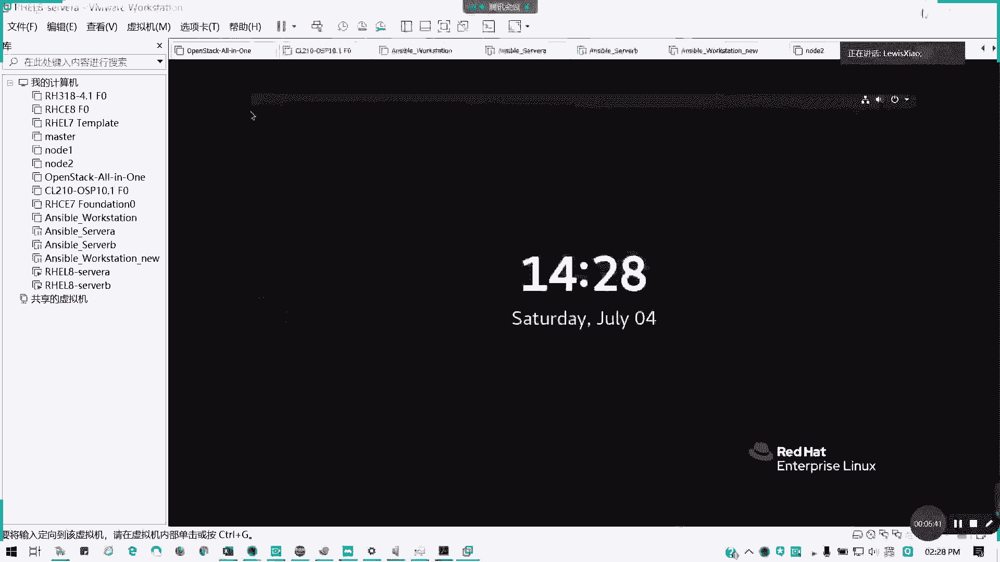

`nmcli` 命令的基本用法是 `nmcli connection`（可简写为 `con`），后面跟具体参数。它通过命令行修改配置，并与 NetworkManager 通信，最终将配置文件保存在 `/etc/sysconfig/network-scripts/` 目录下。

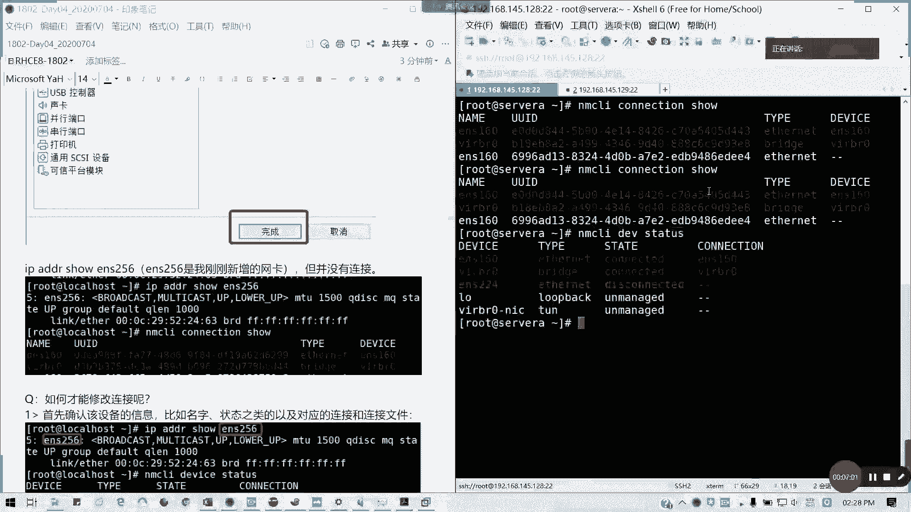

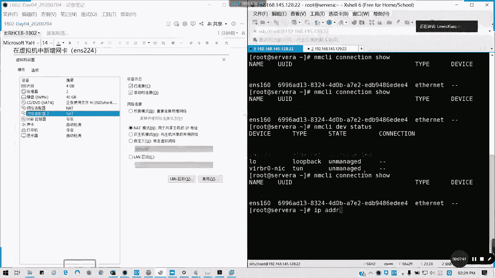

这里有两个核心概念：
*   **设备名**：指网络接口本身，如 `eth0`, `ens224`。
*   **连接名**：为设备配置的一个设置集合。连接名可以与设备名一致或不一致。

对于一个网络设备，同一时间只能有一个连接处于活动状态。但可以存在多个连接配置，供不同设备使用或为同一设备切换配置。

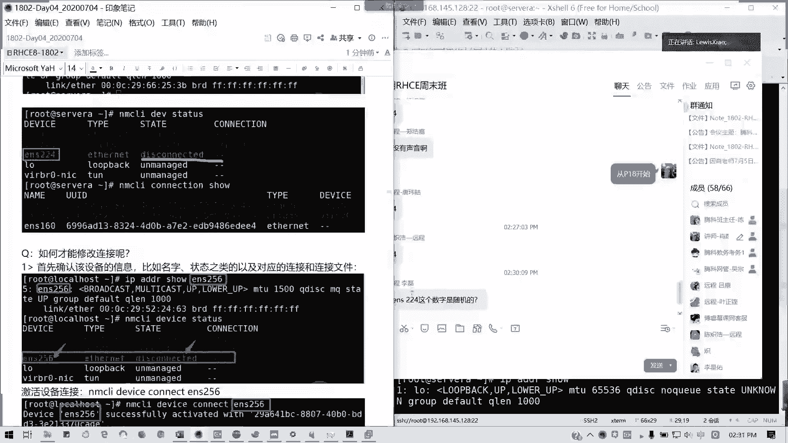

连接文件就是将一个配置集合保存在一个文件内。

---

## 添加新网络设备并激活连接
现在，我们在虚拟机中添加一个新网卡，并演示如何为其配置连接。

首先，在虚拟机设置中添加一个新的网络适配器。系统启动后，使用以下命令查看新设备：
```bash
ip addr show
```
和
```bash
nmcli device status
```
你会发现新增了一个设备（例如 `ens224`），但其状态是 `disconnected`（断开连接）。

接下来，我们激活这个设备的连接：
```bash
nmcli device connect ens224
```
命令执行成功后，使用 `nmcli connection show` 查看，会发现已为 `ens224` 设备创建并激活了一个连接。同时，在 `/etc/sysconfig/network-scripts/` 目录下会生成对应的配置文件。

综上所述，确认和管理一个设备连接需要关注三点：
1.  设备状态 (`nmcli device status`)
2.  设备连接 (`nmcli connection show`)
3.  设备对应的配置文件

---

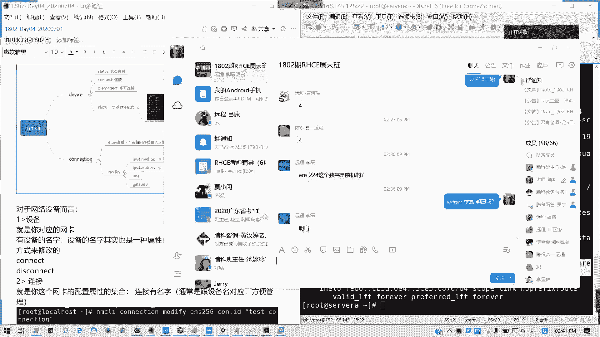

## 使用 `nmcli` 修改网络配置
我们已经知道如何建立连接。接下来，我们学习如何使用 `nmcli` 修改配置。

`nmcli connection modify` 命令用于修改设备对应连接的属性，如 IP 地址、子网掩码、网关和 DNS。

以下是修改 IP 地址的示例操作：
```bash
# 修改连接 `ens224` 的 IPv4 地址为 192.168.146.128/24
nmcli connection modify ens224 ipv4.addresses 192.168.146.128/24
# 将 IPv4 地址分配方法设置为手动（静态）
nmcli connection modify ens224 ipv4.method manual
```
修改配置后，需要重新加载配置并重启连接使其生效：
```bash
# 重新加载 NetworkManager 的配置文件
nmcli connection reload
# 先关闭连接
nmcli connection down ens224
# 再启动连接
nmcli connection up ens224
```
最后，使用 `ip addr show` 或 `nmcli connection show ens224` 验证配置是否生效。

`nmcli device` 和 `nmcli connection` 命令功能丰富，可以查看、建立、断开连接以及修改各项网络参数。

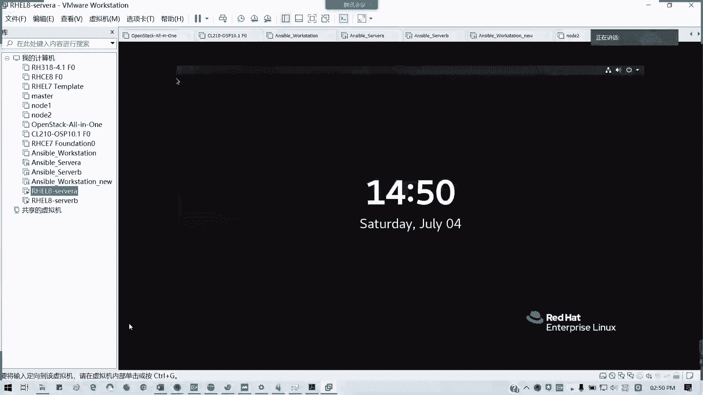

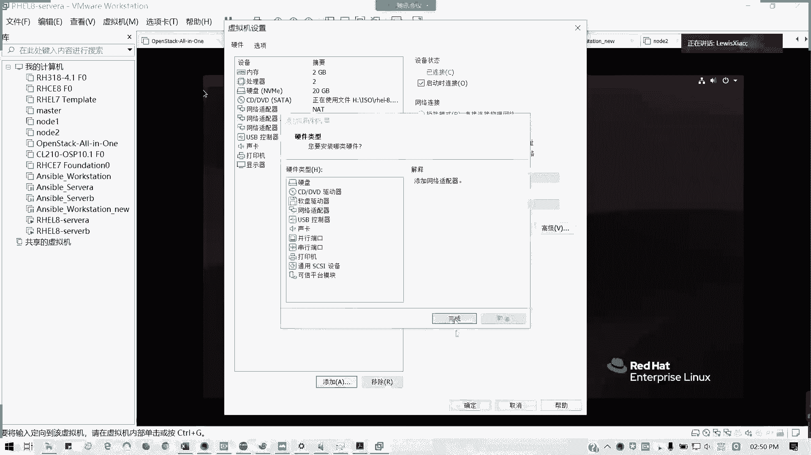

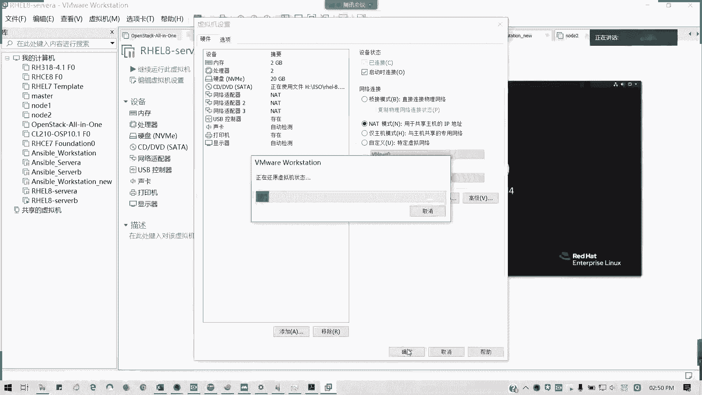

---

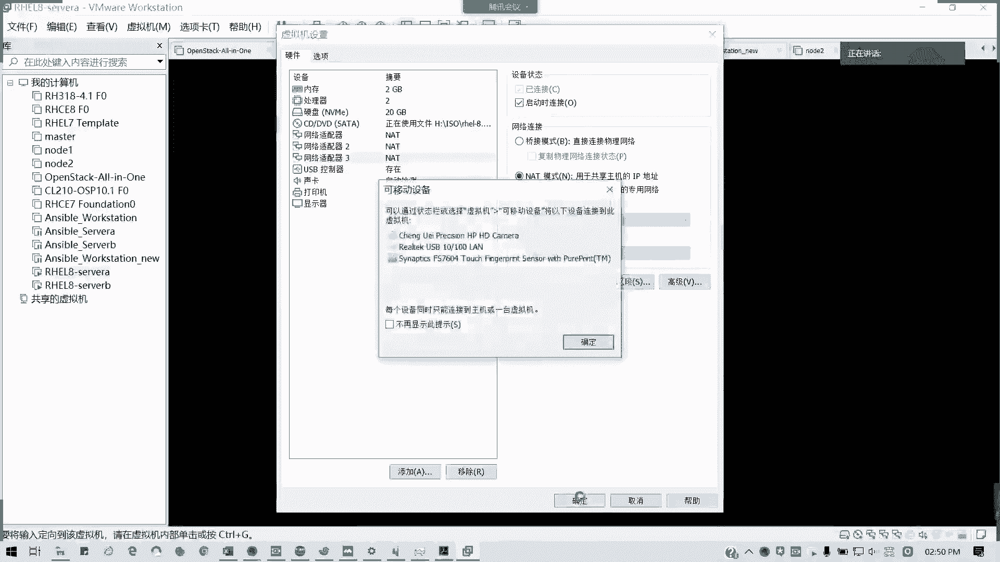

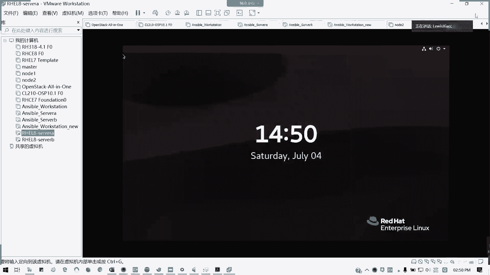

## 设备与连接的关系详解
我们再次强调设备与连接的关系。

设备是物理或虚拟的网络接口。连接是该接口上配置信息的集合。连接名可以修改，不一定与设备名相同。

例如，我们可以修改连接的名称：
```bash
# 将连接名从 `ens224` 改为 `test-connection`
nmcli connection modify ens224 connection.id “test-connection”
nmcli connection reload
nmcli connection down “test-connection”
nmcli connection up “test-connection”
```
此时，管理该连接就需要使用新的名字 `test-connection`。为了方便管理，通常建议保持连接名与设备名一致。

创建连接有两种方法：
1.  **自动关联**：对已识别的设备使用 `nmcli device connect <设备名>`。
2.  **手动创建**：使用 `nmcli connection add` 命令手动创建连接配置文件。

手动创建连接的示例：
```bash
nmcli connection add type ethernet ifname ens256 con-name ens256
```
该命令会创建一个类型为以太网、绑定设备 `ens256`、连接名也为 `ens256` 的新连接，并自动激活它。

---

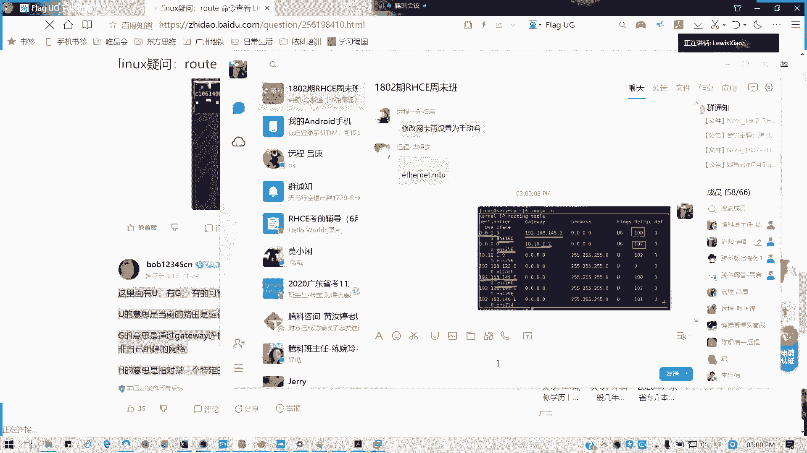

## 配置网关与路由
每个设备都可以配置 IP，但网关通常是针对整个系统的。系统一般只允许一个默认网关生效，以避免路由混乱。

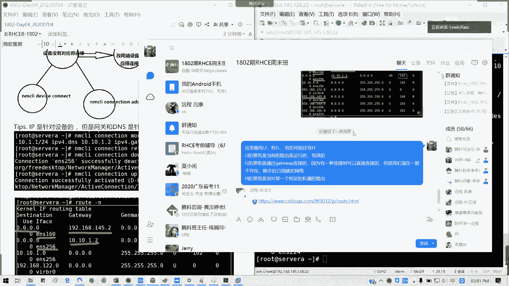

我们可以为特定连接配置网关：
```bash
nmcli connection modify ens256 ipv4.addresses 10.10.1.1/24
nmcli connection modify ens256 ipv4.gateway 10.10.1.2
nmcli connection modify ens256 ipv4.dns 10.10.1.2
nmcli connection reload
nmcli connection down ens256
nmcli connection up ens256
```
配置完成后，使用 `ip route show` 或 `route -n` 查看路由表。你会看到通往不同网络的路径及其**跃点数**。跃点数越低，路由优先级越高。系统会选择跃点最低的路由作为默认出口。

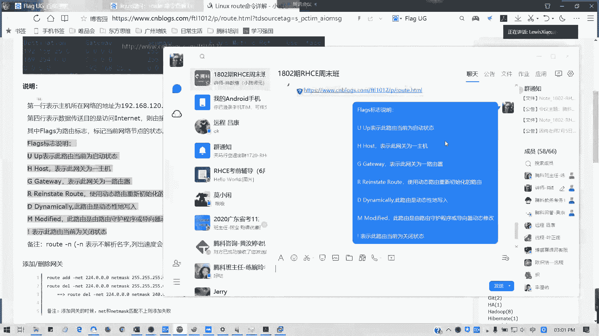

---

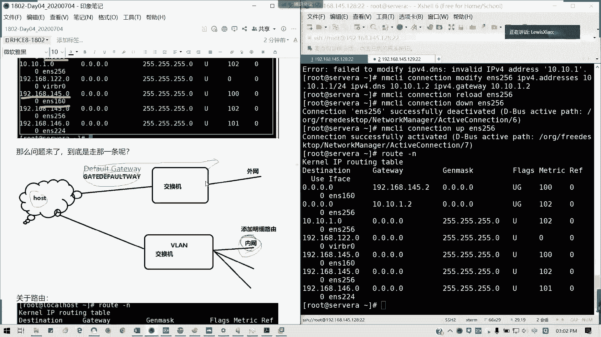

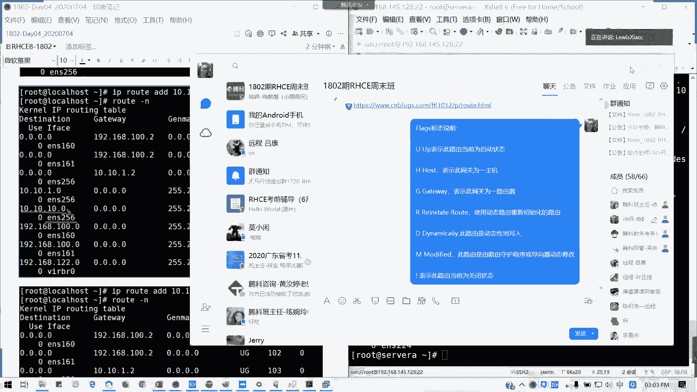

## 直接编辑网络配置文件
除了使用 `nmcli`，也可以直接编辑网卡配置文件，这对于理解底层配置很有帮助。

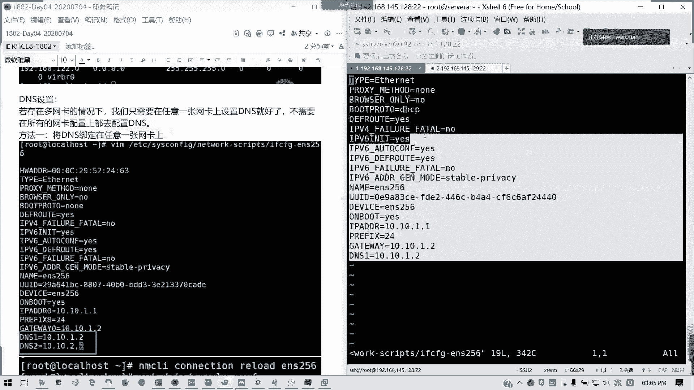

网卡配置文件位于 `/etc/sysconfig/network-scripts/` 目录下，命名格式为 `ifcfg-<连接名>`。

编辑配置文件时，主要关注以下几个参数：
*   `BOOTPROTO`：IP获取方式，`dhcp`（动态）或 `static/none`（静态）。
*   `NAME` 与 `DEVICE`：连接名和设备名，**必须保持一致**。
*   `ONBOOT`：是否开机启动，设为 `yes`。
*   `IPADDR`：IP地址。如果有多个IP，可使用 `IPADDR0`, `IPADDR1`。
*   `PREFIX` 或 `NETMASK`：子网掩码（如 `24` 或 `255.255.255.0`）。
*   `GATEWAY`：网关地址。
*   `DNS1`, `DNS2`：DNS服务器地址。**注意：DNS序号从1开始**。

配置文件示例片段：
```bash
BOOTPROTO=none
NAME=ens256
DEVICE=ens256
ONBOOT=yes
IPADDR=10.10.1.1
PREFIX=24
GATEWAY=10.10.1.2
DNS1=10.10.1.2
```
修改配置文件后，必须执行 `nmcli connection reload` 重新加载配置，并重启对应连接。

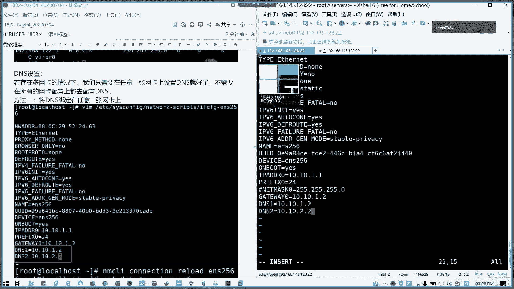

DNS 配置也可以直接写入 `/etc/resolv.conf` 文件，但注意，通过 NetworkManager 修改连接 DNS 时，它会自动更新此文件。

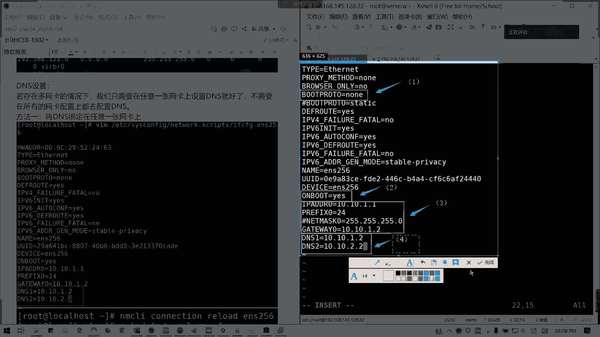

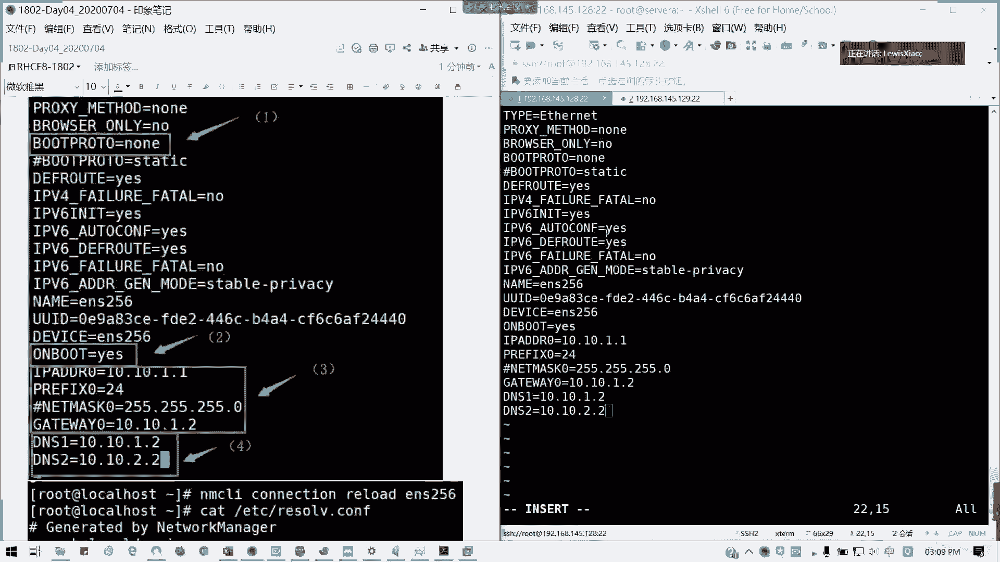

---

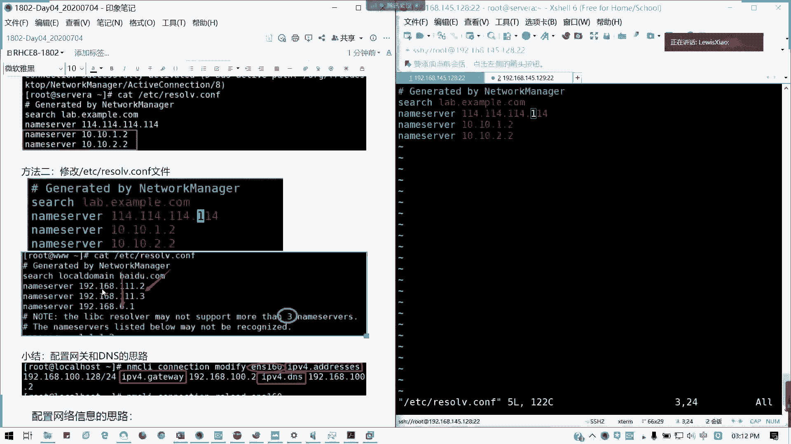

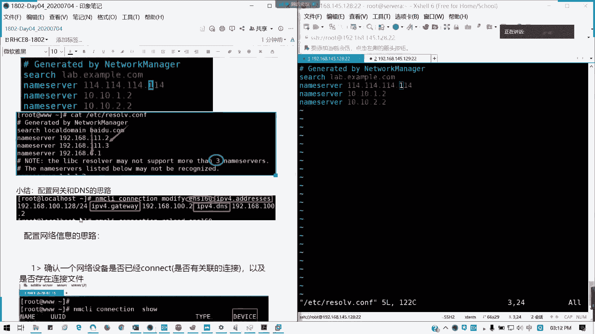

## 配置思路总结
本节课中我们一起学习了网络配置的两种主要方法。

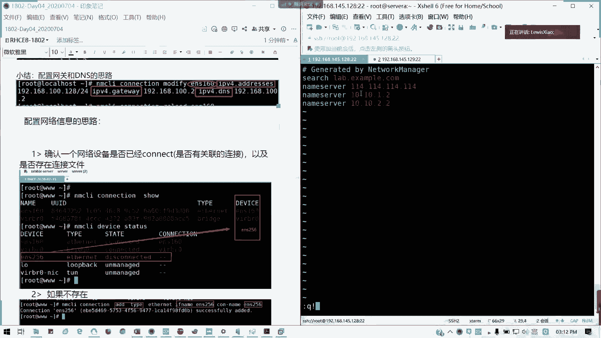

使用 `nmcli` 的配置思路：
1.  确认设备是否存在连接 (`nmcli connection show`)。
2.  若无连接，则创建 (`nmcli device connect <设备名>` 或 `nmcli connection add`)。
3.  修改连接配置 (`nmcli connection modify`)，设置 IP、网关、DNS 等。
4.  重新加载配置并重启连接使其生效 (`nmcli connection reload; nmcli connection down/up`)。

直接编辑配置文件的思路：
1.  编辑 `/etc/sysconfig/network-scripts/ifcfg-<连接名>` 文件。
2.  确保 `BOOTPROTO`, `NAME`, `DEVICE`, `ONBOOT`, `IPADDR`, `PREFIX/NETMASK`, `GATEWAY`, `DNS` 等参数正确。
3.  重新加载配置并重启连接使其生效。

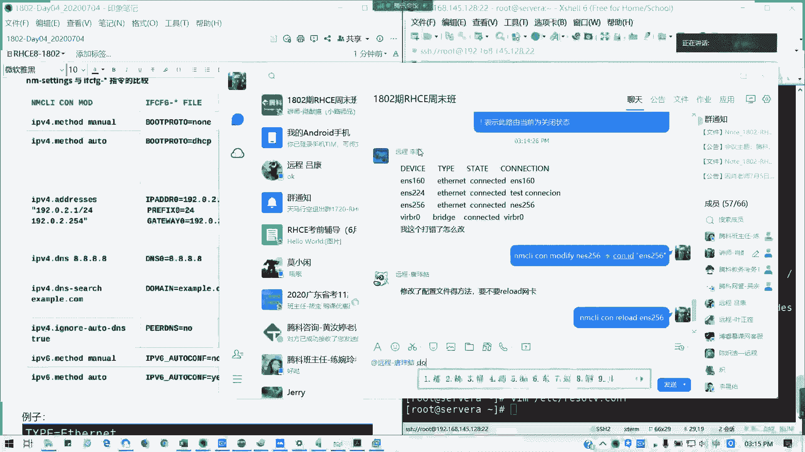

两种方法等效，`nmcli` 更动态高效，而直接编辑文件有助于深入理解。

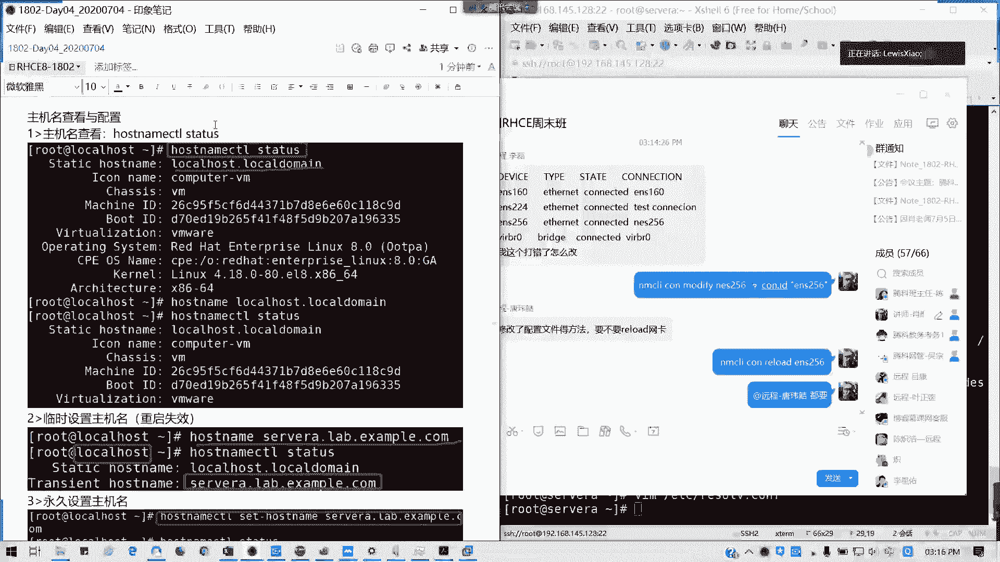

（注：课程后续将讲解“链路聚合”等补充知识，本节内容结束。）