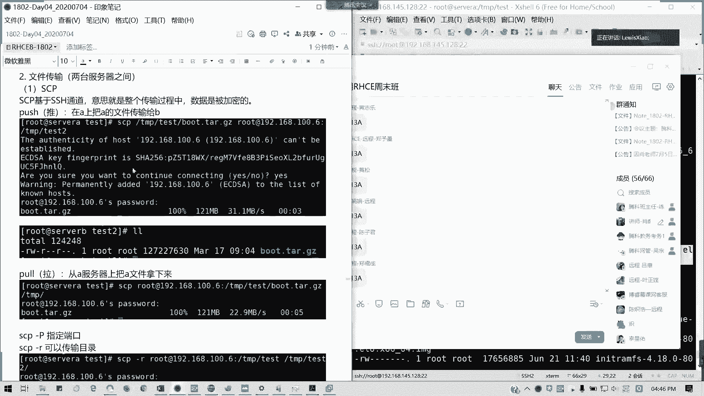
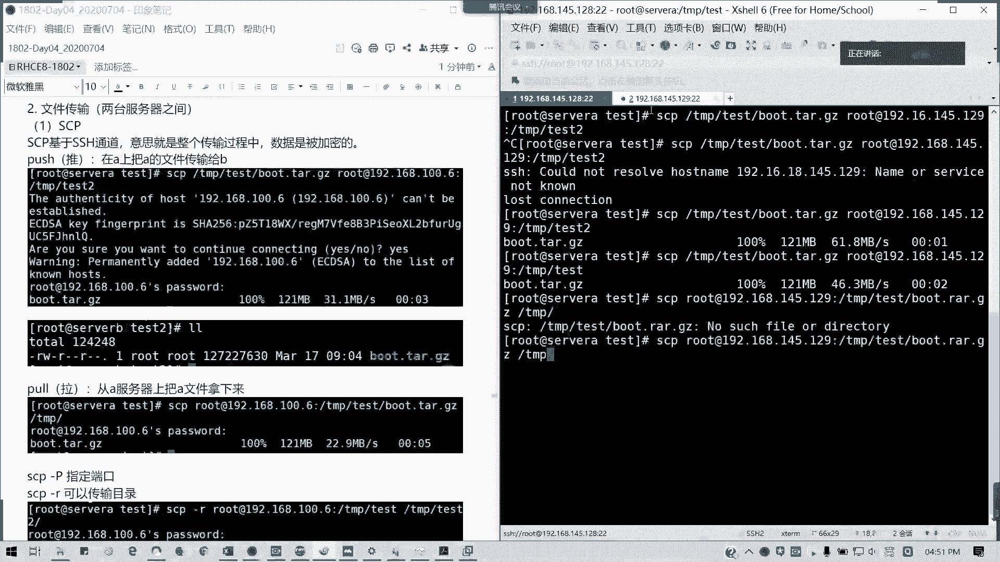
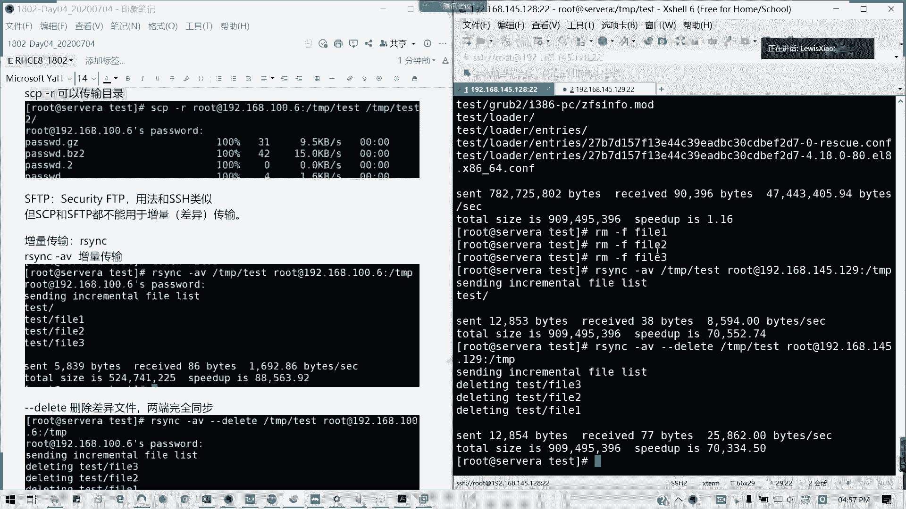

# 拿下证书！Redhat红帽 RHCE8.0认证体系课程 RH124+RH134+RH294三门认证视频教程 - P24：24_Video_Day04_Ch13_文件归档及传输 - 16688888 - BV1734y117vT

我刚才只讲了一种IT backup，然后呢，大家load balance，还有那个另外一种叫做rob robin，大家可以去试一下啊，这种这几种。其实它的那个跟bod。

我们team跟bod它有还有些许区别的。我刚才发了文章。第一个，第二个ro robin跟low balance，它的那个实现的双网卡的一个聚额方式是不一样的啊，包括跟AT backup的区别都有的。

所以的话这块可以大家去探究一下，我就不讲了。接下来我们讲第十3章文件归档跟传输。首先讲文件归档，文件归档的话。前面啊。前面你看。我们linux呢自带支持三种压缩格式，但是呢它只就是说那个压缩的话啊。

只能对文件进行压缩，它目录压缩不了的这种的，如果不不用我们讲的ta命令之前，我们单纯用基于zip，对不对？它这个比如说我们用GC，我们这用这些三种GZ跟BC two跟叉Z的话，它是支持这三种。

然后叉Z它的压缩力最大啊压力最大。然后GGJ呢是最小，但是最通用啊，其实呢我们啊三种压缩格式呢，通常只能压文件啊，像我们通常用法呢，我们看到这里，我就看到这里像通常我们压缩文件G像GC的话。

我们直接进入到TMP。pass呃test model是不是有个pasWD是吧？这有个passWD，那我们可以压缩一下啊，GZ。花的低。然后是不是这个文件啊？因为他做的软件解锁就不能。我不能再压缩了啊。

就是因为这个文件他做软件，操作的链接不能删掉。所以的话我这里就那个。我就复制成一个passWD2，我这里压缩一下pasWD2。然后是不是我它里面的一个文件已经没了，对不对？变成一个压缩，对不对？

变成一个要素文件，对不对？点击点G以这结尾。懂我意思吗？然后如何解压就叫做G onZ。他这文件就那个又释放回来了。然后如果我要。保留这个文件怎么搞呢？追Z杠C啊，compress passs up。

然后我进去进一个重定项。那是是不是我们两个文件都有了？懂吗？可以明白吗？两个文件都在这儿。对吧。然后解压呢g按z。杠C。我解我解要出一个新的文件，叫23，我就这里不再复制了啊，不再不再覆盖。

所以的话它的那个文，你看到文件跟大小是不是跟原来一模一样的。对不对？那这个是G zip的用法，然后B zip two呢。ベデト。同样我压缩那个passWD杠2，因为那个我做的软链接我就不方便了啊。

🎼看一下是吧，它变成1个BZ two的，它的大小是1066，像我们刚才1044，对不对？其实差不多了啊，然后那个解压BMZ two。对吧又会复回了啊。🎼就打包压缩解压压缩解压。然后如果要加上就打包。

然后它原文件入存在情况下，那我就。Be zip 2。杠低。No。pas点BZ two是吧？in file。not a busy to five啊，我看一下。O9那我想想啊。诶。我记得是加杠D就可以了啊。

guessss original use呃要 using要点out。哦，重复了。想想啊。为什么这样inpro file是这个。PC two的话也是要啊杠同时其实加杠K杠D就可以了。我记得是。

对吧杠K就可以了。杠K他会帮你压缩啊，不是杠D哈杠K。然后杠K杠D次解压。让看一看，可以是压缩，没有错。这里截图是有点问题，恐怕误导你误导你们哈。这BC two这里是解压的，这个截图是没有错的。

杠KC压缩杠低质解压哈。跟杠第一是解压。对啊，杠C杠第是解压。杠K4的意思就是保留文件。保留文件懂吗？对啊，掩码错了，你看看啊，这个你自己看一看。然后呢，像叉Z也是一样的，叉Z，然后杠D是解压，对吧？

叉Z解压压缩，然后加杠杠杠K保留文件。我们重点讲他。踏的话用的太多了，对吧？用的太多的压缩解压靠它啊。套呢我们刚才的三种方式只能。对文件进行压缩解压，对不对？

刚才的上种方式包括叉Z叉Z用法跟BC two是一样的，只不过它只能对文件进行压缩跟解压，而没办法对目录进行。那他。他就可以做这样一个事情，他也可以结合这三种格式。对。

所以的话我们踏我们看一下我们的用法啊。像压缩的话，其实他，然后杠CFF是fire这个文件是这个F是肯定要的。C是压缩，差是解压。然后V不V呢，就看你要不要在终端上面显示。啊。

然后前面加不加一个横杠没关系。比如说。我CF对不对？我再上B给大家可以主观看一点吧。TMP里面t目录，我也要要复习，我要解压加速一个叫boot点TR，我把整个boot目录是吧，压缩一下，懂我意思吗？

这个怎么这么写？贴R，然后杠CV的话只是显示在屏幕上。

就写将当于我压缩哪些文件，我显示一个过程给你。啊，但实际上实际上呢如果你不需要你白可以把V去掉。就杠就CF就行了。是不是有一个bot点TR在这里了？对吧。已经压缩完了，在这儿。然后解压了129兆嘛。

我们杠DU杠SH是吧？它是130兆的一个1一个内容。然后我。🎼用可读的方式来看一下TNPtest里面的bo点TR。129，因为他文件比较多，其实这家说有一丢丢做一丢丢的那个。文件稍微减少了一点点啊。

懂吧，就把它整个文件夹打包成一个文件了。那怎样呢？叉F。然后他会解压到一个。它是为解压到当前目录。如果你不指定你的路径的话，解压到当前目录目录，然后一层层路径解压出来。然后我如何看它的一个。

就是说它里面我们可以测试啊，叫T啊。test就是测试解压，不是实际解压就可以列也可以用作来列出，可以用来列出我们的一个。你压缩文件里面内容啊，TVF。点贴啊。然后我摸一下。对吧他可以列出来我们。

这个压缩文件里面的实际内容。不是真正解压啊，懂我意思吗？也可以用来测试这个压缩文件的完整性，就是否一定压缩成功。能理解吗？然后如果要指定路径，后面加杠大C。比说我解解下到USR里面lo口目录。

是不是有个bo在我刚解压的。是吧。我刚解压的一堆东西全在这里。也就是我们左边的踏杠。叉F，然后我们压缩文件名后面杠大C指命我们的。解压的目的地。如果不跟的话，就当前目录姐。明白吗？

然后下面我们讲一个就是采用压缩的格式。比如说我们用鼻，我们用那个。GZ或BZ two啊或者是叉Z，这里可以加了啊。我们这这里比如说采用GCBR说他。是吧C我们加一看Z啊CZF啊F是一定是排在最后。

不要是不要CFCZ啊。CZF它Z是代表我们用GG格式。勾这个J啊这个勾是采用B zip two。大勾是叉Z啊，看考试如果有题目这样的题目的话，我没看清楚它要求我们用哪个参数，懂我意思吗？好。

我们来做一个例子。🎼TMPt里面的boot点TAR。点GZ。它会把根移除掉啊把根移除掉。因为它解释出来是一个当前目录。然后给我们看一下。对我们不点贴RGC是不是比刚才小不着代压缩格式小了一点，是吧？

是是不是比刚才刚才小了，对不对？看到没？比刚才要缩是要小了一点点。然后如果。如果我用改用那个。CJF那这样这样的话，我们的文件名要变成一个点ta点BT two。嗯。他现在是压缩成BG two的格式。

稍微稍等一下。你其实它的简写应该写成BZ two啊。我改成BZtwo吧。是一个。就remove reading，因为它是一个根根挂的点。如果你更挂载点，那解压出去你不会覆盖了吗？有问题啊。

对吧如果你不你如果他那个你不可能再加一个根吧，所以的话他就把前面的那一个去掉，就变成一个相对路径。懂吗？变相对路径，那解压的时候，你他就从当前目录或者指定的话，他就从当前目录开始。

你就一层层目录这样截下去，而不是从根开始。我看左再看一下，还有一个就是一个叉Z啊，C大勾F。因为我们是指定个目录，不是相对路径，是绝对路径。所以他会把把跟那个前面的那个你。

就所有的成员名字里面把所有的根会移除掉。它是压缩力最大的叉Z，所以的话它速度会比较慢一些。GZBG two还有叉叉Z吗？看我们那个如果考试有问，就是说你哪种压缩格式比较适合，那就用哪种吧。

但是考试它会指定说哎，我压缩成什么格式？所以刚才一开始就讲了这三个。内置的，但是它只能压文件，不能压目录。那这个我连目录都能压。对当。格式不一样，一个是BZt two，1个BZ two，一个是叉Z嘛。

叉Z是好像7。0开始才支持的来。🎼BZ two啊不是BG two啊，我要BG two的话，它就不是识别成一个压缩文件格式的，不是红的了。对吧可以对比一下。大小对不对？可以对比一下大小。

其实那个BG two跟GZ的压缩率差不多，但是叉Z是最小的。对吧没有要说那个129。懂我意思吗？就他们这几种格式就是未压缩，还有三种压缩格式情况下，他们的大文件大小是不一样的。最大的是叉Z。

118对不对？原原来文件130兆，你对比一下就知道。如果你不加任何参数的话，你仅仅是归档。可以理解吗？可以理解啊。那我们还可以说那个。我可以压缩仅仅压缩一个文件。用杠杠ex就不包括啊。不包括哪个文件。

我哪个文件不压缩里面。比如说。🎼我怕exclude，我加一个杠杠exclude，因为它是一个英文单词，所以的话你记得前面就要加两个杠。config就我把这个文件除外。然后CCZF。

TNP testboot2点他点ZZ，然后再压缩boot。这个命的结果呢就是他会把这个部t文件夹里面把confi这个文件排除在外。Excode。那我们看一下吧。TZF吗？多个就多加几个喽。可带多个呀。

对啊。どや。你可以多写啊，还是说我可以。比如说我这里我看一下，比如说我这里的bo，我看里面有什么内容啊。比如说我就不写EFI。这样子。可以吗？你看看喽。Pa。TZF。你看。诶嘿嘿嘿嘿嘿嘿。我弄错了。

列出来是不是那个EFI都没有了？没看到EFI哦EFI它是没有这个文件啊，它是排除这个文件。然后呢，刚才confi这个是没有了，但你但我看一下啊。呃，比如说我要排除一个叫做device，点map看看。

算了，这个你们继续试一下吧。然后呢，还有一个就是我单独解压某个文件。他。直接后面杠杠extract。bo里面的目录下面的config4。18的那个0。80。0-80是吧，我把我这文件名。

文件名我复制起来。我就只解压这个文件。然后呢，后面杠叉ZF。bo点TR点GZ看一下什么结果。是是这个文件。已经被单独解压出来了。对不对？那这个我们就讲完这个踏啊，踏我们已经讲完了。看下啊。

工作一直是Z叉VF，因为你带不带V呢？你带不带V，其实其实就是你你给看不看而已嘛，对不对？你给不给人家看嘛，对不对？那其实你不看也没问题啊。好，那这个他如果明白的话啊。哎，有些问题还是很多的。

还是得回一下其他人啊。如果这道题。这这吧这个如果知道请打13A啊，13A。然后我们接下来我们讲那个叫做文献传输。如果这这个部分明白的话，请打13A。然后呢，O的话我们讲文件传输。这基本上还是基础内容啊。

基础内容。那接下来我们要讲一个就是一个文件传输SCP。

SCP啊。SCP呢我们是用于SSH通道两台机器之间传输文件啊，经常是不是我们要要备份啊，或者怎么样，是不是我们要传，对不对？基于我们的安全通道，它是整个传输过程里面呢。对吧。传输传输过程里面呢。

它是会加密传输的，不是直接就这么丢过去的那我们现在我们试一下啊，我们可以推拉啊，就就把文件啊传到我们的服务器上，或者是把它拉过来。比如说我们要把那个。我们把那个boot点TIGZ我们传到另外一台服务器。

好不好，可以吗？我这里145。129，我作为我们的那个。我这里建一个目录啊。TMP我MKDR一个叫做。Test。我这我我这个。目录啊，我就待会儿我把这个bo点TR点其在我刚才压缩完这个目这个文件。

我传到他那里去。那好，我们这边来来操作。来看好了SCP。🎼secre copy啊secre copy，然后绝对路径啊，我其其实相对路径也问题不大，我这里就写绝对路径好了。

TMP testest里面的boot点TAR点GZ。然后传到哪儿？用户名艾特远程主机。这里IP也好，或写域名都可以。冒号后面跟的是远程的路径。明白我意思吗？我以说。哎，哎呀，我少少打了一个，抱歉啊，少。

对不起对不起，我少打了一个。🎼8啊，所以难怪14012129来回车。哎，怎么会这样？这样可以了。为什么直接这样就过去呢？因为我们做了一个免密认证啊，我们是不是跟我们之前是不是做了一个免密认证。

所以的话他连问我密码都不不问了，懂我意思吗？所以的话我们就这样传过去。如果是按照传统这种途径的话，他会他会说你这个链接不能被建立。然后它的那个指纹啊，它的那个他的那个公钥对吧？然后他问你输入密码之后。

你才过去的。但我这里我直接已经已经做一个免密认证。所以的话我们这个文件已其实已经是。诶。哦，t2啊。我就变成一个test out的文件了啊，抱歉，我我这里应该是改成test的。这样才对哈。

如如果那个文件夹不存在，他就会相当于帮你改名了，就传过去的话就改名成这文件。所以刚才为什么t2它会这么大？对不对？明白我意思吗？这是传文件啊，然后如果要拉回来。拉回来，那我怎么拉呢？也同样在这里。

只不过我们把远程路径路径之前了。Root。艾特192。168。145。129，然后我把刚才文接拉回来。TMP test。里面的bo点TR点GEC是不是？然后呢，我拉回到天屏目录。

哦，天啊，我知道打错了。不用着急哈，拿回来。是不是我们已经把这个目录我们把这个文件给拉回来，对不对？懂吗？这两个操作一推一拉，如果要指定端口啊。嗯。指定端口的话就是加杠P，然后后面带端口号。懂我意思吧？

默认是用22端口，然后如果要指定端口传输的话，那也就杠8P。然后后面跟端口号，后面再接着原来的就行了。那我要传输目录啊。传说目录的话，那我就加个R呗，递归呀。我把整个TMP的test目录传过去。

一推一拉啊都没问题。这个方exist啊。我就换成一个不存在的目录，好吧。对吧。对吧我把文件已经丢过来了。杠R递归传输，将当于我们把整个目录都丢过去。明白我意思吗？这里。

然后还有一种是squeFTP用法跟那个SSH类似。但是它这种呢我们这两种呢它都不能用于增量传输，也就不能说那个我差异化的，我一复制就是完整的。但是我们只如何从这量传输呢？我们用阿than。

阿s R SYNC。啊schization嘛？都差不多啊，schronization啊asthink这个它这里是用于增量传输的啊，增量传输。那我们现在的话，比如说我在这里我增加了几个文件。

我在TMP testest，我用asthink来做啊。🎼TMPt目录，我现在。哦，这搜个B的，我在搜我A上面弄。TMP。i think那里啊。synchronization啊，我这里我新建几个目录。

新建几个那个我这里还有test呢，没有啊。我就把TMPt里面。我踏取一下。我touch三个文件叫发一f2f2发3，好不好？然后我在那个MKDRDR1。那我新建这么多，看我们能能不能同步过去。

因为刚才我们是不是复制到1个TMP test3啊？那我用ithink来看一下啊think，然后杠AB啊，所有，然后增量的一个V是主要是查看啊，然后呢TMP。test目录，然后传输到root192。

168。145。129。然后杠TMP。里面的T3。会显示同传的一个结果啊。t3。是把方案一到方案3，我看看还在不在。咦。哦。我刚才命令是不是用错了？TNPt里面我传到t3，就以刚才我就这那一杠的话。

它就相当于把t目录整个丢过去了。啊。把ts整个丢过去，我想想啊。这属属于异地同传的。然后还有一个杠delete是可以那个删除文件的。我先传过去一一部分先。那我这里我这里的话，我再删掉几个文件。

然后我再再试一试。🎼咦哦，我要杠杠delete啊。对吧两边是完全一样的。这个就相当于我的完全同步的一个做法。刚才就是那种增量传。こくなて。人家做包。他如果有发生变化的话。对。では。啊。呃，没有。还说你。

针对一个。不是吧，我看一下啊，就压缩文件。比如说。我想想。嗯。也就是说你的意思就是说，如果一个文件发生变化的话，还会还会传吗？

那行吧，我来试一下。来试一下。我现在ts有这么多东西。啊，这么多东西，那我现在我就把我想想啊。我把那一个。我其中一个文件我复制成一个同名的吧。那这样是不是文件已经发生改变了？可以吗？我把一个pasW点。

我先这里我把F1给删除。🎼可以吧？F删除，然后我CP passWD。我复制到F一那里，那F一是不是变大了？他原来F1是十三字节，我现在变到了20115。那我们看一下。再同步一遍。会啊有在啊。

他也在一个异步列表，那我看一下里面。懂了吗？只要文件发生了变化，它都会同传过去。理解了吧。我看一下群上有没有其他问题。懂了吧？这个问题如果这个这部分如果OK的话，请打13B。过去复制。

然后如果发现如果我用ithink的话，如果有。文件是一样的，它就不会动。不一样不一动就动。然后如果他如果那默认选项呢，他如果你这边删了，它不会，那那边也不会同步，只要加上杠杠deelete。

那如果OK的话，我们休息10分钟讲第40章啊。今天我们讲到6点结束，不是5点啊。

