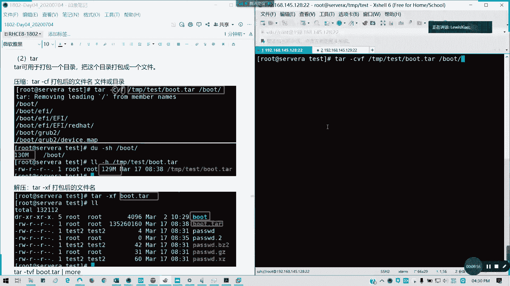
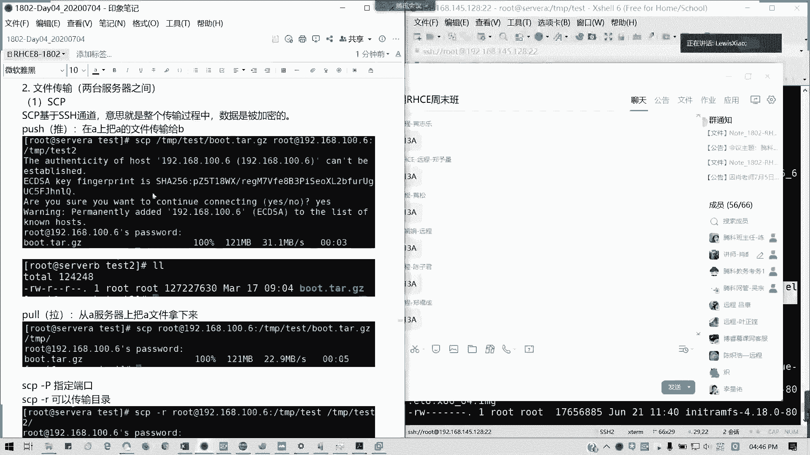
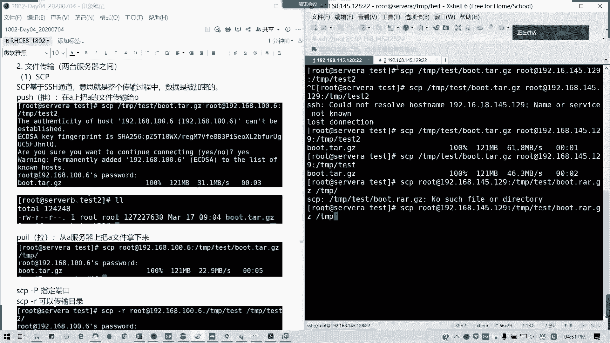
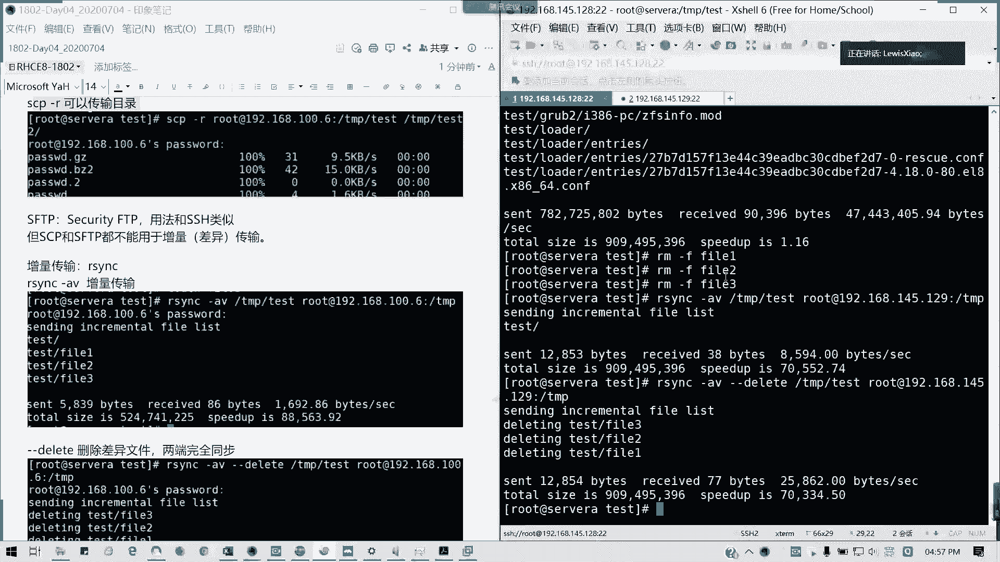
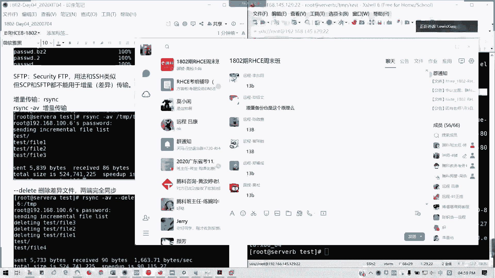

# Linux系统管理：第13章：文件归档与传输


在本章中，我们将学习Linux系统中两个非常实用的技能：文件归档（打包与压缩）和文件传输。你将掌握如何使用`tar`命令打包目录，并结合不同压缩格式减小文件体积，以及如何使用`scp`和`rsync`命令在服务器之间安全、高效地传输文件。

---

## 🗜️ 文件归档

上一节我们介绍了网络配置的多种方式，本节中我们来看看如何管理文件。Linux系统自带支持三种压缩格式：`gzip`、`bzip2`和`xz`。但需要注意的是，这些命令通常只能对单个文件进行压缩，无法直接压缩整个目录。

### 三种基本压缩命令

以下是三种基本压缩工具的使用方法：

1.  **gzip**
    *   压缩文件：`gzip 文件名`
    *   解压文件：`gunzip 文件名.gz`
    *   保留原文件进行压缩：`gzip -c 原文件 > 新文件.gz`

2.  **bzip2**
    *   压缩文件：`bzip2 文件名`
    *   解压文件：`bunzip2 文件名.bz2`
    *   保留原文件进行压缩：`bzip2 -k 文件名`

3.  **xz**
    *   压缩文件：`xz 文件名`
    *   解压文件：`unxz 文件名.xz`
    *   保留原文件进行压缩：`xz -k 文件名`



> **核心提示**：`xz`格式的压缩率最高，`gzip`最通用，`bzip2`介于两者之间。

### 使用 tar 进行归档

单独使用压缩命令无法处理目录，而 `tar` 命令可以将多个文件或目录打包成一个归档文件，并能结合上述压缩格式。

以下是 `tar` 命令的常用操作：

*   **创建归档（打包）**：`tar -cf 归档文件名.tar 要打包的文件或目录`
    *   `-c` 代表创建。
    *   `-f` 用于指定文件名，必须放在最后。
    *   `-v` 可选，用于显示详细过程。

*   **列出归档内容**：`tar -tf 归档文件名.tar`
    *   `-t` 代表列出内容。

*   **解压归档**：`tar -xf 归档文件名.tar`
    *   `-x` 代表解压。
    *   默认解压到当前目录。可使用 `-C` 指定目标目录：`tar -xf 归档文件名.tar -C /目标/路径`

*   **创建压缩归档**：`tar` 可以结合压缩选项，一步完成打包和压缩。
    *   使用 `gzip` 压缩：`tar -czf 归档文件名.tar.gz 源文件`
    *   使用 `bzip2` 压缩：`tar -cjf 归档文件名.tar.bz2 源文件`
    *   使用 `xz` 压缩：`tar -cJf 归档文件名.tar.xz 源文件`

*   **解压压缩归档**：`tar` 会自动识别压缩格式并解压。
    *   解压 `.tar.gz`：`tar -xzf 归档文件名.tar.gz`
    *   解压 `.tar.bz2`：`tar -xjf 归档文件名.tar.bz2`
    *   解压 `.tar.xz`：`tar -xJf 归档文件名.tar.xz`

*   **高级操作**：
    *   **排除特定文件**：使用 `--exclude` 参数。
        ```bash
        tar -czf backup.tar.gz --exclude=不需要的文件 要备份的目录
        ```
    *   **仅解压特定文件**：在命令末尾指定文件路径。
        ```bash
        tar -xzf 归档文件名.tar.gz --extract 归档内/的/具体文件路径
        ```

---

## 📤 文件传输

掌握了文件归档后，我们常常需要将文件在服务器之间移动。接下来我们学习两种基于SSH安全通道的文件传输工具。



### 使用 scp 传输文件

`scp`（secure copy）命令通过SSH协议加密传输文件，适用于一次性复制。

以下是 `scp` 命令的基本用法：

*   **推送文件到远程服务器（上传）**：
    ```bash
    scp /本地/文件路径 用户名@远程服务器IP:/远程/目录/路径
    ```
*   **从远程服务器拉取文件（下载）**：
    ```bash
    scp 用户名@远程服务器IP:/远程/文件路径 /本地/目录/路径
    ```
*   **常用选项**：
    *   `-P 端口号`：指定SSH端口（默认为22）。
    *   `-r`：递归复制整个目录。

### 使用 rsync 进行同步传输



`rsync` 命令更强大，它支持**增量传输**，即只传输发生变化的文件部分，效率更高，常用于备份和同步。

以下是 `rsync` 命令的基本用法：

*   **基本同步（将本地目录同步到远程）**：
    ```bash
    rsync -av /本地/目录/ 用户名@远程服务器IP:/远程/目录/
    ```
    *   `-a`：归档模式，保留文件属性。
    *   `-v`：显示详细过程。

*   **使两端完全一致（删除远程多余文件）**：
    ```bash
    rsync -av --delete /本地/目录/ 用户名@远程服务器IP:/远程/目录/
    ```
    *   `--delete`：删除目标目录中存在而源目录中不存在的文件。

> **核心概念**：`rsync` 通过比较文件和目录的修改时间、大小等属性，智能地仅传输差异部分，这对于大文件或频繁更新的同步任务非常高效。

---



## 📝 本章总结

本节课中我们一起学习了Linux下的文件归档与传输。
*   我们首先了解了 `gzip`、`bzip2`、`xz` 这三种基础压缩工具。
*   然后重点掌握了使用 `tar` 命令进行文件打包，以及如何结合不同压缩格式创建 `.tar.gz`、`.tar.bz2`、`.tar.xz` 归档文件。
*   最后，我们学习了通过 `scp` 命令在服务器间安全复制文件，以及使用更高效的 `rsync` 命令进行增量文件同步。



这些技能是系统管理、数据备份和迁移工作的基础，请务必熟练掌握。