# 红帽RHCE认证课程：第14章：软件包管理（第一部分）🎯

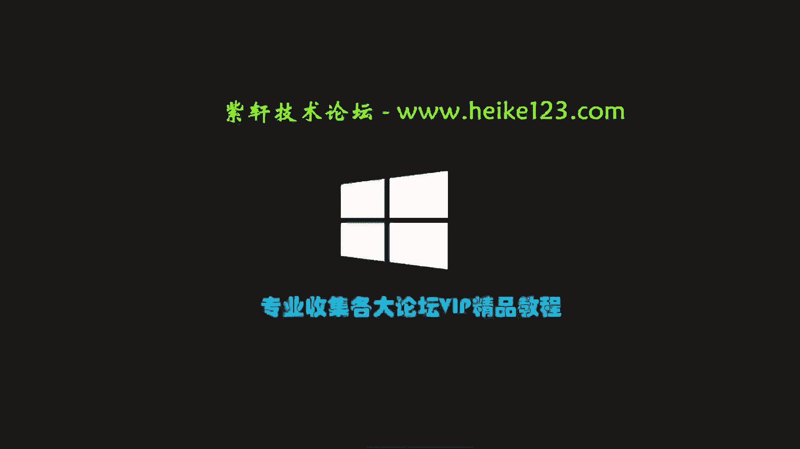

在本节课中，我们将要学习红帽系统中软件包管理的基础知识，包括如何获取、安装、查询和管理软件包。这是系统管理中最核心的技能之一。

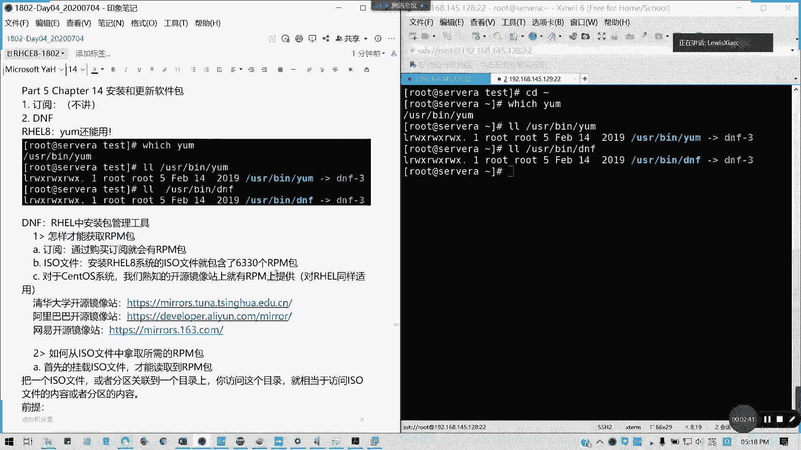

## 软件包管理概述

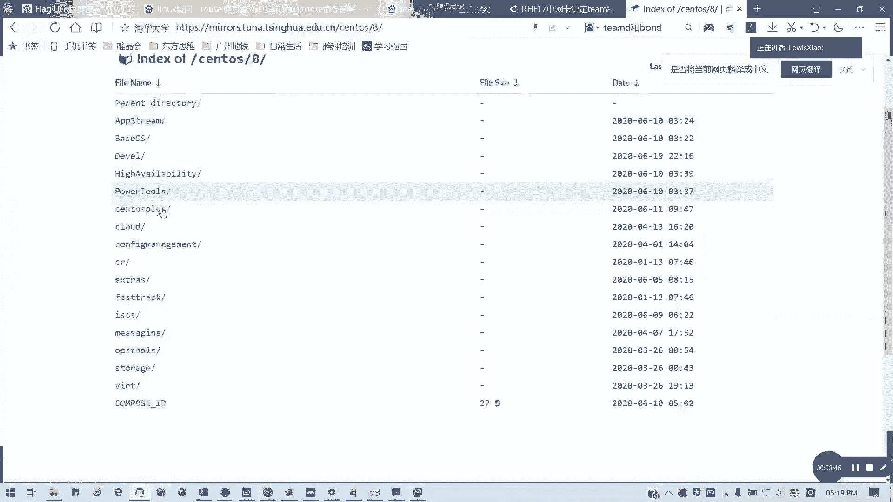

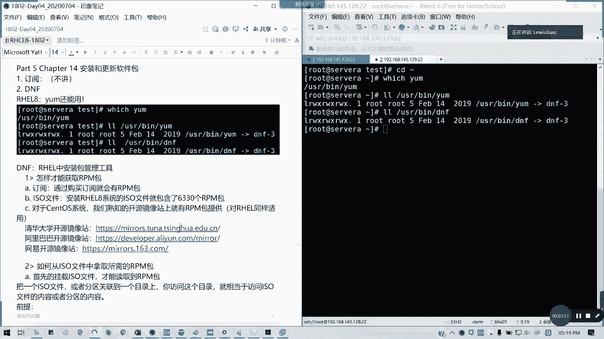

软件包管理是系统管理的基础工作。在红帽体系中，虽然考试不会专门针对软件包管理出题，但它是贯穿整个系统操作的核心技能。通过软件包，我们才能安装所需的工具和服务。

## 软件包的获取途径

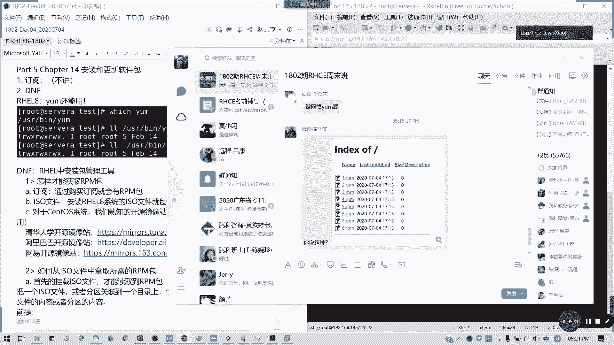

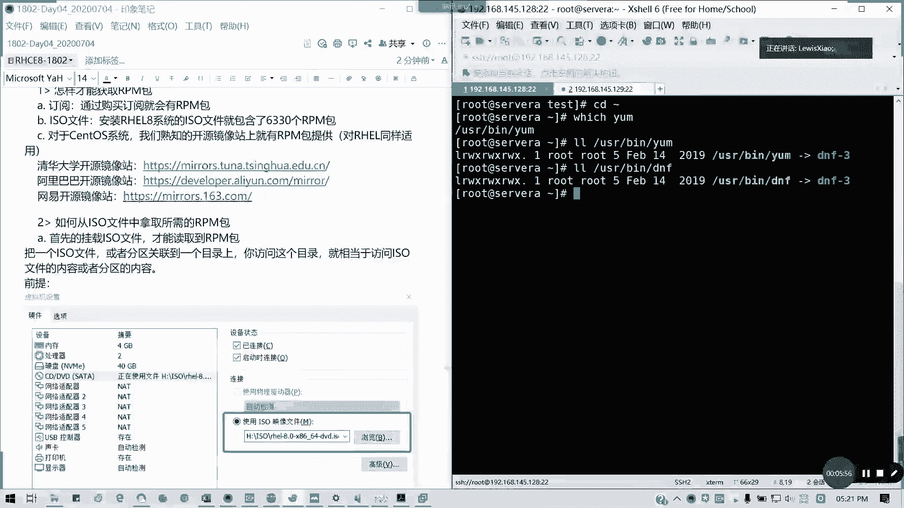

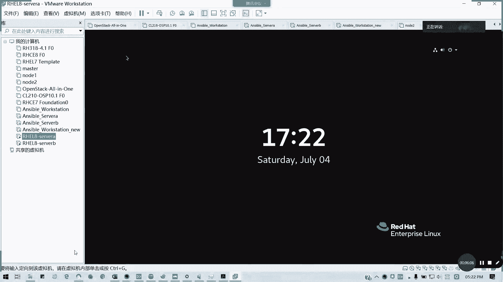

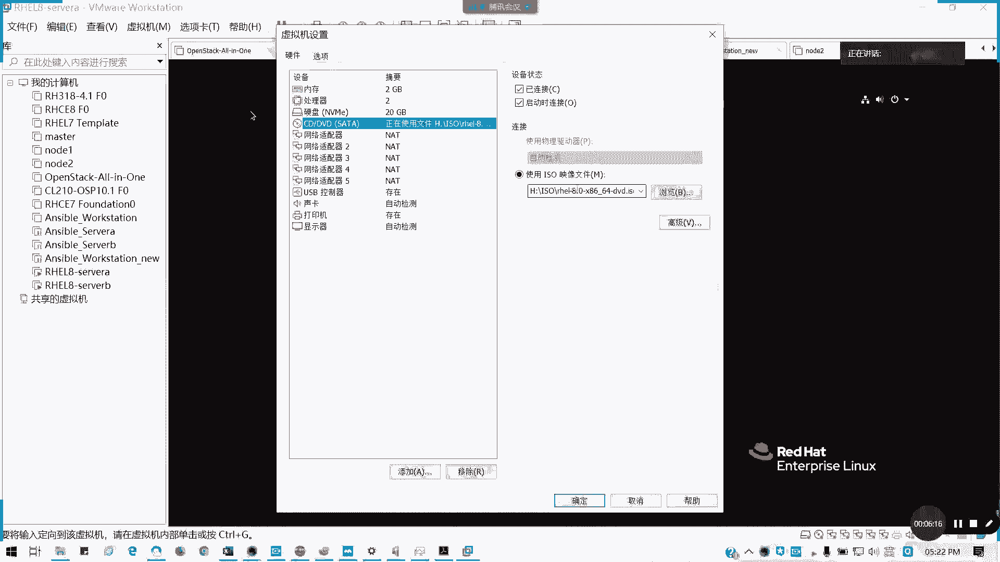

以下是获取RPM软件包的几种主要方式：

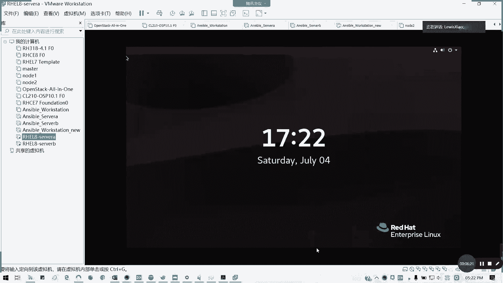

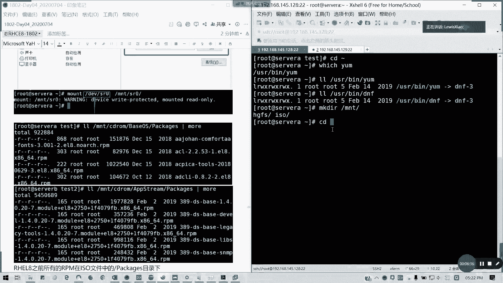

*   **购买订阅**：通过购买红帽官方订阅，可以访问其官方软件仓库。
*   **安装光盘/ISO文件**：红帽的安装镜像文件本身就包含了大量软件包。例如，RHEL 8.0的光盘包含约6000个包，而8.2版本则达到了约8200个。
*   **开源镜像站**：对于社区版系统（如CentOS），可以从国内外的开源镜像站获取软件包。常用的国内镜像站包括：
    *   清华大学开源镜像站
    *   阿里云开源镜像站
    *   网易开源镜像站

使用网络镜像站的前提是系统具备网络连接能力。

## 从本地ISO文件配置软件仓库

上一节我们介绍了获取软件包的多种途径，本节中我们来看看如何利用本地ISO文件创建一个免费的软件仓库。

首先，需要将ISO镜像文件挂载到系统目录。如果尚未挂载，可以使用以下命令：
```bash
mount /dev/sr0 /mnt
```
挂载后，可以在 `/mnt` 目录下看到 `BaseOS` 和 `AppStream` 两个目录，它们分别包含了系统基础包和应用程序包。

接下来，我们需要创建软件仓库配置文件。文件应放置在 `/etc/yum.repos.d/` 目录下，并以 `.repo` 结尾。

以下是一个配置示例，文件名为 `local.repo`：
```ini
[local-baseos]
name=Local BaseOS Repository
baseurl=file:///mnt/BaseOS
enabled=1
gpgcheck=0

[local-appstream]
name=Local AppStream Repository
baseurl=file:///mnt/AppStream
enabled=1
gpgcheck=0
```
**配置说明**：
*   `[local-baseos]`：配置块名称。
*   `name`：软件仓库的描述信息。
*   `baseurl`：软件仓库的路径。`file://` 表示使用本地文件协议，路径应指向包含 `Packages` 和 `repodata` 目录的上级目录。
*   `enabled=1`：启用此仓库（务必注意拼写，缺少 `d` 会导致仓库不生效）。
*   `gpgcheck=0`：跳过GPG完整性检查（如果未导入红帽公钥）。

配置文件创建后，需要清除旧缓存并建立新缓存以使仓库生效：
```bash
dnf clean all
dnf makecache
```
执行 `dnf repolist` 命令可以查看已配置的仓库列表。

## RPM软件包格式与基础管理

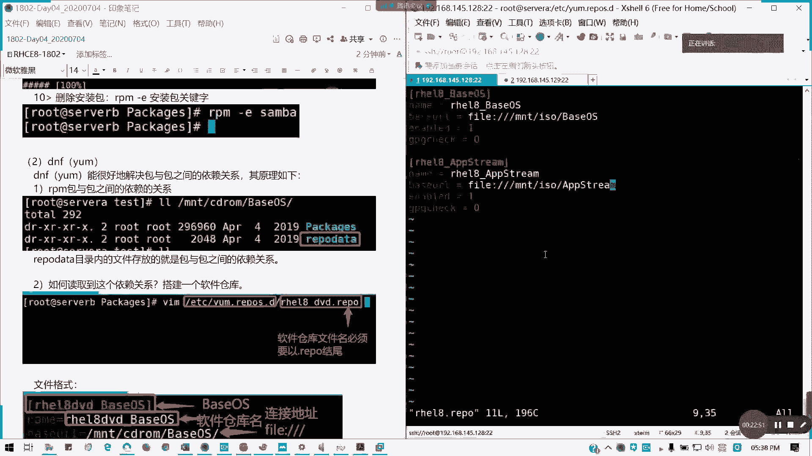

RPM是红帽软件包管理器，它是一个编译好的、可直接用于安装或更新的软件包文件。

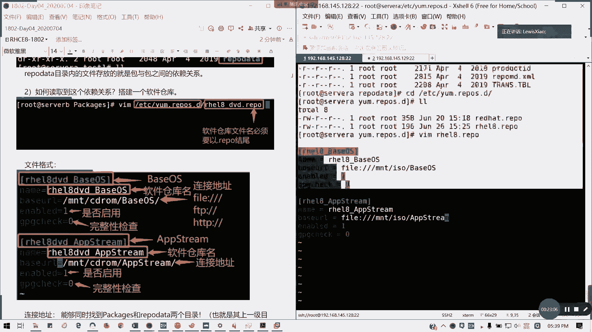

一个RPM包的文件名通常包含以下信息：
**`软件名-版本号-发行版本.系统架构.rpm`**
例如：`httpd-2.4.37-43.module+el8.5.0+1022+b541f3b1.x86_64.rpm`
*   `httpd`：软件名称。
*   `2.4.37-43`：软件版本号与修订号。
*   `module+el8.5.0+1022+b541f3b1`：适用于红帽企业版Linux 8的模块化构建标识。
*   `x86_64`：系统架构（64位）。
*   `.rpm`：文件扩展名，表明这是一个RPM包。

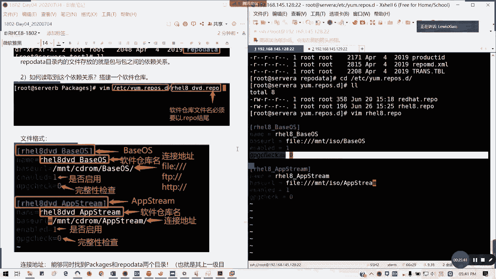

RPM工具可以管理单个软件包，但它**无法自动解决软件包之间的依赖关系**。以下是RPM的常用命令：

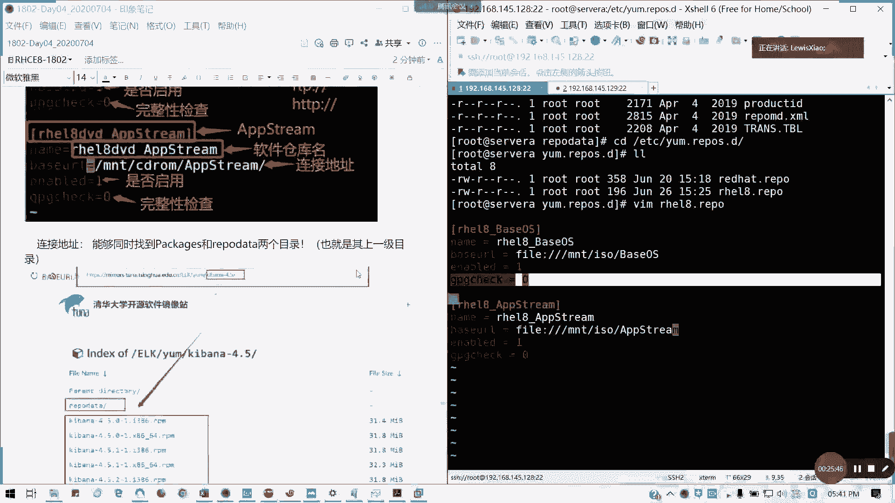

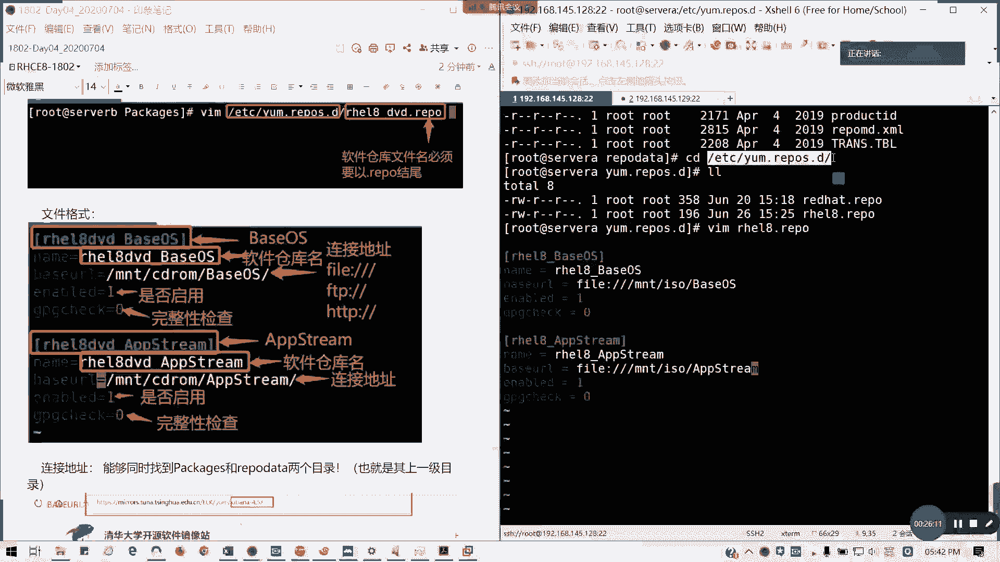

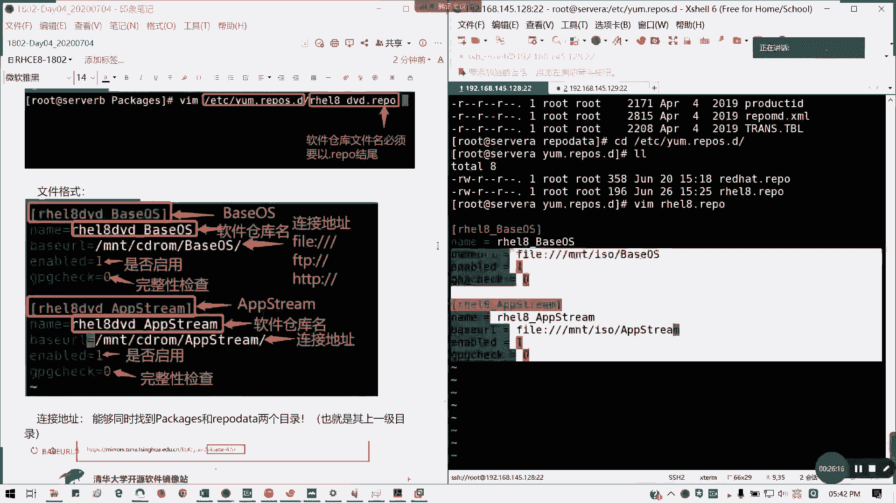

*   **安装软件包**：`rpm -ivh 包名.rpm`
*   **升级软件包**：`rpm -Uvh 包名.rpm`
*   **卸载软件包**：`rpm -e 包名`
*   **查询所有已安装的包**：`rpm -qa`
*   **查询指定包的安装文件列表**：`rpm -ql 包名`
*   **查询指定包的配置文件**：`rpm -qc 包名`
*   **查询指定包的文档**：`rpm -qd 包名`
*   **查询指定包的详细信息**：`rpm -qi 包名`
*   **查询某个文件由哪个包提供**：`rpm -qf /文件路径`
*   **导入红帽公钥（用于验证）**：`rpm --import /etc/pki/rpm-gpg/RPM-GPG-KEY-redhat-release`

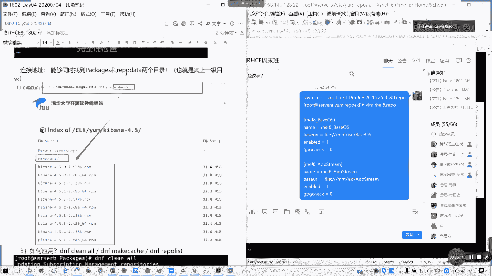

由于需要手动处理依赖，使用RPM安装复杂软件时较为繁琐。

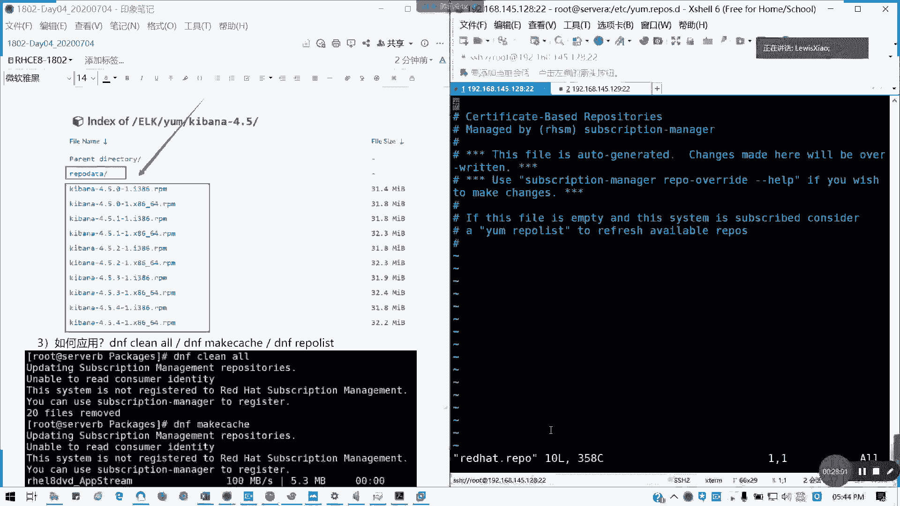

## DNF/YUM：高级包管理工具

为了解决RPM的依赖问题，红帽8使用DNF（或它的软链接YUM）作为默认的包管理工具。DNF能够自动解析并安装软件包所需的所有依赖。

以下是DNF的常用命令：

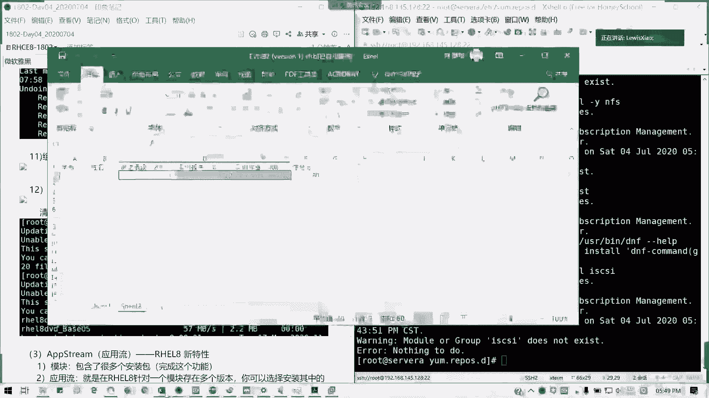

*   **安装软件包（自动解决依赖）**：`dnf install -y 包名`
*   **卸载软件包（及其依赖）**：`dnf remove -y 包名`
*   **更新所有软件包**：`dnf update -y`
*   **列出所有可用软件包**：`dnf list`
*   **搜索软件包**：`dnf search 关键词`
*   **查看软件包详细信息**：`dnf info 包名`
*   **查看某个文件由哪个包提供**：`dnf provides /文件路径`
*   **查看操作历史**：`dnf history`
*   **撤销历史操作（回滚）**：`dnf history undo 历史ID -y`
*   **安装软件包组**：`dnf groupinstall -y “组名”`

例如，安装一个软件及其所有依赖非常简单：
```bash
dnf install -y targetcli
```
DNF会自行处理所有依赖包的安装。

## 总结

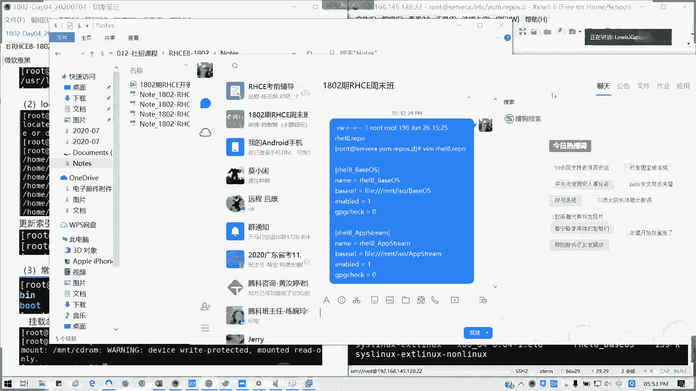

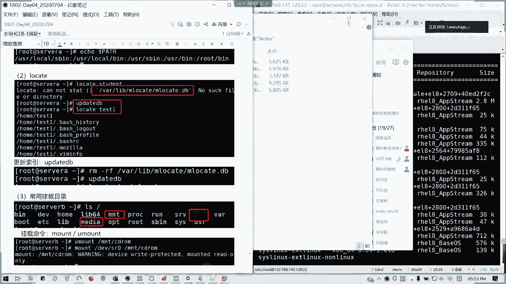

本节课中我们一起学习了红帽系统软件包管理的核心内容。我们首先了解了获取软件包的多种渠道，然后重点演练了如何配置本地ISO文件作为软件仓库。接着，我们分析了RPM包的文件格式，并学习了使用 `rpm` 命令进行基础的包查询、安装和卸载操作，同时也认识到其无法自动处理依赖的局限性。最后，我们掌握了更强大的 `dnf` 工具，它能够自动解决依赖关系，极大地简化了软件包的安装和管理流程。掌握这些工具是成为一名合格系统管理员的基础。