# 红帽RHCE认证课程：P26：Day05课程回顾


在本节课中，我们将回顾Day04课程的核心内容，主要包括日志管理、网络配置、文件归档与传输以及软件包管理的基础知识。我们将以简洁明了的方式梳理关键概念和操作步骤，确保初学者能够理解和掌握。

## 日志管理回顾

上一节我们介绍了系统日志的基本概念，本节中我们来看看具体的日志服务和管理命令。

系统日志主要由 `systemd-journald` 服务管理。默认情况下，日志存储在内存中（路径为 `/run/log/journal/`），并以二进制格式保存。若要永久存储日志，需要修改配置文件 `/etc/systemd/journald.conf`，将 `Storage` 设置为 `persistent`，然后重启 `systemd-journald` 服务。永久日志存储在 `/var/log/journal/` 目录下。

以下是查看日志的常用命令：

*   `journalctl -f`：实时跟踪日志末尾。
*   `journalctl -n [行数]`：查看指定行数的日志。
*   `journalctl --since [时间] --until [时间]`：查看特定时间段的日志。
*   `systemctl status [服务名]`：查看指定服务的状态和最近日志。

系统的重要日志文件还包括：

*   `/var/log/messages`：通用系统活动日志。
*   `/var/log/secure`：认证和安全相关日志。
*   `/var/log/boot.log`：系统启动日志。
*   `dmesg`：内核环形缓冲区日志，记录从开机到系统加载完毕的信息。

`rsyslog` 服务负责将 `journald` 的日志分类并持久化到 `/var/log/` 下的各个文本文件中。其配置文件为 `/etc/rsyslog.conf`，可以定义日志的设施（facility）、优先级（priority）和存储位置。

日志级别从0（紧急）到7（调试），数字越小优先级越高。需要重点关注的是0（紧急）、1（警报）和2（严重）级别的日志。

日志轮转（log rotation）由 `logrotate` 服务管理，默认规则是每周轮转一次，保留4个备份。轮转后，旧日志会添加日期后缀。

## 系统时间管理

系统时间管理涉及查看、设置时区以及配置时间同步。

使用 `timedatectl` 命令管理时间：
*   `timedatectl`：查看当前时间和时区。
*   `timedatectl set-timezone Asia/Shanghai`：设置时区为上海。
*   `timedatectl set-time “YYYY-MM-DD HH:MM:SS”`：设置本地时间（需先禁用NTP同步）。

配置时间同步（NTP）服务。在RHEL 8中，使用 `chronyd` 服务。编辑配置文件 `/etc/chrony.conf`，添加或修改时间服务器地址，例如：
```bash
server classroom.example.com iburst
```
然后重启 `chronyd` 服务。使用 `chronyc sources -v` 命令可以查看时间同步状态和源。

## 网络配置管理

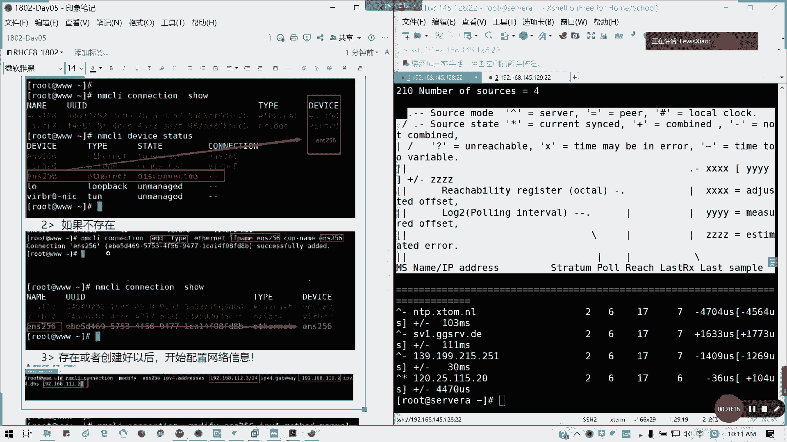

网络配置的核心是使用 `NetworkManager` 服务管理网络连接。

首先，确认网卡设备及其连接状态：
```bash
nmcli device status
```

如果网卡未激活或没有连接配置文件，可以创建连接。有两种方法：

1.  **使用 `nmcli` 命令精确创建**：
    ```bash
    nmcli connection add type ethernet con-name [连接名] ifname [设备名]
    ```
    此方法会生成一个与设备名同名的配置文件。

2.  **让 `NetworkManager` 自动生成**：
    ```bash
    nmcli device connect [设备名]
    ```
    此方法生成的连接名可能为 “Wired connection 1”，与设备名不一致。若需修改连接名以匹配设备名，可使用：
    ```bash
    nmcli connection modify [旧连接名] connection.id [新连接名/设备名]
    ```

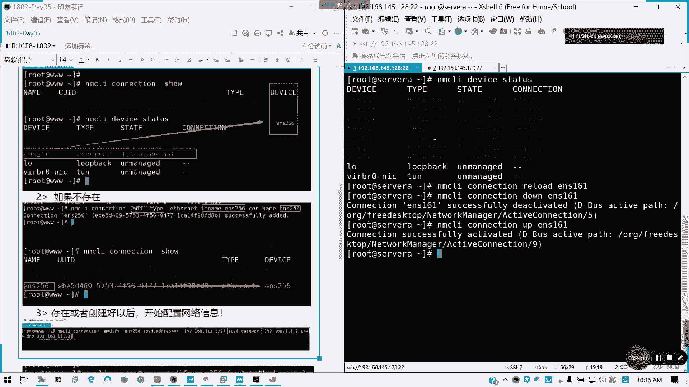

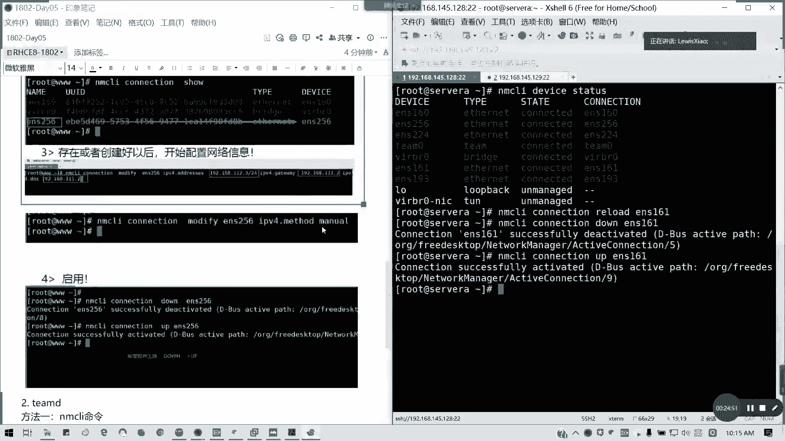

配置网络参数（IP地址、网关、DNS）也有两种主要方式：

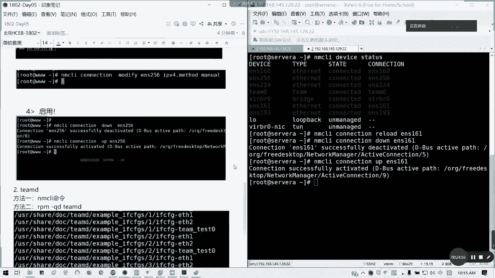

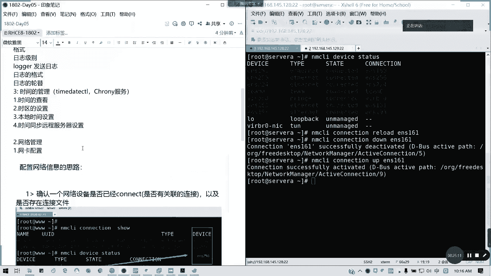

1.  **使用 `nmcli` 命令**：
    ```bash
    nmcli connection modify [连接名] ipv4.addresses [IP/掩码] ipv4.gateway [网关] ipv4.dns [DNS] ipv4.method manual
    nmcli connection up [连接名]
    ```
    关键是将 `ipv4.method` 设置为 `manual`（手动）。

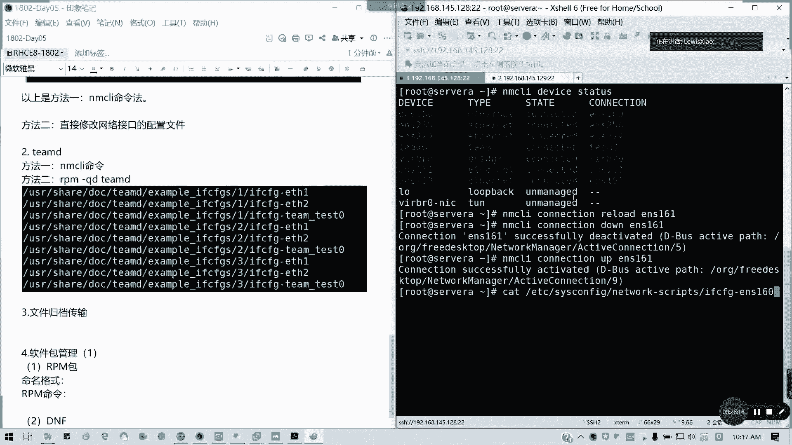

2.  **直接编辑配置文件（推荐）**：
    配置文件位于 `/etc/sysconfig/network-scripts/ifcfg-[连接名]`。
    以下是一个配置示例：
    ```bash
    TYPE=Ethernet
    BOOTPROTO=none
    DEFROUTE=yes
    NAME=ens256
    DEVICE=ens256
    ONBOOT=yes
    IPADDR=192.168.1.100
    PREFIX=24
    GATEWAY=192.168.1.1
    DNS1=8.8.8.8
    DNS2=8.8.4.4
    ```
    **重要提示**：务必仔细检查拼写，常见的拼写错误如 `IPADDR`、`PREFIX`、`GATEWAY` 会导致网络不通。

配置完成后，重启网络连接使其生效：
```bash
nmcli connection reload
nmcli connection down [连接名] && nmcli connection up [连接名]
```

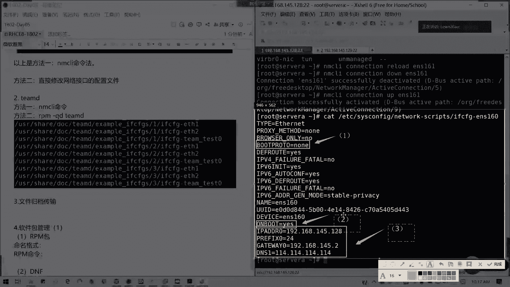

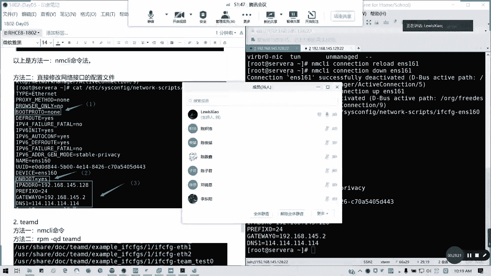

全局DNS配置还可以在 `/etc/resolv.conf` 文件中设置：
```bash
nameserver 8.8.8.8
```

## 文件归档与传输

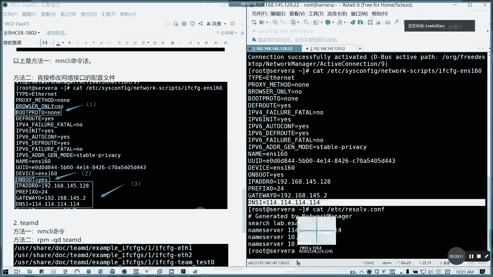

文件归档与压缩是日常管理中的常用操作。

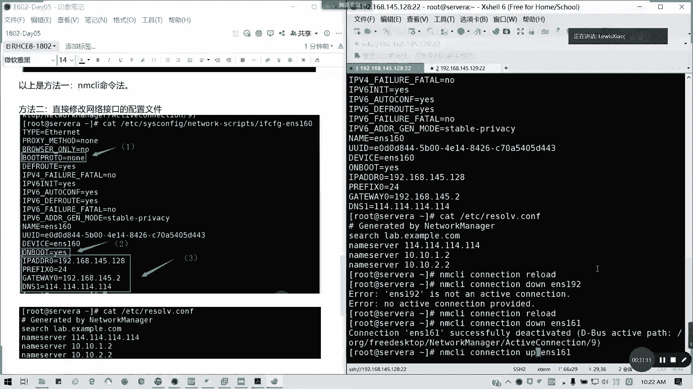

Linux中常见的三种压缩格式及对应参数：
*   **gzip**：压缩率高，使用广泛。对应 `tar` 命令的 `-z` 选项。
*   **bzip2**：压缩率比gzip高。对应 `tar` 命令的 `-j` 选项。
*   **xz**：压缩率最高。对应 `tar` 命令的 `-J` 选项。

`tar` 命令常用选项：
*   `-c`：创建归档文件。
*   `-x`：解压归档文件。
*   `-t`：列出归档内容。
*   `-v`：显示详细过程。
*   `-f`：指定归档文件名。
*   `-C`：解压到指定目录。

示例：将 `/home` 目录压缩为 `backup.tar.xz` 并解压到 `/tmp`：
```bash
tar -cJf backup.tar.xz /home
tar -xJf backup.tar.xz -C /tmp
```

文件传输命令：
*   `scp`：基于SSH的安全复制。
    ```bash
    scp file.txt user@remote_host:/path/
    ```
*   `rsync`：高效的文件同步和传输工具，支持增量备份。
    ```bash
    rsync -avz /local/dir/ user@remote_host:/remote/dir/
    ```

## 软件包管理基础

软件包管理是系统维护的核心技能。

**RPM包** 是基本的软件包格式。其命名规则为：`软件名-版本号-发布号.系统版本.架构.rpm`，例如 `bash-5.0.7-1.el8.x86_64.rpm`。

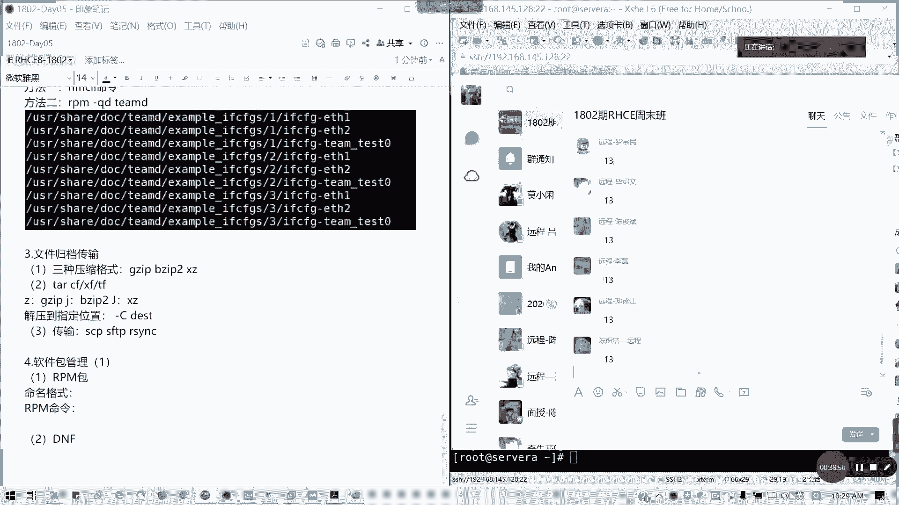

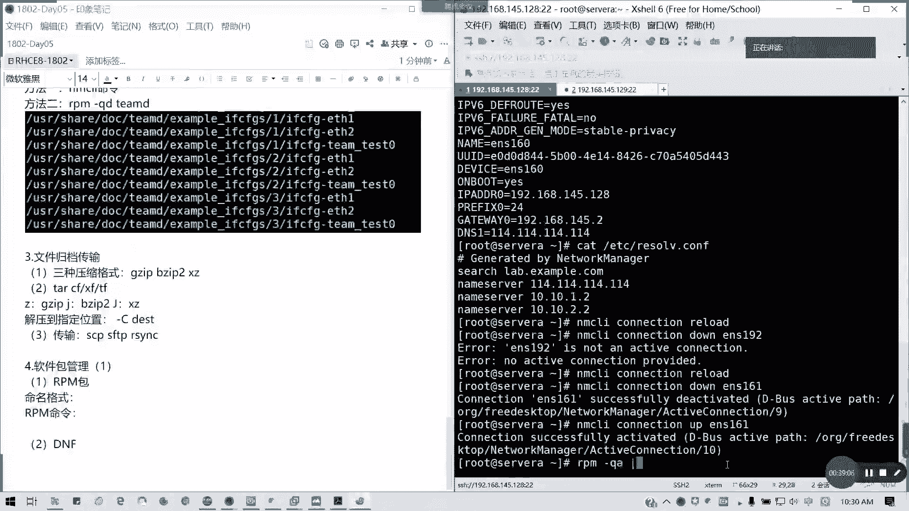

常用RPM命令：
*   `rpm -ivh package.rpm`：安装软件包。
*   `rpm -Uvh package.rpm`：升级软件包。
*   `rpm -qa`：查询所有已安装的包。
*   `rpm -qc package`：查询软件包的配置文件。
*   `rpm -qd package`：查询软件包的文档。
*   `rpm -qf /path/to/file`：查询文件属于哪个软件包。
*   `rpm -qi package`：查询软件包详细信息。

**DNF/YUM** 是高级包管理器，能自动解决依赖关系。在RHEL 8中，`yum` 是 `dnf` 的软链接。

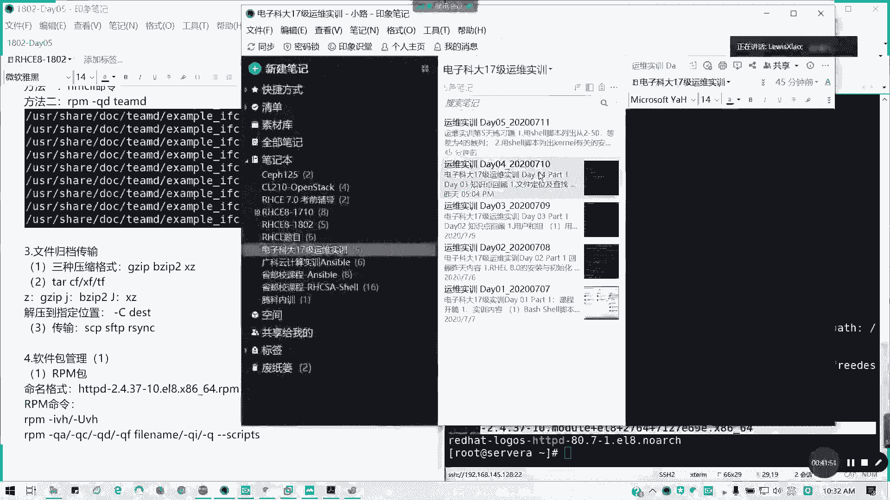

配置软件仓库（以本地ISO镜像为例）：
1.  挂载ISO镜像到 `/mnt`。
2.  在 `/etc/yum.repos.d/` 目录下创建 `.repo` 文件，例如 `local.repo`。
3.  编辑 `local.repo`，内容如下：
    ```bash
    [BaseOS]
    name=Local BaseOS
    baseurl=file:///mnt/BaseOS
    enabled=1
    gpgcheck=0

    [AppStream]
    name=Local AppStream
    baseurl=file:///mnt/AppStream
    enabled=1
    gpgcheck=0
    ```
    **注意**：RHEL 8的仓库分为 `BaseOS`（基础系统包）和 `AppStream`（应用流包），通常需要同时配置。`baseurl` 使用 `file://` 协议时，路径前需要三个斜杠。

常用DNF命令：
*   `dnf makecache`：创建元数据缓存。
*   `dnf repolist`：列出已配置的仓库。
*   `dnf install package`：安装软件包。
*   `dnf group install “Group Name”`：安装软件包组。
*   `dnf remove package`：移除软件包。
*   `dnf history`：查看事务历史。

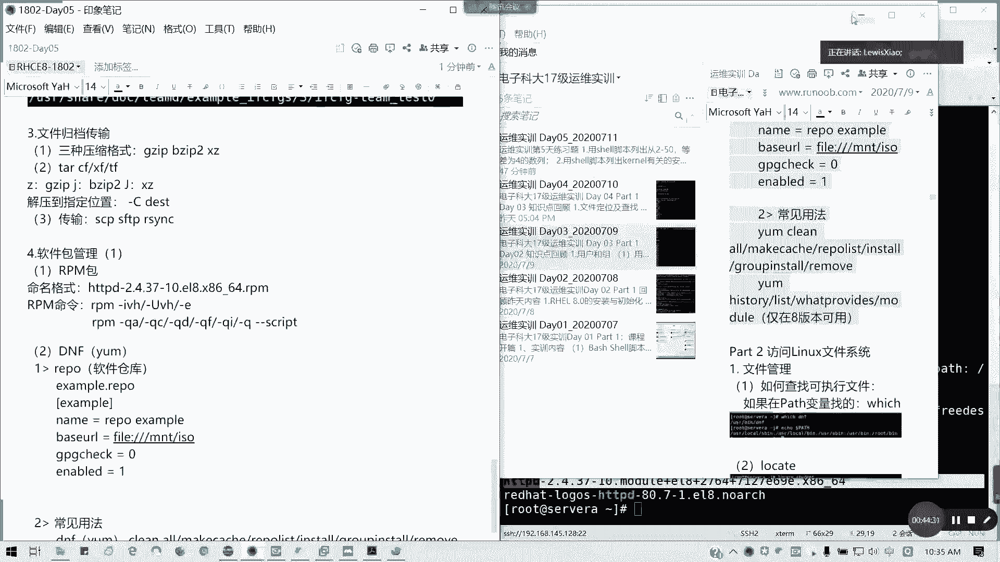

RHEL 8引入了 **模块化（Modules）** 概念，它属于 `AppStream` 仓库，为应用程序提供了多个可选的版本流（version streams），实现了更灵活的版本控制。管理模块的命令以 `dnf module` 开头。

---

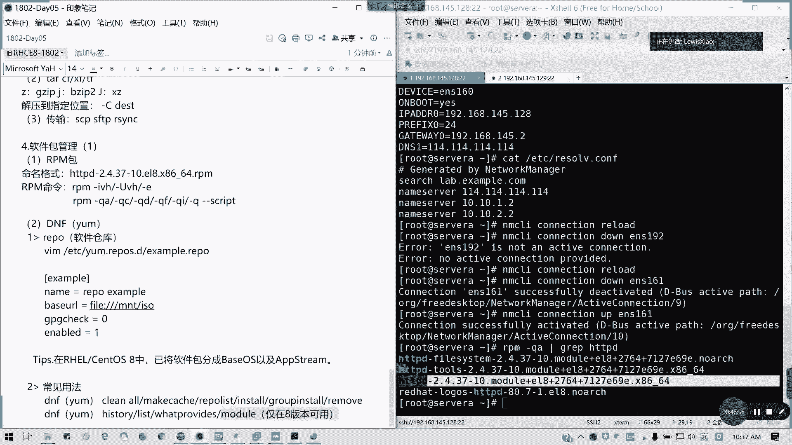

本节课中我们一起学习了日志管理、时间同步、网络配置、文件归档传输以及软件包管理的基础知识。这些是Linux系统管理员日常工作的核心技能，理解并熟练运用它们对于通过RHCE认证和实际工作都至关重要。请务必动手实践每个命令和配置步骤，加深理解。