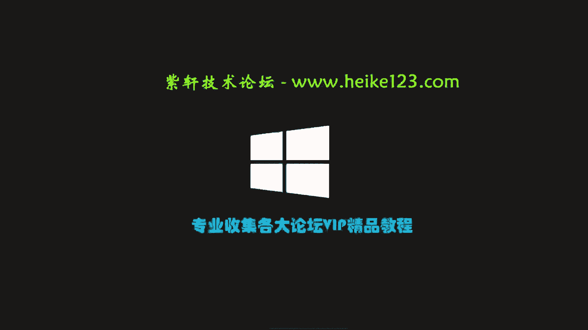
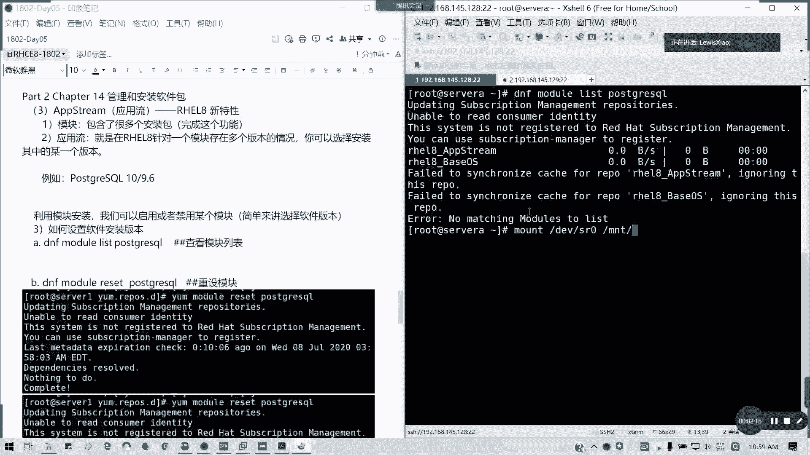
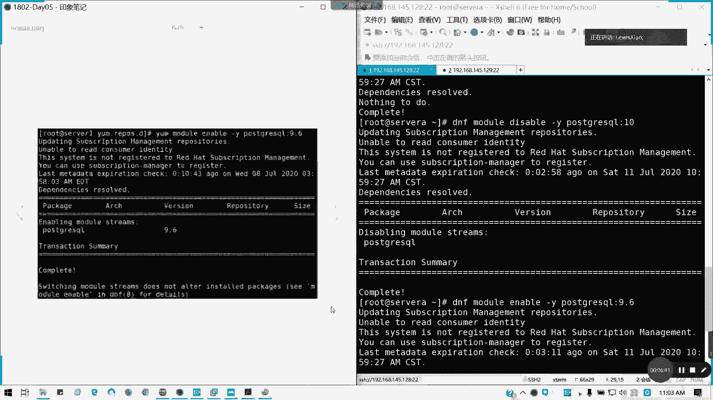
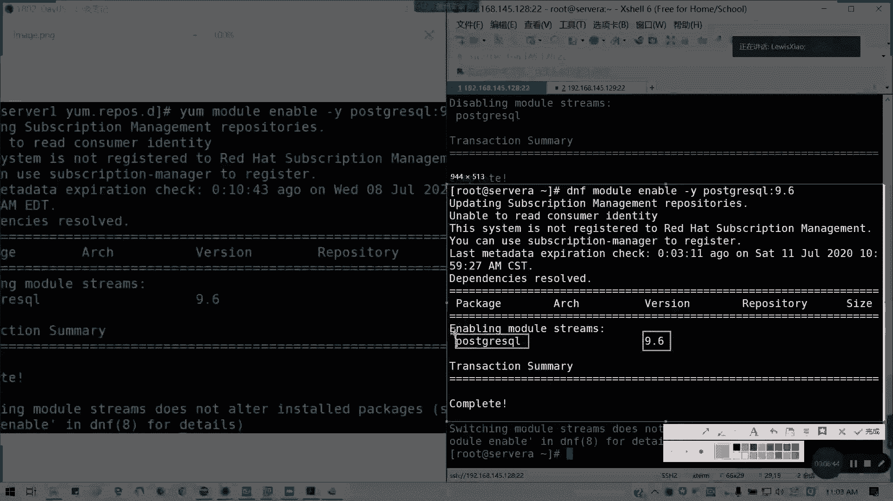
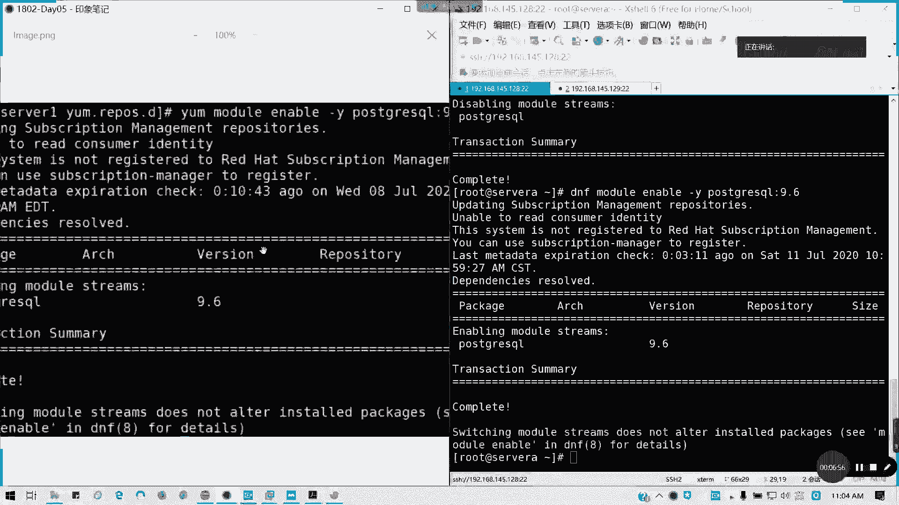

# 拿下证书！Redhat红帽 RHCE8.0认证体系课程：P27：软件包管理2 - 模块化安装



## 概述
在本节课中，我们将学习 Red Hat Enterprise Linux 8 引入的一个新特性：模块化安装与应用流。这个特性允许我们为同一个软件包选择并安装特定的版本，这在处理软件兼容性问题时非常有用。

上一节我们介绍了基础的软件包管理，本节中我们来看看如何通过模块化安装来管理软件版本。

---

## 什么是应用流与模块化安装？
应用流是 Red Hat Enterprise Linux 8 中的一个概念。它针对一个软件模块存在多个版本的情况，允许用户选择安装其中的某一个特定版本。

这主要解决了软件版本兼容性问题。系统默认可能安装高版本软件，但某些应用环境可能需要特定的低版本。通过 `DNF` 的 `module` 模块，我们可以管理这些“应用流”，从而选择所需的软件版本。



简单理解，模块化安装的核心目的是**方便用户选择软件版本**。

---

## 查看可用应用流
要使用模块化安装，首先需要查看某个软件有哪些可用的应用流（即版本）。

以下是查看 `postgresql`（PostgreSQL数据库）可用应用流的命令：
```bash
dnf module list postgresql
```
执行该命令后，输出会显示类似以下内容：
```
postgresql           9.6      [d]     common     PostgreSQL server and client module
postgresql           10       [d]     common     PostgreSQL server and client module
```
*   `postgresql` 是软件名。
*   `9.6` 和 `10` 是**应用流**，即不同的版本。
*   `[d]` 表示该版本是**默认安装**的版本。

从输出可知，`postgresql` 模块提供了 9.6 和 10 两个版本的应用流，并且默认会安装 10 版本。

---

## 切换应用流版本
如果我们希望安装 `postgresql` 的 9.6 版本，而不是默认的 10 版本，需要执行以下步骤。



### 第一步：重置模块
在更改设置前，建议先重置该模块的配置，使其恢复到初始状态。
```bash
dnf module reset postgresql -y
```
如果之前修改过版本，此命令会将其重置。如果已是默认状态，则无需执行此操作。





### 第二步：禁用默认应用流
我们需要先禁用当前默认的应用流（10版本）。
```bash
dnf module disable postgresql:10 -y
```
**注意**：命令格式为 `模块名:应用流`（即 `软件名:版本号`）。

### 第三步：启用目标应用流
接下来，启用我们想要安装的版本（9.6版本）。
```bash
dnf module enable postgresql:9.6 -y
```
执行后，可以再次使用 `dnf module list postgresql` 命令验证。你会看到 9.6 版本旁边标记可能变为 `[e]`（enabled，已启用），而 10 版本的 `[d]`（default，默认）标记可能消失。

---

## 通过模块安装软件
启用目标应用流后，就不能使用普通的 `dnf install` 命令来安装软件了，必须使用模块安装命令。

以下是安装 `postgresql` 的命令：
```bash
dnf module install postgresql -y
```
现在，系统将安装 `postgresql` 的 9.6 版本及其所有依赖（如 `postgresql-server`），而不会安装默认的 10 版本。

---

## 操作步骤总结
本节课我们一起学习了模块化安装的完整流程。以下是切换并安装特定软件版本的核心步骤：

1.  **列出可用版本**：使用 `dnf module list <软件名>` 查看所有应用流。
2.  **重置模块（可选）**：使用 `dnf module reset <软件名> -y` 恢复默认设置。
3.  **禁用当前版本**：使用 `dnf module disable <软件名:版本> -y` 禁用不需要的版本。
4.  **启用目标版本**：使用 `dnf module enable <软件名:版本> -y` 启用需要的版本。
5.  **执行模块安装**：使用 `dnf module install <软件名> -y` 安装指定版本的软件。

---

## 总结
本节课中，我们一起学习了 Red Hat Enterprise Linux 8 的模块化安装与应用流管理。这个特性让我们能够灵活选择软件版本，以更好地满足企业环境中对特定版本兼容性的需求。这与 RHEL 7 及更早版本中的传统软件包管理方式有显著区别。

接下来，我们将进入第15章，学习文件的查找与定位。