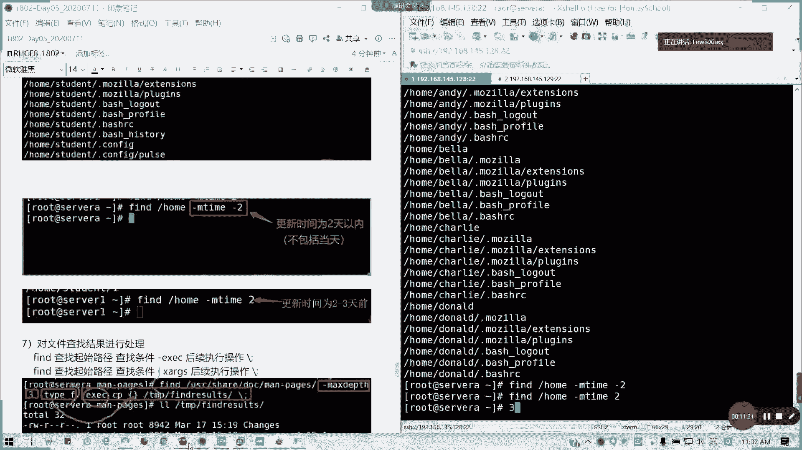

# 拿下证书！Redhat红帽 RHCE8.0认证体系课程 RH124+RH134+RH294三门认证视频教程 - P28：28_Video_Day05_RH124_Ch15_Ch16 - 16688888 - BV1734y117vT

要不我们先讲15章吧，15十6章我们先结束，然后待家待会大家有时间给大家练习，好吧，上午我们就把CSA部分讲完，然后下午我们把shall啊开始讲会讲估计一天半。一天半时间可能会比较比较多哈。

一一天到一天半左右时间。我们先看文件管理。文件管理的话，我们先讲文件的定位啊，定位的话我们现在。通常来说，如果是pass变量早的话，我们通过whichch命令是吧？比如说我们DNF是吧？

which命令它可以通过我们pass变量。就在这我们定义的可执行文件路径里面找，对吧？如果没有的话。

如果没有的话，他他就找不，他其实找不到，对不对？这个你理解吧，可执行文件。它当然我们windows里面也有一个pass变量，也有的。然后呢，如果要定位其他的。文件啊。

比如说我这里看有没有一个叫 student啊，locate。一开始我们有loccate也可以做普通文件定位。但是一开始你要建立一个索引。他如果你没有这索引的话。

他说他会说这个amlo这个D点DB这个数据，所引数据库不存在对吧？那我们要执行一个update DB。很快的啊更新索有完毕，那我们就可以locate出来了，对不对？把所有相涉及跟我们关机的相关的。

文件文我们的文件名或是我们的具体的目录等等列出来。对吧所以这才upd DB呢，我们相当于是建了一个索引。

它的索引是存在这个数据库下面的。这这种叫索引查找。

把这个图换了啊。然后我们要强制更新索引的话，我们就要把这个文件删掉，然后再重新下对DB就可以了。懂我意思吧？这种的话就是查我们如何定位普通文件。

这是第二个。第三个我们常用的挂载目录是吧？常用挂载目录有几个像NT专门用来挂载的。TMP里面的目录，还有一个就是media啊，通常我们是挂在就挂MNT里面，然后有帽跟啊帽应该就知道吧。

帽跟啊跟U帽都应该知道怎么用了吧。都知道吧，mo子后面跟我们的。设备。空格跟挂在点。好吧。然后有帽子就直接登我们挂来点就行了。然后如果要永久写永久写我们的那个就是说开机挂载的话，我们就要写这个文件。

但这个文件呢我们会在下一本书讲磁盘的时候，我会讲到这个。下本书讲磁牌之后，会讲。就第二本书我们讲磁盘的通，我讲到这个东西，懂吧。

哦。那接下来我们讲一下这些上面我们简单就过了哈，大家过了，大家理解都行。然后呢接下来我们讲讲一下fin有条件查找。这个在CSA貌似有一题啊，貌似有一题，7。0是肯定有的，8。0应该是会有。呃。

有条件的查找啊有件的查找什么作用呢？fi它是会根据我们设置的条件，从定义的路径里面查找符合要求的文件和目录。然后我这里我给出了一个链接，给出一个链接呢。它是一个啊CN block里面写。

写了一个f命令详解，他这个其实写的很详细的。但我这里我只介介绍他的一个。

基本的用法啊基本用法。基本用法呢在这里fin，然后查找的后面跟的是查找的起始路径。比如说你根挂在点，就是一一个根分区，对不对？当前的工作目录，比如说我的那个后root工作目录就是杠root，对不对？

然后后面查找条件，比如说你的你要查找是文件目录，还是说你的属组是谁谁谁的，就定义我们的查找条件在这里，然后后面我可以跟EXEC或者是用管道叉IGS来执行后续操作，后续操作，后面要加一个斜杠百分号啊。

斜斜杠分号。

我们先接下来看一下例子啊，比如说我看一下这里有没有一个叫t2的用户。有啊，那我们可以查找这个属于我们的拥有者为test two的文件。test2的文件就在ho部下我们查找。后面跟杠USU是，然后K2。

对不对？他会他是不是把当前t test二维数所组的文件及目录列了出来？对吧。有当我们也可以以文件大小作为。搜索条件。比如说我搜一下bot目录。文文件大小等于2M的。

如果后面没带加减的话，就是等于啊就是固定的2M。然后呢，大于2M的列出来，小于2M的列出来。对吧。这是大小的一个查找方法，文件大小杠size。

还有就是我们以文件或目录名为关键字条件啊，fin的。我们ETC复制下，我要找一个叫FS tab的文件杠name。对吧。可以理解吗？杠name查找文件或目录名为关键字的。然后呢，还有就是我们以权限。

来查两种方法，一种是记号法，一种是那个数字法。比如数字法，我我放一后目录下面就所有。644权限，也就是也就是我们的那个所有者是读写，然后其他组跟那个其他人都是只读的那我们就是吧。

杠碰后面644它就列出来，对不对？或者是说我直接用斜杠用记号法来。就是我用户跟主合写的。懂我意思吧？

然后还有我们的查找类型，就是查找类型文件或或者是目录杠type。

文件目录或者是什么快设备啊等等这些typeF就是文件。第一是目录对吧？第一呢这些就就我们的我前面其实就是我们的。长串输出前面的一个文件类型，只不过横杠换成了一个F，对吧？这是一个。

以时间为条件，时间为条件，这个要注意一下啊。通常我们用state。我们可以看到我们的那个。我们文件的详细属性，然后下面的话会有三个时间，对吧？三个时间分别是asses。

那 this time modify time跟chanrench time，我们看到左边啊。Ascess time简称a time这个参数，它是最近一次访问时间。就比如说你打开这个文件，对吧？

我打开这个文件。我定位到这个文件，那它的时间会发生改变。然后M time呢是最近一次更新的时间。也比如说我修改的。他的所有者，他的权限是不是对已经被文件进行一个更新了，对不对？

所以他这个M time呢就是等于这样。然后还有一个叫change time，最近一次修改时间，真我们所说的是文件内容。当然如果你文件内容改了，你的那个M time也改了，对不对？两两者基本上同步。

但如果你只改权限的话，它的C time是跟它的C time是保留原来内容。但是如果你改了文本内容，它的文件同步，因为它的大小已经变了。对吧它大小已经变了。

所以他所以他的那个M time跟C time是会一定更一定会更新的。然后呢，我们这里。比如说我的这个。创不录像，我要找。我M time加2什么意思呢？就跟它的更新时间是两天以前。加2是两天以前。

两天以前更新的啊，这个加二不是两就不包含这两天，我们是大于2了啊。然后呢，如果是M态减二，就是两天以以内。啊。不包含两天。懂懂我意思吗？两天以内减2。然后如果是二的话，就是2到3天。

就他的他是在这个范围内，而不是说绝对值两天啊，就以这个。所以这个要理这个要注意一下啊，这个地方注意一下我们的M，我们查找条件，它是有一个范围值的。这样我们的二的话就等于。我们一个数学的一个逻辑，对不对？

2到3都是开的。好吧，然后两天以前呢，通常都是3，就是第三天到到到更前的时间。然后那个如果是减二的话，就是。最小0到2对不对？因为我们的那个修改日期不可能复现，当然有可能出现未来的，如果你时间错乱的话。

对吧？那就可觉就是负到负数到2，对不对？两天以内嘛。

所以这个的话是时间的一个查找。我看大家有什么问题没有啊。

え一ら。M time主要是它的更新，也就是比如它的那个比如说我大小改变了，我的属族改变了，我权限改变了。那这一个是属于M time管的范围。C time呢主要是针对文件内容。比如说我去编辑一个文件。

我加了加了一一串字，然后我保存之后。C它是变了，那C它变了，因为它的大小也变了，所以M time也变了。懂我意思了吗？这个就理解了吧。我这里专门括号就是它的到底是更新跟修改，到底修改什么东西。

懂了懂了吧？治完黄字啊，访问时间不用说了吧，只要你访问过他的时间就改了。然后burs的话，这个文件的创建时间，通常说这个如果是系统创建，它会一个横杠。如果是自己创建的话，它会有约一个时间。

明白了。有问题及时提啊，不要留到最后。然后呢，对查找结果进行处理，后面加ESEC是吧？s。后面的后续操作，其实也就是把前面的输出变成后面的输入。通常来说，我们来来干嘛呢？把查找结果保存复制重定向。

比如说我这里啊，我就找一个我们这些文件多的，就找一个目录啊，比如说我创建一个。MKDNR我们叫做那个TMP里面的。Find the result。reults啊，我们放击这个目录。

然后我要查找我的文档USR share里面的dooc里面的一个man page。然后max step这个参数什么意思呢？就是从我当前的目录开始。我的查找深度是多少？比如说我这里的三。

那就是从它以下三个目以下三级目录，它不会到第四级，懂我意思吗？指定的长小深度。然后呢，我的我需要的文件类型是我的类型是文件，对吧？然后杠ESEC我要执行怎么操作呢？CP把大括号括起来。

括起来的意思就扩扩上里面的查找结果。就我们在前面的查找结果就引到这个括号里面来，懂我意思吗？我复制这些文件，然后到TMP里面的。放一点伪造，然后反斜杠分号结束。那我们看一下我们的TMP result。

看一下什么里面什么东西。这不是我们复制的结果吗？复制的中文件吗？对不对？或者把这个混成一个叉ARGS两者的效果等同，只不过它传输方式一个是直接直接调用，一个是用管道传输管道啊。这两这两个的话，我看一下。

Direory啊。这里好像不不太好啊，我们通常用ESEC为主啊。通常ESEC就不会报错，这叉IGS有时候他你要注意一下参数。通常我们是用杠ESEC的。懂吧，把查找的结果，其实我们可以验证一下，把E去掉。

就找到这么多文件，然后把它复制过来。懂我意思吧？这个我们在考试会有一道题，就类似这样，我查找一堆需要的文件，然后我要把它复制到，对吧？或者重新下到一个文本里面。就就把你的结果你从印象出来。

或是把文件查复制过来，懂我意思吗？这个就是第15章的所有内容。因为前面他讲文件系统的时候，我们在第二章第三章从命令行管理文件的时候，我们已经全部讲过，所以这里不再重复啊不再重复。如果明白的。

请打1五有问题，请提问。明白的，远程同学请现场同学明白了，请举手。一个2个、3个明白吗？明白吗？这这章的内容15章。有问题可以问。m step是查找的成绩，就从我当前查找的目录开始，从其的位置开始。

左下面多少级目录，三级目录。但第四集如果你还有文件夹，他就不会再找了。对，这个的话，my staff我们在企业里面查找是有用的对吧？就是写价很。呃，有些命令都用得到。

如果我们我这里给了一个别人写的一个命例讲解，对吧？这里就有可以参考。但我们课堂上因为时间关系我不可能讲太多。在这里都有啊。这是好像是一个那个台湾那边的1个IT人士写的。

所以的话他有些语言上是用那个那就说。台就台湾的中文啊，台湾中文表达一些可能那个用词不太一样啊，这部分没有问题的，群上请打15，有问题请提问。我们有些里面有些内容是在第三章已经讲过了。

所以的话我就不再重复。看书的话，它章节的这么厚，但是我就把它提炼出来。有些没讲的，我们就把它补充一下。那我们接下来16章我们就合并成一个视频了。16章其实就是一个。什么获取支持，这个获取帮助。

这个是要收费的订阅好吧，订阅这个我不讲，主要讲分析服务器，这个就是一个这是一个小白才小白他们用的小白用的就是一个图。我们的一个红帽服务器的一个图形化界面的管理啊，一个网页界面管理叫cookpe啊。

cookpe的话，我们在如果是默认安装我们的设位GUI的话，他已经做一个套件安装了。在7点几的版本已经有开始有这个功能，就在7点在7以后啊，是有个co的功能。然后我们通常说。system可我们启用啊。

通常说我们默认它是没启用的。这个这个这个那个啊我们的网页版的服务器管理，它默认是没启用的。enableable，然后我们这里的话为什么加个n呢？就既是star，又是enable。在7。

0的话是要分拆成两条命令。在8。0的话，既要star又要en的话，其实其实我们直接。把这个enable杠杠闹就可以了。System的样 enable。🎼nour conflictfi，我看一下。

它是一个socking文件啊。它是一个套接制，懂吧？套接是用于连接的。然后呢，我们在这里呢为了给外部访问，我们就加一个防火墙。防火墙我们再下一本书一讲。防火墙这里我们放通一个服务叫cookpe。

我们这里已经他们默认已经启用了，对不对？那我们就不需，我们这这也是要我们这里的话修改的配置文件还是要捋露一下。reload一下呢，我们这里呃我们之后呢，它的默认端口是9090。

那我们就个可以通过我们的浏览器，我们的那个我我们我们打开一个google吧。不用RE啊。我的goo狗浏览器。

对吧9090。这里你就可以打开我们的一个管理界面是吧？管理界面，然后呢，我们输入我们的那它这里其实我们的服务器是serverA，当然我们也可以连接到其他机器啊，对吧？只要有启用gope。

我都可以就其他机器有启用cope，我也可以连接到其他的机器啊，那服务器这里我们只连到servA，那我们就输入我们的管理员的用户名密码回车。

是吧是进入了我们的一个网页版的一个管理界面，对不对？懂吧？它里面可以看到我们的一个现在系统运行的一个状态，包括CPU内存加换空间IO硬盘IO值以及网络流量，就相当于我们服务器的1个IIIBMC是吧？

我们的IPMI对不对？带外管理。然后这里的话我可以对电源进行重启关机等关机等等。然后还有就是说嘉裕它的性能配置级也可以也可以修改。然后它的日志对不对？他的日志会列出来，然后他会有级别可以给你选的，懂吧？

这种很适合于小白型。就但是对我们这种学过的话，基本上都有命令的，很少比较少人用这些然后帮我们存储，甚至我们连分区都可以在这里做。懂我意思吧？我们连分区这些都可以。他帮我们做ra软锐的。

LVMVDOVDO我们在这是红帽八的新特性。在我们在下本书会讲icecar对不对？在7。0会讲的就是有们一个作为一个远程存储一个目标，也可以在这里设置。网络我们的网络配置是吧，我们端口可以添加绑。

这里可以直接添加绑定做bond对吧？或者做team都可以。然后还有就是我们的主网桥V。其实功能还是算比较强大的。现在的cocope。

哎，我们账户是不是可以可以创建是吧？创建新账户。

但这里创建的话，它是一个。普通用户，因为露子是管理员，对不对？在我们的服务。它可以列出来到底是激活的还是怎么样，就相当于我们的windows的那个服务管理，对不对？走吧。像这里的话。

信用服务还有它的目标。套接字计时器路径，这些都有订阅的话是要收钱的啊。没有我们还没有注，我们这里是有没有注册啊。内核转储K以dumper，还有软件更新。转移更新也是要钱的啊。

然后这里是我们的tminal界面，对吧？命令提示符。

那也就可以在这里直接操操作。然后还有我们的诊断创建报表，还有我们的SCD就是。所以这这功能呢其实就对于我们小就对于一些小白的管理员用户来说是特别有用，功能也是比较强大。但是通常说我们学既然来学这个认证。

那我们是以这学命令函的一个键盘，就linux一个键盘侠，那基本上都是命令为主，懂吧？所以这一个呢就做我们可以理解一个作为一个辅助工具，考试是不会让你用这个东西的，基本上也不会让你用啊，你用你点到来。

你你是用鼠标点到来，我已经全部做完了，对吧？真的就是就有时候你这点点点点鼠标点点点啊，我不会抄几条命令搞定了，对不对？除了我们红帽就318会经常用到。图形界面之外，就我们的黄帽集群会用到图形界面之外。

其他的基本上我们那命令可以一次性搞定的。所以的话我这里的话就简单讲了我们的cook pit啊。我就简单讲我们coook这张我们就到这里啊到这里。

有呃有疑问的请提问，没疑问，请打16。我们还有一点时间，待会我们给炫友开个头。稍微休息10分钟，我们是我们现在可以点，可以那个如果要订外卖，这些可以先点。然后呢，12点。05分我们为shall开个头。

