# 红帽RHCE认证体系课程：RH124：第15-16章 - 文件管理与获取支持


## 概述
在本节课中，我们将学习RH124课程的第15章和第16章内容。第15章主要讲解如何在Linux系统中定位和管理文件，特别是使用功能强大的`find`命令进行条件查找。第16章则介绍红帽企业Linux的网页图形化管理工具Cockpit，这是一种获取系统支持的便捷方式。

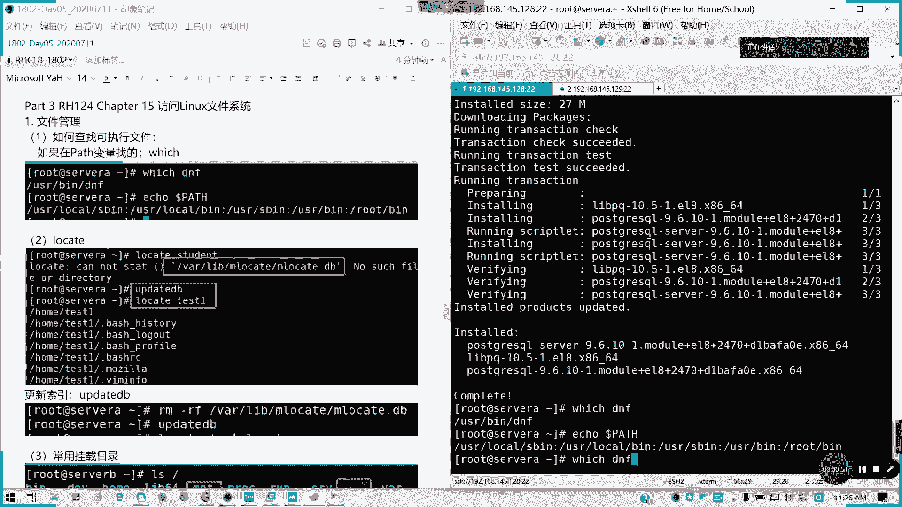

---

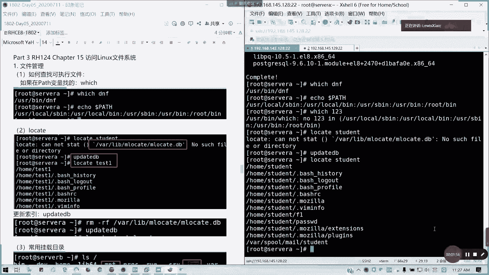

## 第15章：文件管理

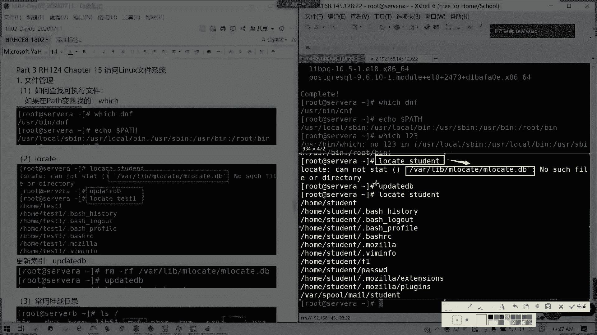

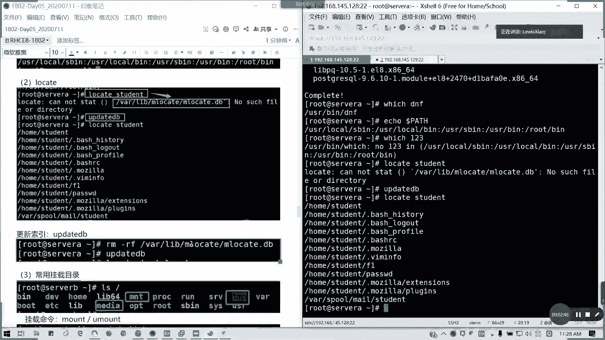

上一节我们回顾了基础的命令行文件操作，本节中我们来看看如何更高效地定位系统中的文件。

### 文件定位方法
通常，我们可以通过多种方式定位文件。

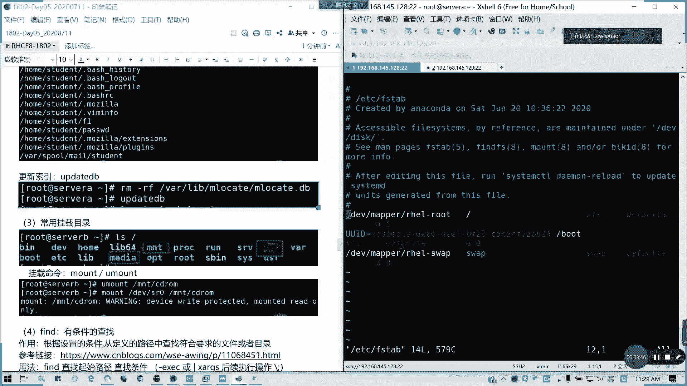

#### 1. 使用 `which` 命令定位可执行文件
`which` 命令通过系统的 `PATH` 环境变量中定义的路径来查找可执行文件。
```bash
which dnf
```
如果文件不在 `PATH` 变量包含的路径中，`which` 命令将无法找到它。


#### 2. 使用 `locate` 命令定位普通文件
`locate` 命令可以快速查找文件，但它依赖于一个预先建立的索引数据库。
首次使用 `locate` 前，需要更新数据库：
```bash
updatedb
```
更新完成后，即可使用 `locate` 查找文件：
```bash
locate student
```
`updatedb` 命令会建立索引，并将其存储在特定数据库文件中。如需强制更新索引，可以删除该数据库文件后重新运行 `updatedb`。

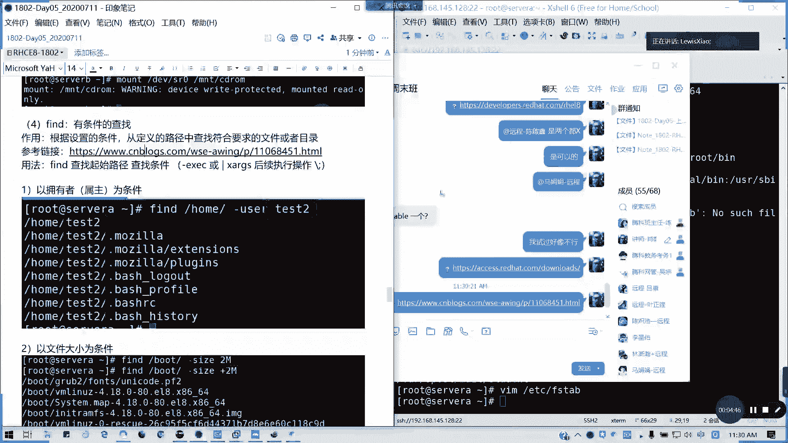

#### 3. 挂载点目录
Linux中有几个常用的挂载目录，例如 `/mnt` 和 `/media`。
- 使用 `mount` 命令进行挂载：
  ```bash
  mount /dev/device_name /mnt/mount_point
  ```
- 使用 `umount` 命令卸载：
  ```bash
  umount /mnt/mount_point
  ```
若要实现开机自动挂载，需要编辑 `/etc/fstab` 文件，这部分内容将在后续讲解磁盘管理的章节中详细介绍。

---

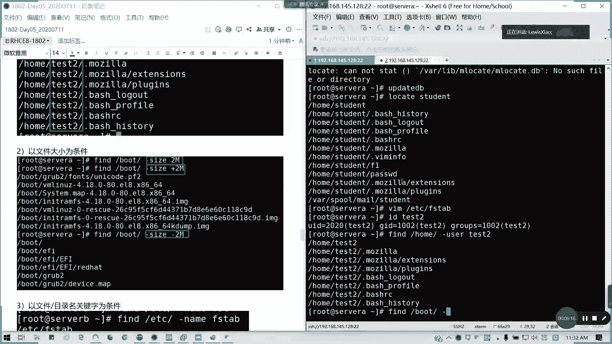

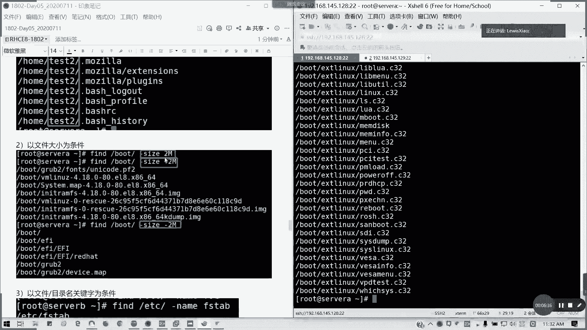

### 使用 `find` 命令进行条件查找
`find` 命令功能强大，它可以根据设定的条件，在指定路径下查找符合条件的文件和目录。以下是其基本用法。

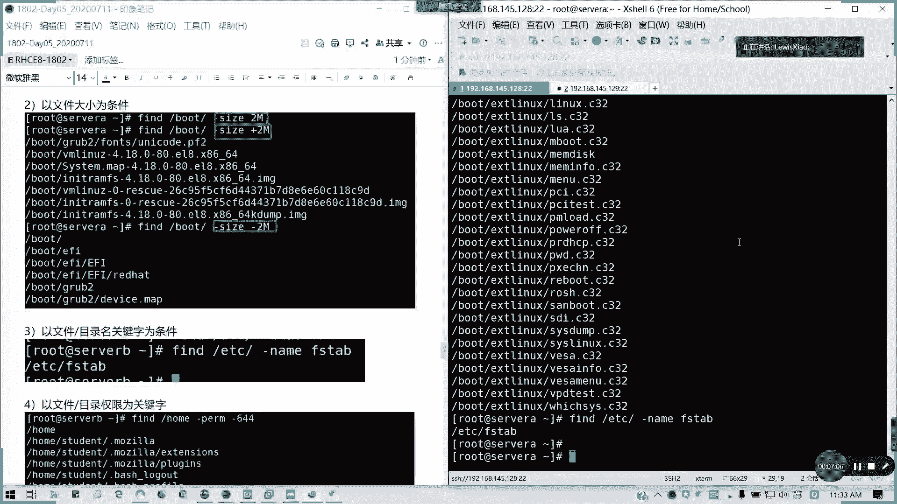

`find` 命令的基本语法结构为：
```
find [起始路径] [查找条件] [后续操作]
```
- **起始路径**：查找的起点，如根目录 `/` 或当前用户的家目录 `~`。
- **查找条件**：用于筛选文件的各种属性。
- **后续操作**：对查找到的结果进行处理，如使用 `-exec` 或通过管道传递给 `xargs`。

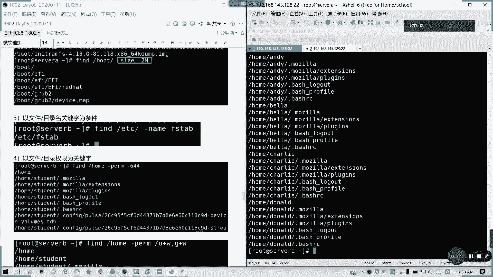

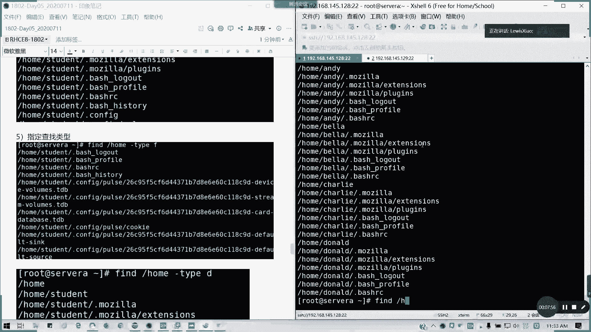

#### 查找条件示例
以下是几种常见的查找条件示例。

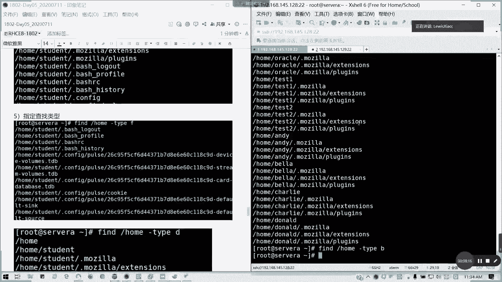

**按文件所有者查找**
查找 `/home` 目录下所有者为 `test2` 的文件：
```bash
find /home -user test2
```

**按文件大小查找**
在 `/boot` 目录下查找大小等于 2MB 的文件：
```bash
find /boot -size 2M
```
查找大于 2MB 的文件：
```bash
find /boot -size +2M
```
查找小于 2MB 的文件：
```bash
find /boot -size -2M
```

**按文件名查找**
在 `/etc` 目录下查找名为 `fstab` 的文件：
```bash
find /etc -name fstab
```

**按文件权限查找**
可以使用数字法或符号法查找。
- 数字法：查找权限恰好为 `644` 的文件。
  ```bash
  find ~ -perm 644
  ```
- 符号法：查找所有者有读写权限，所属组和其他人只有读权限的文件。
  ```bash
  find ~ -perm /u=rw,g=r,o=r
  ```

**按文件类型查找**
查找指定目录下的所有普通文件（`-type f`）或目录（`-type d`）。
```bash
find /path -type f
find /path -type d
```

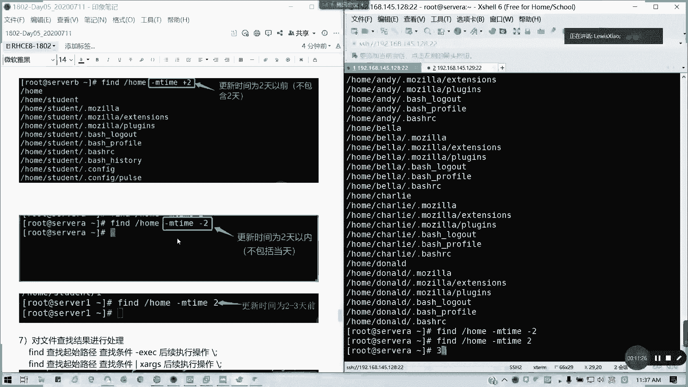

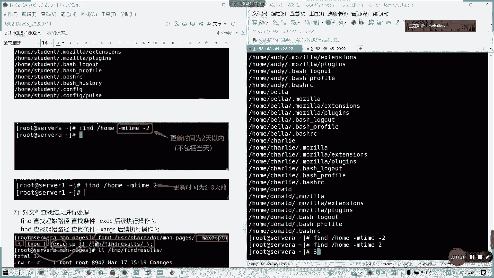

**按时间条件查找**
Linux文件有三个主要时间戳：
- **Access time (atime)**：最近一次访问时间。
- **Modify time (mtime)**：最近一次文件**状态**更新时间（如权限、所有者改变）。
- **Change time (ctime)**：最近一次文件**内容**修改时间。

查找 `/var/log` 目录下更新时间在 **2天以前** 的文件：
```bash
find /var/log -mtime +2
```
查找更新时间在 **2天以内** 的文件：
```bash
find /var/log -mtime -2
```
查找更新时间在 **2到3天之间** 的文件：
```bash
find /var/log -mtime 2
```
**注意**：`+2` 表示大于2天（即第3天及以前），`-2` 表示小于2天（即0到2天之间），`2` 表示2到3天之间。

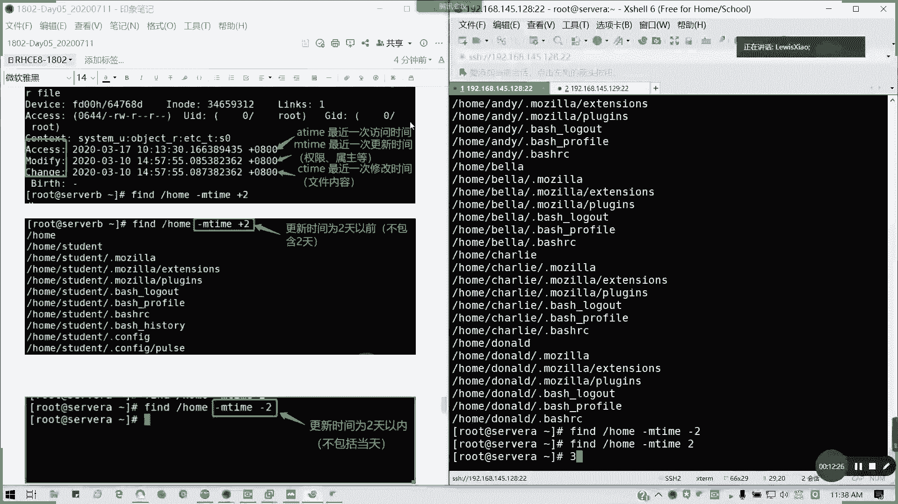

---

### 对查找结果进行处理
我们可以使用 `-exec` 参数对 `find` 命令找到的结果执行后续操作。

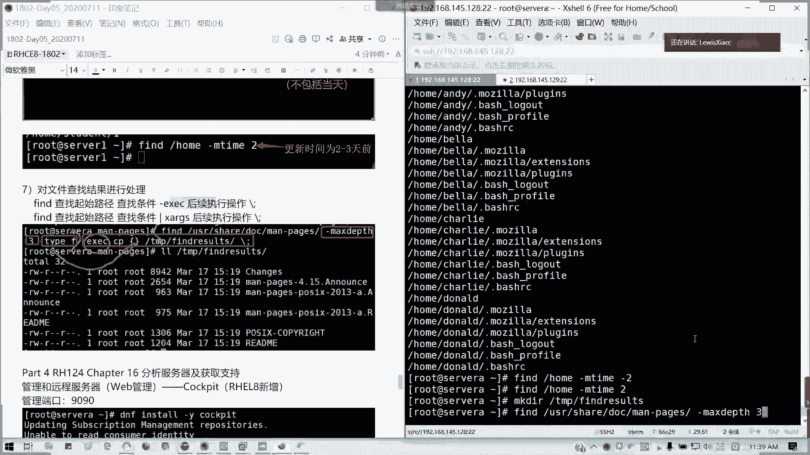

**示例：复制查找到的文件**
查找 `/usr/share/doc/man-pages` 目录下三级子目录内的所有普通文件，并将它们复制到 `/tmp/find_results` 目录中。
```bash
mkdir /tmp/find_results
find /usr/share/doc/man-pages -maxdepth 3 -type f -exec cp {} /tmp/find_results \;
```
- `-maxdepth 3`：指定查找深度为3级子目录。
- `-exec cp {} /tmp/find_results \;`：对每个找到的文件执行 `cp` 命令，`{}` 会被替换为文件名，`\;` 表示命令结束。

也可以使用 `xargs` 命令通过管道实现类似功能，但 `-exec` 更为常用和稳定。

---

## 过渡到第16章
以上是第15章关于文件查找与管理的核心内容。接下来，我们进入第16章，了解如何通过图形化工具获取系统支持。

---

## 第16章：获取支持

本节中我们来看看红帽企业Linux提供的一个基于网页的图形化管理工具——Cockpit。它为系统管理提供了一个直观的界面，特别适合初学者。

### Cockpit 简介与启用
Cockpit 是一个用于管理服务器的Web控制台。在默认安装GUI的RHEL 8系统中，它通常已作为套件安装。


默认情况下，Cockpit服务并未启动。我们需要启用并启动它：
```bash
systemctl enable --now cockpit.socket
```
- `enable --now`：同时实现“开机自启”和“立即启动”两个操作。

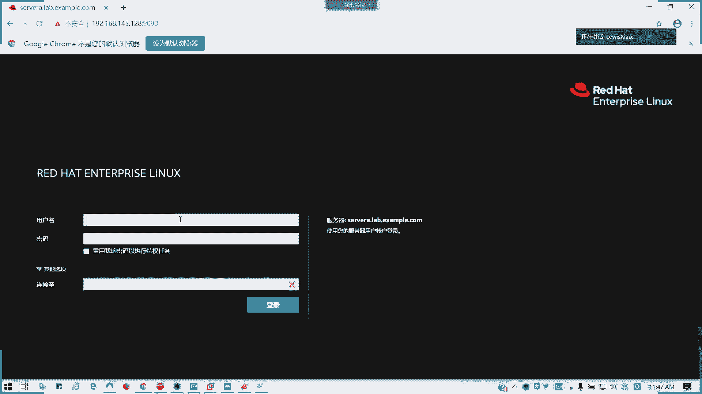

### 配置防火墙
为了让外部能够访问Cockpit的Web界面（默认端口9090），需要在防火墙中放行该服务：
```bash
firewall-cmd --add-service=cockpit --permanent
firewall-cmd --reload
```
防火墙的详细配置将在后续课程中深入讲解。

### 访问与使用Cockpit
1.  打开浏览器，访问 `https://<服务器IP地址>:9090`。
2.  使用系统管理员（如 `root`）的用户名和密码登录。

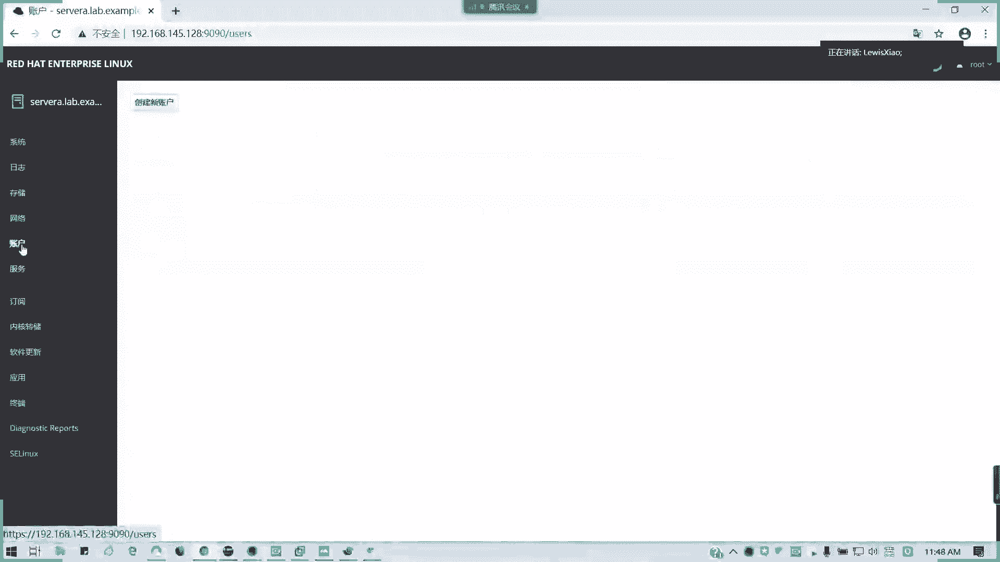

登录后，你将看到一个功能丰富的管理界面，可以：
- **监控系统状态**：实时查看CPU、内存、磁盘I/O和网络流量。
- **管理系统**：执行重启、关机等电源操作。
- **查看日志**：浏览系统日志，并可按级别筛选。
- **管理存储**：进行磁盘分区、创建软RAID或LVM卷（包括RHEL 8的新特性VDO）。
- **配置网络**：设置网络接口、创建网桥或绑定（bond/team）。
- **管理用户与服务**：创建用户账户，管理系统服务（类似于Windows的服务管理器）。
- **使用终端**：直接在网页中打开命令行终端进行操作。

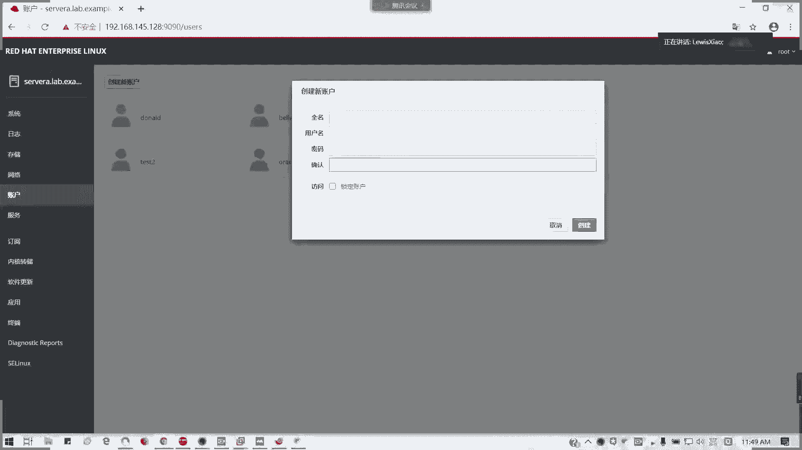

**请注意**：Cockpit中的“订阅管理”和“软件更新”等功能需要有效的红帽订阅才能使用。

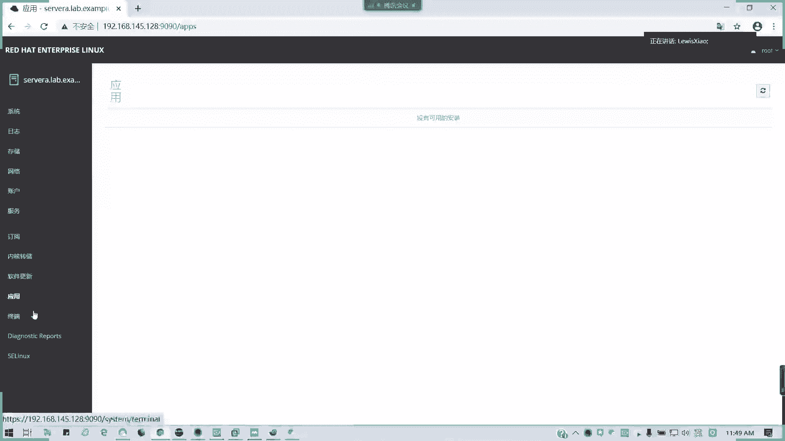

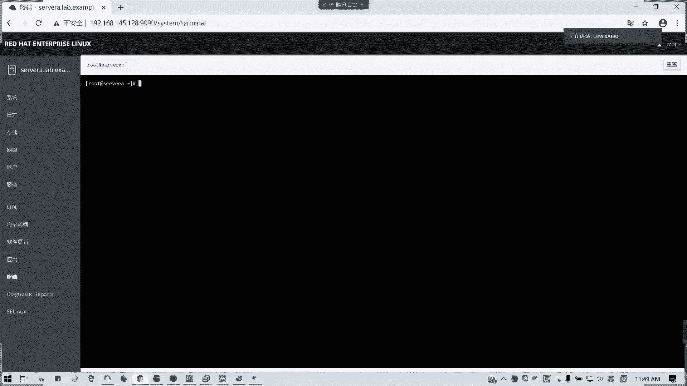

### 图形化与命令行的选择
Cockpit为不熟悉命令行的管理员提供了极大便利。然而，在RHCE认证学习和实际运维中，我们更强调通过命令行高效、精准地完成任务。因此，可以将Cockpit视为一个有用的辅助工具，但考试和深层管理仍需依赖命令行技能。

---

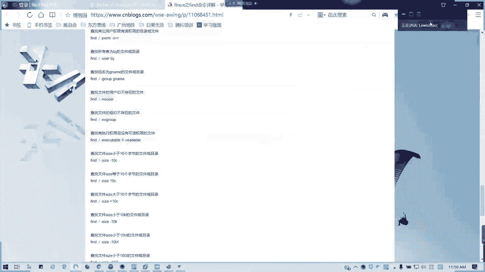

## 总结
本节课我们一起学习了RH124课程的第15章和第16章。
1.  在第15章中，我们掌握了多种文件定位方法，并深入学习了功能强大的 `find` 命令，包括按所有者、大小、名称、权限、类型和时间进行查找，以及如何使用 `-exec` 对结果进行处理。
2.  在第16章中，我们了解了红帽Cockpit这一网页图形化管理工具，学习了如何启用、访问并使用其基本功能来监控和管理服务器。

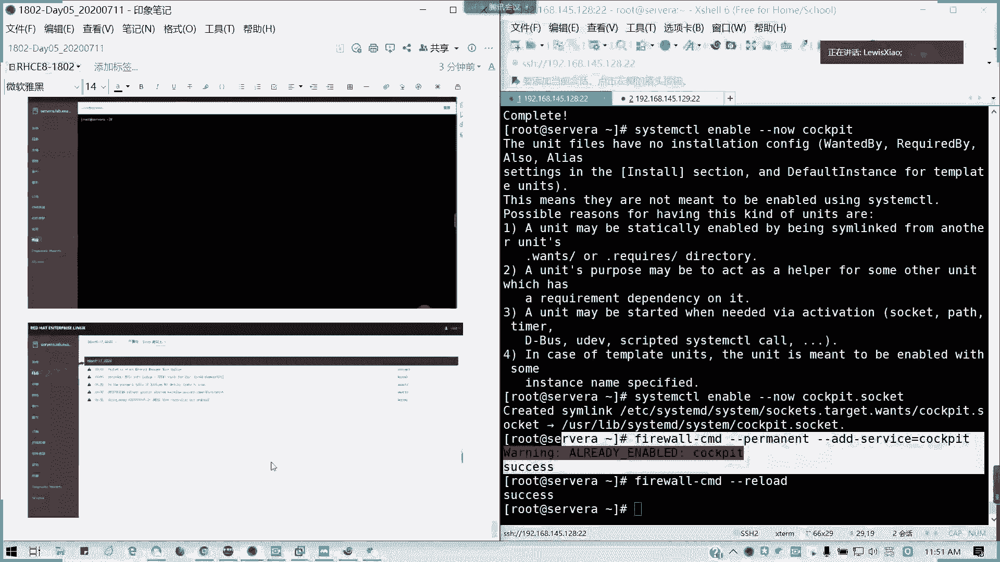

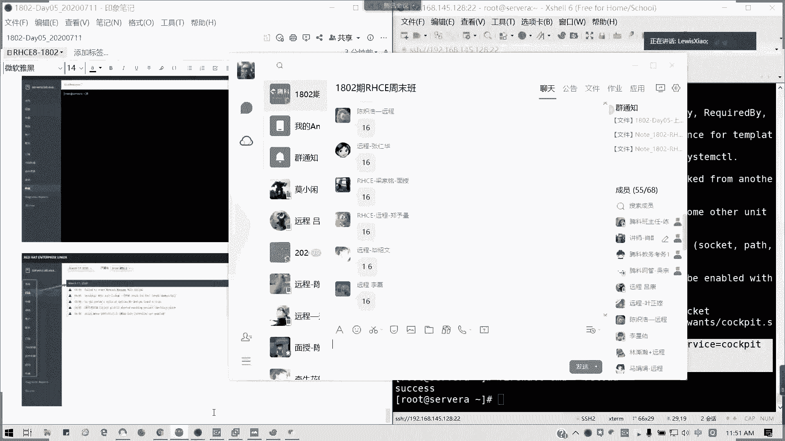

这些知识是系统管理的基础，熟练掌握文件查找和灵活运用管理工具，将为你后续的学习和实际工作打下坚实基础。