# 拿下证书！Redhat红帽 RHCE8.0认证体系课程 RH124+RH134+RH294三门认证视频教程 - P29：29_Video_Day05_RH134_Ch01_Shell基础01 - 16688888 - BV1734y117vT

北京时间2点15分，我们开始第二本书内容，首先恭喜大家完成第一本书的学习啊。接下来蓝在大家面前的就是一个脚本啊，我们的b share脚本原本呢这个是C17。0下午的内容啊，下午的第一门课内容。

但是这里的话我们在8。0的规划里面就把它提前上来上了，提上来上原本的安排只有一张，但是我想就是说这边的基础啊，大家可能对这块其了解不很多，但是它又在我们的实际运维里面相比较的重要。

所以的话这块我们打算花一天到一天半的时间给大家讲完整个b share的基础。今天我们来看第一部分。首先我们要知道sha脚本，我们的sha脚本是什么作用啊，所有脚本做什么作用。

shall脚本呢是利用我们sha的功能，结合语控制语句写的。一种程序用于主要用于帮我们维护系统。当然你想写什么99乘法表啊，或者是画一个书圣诞树啊，这个问题都不大。但通常说我们。

学习系统里面的功能都是为我们系统维护进行服务的，对不对？然后我们之前讲的shall的功能，是不是我们在那个124的第一章访问命令行，第二章访问命令行的时候已经讲过了，对不对？所以这些命令的话。

我们接下来会结合结合在脚本里面去应用啊，去应用，去那个帮助我们进行系统的运维。那我们接下来shall的功能有哪些啊，shall的功能。第一个是学我们学过的几乎所有的命令，我只能说几乎所有。

因为有些命令的话，我们不常用就没讲。但是这里是几乎常用所有的常用命令啊，我记得就要常用两个字。然后呢，第二个我们讲。每在编程里面，包括我们学C也好，学python也好，学其他的语言都好，java都好。

变量。对吧每一门语言里面shall其实我们也可以理解成一个编程语言。然后它的一个比较重要东西就是变量如何去。定义变量以及变量负就是说就定义变量就是我们变量如何去赋值，它的名称，它是如何赋值。

然后如何去取值，对不对？比如说我们定义变量可以。定义成。直接我们直接打的话，在命令好打的话，它是一个临时变量。对啊，就是局部变量，不能说临时啊是局部变量，只在当前范围内生效。比如说Y一等于。

这后面的变量值是我随便自己取的啊。我们这种格式呢就是我echo一下是吧，我们怎么引用的话，顺便先给大家说，就是echo，然后后面是吧，多了加上变量名，我们就可以取出变量的值。然后呢，变量前面是变量名。

后面是变量值，中间又等号是负予的意思。对吧变量赋予这个值给他。然后呢，注意事项。首先我们不能是这样啊。对吧。变量跟值还有等就等号的两边不能存在空格。如果存在空格的话，会变成什么意思呢？存在空格呢。

他就认为你是一个命令的分格，命令跟参数的分格符，然后把会把VIRE识别成命令，懂我意思吗？那这样的话，那就不是变量负责，这是执行命令了，好吗？这是第一个点。中等号左右两边不能存在空格。

这是变量赋值的第一个点。第二个点，变量不能与这样的数字开头。以数字开头它也会被识别成命令啊。Yeah。我们可以袜衣，但不能一袜啊。第3个，变量可以。上划线开头没有问题。你看变量我们刚才用的下划线开头。

它也能够读出它的值对吧成功复制并取值。所以这个第三个变量可以用下划线啊。开头，然后如果像。这类的我取一个望2。这样可不可以呢？明显报错，对不对？明显报错。那我的报是没取到值啊，因为我们这个值呢。

如果变量的值，我这里是包含空格的情况，但是包含空格不能这么写。如果是变量名要包邮和供格的话，我们必须要把引号引起来。单引号双引号的功能我会在后面说啊，单引号双引号的区别不在后面说，像我们这样子。

是可以的。对吧用引号引起来，也就是我们整个值如果里面含空格，请用引号。懂我意思吗？第5个。我们可以把一个命令的结果赋予一个变量，命令结果怎么引？我没有烦你哈。比如说我ho snap，我输出我们的。

主机名对不对？回车，然后我用A挂3，对不对？所以这个呢。是5点啊，我们所说的5点的。注意事项。然后呢。这里注意啊，我们刚才说的单双引号是有区别的，双引号呢就会是相对引用啊，里面的变量。

比如说像我们每月符号等等会转换成值，但单引号就绝对引用原样输出，懂我意思吗？这是单双引号的一个区别。简单讲，后面我们会详细说。

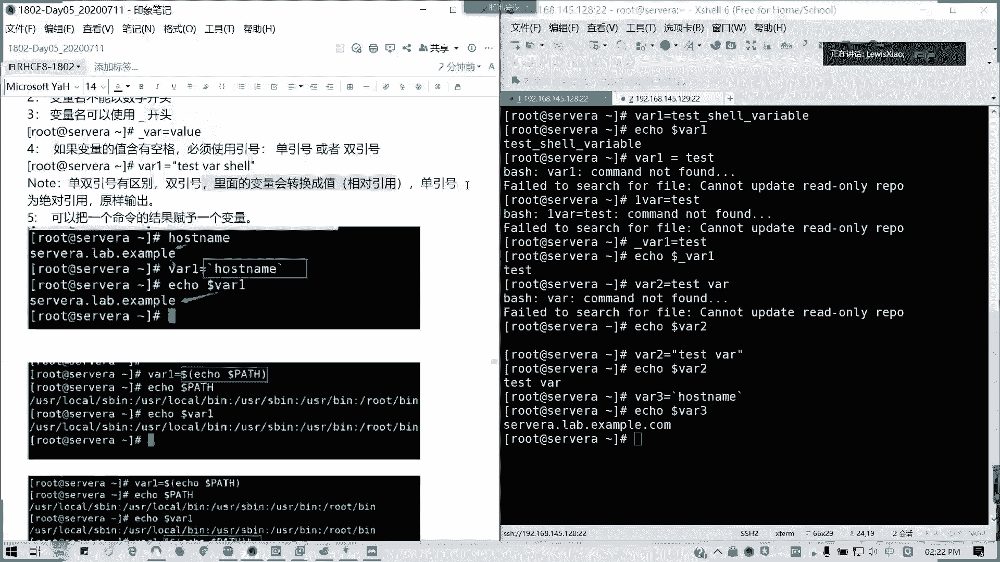

然后像我们的这个。我们可以。可以用括号来也我们除命令啊命令我们也可以用括号来取值。684。我们以后我们里面可以包含一层命令，对吧？我们A口一个pass变量，那我把这个值付给了va4，那我们A一下va4。

对吧？

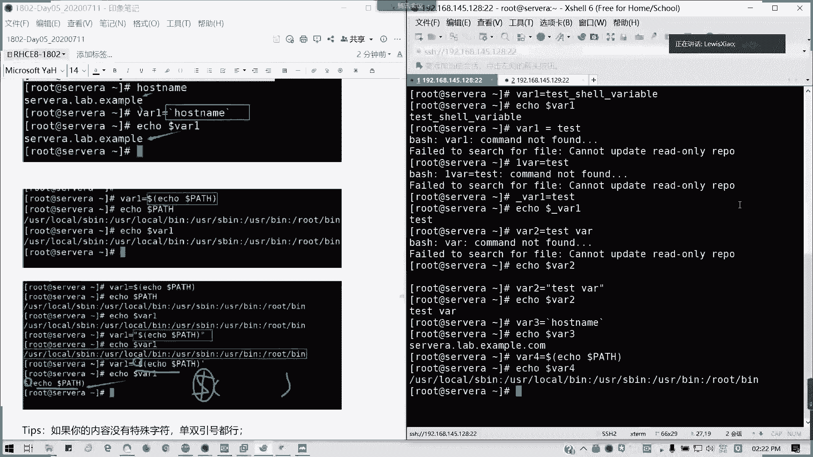

所以他的。一个结果就跟我这里写1个85。他两个。作用是一模一样的。对吧反引号等于多欧的括号啊。然后对于单双引号的话，就是。这样子啊，大家单双以后有刚才的补充。如果还有特殊字符，就相当于就用我们的。

多的括号出括起来。楼主个单引号。就我们刚才用反引号，我们双引号试一下啊。用如果这个多了的话，用双引号看一看。我对比一下。也是可以的，对不对？它算引号，它会把里面的那个变量转转换为值。付给了新的变量。

这是这这叫做那个。迭代替换啊迭代。然后呢，如果用单引号是什么结果呢？原样输出。懂了吧。这个可以理解吗？都可以啊。

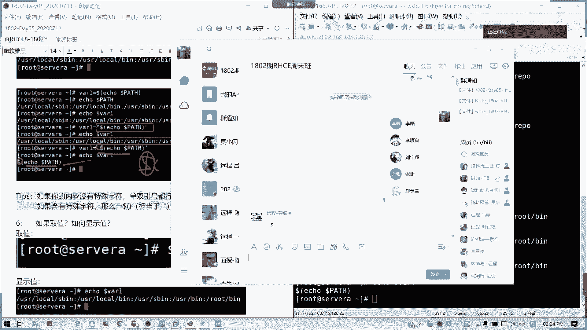

好，那我们接下来如何取值显示时应该都知道了啊。如何取值，如何选示值啊。如果取值的话，通常说。通常是那个。直接用多了啊，直接多了去取它的值，用前面叫多的符号，但是我们不能专门直接运行。

我们要结合命令来做啊。比如说我们显示用echo，对不对？그래。或是直接赋值都可以，但不要用这样这样子，不要这样直接用这个命令出来啊，这个只是一个例子，这是一个只是说一个说明。

而不是说那个你用这个方法是对的啊。

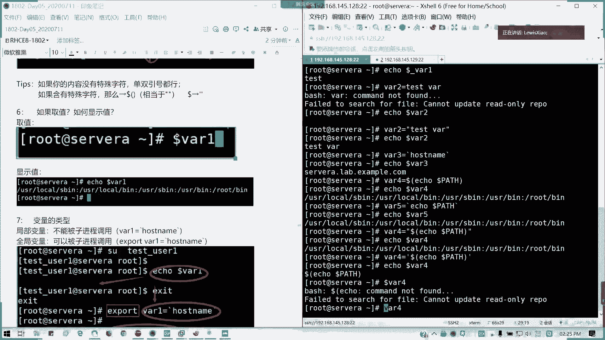

好，前六点没有太大问题了。那接下来我们讲变量类型。变量类型的话。有一个叫局部变量，一个是全局变量。局部变量呢是不能被紫金层调用的。我们可以试一下啊。我这里写一个。201。我这里跟我的讲义不可能不太一样。

但是我们的用法这个是差不多的啊，201等于就我就简单取一个后s念好了。我们在这里A一下。201是不是我们可以出结果，对不对？那我现在我切我就部分切换到用户，我就将它调一个紫金城出来，懂吗？

是为什么用部分切换呢？就是我的环境变量保持当前不变，但是我用户变了，对吧？如果你完全你用那个SU杠的话，它会就是把变量也切换了，那可能做不出我们的效果。我们看看啊，那我现在切换过来，我A口一下801。

곤가。对不对？我们这个叫局部变量啊，局部变量，也就是不能被。我现在我切到我部分切切换用户的话，是不是掉出一个紫金层，相当于啊调出一个紫金城，我不能被他引用，懂我意思吗？那如果我要全军引用怎么办呢？

我前面加个export。对吧通常这些这波操操作在哪里用的多呢？像oracle定义我们的那个对吧？定义的我们的数据库oracle是吧？我们的oracle的那个叫做SID。数据库的那个实例ID对不对？

通常你用实例ID之后，我们切oracle就可以用了，对不对？可以打开这个简这这个是。一个比较多的用法啊，V201。等于同样。我看一下，我用SU杠看能不能调用啊。还是不行，我这边的话，我看一下现在801。

对吧我认root是801是可以用的那我调出一个指巾船，将当我部分切换。对吧。你完我完全切换成它那个环境变量全换了，那你这个变量就更没法生生效。

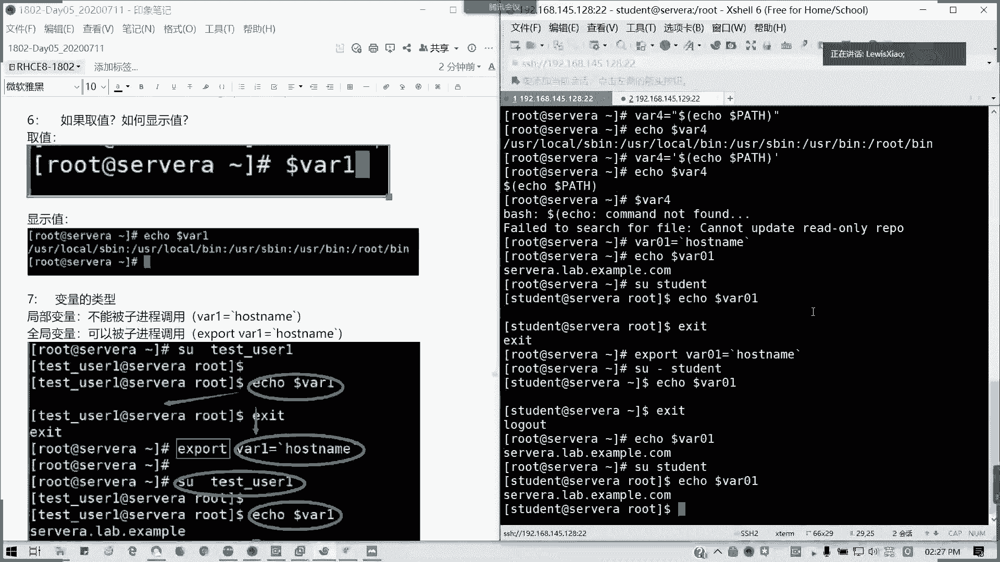

懂了吧？这个完全我们的局部变量跟我们的全局变量区别就是你能不能被紫金城调用。如果是局部变量的话，只在当前的范围内生效。我回来。

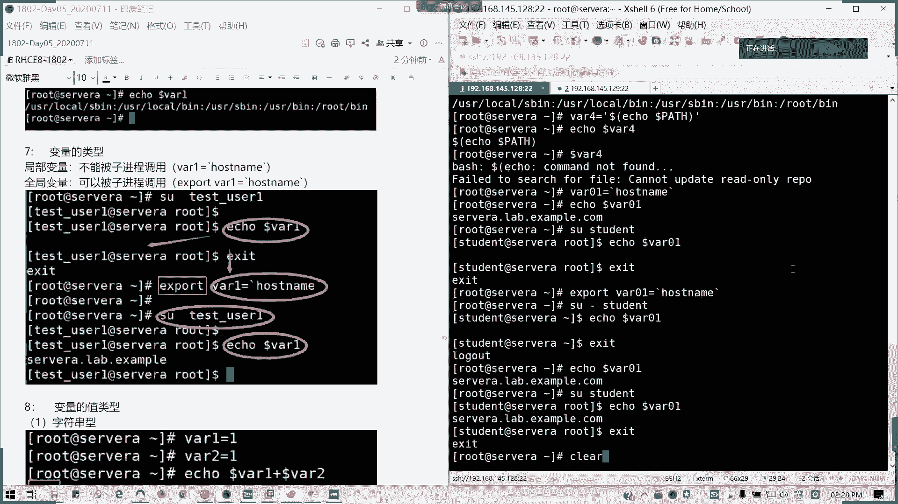

然后接下来我们讲变量的值的类型，变量值类型分一般两种啊。一种是。四幅串钱，一种是。我们叫整形或者数数字啊。我们叫数字或者是应该也不能说整形，因为它也有浮点型啊，就我们分两种，就是字符串或者数字，对不对？

我们这里来定一下。像VR一等于1V2。我们定义两个变量是吧？然后我们A一下。多了VR1加VR2哎，不了，不对啊。什么结果？变成1加一，对不对？我们如果要算术运算，它这个默认的输出的那个类型是字不串型。

那是不是相当于两个字符这样子拼起来啊？那我们如果要进行一个数学运算有什么办法呢？数学运算的话，我们可以这样子，就是把它声明为整形，这是第一种方法啊。是第一种方法，我们把它声明为整形。

用deecare命令。声明啊。杠I声明它为整形变量，我们的我们的整数型变量懂吗？VR一等于1，然后我们VR2等于1，然后我再声明1个VR。等于。do了VR1加VR2。

我也声明我的求和结果那个变量Y也是整形，对吧？那回车我们现在A口一下。到了。我们把V二的词取掉，是不是是不是我们想要的一加一等于2了？对吧。那如那其实对比对比下面就是VR3跟VR4，我又用普通的这种。

对吧？然后到VR5等于VR3加VR4。A口多了VR5。是吧两种区别就出来了。明白我意思吗？两种区别就出来了。就是声明为整形跟普通字符串钱，它的那个结果就是说我们所所想要的结果是不太一样的。

我这边已经应该OK了啊。Oh。

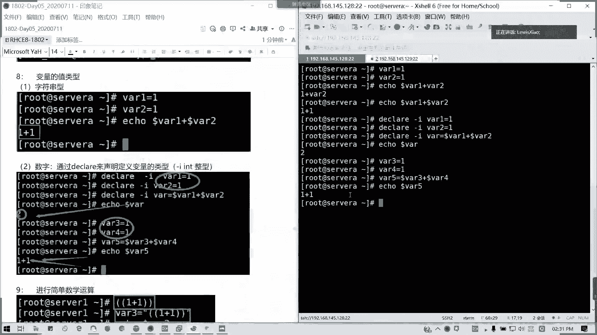

然后呢。简单的数学运算，除了用dy来做，我们也可以用。

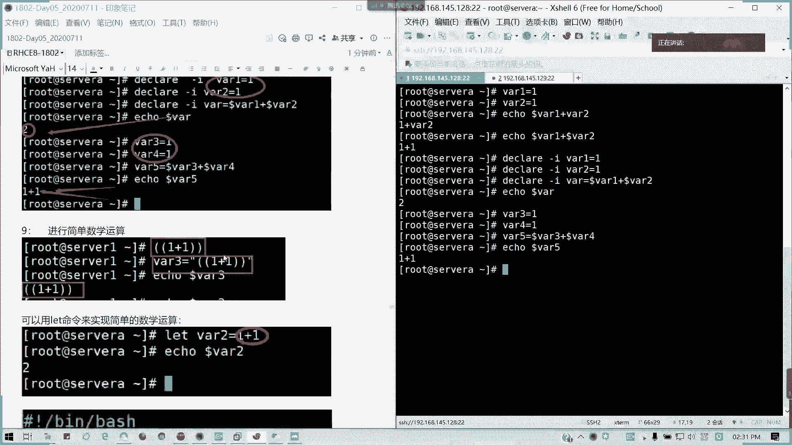

我们也可以用那个来做啊。这张我们是可以用两个括号来做的。哎。我这里又切了那个。这里的例子应该是这样子才对啊，简单授权一下，我用那个如果我们不加任何的。

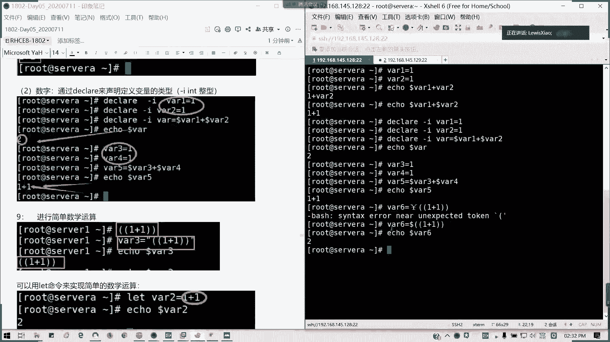

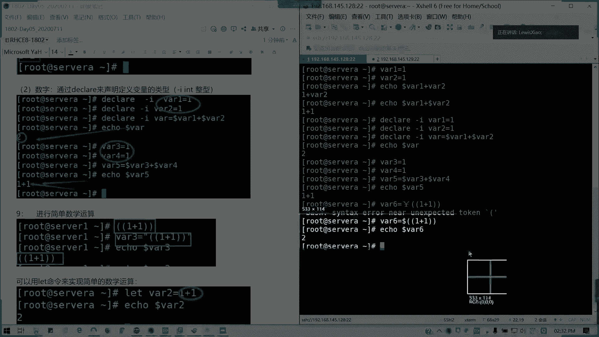

不加任何括号啊。是会输出一个整形结果。但如果我加了一个多了。

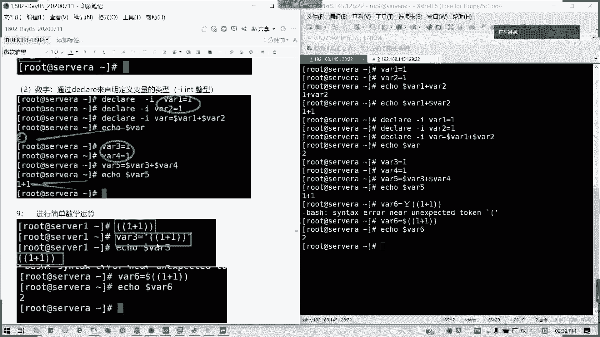

那就对了啊，整数学运算，这是第二种方法，两个括号括起来两面进行时并行我们简单的加减法或乘除法，对不对？加个都了就对了。那这个图把它去掉，这个才是正确的。好吧，然后呢，还有一种就是let命令。

let命令也是可以实现简单的数学运算。那我这样我我letva7。等于1加1。然后A一下。多了吧气。

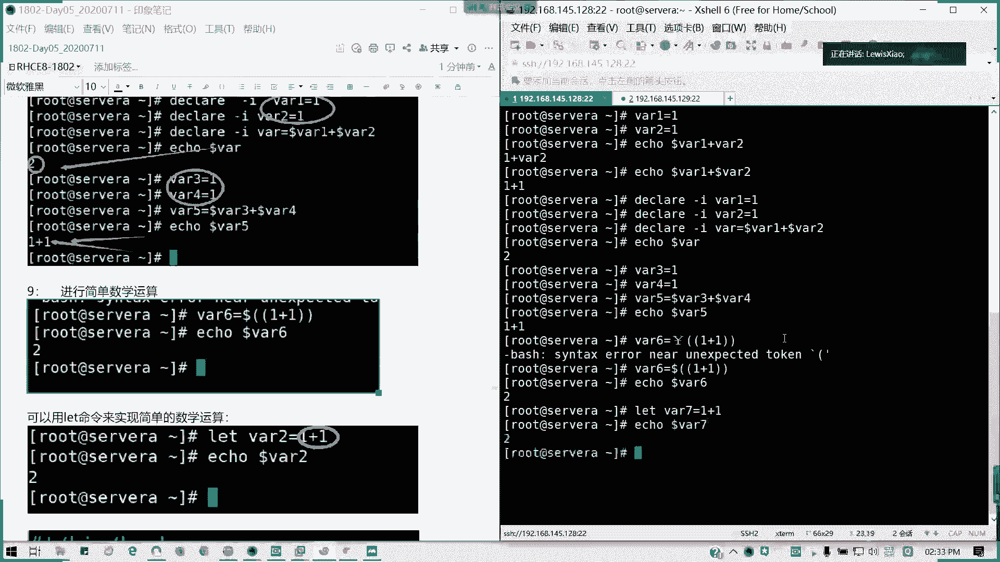

对吧。

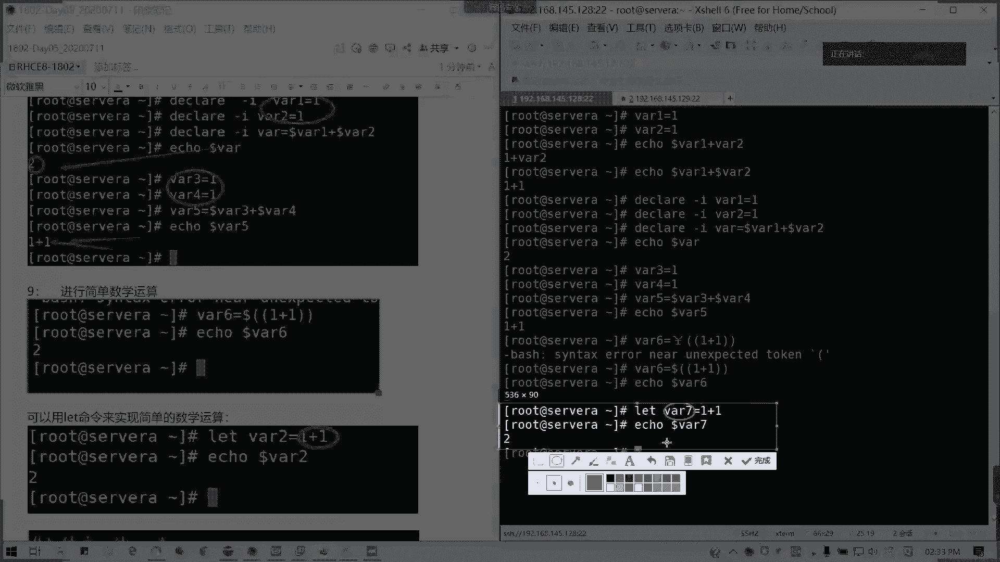

用let命令也可以实现简单的一个数学运算。

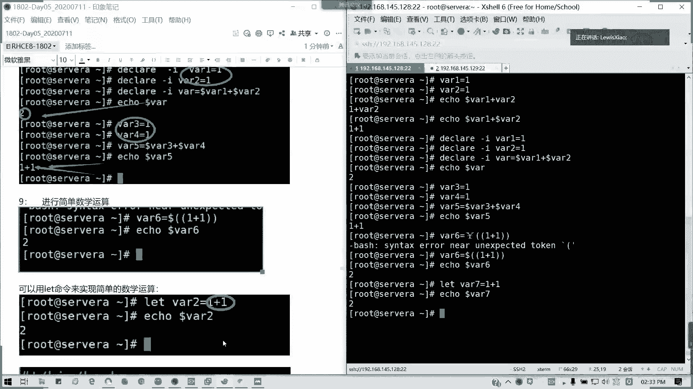

在这里的话，我们会有很明显的一个是吧？这三个类型我们可以写一个脚本。其实脚本的话，大家应该都大家知道怎么写吗？比如说我对一个那个方顺。点SH我写一个脚本。我们讲本解析器呢。要是第一行先声明的脚本解辑器。

就是并b啊。或者是并SH就采用需有的脚本解释器解析器，懂吧？就脚脚本解析器，然后呢。我一般空一行，在我们这里的三种结果列一下给大家，看看是不是一样啊。多了两个括号。我就写一加一好了，V1一是这样子。

va12呢？用let命令。第三个就是我们职业声明。我们分别输出这三个值。我看哎。哦我这里少了一个啊。我看一下出来。对吧三种结果是一模一样的。

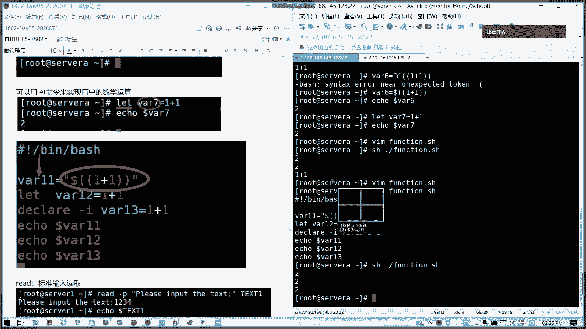

就是我们采用的三种数学运算的方法。

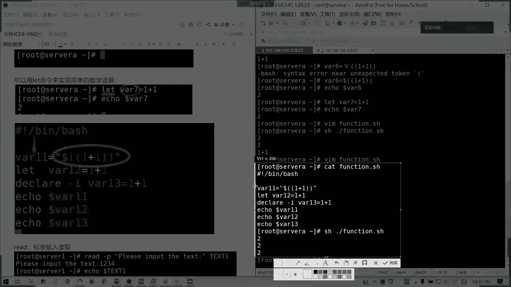

懂我意思吗？三总啊。

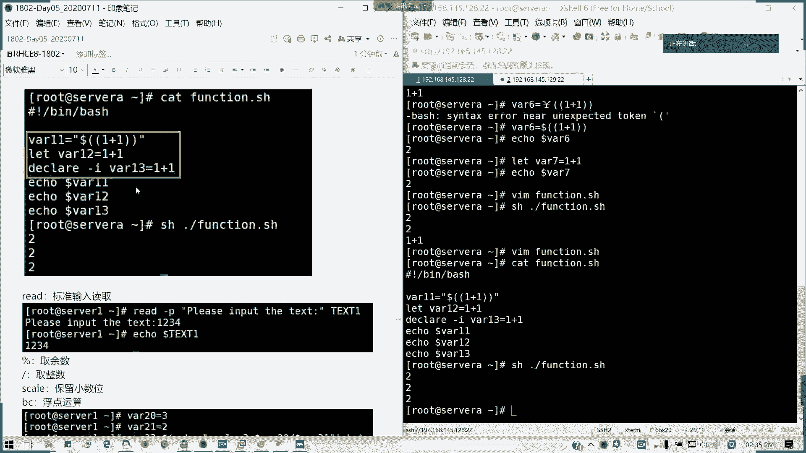

然后呢，我们这里的话我要教大家一个像标准读输入读取。但是后面这一些的话我们待会儿会会讲到啊，但后面会讲到就是数学运算这一块。这里先先给大家提一个概念，然后呢，像read德的话，标准读取。

也就是说可以显示提示符，然后后面用键盘输入数字，对不对？我们写一个脚本。我知道他这里是直接用那个。就我这里的意思直接用那个直接用在命令提示符下进行。那我这里的话我写个脚本嗯。脚本基本要多写啊。瑞的。

杠P是吧。像这样的话，就对着杠P打印我们的提示提示语，然后把提示语输完之后，我们要把它复制到一个变量里面。对吧。变量里面，然后我们再把它输出出来。保存退出，我们把那个脚本给他输出看一下。

那我们现在来执行。我们加了SH或者是be之后呢，我们不需要加执行权限都可以运行了，懂吗？直接调用解释器。如果我们平时的话建议加样下一个X权限，加上一个执行啊。因为它是一个脚本，是一个可执行文件。

但我这里头话为什么没加呢？我直接调用我前面加了1个SH，也就或者是bech。就让bech，我们运行bch命令调用这个文件去执行。懂吗？内的SH。对吧我输入这一字符串，他就会把它显示出来。

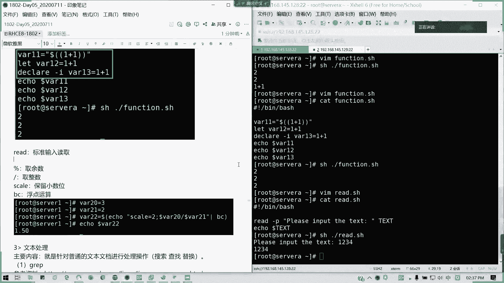

这个我们先把它去掉，因为后面我有一我有一节是把跟他重复的啊，所以的话我就把它去掉，就把我们的脚本的一些像数学运算，包括标准读取的一些功能。先给大家做简单介绍，就有一个大概了解啊。如果明白的话。

如果明白理解的话，请打A啊，请到小A。然后接下来我们要讲文本处理。文本处理。四大工具啊，其中有一个三剑客啊。

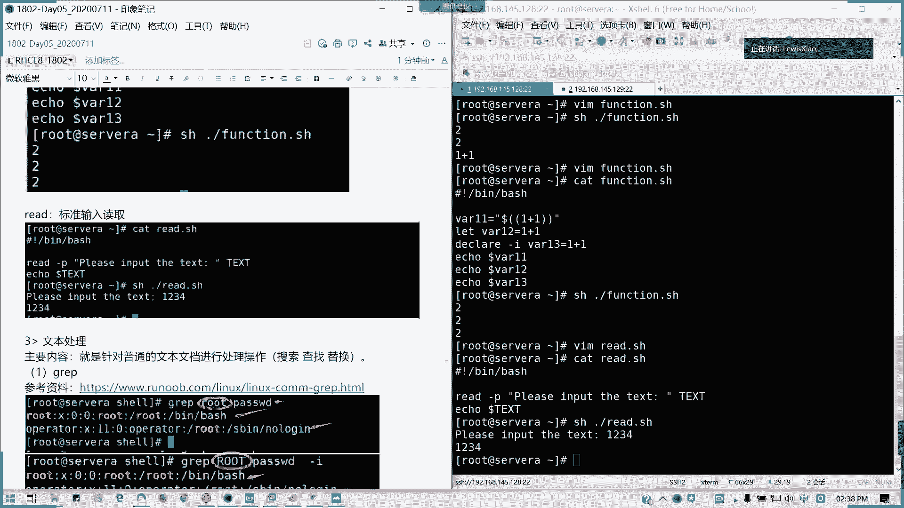

现场的如果听明白的，可以举手。一个、两个、三个、4个、5个、6个7都懂啊，8个人全都懂OK。我看远程的有多少人啊。我刚才为什么把数学运算那个球余的删掉？因为后面有一个重复的内容，有一个内容会讲到。

那接下来我们讲文本处理，文本处理呢有4个工具。然后其中除了cut之外，breakAWK跟SCD俗称三剑客啊，文本处理三剑客。为什么要把放在这里讲？因为这经常我们用脚本来获取一些东西的。

获取获取一些指数值。所以的话我们放在这里啊，放在脚本这里讲。

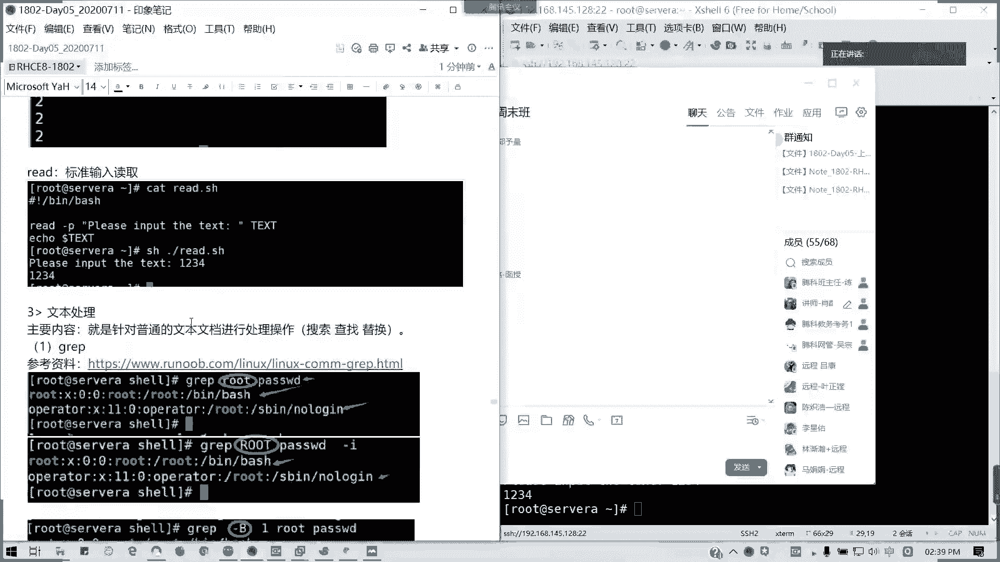

首先啊文本处理的一些内容呢。它主要内容就是针对普通的文本文档进行处理操作。比如说搜索查找替换。然后我们先讲一下rape。

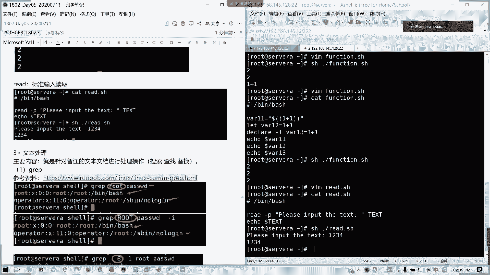

group的话，我们在。这里啊。在菜鸟网啊，我们截接着菜鸟教程里面的grape，这里有详细的解释，但我这里就截取了一部分来讲啊。大家可以看一下grape它的。很详细的用法在这里包括他的实力啊。

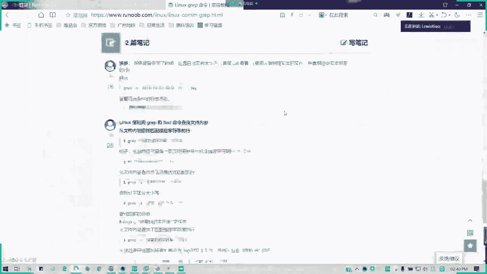

我们要直接讲简单的一些用法，像gra，它可以从一个文件里面截取我们需要的一些内容，以它为关键字，截取需要的内容。比如说我们。我们在那个之前在TMPt里面，是不是有个passWD啊，哎，没有啊。这样吧。

我复制一我复制一个pasD过来。因为确实不要对我们的那个系统文件做任了修改啊。我们所说的复制例子都是虽然都是系统文件，但是我们建议复制到话安全区域，然后我们进行实验是更好的啊，这里填要提醒。好。

我们就切换到TMP test model，我们的pasWD应该在了。

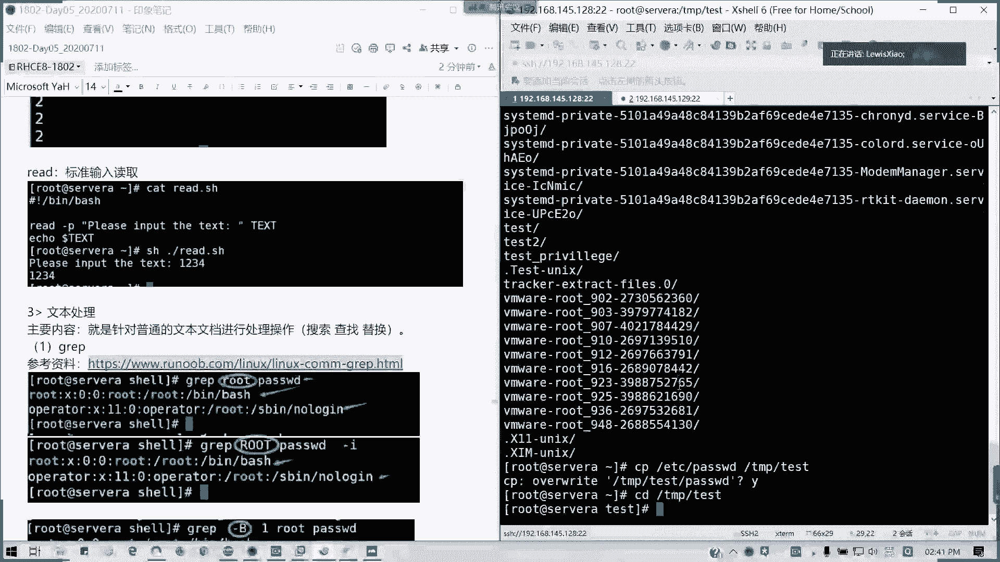

对吧我们就以这个刚复制过来的pasW店名这个文件就存储我们用户信息目录，我们来做做演示。那OK。我们会获我们的截取里面录跟录ot关键是有关的。这个文件对吧？语法是语法呢。语法是怎么样的？Grape。

关键字。文件啊。贵关关键是文件。好，我们看一看。这里grape rootot pass wD，它就截取跟就root关字有关的。好输出，而且把关键字它会标成红色。懂我意思吧？然后如果我们要不区分大小写。

比如说我这里输入大写。对吧。然后后面我可以加杠I，加杠I的意思是。不区分大小写。我这里补一下啊，补一下一些用法。因为我的原来笔记没有。其实呃我的关键字。杠I其实杠I的话。

我们这参数的话不在前不在后都没问题啊。也是一样的，我把甚至把杠I提到前面来。都一样，对吧？我们建写到这里啊，杠I关键是。这字又小了，我调一下。桂 loop pass four pass some低。

然后这里杠I呢。不区分大小写。对吧我们的root是大写，但是我们这里用的杠I参数。那我们是不是那个。把它替换掉啊。这的话，我们是常规用法。然后还有就是杠B的话，就显示后裔行啊。

这显示前面一行杠A是显示后一行。诶。一行一行我往下写啊，我这把注释补全。grape杠A。后面跟数字。显示。就只显示它会包含啊不显示关关结果及其。前一其其后一行，如果是杠A的话，是后一行。我们看一下啊。

杠A1。对不对？它会显示关键字结带关键字结果及其后一行的内容。对吧。我们关键是是这一个。杠了杠A一，然后这里。是不是是不是显示显示多这一行出来了，然后后面。对吧这个是我们这个是我们要的结果。

对吧能理解啊。然后杠B呢befo啊杠A是 after的意思。这是显示跟前面相反，它是显示前一行的内容。懂吗？然后还有呢就是。嗯。杠V。除了。除了关键字还不输出，其他都显示就是反序就反就是相当于反向输出。

对吧反向输出，我们看一下结果。他显示所有，但是root这一行就没了。对吧我们root这个opererate operator这一行不见了，对不对？像root这一行原本在这里的。原本在这里的。都没有了。

就输出其他的内容。对吧？然后还有就是我可以多重使用啊，多重使用grape，我可以获取到更精细的内容。我看有的人有点困啊。来，我们看一下啊，使用gra进行。精细节选，也就是说他可以通过不断的迭代引用。

对不对？迭代，然后我这里的话可以这样。然后我要截取一个b事这一行。那是只现在输出这一个了。可以多重进行gra。然后还有一种就是用E grape啊，我可以截取多个关键字。对吧gra杠一，我们一G的话。

我们可以截取多多关键字。对吧这个EG它是gra杠一的一个。Biming。对吧我比如说gra上一。Lot。杠一它是一个。相当于他是一个祸的结果啊。货的话就是。只要他满足其中一个条件都会输出。

对吧我就简单我剃换掉原来的图。所以他这里的话，你看像root啊，像stu啊。都已经输出了，对不对？然后像我们的可以，比如说我可以多个。对我们就很多个了啊。我这里的话我精细一点，我到T一吧。

也是一样的一样一样的用法啊。not是吧，我们not。Student of of test。对应的话就是我们三前面我们三个啊。然后还有就是我们用E grape那更简单的方法。指月引号。

然后用用竖线用我们管我们or是吧？我们or管管道student，然后呢t。这是简便的写法。懂我意思吧？用Egra等于gra杠1啊。这gpe基本上我们grape这个截取的。先讲到这儿。有没有问题？没问题。

可以举手啊。桂盆常见用法。一个、两个、3个、4个、5个都没问题啊。如果线上没有问题，请打个字母小B哈小B。贵普我们就讲讲这么多。

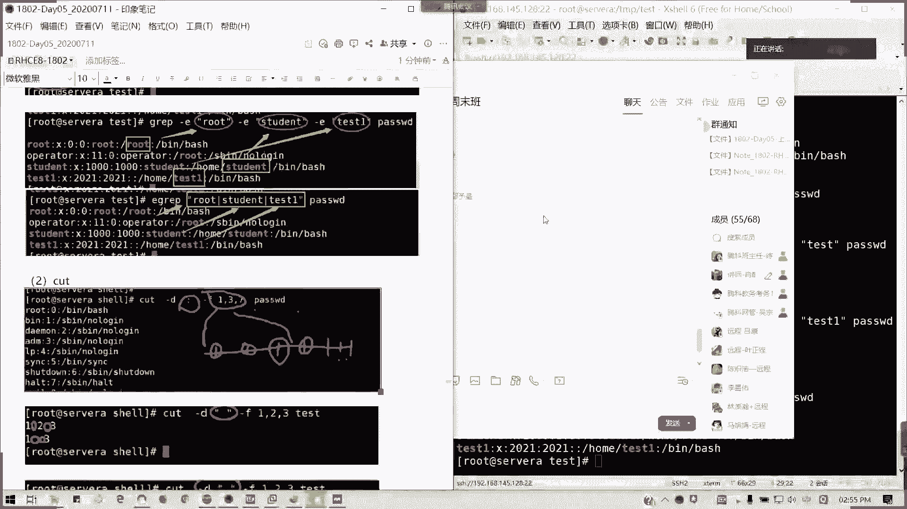

然后接下来讲一下cut啊，讲完cut，我们先休息一下。cut的话，它主要是一个。什么功能呢？现在用的比较少啊，cut功能主要是以某个字符作为分格，指定某字符作为分格，然后输出里面对应的值啊。

对应位置的一个值。比如说像我们那个pas step低是吧？常见常用用法啊。他是以一个啊。应该是这么理解啊，按格式输出。比如说我们pasWD我们来看一看。杠低我们可以指定一个。用引号括起来都可以啊。

指定个冒号。然后我的pasw是什么冒号风格的那比如说我要输出137这三个位置，然后指定passwD的文件。对吧。他这里的话就是以冒号作为一个分隔符务。也就是我们以冒号对吧？这分隔符，然后我输出的是。

第一个就是说冒号的分隔符的第一个、第三个第七个值。因为像pasWD的话，它是以冒号作为作为分隔符的那我就用这以例以这个用为例子啊。这里的话我们输出的之后呢，就是这里就是像我们录ot这一行。这是第一个。

然后这是第三个，我们的零，是不是我们的UID。然后这也是第七个。我们对比原来文件就比较清楚了。懂吗？这个普通用法啊。这里中间写分隔符。然后比如说我们自己就自己来编辑编辑我们的一个文件啊。

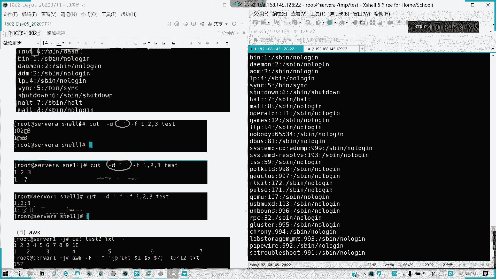

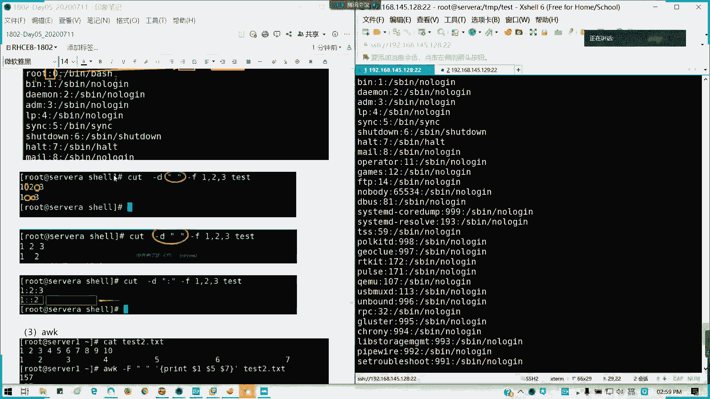

比如说我们这里123。对吧我们的文档是如果是这样的话，如果设到我们P passWD那个是标准格式文档。那么如果非标准格式，我们会怎么样呢？我们同样执行这个命令，我们要把123这三个字，我看能不能输出来。

这里空格。为风格服务啊。是不是他就以第一个作为分割符，然后后面的话就除了第一个我们审失正常之外，对不对？但后面的话你就觉得觉得怪怪的，对不对？翻哪去了？对不对？然后这里只输出个一。所以他这种方法呢。

他为什么会这样啊？他主要是把空的把空格。

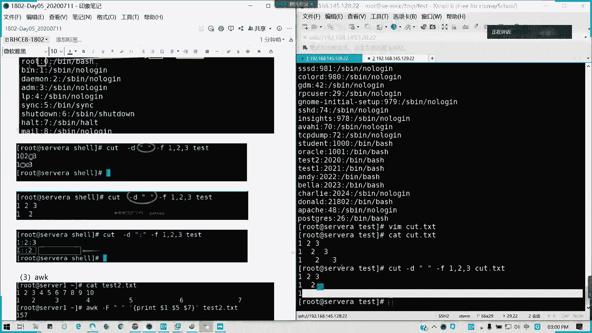

他只能容纳一个分格服装一个分格服。然后他只对于。

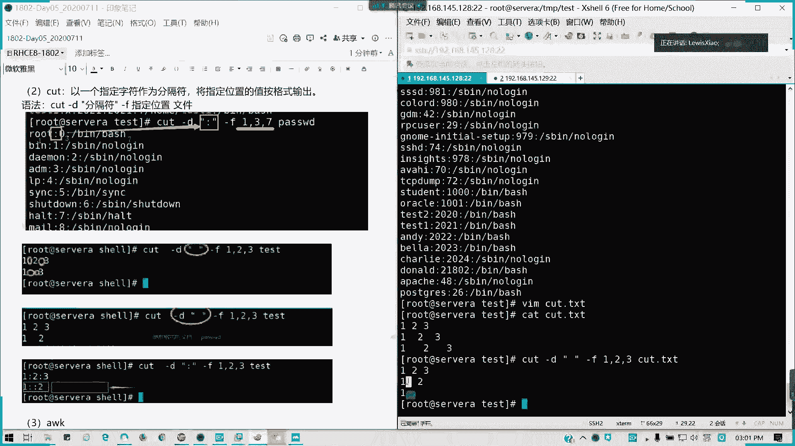

标准格式的文档有效。你看这个这个是正常的。这个是OK的啊，我们其实我们希望的是。诶。我们希望是这个结果，对不对？但结果这个呢。我的三哪去了，这个123都拿去了，对不对？我们对于这种文档的话。

我们个再用cut好像有点无能为力啊。

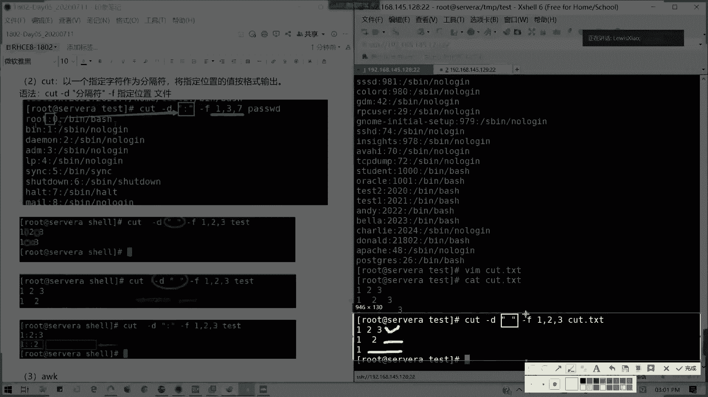

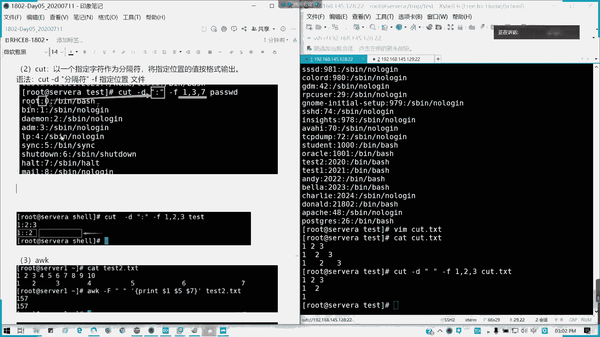

那我们再写一个。冒号，我们既然空格不行，我们冒号试一试呗。这不是空格啊，我用冒号对吧？

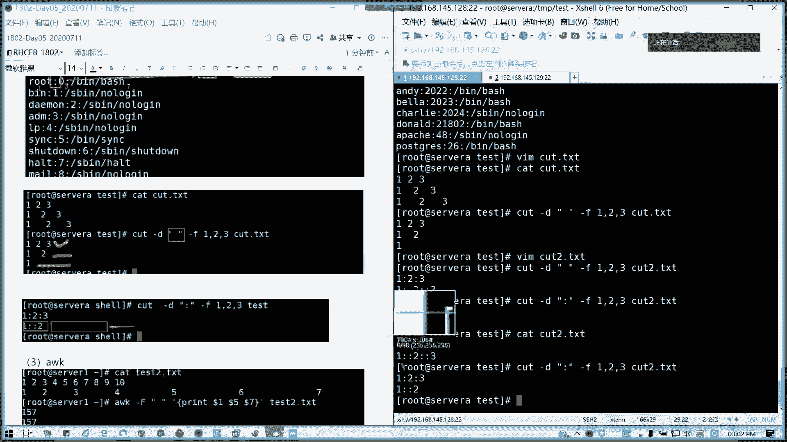

懂吗？像这种也不是标准的。我们我们前面的话以冒号输入到一输出123以冒号分隔123正常，对不对？但这里下面的话两个冒号它就不行了。懂我意思吗？然后冒号的话，他只输出了。前面这一部分没了。有这个风格。

他把漫画二作为一个元素了。懂我意思吧？它这里就相当于一分隔出来，然后漫画2它只能识别一个字符啊。这种是第一种，这是是我们要的效果，对不对？123这种出来它是标准格式的。

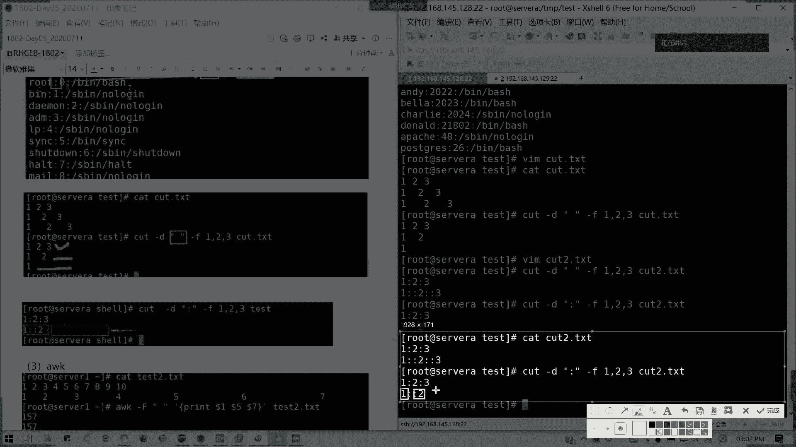

所以但是这种的话就很奇怪了。所以cut是有它的一个局限性啊。

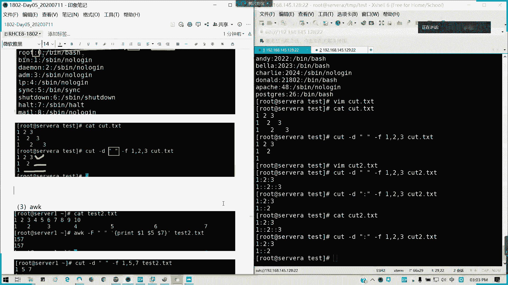

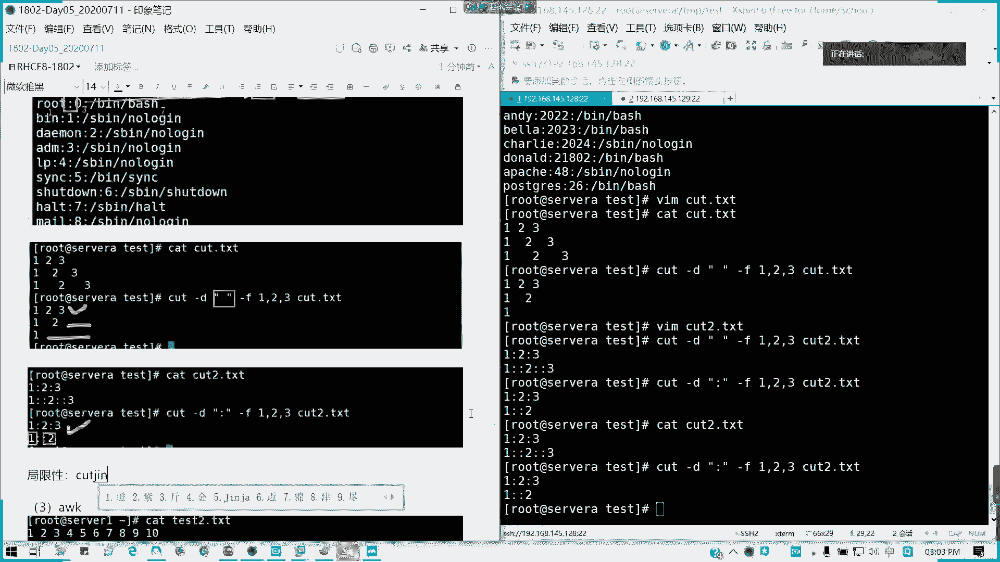

请。能识别。一个分隔符。且对。标准格式。文档能够精确处理。但对于。不管呃。非标准。它的一个cut局限性啊是在这里的。只能以一个字符作为风格，然后后面它是识别为另外一个字符了，对啊？另外一个位置的字符。

所以的话这个是有问题的那这个问题怎么解决呢？我们就交给AWK，但现在3点05分，我们稍微休息15分钟啊，3点20分我们讲AWK跟SCD。

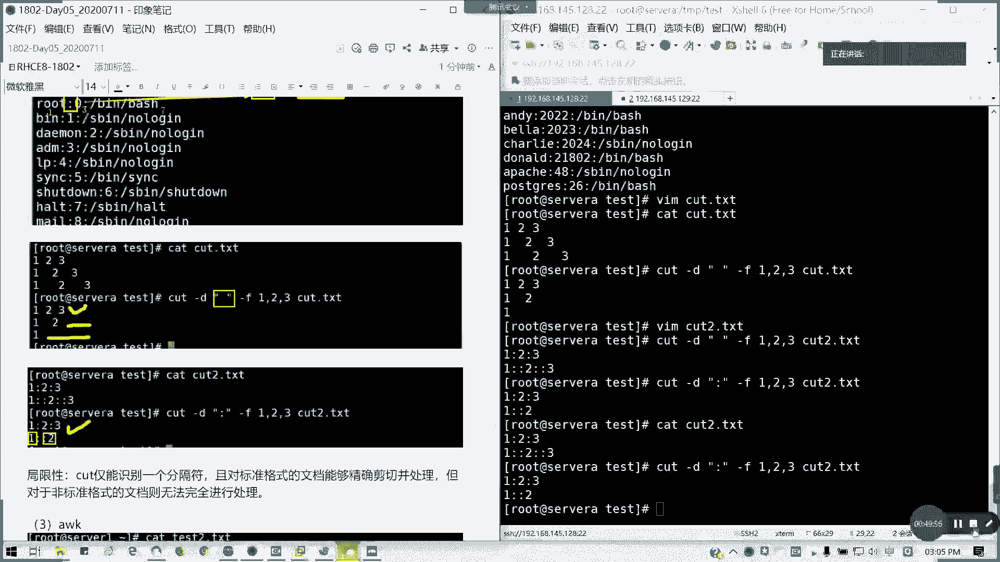