# 拿下证书！Redhat红帽 RHCE8.0认证体系课程 RH124+RH134+RH294三门认证视频教程 - P30：30_Video_Day05_RH134_Ch01_Shell基础02 - 16688888 - BV1734y117vT

好，我们回来3点30分啊，我们继续啊刚才说cut我们有局限性。那我们AWK的话就刚好解决了这个问题。它是可以进行标准啊进行截取，然后并标准化输出啊，标准化输出我们来。它的指令啊它指令就是AWK啊。

杠大F format啊for，然后后面分隔符引号里面是分隔符，然后呢。这里我动作指令，这里不要漏了一个单引号啊，动作指令我这里应该是一个半角符号才对的啊。动作指令。然后后面跟文件懂吗？

我们来看一看我们的一个例子。t2点TST我们这里面我们是一个文本啊，文本就1234567891090吧。或9十也行，随便啊，我这里用零吧，都代替一下，然后1234。Wu。6。去。8。我就写到这吧。对吧。

然后看一下出来。对吧我们的是不是下面就很不规则，上面是很规则的字符，对不对？那我们现在AWK我们截取它的一第一位第五位跟第七位的字符输出并显示。这样大F以空格作为分隔符啊，然后我们动作指定。Print。

多了一。多了5。多了7。然后对哪一个文件进行截取test2点TST。对不对？他把那个。将多个分隔符视为一个字视为一个字符。并去掉分隔符进行标准化输出。啊，懂了吧？所以为什么。我这里都能截束157。

因为它这么大的空格，它都识别成一个了。

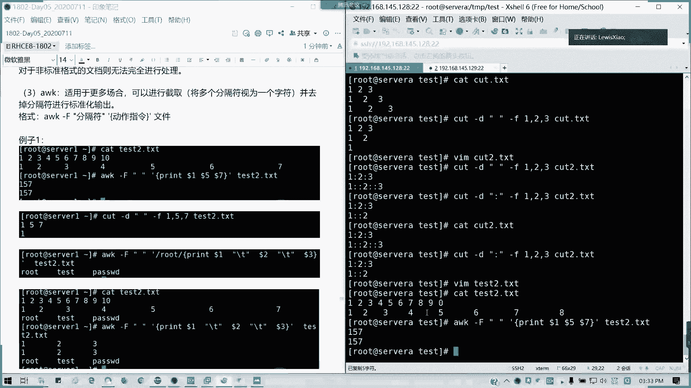

那这个是不是对于我们来说就一个标准化？然后如果加空格，我再自己再加就好了。那我的我 test测点TST我们是这样是这么写的，然后呢。

要AWK。那我们用cutt对比一下就知道了啊。我们cut同指定同样的命令杠低。157。杠F。157输出157。

很明显的对比啊很明显的对比。

诶。

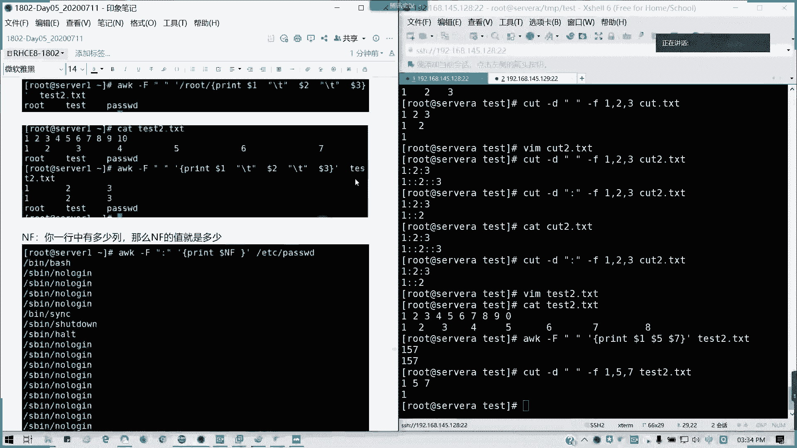

是不是很明显的对比啊？对吧。对吧两个很明显的区别，对不对？两很明显区别，一个我是正常输出157，但是另外一个的话，我只输出第一个，第二个的话一，然后后面就没了。对不对？它第五个元素都不知道跑哪去了。

都是空格。那我们也可以以关键字啊。那我们来看一看我我VI名的t3。我就假说是这样。那我。Root。pa始 pass upD是不？我们可以把这这一行加进去啊加进去。其实这行是怎么来的呢？这行是怎么来的。

就是。第三行我们怎么来的？我们其实对命令是生沉的啊。

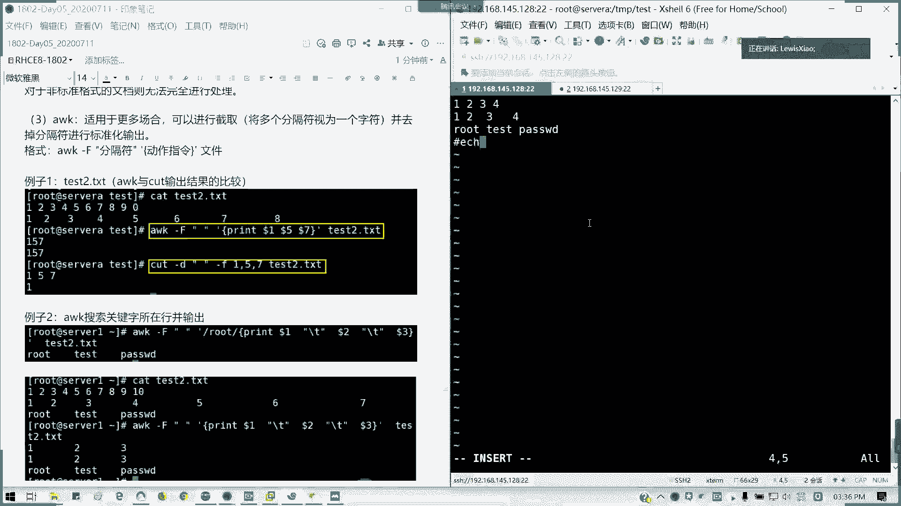

第三行的会怎么来？我截个图啊，第二行怎么来的？这里的话我们可以ele是吧？ele。

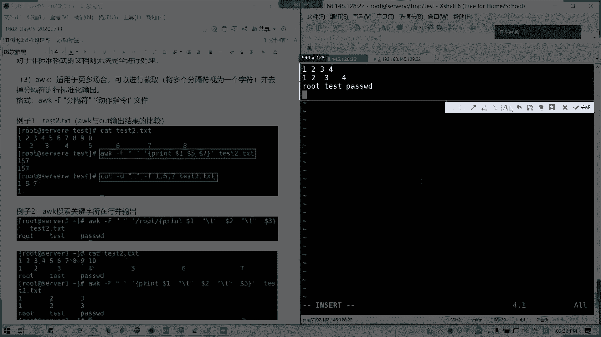

A口出来的啊，这里的话我们就随便写。cat test3。TST。然后呢，我们可以搜索关键锁在行，我们用两个撇。空格为分隔符，对不对？那么动作前面。root为关键字啊，用双斜杠，用双斜杠代表关键字啊。

就它输我们输出内行的关键字。然后后面呢我们采用那个print print啊，就是打印输出我们需要的一个结果，我们来看一看啊。我要输出的是多了一多了2多了3，然后呢，中间我加了一个制表符啊。

drink多了一。反斜杠T啊，我这里用双引号啊，它会。然后。到了2。多了3。这里的话也是加一个制表服。多了3，然后后面是。对不对？

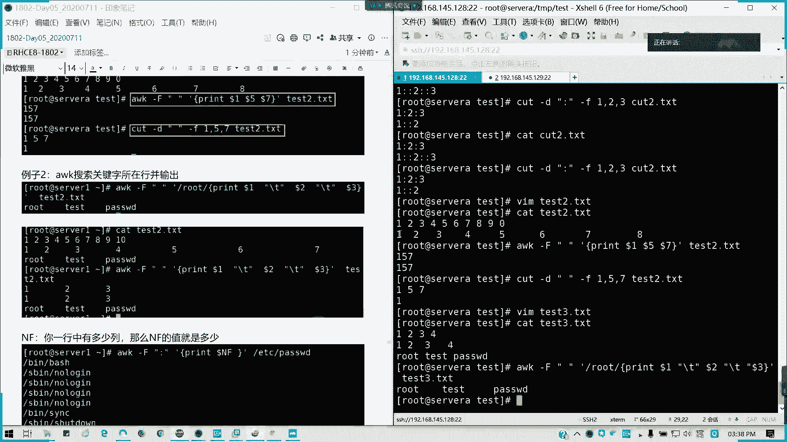

他这里是一个制表符啊，一个tab在这里。然后这个地方我们称之为。关键字。

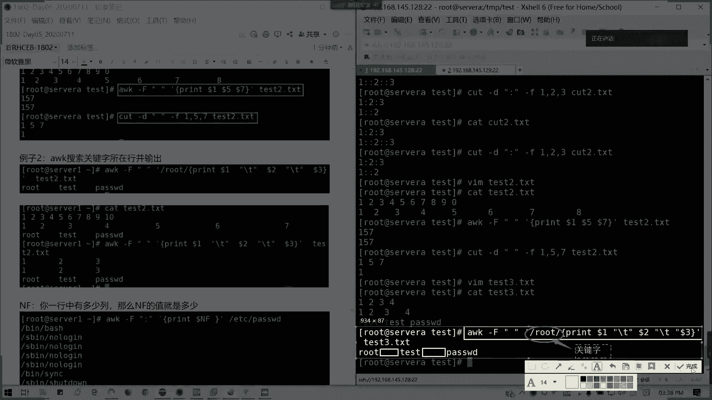

把图我替换了。对吧这个是我们的关键词啊，t3我们是这样子，然后呢。我可以啊我可以让他进行一个。标准化输出。我就把那关键字去掉，然后我这样把root这行我去掉，看看什么结果。是吧就统一啊统一输出。

就不管你是前面的那个有多乱，对不对？

不管你前面的字符有多暗，他会帮你就是进行一个标准化输出。

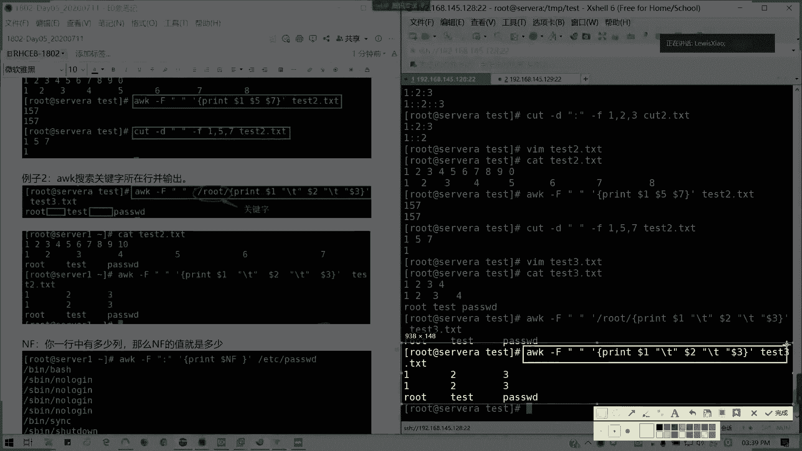

我应该把所有的资要接下来。Yeah。

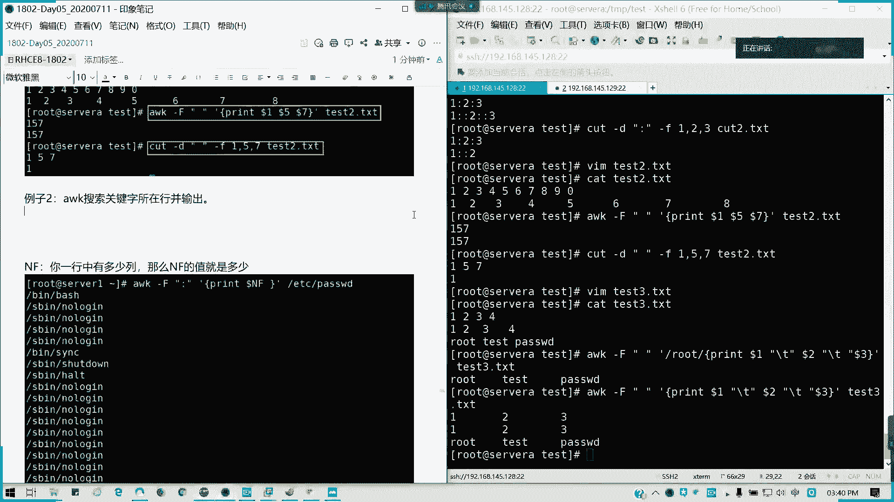

这个图好像还差一点点，我要把它加上去啊，这里我们加了一个制表符。

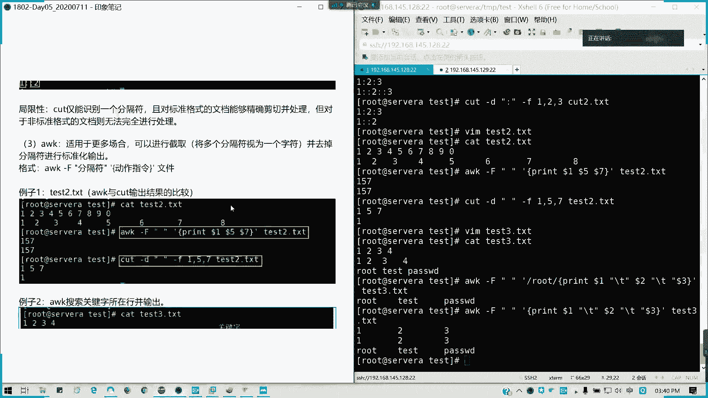

用别的颜色吧。

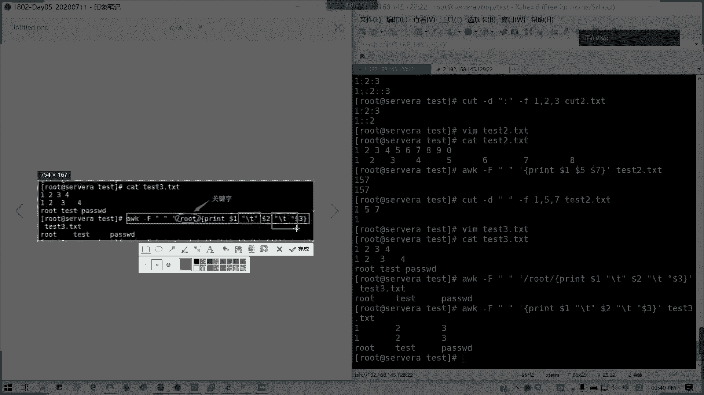

哎，好像不太对啊。可以变出来，然后呢。这里我。多了一个。应该是这样才对。

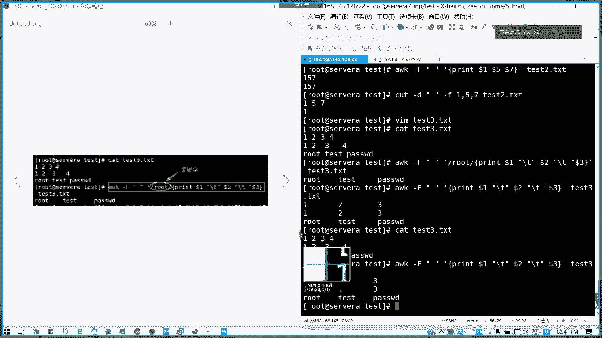

重新画一下图啊，抱歉。这三个啊这两个然后还有这个。

M。嗯。嗯，就这就这么多。

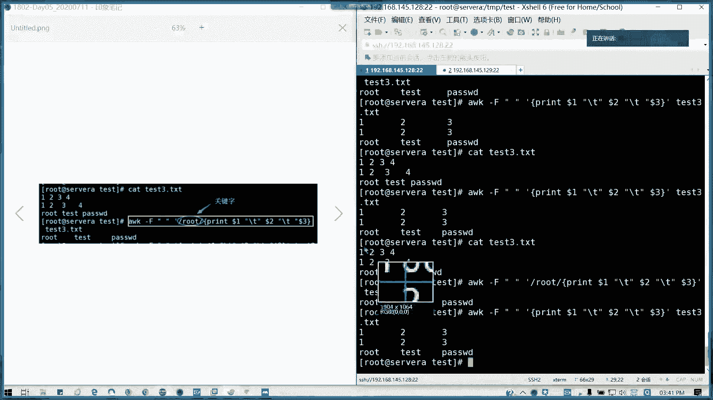

这一个跟这个是。这个呢是关键字。然后这里呢。这里我们使用的是制表符。

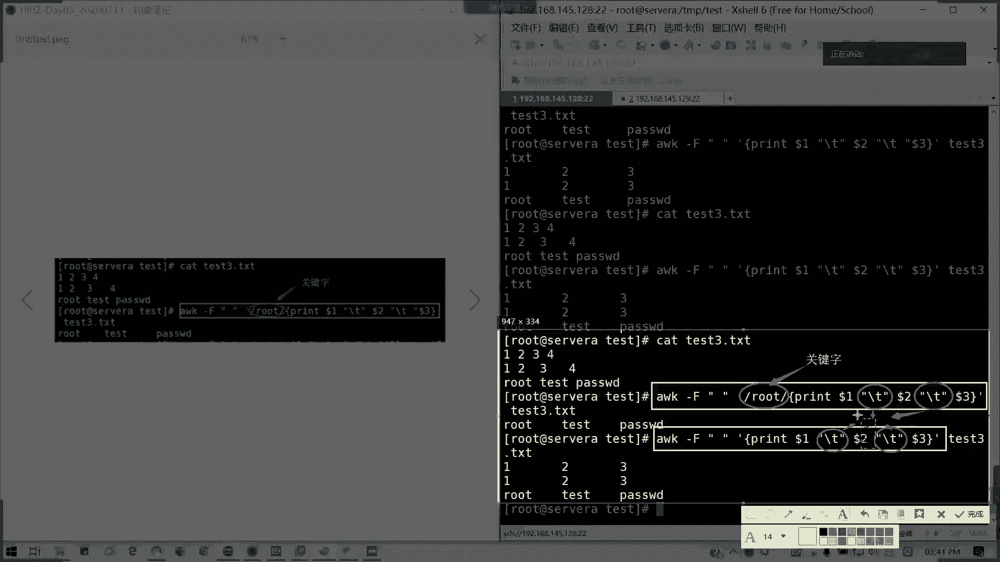

所以它其实可以作为一个很漂亮的一个输出啊。

这样可以看得懂了，可以看清楚了。关键是，然后我这里我可以统一的输出，对不对？统一输出，那这样的话就避免这个问题。就是说我cut的问题了，cut只能识别一个，然后后面的话就。

对吧后面它会识别成第二第三个元素的字符就比较麻烦了。所以呢这个的话，AWK我们牵推荐订大家去使用啊。然后我们还有这还有一个就是一个。

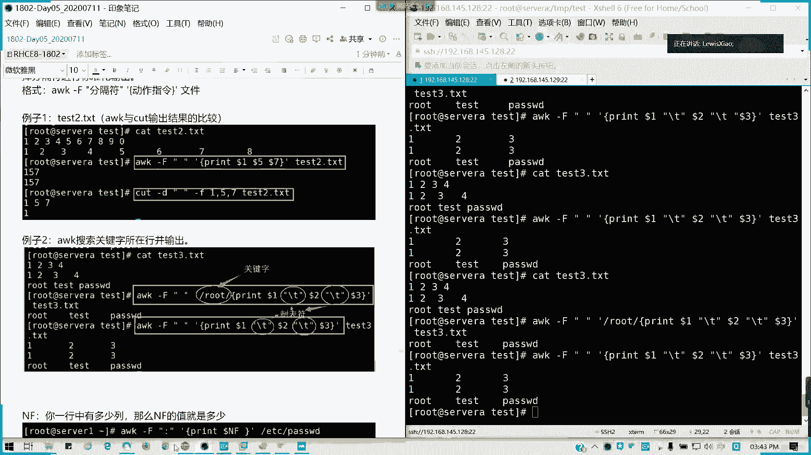

它有两个参数，一个叫NF，一个叫NR。NR的话，它就是一个。NF啊NF它这个变量呢。就是列数啊。NF在我们这里用AWK来来弄的话，就是一个列数。比如说我们这一行多少列是吧，多少列，它的列数多少。

然后我们直接打印这个多了NF，那就是最后一列，对不对？来，我们看一下。还是在TMP的 passsWD，然后动作是。printnt多了NF。ETC passWD对吧？我们就用tamp test吧。

用这pasWD就可以了。

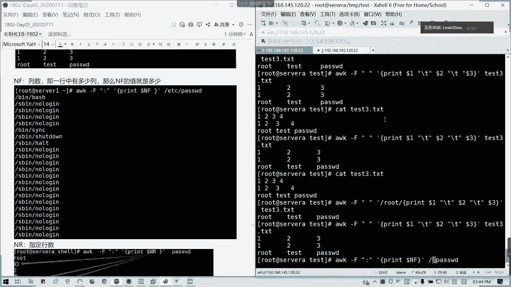

对吧我们输出的是不是。这个多了NF，也就是意思就是默列。

懂吗？这这个是。然后有一个多了NRN2是什么意思呢？A那呢是指定行数的第几个。它是它是一个行数，但用在。多了NF啊。A那是改个函数。然后如果第一行的话，它就是它的数是一嘛，第二行数是2，对不对？

第第几行。NR的值。就是几都来那呢。表示。第几行。对。第几行的第几列哈，这个是要注意的。像我们这里的话，用pre dollarNR，我们看一看。他们是不是输输入那个。

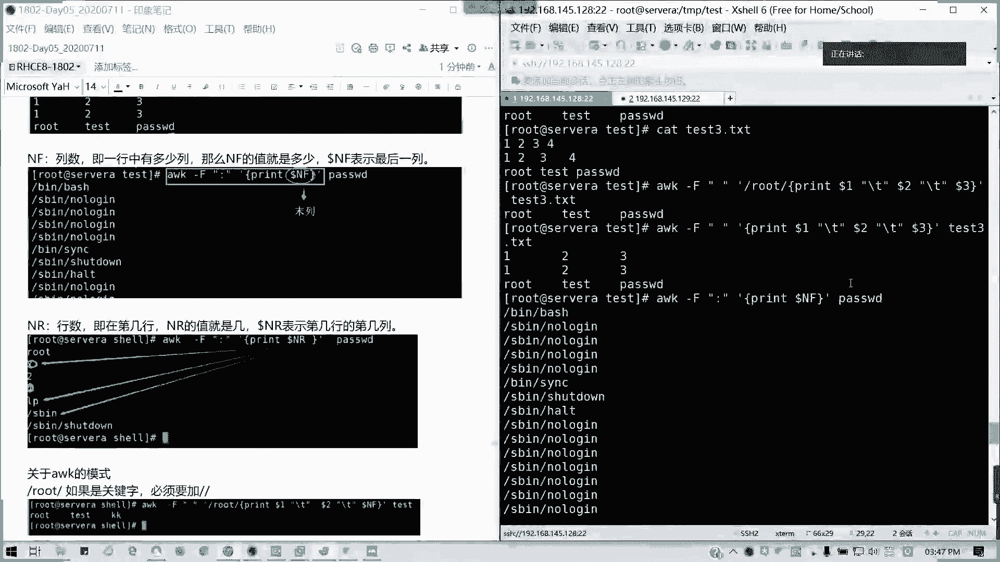

这是NF的NR是不是为什么出示这个结果？然后面全是空白。这因为我我差我当时在学的时候，我也差点搞不清楚这个意思啊。但是我们后来我们实验之后才得知啊，它是第几行的第几列，对吧？在第一行它就第一个嘛。

就相当于一个斜对角线。所以为什么下面是空白？😡，对吧。如果解释不对的话，可以反驳我啊。

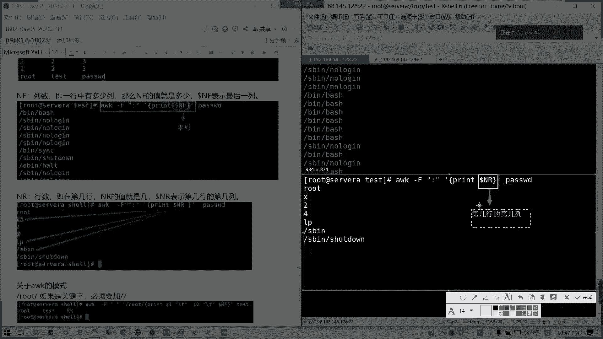

第几行的第几列啊？懂我意思吧？这个应该应该知道吧。然后呢，像AWK的话，我们如果指定关键字的话，我必须要加两个斜杠，这个懂吧？刚才已经说了。

都指定行好的话。我们就要采用指定行号啊，N2记得指定行号的话，我们是前面是N2等于多少的，等于一等于二等于3，指定行号输出啊，懂我意思吗？而不是说直接多了N娜多了N娜就出这种斜正角正的结果。

斜对角线的结果那就不对了啊。那么下面做一下我们这个。练习题目啊给大家15分钟时间，看能不能做写出来。

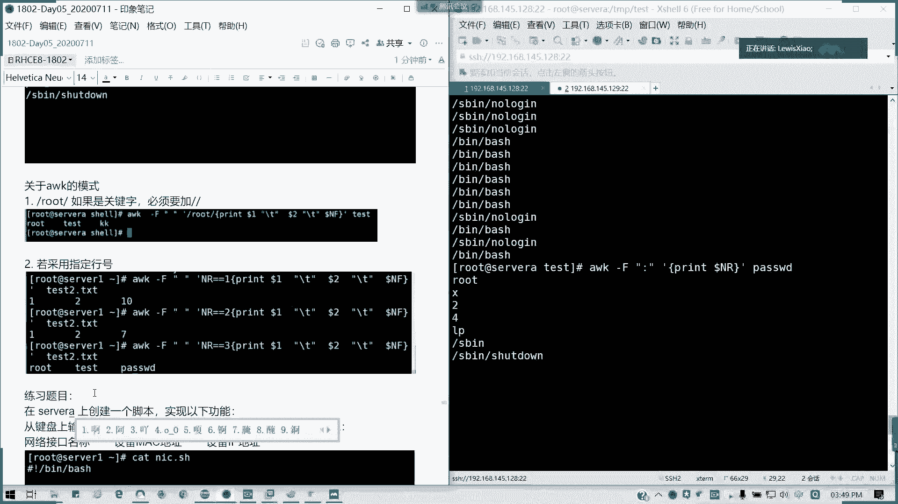

我复制到群里面，大家直接看群。这个也是蛮实用的一个巡检，我可以做巡检啊，对不对？这给大家15分钟时间试一下写。

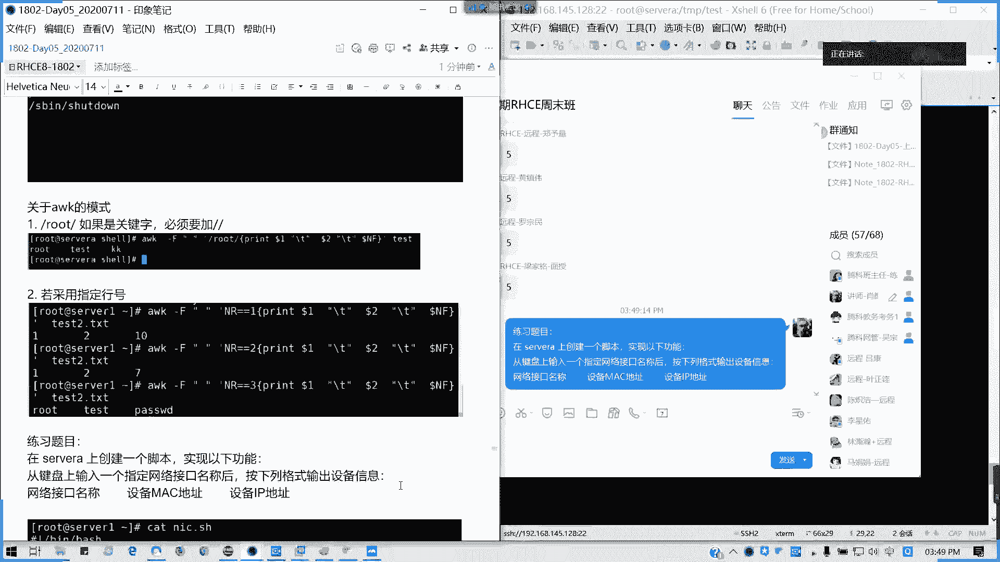

脚本记得多写啊，这种东西都是熟能生巧的那大家加油啊，我们4点钟我们来讲这个题目，给他1010到15分钟时间。能写出脚本那个执行生过请打一，现场的好像没有是吧？

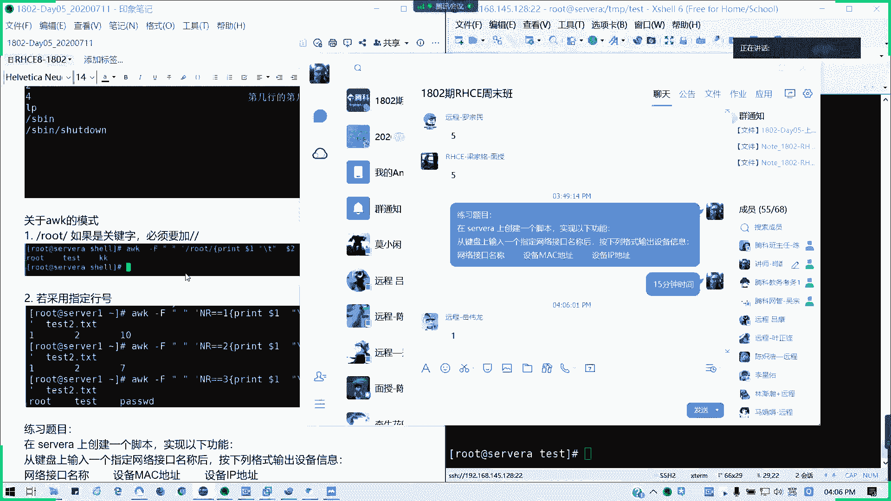

没有的话，我们来写一下。我们来写一下啊，我们看看这个脚本到底是怎么弄的。我来看看这个脚本。首先我们解析器还是要要写啊。我们的解析器还是要造血，然后呢来吧。看看啊。等下我拿一个东西。我们看一下解析器啊。

并办事还是照写。然后呢，接下来我要干嘛呢？我要输入一个网卡地址，那输入网卡地址是不是我们要提示一个，我这里写个注释啊。不是不是要提示我们的那个用户啊，我们直接这脚本用户，我们要输入一个网卡的名称。

那我这里写个注释，希望大家能够在那个希望他能够在写脚本时候多写注释。因为你这个脚本未来啊，哪怕你交接或者是给其他人的时候，不一定他们会看得懂。所以当我们建议多写注释。比如说这里做inport。The。

Lets work。Devicice。name here是吧？我就是让我这个注这里我们打减号注释，也就是说它实际上不会被执行，懂吧？相当于忽略相当于我们忽略掉。然后我们用read是吧？杠P，然后呢。

我们学一个提示语，breeze。Imput the network device name。冒号后面我留个空格啊，留个空格后面就让其实也就让我们那个键盘输入啊，这样输入，从键盘输入一个指定的。

一个网卡设备的名字。然后呢，我将它赋予一个变量，叫它画值全部一个变量，叫做DEV下划线量。懂吧，这是第一个。第二个的话，我输入之后，是不是我们获取他几个信息呢？首先第二个，我要获取到m克地址信息。

那我们。又一个变量de deviceice下划线麦克。等于这里我们是不是可以引用命令的一个结果啊？对不对？解用命令一个数字结果。

那我们这个IPAADDR我们IP address show啊ADR show然后呢。我们这里是不是刚才有输一个网卡名称，那DV name对不对？多了DV name。然后呢，我们用奥 AWK。

奥杠F以空格作为分隔符。然后呢，我们这里呢是。指定行号，我们的NR。他通常他的麦克地址是在第二行，我们可以不我们可以通过这边IPAADD show我们对比一下，对不对？他通常的。

是不是我们的行号在第二行。的第二个字符第二段。对不对？麦这是不是我们这我们的网卡的麦克地址？对吧那我们怎么写呢？A那两个等于哈N那两个等于A两个等于2。然后呢。喂，然后呢那个后面我们一个动作啊。

它指定个条件之后呢，一个动作。Prick。我输出的是空格分隔付的第二个就可以了，对吧？第二个参数，那这样的话，我们这个就搞定了，对吧？我们的麦克地址就这样搞定了。然后我要获取它的一个设备的IP。

get theIP address theIP address啊DVIP同样我们用命令获取。同样也是IPAADD show。多er deviceice name。用奥克莱杠F。这次也是用空格作为分隔符。

然后呢，引号。这次呢我们就那个以。innet作为开头，对不对？我们的IP地址是不是在这里啊？以I内作为开头，我获取内一行。然后呢，同样。他的动作。Srint。多了2。

我们获取第二个参第二个参数与空格作为一分隔符。然后呢，后面我输入输入最后的信息啊，输出最后信息。Print。R the base。formar就是我们按照要既定要求的格式来输出。那我们e一下。

友好一点啊。The network。Devicice。Information。Is list below啊。然后呢啊ECHO吧。然后这里就开始列了。保存退出，我可以下脚本出来。脚板这样子。然后呢。

SSH。那我输出一个网卡名证，比如说ES10。对吧这就是我们想要的一个结果，对吗？这就是我们想要的一个结果，能理解的请打一个Y，现场能理解，请举手。一个、2个、3个、4个、5个、6个都懂吗？

这脚本其实不难啊，只不过你要分析它怎么样去拆啊。

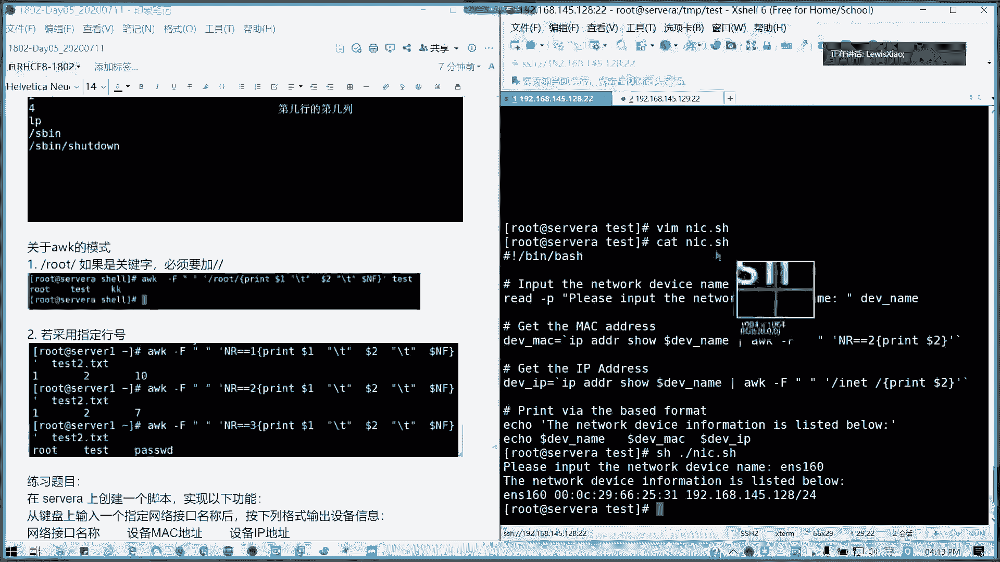

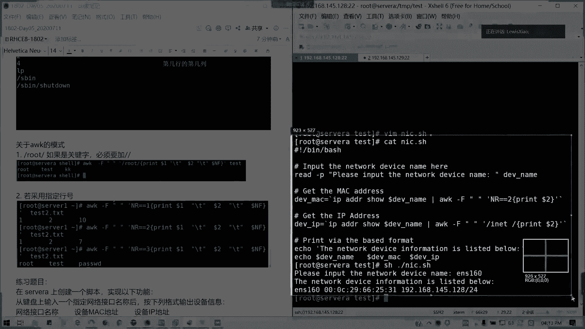

参考的答案啊。用为AWK，其实你看标准化输出就非常的简单了。

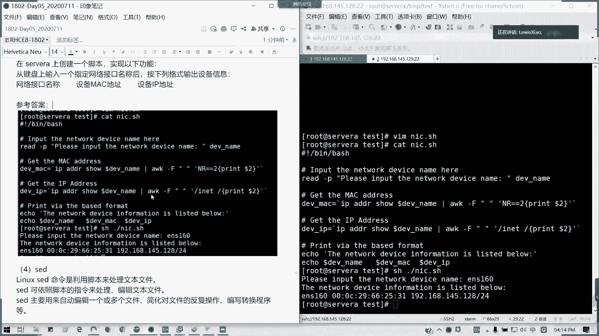

有点卡，我把它重新截一个图放到群里面。所以这个应用场景用在哪呢？我刚才说了，我们的每天的是吧，设备的巡检就可以加入这个东西，对不对？就可以加入这个东西。其实这些东西的话，我们还有其他用法，就不用输入。

它列出来对吧？列出来我的设备里面网卡磁盘啊，或者是说那个其他固定状态，然后是否正常启用正常工作。那这个就是我们日常应用的一个东西啊。

不要总在最前呢，不然我看不到啊，就这个场景大家应该知道吧，我们巡检的场合可以用。就不用每天的去敲命令去去获取信息。我们一个脚本一跑，写完就后易跑OK。这就像像您说这个其他老师讲的一些。

就是我描述场景东西我已经也也有了。好，那我们这一块的话，我们的OAWK就讲到这里。接下来我们讲一下sd啊，sd的话要讲的话，其实如果像AWK这样子，我们像O。

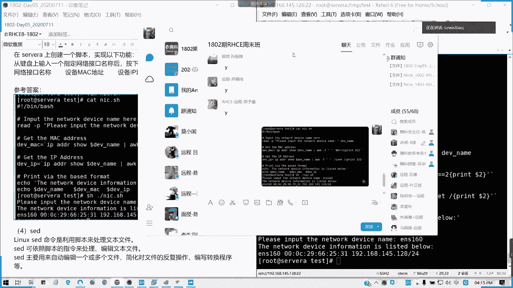

谁呀？好，我们继续录屏啊。sad命令呢主要是用来用利用脚本来处理文本文件，它是依照脚本的指令来处理编辑啊。它后它主要是用来编自动编辑一个或多个简化对文件的一个反复操作，编编辑转换程序等等啊。

像sad的语法，如果真的讲详细要讲两天。但是我这里的话，我只列一些基本用法可以吗？基本用法，我们的语句sd，然后呢，后面是带。选项对吧？选项参数，然后后面参数的是我们对应处理的一个文本文件。

像我们这里的话，就常见参数杠一是吧？杠一是代表说以指定的文件的处理，然后杠F是指它的指定的一个脚本。杠F是含有指定小粉的文件来处理。然后下面的几，然后下杠N的话就仅显示结果啊，不显示过程。

然后其他这两个选项其实没什么意义啊，就那个全帮助跟版本信息，这没什么意义啊。然后主要是后面它有一个动作，对吧？动作的话，比如说我们可以对文本进行新增。替换也就我们取代。删除是吧，删除插入打印。

还有一个就还有一个就是这个搭配。正则。表达式的取代。替换啊。通常是这样子，他这个是字符串。替换。对吧自不能替换。哎，这是否创会出现新的一行出现啊。所以我们来简单看一下几个情景啊，这里我就不太讲讲。

不太太复杂，我就简单来。讲讲几个情景好不好？在我们这里我们一个文件叫tex fire点TSD。我就写一个什么hellolinux啊，就这这类的，我是用来说那个用sad啊，用sad来。进行啊。

这也是一个linux一个简单的简介。我就假假设我输这么多内容。这个内容你可以自定义啊，我们在练习的时候可以自定义。我这里的话为了课堂的效果，我把它写出来。

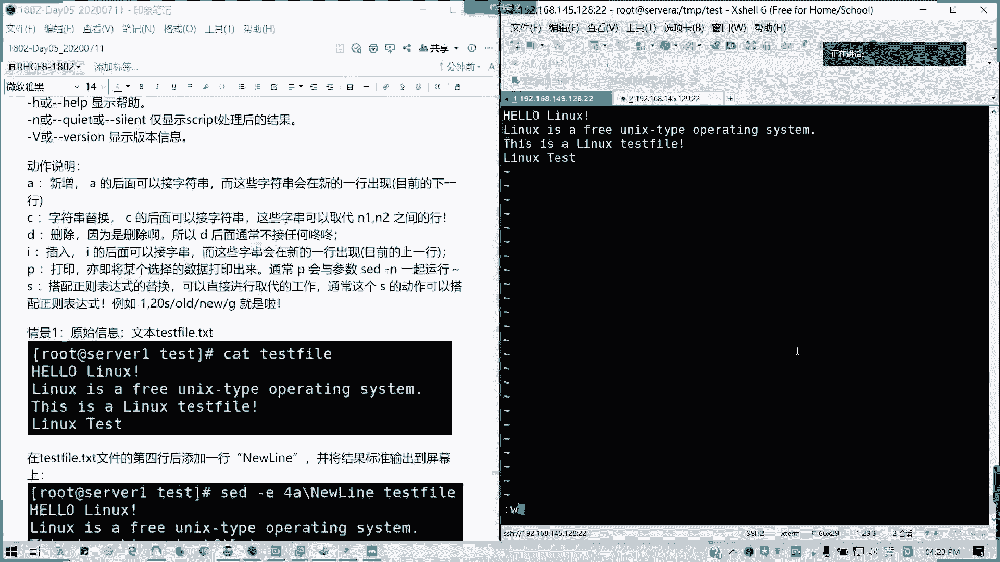

我们这个文文本文件叫text file。那我们现在我要把那个text file第四行，我加一行叫new night啊，怎么写？sad杠1啊杠一是代表的是那种。就指定脚本来处理输入的文件。

但是它不会改变我们实际文件的结果，它只会在屏幕上输出，懂我意思吧？这时候不我们输入我们通常这个s我们建议不要随便杠杠带杠I杠I的话，就可以直接改掉文件s一。

然后4A在第四行后面增加啊这行我们增加一个增加什么呢？new line一个新行，然后test fine。对吧。在屏幕上显示的结果就是我加了一个新航的，但实际上。文件是不是没改变了？

对吧只是说它文本处理的结果呢仅限于我们的屏幕显示啊，这种的话就s的一个应用的场场景啊，应用场景可以不需要打开VM编辑器，我们可以直接。可视化所见即所得，对吧？一条命令我们可以进行一个文本处理。

这是他所谓的场景，懂吗？通常来说，在企业里面，你如果你一个代码上千上百行上千行上万行，你不可能去打开VI文VI编辑器，一个个去找吧。对吧所以通过s的话是非常方便的那我们来接下来看第二个情景。

以行为单位的新增及删除。我们现在还是我们现在我们已经有这个passWD的文件。啊，不对啊。我们是不是已经有这个passwD文件，刚才我们复制过来，对不对？对吧？复制过来，我们以它来进行操作啊。

我们列出打印行号的操作是NLpasWD。对吧它就在前面输出在前面会加一列行号。那我们现在要加。第二到第五行删除。我们在后面就用管道是吧，把前面输出作为后面的输入。那sad。引号里面写动作。2。逗号5。

从第二行到第五行干嘛删掉？我们这里好像看不清楚啊，用默再看一下啊。诶。16789。对不对？就把第二到第五行已经删掉了，在屏幕显示里面把它去除了。但实际文件还在啊，因为我们还没有真正修改到文件。

所以的话就是屏幕列出来的，它就16789，懂我意思吗？这里呢原本是要输入杠一的啊，其实输入杠一跟有没有杠一都没有问题啊。对吧它的效果是一样的啊，带不带杠一，如果不带杠一，它默认是以脚本来出来处理文件。

就是它的一个文字处理脚本，懂我意思吧？那我如果只要删除第二行，那我就直接。2D是吧，那就1345678，我列出行后的结果就是让大家可以更直直观的看出我们sad的一个作用，懂我意思吗？OK。

然后我要删除第三行到最后一行，那就怎么样呢？删到多了低是吧？我们的多的是是末尾啊，对吧？只有银行没了。只有一二行没有东西了。那这个的话就是从第三行。3到末尾，这懂懂了。然后还有呢。我要插入东西。

我在第二行后面，我抄出一个叫drink tea。2A啊第二行添加。后面空格跟字符串。我用墨啊我用墨直直直接看一看来。在这里抄了。懂吗？第二行也就是第三行之前我插入了新格字符串。这里我是重复的啊。

然后如果我在第二行前面加。第二行前面加那是。2I对不对？前面。我在第一行这里后面加了。对吧。然后我还要加两行以上。🎼那我就2A是吧？2A。drink tea，然后我可以分段显示哦是吧，点点点点点点。

🎼那我这里我用一个反斜杠，反斜杠是标明命令，我们可以分行输入，对不对？分行输入。然后我这里再输一个drink beer。对吧。分行啊，我在后面出刷入两行东西，懂我意思吧？出刷入两行东西。记住啊。

我们每一行之间必须要用反斜杠来进行新新新行的添加。所以上面的例子里面，我们每一行我们发现在第一行最后面就有一个反斜杠的一个存在。反斜杠在我们在访问命令行，是不是不是是不是把命令可以拆成两半。

分成两行多行输入，对不对？然后我们看一下情景。3，我们。来进行一个替换啊，刚才我们是插入，对不对？我们进行一个替换。替换的话，我们可以用C啊来进行字符串的替换。我们这里还是这个文件。第二到第五行。

我把它替换成一个行叫number two to five。No 2 to five number。是不是这里已经被。换掉了。对吧。第二行的第五行你没了，就换成这就换成这个字符串。然后呢。

我要仅列出5到7行。我们用杠N啊杠N参数，然后呢。5到7。列出来print。5到7P。对不对？列出5到7行，然后我们还有就是我们还有个功能，就是我们搜索数据并显示依然是这个文件。

我们要搜索root带root关键字行，并列出啊。我们还是an help，对吧？然后C的。我们这里的关键是用这里套上，用root两个斜杠套上，然后P。那这样的话，它除了输入，就除了我看一下，在这里。

我截个图啊，我上次没没有截那么，就可能没截那么清晰。就我们在这里除了输出他的行之外，它其他行也会显示，这以你会会看到有两个重复的哈。好吧。它除了输出所有行会输出匹配的行。所以的话它它有那个符合条件的行。

它会输出两次，懂我意思吗？然后还有呢就是只打印模板的行，也就是我们用杠N啊，杠N只输出指定的结果。对吧那就只输出这两行了。如果是没没加的话，那就只有那就全部全部。然后加上你这两行会叠叠着输。

然后我们还有搜索并删除的。我们这里把P看成Ddelete啊。我们是不是把刚才的第一行跟第十行？已经去掉了，对不对？就是还有root这两行已经不输出了。就这一行原本在这里的，我就把我用箭头把它凹出来。

对吧这两行没了。其他输错的都不是root的关键字的。然后我还可以进行说那个。我还可以进行数据的搜索，还有执行命令。比如说我要把后面的S，我把里面花括号的一串命令，我把它替换掉。对不对？

把be替换成blue share，我怎么弄？C的杠N我只输出这一行就行了，只输出指定结果的行。我搜索root这这一关键字，然后执行一串命令S是吧？替换对吧？替换开头，然后把beash换成。

我 shall。然后我并显示并退出啊，显示并退出。我这里加分号的话是。就是我们分叉进行的动作，回车对不对？就输错结果就变成brue shell了。表人是病败事，对不对？变得不如说偶了。

然后还有搜索并替换啊，除了整行处理，我们还可以行单位进行部分的数据搜索并替换啊。基本上除了set的搜索替代操作与VIM是相当的类似的。对吧。他的语法。sad然后后面S是吧，将要被。替换的字符串的字符串。

然后新的字符串后面杠G，对不对？是不是跟跟我们。跟我们VIM是不是很像？那我们来看一看我们原始信息。IF config。EN10。我们本机的IP。我们这里是14。128，我们昨天我在别的班讲课的时候。

别的班讲课是201啊。哇，这个我把图换换换一下啊。顺应上顺应信息啊，我们看到这个IP是14。128，我们可以。我们最终目的就是只获取到这个IP地址，怎么做？用set命令。我们首先将我们分布啊。

我们首先将前面的删掉，把ID前面部分也有删除。我们用管道是吧，分步处理。我们获取一个叫。in net对吧？in net这一行，然后呢s。S对吧？然后肩这一开头以。I在开头之前的。点新I那就是前面啊。

以I开头的前面的部分。然后替换成空。懂吗？这个知道什么意思吗？把I开头把整个I代开头的部分。去掉开文一行开头按列这一块，我替换成空值。那我出现什么结果？是不是这样了，对吧？我这里是分布来进行。

是不是把in把后把下面的I6也没了，对吗？好，我们继续把IDA后面的予以删除，我们再进行一次sad。S，然后net mask，因为我们后面是往掩码嘛，对吧？把掩码后面的点。新就所有的部分一直到末尾。

替换对吧？第二轮空子。诶。我好像漏了一些什么东西啊，我看一下nma，然后多了哦，我这里多了一个，对吧？我们就把那个卡掉了，但是到后面还有一串东西啊，preface这些东西，对不对？那我们。

仅输出1个IPP4地址，那我们就把那个。我再进行一个sad。迭代。S是吧，开始替换，把内容。把六后面的到末尾了。所有内容。不要了。这就是我们一个。令令实施的一个阶段的一个结果，对吧？

三下五除二砍到只剩1个IP4地址，那这就是我们的一个目的啦。这s的话，我们的一个如获取一个信息啊，我们获取一个信息的话，一个典型应用啊。如果我这里用的分布操作啊分布操作。

然后后面最后面呢是我们的一个整体的一个结果。诶。这个好像我觉少的部分。能理解吗？有问题可以问啊。能理解吗？这个其实超实用的啊，比V案编辑计程方便好多啊，对吧？那我们多点编辑，多点编辑，我可以。

用多个杠一是吧，多点编辑。我还是编辑到Ppa upDJ文件。然后呢，SCD5-1是吧？我把三第三行的末尾数据删除，其实得多个杠一的话就是。对吧。多个杠一，我们就可以继多步操作。对吧同时删除。

然后我把它它替换了，这是多点操作。然后直接修改内容。这是比较危险的sad是可以直接修改内容，用杠I参数，不必须要管道和数据进行重输入重新上。不过这个呢会影响修改原始文件，所以千万不要拿配置文件测试。

我们这里的话我们编辑一个叫sad点TSD，我们来来做一个例子。比如说我这里有google点。淘宝点腾讯点togogle点微博点是吧？我们编辑这个来做一个示例。把它set把它开出来。

然后我们要利用sad直接修改文件，把它的每一行的点变成感叹号，对吧？这是不是很实用的一个东西，批一量修改文本。S6杠I，然后这里记得用转译啊，用取消转移懂吗？第一个是我替我要分隔的，第二个替换字符。

我这里要取消它的转译，使用它原本的点，懂吗？因为点是在shall里面是有特殊含义的，所以的话我要取消它的转译。然后一直到。对吧一一直到结尾啊一要结尾，然后呢，就把它后面的全部替换了。然后呢，这里。

把它替换成感叹号。转单号也就是有特殊含义说我要取消他转业SED。点TST。让我们再看一下。懂吗？变了。所有的以末尾为点的全部换成了改叹号。直接修改文件，用SED杠I懂我意思吗？

sad杠I，然后还有一个例子，就是我们后面啊。他是替换到最后一行的对吧？多了是替最后一行。然后呢，我可以直接在后面我加一句叫dis test杠I。然后我这里引号出来。多了A啊，最后一行添加什么？

This is a test。然后SED点TST。对吧。可以直接编辑出来这个结果了，懂我意思吧？do了是最后一行操作是添加，然后后面操是添加的内容。因为多所以的话这个它可以修改，它这个功能虽然危险。

但是非常有帮助。举例子说，比如说我1个100万行的一个文件，那我要在100行添加文字，那就是会疯掉的对？打开都会很长时间。所以SED直接修改替换的功能，那就甚甚至我们VIM。都不需要用它了。

这个这块能懂吗？可以的话，请举手啊，现场请举手。然后呢，如果远程的，我看一下远程的这一块，我们这里我们也进行一个中场消息休息啊，远程的可以请打C啊，字母C。

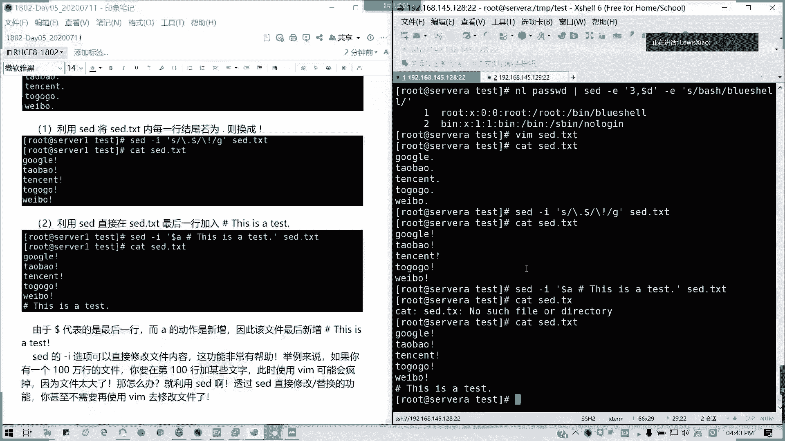

我 said的我就讲这么多，但其实已经把常用的功能已经。涵盖了。对吧常过那个涵盖了，讲不了太多的，就基本的我会可以讲的。像像之前可能老师有些知识根本就跳过，没怎么讲的。但这里基本上懂怎么用了吧。

如果OK的话，我们休息15分钟，我们5点回来。因为今天要上午6点钟。就因为少了一天课，上6点钟补1个小时。我们回来讲什么呢？讲特殊符号的含义。啊，还是继续需要的内容，讲特殊符号的含义。一二是什么意思啊？

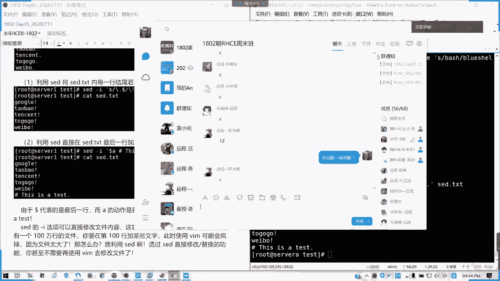